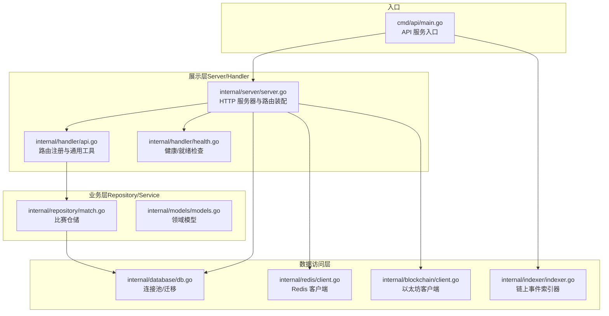
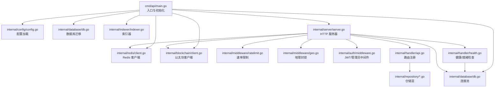
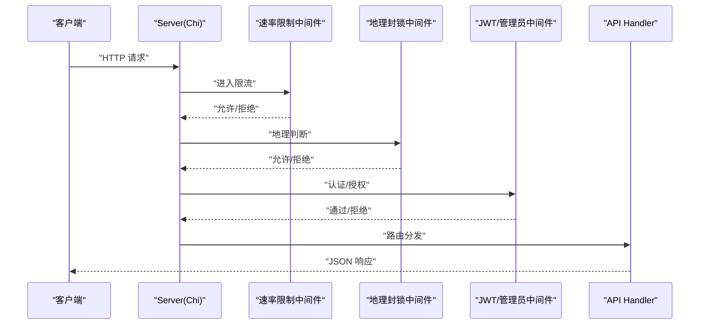
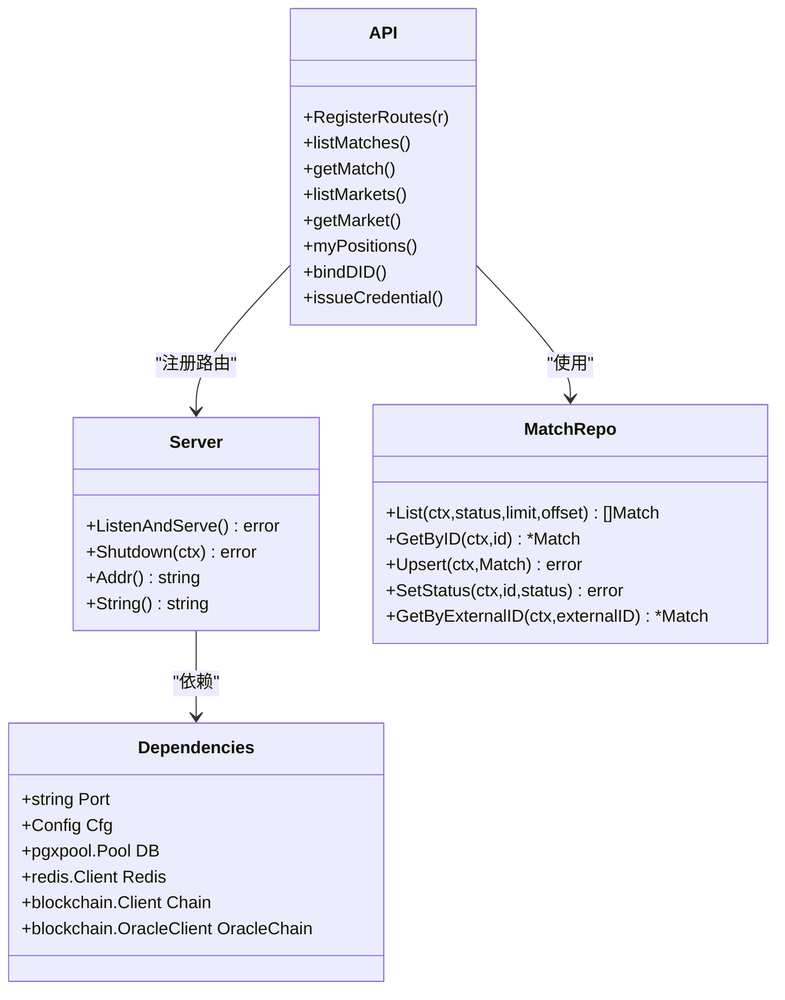
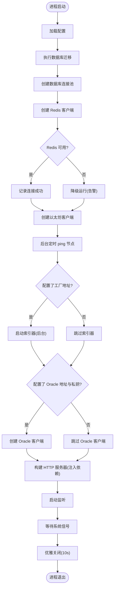
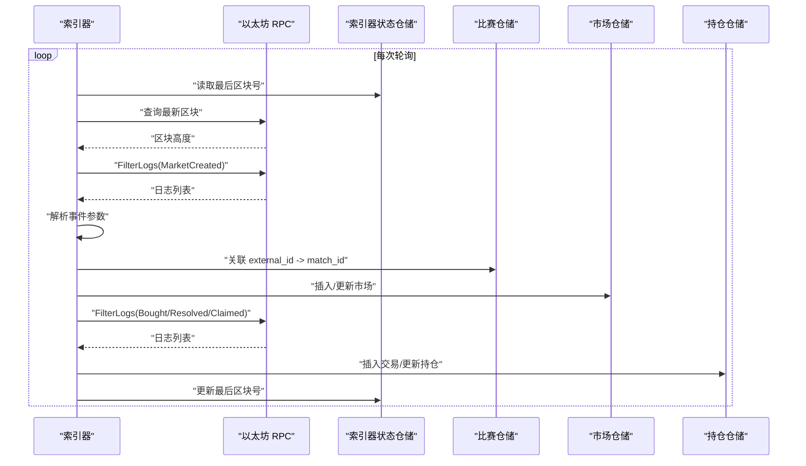
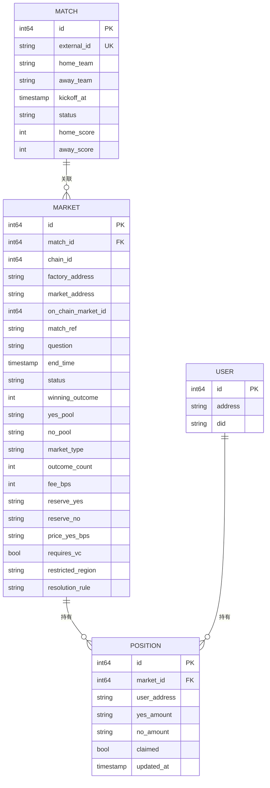
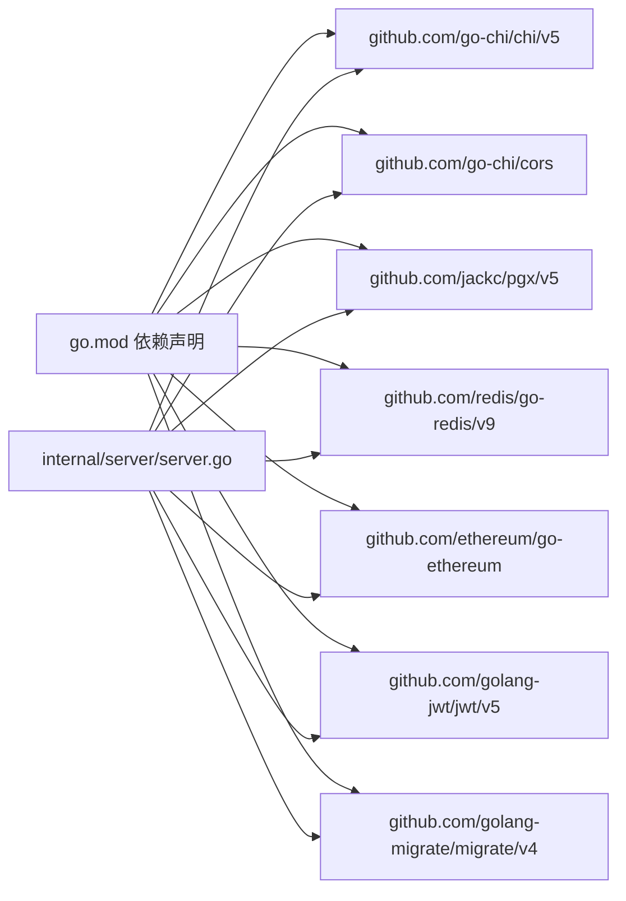

# 整体架构

<cite>
**本文档引用的文件**
- [cmd/api/main.go](file://cmd/api/main.go)
- [internal/server/server.go](file://internal/server/server.go)
- [internal/handler/api.go](file://internal/handler/api.go)
- [internal/handler/health.go](file://internal/handler/health.go)
- [internal/config/config.go](file://internal/config/config.go)
- [internal/database/db.go](file://internal/database/db.go)
- [internal/redis/client.go](file://internal/redis/client.go)
- [internal/middleware/ratelimit.go](file://internal/middleware/ratelimit.go)
- [internal/middleware/geo.go](file://internal/middleware/geo.go)
- [internal/auth/middleware.go](file://internal/auth/middleware.go)
- [internal/repository/match.go](file://internal/repository/match.go)
- [internal/blockchain/client.go](file://internal/blockchain/client.go)
- [internal/indexer/indexer.go](file://internal/indexer/indexer.go)
- [internal/models/models.go](file://internal/models/models.go)
- [go.mod](file://go.mod)
</cite>

## 目录
1. [简介](#简介)
2. [项目结构](#项目结构)
3. [核心组件](#核心组件)
4. [架构总览](#架构总览)
5. [详细组件分析](#详细组件分析)
6. [依赖分析](#依赖分析)
7. [性能考量](#性能考量)
8. [故障排查指南](#故障排查指南)
9. [结论](#结论)
10. [附录](#附录)

## 简介
本项目为 PredictionDIDSimple 的后端服务，围绕“展示层 -> 业务层 -> 数据访问层”的分层架构设计，采用依赖注入模式集中管理跨层依赖，结合事件驱动架构（链上事件索引器与 SSE 事件流）实现链上数据的实时同步与推送。系统通过 Chi 路由器提供 RESTful API，配合自研中间件体系实现速率限制、地理封锁、认证鉴权等横切能力；数据库采用 PostgreSQL + 连接池与迁移机制，缓存采用 Redis（可降级），区块链交互通过以太坊客户端封装。

## 项目结构
项目采用按“领域/职责”分层的组织方式：
- cmd：应用入口点（多命令入口：api、indexer、migrate、oracle、reconcile、seed、sync）
- internal：核心业务与基础设施
  - config：配置加载与解析
  - server：HTTP 服务器与路由装配
  - handler：路由与控制器（按资源分组）
  - repository：数据仓储（面向领域模型）
  - database/redis：连接池与探活
  - middleware：自研中间件（速率限制、地理封锁）
  - auth：认证中间件（JWT、管理员密钥）
  - blockchain：以太坊客户端与 Oracle 客户端封装
  - indexer：链上事件索引器
  - models：核心领域模型
  - vc：可验证凭证（未在本架构图中展开）
- migrations：数据库迁移脚本
- pkg/contracts：合约 ABI 资源

图表来源
- [cmd/api/main.go:27-161](file://cmd/api/main.go#L27-L161)
- [internal/server/server.go:44-102](file://internal/server/server.go#L44-L102)
- [internal/handler/api.go:34-69](file://internal/handler/api.go#L34-L69)
- [internal/handler/health.go:21-26](file://internal/handler/health.go#L21-L26)
- [internal/repository/match.go:20-23](file://internal/repository/match.go#L20-L23)
- [internal/database/db.go:16-24](file://internal/database/db.go#L16-L24)
- [internal/redis/client.go:12-21](file://internal/redis/client.go#L12-L21)
- [internal/blockchain/client.go:22-28](file://internal/blockchain/client.go#L22-L28)
- [internal/indexer/indexer.go:38-65](file://internal/indexer/indexer.go#L38-L65)

章节来源
- [cmd/api/main.go:27-161](file://cmd/api/main.go#L27-L161)
- [internal/server/server.go:44-102](file://internal/server/server.go#L44-L102)
- [internal/handler/api.go:34-69](file://internal/handler/api.go#L34-L69)
- [internal/handler/health.go:21-26](file://internal/handler/health.go#L21-L26)
- [internal/repository/match.go:20-23](file://internal/repository/match.go#L20-L23)
- [internal/database/db.go:16-24](file://internal/database/db.go#L16-L24)
- [internal/redis/client.go:12-21](file://internal/redis/client.go#L12-L21)
- [internal/blockchain/client.go:22-28](file://internal/blockchain/client.go#L22-L28)
- [internal/indexer/indexer.go:38-65](file://internal/indexer/indexer.go#L38-L65)

## 核心组件
- 服务器与路由装配
  - 服务器通过依赖注入聚合 DB、Redis、区块链客户端、Oracle 客户端等依赖，统一注册健康检查与 API 路由。
  - 路由层按公开、认证、管理员三类权限分组，统一使用 Chi 路由器与中间件栈。
- 配置管理
  - 从环境变量加载运行配置，包含数据库、Redis、RPC、合约地址、索引器参数、速率限制、合规开关等。
- 数据访问层
  - 数据库采用连接池与迁移；仓储层封装 SQL 查询与 Upsert 逻辑；模型定义清晰的领域对象。
- 中间件体系
  - 速率限制（基于 IP 的滑动窗口）、地理封锁（国家代码 + 黑名单）、JWT 认证、CORS、请求追踪等。
- 事件驱动架构
  - 索引器周期轮询链上事件，解析 MarketCreated/Bought/Resolved/Claimed 等事件并落库；SSE 流式推送比分事件。

章节来源
- [internal/server/server.go:29-38](file://internal/server/server.go#L29-L38)
- [internal/handler/api.go:18-31](file://internal/handler/api.go#L18-L31)
- [internal/config/config.go:12-46](file://internal/config/config.go#L12-L46)
- [internal/repository/match.go:25-63](file://internal/repository/match.go#L25-L63)
- [internal/middleware/ratelimit.go:28-40](file://internal/middleware/ratelimit.go#L28-L40)
- [internal/middleware/geo.go:14-41](file://internal/middleware/geo.go#L14-L41)
- [internal/auth/middleware.go:17-43](file://internal/auth/middleware.go#L17-L43)
- [internal/indexer/indexer.go:97-120](file://internal/indexer/indexer.go#L97-L120)

## 架构总览
系统采用分层架构（Presentation -> Business -> Data Access），配合依赖注入容器（以结构体聚合形式体现）与中间件栈，形成清晰的职责边界与可扩展性。入口点负责初始化配置、数据库迁移、连接池与客户端、索引器与 Oracle 客户端，随后启动 HTTP 服务器并等待优雅关闭信号。

图表来源
- [cmd/api/main.go:27-161](file://cmd/api/main.go#L27-L161)
- [internal/config/config.go:48-104](file://internal/config/config.go#L48-L104)
- [internal/database/db.go:33-50](file://internal/database/db.go#L33-L50)
- [internal/redis/client.go:12-28](file://internal/redis/client.go#L12-L28)
- [internal/blockchain/client.go:30-46](file://internal/blockchain/client.go#L30-L46)
- [internal/indexer/indexer.go:97-120](file://internal/indexer/indexer.go#L97-L120)
- [internal/server/server.go:44-102](file://internal/server/server.go#L44-L102)
- [internal/middleware/ratelimit.go:42-66](file://internal/middleware/ratelimit.go#L42-L66)
- [internal/middleware/geo.go:14-41](file://internal/middleware/geo.go#L14-L41)
- [internal/auth/middleware.go:17-43](file://internal/auth/middleware.go#L17-L43)
- [internal/handler/api.go:34-69](file://internal/handler/api.go#L34-L69)
- [internal/handler/health.go:21-26](file://internal/handler/health.go#L21-L26)

## 详细组件分析

### 服务器与路由层（Server/Handler）
- 服务器职责
  - 负责创建 Chi 路由器、注册全局中间件（请求追踪、真实 IP、日志、恢复、速率限制、地理封锁、CORS）、装配健康检查与 API 路由处理器。
  - 通过依赖注入结构体聚合 DB、Redis、区块链与 Oracle 客户端，确保路由层只关注业务编排。
- Handler 路由组织
  - 公开接口：比赛/市场查询、平台统计、合规名单、KYC 回调、SSE 比分流、指标导出。
  - 登录接口：SIWE 钱包登录、VC 校验。
  - JWT 保护接口：我的持仓、绑定 DID、我的凭证。
  - 管理员接口：Oracle 任务列表、注册/作废市场、重试任务、颁发凭证。
- 中间件系统
  - 速率限制：基于 IP 的滑动窗口，每分钟限额，健康检查豁免。
  - 地理封锁：根据 CF-IPCountry 或 X-Country-Code 头判断国家，命中黑名单返回 403，同时异步记录审计日志。
  - JWT 中间件：从 Authorization Bearer 头解析 JWT，注入钱包地址到上下文。
  - CORS：允许指定前端来源与敏感头，支持凭据。

图表来源
- [internal/server/server.go:44-102](file://internal/server/server.go#L44-L102)
- [internal/middleware/ratelimit.go:42-66](file://internal/middleware/ratelimit.go#L42-L66)
- [internal/middleware/geo.go:14-41](file://internal/middleware/geo.go#L14-L41)
- [internal/auth/middleware.go:17-43](file://internal/auth/middleware.go#L17-L43)
- [internal/handler/api.go:34-69](file://internal/handler/api.go#L34-L69)

章节来源
- [internal/server/server.go:44-102](file://internal/server/server.go#L44-L102)
- [internal/handler/api.go:34-69](file://internal/handler/api.go#L34-L69)
- [internal/middleware/ratelimit.go:42-66](file://internal/middleware/ratelimit.go#L42-L66)
- [internal/middleware/geo.go:14-41](file://internal/middleware/geo.go#L14-L41)
- [internal/auth/middleware.go:17-43](file://internal/auth/middleware.go#L17-L43)

### 依赖注入模式与系统边界
- 依赖注入容器设计思路
  - 以结构体聚合的方式替代传统 IoC 容器：Server 的 Dependencies 聚合 DB、Redis、区块链、Oracle 客户端等；API Handler 聚合各仓储与服务。
  - 入口点负责组装依赖并通过 New(...) 构造器注入，避免全局状态与循环依赖。
- 系统边界
  - 展示层：仅负责路由与中间件，不直接访问数据库。
  - 业务层：仓储封装 SQL 与领域逻辑，不感知 HTTP 协议。
  - 数据访问层：数据库、Redis、以太坊 RPC，提供稳定接口。
- 技术决策权衡
  - 采用 Chi 路由器而非更重的框架，兼顾性能与易用性。
  - 中间件栈内聚横切关注点，降低重复代码与耦合。
  - 仓储层统一暴露领域模型，便于测试与替换实现。

图表来源
- [internal/server/server.go:24-38](file://internal/server/server.go#L24-L38)
- [internal/handler/api.go:18-31](file://internal/handler/api.go#L18-L31)
- [internal/repository/match.go:15-23](file://internal/repository/match.go#L15-L23)

章节来源
- [internal/server/server.go:29-38](file://internal/server/server.go#L29-L38)
- [internal/handler/api.go:18-31](file://internal/handler/api.go#L18-L31)
- [internal/repository/match.go:15-23](file://internal/repository/match.go#L15-L23)

### 配置与初始化流程（入口点）
- 入口点职责
  - 加载配置、执行数据库迁移、创建数据库连接池、构建 Redis 客户端（降级运行）、创建以太坊客户端并后台 ping、条件启动索引器与 Oracle 客户端、构造并启动 HTTP 服务器、监听系统信号并优雅关闭。
- 初始化顺序
  - 配置 -> 迁移 -> DB 连接池 -> Redis -> 链节点 -> 索引器 -> Oracle 客户端 -> 服务器 -> 监听信号。
- 优雅关闭
  - 10 秒超时优雅关闭，确保在请求处理完成后退出。

图表来源
- [cmd/api/main.go:27-161](file://cmd/api/main.go#L27-L161)
- [internal/database/db.go:33-50](file://internal/database/db.go#L33-L50)
- [internal/redis/client.go:12-28](file://internal/redis/client.go#L12-L28)
- [internal/blockchain/client.go:30-46](file://internal/blockchain/client.go#L30-L46)
- [internal/indexer/indexer.go:97-120](file://internal/indexer/indexer.go#L97-L120)

章节来源
- [cmd/api/main.go:27-161](file://cmd/api/main.go#L27-L161)
- [internal/database/db.go:33-50](file://internal/database/db.go#L33-L50)
- [internal/redis/client.go:12-28](file://internal/redis/client.go#L12-L28)
- [internal/blockchain/client.go:30-46](file://internal/blockchain/client.go#L30-L46)
- [internal/indexer/indexer.go:97-120](file://internal/indexer/indexer.go#L97-L120)

### 事件驱动架构（索引器与 SSE）
- 索引器
  - 周期轮询（可配置轮询间隔），扫描 Factory 合约的 MarketCreated 事件与各市场合约的 Bought/Resolved/Claimed 事件，解析并入库。
  - 通过仓储层抽象，将链上事件映射为领域模型并持久化。
- SSE 事件流
  - 提供 /events/scores SSE 推送接口，用于实时比分事件流，适合前端订阅与展示。

图表来源
- [internal/indexer/indexer.go:97-160](file://internal/indexer/indexer.go#L97-L160)
- [internal/indexer/indexer.go:162-228](file://internal/indexer/indexer.go#L162-L228)
- [internal/indexer/indexer.go:251-289](file://internal/indexer/indexer.go#L251-L289)
- [internal/repository/match.go:78-93](file://internal/repository/match.go#L78-L93)

章节来源
- [internal/indexer/indexer.go:97-160](file://internal/indexer/indexer.go#L97-L160)
- [internal/indexer/indexer.go:162-228](file://internal/indexer/indexer.go#L162-L228)
- [internal/indexer/indexer.go:251-289](file://internal/indexer/indexer.go#L251-L289)
- [internal/repository/match.go:78-93](file://internal/repository/match.go#L78-L93)

### 数据模型与仓储
- 领域模型
  - Match、Market、Position、User 等核心实体，字段覆盖业务关键属性与关联关系。
- 仓储职责
  - MatchRepo 提供分页查询、按 ID/external_id 查询、Upsert、状态更新等操作，SQL 动态拼接与参数化查询，保证安全与灵活性。

图表来源
- [internal/models/models.go:6-63](file://internal/models/models.go#L6-L63)
- [internal/repository/match.go:25-63](file://internal/repository/match.go#L25-L63)

章节来源
- [internal/models/models.go:6-63](file://internal/models/models.go#L6-L63)
- [internal/repository/match.go:25-63](file://internal/repository/match.go#L25-L63)

## 依赖分析
- 外部依赖
  - Chi 路由器、CORS、PostgreSQL 连接池、Redis 客户端、以太坊客户端、JWT、迁移工具等。
- 内部依赖关系
  - Server 依赖 Handler、Config、Repository、Database、Redis、Blockchain。
  - Handler 依赖 Repository、Auth、Config、Blockchain。
  - Repository 依赖 Database、Models。
  - Indexer 依赖 Config、Repository、Blockchain。

图表来源
- [go.mod:5-14](file://go.mod#L5-L14)
- [internal/server/server.go:11-22](file://internal/server/server.go#L11-L22)

章节来源
- [go.mod:5-14](file://go.mod#L5-L14)
- [internal/server/server.go:11-22](file://internal/server/server.go#L11-L22)

## 性能考量
- 路由与中间件
  - Chi 路由器具备高性能与可组合中间件特性，建议保持中间件顺序合理，避免重复解析与昂贵操作。
- 数据库
  - 使用连接池与参数化查询，避免 N+1 查询；仓储层已内置动态 WHERE 与分页，注意 limit/offset 合理取值。
- Redis
  - 可降级运行，建议在关键路径使用本地缓存兜底，避免阻塞请求。
- 索引器
  - 单次扫描最大区块跨度限制，避免 RPC 超时；事件处理幂等，避免重复入库。
- SSE
  - 写入超时设为 0 以支持长连接推送，注意客户端断连与重连策略。

## 故障排查指南
- 健康检查
  - /health：存活探针，始终返回成功。
  - /ready：就绪探针，检查 DB/Redis/RPC 状态，任一异常返回 503。
- 常见问题定位
  - 数据库不可达：查看迁移是否成功、连接池 Ping 是否失败。
  - Redis 不可用：确认 URL 解析与 Ping 结果，若不可用将降级运行。
  - RPC 不健康：检查节点连通性与链 ID 校验，后台定时 ping 会输出告警日志。
  - 速率限制：命中限流返回 403，可通过配置调整每分钟限额。
  - 地理封锁：命中黑名单返回 403，审计日志记录 IP、国家与路径。
  - JWT 无效：Authorization 头格式或签名不正确导致 401。
- 优雅关闭
  - 收到 SIGINT/SIGTERM 后 10 秒内优雅关闭，期间拒绝新连接但等待既有请求完成。

章节来源
- [internal/handler/health.go:33-77](file://internal/handler/health.go#L33-L77)
- [internal/middleware/ratelimit.go:42-66](file://internal/middleware/ratelimit.go#L42-L66)
- [internal/middleware/geo.go:14-41](file://internal/middleware/geo.go#L14-L41)
- [internal/auth/middleware.go:17-43](file://internal/auth/middleware.go#L17-L43)
- [cmd/api/main.go:143-160](file://cmd/api/main.go#L143-L160)

## 结论
本项目通过清晰的分层架构与依赖注入模式，实现了展示层与业务层的解耦；借助 Chi 路由器与自研中间件体系，提供了高可维护性的横切能力；事件驱动架构使链上数据同步与实时事件流成为可能。整体设计在性能、可扩展性与可运维性之间取得良好平衡，适合在生产环境中持续演进。

## 附录
- 选择 Chi 路由器的原因
  - 轻量、高性能、中间件生态完善，适合作为 Go 微服务的首选路由框架。
- 依赖注入容器的设计思路
  - 采用结构体聚合与构造器注入，避免引入复杂容器带来的学习成本与运行时开销。
- 中间件系统的架构优势
  - 将认证、限流、地理封锁、CORS 等横切关注点集中管理，提升代码复用与一致性。