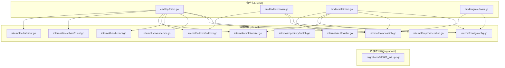
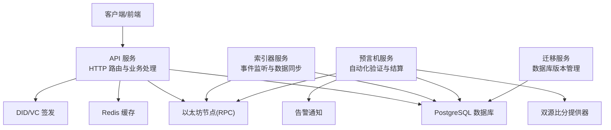
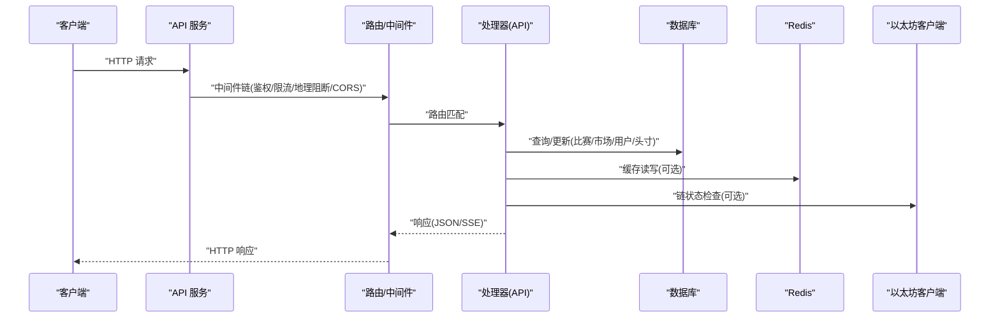
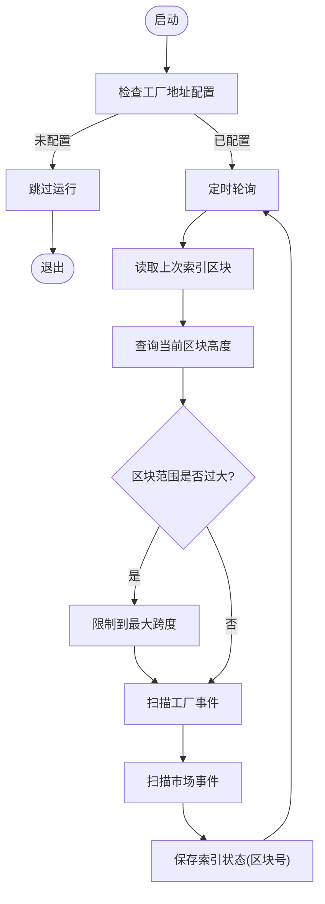
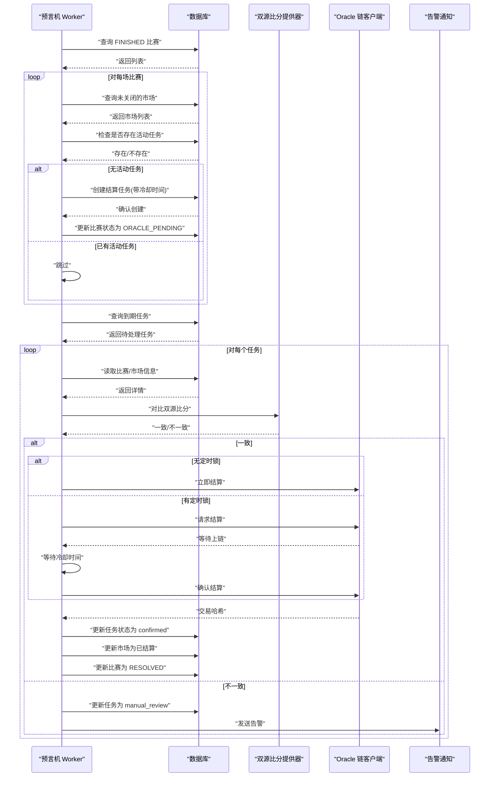
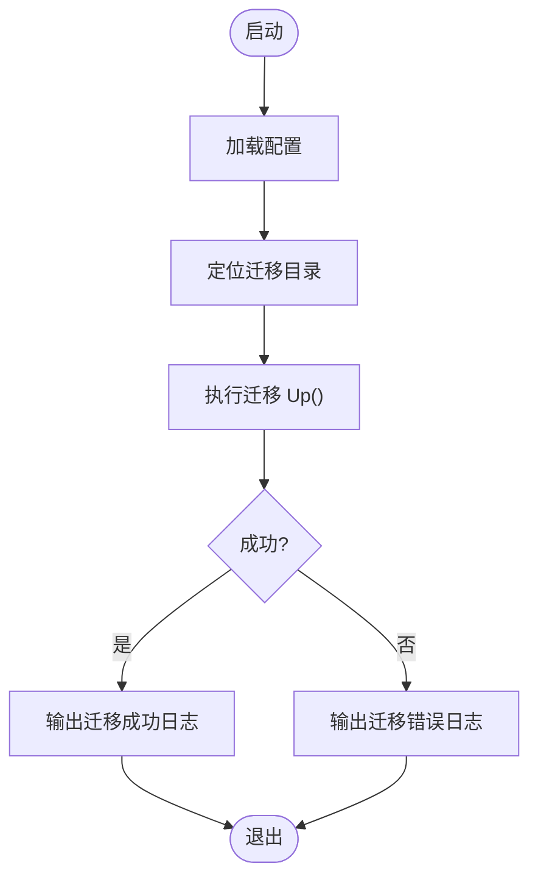
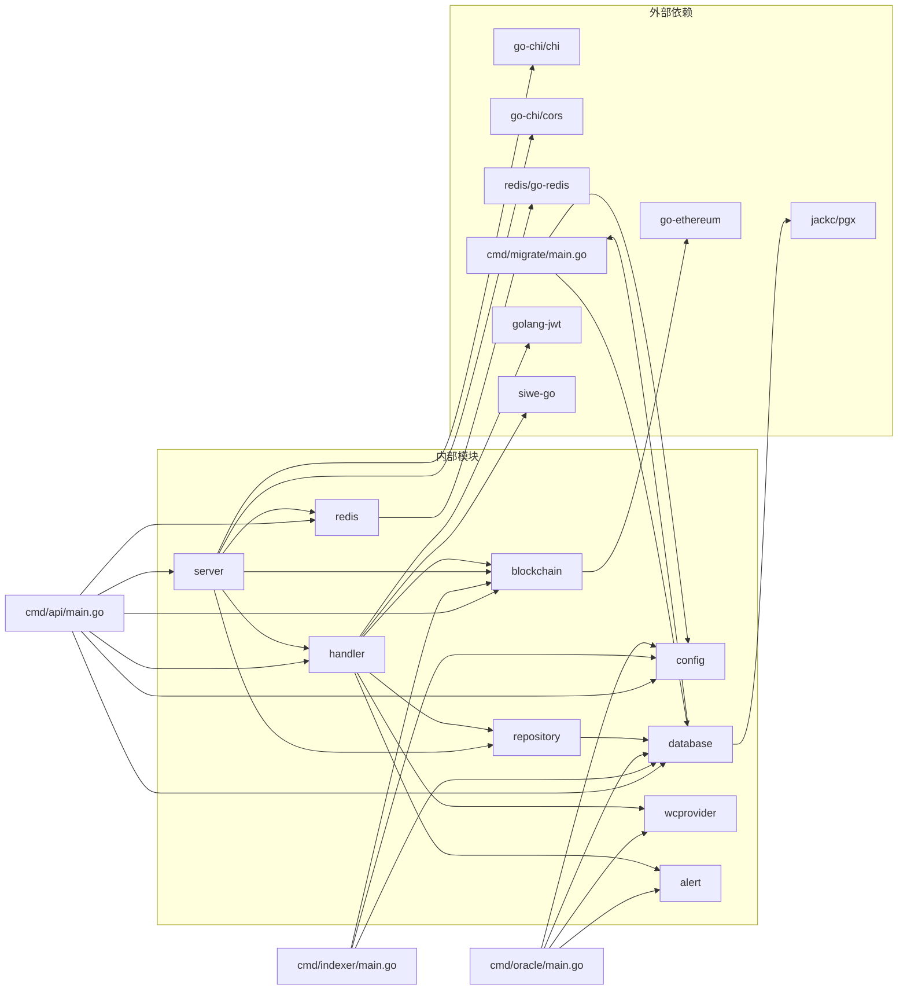

# 整体架构

<cite>
**本文引用的文件**
- [cmd/api/main.go](file://cmd/api/main.go)
- [cmd/indexer/main.go](file://cmd/indexer/main.go)
- [cmd/oracle/main.go](file://cmd/oracle/main.go)
- [cmd/migrate/main.go](file://cmd/migrate/main.go)
- [internal/server/server.go](file://internal/server/server.go)
- [internal/indexer/indexer.go](file://internal/indexer/indexer.go)
- [internal/oracle/worker.go](file://internal/oracle/worker.go)
- [internal/config/config.go](file://internal/config/config.go)
- [internal/database/db.go](file://internal/database/db.go)
- [internal/handler/api.go](file://internal/handler/api.go)
- [internal/repository/match.go](file://internal/repository/match.go)
- [internal/blockchain/client.go](file://internal/blockchain/client.go)
- [internal/redis/client.go](file://internal/redis/client.go)
- [internal/wcprovider/dual.go](file://internal/wcprovider/dual.go)
- [internal/alert/notifier.go](file://internal/alert/notifier.go)
- [migrations/000001_init.up.sql](file://migrations/000001_init.up.sql)
- [go.mod](file://go.mod)
</cite>

## 目录
1. [简介](#简介)
2. [项目结构](#项目结构)
3. [核心组件](#核心组件)
4. [架构总览](#架构总览)
5. [详细组件分析](#详细组件分析)
6. [依赖分析](#依赖分析)
7. [性能考虑](#性能考虑)
8. [故障排查指南](#故障排查指南)
9. [结论](#结论)
10. [附录](#附录)

## 简介
本架构文档面向 PredictionDIDSimple 的后端系统，聚焦于微服务架构模式、分层架构理念与模块化设计原则，系统由四个独立可运行的服务组成：API 服务、索引器服务、预言机服务与迁移服务。API 服务提供 HTTP 接口与业务逻辑；索引器服务负责监听区块链事件并同步链上数据；预言机服务负责自动化数据验证与市场结算；迁移服务负责数据库版本管理。本文将从系统边界、组件交互、依赖关系与通信机制等维度进行深入解析，并给出架构决策的技术考量与设计权衡。

## 项目结构
后端采用多命令入口（multi-command）组织方式，每个子系统以独立的 main.go 启动，共享内部通用模块（config、database、repository、blockchain、server 等），形成清晰的模块化边界与职责分离。

图表来源
- [cmd/api/main.go](file://cmd/api/main.go#L24-L117)
- [cmd/indexer/main.go](file://cmd/indexer/main.go#L15-L43)
- [cmd/oracle/main.go](file://cmd/oracle/main.go#L18-L55)
- [cmd/migrate/main.go](file://cmd/migrate/main.go#L12-L27)
- [internal/server/server.go](file://internal/server/server.go#L35-L84)
- [internal/indexer/indexer.go](file://internal/indexer/indexer.go#L35-L57)
- [internal/oracle/worker.go](file://internal/oracle/worker.go#L26-L36)
- [internal/config/config.go](file://internal/config/config.go#L45-L96)
- [internal/database/db.go](file://internal/database/db.go#L14-L42)
- [internal/handler/api.go](file://internal/handler/api.go#L30-L61)
- [internal/repository/match.go](file://internal/repository/match.go#L17-L19)
- [internal/blockchain/client.go](file://internal/blockchain/client.go#L19-L24)
- [internal/redis/client.go](file://internal/redis/client.go#L10-L16)
- [internal/wcprovider/dual.go](file://internal/wcprovider/dual.go#L24-L26)
- [internal/alert/notifier.go](file://internal/alert/notifier.go#L16-L21)
- [migrations/000001_init.up.sql](file://migrations/000001_init.up.sql#L1-L10)

章节来源
- [cmd/api/main.go](file://cmd/api/main.go#L24-L117)
- [cmd/indexer/main.go](file://cmd/indexer/main.go#L15-L43)
- [cmd/oracle/main.go](file://cmd/oracle/main.go#L18-L55)
- [cmd/migrate/main.go](file://cmd/migrate/main.go#L12-L27)
- [internal/server/server.go](file://internal/server/server.go#L35-L84)
- [internal/config/config.go](file://internal/config/config.go#L45-L96)

## 核心组件
- API 服务：提供 HTTP 接口、路由注册、鉴权与中间件、数据库与 Redis 连接、链客户端注入，统一对外暴露业务能力。
- 索引器服务：监听工厂合约与市场合约事件，增量扫描区块，写入比赛、市场与头寸数据，维护索引状态。
- 预言机服务：周期性检查已完成的比赛，生成结算任务，调用预言机适配器进行自动结算或人工复核。
- 迁移服务：加载配置并执行数据库迁移脚本，确保数据库 schema 与应用一致。

章节来源
- [internal/server/server.go](file://internal/server/server.go#L35-L84)
- [internal/indexer/indexer.go](file://internal/indexer/indexer.go#L35-L57)
- [internal/oracle/worker.go](file://internal/oracle/worker.go#L26-L36)
- [internal/database/db.go](file://internal/database/db.go#L28-L42)

## 架构总览
系统采用微服务化的命令入口组织，通过共享的内部模块实现解耦与复用。API 服务作为统一入口，聚合数据库、Redis、区块链与 VC 签发能力；索引器与预言机分别承担链上数据同步与自动化结算；迁移服务独立于主业务，保证数据库演进的可控性。

图表来源
- [cmd/api/main.go](file://cmd/api/main.go#L61-L98)
- [cmd/indexer/main.go](file://cmd/indexer/main.go#L29-L35)
- [cmd/oracle/main.go](file://cmd/oracle/main.go#L42-L50)
- [internal/server/server.go](file://internal/server/server.go#L62-L74)
- [internal/indexer/indexer.go](file://internal/indexer/indexer.go#L137-L154)
- [internal/oracle/worker.go](file://internal/oracle/worker.go#L102-L164)
- [internal/wcprovider/dual.go](file://internal/wcprovider/dual.go#L52-L69)
- [internal/alert/notifier.go](file://internal/alert/notifier.go#L23-L35)
- [internal/database/db.go](file://internal/database/db.go#L28-L42)

## 详细组件分析

### API 服务
- 职责：统一 HTTP 入口，注册健康检查、公开接口与受保护接口，集成鉴权、限流、地理阻断与 CORS 中间件。
- 关键点：依赖注入数据库连接池、Redis 客户端、以太坊客户端与 Oracle 链客户端；路由组按权限划分；使用 VC Issuer 提供凭证签发。
- 通信机制：通过 repository 层访问数据库；通过 blockchain 客户端读取链状态；通过 Redis 提升实时能力。

图表来源
- [internal/server/server.go](file://internal/server/server.go#L35-L84)
- [internal/handler/api.go](file://internal/handler/api.go#L30-L61)
- [internal/blockchain/client.go](file://internal/blockchain/client.go#L72-L78)
- [internal/redis/client.go](file://internal/redis/client.go#L18-L22)

章节来源
- [internal/server/server.go](file://internal/server/server.go#L35-L84)
- [internal/handler/api.go](file://internal/handler/api.go#L30-L61)

### 索引器服务
- 职责：轮询最新区块，扫描工厂合约创建事件与市场合约交易事件，增量写入数据库。
- 关键点：支持起始块配置与批量扫描上限；维护索引状态（最后区块号）；将链上事件映射为内部模型并入库。
- 通信机制：通过 ethclient 访问 RPC；通过 ABI 解析事件；通过 repository 写入数据库。

图表来源
- [internal/indexer/indexer.go](file://internal/indexer/indexer.go#L85-L135)
- [internal/indexer/indexer.go](file://internal/indexer/indexer.go#L137-L154)
- [internal/indexer/indexer.go](file://internal/indexer/indexer.go#L212-L244)

章节来源
- [internal/indexer/indexer.go](file://internal/indexer/indexer.go#L35-L57)
- [internal/indexer/indexer.go](file://internal/indexer/indexer.go#L85-L135)
- [internal/indexer/indexer.go](file://internal/indexer/indexer.go#L137-L154)
- [internal/indexer/indexer.go](file://internal/indexer/indexer.go#L212-L244)

### 预言机服务
- 职责：周期性检查已完成比赛，生成结算任务；对比双源比分一致性；自动/人工方式完成市场结算。
- 关键点：支持冷却时间与定时锁；根据规则计算结果；调用 Oracle Adapter 执行结算；失败时告警并记录状态。
- 通信机制：读取数据库中的比赛与市场；调用双源比分提供器；通过 OracleClient 发送链上交易；通过告警 Webhook 通知。

图表来源
- [internal/oracle/worker.go](file://internal/oracle/worker.go#L38-L100)
- [internal/oracle/worker.go](file://internal/oracle/worker.go#L102-L164)
- [internal/wcprovider/dual.go](file://internal/wcprovider/dual.go#L52-L69)
- [internal/alert/notifier.go](file://internal/alert/notifier.go#L23-L35)

章节来源
- [internal/oracle/worker.go](file://internal/oracle/worker.go#L26-L36)
- [internal/oracle/worker.go](file://internal/oracle/worker.go#L38-L100)
- [internal/oracle/worker.go](file://internal/oracle/worker.go#L102-L164)
- [internal/wcprovider/dual.go](file://internal/wcprovider/dual.go#L24-L26)
- [internal/alert/notifier.go](file://internal/alert/notifier.go#L16-L21)

### 迁移服务
- 职责：加载配置并执行数据库迁移，确保 schema 与代码一致。
- 关键点：支持迁移目录自动探测；基于文件系统源执行 Up；错误处理与日志输出。

图表来源
- [cmd/migrate/main.go](file://cmd/migrate/main.go#L12-L27)
- [internal/database/db.go](file://internal/database/db.go#L28-L42)

章节来源
- [cmd/migrate/main.go](file://cmd/migrate/main.go#L12-L27)
- [internal/database/db.go](file://internal/database/db.go#L28-L42)

## 依赖分析
- 外部依赖：以太坊客户端、Chi 路由、CORS、PGX 连接池、Redis 客户端、Migrate、JWT、SIWE 等。
- 内部模块：config 统一配置加载；database 封装连接池与迁移；server 聚合路由与中间件；handler 注册业务路由；repository 抽象数据访问；blockchain 提供链客户端；redis 提供缓存客户端；wcprovider 提供双源比分；alert 提供告警通知。
- 耦合与内聚：命令入口仅做装配与编排，核心逻辑下沉至内部模块；模块间通过接口与依赖注入解耦；公共配置与基础设施集中管理。

图表来源
- [go.mod](file://go.mod#L5-L14)
- [cmd/api/main.go](file://cmd/api/main.go#L15-L21)
- [cmd/indexer/main.go](file://cmd/indexer/main.go#L9-L13)
- [cmd/oracle/main.go](file://cmd/oracle/main.go#L9-L16)
- [cmd/migrate/main.go](file://cmd/migrate/main.go#L8-L10)
- [internal/server/server.go](file://internal/server/server.go#L3-L20)
- [internal/handler/api.go](file://internal/handler/api.go#L3-L14)

章节来源
- [go.mod](file://go.mod#L5-L14)
- [internal/server/server.go](file://internal/server/server.go#L3-L20)
- [internal/handler/api.go](file://internal/handler/api.go#L3-L14)

## 性能考虑
- 数据库连接池：使用 PGX 连接池，减少连接开销；在高并发场景下建议调整池大小与超时参数。
- Redis 缓存：对热点数据进行缓存，降低数据库压力；注意缓存失效策略与一致性。
- 区块扫描批量化：索引器限制单次扫描跨度，避免一次性拉取过多区块导致内存与网络压力。
- 预言机冷却与定时锁：通过冷却时间与定时锁避免频繁上链与重试风暴。
- 中间件与限流：在 API 服务中启用速率限制与地理阻断，防止滥用与攻击。
- 链客户端健康检查：后台定期检查 RPC 可用性，及时发现链上异常。

## 故障排查指南
- 数据库连接失败：检查 DATABASE_URL 与连接池初始化；查看迁移是否成功。
- Redis 不可用：检查 REDIS_URL 与连接；若不可用，服务会降级但部分功能受限。
- 索引器无数据：确认 MARKET_FACTORY_ADDRESS 与 INDEXER_START_BLOCK；检查 RPC 可达性与链 ID。
- 预言机无法结算：检查 ORACLE_ADAPTER_ADDRESS 与 ORACLE_PRIVATE_KEY；查看告警 Webhook 是否正常；核对双源比分一致性。
- 迁移失败：确认迁移脚本路径与权限；查看具体错误并修复 SQL。

章节来源
- [internal/database/db.go](file://internal/database/db.go#L14-L26)
- [internal/redis/client.go](file://internal/redis/client.go#L18-L22)
- [internal/indexer/indexer.go](file://internal/indexer/indexer.go#L86-L89)
- [internal/oracle/worker.go](file://internal/oracle/worker.go#L87-L89)
- [internal/alert/notifier.go](file://internal/alert/notifier.go#L23-L35)
- [cmd/migrate/main.go](file://cmd/migrate/main.go#L23-L25)

## 结论
该系统通过微服务化命令入口与模块化内部结构实现了清晰的职责划分与良好的扩展性。API 服务统一对外，索引器与预言机分别承担数据同步与自动化结算，迁移服务保障数据库演进的可控性。在技术选型上，采用成熟的第三方库与标准中间件，结合配置驱动与依赖注入，既满足了开发效率也兼顾了运行时稳定性。后续可在监控埋点、可观测性与弹性伸缩方面进一步增强。

## 附录
- 配置项概览（节选）：HTTP 端口、数据库 URL、Redis URL、以太坊 RPC、工厂地址、Oracle 地址、冷却时间、定时锁、速率限制、合规开关等。
- 数据库初始化：迁移脚本确保 schema_meta 表存在并写入初始版本。

章节来源
- [internal/config/config.go](file://internal/config/config.go#L45-L96)
- [migrations/000001_init.up.sql](file://migrations/000001_init.up.sql#L1-L10)