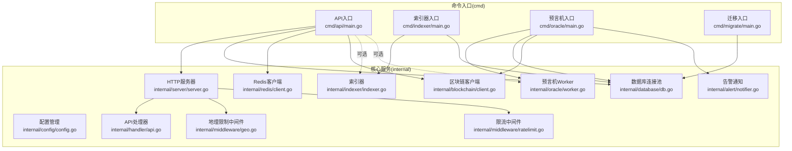
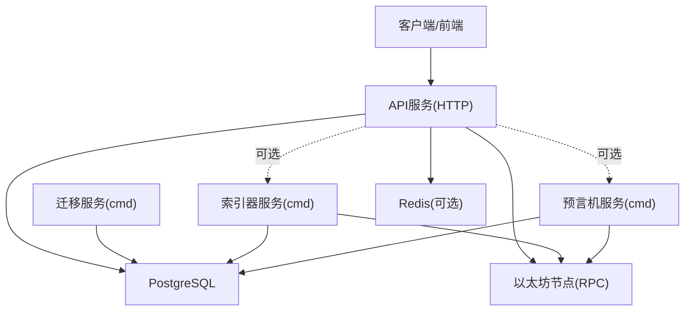
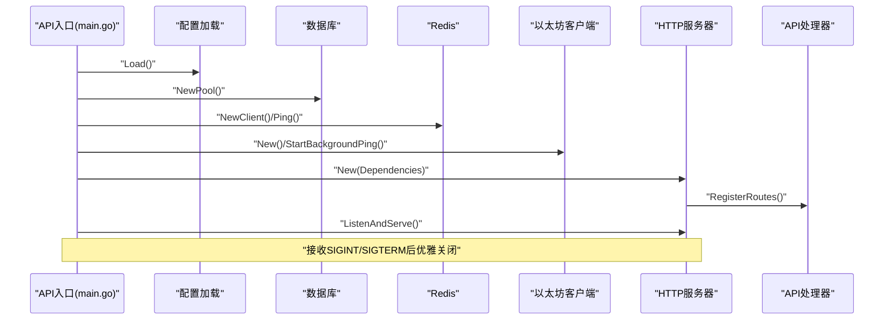
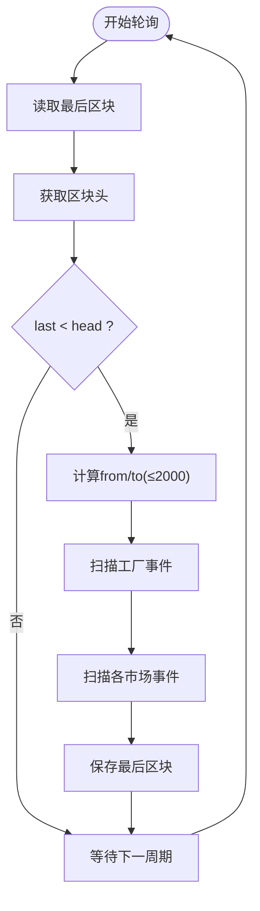
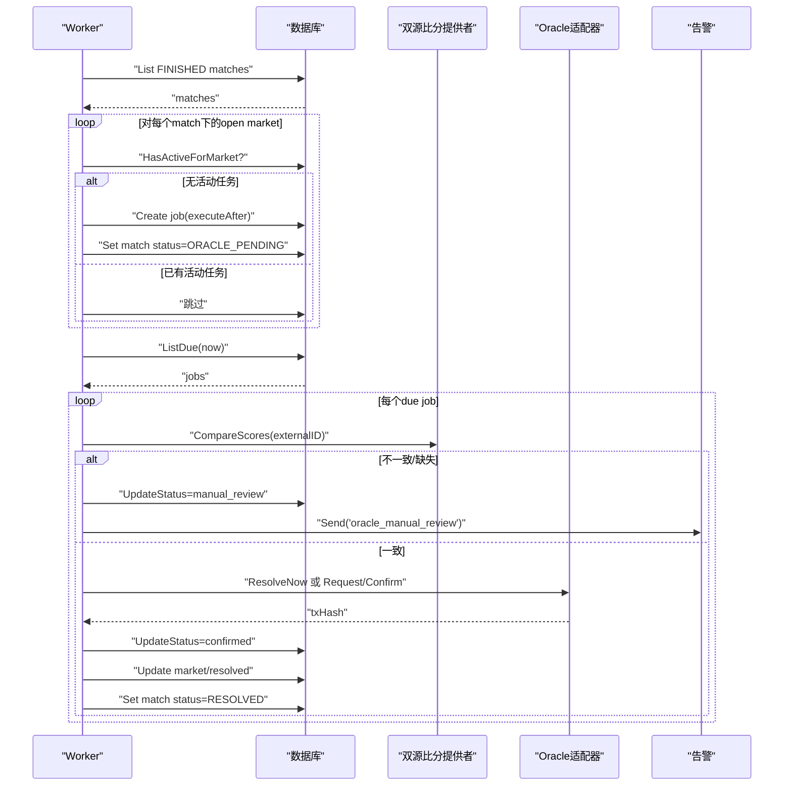
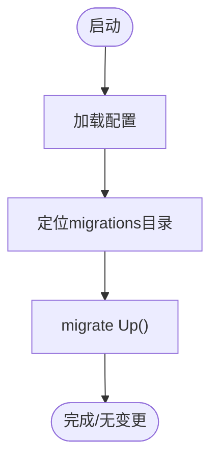
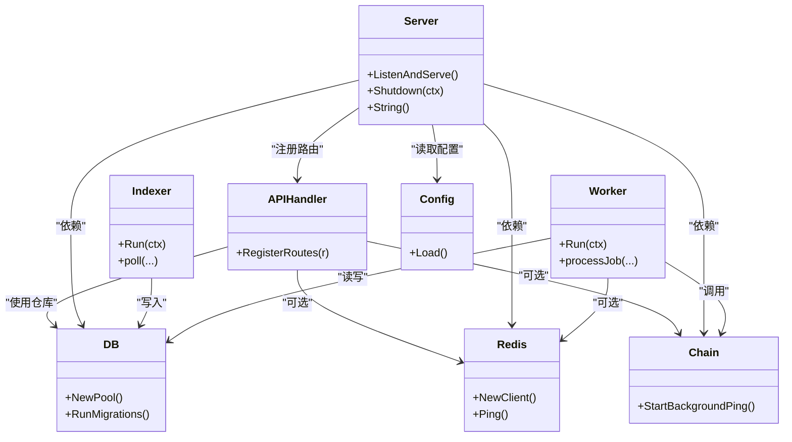

# 服务架构

<cite>
**本文引用的文件**
- [cmd/api/main.go](file://cmd/api/main.go)
- [cmd/indexer/main.go](file://cmd/indexer/main.go)
- [cmd/oracle/main.go](file://cmd/oracle/main.go)
- [cmd/migrate/main.go](file://cmd/migrate/main.go)
- [internal/server/server.go](file://internal/server/server.go)
- [internal/indexer/indexer.go](file://internal/indexer/indexer.go)
- [internal/oracle/worker.go](file://internal/oracle/worker.go)
- [internal/config/config.go](file://internal/config/config.go)
- [internal/database/db.go](file://internal/database/db.go)
- [internal/blockchain/client.go](file://internal/blockchain/client.go)
- [internal/handler/api.go](file://internal/handler/api.go)
- [internal/middleware/ratelimit.go](file://internal/middleware/ratelimit.go)
- [internal/middleware/geo.go](file://internal/middleware/geo.go)
- [internal/redis/client.go](file://internal/redis/client.go)
- [internal/alert/notifier.go](file://internal/alert/notifier.go)
</cite>

## 目录
1. [简介](#简介)
2. [项目结构](#项目结构)
3. [核心组件](#核心组件)
4. [架构总览](#架构总览)
5. [详细组件分析](#详细组件分析)
6. [依赖关系分析](#依赖关系分析)
7. [性能考虑](#性能考虑)
8. [故障排查指南](#故障排查指南)
9. [结论](#结论)
10. [附录](#附录)

## 简介
本文件面向PredictionDIDSimple后端，系统性梳理四大独立服务（API服务、索引器服务、预言机服务、迁移服务）的架构设计与实现要点，并阐明服务间协调机制、负载均衡策略与故障隔离设计。内容覆盖HTTP服务器配置、路由组织与中间件体系；事件监听机制、数据同步策略与错误重试；工作流、数据校验与冲突处理；数据库版本控制与Schema演进；服务启动流程、依赖注入模式与配置管理；以及监控与健康检查方案。

## 项目结构
后端采用多命令入口的微服务化组织方式，每个服务由独立的cmd入口程序负责初始化与生命周期管理，核心业务逻辑集中在internal目录下，按职责拆分为server、handler、repository、blockchain、config、database、redis、alert等子模块。

图表来源
- [cmd/api/main.go](file://cmd/api/main.go#L24-L118)
- [cmd/indexer/main.go](file://cmd/indexer/main.go#L15-L44)
- [cmd/oracle/main.go](file://cmd/oracle/main.go#L18-L56)
- [cmd/migrate/main.go](file://cmd/migrate/main.go#L12-L28)
- [internal/server/server.go](file://internal/server/server.go#L35-L85)
- [internal/indexer/indexer.go](file://internal/indexer/indexer.go#L35-L58)
- [internal/oracle/worker.go](file://internal/oracle/worker.go#L26-L36)
- [internal/config/config.go](file://internal/config/config.go#L45-L97)
- [internal/database/db.go](file://internal/database/db.go#L14-L42)
- [internal/redis/client.go](file://internal/redis/client.go#L10-L22)
- [internal/blockchain/client.go](file://internal/blockchain/client.go#L19-L79)
- [internal/handler/api.go](file://internal/handler/api.go#L30-L61)
- [internal/middleware/geo.go](file://internal/middleware/geo.go#L10-L31)
- [internal/middleware/ratelimit.go](file://internal/middleware/ratelimit.go#L36-L55)
- [internal/alert/notifier.go](file://internal/alert/notifier.go#L16-L35)

章节来源
- [cmd/api/main.go](file://cmd/api/main.go#L24-L118)
- [cmd/indexer/main.go](file://cmd/indexer/main.go#L15-L44)
- [cmd/oracle/main.go](file://cmd/oracle/main.go#L18-L56)
- [cmd/migrate/main.go](file://cmd/migrate/main.go#L12-L28)

## 核心组件
- 配置管理：集中从环境变量加载运行参数，支持链ID、索引轮询周期、预言机冷却与锁仓时长、速率限制、合规阻断国家列表等。
- 数据库：基于pgx连接池，提供连接创建、心跳检测与迁移执行。
- Redis：可选连接，用于降级提示与缓存场景。
- 区块链客户端：通用以太坊客户端，带后台心跳校验链ID与可用性状态。
- HTTP服务器：基于Chi路由，内置请求ID、真实IP、日志、恢复、CORS与自定义中间件。
- 处理器：暴露匹配、市场、统计、认证、合规、事件流等API端点。
- 中间件：地理阻断与IP限流，对健康/就绪/Metrics与SSE通道进行豁免。
- 索引器：轮询工厂合约事件与市场事件，增量同步至数据库。
- 预言机：定时扫描完成比赛下的市场，比对双源比分，按规则映射结果，调用Oracle适配器进行解析或请求解析，失败告警并记录。
- 迁移：基于golang-migrate执行Schema升级/回滚。

章节来源
- [internal/config/config.go](file://internal/config/config.go#L10-L43)
- [internal/database/db.go](file://internal/database/db.go#L14-L42)
- [internal/redis/client.go](file://internal/redis/client.go#L10-L22)
- [internal/blockchain/client.go](file://internal/blockchain/client.go#L12-L79)
- [internal/server/server.go](file://internal/server/server.go#L22-L85)
- [internal/handler/api.go](file://internal/handler/api.go#L16-L61)
- [internal/middleware/geo.go](file://internal/middleware/geo.go#L10-L51)
- [internal/middleware/ratelimit.go](file://internal/middleware/ratelimit.go#L10-L55)
- [internal/indexer/indexer.go](file://internal/indexer/indexer.go#L24-L58)
- [internal/oracle/worker.go](file://internal/oracle/worker.go#L16-L36)
- [internal/alert/notifier.go](file://internal/alert/notifier.go#L11-L35)

## 架构总览
PredictionDIDSimple采用“单进程多服务”的部署形态：API入口同时承载HTTP服务、可选索引器与可选预言机；其他服务以独立命令入口运行，便于容器编排与水平扩展。服务间通过共享数据库与可选Redis进行解耦，区块链交互通过独立客户端抽象。

图表来源
- [cmd/api/main.go](file://cmd/api/main.go#L61-L89)
- [cmd/indexer/main.go](file://cmd/indexer/main.go#L29-L38)
- [cmd/oracle/main.go](file://cmd/oracle/main.go#L32-L50)
- [cmd/migrate/main.go](file://cmd/migrate/main.go#L18-L26)

## 详细组件分析

### API服务：HTTP服务器、路由与中间件
- 启动流程
  - 加载配置、执行数据库迁移、建立数据库连接池、初始化Redis客户端（可选）、创建以太坊客户端并启动后台心跳。
  - 可选：当工厂地址配置存在时，初始化并启动索引器协程。
  - 可选：当Oracle适配器与私钥配置存在时，初始化Oracle客户端。
  - 构造HTTP服务器并启动监听，注册信号处理实现优雅关闭。
- 路由组织
  - 健康检查与指标端点：/health、/metrics。
  - 公共查询：/matches、/markets、/stats、/compliance/restricted。
  - 认证相关：/auth/siwe、/auth/verify-vc。
  - 用户专属：/me/positions、/users/bind-did、/users/me/credentials（JWT鉴权）。
  - 管理端：/admin/oracle-jobs、/admin/markets、/admin/markets/{id}/void、/admin/oracle-jobs/{id}/retry、/credentials/issue（管理员密钥鉴权）。
- 中间件体系
  - 请求追踪：RequestID、RealIP、Logger、Recoverer。
  - 速率限制：基于IP的每分钟配额，豁免健康/就绪/Metrics与SSE事件流。
  - 地理阻断：根据请求头识别国家代码，命中阻断名单返回403并记录日志。
  - CORS：允许本地开发源与必要头部，支持凭据。
- 依赖注入
  - 通过server.Dependencies聚合配置、数据库、Redis、链客户端、Oracle链客户端，统一注入到处理器。
- 错误处理
  - 统一JSON错误响应格式；SSE长写超时设置；优雅关闭上下文超时控制。

图表来源
- [cmd/api/main.go](file://cmd/api/main.go#L24-L118)
- [internal/server/server.go](file://internal/server/server.go#L35-L85)
- [internal/handler/api.go](file://internal/handler/api.go#L30-L61)
- [internal/middleware/ratelimit.go](file://internal/middleware/ratelimit.go#L36-L55)
- [internal/middleware/geo.go](file://internal/middleware/geo.go#L10-L31)
- [internal/redis/client.go](file://internal/redis/client.go#L10-L22)
- [internal/blockchain/client.go](file://internal/blockchain/client.go#L26-L79)

章节来源
- [cmd/api/main.go](file://cmd/api/main.go#L24-L118)
- [internal/server/server.go](file://internal/server/server.go#L22-L85)
- [internal/handler/api.go](file://internal/handler/api.go#L16-L61)
- [internal/middleware/ratelimit.go](file://internal/middleware/ratelimit.go#L10-L55)
- [internal/middleware/geo.go](file://internal/middleware/geo.go#L10-L51)
- [internal/redis/client.go](file://internal/redis/client.go#L10-L22)
- [internal/blockchain/client.go](file://internal/blockchain/client.go#L12-L79)

### 索引器服务：事件监听、数据同步与错误重试
- 启动与生命周期
  - 读取配置，建立数据库连接池，初始化索引器实例，进入主循环。
- 事件监听与同步
  - 轮询策略：从上次区块+1到当前区块头，最大步进2000块，避免一次性查询过大。
  - 工厂事件：监听MarketCreated事件，解析问题、结束时间、matchRef，转换外部ID，写入市场表。
  - 市场事件：遍历所有已知市场，过滤Bought/Resolved/Claimed事件，分别入库交易与头寸、更新市场解析结果、标记头寸已认领。
- 错误处理与重试
  - 单次轮询失败仅记录错误并等待下一周期；上下文取消时退出。
  - 建议在生产中增加指数退避与队列化重试。
- 数据一致性
  - 使用事务或幂等写入策略，确保重复区块不产生重复记录。

图表来源
- [internal/indexer/indexer.go](file://internal/indexer/indexer.go#L85-L135)
- [internal/indexer/indexer.go](file://internal/indexer/indexer.go#L137-L155)
- [internal/indexer/indexer.go](file://internal/indexer/indexer.go#L212-L244)

章节来源
- [cmd/indexer/main.go](file://cmd/indexer/main.go#L15-L44)
- [internal/indexer/indexer.go](file://internal/indexer/indexer.go#L24-L58)
- [internal/indexer/indexer.go](file://internal/indexer/indexer.go#L85-L135)
- [internal/indexer/indexer.go](file://internal/indexer/indexer.go#L137-L155)
- [internal/indexer/indexer.go](file://internal/indexer/indexer.go#L212-L244)

### 预言机服务：工作流、数据验证与冲突处理
- 启动与生命周期
  - 读取配置，建立数据库连接池，初始化OracleWorker，进入主循环。
- 工作流
  - 入队：扫描状态为FINISHED的比赛，查找其开放市场，若无同市场活动任务则创建定时任务并打上冷却标签。
  - 处理：扫描到期任务，比对双源比分，若不一致则标记人工复核并发送告警；一致则按规则映射结果。
  - 执行：若无锁仓时长则直接解析；否则请求解析并等待确认后执行确认，等待上链完成，更新任务状态与市场/比赛状态。
- 数据验证与冲突处理
  - 双源比分对比，不一致或缺失时进入人工复核流程，记录错误字段并通过Webhook告警。
- 容错与可观测性
  - 失败任务记录错误信息；成功任务记录交易哈希；告警通知用于运营介入。

图表来源
- [internal/oracle/worker.go](file://internal/oracle/worker.go#L38-L100)
- [internal/oracle/worker.go](file://internal/oracle/worker.go#L102-L165)
- [internal/alert/notifier.go](file://internal/alert/notifier.go#L23-L35)

章节来源
- [cmd/oracle/main.go](file://cmd/oracle/main.go#L18-L56)
- [internal/oracle/worker.go](file://internal/oracle/worker.go#L16-L36)
- [internal/oracle/worker.go](file://internal/oracle/worker.go#L38-L100)
- [internal/oracle/worker.go](file://internal/oracle/worker.go#L102-L165)
- [internal/alert/notifier.go](file://internal/alert/notifier.go#L11-L35)

### 迁移服务：数据库版本控制与Schema演进
- 启动流程
  - 读取配置，自动定位migrations目录（支持相对与backend路径），执行Up迁移。
- 版本控制
  - 基于golang-migrate，按文件顺序执行up.sql，忽略无变更；down.sql用于回滚测试或紧急修复。
- 最佳实践
  - 将迁移脚本与版本号前缀规范化，避免跨环境差异；生产前先在预生产验证。

图表来源
- [cmd/migrate/main.go](file://cmd/migrate/main.go#L12-L28)
- [internal/database/db.go](file://internal/database/db.go#L28-L42)

章节来源
- [cmd/migrate/main.go](file://cmd/migrate/main.go#L12-L28)
- [internal/database/db.go](file://internal/database/db.go#L28-L42)

## 依赖关系分析
- 组件内聚与耦合
  - API服务通过server.Dependencies聚合外部依赖，降低处理器耦合度，利于测试与替换。
  - 索引器与预言机均依赖数据库仓库层，避免直接操作SQL，提升可维护性。
- 外部依赖
  - PostgreSQL：作为主存储；Redis：可选；以太坊RPC：通过通用客户端封装。
- 循环依赖
  - 未见明显循环依赖；各模块职责清晰，接口边界明确。

图表来源
- [internal/server/server.go](file://internal/server/server.go#L22-L85)
- [internal/handler/api.go](file://internal/handler/api.go#L16-L61)
- [internal/indexer/indexer.go](file://internal/indexer/indexer.go#L24-L58)
- [internal/oracle/worker.go](file://internal/oracle/worker.go#L16-L36)
- [internal/config/config.go](file://internal/config/config.go#L45-L97)
- [internal/database/db.go](file://internal/database/db.go#L14-L42)
- [internal/redis/client.go](file://internal/redis/client.go#L10-L22)
- [internal/blockchain/client.go](file://internal/blockchain/client.go#L19-L79)

章节来源
- [internal/server/server.go](file://internal/server/server.go#L22-L85)
- [internal/handler/api.go](file://internal/handler/api.go#L16-L61)
- [internal/indexer/indexer.go](file://internal/indexer/indexer.go#L24-L58)
- [internal/oracle/worker.go](file://internal/oracle/worker.go#L16-L36)
- [internal/config/config.go](file://internal/config/config.go#L45-L97)
- [internal/database/db.go](file://internal/database/db.go#L14-L42)
- [internal/redis/client.go](file://internal/redis/client.go#L10-L22)
- [internal/blockchain/client.go](file://internal/blockchain/client.go#L19-L79)

## 性能考虑
- HTTP服务
  - 读超时15秒，SSE长写超时放开；建议对大响应体启用压缩与分页。
  - 限流中间件按IP与分钟粒度控制，避免突发流量击穿。
- 数据库
  - 连接池复用；批量写入与幂等插入减少锁竞争；索引器分批扫描避免RPC压力。
- 区块链
  - 客户端后台心跳检测，异常时可快速发现；建议引入多RPC源与降级策略。
- 缓存
  - Redis可选，建议用于热点查询与会话缓存；注意一致性与失效策略。

## 故障排查指南
- 健康检查
  - /health端点结合DB、Redis、链客户端状态，便于容器探针与网关路由。
- 日志与告警
  - 索引器/预言机轮询错误会打印日志；预言机失败与需要人工复核时通过Webhook告警。
- 配置校验
  - 缺少DATABASE_URL、无效CHAIN_ID、INDEXER_START_BLOCK等将导致启动失败，需检查环境变量。
- 迁移失败
  - 迁移报错通常由SQL语法或版本冲突引起，建议先在本地验证迁移脚本。

章节来源
- [internal/handler/api.go](file://internal/handler/api.go#L30-L61)
- [internal/alert/notifier.go](file://internal/alert/notifier.go#L23-L35)
- [internal/config/config.go](file://internal/config/config.go#L79-L96)
- [internal/database/db.go](file://internal/database/db.go#L28-L42)

## 结论
该服务架构以清晰的职责划分与可插拔的依赖注入实现高内聚低耦合；通过独立的命令入口与共享基础设施实现灵活部署与扩展。API服务提供统一入口与安全中间件，索引器与预言机分别承担链上事件归档与自动化解析，迁移服务保障Schema演进可控。建议在生产环境中完善重试、熔断、限流与可观测性体系，进一步增强弹性与可运维性。

## 附录
- 服务启动顺序建议
  - 迁移服务优先，确保Schema就绪；
  - API服务其次，承载HTTP与可选索引器/预言机；
  - 独立服务（索引器/预言机）可按需单独部署。
- 负载均衡与故障隔离
  - API服务可横向扩展，配合Redis与数据库集群；
  - 索引器/预言机建议单实例运行，避免重复写入与冲突。
- 监控与健康检查
  - /metrics暴露Prometheus指标；
  - /health与/ready用于存活/就绪探针；
  - 建议补充链客户端可用性指标与任务队列长度。