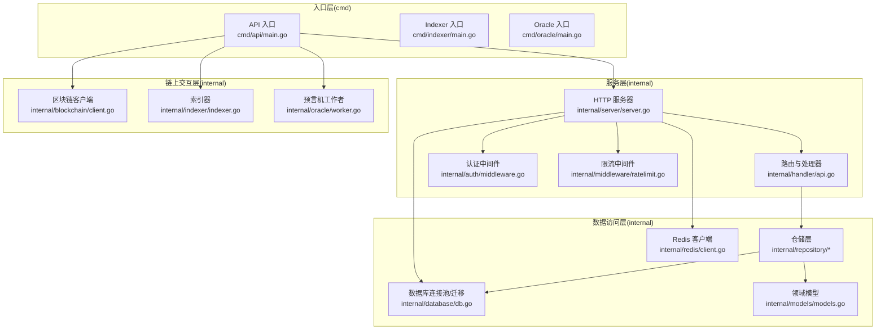
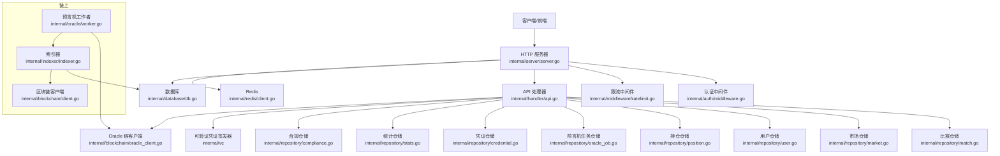
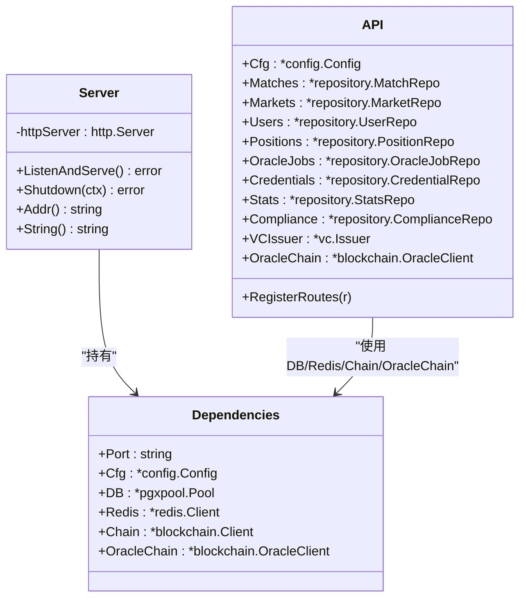
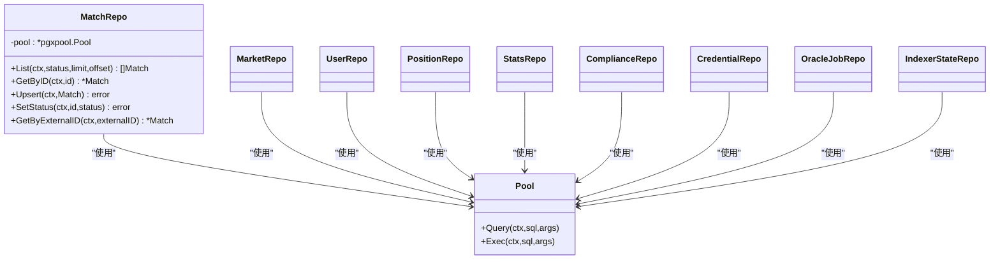
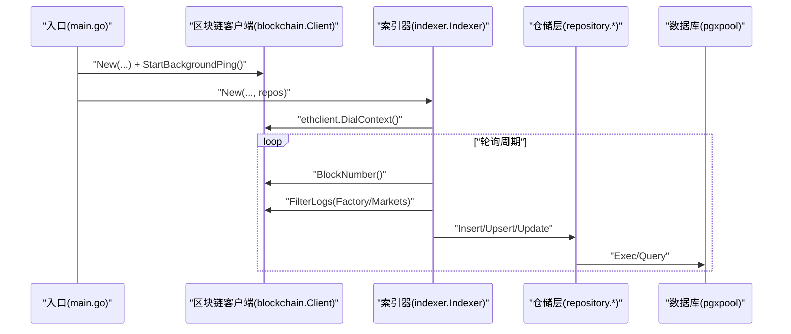
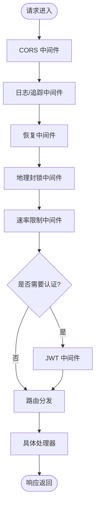
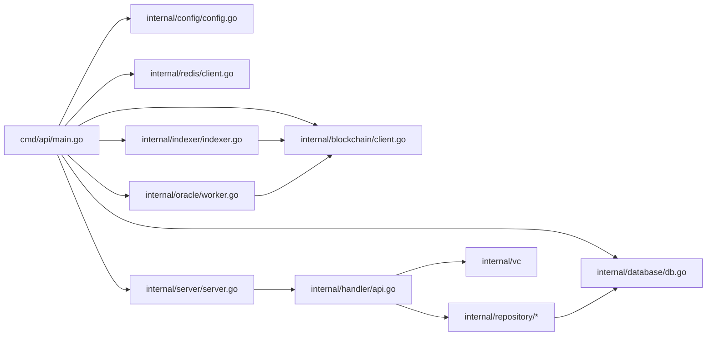
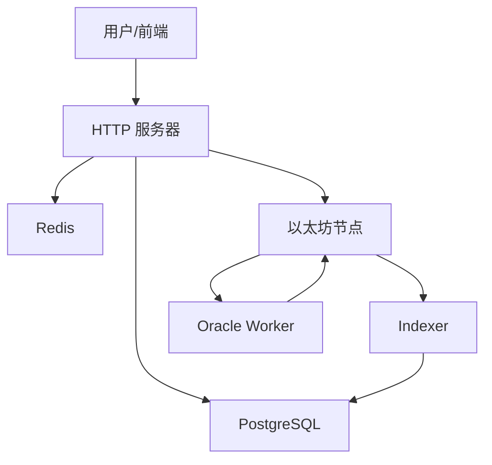
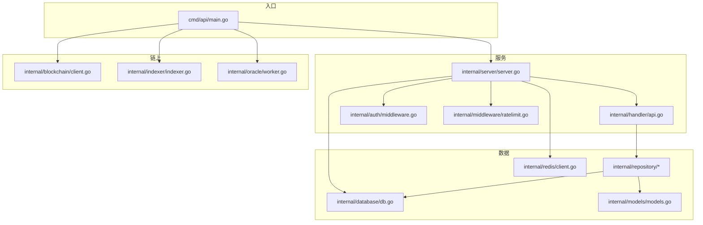

# 架构设计

<cite>
**本文档引用的文件**
- [main.go](file://cmd/api/main.go)
- [server.go](file://internal/server/server.go)
- [config.go](file://internal/config/config.go)
- [api.go](file://internal/handler/api.go)
- [client.go](file://internal/blockchain/client.go)
- [indexer.go](file://internal/indexer/indexer.go)
- [worker.go](file://internal/oracle/worker.go)
- [db.go](file://internal/database/db.go)
- [client.go](file://internal/redis/client.go)
- [middleware.go](file://internal/auth/middleware.go)
- [ratelimit.go](file://internal/middleware/ratelimit.go)
- [models.go](file://internal/models/models.go)
- [000001_init.up.sql](file://migrations/000001_init.up.sql)
- [go.mod](file://go.mod)
</cite>

## 目录
1. [简介](#简介)
2. [项目结构](#项目结构)
3. [核心组件](#核心组件)
4. [架构总览](#架构总览)
5. [组件详解](#组件详解)
6. [依赖关系分析](#依赖关系分析)
7. [性能考量](#性能考量)
8. [故障排查指南](#故障排查指南)
9. [结论](#结论)
10. [附录](#附录)

## 简介
本架构设计文档面向 PredictionDIDSimple 后端系统，聚焦于分层架构、依赖注入模式、事件驱动架构等核心设计原则，系统边界清晰，涵盖 Server 入口点、Handler 路由层、Repository 数据访问层、Blockchain 链上交互层等。文档还解释技术决策与权衡（如 Chi 路由器、依赖注入、缓存策略），并给出基础设施需求、可扩展性与部署拓扑建议，以及安全、监控与灾难恢复等横切关注点。

## 项目结构
后端采用按职责分层的组织方式：
- cmd/*：应用入口点（API、Indexer、Oracle、Migrate、Reconcile、Sync 等）
- internal/*：核心业务层（server、handler、repository、blockchain、indexer、oracle、auth、middleware、database、redis、models 等）
- migrations/*：数据库迁移脚本
- pkg/contracts/*：链上合约 ABI/地址等资源

图表来源
- [main.go:27-161](file://cmd/api/main.go#L27-L161)
- [server.go:44-102](file://internal/server/server.go#L44-L102)
- [api.go:34-69](file://internal/handler/api.go#L34-L69)
- [db.go:16-31](file://internal/database/db.go#L16-L31)
- [client.go:22-94](file://internal/blockchain/client.go#L22-L94)
- [indexer.go:38-65](file://internal/indexer/indexer.go#L38-L65)
- [worker.go:29-40](file://internal/oracle/worker.go#L29-L40)

章节来源
- [main.go:27-161](file://cmd/api/main.go#L27-L161)
- [server.go:44-102](file://internal/server/server.go#L44-L102)

## 核心组件
- 配置管理：集中加载环境变量并进行参数校验与默认值处理，确保运行期一致性。
- 依赖注入：通过 server.Dependencies 将 DB、Redis、Chain、OracleChain 等外部依赖一次性注入至 Server，再由 Server 注入至 Handler 与中间件。
- 路由与中间件：基于 Chi 路由器，统一注册全局中间件（CORS、日志、恢复、速率限制、地理封锁），并按权限级别分组路由。
- 数据访问：Repository 层封装数据库操作，统一使用 pgx 连接池；Redis 作为可选缓存与会话存储。
- 链上交互：区块链客户端负责节点健康检测；Indexer 轮询事件并同步至数据库；Oracle Worker 基于评分数据自动结算并上链。

章节来源
- [config.go:48-105](file://internal/config/config.go#L48-L105)
- [server.go:29-38](file://internal/server/server.go#L29-L38)
- [api.go:18-31](file://internal/handler/api.go#L18-L31)
- [db.go:16-31](file://internal/database/db.go#L16-L31)
- [client.go:14-94](file://internal/blockchain/client.go#L14-L94)
- [indexer.go:26-65](file://internal/indexer/indexer.go#L26-L65)
- [worker.go:18-40](file://internal/oracle/worker.go#L18-L40)

## 架构总览
系统采用分层架构与事件驱动相结合的设计：
- 分层架构：入口层（cmd）、服务层（server/handler）、数据访问层（repository/database/redis）、链上交互层（blockchain/indexer/oracle）。
- 依赖注入：在入口层构建依赖图，传递给 Server，再由 Server 注入到 Handler 与中间件。
- 事件驱动：Indexer 周期性扫描链上事件并入库；Oracle Worker 周期性处理到期结算任务；Server 通过 SSE 提供实时比分流。

图表来源
- [server.go:44-102](file://internal/server/server.go#L44-L102)
- [api.go:18-31](file://internal/handler/api.go#L18-L31)
- [db.go:16-31](file://internal/database/db.go#L16-L31)
- [client.go:14-94](file://internal/blockchain/client.go#L14-L94)
- [indexer.go:26-65](file://internal/indexer/indexer.go#L26-L65)
- [worker.go:18-40](file://internal/oracle/worker.go#L18-L40)

## 组件详解

### 服务器与路由层（Server/Handler）
- 服务器初始化：创建 Chi 路由器，注册全局中间件（请求追踪、真实 IP、日志、恢复、速率限制、地理封锁），配置 CORS，注册健康检查与 API 路由。
- 依赖注入：通过 server.Dependencies 注入 DB、Redis、Chain、OracleChain；API 处理器再注入各仓储与 VC 签发器。
- 路由分组：公开接口、登录接口、JWT 认证接口、管理员接口，分别绑定不同中间件与权限要求。

图表来源
- [server.go:24-102](file://internal/server/server.go#L24-L102)
- [api.go:18-31](file://internal/handler/api.go#L18-L31)

章节来源
- [server.go:44-102](file://internal/server/server.go#L44-L102)
- [api.go:33-69](file://internal/handler/api.go#L33-L69)

### 数据访问层（Repository/Database/Redis/Models）
- Repository：围绕领域模型（Match、Market、Position、User）提供 CRUD 与聚合查询，统一使用 pgx 连接池。
- Database：提供连接池创建、Ping 探活、迁移执行（基于 golang-migrate）。
- Redis：封装客户端创建与 Ping 探活，支持可选降级运行。
- Models：定义核心领域对象及其字段。

图表来源
- [match.go:15-118](file://internal/repository/match.go#L15-L118)
- [db.go:16-31](file://internal/database/db.go#L16-L31)
- [models.go:6-63](file://internal/models/models.go#L6-L63)

章节来源
- [match.go:25-118](file://internal/repository/match.go#L25-L118)
- [db.go:16-51](file://internal/database/db.go#L16-L51)
- [client.go:12-29](file://internal/redis/client.go#L12-L29)
- [models.go:6-63](file://internal/models/models.go#L6-L63)

### 链上交互层（Blockchain/Indexer/Oracle）
- Blockchain 客户端：定时 ping 节点，校验链 ID，暴露健康状态与链 ID 查询。
- Indexer：轮询 Factory 与各市场事件，解析日志并入库；支持分批扫描避免 RPC 超时。
- Oracle Worker：根据比赛状态与市场规则，从双数据源比对分数，发起链上结算（支持时间锁流程）。

图表来源
- [main.go:83-110](file://cmd/api/main.go#L83-L110)
- [client.go:30-83](file://internal/blockchain/client.go#L30-L83)
- [indexer.go:97-160](file://internal/indexer/indexer.go#L97-L160)

章节来源
- [client.go:14-94](file://internal/blockchain/client.go#L14-L94)
- [indexer.go:97-329](file://internal/indexer/indexer.go#L97-L329)
- [worker.go:42-205](file://internal/oracle/worker.go#L42-L205)

### 认证与安全中间件
- JWT 中间件：从 Authorization 头提取 Bearer Token，解析并注入用户地址到上下文。
- 管理员中间件：基于 Admin API Key 的鉴权。
- 速率限制中间件：基于 IP 的每分钟滑动窗口限流，健康检查路径豁免。
- 地理封锁中间件：记录访问来源与国家，按配置进行封禁判定。

图表来源
- [server.go:47-75](file://internal/server/server.go#L47-L75)
- [middleware.go:17-43](file://internal/auth/middleware.go#L17-L43)
- [ratelimit.go:42-66](file://internal/middleware/ratelimit.go#L42-L66)

章节来源
- [middleware.go:17-50](file://internal/auth/middleware.go#L17-L50)
- [ratelimit.go:12-67](file://internal/middleware/ratelimit.go#L12-L67)

## 依赖关系分析
- 入口层依赖配置、数据库、Redis、区块链、索引器与预言机组件。
- 服务层依赖配置、数据库、Redis、区块链与 VC 签发器。
- 仓储层依赖数据库连接池与领域模型。
- 链上组件相互协作：Indexer 依赖区块链客户端与仓储；Oracle Worker 依赖索引器产出与区块链写入客户端。

图表来源
- [main.go:27-161](file://cmd/api/main.go#L27-L161)
- [server.go:44-102](file://internal/server/server.go#L44-L102)
- [api.go:77-91](file://internal/handler/api.go#L77-L91)

章节来源
- [main.go:27-161](file://cmd/api/main.go#L27-L161)
- [go.mod:5-14](file://go.mod#L5-L14)

## 性能考量
- 数据库连接池：使用 pgxpool 提升并发与连接复用效率。
- 限流策略：基于 IP 的每分钟滑动窗口限流，避免突发流量冲击。
- 索引器批处理：单次扫描最多 2000 区块，降低 RPC 压力。
- 写入路径优化：Indexer 对事件处理采用批量入库与聚合更新，减少重复扫描成本。
- 缓存策略：Redis 作为可选缓存与会话存储，若不可用则降级运行，保证核心功能可用。

## 故障排查指南
- 配置缺失：DATABASE_URL 必填，否则迁移与启动均会失败。
- 数据库连通性：通过 Ping 探活，超时或失败需检查连接串与网络。
- Redis 可用性：解析与 Ping 失败仅告警，不影响主流程，但缓存能力降级。
- 链节点健康：区块链客户端定时 ping，链 ID 不一致或拨号失败需检查 RPC 地址与链 ID。
- 索引器异常：轮询过程中出现错误会记录日志并继续运行，需关注日志与区块进度。
- 预言机结算：时间锁流程中等待确认与到期时间，失败时更新任务状态并发送告警。

章节来源
- [config.go:84-105](file://internal/config/config.go#L84-L105)
- [db.go:26-31](file://internal/database/db.go#L26-L31)
- [client.go:48-83](file://internal/blockchain/client.go#L48-L83)
- [indexer.go:110-120](file://internal/indexer/indexer.go#L110-L120)
- [worker.go:168-205](file://internal/oracle/worker.go#L168-L205)

## 结论
本系统通过清晰的分层架构与依赖注入，实现了入口、路由、数据与链上交互的解耦；借助事件驱动机制（Indexer 与 Oracle Worker）提升了链上数据同步与结算自动化水平。配合 CORS、日志、恢复、速率限制与地理封锁等中间件，保障了系统的安全性与稳定性。在可扩展性方面，可通过增加入口命令（如 migrate、sync、reconcile）与横向扩展数据库与 Redis 来满足增长需求。

## 附录

### 系统上下文图

图表来源
- [server.go:94-101](file://internal/server/server.go#L94-L101)
- [indexer.go:97-160](file://internal/indexer/indexer.go#L97-L160)
- [worker.go:42-68](file://internal/oracle/worker.go#L42-L68)

### 组件分解图

图表来源
- [main.go:27-161](file://cmd/api/main.go#L27-L161)
- [server.go:44-102](file://internal/server/server.go#L44-L102)
- [api.go:34-69](file://internal/handler/api.go#L34-L69)
- [db.go:16-31](file://internal/database/db.go#L16-L31)
- [client.go:14-94](file://internal/blockchain/client.go#L14-L94)
- [indexer.go:26-65](file://internal/indexer/indexer.go#L26-L65)
- [worker.go:18-40](file://internal/oracle/worker.go#L18-L40)

### 基础设施与部署拓扑
- 基础设施需求：PostgreSQL（数据库）、Redis（可选）、以太坊 RPC 节点。
- 部署拓扑：API 服务可水平扩展；Indexer 与 Oracle Worker 作为独立进程运行，各自独立伸缩；数据库与 Redis 采用高可用方案。

### 技术栈与版本兼容性
- Go 版本：1.22.0
- 关键依赖：Chi 路由 v5、CORS、pgx v5、Redis 客户端 v9、Ethereum 客户端、JWT、迁移工具等

章节来源
- [go.mod:3-14](file://go.mod#L3-L14)
- [000001_init.up.sql:1-10](file://migrations/000001_init.up.sql#L1-L10)