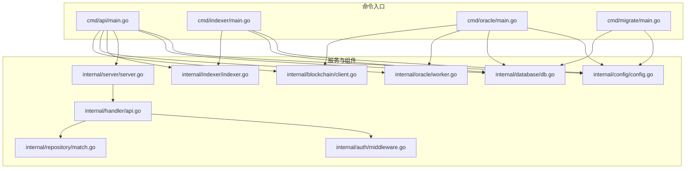
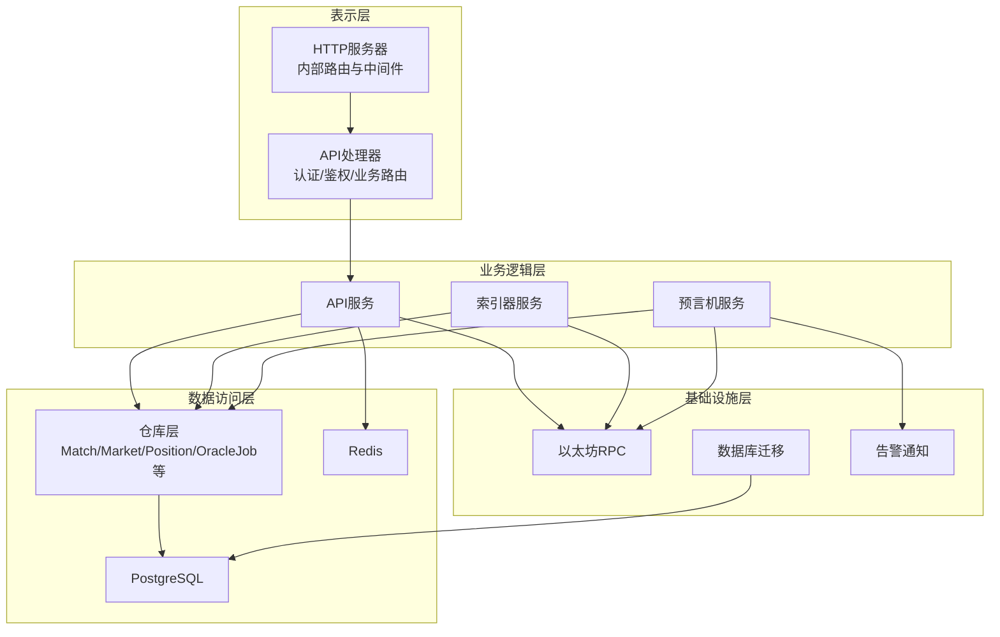
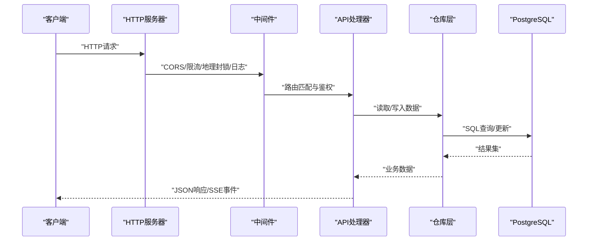
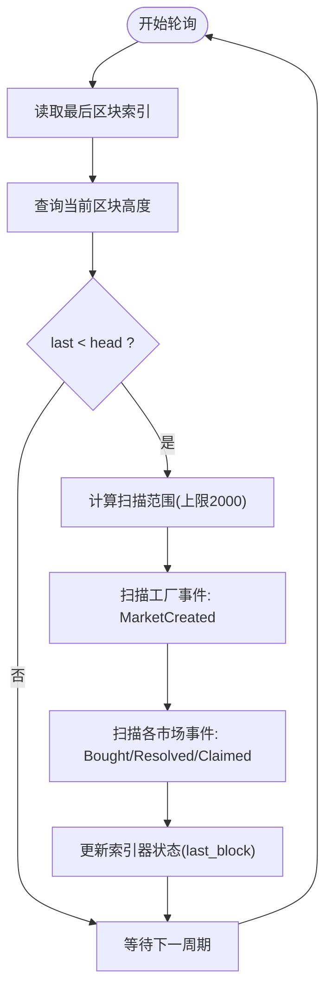
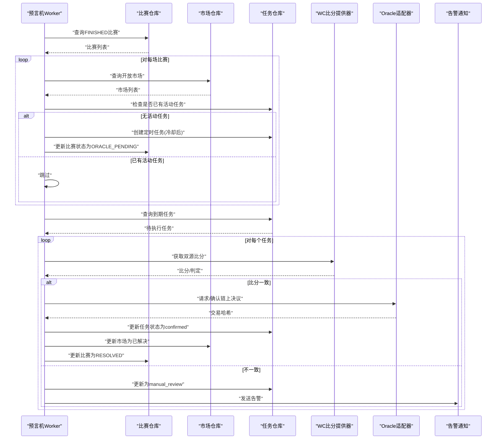
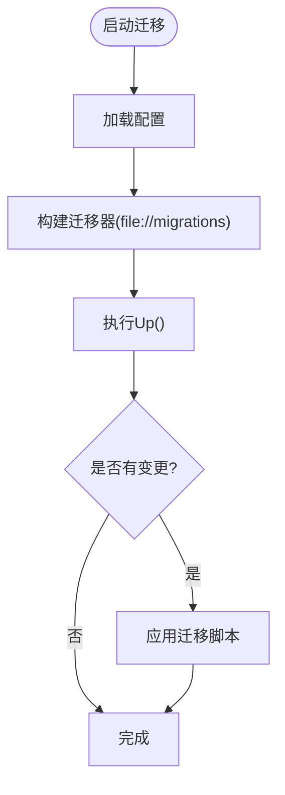
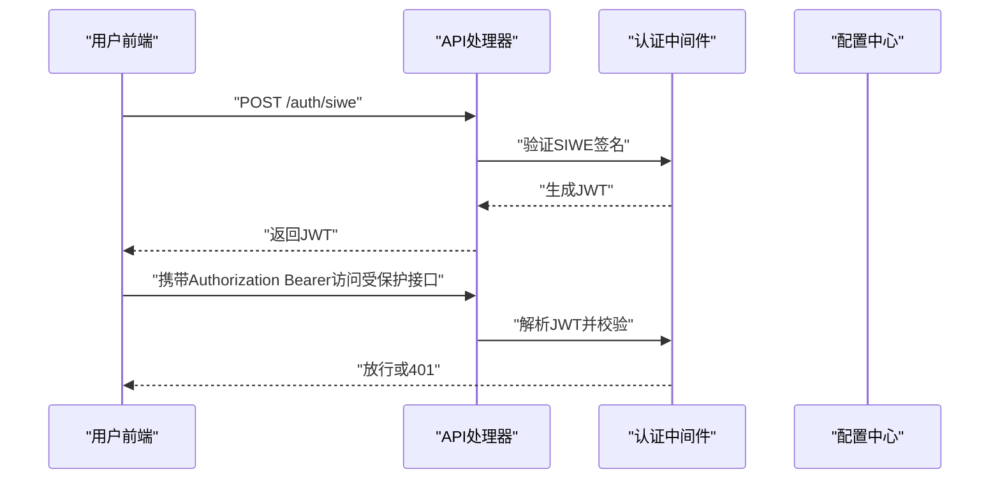
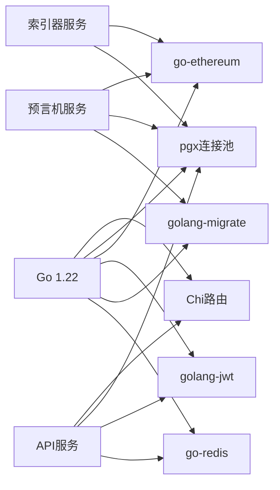
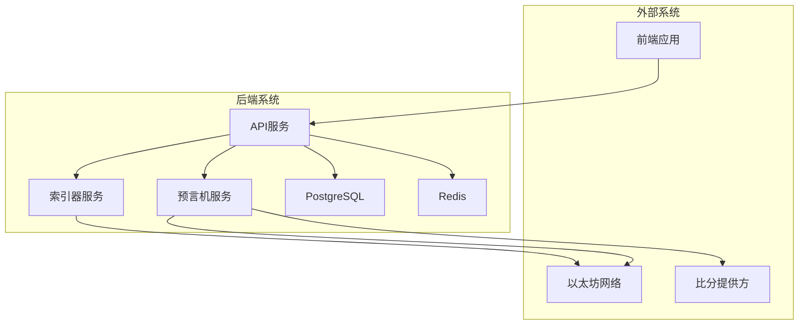

# 架构设计

<cite>
**本文引用的文件**
- [cmd/api/main.go](file://cmd/api/main.go)
- [cmd/indexer/main.go](file://cmd/indexer/main.go)
- [cmd/oracle/main.go](file://cmd/oracle/main.go)
- [cmd/migrate/main.go](file://cmd/migrate/main.go)
- [internal/config/config.go](file://internal/config/config.go)
- [internal/server/server.go](file://internal/server/server.go)
- [internal/indexer/indexer.go](file://internal/indexer/indexer.go)
- [internal/oracle/worker.go](file://internal/oracle/worker.go)
- [internal/blockchain/client.go](file://internal/blockchain/client.go)
- [internal/database/db.go](file://internal/database/db.go)
- [internal/handler/api.go](file://internal/handler/api.go)
- [internal/repository/match.go](file://internal/repository/match.go)
- [internal/auth/middleware.go](file://internal/auth/middleware.go)
- [go.mod](file://go.mod)
- [migrations/000001_init.up.sql](file://migrations/000001_init.up.sql)
</cite>

## 目录
1. [简介](#简介)
2. [项目结构](#项目结构)
3. [核心组件](#核心组件)
4. [架构总览](#架构总览)
5. [详细组件分析](#详细组件分析)
6. [依赖关系分析](#依赖关系分析)
7. [性能与可扩展性](#性能与可扩展性)
8. [故障排查指南](#故障排查指南)
9. [结论](#结论)
10. [附录](#附录)

## 简介
本项目为PredictionDIDSimple的后端部分，采用多服务分层架构，围绕“表示层-业务逻辑层-数据访问层-基础设施层”的分层设计，结合微服务化拆分出API服务、索引器服务、预言机服务与迁移服务，并通过事件驱动的方式处理区块链事件，完成从链上事件到数据库状态更新与链下决策（预言机）闭环。系统以Go语言开发，使用PostgreSQL作为主数据库，Redis提供缓存与可选降级能力，配合以太坊RPC进行链上交互。

## 项目结构
后端采用按命令入口组织的多服务布局，每个服务独立运行，职责清晰：
- API服务：对外提供REST接口，聚合业务与数据访问，负责认证、鉴权、指标与健康检查等。
- 索引器服务：轮询以太坊事件，解析工厂与市场合约事件，写入本地数据库。
- 预言机服务：基于已完成比赛与规则，计算结果并调用Oracle适配器进行链上决议。
- 迁移服务：执行数据库Schema迁移。
- 其他模块：配置加载、区块链客户端、数据库连接池、仓库层、处理器、中间件、认证与授权等。

图表来源
- [cmd/api/main.go](file://cmd/api/main.go#L24-L118)
- [cmd/indexer/main.go](file://cmd/indexer/main.go#L15-L44)
- [cmd/oracle/main.go](file://cmd/oracle/main.go#L18-L56)
- [cmd/migrate/main.go](file://cmd/migrate/main.go#L12-L28)
- [internal/server/server.go](file://internal/server/server.go#L35-L85)
- [internal/indexer/indexer.go](file://internal/indexer/indexer.go#L35-L104)
- [internal/oracle/worker.go](file://internal/oracle/worker.go#L26-L100)
- [internal/blockchain/client.go](file://internal/blockchain/client.go#L19-L79)
- [internal/database/db.go](file://internal/database/db.go#L14-L42)
- [internal/handler/api.go](file://internal/handler/api.go#L30-L61)
- [internal/repository/match.go](file://internal/repository/match.go#L21-L54)

章节来源
- [cmd/api/main.go](file://cmd/api/main.go#L24-L118)
- [cmd/indexer/main.go](file://cmd/indexer/main.go#L15-L44)
- [cmd/oracle/main.go](file://cmd/oracle/main.go#L18-L56)
- [cmd/migrate/main.go](file://cmd/migrate/main.go#L12-L28)
- [internal/server/server.go](file://internal/server/server.go#L35-L85)

## 核心组件
- 配置中心：集中加载环境变量，提供链ID、RPC地址、合约地址、限流、合规等参数。
- HTTP服务器：基于Chi路由，集成CORS、速率限制、地理封锁、日志与恢复中间件，注册健康检查与业务路由。
- 数据库：使用PostgreSQL与连接池，支持迁移工具自动升级Schema。
- 区块链客户端：封装以太坊RPC连接与链ID校验，后台定时心跳检测。
- 索引器：解析工厂合约的市场创建事件与各市场的买卖、结算、认领事件，写入数据库。
- 预言机：根据已完成比赛与规则计算结果，调用Oracle适配器进行链上决议或带时间锁的确认。
- 认证与授权：基于SIWE的前端签名登录与JWT鉴权，管理员专用头部鉴权。
- 仓库层：对数据库表进行抽象，提供查询、插入、更新等操作。

章节来源
- [internal/config/config.go](file://internal/config/config.go#L45-L97)
- [internal/server/server.go](file://internal/server/server.go#L35-L85)
- [internal/database/db.go](file://internal/database/db.go#L14-L42)
- [internal/blockchain/client.go](file://internal/blockchain/client.go#L19-L79)
- [internal/indexer/indexer.go](file://internal/indexer/indexer.go#L35-L104)
- [internal/oracle/worker.go](file://internal/oracle/worker.go#L26-L100)
- [internal/auth/middleware.go](file://internal/auth/middleware.go#L13-L31)
- [internal/repository/match.go](file://internal/repository/match.go#L21-L54)

## 架构总览
系统采用分层与微服务相结合的架构：
- 表示层：HTTP服务器与路由处理器，提供REST API与SSE事件流。
- 业务逻辑层：API处理器、索引器与预言机工作器，分别处理请求、事件索引与链上决议。
- 数据访问层：仓库层封装数据库访问，统一查询与更新。
- 基础设施层：PostgreSQL、Redis、以太坊RPC、迁移工具、告警通知。

图表来源
- [internal/server/server.go](file://internal/server/server.go#L35-L85)
- [internal/handler/api.go](file://internal/handler/api.go#L30-L61)
- [internal/indexer/indexer.go](file://internal/indexer/indexer.go#L35-L104)
- [internal/oracle/worker.go](file://internal/oracle/worker.go#L26-L100)
- [internal/database/db.go](file://internal/database/db.go#L28-L42)
- [internal/blockchain/client.go](file://internal/blockchain/client.go#L26-L79)

## 详细组件分析

### API服务（HTTP入口）
- 职责：启动HTTP服务器，注册健康检查、业务路由与管理路由；集成速率限制、地理封锁、CORS与日志中间件。
- 关键点：路由组区分普通用户与管理员权限；SSE长连接用于事件流；Prometheus指标端点。
- 依赖：配置、数据库连接池、Redis、区块链客户端、VC签发器、仓库层。

图表来源
- [internal/server/server.go](file://internal/server/server.go#L35-L85)
- [internal/handler/api.go](file://internal/handler/api.go#L30-L61)
- [internal/auth/middleware.go](file://internal/auth/middleware.go#L13-L31)
- [internal/repository/match.go](file://internal/repository/match.go#L21-L54)

章节来源
- [internal/server/server.go](file://internal/server/server.go#L35-L85)
- [internal/handler/api.go](file://internal/handler/api.go#L30-L61)
- [internal/auth/middleware.go](file://internal/auth/middleware.go#L13-L31)

### 索引器服务（事件驱动）
- 职责：轮询以太坊区块范围，过滤工厂合约的市场创建事件与各市场合约的买卖/结算/认领事件，写入数据库。
- 关键点：分页扫描区块，避免单次过大；事件解码与状态更新；索引器状态持久化记录最后区块。
- 依赖：以太坊RPC、工厂与市场ABI、仓库层、配置。

图表来源
- [internal/indexer/indexer.go](file://internal/indexer/indexer.go#L85-L135)
- [internal/indexer/indexer.go](file://internal/indexer/indexer.go#L137-L155)
- [internal/indexer/indexer.go](file://internal/indexer/indexer.go#L212-L245)

章节来源
- [internal/indexer/indexer.go](file://internal/indexer/indexer.go#L85-L135)
- [internal/indexer/indexer.go](file://internal/indexer/indexer.go#L137-L155)
- [internal/indexer/indexer.go](file://internal/indexer/indexer.go#L212-L245)

### 预言机服务（链上决议）
- 职责：将已完成比赛的状态转换为链上决议，支持立即执行或带时间锁的两阶段确认。
- 关键点：从比赛列表中筛选FINISHED，查询未有活动任务的开放市场，排队执行；双源比分比对不一致时进入人工复核并告警；成功后更新市场与比赛状态。
- 依赖：Oracle适配器、WC比分提供器、仓库层、告警通知。

图表来源
- [internal/oracle/worker.go](file://internal/oracle/worker.go#L53-L100)
- [internal/oracle/worker.go](file://internal/oracle/worker.go#L102-L165)

章节来源
- [internal/oracle/worker.go](file://internal/oracle/worker.go#L53-L100)
- [internal/oracle/worker.go](file://internal/oracle/worker.go#L102-L165)

### 数据库与迁移
- 连接池：使用pgx连接池，支持超时与Ping探测。
- 迁移：基于golang-migrate，从文件系统加载SQL迁移脚本，自动向上迁移。
- 初始化：迁移脚本创建schema_meta表并标记初始版本。

图表来源
- [internal/database/db.go](file://internal/database/db.go#L28-L42)
- [cmd/migrate/main.go](file://cmd/migrate/main.go#L12-L28)
- [migrations/000001_init.up.sql](file://migrations/000001_init.up.sql#L1-L10)

章节来源
- [internal/database/db.go](file://internal/database/db.go#L14-L42)
- [cmd/migrate/main.go](file://cmd/migrate/main.go#L12-L28)
- [migrations/000001_init.up.sql](file://migrations/000001_init.up.sql#L1-L10)

### 认证与授权
- SIWE登录：前端使用Ethereum签名，后端验证并发放JWT。
- JWT鉴权：Authorization Bearer头，解析后注入上下文。
- 管理员鉴权：X-Admin-Key头，用于管理端接口。

图表来源
- [internal/handler/api.go](file://internal/handler/api.go#L43-L44)
- [internal/auth/middleware.go](file://internal/auth/middleware.go#L13-L31)
- [internal/config/config.go](file://internal/config/config.go#L45-L97)

章节来源
- [internal/auth/middleware.go](file://internal/auth/middleware.go#L13-L31)
- [internal/handler/api.go](file://internal/handler/api.go#L43-L44)
- [internal/config/config.go](file://internal/config/config.go#L45-L97)

## 依赖关系分析
- 语言与生态：Go 1.22，标准库与第三方库（Chi、pgx、ethereum、jwt、migrate、redis）。
- 外部依赖：PostgreSQL、Redis、以太坊RPC节点。
- 组件耦合：API服务通过仓库层与数据库交互；索引器与预言机均依赖区块链客户端与仓库层；配置中心贯穿所有服务。

图表来源
- [go.mod](file://go.mod#L5-L14)
- [internal/server/server.go](file://internal/server/server.go#L35-L85)
- [internal/indexer/indexer.go](file://internal/indexer/indexer.go#L35-L58)
- [internal/oracle/worker.go](file://internal/oracle/worker.go#L26-L36)

章节来源
- [go.mod](file://go.mod#L5-L14)

## 性能与可扩展性
- 并发模型：API服务与索引器/预言机服务均为独立进程，通过配置控制轮询周期与批量大小，降低峰值压力。
- 数据库优化：连接池与SQL参数化查询；索引器分批扫描区块，避免一次性查询过大范围。
- 缓存策略：Redis作为可选缓存与降级通道，API服务在初始化时尝试连接并在失败时降级运行。
- 可扩展性：服务独立部署，可通过水平扩展API实例提升吞吐；索引器与预言机可按需扩缩容；数据库与Redis可横向扩展。
- 监控与指标：暴露Prometheus指标端点，便于观测服务健康与性能。

章节来源
- [cmd/api/main.go](file://cmd/api/main.go#L48-L59)
- [internal/server/server.go](file://internal/server/server.go#L77-L84)
- [internal/indexer/indexer.go](file://internal/indexer/indexer.go#L122-L126)
- [internal/handler/api.go](file://internal/handler/api.go#L41-L41)

## 故障排查指南
- 健康检查：通过健康端点检查数据库、Redis与区块链RPC连通性。
- 日志与信号：优雅关闭，捕获SIGINT/SIGTERM信号，10秒超时优雅停机。
- 网络与RPC：区块链客户端后台心跳检测，链ID校验，异常时打印警告并标记RPC不可用。
- 预言机异常：任务失败时记录错误信息并告警；双源比分不一致时进入人工复核流程。
- 数据库迁移：迁移失败会输出详细错误，确保Schema一致性。

章节来源
- [internal/server/server.go](file://internal/server/server.go#L55-L60)
- [cmd/api/main.go](file://cmd/api/main.go#L107-L117)
- [internal/blockchain/client.go](file://internal/blockchain/client.go#L26-L79)
- [internal/oracle/worker.go](file://internal/oracle/worker.go#L149-L155)
- [internal/database/db.go](file://internal/database/db.go#L28-L42)

## 结论
该系统通过清晰的分层与微服务划分，实现了从链上事件到数据库状态与链上决议的完整闭环。API服务提供统一入口与安全控制，索引器与预言机分别承担事件索引与链上决策，数据库与Redis提供可靠的数据存储与缓存能力。整体设计兼顾了可维护性、可扩展性与可观测性，适合在生产环境中持续演进。

## 附录
- 系统边界图（概念示意）
