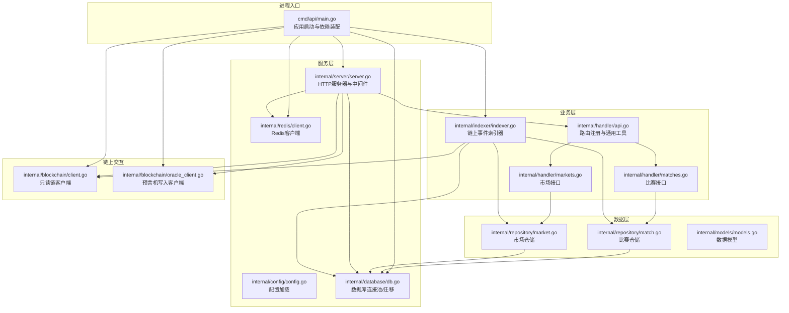
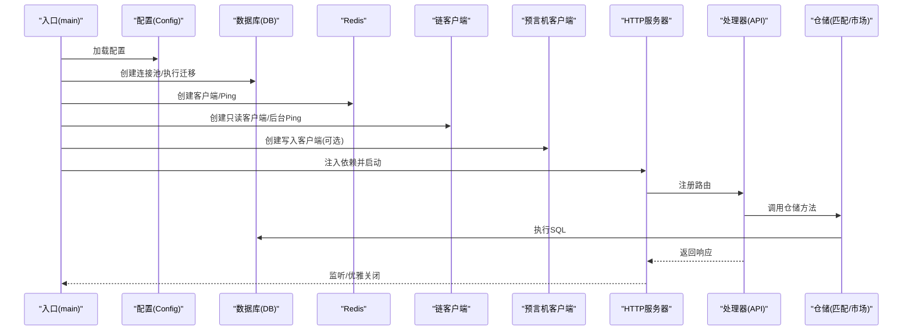
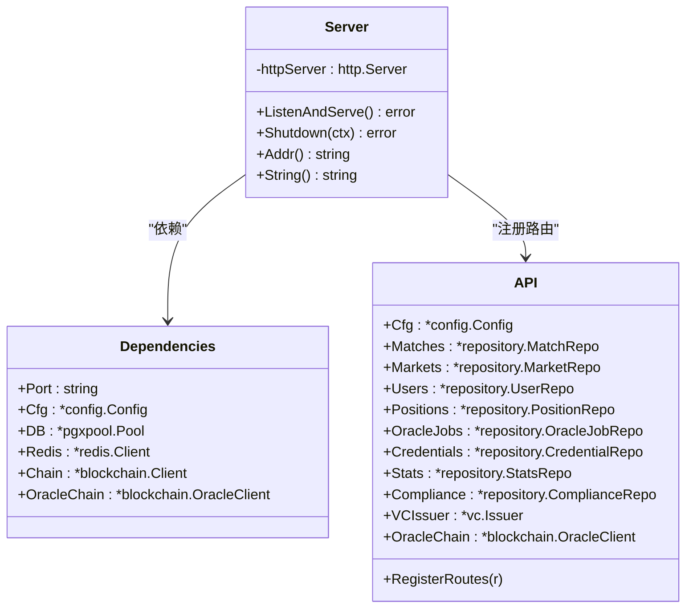
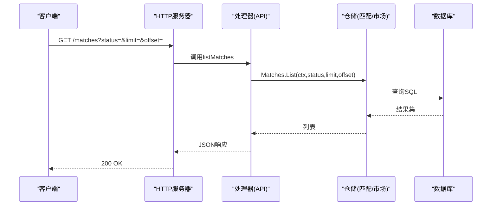
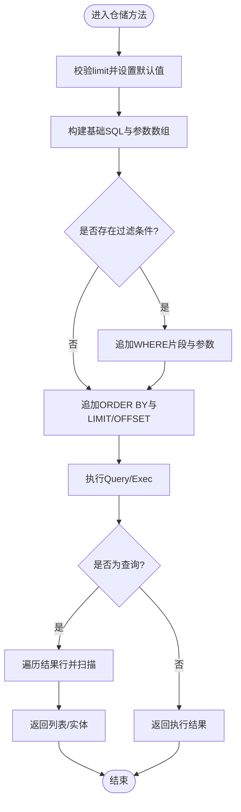
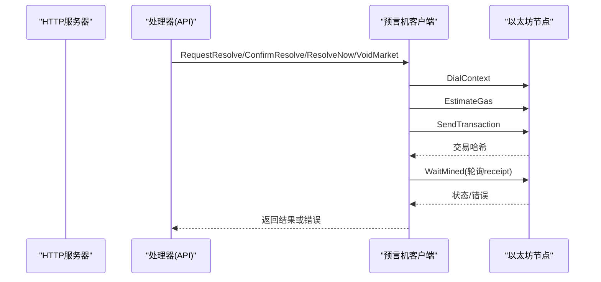
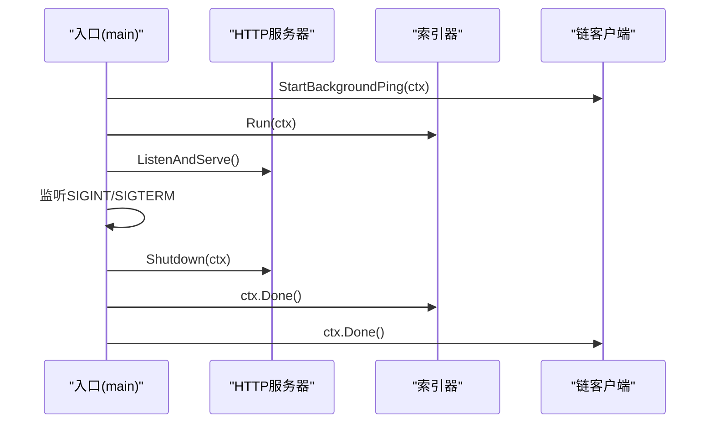
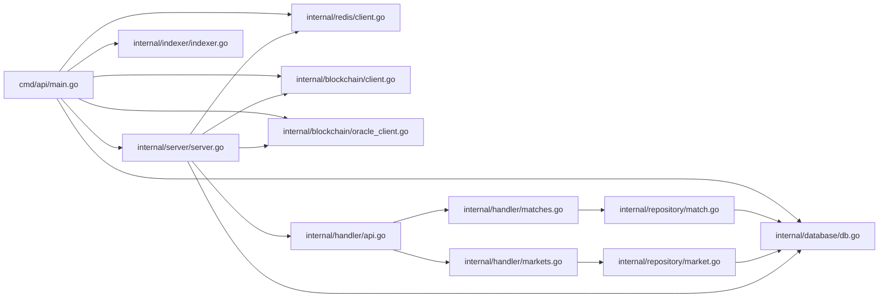

# 组件交互设计

<cite>
**本文档引用的文件**
- [cmd/api/main.go](file://cmd/api/main.go)
- [internal/server/server.go](file://internal/server/server.go)
- [internal/handler/api.go](file://internal/handler/api.go)
- [internal/handler/matches.go](file://internal/handler/matches.go)
- [internal/handler/markets.go](file://internal/handler/markets.go)
- [internal/repository/match.go](file://internal/repository/match.go)
- [internal/repository/market.go](file://internal/repository/market.go)
- [internal/blockchain/client.go](file://internal/blockchain/client.go)
- [internal/blockchain/oracle_client.go](file://internal/blockchain/oracle_client.go)
- [internal/indexer/indexer.go](file://internal/indexer/indexer.go)
- [internal/database/db.go](file://internal/database/db.go)
- [internal/config/config.go](file://internal/config/config.go)
- [internal/redis/client.go](file://internal/redis/client.go)
- [internal/models/models.go](file://internal/models/models.go)
</cite>

## 目录
1. [简介](#简介)
2. [项目结构](#项目结构)
3. [核心组件](#核心组件)
4. [架构总览](#架构总览)
5. [详细组件分析](#详细组件分析)
6. [依赖关系分析](#依赖关系分析)
7. [性能考量](#性能考量)
8. [故障排查指南](#故障排查指南)
9. [结论](#结论)

## 简介
本设计文档面向PredictionDIDSimple后端系统，聚焦于组件交互设计与数据流。重点阐述以下方面：
- Server与Handler的交互关系与路由注册机制
- Handler与Repository的数据传递与业务编排
- Repository与PostgreSQL数据库的连接管理与事务特性
- 与区块链客户端的链上交互（只读与写入）
- 组件生命周期管理、错误传播机制与异常处理策略
- 组件交互图、数据流图与具体调用示例

## 项目结构
系统采用“命令入口 → 服务器 → 处理器 → 仓储 → 数据库/区块链”的分层组织方式，配合独立的索引器与配置模块，形成清晰的职责边界与依赖注入结构。

图表来源
- [cmd/api/main.go:27-161](file://cmd/api/main.go#L27-L161)
- [internal/server/server.go:44-102](file://internal/server/server.go#L44-L102)
- [internal/handler/api.go:34-69](file://internal/handler/api.go#L34-L69)
- [internal/repository/match.go:20-23](file://internal/repository/match.go#L20-L23)
- [internal/repository/market.go:20-23](file://internal/repository/market.go#L20-L23)
- [internal/blockchain/client.go:22-28](file://internal/blockchain/client.go#L22-L28)
- [internal/blockchain/oracle_client.go:34-64](file://internal/blockchain/oracle_client.go#L34-L64)
- [internal/indexer/indexer.go:38-65](file://internal/indexer/indexer.go#L38-L65)
- [internal/database/db.go:16-24](file://internal/database/db.go#L16-L24)
- [internal/redis/client.go:12-21](file://internal/redis/client.go#L12-L21)
- [internal/config/config.go:48-105](file://internal/config/config.go#L48-L105)

章节来源
- [cmd/api/main.go:27-161](file://cmd/api/main.go#L27-L161)
- [internal/server/server.go:44-102](file://internal/server/server.go#L44-L102)
- [internal/handler/api.go:34-69](file://internal/handler/api.go#L34-L69)

## 核心组件
- 应用入口与依赖装配：负责配置加载、数据库迁移、连接池创建、Redis与链客户端初始化、索引器与HTTP服务器启动。
- HTTP服务器：统一注册路由、中间件与处理器，提供REST API能力。
- 处理器：按功能拆分，负责请求解析、鉴权、调用仓储、组装响应。
- 仓储层：封装数据库操作，提供领域模型的增删改查与聚合查询。
- 数据库：PostgreSQL连接池与迁移执行。
- Redis：可选缓存与限速等辅助能力。
- 区块链客户端：提供只读链状态检测与写入型预言机客户端。
- 索引器：轮询区块日志，解析事件并同步至数据库。

章节来源
- [cmd/api/main.go:27-161](file://cmd/api/main.go#L27-L161)
- [internal/server/server.go:24-38](file://internal/server/server.go#L24-L38)
- [internal/handler/api.go:18-31](file://internal/handler/api.go#L18-L31)
- [internal/repository/match.go:15-18](file://internal/repository/match.go#L15-L18)
- [internal/repository/market.go:15-18](file://internal/repository/market.go#L15-L18)
- [internal/database/db.go:16-24](file://internal/database/db.go#L16-L24)
- [internal/redis/client.go:12-21](file://internal/redis/client.go#L12-L21)
- [internal/blockchain/client.go:14-20](file://internal/blockchain/client.go#L14-L20)
- [internal/blockchain/oracle_client.go:25-32](file://internal/blockchain/oracle_client.go#L25-L32)
- [internal/indexer/indexer.go:26-36](file://internal/indexer/indexer.go#L26-L36)

## 架构总览
系统采用“入口装配 → 服务器 → 处理器 → 仓储 → 数据库/区块链”的分层架构，辅以索引器进行链上事件的离线同步。组件间通过依赖注入建立松耦合关系，错误在各层之间逐级传播并由上层统一处理。

图表来源
- [cmd/api/main.go:27-161](file://cmd/api/main.go#L27-L161)
- [internal/server/server.go:44-102](file://internal/server/server.go#L44-L102)
- [internal/handler/api.go:34-69](file://internal/handler/api.go#L34-L69)
- [internal/repository/match.go:25-63](file://internal/repository/match.go#L25-L63)
- [internal/repository/market.go:25-73](file://internal/repository/market.go#L25-L73)
- [internal/database/db.go:16-50](file://internal/database/db.go#L16-L50)
- [internal/redis/client.go:12-28](file://internal/redis/client.go#L12-L28)
- [internal/blockchain/client.go:30-46](file://internal/blockchain/client.go#L30-L46)
- [internal/blockchain/oracle_client.go:34-64](file://internal/blockchain/oracle_client.go#L34-L64)

## 详细组件分析

### Server与Handler交互
- 依赖注入：Server.New接收包含配置、数据库、Redis、链客户端、预言机客户端在内的依赖集合，确保处理器无需感知底层实现细节。
- 路由注册：Handler.API.RegisterRoutes集中注册公开、认证、管理员三类路由，并通过Chi的Group与中间件实现权限控制。
- 中间件：全局中间件包括请求ID、真实IP、日志、panic恢复、速率限制、地理封锁等，保障服务稳定性与安全。
- 响应规范：统一JSON写入与错误写入工具，保证一致性与可观测性。

图表来源
- [internal/server/server.go:24-102](file://internal/server/server.go#L24-L102)
- [internal/handler/api.go:18-31](file://internal/handler/api.go#L18-L31)

章节来源
- [internal/server/server.go:44-102](file://internal/server/server.go#L44-L102)
- [internal/handler/api.go:34-69](file://internal/handler/api.go#L34-L69)

### Handler与Repository数据传递
- 调用链路：Handler方法（如listMatches、getMatch、listMarkets、getMarket）通过r.Context()传递请求上下文，调用对应仓储方法。
- 参数解析：统一的queryInt与parseID工具解析查询参数与路径参数，提供默认值与错误处理。
- 错误传播：仓储层返回的错误通过writeError写入HTTP响应，保持错误语义一致。

图表来源
- [internal/handler/matches.go:8-19](file://internal/handler/matches.go#L8-L19)
- [internal/repository/match.go:25-63](file://internal/repository/match.go#L25-L63)

章节来源
- [internal/handler/matches.go:8-19](file://internal/handler/matches.go#L8-L19)
- [internal/handler/markets.go:10-27](file://internal/handler/markets.go#L10-L27)
- [internal/repository/match.go:25-63](file://internal/repository/match.go#L25-L63)
- [internal/repository/market.go:25-73](file://internal/repository/market.go#L25-L73)

### Repository与数据库连接管理
- 连接池：通过pgxpool.New创建连接池，支持并发查询与自动复用。
- SQL构建：仓储方法动态拼接WHERE条件与排序分页，提升灵活性。
- 扫描与映射：scanMarketRow等方法将数据库行映射为领域模型，处理NULL与嵌套对象。
- 事务特性：仓储方法直接执行SQL，未显式封装事务；若需强一致性，可在上层处理器或仓储内部增加事务包裹。

图表来源
- [internal/repository/match.go:25-63](file://internal/repository/match.go#L25-L63)
- [internal/repository/market.go:25-73](file://internal/repository/market.go#L25-L73)

章节来源
- [internal/database/db.go:16-24](file://internal/database/db.go#L16-L24)
- [internal/repository/match.go:25-63](file://internal/repository/match.go#L25-L63)
- [internal/repository/market.go:25-73](file://internal/repository/market.go#L25-L73)

### 与区块链客户端的链上交互
- 只读链客户端：定期ping节点，维护健康状态与chainID，供服务层健康检查与指标展示。
- 预言机写入客户端：加载合约ABI，构造交易，估算gas，签名并发送，支持等待上链与回执状态检查。
- 索引器：加载工厂与市场合约ABI，轮询区块日志，解析事件并同步到数据库。

图表来源
- [internal/blockchain/oracle_client.go:112-167](file://internal/blockchain/oracle_client.go#L112-L167)
- [internal/blockchain/oracle_client.go:169-192](file://internal/blockchain/oracle_client.go#L169-L192)
- [internal/blockchain/client.go:30-46](file://internal/blockchain/client.go#L30-L46)

章节来源
- [internal/blockchain/client.go:14-20](file://internal/blockchain/client.go#L14-L20)
- [internal/blockchain/oracle_client.go:25-32](file://internal/blockchain/oracle_client.go#L25-L32)
- [internal/blockchain/oracle_client.go:112-167](file://internal/blockchain/oracle_client.go#L112-L167)
- [internal/blockchain/oracle_client.go:169-192](file://internal/blockchain/oracle_client.go#L169-L192)
- [internal/indexer/indexer.go:67-95](file://internal/indexer/indexer.go#L67-L95)

### 组件生命周期管理
- 启动流程：入口加载配置 → 迁移数据库 → 创建连接池 → 初始化Redis与链客户端 → 启动索引器协程 → 创建并启动HTTP服务器 → 监听系统信号 → 优雅关闭。
- 优雅关闭：基于context.WithTimeout控制关闭窗口，Server.Shutdown等待活动请求完成。
- 后台任务：链客户端后台ping、索引器轮询扫描，均通过ctx.Done()响应取消信号。

图表来源
- [cmd/api/main.go:88-110](file://cmd/api/main.go#L88-L110)
- [cmd/api/main.go:133-141](file://cmd/api/main.go#L133-L141)
- [cmd/api/main.go:143-160](file://cmd/api/main.go#L143-L160)
- [internal/blockchain/client.go:30-46](file://internal/blockchain/client.go#L30-L46)
- [internal/indexer/indexer.go:97-120](file://internal/indexer/indexer.go#L97-L120)

章节来源
- [cmd/api/main.go:27-161](file://cmd/api/main.go#L27-L161)
- [internal/blockchain/client.go:30-46](file://internal/blockchain/client.go#L30-L46)
- [internal/indexer/indexer.go:97-120](file://internal/indexer/indexer.go#L97-L120)

### 错误传播机制与异常处理策略
- 入口层：配置加载失败、数据库连接失败、迁移失败直接致命退出；Redis与Oracle客户端初始化失败仅告警并降级运行。
- 服务层：Recoverer中间件捕获panic，避免服务崩溃；Handler统一错误写入，返回JSON错误体。
- 仓储层：SQL执行错误透传至上层；对可预期错误（如NotFound）转换为HTTP 404。
- 链上交互：RPC拨号失败、ChainID不一致、交易回执revert、等待上链超时等均有明确错误返回。

章节来源
- [cmd/api/main.go:29-59](file://cmd/api/main.go#L29-L59)
- [cmd/api/main.go:66-81](file://cmd/api/main.go#L66-L81)
- [internal/server/server.go:50-52](file://internal/server/server.go#L50-L52)
- [internal/handler/api.go:78-81](file://internal/handler/api.go#L78-L81)
- [internal/blockchain/client.go:48-82](file://internal/blockchain/client.go#L48-L82)
- [internal/blockchain/oracle_client.go:169-192](file://internal/blockchain/oracle_client.go#L169-L192)

## 依赖关系分析
- 耦合度：Server与Handler通过依赖注入解耦；Handler与仓储通过接口解耦；仓储与数据库通过连接池解耦。
- 外部依赖：PostgreSQL、Redis、以太坊节点；索引器依赖多个合约ABI文件。
- 循环依赖：未发现直接循环依赖；链上交互通过独立客户端模块隔离。

图表来源
- [cmd/api/main.go:27-161](file://cmd/api/main.go#L27-L161)
- [internal/server/server.go:44-102](file://internal/server/server.go#L44-L102)
- [internal/handler/api.go:34-69](file://internal/handler/api.go#L34-L69)
- [internal/repository/match.go:20-23](file://internal/repository/match.go#L20-L23)
- [internal/repository/market.go:20-23](file://internal/repository/market.go#L20-L23)

章节来源
- [cmd/api/main.go:27-161](file://cmd/api/main.go#L27-L161)
- [internal/server/server.go:44-102](file://internal/server/server.go#L44-L102)
- [internal/handler/api.go:34-69](file://internal/handler/api.go#L34-L69)

## 性能考量
- 数据库：使用连接池减少连接开销；仓储方法支持分页与条件过滤，避免全表扫描。
- Redis：可选启用，建议用于热点数据与限流；Ping检测失败时降级运行，不影响核心功能。
- 链上交互：估算gas失败时采用保守值；交易上链轮询次数与间隔可调，平衡成功率与延迟。
- 索引器：每次扫描上限定区块范围（最大2000区块），避免RPC超时；事件解析与入库分离，降低单次耗时。

## 故障排查指南
- 配置问题：确认DATABASE_URL、CHAIN_ID、MARKET_FACTORY_ADDRESS等关键环境变量正确。
- 数据库：检查连接池Ping与迁移执行日志；关注SQL执行错误与参数绑定。
- Redis：确认URL解析与Ping结果；若失败，服务仍可运行但部分功能降级。
- 链客户端：观察后台Ping日志，确认RPC拨号与ChainID一致性；健康状态用于健康检查。
- 预言机：检查ABI加载、私钥格式、gas估算与交易上链状态；回执revert会返回明确错误。
- 索引器：查看轮询间隔、起始区块与事件解析日志；确认合约ABI文件存在且可读。

章节来源
- [internal/config/config.go:48-105](file://internal/config/config.go#L48-L105)
- [internal/database/db.go:26-50](file://internal/database/db.go#L26-L50)
- [internal/redis/client.go:23-28](file://internal/redis/client.go#L23-L28)
- [internal/blockchain/client.go:48-82](file://internal/blockchain/client.go#L48-L82)
- [internal/blockchain/oracle_client.go:82-110](file://internal/blockchain/oracle_client.go#L82-L110)
- [internal/blockchain/oracle_client.go:169-192](file://internal/blockchain/oracle_client.go#L169-L192)
- [internal/indexer/indexer.go:97-120](file://internal/indexer/indexer.go#L97-L120)

## 结论
本系统通过清晰的分层与依赖注入，实现了Server与Handler、Handler与仓储、仓储与数据库、以及与区块链客户端的稳定交互。入口层负责资源初始化与生命周期管理，服务层提供统一的路由与中间件，仓储层抽象数据访问，链上交互模块分别承担只读与写入职责。整体设计具备良好的扩展性与可维护性，适合在生产环境中持续演进。