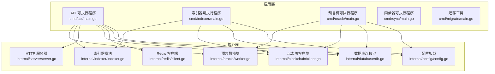
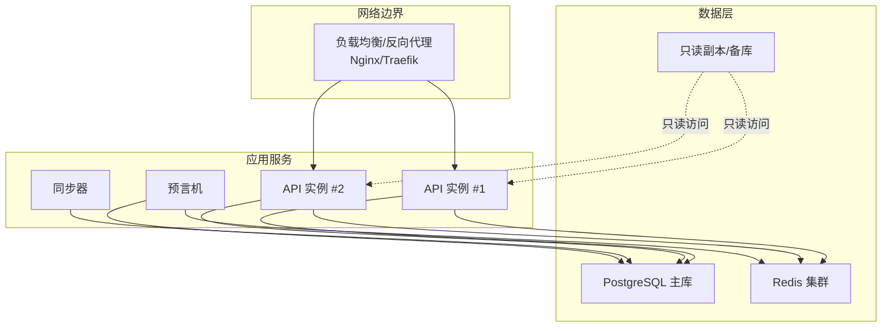
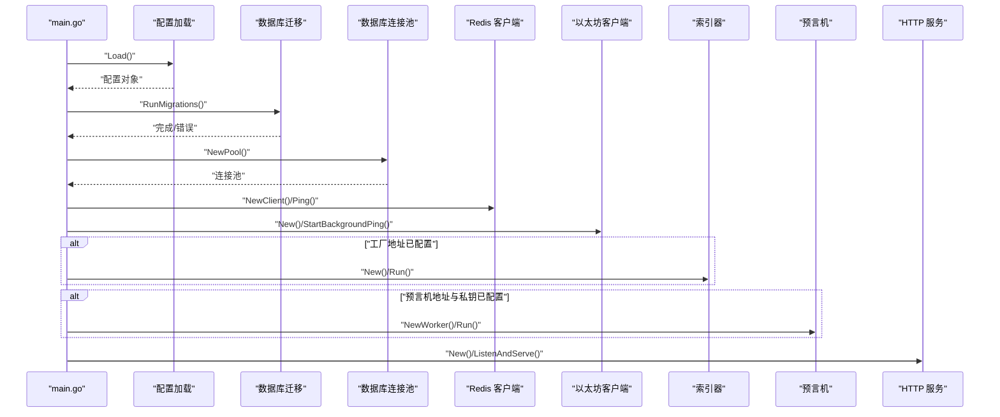
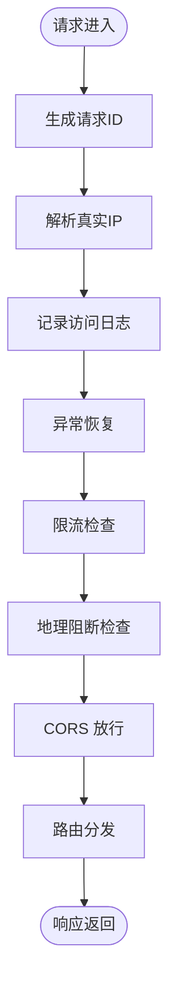
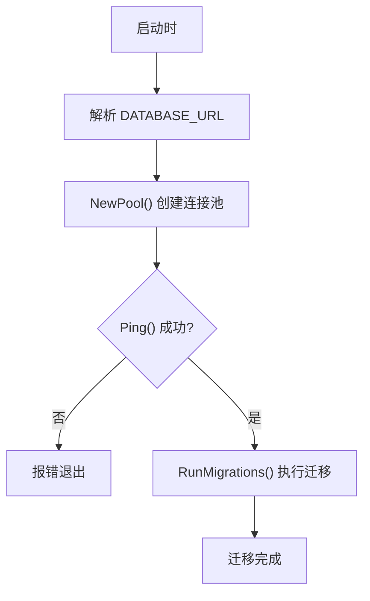
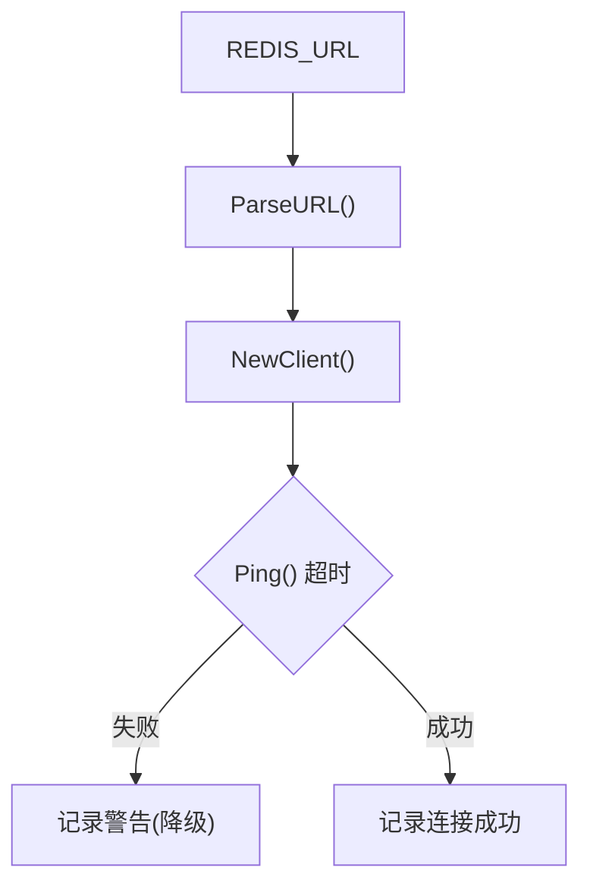
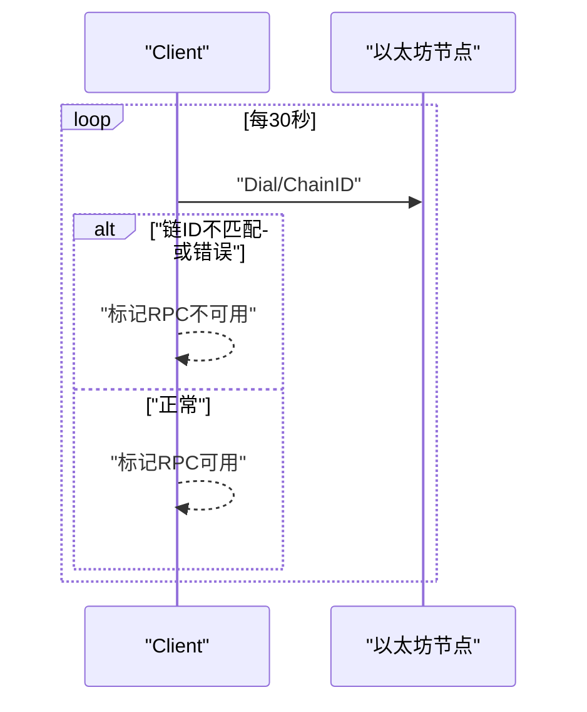
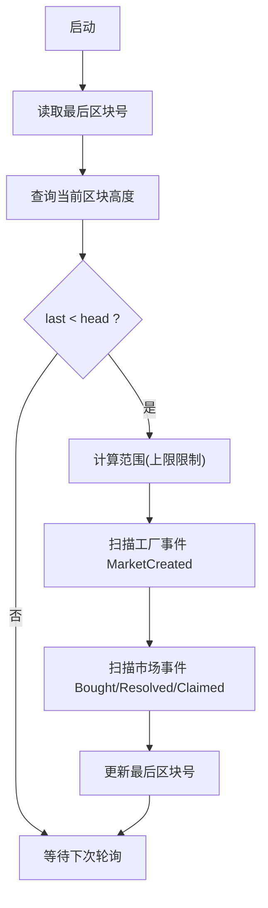
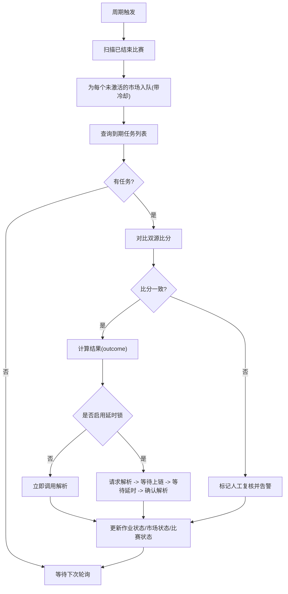
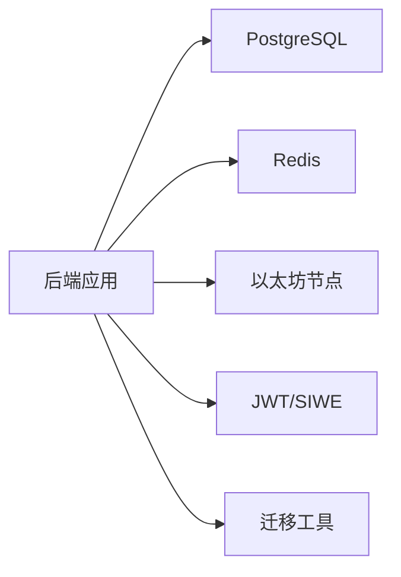

# 部署架构

<cite>
**本文引用的文件**
- [cmd/api/main.go](file://cmd/api/main.go)
- [internal/config/config.go](file://internal/config/config.go)
- [internal/database/db.go](file://internal/database/db.go)
- [internal/redis/client.go](file://internal/redis/client.go)
- [internal/server/server.go](file://internal/server/server.go)
- [internal/blockchain/client.go](file://internal/blockchain/client.go)
- [internal/indexer/indexer.go](file://internal/indexer/indexer.go)
- [internal/oracle/worker.go](file://internal/oracle/worker.go)
- [go.mod](file://go.mod)
</cite>

## 目录
1. [简介](#简介)
2. [项目结构](#项目结构)
3. [核心组件](#核心组件)
4. [架构总览](#架构总览)
5. [详细组件分析](#详细组件分析)
6. [依赖关系分析](#依赖关系分析)
7. [性能考虑与容量规划](#性能考虑与容量规划)
8. [故障排查指南](#故障排查指南)
9. [结论](#结论)
10. [附录](#附录)

## 简介
本文件面向PredictionDIDSimple后端服务，提供从容器化到运维监控的完整部署架构说明。内容覆盖：
- 容器化部署策略、Docker配置与编排方案
- 数据库与缓存的部署、高可用与灾备
- 负载均衡与反向代理
- 监控与日志收集
- 多环境配置管理（开发、测试、生产）
- 部署流程、CI/CD与自动化运维
- 性能调优与容量规划

## 项目结构
后端采用多命令入口组织，核心API服务通过独立可执行程序启动，同时支持索引器与预言机等后台任务。整体结构清晰，便于容器化与微服务化扩展。

图表来源
- [cmd/api/main.go](file://cmd/api/main.go#L24-L117)
- [internal/server/server.go](file://internal/server/server.go#L35-L84)
- [internal/config/config.go](file://internal/config/config.go#L45-L96)
- [internal/database/db.go](file://internal/database/db.go#L14-L26)
- [internal/redis/client.go](file://internal/redis/client.go#L10-L22)
- [internal/blockchain/client.go](file://internal/blockchain/client.go#L19-L78)
- [internal/indexer/indexer.go](file://internal/indexer/indexer.go#L35-L57)
- [internal/oracle/worker.go](file://internal/oracle/worker.go#L26-L36)

章节来源
- [cmd/api/main.go](file://cmd/api/main.go#L1-L118)
- [internal/server/server.go](file://internal/server/server.go#L1-L102)
- [internal/config/config.go](file://internal/config/config.go#L1-L128)

## 核心组件
- 配置管理：集中于配置结构体与环境变量加载，支持运行时参数覆盖与默认值。
- 数据库：基于PostgreSQL，使用连接池与迁移工具进行版本控制。
- 缓存：基于Redis，提供连接解析与健康检查。
- 区块链：以太坊客户端封装，包含链ID校验与后台心跳检测。
- 服务：基于HTTP路由框架构建REST API，内置CORS、限流、地理阻断与健康检查。
- 后台任务：索引器与预言机分别扫描链上事件并写入数据库，支持周期性轮询与状态持久化。

章节来源
- [internal/config/config.go](file://internal/config/config.go#L10-L96)
- [internal/database/db.go](file://internal/database/db.go#L14-L42)
- [internal/redis/client.go](file://internal/redis/client.go#L10-L22)
- [internal/blockchain/client.go](file://internal/blockchain/client.go#L19-L78)
- [internal/server/server.go](file://internal/server/server.go#L35-L84)
- [internal/indexer/indexer.go](file://internal/indexer/indexer.go#L85-L135)
- [internal/oracle/worker.go](file://internal/oracle/worker.go#L38-L100)

## 架构总览
下图展示容器化部署下的典型拓扑：前端通过反向代理接入，后端API服务负责业务逻辑，数据库与缓存作为共享资源，索引器与预言机作为后台任务独立运行。

图表来源
- [internal/server/server.go](file://internal/server/server.go#L77-L84)
- [internal/database/db.go](file://internal/database/db.go#L14-L26)
- [internal/redis/client.go](file://internal/redis/client.go#L10-L22)
- [internal/indexer/indexer.go](file://internal/indexer/indexer.go#L85-L135)
- [internal/oracle/worker.go](file://internal/oracle/worker.go#L38-L100)

## 详细组件分析

### API 服务生命周期与依赖注入
API主程序负责：
- 加载配置
- 应用数据库迁移
- 初始化数据库连接池与Redis客户端
- 启动以太坊客户端心跳
- 启动索引器与预言机（条件满足时）
- 启动HTTP服务并优雅关闭

图表来源
- [cmd/api/main.go](file://cmd/api/main.go#L24-L117)
- [internal/config/config.go](file://internal/config/config.go#L45-L96)
- [internal/database/db.go](file://internal/database/db.go#L28-L42)
- [internal/redis/client.go](file://internal/redis/client.go#L10-L22)
- [internal/blockchain/client.go](file://internal/blockchain/client.go#L26-L78)
- [internal/indexer/indexer.go](file://internal/indexer/indexer.go#L35-L57)
- [internal/oracle/worker.go](file://internal/oracle/worker.go#L26-L36)
- [internal/server/server.go](file://internal/server/server.go#L35-L84)

章节来源
- [cmd/api/main.go](file://cmd/api/main.go#L24-L117)

### HTTP 服务与中间件
- 路由与中间件：请求ID、真实IP、日志、恢复、限流、地理阻断。
- CORS：允许指定来源与凭证。
- 健康检查：集成数据库、Redis与区块链状态。
- 路由注册：健康检查与API处理器。

图表来源
- [internal/server/server.go](file://internal/server/server.go#L36-L84)

章节来源
- [internal/server/server.go](file://internal/server/server.go#L35-L84)

### 数据库与迁移
- 连接池：初始化与超时健康检查。
- 迁移：基于文件系统迁移脚本，自动应用至目标数据库。

图表来源
- [internal/database/db.go](file://internal/database/db.go#L14-L42)

章节来源
- [internal/database/db.go](file://internal/database/db.go#L14-L42)

### Redis 客户端
- 解析URL并创建客户端。
- 提供健康检查方法，用于启动阶段探测。

图表来源
- [internal/redis/client.go](file://internal/redis/client.go#L10-L22)

章节来源
- [internal/redis/client.go](file://internal/redis/client.go#L10-L22)

### 区块链客户端
- 后台定时心跳，校验链ID与连通性。
- 提供状态查询接口供健康检查使用。

图表来源
- [internal/blockchain/client.go](file://internal/blockchain/client.go#L26-L78)

章节来源
- [internal/blockchain/client.go](file://internal/blockchain/client.go#L19-L78)

### 索引器工作流
- 周期性轮询区块范围，扫描工厂合约事件与市场事件。
- 将链上事件映射为内部模型并写入数据库。
- 维护最后区块号状态，避免重复处理。

图表来源
- [internal/indexer/indexer.go](file://internal/indexer/indexer.go#L85-L135)
- [internal/indexer/indexer.go](file://internal/indexer/indexer.go#L137-L154)
- [internal/indexer/indexer.go](file://internal/indexer/indexer.go#L212-L244)

章节来源
- [internal/indexer/indexer.go](file://internal/indexer/indexer.go#L85-L135)
- [internal/indexer/indexer.go](file://internal/indexer/indexer.go#L137-L154)
- [internal/indexer/indexer.go](file://internal/indexer/indexer.go#L212-L244)

### 预言机工作流
- 将“已结束”的比赛纳入待处理队列，并按冷却时间入队。
- 对到期任务，比较双源比分，根据规则推导结果。
- 可选延时锁机制：请求/确认两阶段，等待区块确认后再执行。

图表来源
- [internal/oracle/worker.go](file://internal/oracle/worker.go#L38-L100)
- [internal/oracle/worker.go](file://internal/oracle/worker.go#L102-L164)

章节来源
- [internal/oracle/worker.go](file://internal/oracle/worker.go#L38-L100)
- [internal/oracle/worker.go](file://internal/oracle/worker.go#L102-L164)

## 依赖关系分析
- 运行时依赖：Go标准库、HTTP路由、数据库驱动、迁移工具、Redis客户端、以太坊客户端、JWT与SIWE。
- 关键外部组件：PostgreSQL、Redis、以太坊节点（主/备用）。

图表来源
- [go.mod](file://go.mod#L5-L14)
- [internal/database/db.go](file://internal/database/db.go#L8-L11)
- [internal/redis/client.go](file://internal/redis/client.go#L7)
- [internal/blockchain/client.go](file://internal/blockchain/client.go#L9)

章节来源
- [go.mod](file://go.mod#L1-L56)

## 性能考虑与容量规划
- 数据库
  - 使用连接池并设置合理最大连接数与空闲连接数。
  - 读写分离：主库写入，只读副本用于查询，降低主库压力。
  - 分表分库：按比赛/市场维度拆分，结合索引优化高频查询。
- 缓存
  - 热点数据（市场、用户、匹配）放入Redis，设置过期策略与淘汰策略。
  - 集群部署：主从复制+哨兵/集群模式，提升可用性与吞吐。
- 网络与服务
  - 启用HTTP/2与压缩，减少延迟。
  - 限流与熔断：防止突发流量击穿。
- 区块链
  - 多RPC节点与备用链路，心跳检测失败时快速切换。
  - 事件扫描窗口大小与轮询间隔需平衡实时性与成本。
- 预言机
  - 冷却时间与延时锁配置应结合链上确认时间与业务SLA。
  - 并发度与重试策略需谨慎设置，避免重复提交。

[本节为通用性能建议，无需特定文件引用]

## 故障排查指南
- 启动失败
  - 检查DATABASE_URL是否正确且可达。
  - 查看迁移是否成功，必要时手动执行迁移。
- Redis不可用
  - 启动阶段会记录警告并降级，确认Redis连接URL与网络连通。
- 健康检查异常
  - 数据库：检查连接池与Ping超时。
  - Redis：检查Ping与网络。
  - 区块链：检查RPC URL、链ID与心跳日志。
- 索引器/预言机无进展
  - 检查轮询间隔、开始区块与事件ABI加载路径。
  - 关注日志中的错误与重试提示。

章节来源
- [cmd/api/main.go](file://cmd/api/main.go#L33-L59)
- [internal/database/db.go](file://internal/database/db.go#L22-L26)
- [internal/redis/client.go](file://internal/redis/client.go#L18-L22)
- [internal/blockchain/client.go](file://internal/blockchain/client.go#L42-L78)
- [internal/indexer/indexer.go](file://internal/indexer/indexer.go#L60-L83)
- [internal/oracle/worker.go](file://internal/oracle/worker.go#L53-L58)

## 结论
该后端服务具备清晰的模块化结构与完善的启动流程，适合在容器化环境中以多实例部署。通过合理的数据库与缓存策略、多RPC节点与告警机制，以及明确的CI/CD与监控方案，可在不同环境下实现稳定、可扩展与可观测的生产部署。

[本节为总结性内容，无需特定文件引用]

## 附录

### 环境变量与配置要点
- 必填项：DATABASE_URL
- 重要参数：HTTP_PORT、REDIS_URL、ETH_RPC_URL、CHAIN_ID、MARKET_FACTORY_ADDRESS、ORACLE_ADAPTER_ADDRESS、ORACLE_PRIVATE_KEY、INDEXER_POLL_SECONDS、ORACLE_POLL_SECONDS、ORACLE_COOLDOWN_MINUTES、ORACLE_TIMELOCK_SECONDS、ADMIN_API_KEY、VC_ISSUER_KEY、ALERT_WEBHOOK_URL、BLOCKED_COUNTRIES、GEO_BLOCK_ENABLED、RATE_LIMIT_PER_MINUTE、KYC_WEBHOOK_SECRET、COMPLIANCE_REQUIRED、APP_ENV

章节来源
- [internal/config/config.go](file://internal/config/config.go#L45-L96)

### 容器化与编排建议
- 镜像基础：官方Go镜像构建，最小化运行时镜像。
- 入口命令：使用API主程序作为容器入口，后台可选择性启动索引器/预言机。
- 健康检查：暴露健康端点，结合数据库、Redis与区块链状态。
- 配置注入：通过环境变量与密文管理工具注入敏感信息。
- 卷与持久化：仅对需要的配置与日志目录挂载卷。
- 编排：Kubernetes或Docker Compose，设置副本数、滚动更新、就绪探针与资源限制。

[本节为通用编排建议，无需特定文件引用]

### 监控与日志
- 指标：应用指标（QPS、P95/P99、错误率）、数据库指标（连接数、慢查询）、缓存指标（命中率、内存使用）、区块链节点指标（响应时间、链高）。
- 日志：统一格式化输出，区分级别，采集到集中式日志平台。
- 告警：阈值告警与异常检测，结合Webhook通知。

[本节为通用监控建议，无需特定文件引用]

### CI/CD 与自动化运维
- 构建：拉取依赖、单元测试、静态检查、构建二进制。
- 扫描：镜像漏洞扫描与依赖安全扫描。
- 部署：蓝绿/金丝雀发布，配合回滚策略。
- 运维：变更管理、发布评审、应急响应预案。

[本节为通用CI/CD建议，无需特定文件引用]