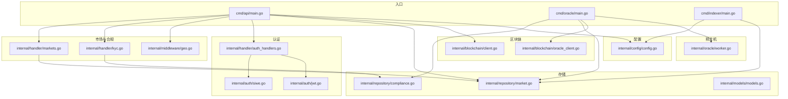
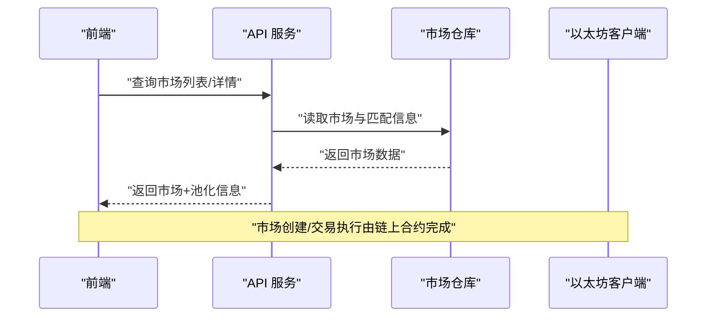
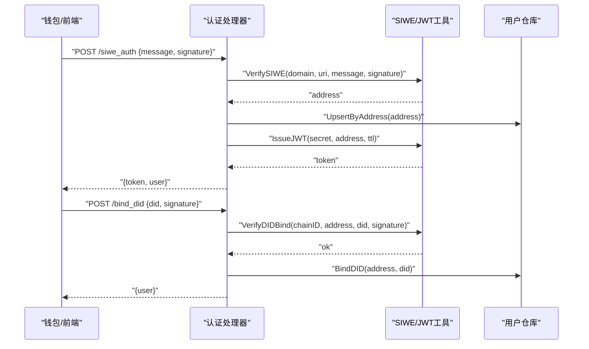
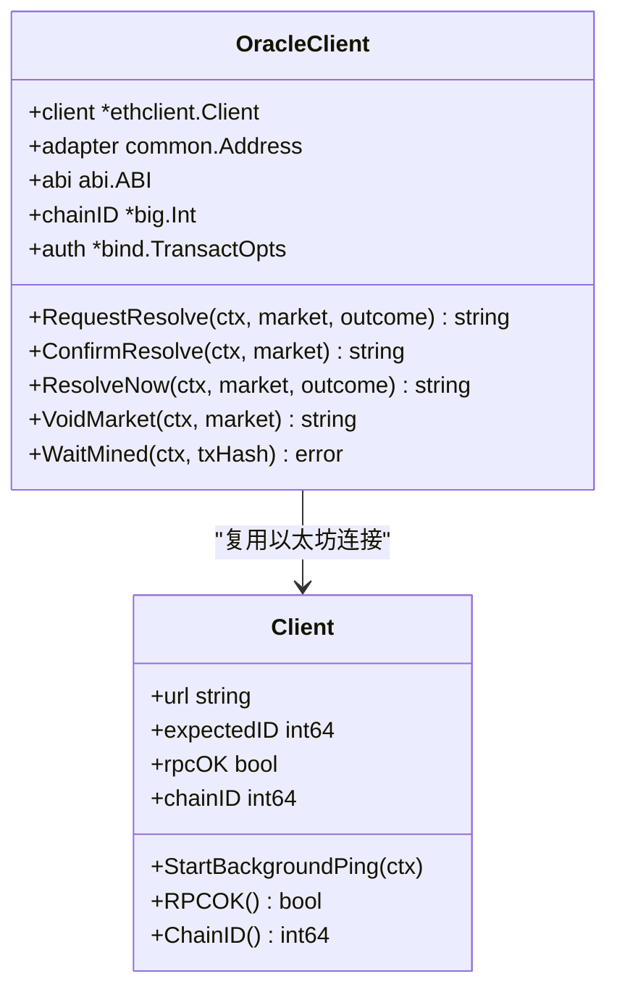
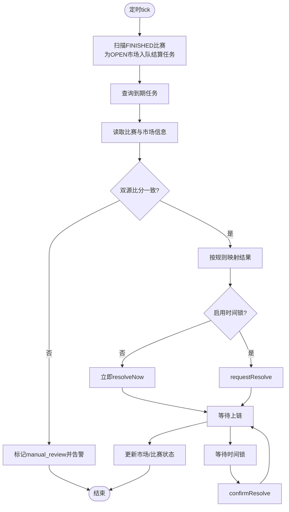
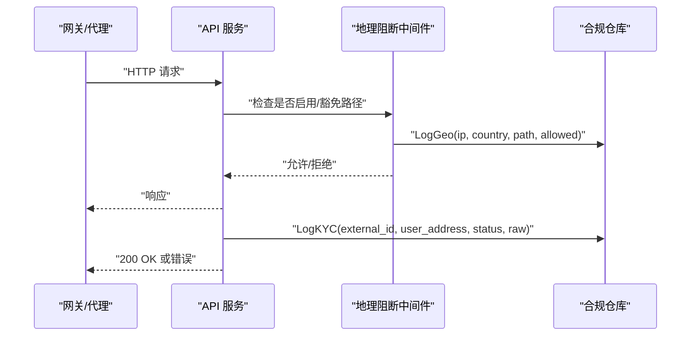
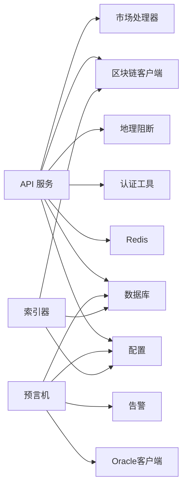

# 核心功能模块

<cite>
**本文引用的文件**
- [cmd/api/main.go](file://cmd/api/main.go)
- [internal/config/config.go](file://internal/config/config.go)
- [internal/blockchain/client.go](file://internal/blockchain/client.go)
- [internal/blockchain/oracle_client.go](file://internal/blockchain/oracle_client.go)
- [internal/auth/jwt.go](file://internal/auth/jwt.go)
- [internal/auth/siwe.go](file://internal/auth/siwe.go)
- [internal/handler/auth_handlers.go](file://internal/handler/auth_handlers.go)
- [internal/handler/markets.go](file://internal/handler/markets.go)
- [internal/handler/kyc.go](file://internal/handler/kyc.go)
- [internal/middleware/geo.go](file://internal/middleware/geo.go)
- [internal/oracle/worker.go](file://internal/oracle/worker.go)
- [internal/repository/market.go](file://internal/repository/market.go)
- [internal/repository/compliance.go](file://internal/repository/compliance.go)
- [internal/models/models.go](file://internal/models/models.go)
- [pkg/contracts/MarketFactory.json](file://pkg/contracts/MarketFactory.json)
</cite>

## 目录
1. [简介](#简介)
2. [项目结构](#项目结构)
3. [核心组件](#核心组件)
4. [架构总览](#架构总览)
5. [详细组件分析](#详细组件分析)
6. [依赖关系分析](#依赖关系分析)
7. [性能考量](#性能考量)
8. [故障排查指南](#故障排查指南)
9. [结论](#结论)
10. [附录](#附录)

## 简介
本文件面向PredictionDIDSimple后端的核心功能模块，系统性梳理以下能力：
- 预测市场：市场创建、交易执行、池化与结算
- 身份认证：JWT令牌管理、SIWE协议实现、DID身份绑定
- 区块链集成：以太坊客户端、智能合约交互、事件监听
- 自动化预言机：数据源校验、冲突处理、时间锁机制
- 合规管理：地理限制与KYC集成

文档提供实现细节、使用模式、配置项说明、常见问题与最佳实践，并辅以图示帮助理解。

## 项目结构
后端采用分层与按功能域组织的结构：
- 入口程序：各子命令入口（API、索引器、预言机等）
- 配置：集中式环境变量加载与解析
- 区块链：通用客户端与预言机专用客户端
- 认证：JWT与SIWE工具，以及鉴权处理器
- 处理器：API路由与业务处理
- 中间件：地理阻断与限流
- 仓库：数据库访问层
- 模型：领域模型定义
- 合约：ABI与字节码资源



图表来源
- [cmd/api/main.go](file://cmd/api/main.go#L24-L118)
- [internal/config/config.go](file://internal/config/config.go#L45-L97)
- [internal/blockchain/client.go](file://internal/blockchain/client.go#L19-L79)
- [internal/blockchain/oracle_client.go](file://internal/blockchain/oracle_client.go#L31-L55)
- [internal/auth/jwt.go](file://internal/auth/jwt.go#L16-L43)
- [internal/auth/siwe.go](file://internal/auth/siwe.go#L17-L56)
- [internal/handler/auth_handlers.go](file://internal/handler/auth_handlers.go#L16-L79)
- [internal/handler/markets.go](file://internal/handler/markets.go#L9-L50)
- [internal/handler/kyc.go](file://internal/handler/kyc.go#L14-L55)
- [internal/middleware/geo.go](file://internal/middleware/geo.go#L10-L51)
- [internal/oracle/worker.go](file://internal/oracle/worker.go#L38-L173)
- [internal/repository/market.go](file://internal/repository/market.go#L21-L172)
- [internal/repository/compliance.go](file://internal/repository/compliance.go#L17-L29)
- [internal/models/models.go](file://internal/models/models.go#L5-L58)

章节来源
- [cmd/api/main.go](file://cmd/api/main.go#L24-L118)
- [internal/config/config.go](file://internal/config/config.go#L45-L97)

## 核心组件
- 配置中心：统一加载环境变量，解析链ID、区块起始高度、地理封锁、速率限制、KYC回调密钥等
- 区块链客户端：通用以太坊客户端与背景心跳检测；预言机专用客户端封装合约交互
- 认证体系：SIWE消息签名验证、JWT签发与解析、DID绑定校验
- 市场与合规：市场查询与访问控制、地理阻断中间件、KYC Webhook处理
- 预言机工作流：定时扫描、数据源比对、冲突告警、时间锁与确认
- 数据访问：市场、合规日志、索引状态等仓库层

章节来源
- [internal/config/config.go](file://internal/config/config.go#L10-L43)
- [internal/blockchain/client.go](file://internal/blockchain/client.go#L12-L79)
- [internal/blockchain/oracle_client.go](file://internal/blockchain/oracle_client.go#L23-L157)
- [internal/auth/jwt.go](file://internal/auth/jwt.go#L11-L43)
- [internal/auth/siwe.go](file://internal/auth/siwe.go#L12-L56)
- [internal/handler/markets.go](file://internal/handler/markets.go#L9-L50)
- [internal/middleware/geo.go](file://internal/middleware/geo.go#L10-L51)
- [internal/handler/kyc.go](file://internal/handler/kyc.go#L14-L55)
- [internal/oracle/worker.go](file://internal/oracle/worker.go#L16-L173)
- [internal/repository/market.go](file://internal/repository/market.go#L13-L172)
- [internal/repository/compliance.go](file://internal/repository/compliance.go#L9-L29)

## 架构总览
系统由API服务、索引器、预言机三类进程构成，共享配置、数据库与Redis。API负责对外服务，索引器从链上事件同步市场与匹配信息，预言机在比赛结束后自动结算。

```mermaid
graph TB
API["API 服务<br/>监听端口/路由/中间件"] --> CFG["配置中心"]
API --> DB["PostgreSQL"]
API --> REDIS["Redis"]
API --> ETH["以太坊客户端"]
API --> AUTH["认证/授权"]
API --> GEO["地理阻断中间件"]
IDX["索引器进程"] --> CFG
IDX --> DB
IDX --> ETH
ORA["预言机进程"] --> CFG
ORA --> DB
ORA --> ORA_CLI["预言机合约客户端"]
ORA --> GEO
ORA --> ALERT["告警通知"]
subgraph "外部"
ETHNET["以太坊网络"]
DATA["外部比分数据源"]
end
ETH <- --> ETHNET
ORA_CLI <- --> ETHNET
ORA --> DATA
```

图表来源
- [cmd/api/main.go](file://cmd/api/main.go#L61-L98)
- [internal/blockchain/client.go](file://internal/blockchain/client.go#L26-L79)
- [internal/blockchain/oracle_client.go](file://internal/blockchain/oracle_client.go#L31-L55)
- [internal/middleware/geo.go](file://internal/middleware/geo.go#L10-L51)
- [internal/oracle/worker.go](file://internal/oracle/worker.go#L38-L173)

## 详细组件分析

### 预测市场功能
- 市场创建与同步
  - 工厂合约创建市场事件监听与入库，支持多版本工厂地址
  - 市场池化与储备字段用于交易执行与结算
- 交易执行与池化
  - 市场状态与池规模通过仓库更新，支持YES/NO方向资金池
- 结算流程
  - 预言机根据规则将比分映射为结果，调用合约进行结算或作废



图表来源
- [internal/handler/markets.go](file://internal/handler/markets.go#L9-L50)
- [internal/repository/market.go](file://internal/repository/market.go#L21-L172)
- [pkg/contracts/MarketFactory.json](file://pkg/contracts/MarketFactory.json#L129-L144)

章节来源
- [internal/handler/markets.go](file://internal/handler/markets.go#L9-L50)
- [internal/repository/market.go](file://internal/repository/market.go#L21-L172)
- [pkg/contracts/MarketFactory.json](file://pkg/contracts/MarketFactory.json#L129-L144)

### 身份认证系统
- SIWE协议
  - 解析并验证消息域名、URI、过期时间与签名，返回标准化地址
- JWT令牌
  - 使用对称密钥签发与解析，携带用户地址与签发/过期时间
- DID绑定
  - 校验DID格式与链ID一致性，服务端记录绑定关系



图表来源
- [internal/handler/auth_handlers.go](file://internal/handler/auth_handlers.go#L16-L79)
- [internal/auth/siwe.go](file://internal/auth/siwe.go#L17-L56)
- [internal/auth/jwt.go](file://internal/auth/jwt.go#L16-L43)

章节来源
- [internal/handler/auth_handlers.go](file://internal/handler/auth_handlers.go#L16-L79)
- [internal/auth/siwe.go](file://internal/auth/siwe.go#L17-L56)
- [internal/auth/jwt.go](file://internal/auth/jwt.go#L16-L43)

### 区块链集成功能
- 以太坊客户端
  - 定时心跳检测RPC连通性与链ID一致性
- 预言机客户端
  - 加载Oracle适配器ABI，封装请求/确认/即时结算/作废等方法
  - 估算Gas、构造交易、签名发送、等待上链与回执检查



图表来源
- [internal/blockchain/client.go](file://internal/blockchain/client.go#L12-L79)
- [internal/blockchain/oracle_client.go](file://internal/blockchain/oracle_client.go#L23-L157)

章节来源
- [internal/blockchain/client.go](file://internal/blockchain/client.go#L26-L79)
- [internal/blockchain/oracle_client.go](file://internal/blockchain/oracle_client.go#L31-L157)

### 自动化预言机工作流
- 触发条件
  - 索引器将“已结束”的比赛标记为“待结算”，为每张开放市场生成结算任务
- 数据源比对
  - 双源比分对比，不一致则进入人工复核并告警
- 时间锁机制
  - 可配置冷却时间；可启用请求-确认两步式结算，带时间锁等待期
- 结果写入
  - 成功后更新市场状态与胜出结果，更新比赛状态



图表来源
- [internal/oracle/worker.go](file://internal/oracle/worker.go#L60-L173)

章节来源
- [internal/oracle/worker.go](file://internal/oracle/worker.go#L38-L173)

### 合规性管理
- 地理位置限制
  - 通过HTTP头识别国家代码，命中黑名单即拒绝请求
- KYC集成
  - 接收外部KYC Webhook，校验签名，记录事件并按需签发凭证



图表来源
- [internal/middleware/geo.go](file://internal/middleware/geo.go#L10-L51)
- [internal/repository/compliance.go](file://internal/repository/compliance.go#L17-L29)
- [internal/handler/kyc.go](file://internal/handler/kyc.go#L14-L55)

章节来源
- [internal/middleware/geo.go](file://internal/middleware/geo.go#L10-L51)
- [internal/repository/compliance.go](file://internal/repository/compliance.go#L17-L29)
- [internal/handler/kyc.go](file://internal/handler/kyc.go#L14-L55)

## 依赖关系分析
- 组件耦合
  - API依赖配置、数据库、Redis、区块链客户端；认证与地理阻断作为横切关注点
  - 预言机依赖配置、数据库、Oracle客户端、告警与双源提供者
  - 仓库层对数据库抽象清晰，便于测试与替换
- 外部依赖
  - 以太坊客户端库、JWT库、合约ABI资源



图表来源
- [cmd/api/main.go](file://cmd/api/main.go#L61-L98)
- [internal/oracle/worker.go](file://internal/oracle/worker.go#L26-L36)

章节来源
- [cmd/api/main.go](file://cmd/api/main.go#L61-L98)
- [internal/oracle/worker.go](file://internal/oracle/worker.go#L26-L36)

## 性能考量
- 连接池与超时
  - 数据库连接池、Redis客户端、以太坊客户端均应设置合理超时与重试策略
- 并发与限速
  - 速率限制中间件保护下游，避免突发流量
- 缓存与索引
  - Redis用于会话与缓存；索引器离线同步降低实时压力
- Gas优化
  - 预言机交易估算失败时回退到固定值，建议监控Gas价格波动

## 故障排查指南
- RPC不可达或链ID不匹配
  - 检查以太坊RPC URL与链ID配置，确认后台心跳日志
- 交易上链失败或回滚
  - 检查Gas价格、Nonce与账户余额；等待上链后查看回执状态
- SIWE签名验证失败
  - 核对域名、URI、过期时间与签名来源钱包
- JWT签发/解析异常
  - 确认JWT密钥一致且未被修改
- 地理阻断误判
  - 检查HTTP头来源与黑名单配置
- KYC Webhook未生效
  - 校验签名密钥、请求体大小限制与JSON结构

章节来源
- [internal/blockchain/client.go](file://internal/blockchain/client.go#L42-L79)
- [internal/blockchain/oracle_client.go](file://internal/blockchain/oracle_client.go#L111-L157)
- [internal/auth/siwe.go](file://internal/auth/siwe.go#L17-L56)
- [internal/auth/jwt.go](file://internal/auth/jwt.go#L28-L43)
- [internal/middleware/geo.go](file://internal/middleware/geo.go#L10-L51)
- [internal/handler/kyc.go](file://internal/handler/kyc.go#L14-L55)

## 结论
该系统围绕预测市场、身份认证、区块链交互与合规管理构建了完整闭环。通过可配置的预言机工作流与地理阻断/KYC集成，满足运营与监管要求。建议持续优化Gas策略、增强可观测性与告警覆盖，并定期轮换JWT密钥与KYC签名密钥。

## 附录
- 关键配置项
  - 数据库URL、Redis URL、以太坊RPC、链ID、工厂与适配器地址、Oracle私钥
  - 地理封锁开关、黑名单国家、速率限制、KYC回调密钥、合规开关
- 最佳实践
  - 生产环境必须设置独立JWT与KYC密钥，禁用开发默认值
  - 启用并监控RPC心跳，确保链ID一致性
  - 对预言机交易增加重试与熔断策略
  - 对敏感接口启用速率限制与IP白名单