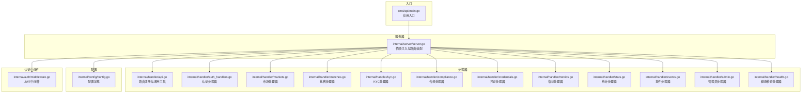
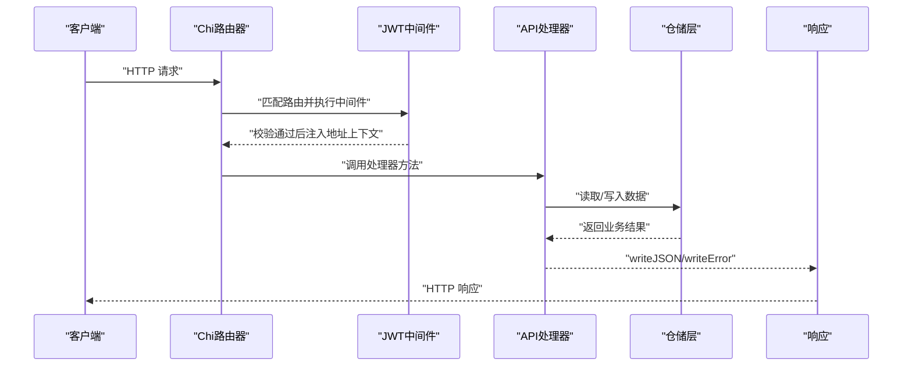
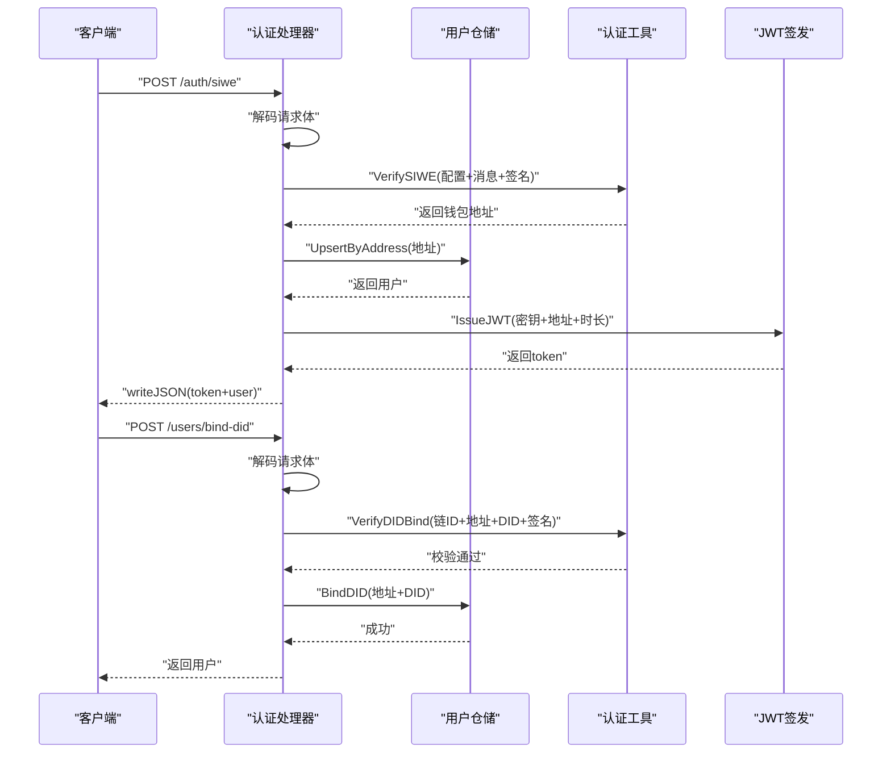
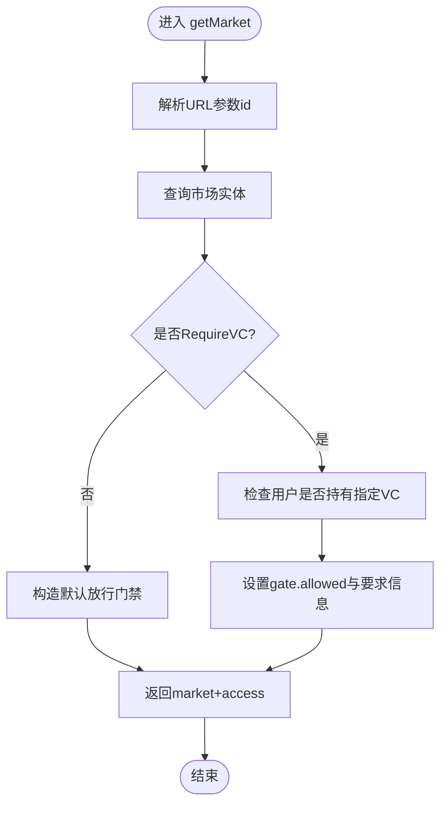
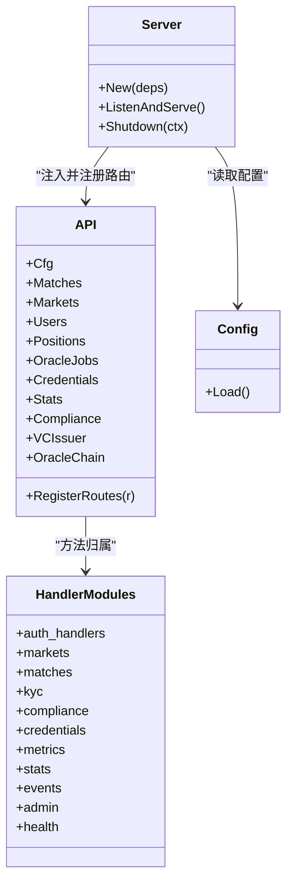
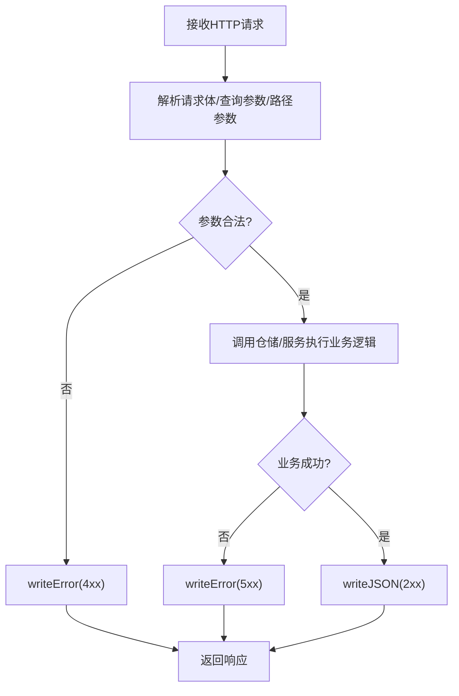

# API处理器

<cite>
**本文引用的文件**
- [api.go](file://internal/handler/api.go)
- [auth_handlers.go](file://internal/handler/auth_handlers.go)
- [markets.go](file://internal/handler/markets.go)
- [matches.go](file://internal/handler/matches.go)
- [kyc.go](file://internal/handler/kyc.go)
- [compliance.go](file://internal/handler/compliance.go)
- [credentials.go](file://internal/handler/credentials.go)
- [metrics.go](file://internal/handler/metrics.go)
- [stats.go](file://internal/handler/stats.go)
- [events.go](file://internal/handler/events.go)
- [admin.go](file://internal/handler/admin.go)
- [health.go](file://internal/handler/health.go)
- [server.go](file://internal/server/server.go)
- [main.go](file://cmd/api/main.go)
- [config.go](file://internal/config/config.go)
- [middleware.go](file://internal/auth/middleware.go)
</cite>

## 目录
1. [简介](#简介)
2. [项目结构](#项目结构)
3. [核心组件](#核心组件)
4. [架构总览](#架构总览)
5. [详细组件分析](#详细组件分析)
6. [依赖分析](#依赖分析)
7. [性能考虑](#性能考虑)
8. [故障排查指南](#故障排查指南)
9. [结论](#结论)
10. [附录](#附录)

## 简介
本文件聚焦 PredictionDIDSimple 项目的 API 处理器模块，系统性阐述 API 结构体设计与实现、依赖注入、路由注册、业务逻辑处理流程，以及各处理器的功能职责与交互关系。文档同时覆盖认证、市场、比赛、KYC、合规、凭证、指标、统计、事件、管理员、健康检查等处理器，解释 HTTP 请求处理流程（请求解析、参数验证、业务调用、响应构建）、错误处理机制、响应格式标准化、API 版本管理策略，并给出性能优化建议、安全注意事项与常见问题排查方案。

## 项目结构
API 处理器位于 internal/handler 目录，采用“按功能分组”的文件组织方式，每个处理器文件对应一组相关路由与业务逻辑。服务器在 internal/server 中完成依赖注入与路由装配，应用入口在 cmd/api/main.go 中完成配置加载、仓储初始化与服务器启动。

图表来源
- [server.go:44-102](file://internal/server/server.go#L44-L102)
- [api.go:34-69](file://internal/handler/api.go#L34-L69)
- [auth_handlers.go:19-97](file://internal/handler/auth_handlers.go#L19-L97)
- [markets.go:10-59](file://internal/handler/markets.go#L10-L59)
- [matches.go:8-43](file://internal/handler/matches.go#L8-L43)
- [kyc.go:16-66](file://internal/handler/kyc.go#L16-L66)
- [compliance.go:9-29](file://internal/handler/compliance.go#L9-L29)
- [credentials.go:24-114](file://internal/handler/credentials.go#L24-L114)
- [metrics.go:9-36](file://internal/handler/metrics.go#L9-L36)
- [stats.go:9-86](file://internal/handler/stats.go#L9-L86)
- [events.go:12-46](file://internal/handler/events.go#L12-L46)
- [admin.go:12-108](file://internal/handler/admin.go#L12-L108)
- [health.go:13-77](file://internal/handler/health.go#L13-L77)
- [config.go:48-104](file://internal/config/config.go#L48-L104)
- [middleware.go:17-49](file://internal/auth/middleware.go#L17-L49)

章节来源
- [server.go:44-102](file://internal/server/server.go#L44-L102)
- [api.go:34-69](file://internal/handler/api.go#L34-L69)
- [config.go:48-104](file://internal/config/config.go#L48-L104)

## 核心组件
- API 结构体：统一承载配置、仓储与服务依赖，作为路由注册与业务处理的聚合入口。
- 通用工具函数：writeJSON/writeError 标准化响应；queryInt/parseID 标准化参数解析。
- 服务器依赖注入：在 server.New 中完成仓储、中间件、VC 颁发器、Oracle 客户端等的装配与路由注册。
- 路由注册：在 API.RegisterRoutes 中集中注册公开、认证、管理员三类路由，并按需挂载中间件。

章节来源
- [api.go:18-31](file://internal/handler/api.go#L18-L31)
- [api.go:71-100](file://internal/handler/api.go#L71-L100)
- [server.go:77-91](file://internal/server/server.go#L77-L91)
- [api.go:34-69](file://internal/handler/api.go#L34-L69)

## 架构总览
API 处理器采用“结构体聚合 + 路由分组 + 中间件保护”的设计模式。服务器启动时完成依赖注入，随后将 API 结构体与各处理器方法注册到 Chi 路由器。认证中间件通过 Authorization 头校验 JWT 并将地址注入上下文；管理员中间件通过 X-Admin-Key 校验管理员权限；CORS 中间件统一处理跨域与允许头。

图表来源
- [server.go:47-67](file://internal/server/server.go#L47-L67)
- [middleware.go:17-49](file://internal/auth/middleware.go#L17-L49)
- [api.go:34-69](file://internal/handler/api.go#L34-L69)

## 详细组件分析

### 认证处理器
- 功能职责
  - SIWE 登录：解析请求体、验证签名、创建/获取用户、签发 JWT。
  - 绑定 DID：校验 DID 与签名、持久化绑定、返回更新后的用户。
  - 我的持仓：从上下文提取地址，查询用户持仓列表。
- 关键点
  - 请求体结构化（siweRequest、bindDIDRequest）。
  - 使用 auth.VerifySIWE/auth.VerifyDIDBind 进行签名验证。
  - 使用 Users 仓储进行用户与绑定操作。
  - 使用 auth.IssueJWT 生成令牌。

图表来源
- [auth_handlers.go:19-53](file://internal/handler/auth_handlers.go#L19-L53)
- [auth_handlers.go:61-84](file://internal/handler/auth_handlers.go#L61-L84)
- [middleware.go:45-49](file://internal/auth/middleware.go#L45-L49)

章节来源
- [auth_handlers.go:19-97](file://internal/handler/auth_handlers.go#L19-L97)
- [middleware.go:17-49](file://internal/auth/middleware.go#L17-L49)

### 市场处理器
- 功能职责
  - 市场列表：支持 status、limit、offset 查询参数，返回 items 与链上交易所需 collateral_address、chain_id。
  - 市场详情：返回 market、collateral_address、chain_id，并根据 RequiresVC 与用户 VC 情况计算 access 控制。
  - 资金池与订单簿：返回池子状态与 CPMM 合成盘口（二元市场）。
- 关键点
  - 通过 Markets 仓储查询；getMarket 中动态判断 VC 放行条件。
  - marketOrderbook 使用 parseBps/coalesceReserve 辅助函数处理边界情况。

图表来源
- [markets.go:29-59](file://internal/handler/markets.go#L29-L59)
- [stats.go:68-86](file://internal/handler/stats.go#L68-L86)

章节来源
- [markets.go:10-59](file://internal/handler/markets.go#L10-L59)
- [stats.go:19-86](file://internal/handler/stats.go#L19-L86)

### 比赛处理器
- 功能职责
  - 比赛列表：支持 status、limit、offset 查询参数，返回 items。
  - 比赛详情：返回 match 与关联市场列表（当前实现为内存过滤，注释提示可下沉至 SQL）。
- 关键点
  - 通过 Matches 与 Markets 仓储协作；getMatch 中对市场按 match_id 过滤。

章节来源
- [matches.go:8-43](file://internal/handler/matches.go#L8-L43)

### KYC 处理器
- 功能职责
  - 接收第三方 KYC 回调，支持可选 HMAC-SHA256 签名校验；解析负载并写入合规记录；若状态为 approved 且提供地址，自动颁发 KYC VC。
- 关键点
  - 限制请求体大小；校验 X-KYC-Signature 头；必填字段校验；调用 Compliance 仓储记录；通过 VCIssuer 颁发 VC。

章节来源
- [kyc.go:16-66](file://internal/handler/kyc.go#L16-L66)

### 合规处理器
- 功能职责
  - 依据请求头 CF-IPCountry 或 X-Country-Code 获取国家代码，查询配置中的封禁列表，返回 restricted、compliance_required、environment 等信息。
- 关键点
  - 优先使用 Cloudflare 注入的国家头；未知时回退为 UNKNOWN。

章节来源
- [compliance.go:9-29](file://internal/handler/compliance.go#L9-L29)

### 凭证处理器
- 功能职责
  - 管理员颁发 VC：解析请求体、校验必填、构建 SubjectDID（优先使用已绑定 DID）、调用 VCIssuer 签发并存储到 Credentials 仓储。
  - 我的凭证：基于上下文地址查询用户凭证列表。
  - 验证 VC：校验签名与过期，支持可选 region 匹配。
- 关键点
  - TTL 默认一年，可由请求体覆盖；DID 构造遵循链 ID 与地址规则；verifyVC 支持区域限制。

章节来源
- [credentials.go:24-114](file://internal/handler/credentials.go#L24-L114)

### 指标处理器
- 功能职责
  - 以 Prometheus 文本格式暴露 Oracle 作业状态指标（pending/manual_review/confirmed/failed）。
- 关键点
  - 读取最近 1000 条作业并统计状态分布；设置 Content-Type 为 text/plain; version=0.0.4。

章节来源
- [metrics.go:9-36](file://internal/handler/metrics.go#L9-L36)

### 统计处理器
- 功能职责
  - 平台统计：返回全平台聚合统计。
  - 市场资金池：返回 reserve、price、fee、outcome_count 等关键字段。
  - 市场订单簿：返回 CPMM 合成盘口（二元市场），模拟 bids 两条记录。
- 关键点
  - parseBps 对缺失或 0 的价格回退为 5000（即 50%）；coalesceReserve 优先使用首选储备金。

章节来源
- [stats.go:9-86](file://internal/handler/stats.go#L9-L86)

### 事件处理器
- 功能职责
  - SSE 实时推送比赛列表，每 5 秒一次；设置必要的 SSE 头并使用 Flusher 立即推送。
- 关键点
  - 检查 http.Flusher 支持；定时器触发；序列化 JSON 并输出 data 帧。

章节来源
- [events.go:12-46](file://internal/handler/events.go#L12-L46)

### 管理员处理器
- 功能职责
  - 列出 Oracle 任务：支持按 status 过滤，最多 100 条。
  - 作废市场：可选调用 Oracle 链上 void，更新数据库状态为 VOID，并联动比赛状态为 CANCELLED。
  - 注册市场：写入数据库，支持 requires_vc、restricted_region、resolution_rule 等字段。
  - 重试任务：将任务状态重置为 pending 并清空错误消息。
- 关键点
  - voidMarket 依赖 OracleChain（可选）；registerMarket 使用 AdminMarketUpdate 结构体。

章节来源
- [admin.go:12-108](file://internal/handler/admin.go#L12-L108)

### 健康检查处理器
- 功能职责
  - /health：存活探针，始终返回 ok。
  - /ready：就绪探针，检测 DB/Redis/RPC 状态，失败时返回 503，成功返回 200。
- 关键点
  - Health 结构体聚合 DB、Redis、Chain；ready 中对 Redis 标记降级状态。

章节来源
- [health.go:13-77](file://internal/handler/health.go#L13-L77)

### 路由注册与中间件
- 路由分组
  - 公开接口：matches/markets/stats/events/metrics/compliance/kyc 等。
  - 登录接口：/auth/siwe、/auth/verify-vc。
  - JWT 认证接口：/me/positions、/users/bind-did、/users/me/credentials。
  - 管理员接口：/admin/*，使用 X-Admin-Key 校验。
- 中间件
  - 全局：RequestID、RealIP、Logger、Recoverer、RateLimit、GeoBlock、CORS。
  - 认证：Authorization: Bearer <jwt>。
  - 管理员：X-Admin-Key。

章节来源
- [api.go:34-69](file://internal/handler/api.go#L34-L69)
- [server.go:47-67](file://internal/server/server.go#L47-L67)
- [middleware.go:17-49](file://internal/auth/middleware.go#L17-L49)

## 依赖分析
- 依赖注入
  - server.New 负责组装 API 结构体，注入 Config、DB、Redis、Chain、OracleChain、各仓储与 VCIssuer。
  - API.RegisterRoutes 将处理器方法注册到 Chi 路由器。
- 处理器耦合
  - 各处理器均依赖 API 结构体，间接共享仓储与服务。
  - 认证处理器依赖 auth 工具；凭证处理器依赖 vc 颁发器；管理员处理器依赖 OracleChain（可选）。
- 外部依赖
  - 数据库：pgxpool；Redis：go-redis；区块链：blockchain.Client/OracleClient；CORS：go-chi/cors。

图表来源
- [server.go:44-102](file://internal/server/server.go#L44-L102)
- [api.go:18-31](file://internal/handler/api.go#L18-L31)
- [config.go:48-104](file://internal/config/config.go#L48-L104)

章节来源
- [server.go:44-102](file://internal/server/server.go#L44-L102)
- [api.go:18-31](file://internal/handler/api.go#L18-L31)

## 性能考虑
- 响应格式标准化
  - 统一使用 writeJSON/writeError，确保错误字段一致（如 {"error": "..."}）。
- 参数解析与校验
  - queryInt/parseID 提供默认值与错误回退，减少分支复杂度。
- SSE 流推送
  - events 处理器使用 Flusher 立即推送，定时器周期 5 秒，适合低频事件。
- 仓储查询优化
  - matches 处理器注释建议将“按 match_id 过滤”下沉到 SQL 层，降低内存过滤成本。
- 速率限制与降级
  - 服务器启用 RateLimit 与 GeoBlock 中间件；Redis 不可用时标记降级但不影响核心功能。
- 写超时策略
  - 服务器 WriteTimeout 设为 0 以支持长连接（SSE），其他场景建议结合业务设置合理超时。

[本节为通用指导，无需列出具体文件来源]

## 故障排查指南
- 常见错误与定位
  - 400 错误：请求体解析失败或必填字段缺失（如 KYC 回调 missing fields、凭证颁发 address/credential_type 缺失）。
  - 401/403：JWT 无效或未授权（认证中间件校验失败）、VC 区域不匹配。
  - 404：资源不存在（如 getMarket 未找到）。
  - 500：内部错误（仓储异常、VC 颁发失败、数据库/Redis 连接失败）。
  - 503：/ready 探针失败（DB/Redis/RPC 不可用）。
- 排查步骤
  - 检查请求头：Authorization、X-Admin-Key、X-KYC-Signature、CF-IPCountry/X-Country-Code。
  - 校验配置：DATABASE_URL、JWT_SECRET、ADMIN_API_KEY、KYC_WEBHOOK_SECRET、VC_ISSUER_KEY、BLOCKED_COUNTRIES 等。
  - 观察日志：服务器 Logger 中间件输出请求日志；Recoverer 防止 panic 导致崩溃。
  - 健康检查：先访问 /health 与 /ready，确认基础组件可用。
- 建议
  - 对外暴露的回调接口（如 KYC）务必启用签名校验与请求体大小限制。
  - 对高频查询接口（如市场列表、比赛列表）增加缓存层或索引优化。

章节来源
- [api.go:78-94](file://internal/handler/api.go#L78-L94)
- [auth_handlers.go:23-46](file://internal/handler/auth_handlers.go#L23-L46)
- [kyc.go:18-51](file://internal/handler/kyc.go#L18-L51)
- [credentials.go:95-111](file://internal/handler/credentials.go#L95-L111)
- [health.go:33-77](file://internal/handler/health.go#L33-L77)

## 结论
本项目的 API 处理器模块通过清晰的结构体聚合、标准化的响应工具与严格的中间件保护，实现了认证、市场、比赛、KYC、合规、凭证、指标、统计、事件、管理员、健康检查等多类业务能力。服务器侧完成完善的依赖注入与路由装配，配合速率限制、地理封锁与 CORS 等中间件，形成高内聚、低耦合、易扩展的 API 架构。后续可在仓储查询优化、缓存策略与 API 版本化方面进一步增强。

[本节为总结性内容，无需列出具体文件来源]

## 附录

### 如何实现新的 API 处理器
- 步骤
  - 在 internal/handler 新增文件，定义处理器方法（接收 http.ResponseWriter, *http.Request）。
  - 在 API 结构体中添加所需依赖（仓储/服务）。
  - 在 API.RegisterRoutes 中注册路由与中间件（公开/认证/管理员）。
  - 使用 writeJSON/writeError 统一响应格式。
  - 在 internal/server/server.go 中注入新依赖并注册路由。
- 示例参考路径
  - [api.go:34-69](file://internal/handler/api.go#L34-L69)
  - [server.go:77-91](file://internal/server/server.go#L77-L91)

章节来源
- [api.go:34-69](file://internal/handler/api.go#L34-L69)
- [server.go:77-91](file://internal/server/server.go#L77-L91)

### HTTP 请求处理流程（请求解析 → 参数验证 → 业务调用 → 响应构建）

图表来源
- [api.go:71-100](file://internal/handler/api.go#L71-L100)
- [auth_handlers.go:21-52](file://internal/handler/auth_handlers.go#L21-L52)
- [markets.go:12-26](file://internal/handler/markets.go#L12-L26)
- [stats.go:10-16](file://internal/handler/stats.go#L10-L16)

### 错误处理机制与响应格式
- 统一错误响应：{"error": "message"}，状态码与语义一致。
- 成功响应：JSON 对象，公开接口通常包含 items 或具体资源对象。
- 常见状态码：200、201、400、401、403、404、500、503。

章节来源
- [api.go:78-81](file://internal/handler/api.go#L78-L81)
- [api.go:71-76](file://internal/handler/api.go#L71-L76)

### API 版本管理策略
- 当前路由未显式包含版本号（如 /v1/...），建议在新增路由或变更现有行为时：
  - 引入版本前缀（/v1/...）。
  - 保持向后兼容或在文档中标注破坏性变更。
  - 通过 Accept-Version 请求头或路径版本区分版本。

[本节为通用指导，无需列出具体文件来源]

### 安全考虑事项
- 认证与授权
  - 使用 JWT 中间件保护敏感接口；管理员接口使用 X-Admin-Key。
  - 对外回调接口启用签名校验（如 KYC）与请求体大小限制。
- 输入校验
  - 对 URL/查询参数使用 parseID/queryInt 提供默认值与错误回退。
  - 对请求体进行结构化解析与必填字段校验。
- 中间件
  - 启用 CORS、速率限制、地理封锁与 Recoverer，降低攻击面与提升稳定性。

章节来源
- [middleware.go:17-49](file://internal/auth/middleware.go#L17-L49)
- [kyc.go:18-36](file://internal/handler/kyc.go#L18-L36)
- [server.go:47-67](file://internal/server/server.go#L47-L67)