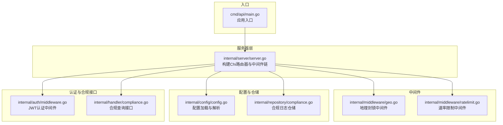
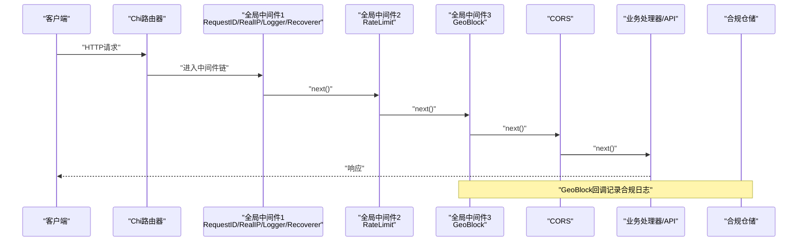
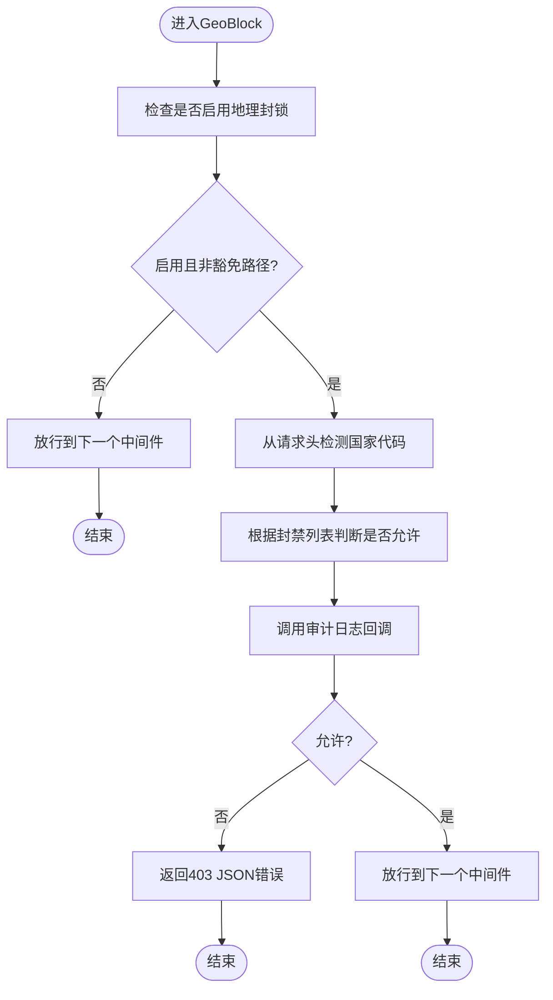
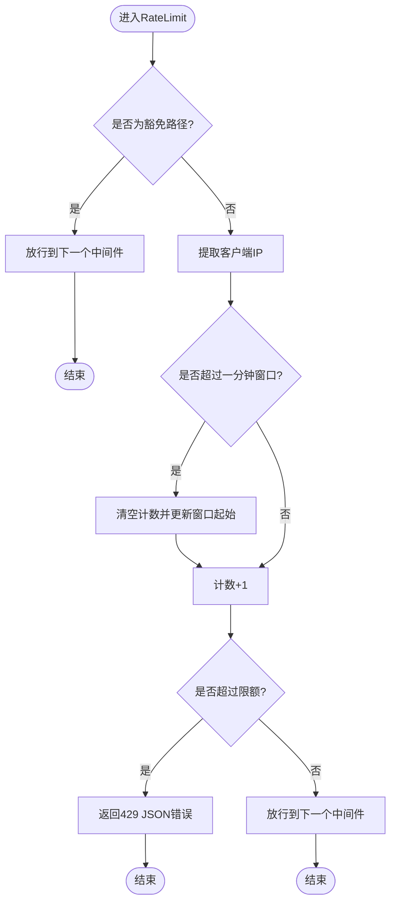
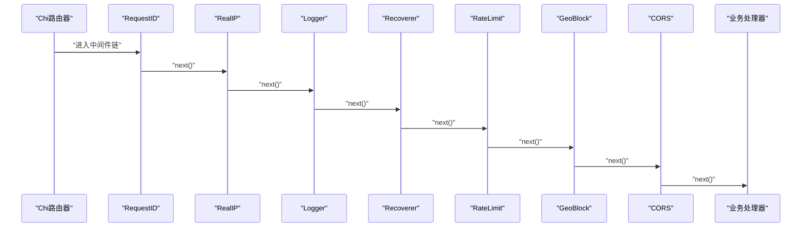
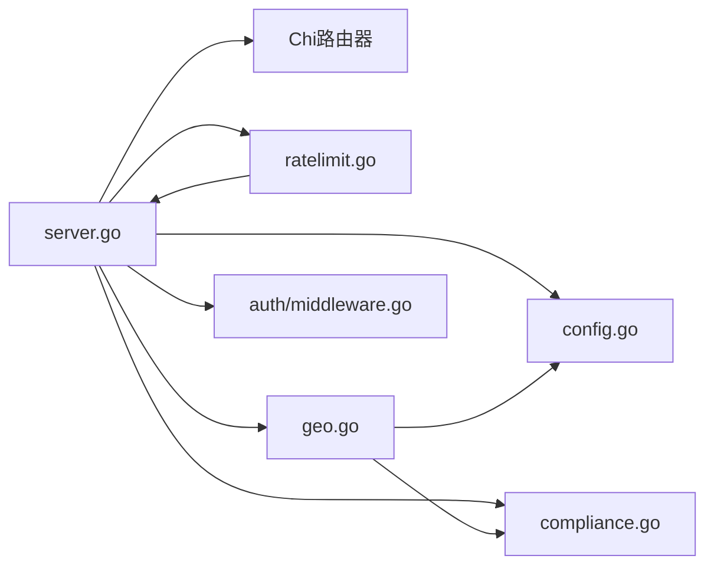

# 中间件系统

<cite>
**本文引用的文件**
- [internal/middleware/geo.go](file://internal/middleware/geo.go)
- [internal/middleware/ratelimit.go](file://internal/middleware/ratelimit.go)
- [internal/server/server.go](file://internal/server/server.go)
- [cmd/api/main.go](file://cmd/api/main.go)
- [internal/config/config.go](file://internal/config/config.go)
- [internal/repository/compliance.go](file://internal/repository/compliance.go)
- [internal/handler/compliance.go](file://internal/handler/compliance.go)
- [internal/auth/middleware.go](file://internal/auth/middleware.go)
</cite>

## 目录
1. [简介](#简介)
2. [项目结构](#项目结构)
3. [核心组件](#核心组件)
4. [架构总览](#架构总览)
5. [详细组件分析](#详细组件分析)
6. [依赖关系分析](#依赖关系分析)
7. [性能考量](#性能考量)
8. [故障排查指南](#故障排查指南)
9. [结论](#结论)
10. [附录](#附录)

## 简介
本文件面向PredictionDIDSimple项目的中间件系统，重点阐述以下内容：
- 中间件设计理念与实现模式：Chi路由器中间件集成、中间件链执行顺序、上下文传递机制
- 地理封锁中间件：IP地址解析、地理位置查询、访问控制逻辑、合规日志记录
- 速率限制中间件：滑动窗口/令牌桶近似、限流策略配置、用户标识管理、突发流量处理
- 自定义中间件开发：如何创建、如何在中间件中处理请求和响应
- 性能影响、配置优化、监控指标收集
- 中间件配置选项、常见问题排查与解决方案

## 项目结构
中间件系统位于internal/middleware目录，配合server层在Chi路由器上注册全局中间件链；配置来自internal/config，合规日志写入数据库通过internal/repository完成。

图表来源
- [cmd/api/main.go:26-161](file://cmd/api/main.go#L26-L161)
- [internal/server/server.go:44-102](file://internal/server/server.go#L44-L102)
- [internal/middleware/geo.go:12-65](file://internal/middleware/geo.go#L12-L65)
- [internal/middleware/ratelimit.go:12-67](file://internal/middleware/ratelimit.go#L12-L67)
- [internal/config/config.go:48-105](file://internal/config/config.go#L48-L105)
- [internal/repository/compliance.go:21-27](file://internal/repository/compliance.go#L21-L27)
- [internal/auth/middleware.go:17-50](file://internal/auth/middleware.go#L17-L50)
- [internal/handler/compliance.go:9-30](file://internal/handler/compliance.go#L9-L30)

章节来源
- [cmd/api/main.go:26-161](file://cmd/api/main.go#L26-L161)
- [internal/server/server.go:44-102](file://internal/server/server.go#L44-L102)

## 核心组件
- 地理封锁中间件：基于请求头国家代码进行访问控制，支持豁免路径与审计日志
- 速率限制中间件：按IP的每分钟滑动窗口计数，支持豁免路径
- Chi中间件链：全局中间件注册顺序决定执行顺序，贯穿所有路由
- 上下文传递：认证中间件将用户地址注入context，供后续处理器使用
- 配置驱动：通过环境变量控制地理封锁开关、封禁国家列表、速率限制阈值等

章节来源
- [internal/middleware/geo.go:12-65](file://internal/middleware/geo.go#L12-L65)
- [internal/middleware/ratelimit.go:12-67](file://internal/middleware/ratelimit.go#L12-L67)
- [internal/server/server.go:47-59](file://internal/server/server.go#L47-L59)
- [internal/auth/middleware.go:17-50](file://internal/auth/middleware.go#L17-L50)
- [internal/config/config.go:75-82](file://internal/config/config.go#L75-L82)

## 架构总览
中间件链在服务器初始化阶段注册，形成“前置处理 -> 路由匹配 -> 后置处理”的统一流程。地理封锁与速率限制作为全局中间件，确保所有请求在进入业务路由前均被处理。

图表来源
- [internal/server/server.go:47-67](file://internal/server/server.go#L47-L67)
- [internal/middleware/geo.go:14-41](file://internal/middleware/geo.go#L14-L41)
- [internal/middleware/ratelimit.go:43-66](file://internal/middleware/ratelimit.go#L43-L66)
- [internal/repository/compliance.go:21-27](file://internal/repository/compliance.go#L21-L27)

## 详细组件分析

### 地理封锁中间件（GeoBlock）
- 设计理念
  - 基于请求头国家代码进行访问控制，支持Cloudflare与自定义头
  - 提供审计日志回调，便于异步持久化至数据库
  - 对特定路径进行豁免，保证健康检查与事件流可用
- 实现要点
  - 豁免路径：/health、/ready、/metrics、/compliance/restricted以及以/events/开头的路径
  - 国家代码检测：优先读取Cloudflare头，其次读取自定义头，最后回退为UNKNOWN
  - 访问控制：根据配置的封禁国家集合判断是否允许
  - 响应：拒绝时返回JSON错误与403状态码
  - 日志记录：通过回调函数将IP、国家、路径、结果写入合规仓储
- 复杂度与性能
  - 检测与判断均为O(1)，整体开销极低
  - 豁免路径与封禁集合查找均为哈希表操作
- 配置与扩展
  - 通过配置开关与封禁国家列表控制行为
  - 可扩展更多头字段或IP归属库

图表来源
- [internal/middleware/geo.go:14-41](file://internal/middleware/geo.go#L14-L41)
- [internal/middleware/geo.go:43-65](file://internal/middleware/geo.go#L43-L65)
- [internal/repository/compliance.go:21-27](file://internal/repository/compliance.go#L21-L27)

章节来源
- [internal/middleware/geo.go:12-65](file://internal/middleware/geo.go#L12-L65)
- [internal/repository/compliance.go:21-27](file://internal/repository/compliance.go#L21-L27)
- [internal/handler/compliance.go:9-30](file://internal/handler/compliance.go#L9-L30)

### 速率限制中间件（RateLimit）
- 设计理念
  - 基于IP的每分钟滑动窗口计数，简单高效
  - 支持豁免路径，避免对健康检查造成干扰
  - 并发安全，使用互斥锁保护计数映射
- 实现要点
  - 窗口重置：超过一分钟则清空计数并更新窗口起始时间
  - IP提取：优先从RemoteAddr解析，兜底使用原始地址
  - 超限处理：返回429状态码与JSON错误
- 复杂度与性能
  - 每次请求O(1)时间复杂度
  - 内存占用随活跃IP数量线性增长
- 配置与扩展
  - 通过配置项设置每分钟限额
  - 可扩展为更复杂的令牌桶或分布式限流

图表来源
- [internal/middleware/ratelimit.go:28-40](file://internal/middleware/ratelimit.go#L28-L40)
- [internal/middleware/ratelimit.go:43-66](file://internal/middleware/ratelimit.go#L43-L66)

章节来源
- [internal/middleware/ratelimit.go:12-67](file://internal/middleware/ratelimit.go#L12-L67)
- [internal/config/config.go:75-76](file://internal/config/config.go#L75-L76)

### Chi路由器中间件集成与执行顺序
- 全局中间件注册顺序即执行顺序
  - RequestID -> RealIP -> Logger -> Recoverer -> RateLimit -> GeoBlock -> CORS
- 路由器内部处理流程
  - 匹配到具体路由后，依次调用已注册的中间件，再进入对应处理器
- 上下文传递
  - 认证中间件将用户地址注入context，后续处理器可通过工具方法读取
- CORS配置
  - 明确允许的来源、方法、头，包含合规相关头字段

图表来源
- [internal/server/server.go:47-67](file://internal/server/server.go#L47-L67)
- [internal/auth/middleware.go:17-50](file://internal/auth/middleware.go#L17-L50)

章节来源
- [internal/server/server.go:44-102](file://internal/server/server.go#L44-L102)
- [internal/auth/middleware.go:17-50](file://internal/auth/middleware.go#L17-L50)

### 上下文传递机制
- 认证中间件
  - 从Authorization头解析JWT，校验失败返回401
  - 成功后将钱包地址写入context，供后续处理器使用
- 处理器读取
  - 通过工具方法从context中取出地址，用于鉴权与业务逻辑
- 注意事项
  - 中间件链顺序影响可用性，认证应在业务处理器之前注册
  - context键值使用自定义类型避免冲突

章节来源
- [internal/auth/middleware.go:17-50](file://internal/auth/middleware.go#L17-L50)

### 合规日志记录
- 记录内容
  - IP、国家代码、路径、是否允许
- 存储方式
  - 通过合规仓储异步写入数据库
- 查询接口
  - 提供合规查询接口，返回当前请求者所在国家、是否受限、合规要求与环境信息

章节来源
- [internal/middleware/geo.go:27-29](file://internal/middleware/geo.go#L27-L29)
- [internal/repository/compliance.go:21-27](file://internal/repository/compliance.go#L21-L27)
- [internal/handler/compliance.go:9-30](file://internal/handler/compliance.go#L9-L30)

## 依赖关系分析
- 服务器层依赖
  - 依赖Chi路由器与内置中间件
  - 依赖自定义中间件（速率限制、地理封锁）
  - 依赖配置与合规仓储
- 中间件依赖
  - 地理封锁依赖配置与合规仓储
  - 速率限制依赖网络与时间库
- 认证中间件独立，但与业务处理器配合使用

图表来源
- [internal/server/server.go:44-102](file://internal/server/server.go#L44-L102)
- [internal/middleware/geo.go:12-65](file://internal/middleware/geo.go#L12-L65)
- [internal/middleware/ratelimit.go:12-67](file://internal/middleware/ratelimit.go#L12-L67)
- [internal/config/config.go:48-105](file://internal/config/config.go#L48-L105)
- [internal/repository/compliance.go:21-27](file://internal/repository/compliance.go#L21-L27)
- [internal/auth/middleware.go:17-50](file://internal/auth/middleware.go#L17-L50)

章节来源
- [internal/server/server.go:44-102](file://internal/server/server.go#L44-L102)
- [internal/middleware/geo.go:12-65](file://internal/middleware/geo.go#L12-L65)
- [internal/middleware/ratelimit.go:12-67](file://internal/middleware/ratelimit.go#L12-L67)
- [internal/config/config.go:48-105](file://internal/config/config.go#L48-L105)
- [internal/repository/compliance.go:21-27](file://internal/repository/compliance.go#L21-L27)
- [internal/auth/middleware.go:17-50](file://internal/auth/middleware.go#L17-L50)

## 性能考量
- 中间件链顺序
  - 将耗时较低的中间件置于前部，减少对高频路径的影响
  - 速率限制与地理封锁均为O(1)，对性能影响较小
- 并发与内存
  - 速率限制器使用互斥锁保护，适合单进程场景
  - 若需高并发或分布式限流，建议引入Redis等共享存储
- 豁免路径
  - 健康检查与事件流路径豁免可降低限流与地理封锁带来的额外开销
- 日志与数据库
  - 合规日志采用异步回调写入，避免阻塞请求处理

[本节为通用指导，无需列出章节来源]

## 故障排查指南
- 地理封锁误判
  - 检查请求头是否正确注入国家代码（Cloudflare或自定义头）
  - 确认封禁国家列表配置是否包含目标国家
  - 使用合规查询接口确认当前请求者的国家与受限状态
- 速率限制误触发
  - 检查客户端IP提取是否正确（代理场景可能需要RealIP中间件）
  - 调整每分钟限额配置
  - 确认豁免路径是否覆盖健康检查与事件流
- 认证失败
  - 检查Authorization头格式与JWT签名密钥
  - 确认处理器中是否正确从context读取地址
- CORS问题
  - 检查允许的来源、方法与头是否包含实际请求所需的字段
- 数据库写入异常
  - 检查合规日志表是否存在、权限是否足够

章节来源
- [internal/middleware/geo.go:53-65](file://internal/middleware/geo.go#L53-L65)
- [internal/middleware/ratelimit.go:52-56](file://internal/middleware/ratelimit.go#L52-L56)
- [internal/handler/compliance.go:9-30](file://internal/handler/compliance.go#L9-L30)
- [internal/auth/middleware.go:17-50](file://internal/auth/middleware.go#L17-L50)
- [internal/server/server.go:62-67](file://internal/server/server.go#L62-L67)

## 结论
本中间件系统以Chi路由器为核心，通过明确的中间件链顺序与上下文传递机制，实现了高效的地理封锁与速率限制能力。配置驱动的设计使得部署与运维更加灵活，异步合规日志记录保障了合规审计需求。对于高并发与分布式场景，建议进一步引入共享存储与更精细的限流策略。

[本节为总结性内容，无需列出章节来源]

## 附录

### 中间件配置选项
- 地理封锁
  - GEO_BLOCK_ENABLED：是否启用地理封锁
  - BLOCKED_COUNTRIES：封禁国家列表（逗号分隔）
- 速率限制
  - RATE_LIMIT_PER_MINUTE：每分钟最大请求数
- 其他
  - COMPLIANCE_REQUIRED：是否要求合规审查
  - APP_ENV：运行环境（development/production）

章节来源
- [internal/config/config.go:75-82](file://internal/config/config.go#L75-L82)
- [internal/config/config.go:76-76](file://internal/config/config.go#L76-L76)
- [internal/config/config.go:77-78](file://internal/config/config.go#L77-L78)
- [internal/config/config.go:79-79](file://internal/config/config.go#L79-L79)

### 自定义中间件开发指引
- 接口规范
  - 输入：http.Handler
  - 输出：返回一个新的http.Handler包装原处理器
- 常见模式
  - 请求前处理：读取头、解析参数、校验权限
  - 上下文注入：将必要信息写入context
  - 异常处理：返回标准错误码与JSON响应
  - 请求后处理：统计、日志、清理
- 示例参考
  - 地理封锁中间件：[internal/middleware/geo.go:14-41](file://internal/middleware/geo.go#L14-L41)
  - 速率限制中间件：[internal/middleware/ratelimit.go:43-66](file://internal/middleware/ratelimit.go#L43-L66)
  - 认证中间件：[internal/auth/middleware.go:17-42](file://internal/auth/middleware.go#L17-L42)

章节来源
- [internal/middleware/geo.go:14-41](file://internal/middleware/geo.go#L14-L41)
- [internal/middleware/ratelimit.go:43-66](file://internal/middleware/ratelimit.go#L43-L66)
- [internal/auth/middleware.go:17-42](file://internal/auth/middleware.go#L17-L42)