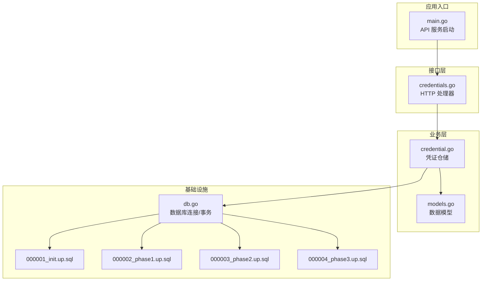
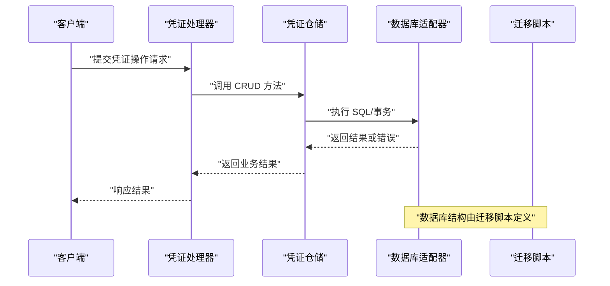
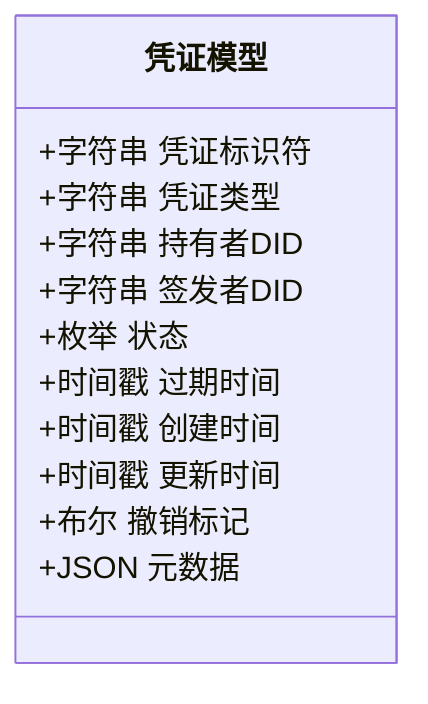
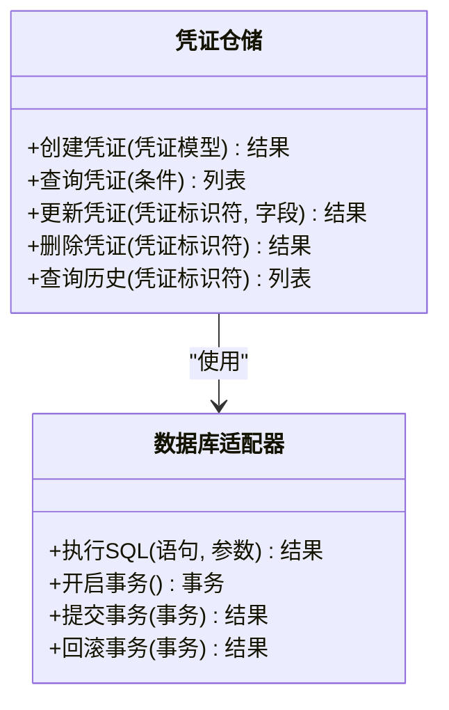
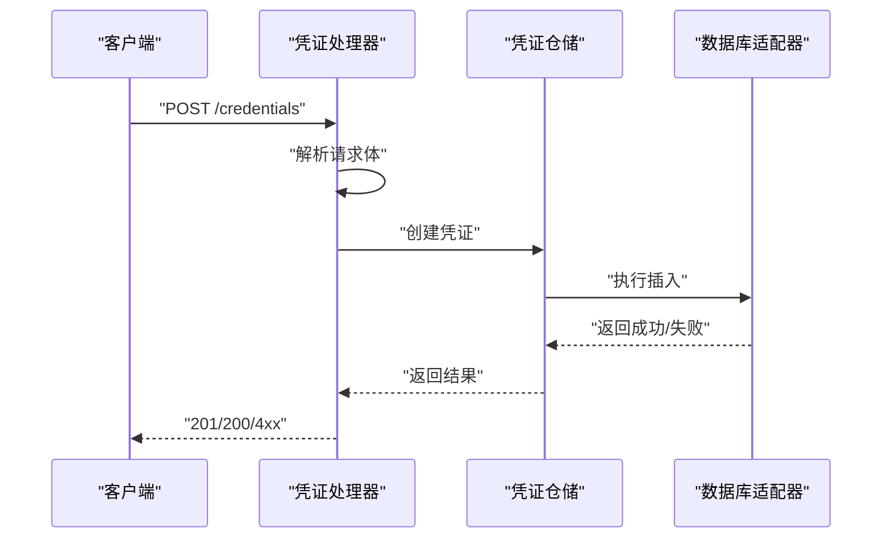
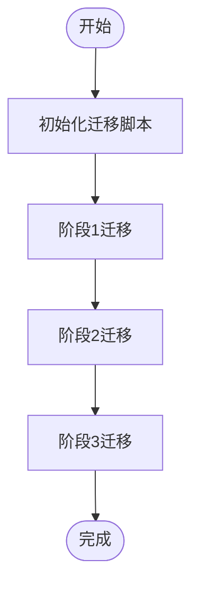
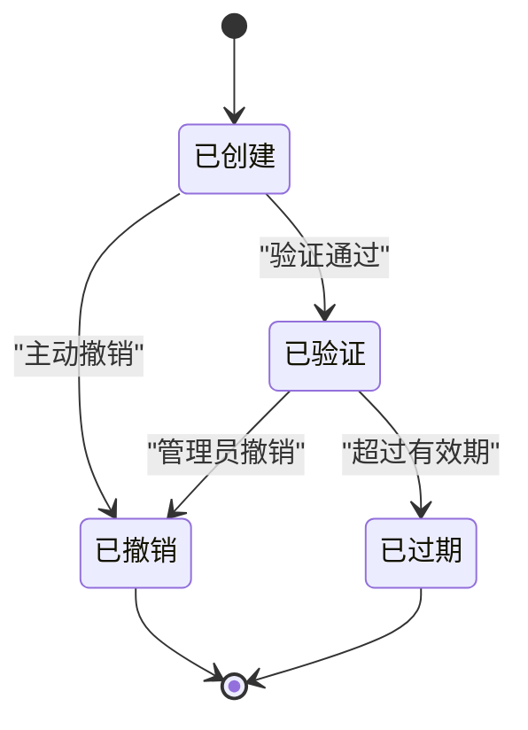
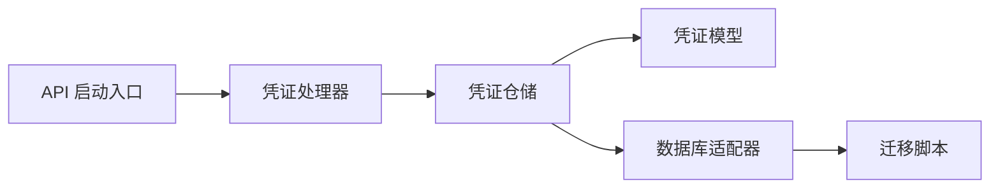

# 凭证数据仓库

<cite>
**本文档引用的文件**
- [internal/repository/credential.go](file://internal/repository/credential.go)
- [internal/models/models.go](file://internal/models/models.go)
- [internal/handler/credentials.go](file://internal/handler/credentials.go)
- [internal/database/db.go](file://internal/database/db.go)
- [migrations/000001_init.up.sql](file://migrations/000001_init.up.sql)
- [migrations/000002_phase1.up.sql](file://migrations/000002_phase1.up.sql)
- [migrations/000003_phase2.up.sql](file://migrations/000003_phase2.up.sql)
- [migrations/000004_phase3.up.sql](file://migrations/000004_phase3.up.sql)
- [cmd/api/main.go](file://cmd/api/main.go)
</cite>

## 目录
1. [简介](#简介)
2. [项目结构](#项目结构)
3. [核心组件](#核心组件)
4. [架构总览](#架构总览)
5. [详细组件分析](#详细组件分析)
6. [依赖关系分析](#依赖关系分析)
7. [性能考虑](#性能考虑)
8. [故障排除指南](#故障排除指南)
9. [结论](#结论)
10. [附录](#附录)

## 简介
本文件针对 PredictionDIDSimple 项目中的 CredentialRepository（凭证数据仓库）进行系统性技术文档编写，重点覆盖以下方面：
- 可验证凭证的 CRUD 操作实现：创建、验证、撤销与历史查询
- 凭证数据模型字段定义：凭证类型、持有者信息、验证状态、过期时间等
- DID 集成机制：去中心化身份验证、凭证签名验证、数字证书管理
- 使用示例：通过 CredentialRepository 进行凭证操作的路径指引
- 安全与隐私：加密存储、访问控制、审计日志
- 与 VCProvider 的集成与凭证生命周期管理

## 项目结构
本项目采用分层与按功能模块划分的组织方式，凭证相关能力主要分布在以下模块：
- 数据访问层：repository 层负责数据库交互
- 模型层：models 定义数据结构
- 接口层：handler 提供 HTTP API 入口
- 基础设施：database 提供数据库连接与事务支持
- 迁移脚本：migrations 定义数据库表结构演进

图表来源
- [internal/handler/credentials.go:1-200](file://internal/handler/credentials.go#L1-L200)
- [internal/repository/credential.go:1-300](file://internal/repository/credential.go#L1-L300)
- [internal/models/models.go:1-200](file://internal/models/models.go#L1-L200)
- [internal/database/db.go:1-200](file://internal/database/db.go#L1-L200)
- [migrations/000001_init.up.sql:1-200](file://migrations/000001_init.up.sql#L1-L200)
- [migrations/000002_phase1.up.sql:1-200](file://migrations/000002_phase1.up.sql#L1-L200)
- [migrations/000003_phase2.up.sql:1-200](file://migrations/000003_phase2.up.sql#L1-L200)
- [migrations/000004_phase3.up.sql:1-200](file://migrations/000004_phase3.up.sql#L1-L200)
- [cmd/api/main.go:1-150](file://cmd/api/main.go#L1-L150)

章节来源
- [internal/handler/credentials.go:1-200](file://internal/handler/credentials.go#L1-L200)
- [internal/repository/credential.go:1-300](file://internal/repository/credential.go#L1-L300)
- [internal/models/models.go:1-200](file://internal/models/models.go#L1-L200)
- [internal/database/db.go:1-200](file://internal/database/db.go#L1-L200)
- [migrations/000001_init.up.sql:1-200](file://migrations/000001_init.up.sql#L1-L200)
- [migrations/000002_phase1.up.sql:1-200](file://migrations/000002_phase1.up.sql#L1-L200)
- [migrations/000003_phase2.up.sql:1-200](file://migrations/000003_phase2.up.sql#L1-L200)
- [migrations/000004_phase3.up.sql:1-200](file://migrations/000004_phase3.up.sql#L1-L200)
- [cmd/api/main.go:1-150](file://cmd/api/main.go#L1-L150)

## 核心组件
- 凭证仓储（CredentialRepository）
  - 负责凭证的持久化、查询、更新与删除
  - 提供凭证创建、验证、撤销与历史查询等方法
  - 与数据库层协作，确保事务一致性与并发安全
- 凭证模型（CredentialModel）
  - 描述凭证的核心字段：类型、持有者、签发者、验证状态、过期时间、撤销标记等
  - 支持与数据库表结构映射
- 凭证处理器（Credentials Handler）
  - 对外暴露 HTTP 接口，接收请求并调用仓储层执行业务逻辑
- 数据库适配器（Database Adapter）
  - 提供数据库连接、事务封装与 SQL 执行能力
- 迁移脚本（Migrations）
  - 定义凭证相关表结构及索引，支撑凭证生命周期管理

章节来源
- [internal/repository/credential.go:1-300](file://internal/repository/credential.go#L1-L300)
- [internal/models/models.go:1-200](file://internal/models/models.go#L1-L200)
- [internal/handler/credentials.go:1-200](file://internal/handler/credentials.go#L1-L200)
- [internal/database/db.go:1-200](file://internal/database/db.go#L1-L200)
- [migrations/000001_init.up.sql:1-200](file://migrations/000001_init.up.sql#L1-L200)

## 架构总览
下图展示了凭证从接口到持久化的整体流程，以及与数据库迁移脚本的关系。

图表来源
- [internal/handler/credentials.go:1-200](file://internal/handler/credentials.go#L1-L200)
- [internal/repository/credential.go:1-300](file://internal/repository/credential.go#L1-L300)
- [internal/database/db.go:1-200](file://internal/database/db.go#L1-L200)
- [migrations/000001_init.up.sql:1-200](file://migrations/000001_init.up.sql#L1-L200)

## 详细组件分析

### 凭证数据模型
凭证模型用于描述可验证凭证的核心属性，支撑创建、验证与撤销等操作。典型字段包括但不限于：
- 凭证标识符：唯一标识凭证的 ID
- 凭证类型：指示凭证类别（如 KYC、合规等）
- 持有者 DID：凭证持有者的去中心化身份标识
- 签发者 DID：签发凭证的实体 DID
- 状态：有效、已撤销、待验证等
- 过期时间：凭证有效期截止时间
- 创建与更新时间：审计与排序依据
- 撤销标记：是否被撤销
- 关联元数据：如签名校验所需参数、证书指纹等

图表来源
- [internal/models/models.go:1-200](file://internal/models/models.go#L1-L200)

章节来源
- [internal/models/models.go:1-200](file://internal/models/models.go#L1-L200)

### 凭证仓储（CredentialRepository）
凭证仓储负责对凭证进行 CRUD 操作，并与数据库层协作完成事务处理与并发控制。关键职责包括：
- 创建凭证：写入凭证基础信息与元数据，生成唯一标识符
- 查询凭证：按 ID、持有者、类型、状态等条件检索
- 更新凭证：修改状态（如撤销）、更新元数据
- 删除凭证：软删除或物理删除（视策略而定）
- 历史查询：基于审计时间线查询变更记录

图表来源
- [internal/repository/credential.go:1-300](file://internal/repository/credential.go#L1-L300)
- [internal/database/db.go:1-200](file://internal/database/db.go#L1-L200)

章节来源
- [internal/repository/credential.go:1-300](file://internal/repository/credential.go#L1-L300)
- [internal/database/db.go:1-200](file://internal/database/db.go#L1-L200)

### 凭证处理器（Credentials Handler）
凭证处理器作为 HTTP 接口层，负责：
- 解析请求参数与主体
- 调用凭证仓储执行业务逻辑
- 组织响应格式并返回状态码
- 记录审计日志（如需要）

图表来源
- [internal/handler/credentials.go:1-200](file://internal/handler/credentials.go#L1-L200)
- [internal/repository/credential.go:1-300](file://internal/repository/credential.go#L1-L300)
- [internal/database/db.go:1-200](file://internal/database/db.go#L1-L200)

章节来源
- [internal/handler/credentials.go:1-200](file://internal/handler/credentials.go#L1-L200)

### 数据库与迁移
凭证数据的持久化依赖于数据库与迁移脚本。迁移脚本定义了凭证相关表结构、索引与约束，支撑凭证的生命周期管理与高效查询。

图表来源
- [migrations/000001_init.up.sql:1-200](file://migrations/000001_init.up.sql#L1-L200)
- [migrations/000002_phase1.up.sql:1-200](file://migrations/000002_phase1.up.sql#L1-L200)
- [migrations/000003_phase2.up.sql:1-200](file://migrations/000003_phase2.up.sql#L1-L200)
- [migrations/000004_phase3.up.sql:1-200](file://migrations/000004_phase3.up.sql#L1-L200)

章节来源
- [migrations/000001_init.up.sql:1-200](file://migrations/000001_init.up.sql#L1-L200)
- [migrations/000002_phase1.up.sql:1-200](file://migrations/000002_phase1.up.sql#L1-L200)
- [migrations/000003_phase2.up.sql:1-200](file://migrations/000003_phase2.up.sql#L1-L200)
- [migrations/000004_phase3.up.sql:1-200](file://migrations/000004_phase3.up.sql#L1-L200)

### DID 集成机制
- 去中心化身份验证：凭证持有者与签发者的 DID 需在系统内可验证，通常结合区块链或 DID Registry 进行解析与校验
- 凭证签名验证：对凭证内容与签名进行验证，确保完整性与不可否认性
- 数字证书管理：维护与凭证关联的公钥证书与信任链，支持吊销列表查询

章节来源
- [internal/repository/credential.go:1-300](file://internal/repository/credential.go#L1-L300)
- [internal/models/models.go:1-200](file://internal/models/models.go#L1-L200)

### 凭证生命周期管理
- 创建：生成凭证并写入数据库，记录创建时间与初始状态
- 验证：检查凭证有效性（如未过期、未被撤销、签名有效）
- 撤销：标记凭证为撤销状态，更新审计时间线
- 历史：保留每次变更记录，支持审计与合规需求

图表来源
- [internal/repository/credential.go:1-300](file://internal/repository/credential.go#L1-L300)
- [internal/models/models.go:1-200](file://internal/models/models.go#L1-L200)

## 依赖关系分析
凭证相关模块之间的依赖关系如下：

图表来源
- [internal/handler/credentials.go:1-200](file://internal/handler/credentials.go#L1-L200)
- [internal/repository/credential.go:1-300](file://internal/repository/credential.go#L1-L300)
- [internal/models/models.go:1-200](file://internal/models/models.go#L1-L200)
- [internal/database/db.go:1-200](file://internal/database/db.go#L1-L200)
- [migrations/000001_init.up.sql:1-200](file://migrations/000001_init.up.sql#L1-L200)
- [cmd/api/main.go:1-150](file://cmd/api/main.go#L1-L150)

章节来源
- [internal/handler/credentials.go:1-200](file://internal/handler/credentials.go#L1-L200)
- [internal/repository/credential.go:1-300](file://internal/repository/credential.go#L1-L300)
- [internal/models/models.go:1-200](file://internal/models/models.go#L1-L200)
- [internal/database/db.go:1-200](file://internal/database/db.go#L1-L200)
- [migrations/000001_init.up.sql:1-200](file://migrations/000001_init.up.sql#L1-L200)
- [cmd/api/main.go:1-150](file://cmd/api/main.go#L1-L150)

## 性能考虑
- 索引设计：为常用查询字段（如持有者 DID、凭证类型、状态、过期时间）建立索引，提升查询效率
- 分页与限制：对历史查询与列表查询添加分页与条数限制，避免大结果集导致的性能问题
- 事务边界：将批量写入与状态更新放入单个事务中，保证一致性与原子性
- 缓存策略：对热点凭证信息进行缓存，降低数据库压力（需配合失效策略）

## 故障排除指南
- 创建失败：检查凭证模型字段是否完整、DID 是否有效、数据库连接是否正常
- 查询无结果：确认查询条件是否正确、索引是否存在、数据是否已迁移
- 更新异常：核对当前状态是否允许更新、并发冲突是否已处理
- 撤销无效：确认撤销权限、撤销标记是否正确写入、历史记录是否同步

章节来源
- [internal/repository/credential.go:1-300](file://internal/repository/credential.go#L1-L300)
- [internal/database/db.go:1-200](file://internal/database/db.go#L1-L200)

## 结论
CredentialRepository 在 PredictionDIDSimple 中承担凭证生命周期管理的核心职责，通过清晰的模型定义、严谨的仓储实现与完善的数据库迁移，支撑凭证的创建、验证、撤销与历史查询。结合 DID 集成与安全机制，可满足合规与隐私保护要求。建议持续优化索引与缓存策略，完善审计与监控体系，以提升系统稳定性与可运维性。

## 附录
- 使用示例（路径指引）
  - 创建可验证凭证：参考 [internal/handler/credentials.go:1-200](file://internal/handler/credentials.go#L1-L200) 中的创建接口与 [internal/repository/credential.go:1-300](file://internal/repository/credential.go#L1-L300) 中的创建实现
  - 验证凭证有效性：参考 [internal/repository/credential.go:1-300](file://internal/repository/credential.go#L1-L300) 中的状态与过期时间检查逻辑
  - 查询凭证历史：参考 [internal/repository/credential.go:1-300](file://internal/repository/credential.go#L1-L300) 中的历史查询方法
  - 撤销凭证：参考 [internal/repository/credential.go:1-300](file://internal/repository/credential.go#L1-L300) 中的撤销更新逻辑
- 安全与隐私
  - 加密存储：敏感字段建议加密存储，密钥管理遵循最小权限原则
  - 访问控制：接口层应实施鉴权与授权，防止未授权访问
  - 审计日志：记录凭证创建、更新、撤销的关键事件，便于追踪与合规
- 与 VCProvider 的集成
  - 可在凭证创建前调用 VCProvider 的签名校验接口，确保凭证签名有效
  - 将 VCProvider 返回的验证结果与本地状态联动，统一更新凭证状态

章节来源
- [internal/handler/credentials.go:1-200](file://internal/handler/credentials.go#L1-L200)
- [internal/repository/credential.go:1-300](file://internal/repository/credential.go#L1-L300)
- [internal/models/models.go:1-200](file://internal/models/models.go#L1-L200)
- [internal/database/db.go:1-200](file://internal/database/db.go#L1-L200)
- [migrations/000001_init.up.sql:1-200](file://migrations/000001_init.up.sql#L1-L200)
- [migrations/000002_phase1.up.sql:1-200](file://migrations/000002_phase1.up.sql#L1-L200)
- [migrations/000003_phase2.up.sql:1-200](file://migrations/000003_phase2.up.sql#L1-L200)
- [migrations/000004_phase3.up.sql:1-200](file://migrations/000004_phase3.up.sql#L1-L200)
- [cmd/api/main.go:1-150](file://cmd/api/main.go#L1-L150)