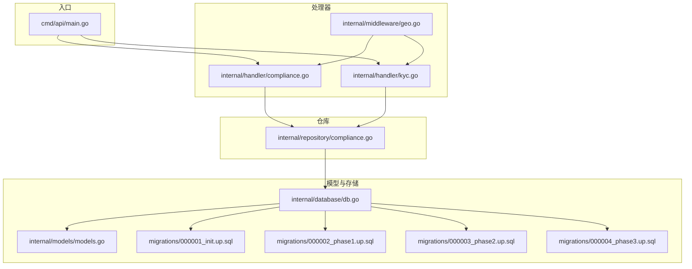
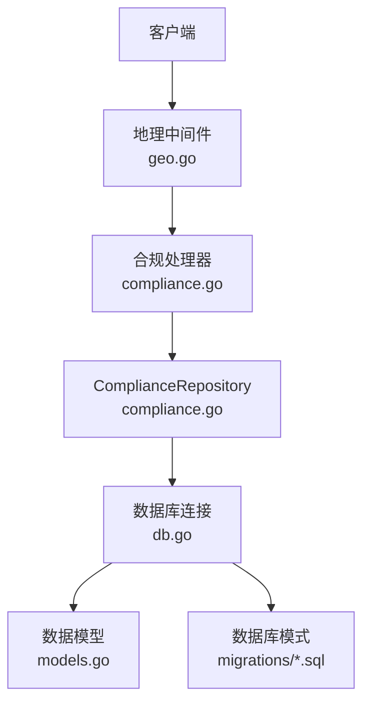
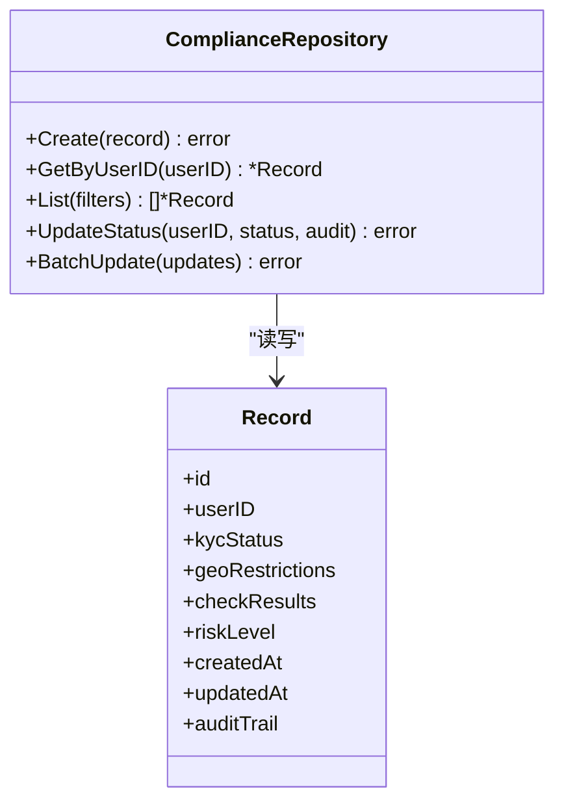
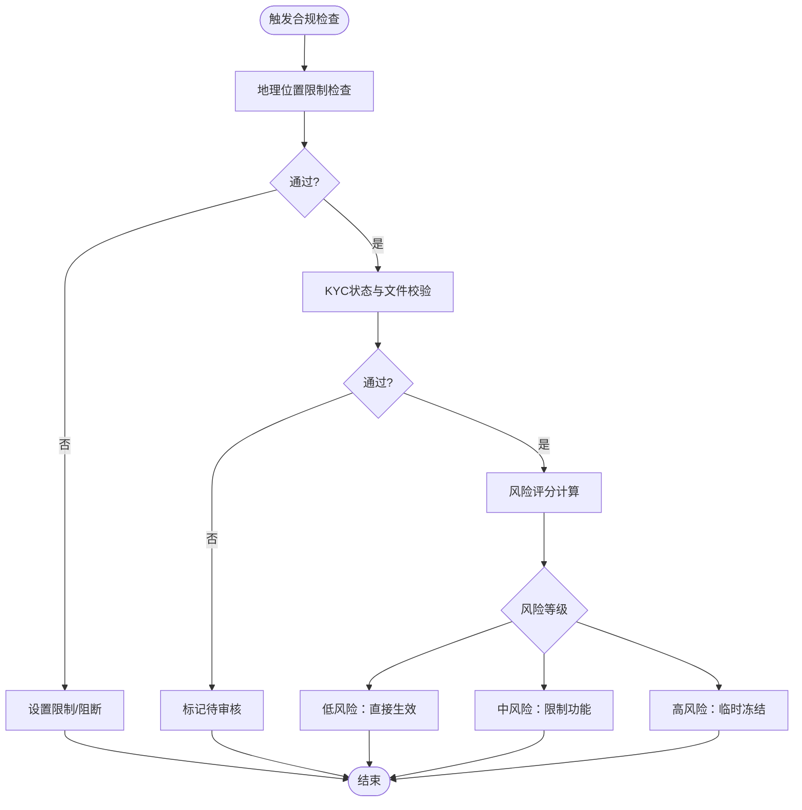
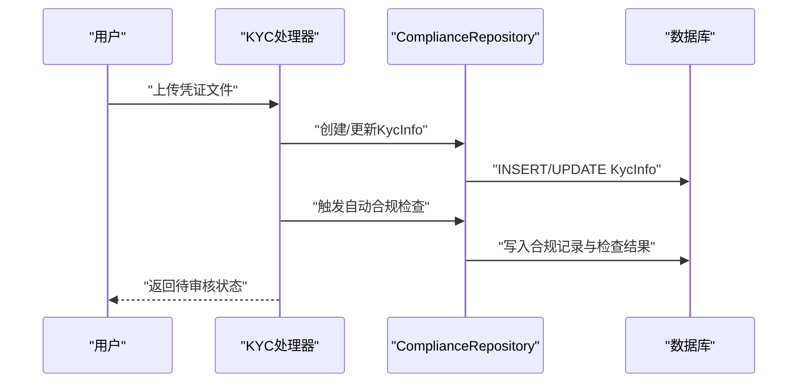
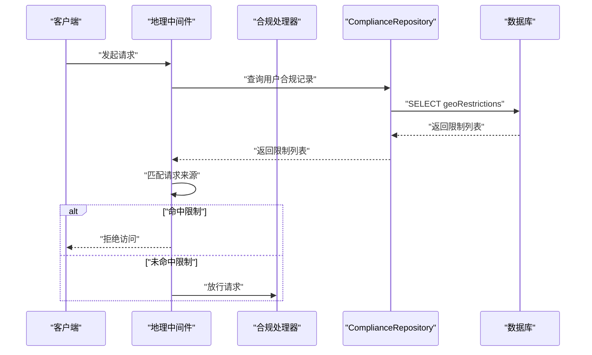
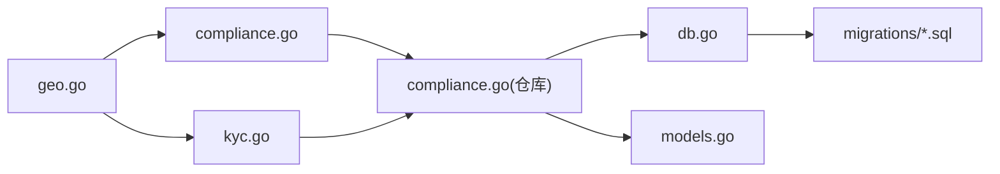

# 合规数据仓库

<cite>
**本文引用的文件**
- [cmd/api/main.go](file://cmd/api/main.go)
- [internal/handler/compliance.go](file://internal/handler/compliance.go)
- [internal/handler/kyc.go](file://internal/handler/kyc.go)
- [internal/middleware/geo.go](file://internal/middleware/geo.go)
- [internal/repository/compliance.go](file://internal/repository/compliance.go)
- [internal/models/models.go](file://internal/models/models.go)
- [internal/database/db.go](file://internal/database/db.go)
- [migrations/000001_init.up.sql](file://migrations/000001_init.up.sql)
- [migrations/000002_phase1.up.sql](file://migrations/000002_phase1.up.sql)
- [migrations/000003_phase2.up.sql](file://migrations/000003_phase2.up.sql)
- [migrations/000004_phase3.up.sql](file://migrations/000004_phase3.up.sql)
</cite>

## 目录
1. [简介](#简介)
2. [项目结构](#项目结构)
3. [核心组件](#核心组件)
4. [架构总览](#架构总览)
5. [详细组件分析](#详细组件分析)
6. [依赖关系分析](#依赖关系分析)
7. [性能考虑](#性能考虑)
8. [故障排查指南](#故障排查指南)
9. [结论](#结论)
10. [附录](#附录)

## 简介
本文件面向PredictionDIDSimple项目的ComplianceRepository，系统化阐述合规数据的CRUD实现、数据模型设计、合规检查机制（自动与人工）、隐私与安全策略，以及与外部合规系统的集成与实时合规检查流程。文档同时提供可直接定位到源码的路径指引，帮助开发者快速理解与扩展合规能力。

## 项目结构
后端采用分层架构：入口程序负责启动服务；处理器模块承接HTTP请求并委派至业务层；仓库层封装数据库访问；中间件提供地理限制与速率控制；迁移脚本定义数据库表结构；模型定义数据实体。

图表来源
- [cmd/api/main.go](file://cmd/api/main.go)
- [internal/handler/compliance.go](file://internal/handler/compliance.go)
- [internal/handler/kyc.go](file://internal/handler/kyc.go)
- [internal/middleware/geo.go](file://internal/middleware/geo.go)
- [internal/repository/compliance.go](file://internal/repository/compliance.go)
- [internal/models/models.go](file://internal/models/models.go)
- [internal/database/db.go](file://internal/database/db.go)
- [migrations/000001_init.up.sql](file://migrations/000001_init.up.sql)
- [migrations/000002_phase1.up.sql](file://migrations/000002_phase1.up.sql)
- [migrations/000003_phase2.up.sql](file://migrations/000003_phase2.up.sql)
- [migrations/000004_phase3.up.sql](file://migrations/000004_phase3.up.sql)

章节来源
- [cmd/api/main.go](file://cmd/api/main.go)
- [internal/handler/compliance.go](file://internal/handler/compliance.go)
- [internal/handler/kyc.go](file://internal/handler/kyc.go)
- [internal/middleware/geo.go](file://internal/middleware/geo.go)
- [internal/repository/compliance.go](file://internal/repository/compliance.go)
- [internal/models/models.go](file://internal/models/models.go)
- [internal/database/db.go](file://internal/database/db.go)
- [migrations/000001_init.up.sql](file://migrations/000001_init.up.sql)
- [migrations/000002_phase1.up.sql](file://migrations/000002_phase1.up.sql)
- [migrations/000003_phase2.up.sql](file://migrations/000003_phase2.up.sql)
- [migrations/000004_phase3.up.sql](file://migrations/000004_phase3.up.sql)

## 核心组件
- ComplianceRepository：封装合规数据的增删改查与聚合查询，支持按用户ID、KYC状态、地理位置、合规检查结果、风险等级等条件检索与更新。
- 处理器接口：对外暴露合规与KYC相关的HTTP端点，协调中间件与仓库层。
- 中间件：提供地理位置限制与访问控制，作为合规检查的第一道防线。
- 数据模型：定义合规记录、用户KYC状态、风险等级、合规检查结果等实体。
- 迁移脚本：定义合规相关表结构及索引，确保数据一致性与查询效率。

章节来源
- [internal/repository/compliance.go](file://internal/repository/compliance.go)
- [internal/handler/compliance.go](file://internal/handler/compliance.go)
- [internal/handler/kyc.go](file://internal/handler/kyc.go)
- [internal/middleware/geo.go](file://internal/middleware/geo.go)
- [internal/models/models.go](file://internal/models/models.go)
- [migrations/000001_init.up.sql](file://migrations/000001_init.up.sql)
- [migrations/000002_phase1.up.sql](file://migrations/000002_phase1.up.sql)
- [migrations/000003_phase2.up.sql](file://migrations/000003_phase2.up.sql)
- [migrations/000004_phase3.up.sql](file://migrations/000004_phase3.up.sql)

## 架构总览
ComplianceRepository位于业务层与数据层之间，向上为HTTP处理器提供统一的合规数据访问接口，向下通过数据库连接执行SQL操作。地理中间件在请求进入时进行位置校验，减少不合规流量对后端的压力。

图表来源
- [internal/middleware/geo.go](file://internal/middleware/geo.go)
- [internal/handler/compliance.go](file://internal/handler/compliance.go)
- [internal/repository/compliance.go](file://internal/repository/compliance.go)
- [internal/database/db.go](file://internal/database/db.go)
- [internal/models/models.go](file://internal/models/models.go)
- [migrations/000001_init.up.sql](file://migrations/000001_init.up.sql)

## 详细组件分析

### ComplianceRepository 设计与职责
- 职责边界
  - 提供合规记录的CRUD与聚合查询接口，包括按用户ID、KYC状态、地理位置、合规检查结果、风险等级筛选。
  - 支持合规状态批量更新与审计字段写入。
- 关键方法族（以路径定位）
  - 创建合规记录：[internal/repository/compliance.go](file://internal/repository/compliance.go)
  - 查询合规记录（单条/列表）：[internal/repository/compliance.go](file://internal/repository/compliance.go)
  - 更新合规状态与审计字段：[internal/repository/compliance.go](file://internal/repository/compliance.go)
  - 批量更新与事务性写入：[internal/repository/compliance.go](file://internal/repository/compliance.go)
- 与处理器协作
  - 处理器调用仓库方法完成业务操作，并将错误转换为HTTP响应。
  - 参考：[internal/handler/compliance.go](file://internal/handler/compliance.go)

图表来源
- [internal/repository/compliance.go](file://internal/repository/compliance.go)
- [internal/models/models.go](file://internal/models/models.go)

章节来源
- [internal/repository/compliance.go](file://internal/repository/compliance.go)
- [internal/handler/compliance.go](file://internal/handler/compliance.go)

### 数据模型与字段定义
- 模型定义位置：[internal/models/models.go](file://internal/models/models.go)
- 关键实体与字段
  - 合规记录（ComplianceRecord）
    - 用户标识：userID
    - KYC状态：kycStatus（枚举或字符串）
    - 地理位置限制：geoRestrictions（JSON/数组，表示禁止区域）
    - 合规检查结果：checkResults（JSON/数组，包含检查项与结果）
    - 风险等级：riskLevel（低/中/高）
    - 审计轨迹：auditTrail（JSON，记录变更历史）
    - 时间戳：createdAt、updatedAt
  - 用户KYC信息（KycInfo）
    - 用户标识：userID
    - 文件与元数据：documentType、documentHash、uploadTime
    - 审核状态：status（待审/通过/拒绝）
    - 审核员与时间：reviewer、reviewedAt
- 字段约束与索引
  - 建议在userID、kycStatus、riskLevel上建立索引，提升查询性能。
  - 参考迁移脚本中的表结构定义：[migrations/000001_init.up.sql](file://migrations/000001_init.up.sql)、[migrations/000002_phase1.up.sql](file://migrations/000002_phase1.up.sql)、[migrations/000003_phase2.up.sql](file://migrations/000003_phase2.up.sql)、[migrations/000004_phase3.up.sql](file://migrations/000004_phase3.up.sql)

章节来源
- [internal/models/models.go](file://internal/models/models.go)
- [migrations/000001_init.up.sql](file://migrations/000001_init.up.sql)
- [migrations/000002_phase1.up.sql](file://migrations/000002_phase1.up.sql)
- [migrations/000003_phase2.up.sql](file://migrations/000003_phase2.up.sql)
- [migrations/000004_phase3.up.sql](file://migrations/000004_phase3.up.sql)

### 合规检查机制
- 自动合规检查
  - 触发时机：用户注册/登录、KYC上传、交易行为发生时。
  - 检查内容：地理位置限制匹配、黑名单/白名单规则、风险评分计算。
  - 结果写入：将检查结果与风险等级写入合规记录。
  - 参考：[internal/handler/compliance.go](file://internal/handler/compliance.go)、[internal/handler/kyc.go](file://internal/handler/kyc.go)
- 人工审核流程
  - 流程节点：待审核、审核中、已通过、已拒绝。
  - 审核人权限：仅限授权管理员。
  - 记录审计：每次状态变更写入auditTrail。
  - 参考：[internal/handler/kyc.go](file://internal/handler/kyc.go)
- 合规状态更新逻辑
  - 状态机：初始化 -> 待审 -> 通过/拒绝 -> 生效/失效。
  - 影响范围：根据风险等级与检查结果决定是否启用/限制账户功能。
  - 参考：[internal/repository/compliance.go](file://internal/repository/compliance.go)

图表来源
- [internal/handler/compliance.go](file://internal/handler/compliance.go)
- [internal/handler/kyc.go](file://internal/handler/kyc.go)
- [internal/repository/compliance.go](file://internal/repository/compliance.go)

章节来源
- [internal/handler/compliance.go](file://internal/handler/compliance.go)
- [internal/handler/kyc.go](file://internal/handler/kyc.go)
- [internal/repository/compliance.go](file://internal/repository/compliance.go)

### CRUD操作与典型流程

#### KYC信息管理
- 上传与验证
  - 上传凭证文件并生成哈希，写入KycInfo。
  - 触发自动合规检查，若通过则更新合规记录状态为“待审核”。
  - 参考：[internal/handler/kyc.go](file://internal/handler/kyc.go)
- 人工审核
  - 管理员审批，更新KycInfo状态与合规记录状态。
  - 写入auditTrail，记录审核人与时间。
  - 参考：[internal/handler/kyc.go](file://internal/handler/kyc.go)

图表来源
- [internal/handler/kyc.go](file://internal/handler/kyc.go)
- [internal/repository/compliance.go](file://internal/repository/compliance.go)

章节来源
- [internal/handler/kyc.go](file://internal/handler/kyc.go)
- [internal/repository/compliance.go](file://internal/repository/compliance.go)

#### 地理位置限制
- 请求拦截
  - 地理中间件根据IP解析国家/地区，匹配geoRestrictions。
  - 若命中限制区域，直接拒绝请求。
  - 参考：[internal/middleware/geo.go](file://internal/middleware/geo.go)
- 动态更新
  - 管理员更新合规记录的geoRestrictions字段，立即生效。
  - 参考：[internal/repository/compliance.go](file://internal/repository/compliance.go)

图表来源
- [internal/middleware/geo.go](file://internal/middleware/geo.go)
- [internal/handler/compliance.go](file://internal/handler/compliance.go)
- [internal/repository/compliance.go](file://internal/repository/compliance.go)

章节来源
- [internal/middleware/geo.go](file://internal/middleware/geo.go)
- [internal/handler/compliance.go](file://internal/handler/compliance.go)
- [internal/repository/compliance.go](file://internal/repository/compliance.go)

#### 合规状态查询
- 单用户查询
  - 输入：userID
  - 输出：kycStatus、riskLevel、checkResults、geoRestrictions
  - 参考：[internal/repository/compliance.go](file://internal/repository/compliance.go)
- 条件筛选
  - 支持按kycStatus、riskLevel、时间范围筛选合规记录。
  - 参考：[internal/repository/compliance.go](file://internal/repository/compliance.go)

章节来源
- [internal/repository/compliance.go](file://internal/repository/compliance.go)

### 使用示例（路径指引）
以下示例均提供到源码的路径，便于直接定位实现细节：
- 创建合规记录
  - [internal/repository/compliance.go](file://internal/repository/compliance.go)
- 查询用户合规状态
  - [internal/repository/compliance.go](file://internal/repository/compliance.go)
- 更新合规状态（含审计）
  - [internal/repository/compliance.go](file://internal/repository/compliance.go)
- KYC上传与自动检查
  - [internal/handler/kyc.go](file://internal/handler/kyc.go)
- 地理位置拦截
  - [internal/middleware/geo.go](file://internal/middleware/geo.go)
- 合规报表（按状态/风险统计）
  - [internal/repository/compliance.go](file://internal/repository/compliance.go)

章节来源
- [internal/repository/compliance.go](file://internal/repository/compliance.go)
- [internal/handler/kyc.go](file://internal/handler/kyc.go)
- [internal/middleware/geo.go](file://internal/middleware/geo.go)

### 隐私保护与数据安全
- 敏感信息处理
  - 凭证文件仅保存哈希与元数据，不存储明文内容。
  - 合规记录中的个人身份信息应遵循最小化原则，必要时脱敏显示。
- 访问控制
  - 仅授权管理员可访问与修改审核状态与限制配置。
  - 参考：[internal/handler/kyc.go](file://internal/handler/kyc.go)
- 审计追踪
  - 所有状态变更写入auditTrail，包含操作人、时间、旧值/新值。
  - 参考：[internal/models/models.go](file://internal/models/models.go)
- 数据库安全
  - 使用参数化查询与事务，避免注入与数据不一致。
  - 参考：[internal/database/db.go](file://internal/database/db.go)
- 外部系统集成
  - 与外部黑名单/白名单系统对接，定期同步与实时查询。
  - 将外部检查结果合并到checkResults，驱动本地风控策略。
  - 参考：[internal/handler/compliance.go](file://internal/handler/compliance.go)

章节来源
- [internal/handler/kyc.go](file://internal/handler/kyc.go)
- [internal/models/models.go](file://internal/models/models.go)
- [internal/database/db.go](file://internal/database/db.go)
- [internal/handler/compliance.go](file://internal/handler/compliance.go)

## 依赖关系分析
- 组件耦合
  - 处理器依赖仓库接口，仓库依赖数据库连接与模型。
  - 地理中间件独立于仓库，但与处理器存在运行时依赖。
- 外部依赖
  - 数据库驱动、JSON序列化、HTTP路由与中间件栈。
- 迁移与版本演进
  - 各阶段迁移脚本逐步引入合规相关表与字段，需按顺序执行。
  - 参考：[migrations/000001_init.up.sql](file://migrations/000001_init.up.sql)、[migrations/000002_phase1.up.sql](file://migrations/000002_phase1.up.sql)、[migrations/000003_phase2.up.sql](file://migrations/000003_phase2.up.sql)、[migrations/000004_phase3.up.sql](file://migrations/000004_phase3.up.sql)

图表来源
- [internal/handler/compliance.go](file://internal/handler/compliance.go)
- [internal/handler/kyc.go](file://internal/handler/kyc.go)
- [internal/middleware/geo.go](file://internal/middleware/geo.go)
- [internal/repository/compliance.go](file://internal/repository/compliance.go)
- [internal/database/db.go](file://internal/database/db.go)
- [internal/models/models.go](file://internal/models/models.go)
- [migrations/000001_init.up.sql](file://migrations/000001_init.up.sql)

章节来源
- [internal/handler/compliance.go](file://internal/handler/compliance.go)
- [internal/handler/kyc.go](file://internal/handler/kyc.go)
- [internal/middleware/geo.go](file://internal/middleware/geo.go)
- [internal/repository/compliance.go](file://internal/repository/compliance.go)
- [internal/database/db.go](file://internal/database/db.go)
- [internal/models/models.go](file://internal/models/models.go)
- [migrations/000001_init.up.sql](file://migrations/000001_init.up.sql)

## 性能考虑
- 索引优化
  - 在userID、kycStatus、riskLevel、createdAt等字段建立复合/单列索引，加速查询与排序。
- 分页与批量
  - 列表查询使用分页，批量更新使用事务，降低锁竞争与网络往返。
- 缓存策略
  - 对热点合规状态与限制配置进行短期缓存，结合失效策略保证一致性。
- 日志与监控
  - 记录慢查询与异常错误，配合指标埋点评估性能瓶颈。

## 故障排查指南
- 常见问题
  - 查询无结果：确认userID是否正确、索引是否生效。
  - 更新失败：检查事务是否回滚、并发冲突是否重试。
  - 审核状态异常：核查auditTrail与管理员权限。
- 排查步骤
  - 查看处理器日志与数据库事务日志。
  - 核对迁移脚本执行情况与表结构一致性。
  - 验证地理中间件的IP解析与限制列表匹配逻辑。
- 参考路径
  - [internal/handler/compliance.go](file://internal/handler/compliance.go)
  - [internal/handler/kyc.go](file://internal/handler/kyc.go)
  - [internal/middleware/geo.go](file://internal/middleware/geo.go)
  - [internal/repository/compliance.go](file://internal/repository/compliance.go)
  - [internal/database/db.go](file://internal/database/db.go)

章节来源
- [internal/handler/compliance.go](file://internal/handler/compliance.go)
- [internal/handler/kyc.go](file://internal/handler/kyc.go)
- [internal/middleware/geo.go](file://internal/middleware/geo.go)
- [internal/repository/compliance.go](file://internal/repository/compliance.go)
- [internal/database/db.go](file://internal/database/db.go)

## 结论
ComplianceRepository通过清晰的职责划分与稳健的数据模型，支撑起KYC管理、地理位置限制、风险评估与人工审核的完整闭环。结合地理中间件与审计追踪，系统在保障合规性的同时兼顾了性能与可维护性。建议持续完善外部系统集成与缓存策略，以应对高并发场景下的实时合规需求。

## 附录
- 表结构参考
  - 初始化表：[migrations/000001_init.up.sql](file://migrations/000001_init.up.sql)
  - 阶段性增强：[migrations/000002_phase1.up.sql](file://migrations/000002_phase1.up.sql)、[migrations/000003_phase2.up.sql](file://migrations/000003_phase2.up.sql)、[migrations/000004_phase3.up.sql](file://migrations/000004_phase3.up.sql)
- 入口与路由
  - 服务启动与路由注册：[cmd/api/main.go](file://cmd/api/main.go)