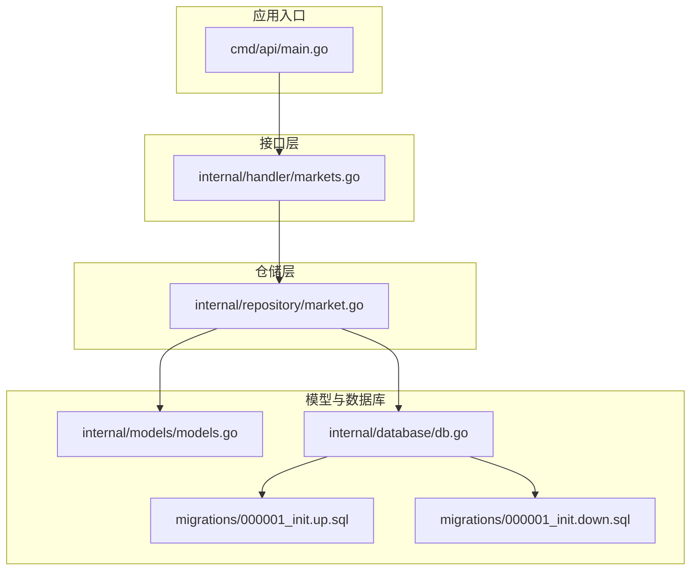
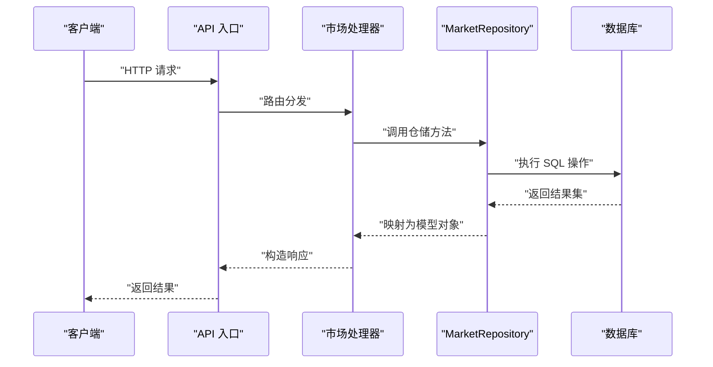
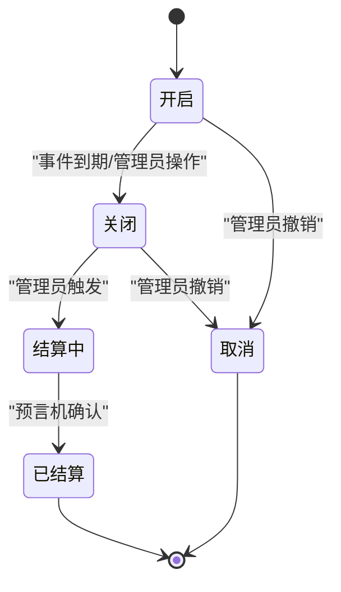
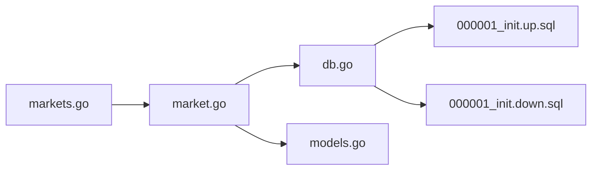

# 市场数据仓库

<cite>
**本文引用的文件**
- [internal/repository/market.go](file://internal/repository/market.go)
- [internal/models/models.go](file://internal/models/models.go)
- [internal/handler/markets.go](file://internal/handler/markets.go)
- [internal/database/db.go](file://internal/database/db.go)
- [migrations/000001_init.up.sql](file://migrations/000001_init.up.sql)
- [migrations/000001_init.down.sql](file://migrations/000001_init.down.sql)
- [cmd/api/main.go](file://cmd/api/main.go)
</cite>

## 目录
1. [简介](#简介)
2. [项目结构](#项目结构)
3. [核心组件](#核心组件)
4. [架构总览](#架构总览)
5. [详细组件分析](#详细组件分析)
6. [依赖关系分析](#依赖关系分析)
7. [性能考虑](#性能考虑)
8. [故障排查指南](#故障排查指南)
9. [结论](#结论)
10. [附录](#附录)

## 简介
本文件针对 PredictionDIDSimple 项目中的 MarketRepository（市场数据仓库）进行系统化技术文档整理，覆盖以下主题：
- 市场数据的 CRUD 操作实现：创建、查询、更新、删除的完整流程与边界条件
- 市场数据模型的字段定义、数据类型、约束与索引策略
- 市场状态管理机制：开启、关闭、结算状态的转换逻辑与业务规则
- 使用示例：通过 MarketRepository 执行常见业务操作（查询详情、获取列表、更新状态）
- 缓存策略与性能优化：查询优化、批量操作、事务处理
- 业务规则实现与验证逻辑

## 项目结构
MarketRepository 位于 internal/repository/market.go，配合 models 定义、数据库连接、迁移脚本以及 API 处理器共同构成完整的市场数据层。

图表来源
- [cmd/api/main.go](file://cmd/api/main.go)
- [internal/handler/markets.go](file://internal/handler/markets.go)
- [internal/repository/market.go](file://internal/repository/market.go)
- [internal/models/models.go](file://internal/models/models.go)
- [internal/database/db.go](file://internal/database/db.go)
- [migrations/000001_init.up.sql](file://migrations/000001_init.up.sql)
- [migrations/000001_init.down.sql](file://migrations/000001_init.down.sql)

章节来源
- [internal/repository/market.go](file://internal/repository/market.go)
- [internal/models/models.go](file://internal/models/models.go)
- [internal/handler/markets.go](file://internal/handler/markets.go)
- [internal/database/db.go](file://internal/database/db.go)
- [migrations/000001_init.up.sql](file://migrations/000001_init.up.sql)
- [migrations/000001_init.down.sql](file://migrations/000001_init.down.sql)

## 核心组件
- MarketRepository：封装市场数据的持久化操作，提供 CRUD 能力与状态变更控制
- Market 模型：定义市场实体的数据结构、字段约束与校验逻辑
- 数据库连接与迁移：初始化表结构、索引与约束
- API 处理器：对外暴露市场相关接口，调用仓储层执行业务操作

章节来源
- [internal/repository/market.go](file://internal/repository/market.go)
- [internal/models/models.go](file://internal/models/models.go)
- [internal/handler/markets.go](file://internal/handler/markets.go)
- [internal/database/db.go](file://internal/database/db.go)

## 架构总览
MarketRepository 的典型调用链路如下：

图表来源
- [cmd/api/main.go](file://cmd/api/main.go)
- [internal/handler/markets.go](file://internal/handler/markets.go)
- [internal/repository/market.go](file://internal/repository/market.go)
- [internal/database/db.go](file://internal/database/db.go)

## 详细组件分析

### 市场数据模型与约束
- 字段定义与类型：包含市场标识、标题、描述、事件时间、状态、结算参数、创建/更新时间戳等
- 约束条件：主键、唯一性约束（如市场地址）、非空约束、枚举值范围（状态）
- 索引策略：对常用查询字段建立索引（如状态、事件时间、创建时间），以支持高频筛选与排序
- 校验逻辑：在创建/更新时进行输入校验、状态合法性检查、时间先后顺序验证

章节来源
- [internal/models/models.go](file://internal/models/models.go)
- [migrations/000001_init.up.sql](file://migrations/000001_init.up.sql)

### 市场状态管理机制
- 状态枚举：开启、关闭、结算中、已结算、已取消等
- 状态转换规则：
  - 开启 → 关闭：需满足事件时间到达且无未决争议
  - 关闭 → 结算中：由管理员或授权服务触发
  - 结算中 → 已结算：根据预言机结果完成最终结算
  - 开启/关闭 → 取消：在特定条件下允许撤销
- 业务规则验证：状态转换前置条件检查、并发安全（使用行级锁或版本号）、幂等性保证

图表来源
- [internal/models/models.go](file://internal/models/models.go)
- [internal/repository/market.go](file://internal/repository/market.go)

### MarketRepository CRUD 实现要点
- 创建市场：校验输入、生成唯一标识、写入初始状态、记录审计信息
- 查询市场：
  - 单个详情：按主键或唯一标识精确查询
  - 列表查询：支持分页、按状态过滤、按事件时间排序
- 更新市场：仅允许在允许的状态下进行字段更新；状态变更走专用方法并进行规则校验
- 删除市场：软删除或硬删除策略取决于业务需求；删除前需检查关联数据（如头寸、匹配）

章节来源
- [internal/repository/market.go](file://internal/repository/market.go)

### API 使用示例（路径指引）
- 查询特定市场的详细信息：参考 [internal/handler/markets.go](file://internal/handler/markets.go)
- 获取市场列表：参考 [internal/handler/markets.go](file://internal/handler/markets.go)
- 更新市场状态：参考 [internal/handler/markets.go](file://internal/handler/markets.go)
- 调用仓储层：参考 [internal/repository/market.go](file://internal/repository/market.go)

章节来源
- [internal/handler/markets.go](file://internal/handler/markets.go)
- [internal/repository/market.go](file://internal/repository/market.go)

### 业务规则与验证逻辑
- 时间约束：事件时间必须晚于当前时间；结算窗口开启/关闭有严格的时间边界
- 状态约束：仅允许在允许的状态间进行转换；禁止非法逆向转换
- 权限约束：状态变更需要管理员或授权角色；写操作需鉴权
- 并发控制：使用数据库事务与锁保障一致性；必要时引入乐观锁版本号
- 数据完整性：外键约束、唯一性约束、默认值与非空约束

章节来源
- [internal/models/models.go](file://internal/models/models.go)
- [internal/repository/market.go](file://internal/repository/market.go)

## 依赖关系分析
- Handler 依赖 Repository 提供的领域能力
- Repository 依赖 Database 连接与事务管理
- Model 作为数据契约被 Handler、Repository 共同使用
- 迁移脚本定义了底层表结构与索引，直接影响查询性能

图表来源
- [internal/handler/markets.go](file://internal/handler/markets.go)
- [internal/repository/market.go](file://internal/repository/market.go)
- [internal/database/db.go](file://internal/database/db.go)
- [internal/models/models.go](file://internal/models/models.go)
- [migrations/000001_init.up.sql](file://migrations/000001_init.up.sql)
- [migrations/000001_init.down.sql](file://migrations/000001_init.down.sql)

章节来源
- [internal/handler/markets.go](file://internal/handler/markets.go)
- [internal/repository/market.go](file://internal/repository/market.go)
- [internal/database/db.go](file://internal/database/db.go)
- [internal/models/models.go](file://internal/models/models.go)
- [migrations/000001_init.up.sql](file://migrations/000001_init.up.sql)
- [migrations/000001_init.down.sql](file://migrations/000001_init.down.sql)

## 性能考虑
- 查询优化
  - 为高频查询字段建立索引（状态、事件时间、创建时间）
  - 分页查询避免一次性加载过多数据
  - 使用选择性投影减少网络与序列化开销
- 批量操作
  - 批量插入/更新使用事务包裹，减少往返次数
  - 对批量状态变更采用原子 SQL 语句
- 事务处理
  - 将状态转换与相关副作用放在同一事务内
  - 避免长事务，及时提交或回滚
- 缓存策略
  - 对热点市场详情启用只读缓存（Redis 或内存缓存）
  - 缓存失效策略：基于 TTL 或基于事件驱动的主动失效
  - 写后读一致性：写入成功后立即更新缓存或标记失效
- 连接池与超时
  - 合理配置数据库连接池大小与超时参数
  - 对慢查询进行日志与告警

## 故障排查指南
- 常见错误与定位
  - 状态非法转换：检查状态转换前置条件与权限
  - 时间越界：核对事件时间与当前时间的关系
  - 并发冲突：查看是否缺少事务或锁；考虑重试与幂等设计
  - 索引缺失导致慢查询：通过 EXPLAIN 分析执行计划
- 日志与监控
  - 记录关键操作的请求 ID、用户身份、目标市场 ID
  - 对异常状态转换与失败重试进行告警
- 回滚与修复
  - 使用迁移脚本回滚到上一个稳定版本
  - 对不一致数据进行手工修复并补充校验逻辑

章节来源
- [internal/repository/market.go](file://internal/repository/market.go)
- [internal/handler/markets.go](file://internal/handler/markets.go)

## 结论
MarketRepository 通过清晰的职责划分与严格的业务规则实现了市场数据的可靠管理。结合合理的索引、事务与缓存策略，可在高并发场景下保持良好的性能与一致性。建议持续完善状态转换的自动化与可观测性，并加强边界条件与异常路径的测试覆盖。

## 附录
- 快速参考
  - 查询单个市场详情：参考 [internal/handler/markets.go](file://internal/handler/markets.go)
  - 获取市场列表与分页：参考 [internal/handler/markets.go](file://internal/handler/markets.go)
  - 更新市场状态：参考 [internal/handler/markets.go](file://internal/handler/markets.go)
  - 仓储方法入口：参考 [internal/repository/market.go](file://internal/repository/market.go)
- 数据库初始化
  - 表结构与索引：参考 [migrations/000001_init.up.sql](file://migrations/000001_init.up.sql)
  - 回滚脚本：参考 [migrations/000001_init.down.sql](file://migrations/000001_init.down.sql)