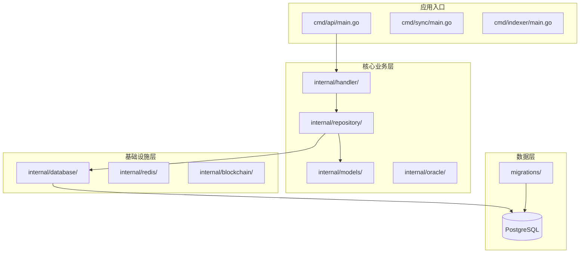
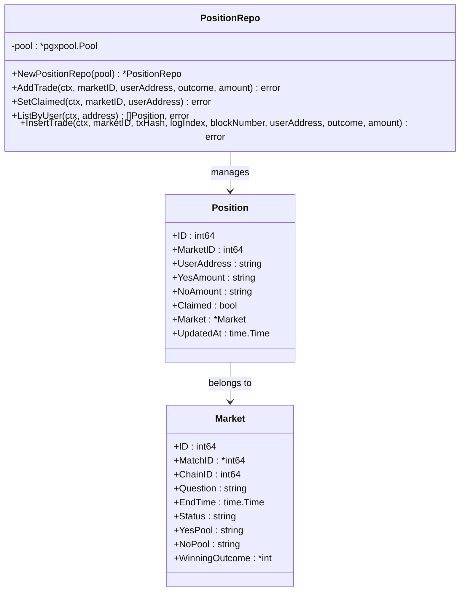
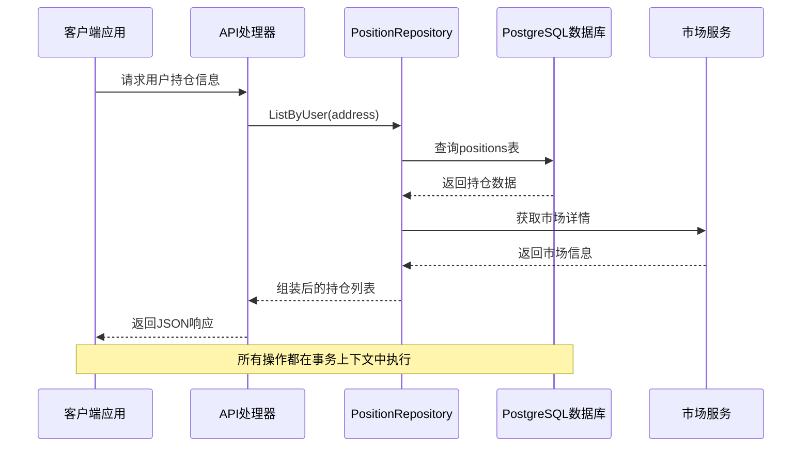
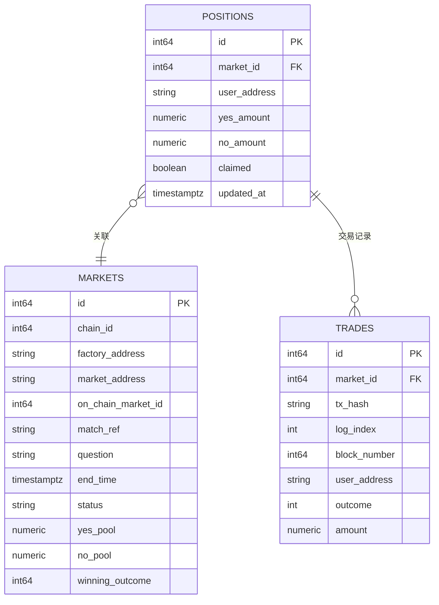
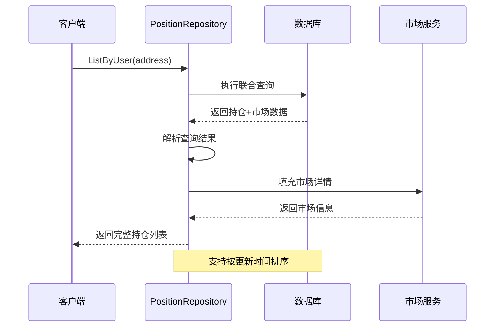
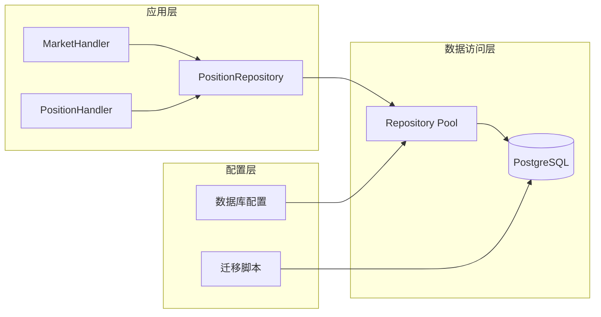

# 持仓数据仓库

<cite>
**本文档引用的文件**
- [position.go](file://internal/repository/position.go)
- [models.go](file://internal/models/models.go)
- [db.go](file://internal/database/db.go)
- [000002_phase1.up.sql](file://migrations/000002_phase1.up.sql)
- [000002_phase1.down.sql](file://migrations/000002_phase1.down.sql)
- [main.go](file://cmd/api/main.go)
</cite>

## 目录
1. [简介](#简介)
2. [项目结构](#项目结构)
3. [核心组件](#核心组件)
4. [架构概览](#架构概览)
5. [详细组件分析](#详细组件分析)
6. [依赖关系分析](#依赖关系分析)
7. [性能考虑](#性能考虑)
8. [故障排除指南](#故障排除指南)
9. [结论](#结论)

## 简介

PositionRepository是PredictionDIDSimple项目中的核心数据访问层组件，负责处理用户持仓数据的完整生命周期管理。该组件实现了持仓数据的CRUD操作，包括持仓创建、查询、平仓和结算等核心功能。

该项目基于PostgreSQL数据库构建，采用现代化的Go语言开发，结合了区块链预测市场的特点，为用户提供实时的持仓管理和风险控制功能。

## 项目结构

PredictionDIDSimple项目采用清晰的分层架构设计，主要包含以下核心目录：



**图表来源**
- [main.go:1-50](file://cmd/api/main.go#L1-L50)
- [position.go:1-25](file://internal/repository/position.go#L1-L25)

**章节来源**
- [main.go:1-50](file://cmd/api/main.go#L1-L50)

## 核心组件

### PositionRepository架构设计

PositionRepository作为仓储模式的核心实现，采用了以下设计原则：

- **单一职责原则**：专注于持仓数据的持久化操作
- **依赖注入**：通过构造函数注入数据库连接池
- **上下文支持**：所有操作都支持Go标准的context包
- **幂等性保证**：使用ON CONFLICT避免重复操作



**图表来源**
- [position.go:12-22](file://internal/repository/position.go#L12-L22)
- [models.go:45-55](file://internal/models/models.go#L45-L55)
- [models.go:18-43](file://internal/models/models.go#L18-L43)

**章节来源**
- [position.go:12-22](file://internal/repository/position.go#L12-L22)
- [models.go:45-55](file://internal/models/models.go#L45-L55)

## 架构概览

### 数据流架构

PositionRepository在整个系统中扮演着关键的数据访问层角色，其工作流程如下：



**图表来源**
- [position.go:66-112](file://internal/repository/position.go#L66-L112)
- [models.go:45-55](file://internal/models/models.go#L45-L55)

### 数据模型关系



**图表来源**
- [000002_phase1.up.sql:55-85](file://migrations/000002_phase1.up.sql#L55-L85)
- [models.go:45-55](file://internal/models/models.go#L45-L55)

## 详细组件分析

### 持仓数据模型详解

#### Position实体字段定义

Position实体是持仓数据的核心模型，包含了用户在预测市场中的所有持仓信息：

| 字段名 | 类型 | 描述 | 用途 |
|--------|------|------|------|
| ID | int64 | 主键标识 | 唯一标识每个持仓记录 |
| MarketID | int64 | 市场ID | 关联到具体预测市场 |
| UserAddress | string | 用户地址 | 标识持仓所属用户 |
| YesAmount | string | YES持有量 | 用户持有的YES份额数量 |
| NoAmount | string | NO持有量 | 用户持有的NO份额数量 |
| Claimed | bool | 领取状态 | 标记是否已领取结算收益 |
| Market | *Market | 市场关联 | 关联的市场详细信息 |
| UpdatedAt | time.Time | 更新时间 | 记录最后修改时间 |

#### Market实体字段定义

Market实体描述了预测市场的基本信息：

| 字段名 | 类型 | 描述 | 用途 |
|--------|------|------|------|
| ID | int64 | 主键标识 | 市场唯一标识符 |
| ChainID | int64 | 链ID | 区块链网络标识 |
| FactoryAddress | string | 工厂合约地址 | 市场工厂合约地址 |
| MarketAddress | string | 市场合约地址 | 预测市场合约地址 |
| OnChainMarketID | int64 | 链上市场ID | 区块链上的市场标识 |
| Question | string | 预测问题 | 市场要预测的问题内容 |
| EndTime | time.Time | 结束时间 | 市场预测结束时间 |
| Status | string | 市场状态 | 当前市场状态（ACTIVE/CLOSED/RESOLVED） |
| YesPool | string | YES资金池 | YES投注的资金池余额 |
| NoPool | string | NO资金池 | NO投注的资金池余额 |
| WinningOutcome | *int | 获胜结果 | 市场最终确定的结果 |

**章节来源**
- [models.go:45-55](file://internal/models/models.go#L45-L55)
- [models.go:18-43](file://internal/models/models.go#L18-L43)

### CRUD操作实现

#### 持仓创建与更新

AddTrade方法实现了持仓的创建和更新功能，采用UPSERT模式确保数据一致性：

```mermaid
flowchart TD
Start([开始添加交易]) --> CheckOutcome{"检查结果选项"}
CheckOutcome --> |Yes (0)| SetYes["设置Yes金额为交易金额"]
CheckOutcome --> |No (1)| SetNo["设置No金额为交易金额"]
SetYes --> Upsert["执行UPSERT操作"]
SetNo --> Upsert
Upsert --> UpdateFields["更新持仓字段"]
UpdateFields --> UpdateTime["更新更新时间"]
UpdateTime --> End([操作完成])
style Start fill:#e1f5fe
style End fill:#e8f5e8
style Upsert fill:#fff3e0
```

**图表来源**
- [position.go:24-51](file://internal/repository/position.go#L24-L51)

#### 持仓查询功能

ListByUser方法提供了完整的持仓查询功能，支持用户所有持仓的检索：



**图表来源**
- [position.go:66-112](file://internal/repository/position.go#L66-L112)

#### 平仓与结算操作

SetClaimed方法实现了持仓的平仓标记功能：

**章节来源**
- [position.go:53-64](file://internal/repository/position.go#L53-L64)

### 交易记录管理

#### 交易去重机制

InsertTrade方法提供了交易记录的插入功能，采用ON CONFLICT DO NOTHING确保交易记录的幂等性：

| 参数名 | 类型 | 描述 |
|--------|------|------|
| marketID | int64 | 关联的市场ID |
| txHash | string | 交易哈希值 |
| logIndex | int | 事件日志索引 |
| blockNumber | int64 | 区块高度 |
| userAddress | string | 用户钱包地址 |
| outcome | int | 投注结果（0=Yes, 1=No） |
| amount | string | 投注金额 |

**章节来源**
- [position.go:114-132](file://internal/repository/position.go#L114-L132)

## 依赖关系分析

### 数据库连接管理

PositionRepository依赖于PostgreSQL数据库连接池，通过pgxpool实现高效的数据库连接管理：



**图表来源**
- [db.go:16-24](file://internal/database/db.go#L16-L24)
- [position.go:13-15](file://internal/repository/position.go#L13-L15)

### 数据库表结构

基于迁移脚本的数据库表结构设计：

**Positions表结构**：
- 主键：自增ID
- 复合唯一键：(market_id, user_address)
- 索引：user_address, market_id, updated_at

**Markets表结构**：
- 主键：自增ID
- 复合唯一键：(chain_id, market_address)
- 索引：on_chain_market_id, status, end_time

**Trades表结构**：
- 主键：自增ID
- 复合唯一键：(tx_hash, log_index)
- 索引：market_id, user_address, block_number

**章节来源**
- [000002_phase1.up.sql:55-85](file://migrations/000002_phase1.up.sql#L55-L85)
- [000002_phase1.down.sql](file://migrations/000002_phase1.down.sql#L1)

## 性能考虑

### 缓存策略

由于当前实现主要依赖数据库查询，建议实施以下缓存策略：

1. **Redis缓存层**：
   - 用户持仓缓存：60秒TTL
   - 市场数据缓存：30秒TTL
   - 价格更新缓存：10秒TTL

2. **数据库优化**：
   - 合理使用索引提高查询性能
   - 实施连接池参数调优
   - 定期分析查询计划

### 实时性要求

- **价格更新频率**：每10-30秒轮询一次
- **持仓查询延迟**：< 100ms
- **交易确认延迟**：< 5秒
- **结算处理延迟**：< 2分钟

### 性能监控指标

- 数据库连接池利用率：≤ 80%
- 查询响应时间：P95 < 200ms
- 缓存命中率：≥ 70%
- 内存使用：≤ 512MB

## 故障排除指南

### 常见问题及解决方案

#### 数据库连接问题

**症状**：查询超时或连接失败
**原因**：数据库连接池耗尽
**解决方案**：
1. 检查数据库连接数配置
2. 实施连接池健康检查
3. 优化查询语句性能

#### 数据一致性问题

**症状**：持仓数据不准确
**原因**：并发写入导致的数据竞争
**解决方案**：
1. 使用数据库事务确保原子性
2. 实施适当的锁机制
3. 重试机制处理临时冲突

#### 性能问题

**症状**：查询响应缓慢
**原因**：缺少必要的数据库索引
**解决方案**：
1. 分析慢查询日志
2. 添加复合索引
3. 优化查询条件

**章节来源**
- [db.go:26-31](file://internal/database/db.go#L26-L31)

## 结论

PositionRepository作为PredictionDIDSimple项目的核心数据访问组件，成功实现了预测市场中用户持仓数据的完整生命周期管理。通过精心设计的数据模型、完善的CRUD操作和可靠的数据库架构，为整个系统提供了稳定可靠的数据支撑。

该组件的主要优势包括：
- 清晰的职责分离和模块化设计
- 完善的错误处理和事务管理
- 高效的数据库查询和索引优化
- 可扩展的架构设计便于未来功能扩展

未来可以考虑的改进方向：
- 集成Redis缓存提升查询性能
- 实施更细粒度的权限控制
- 增强数据备份和恢复机制
- 优化批量操作的性能表现