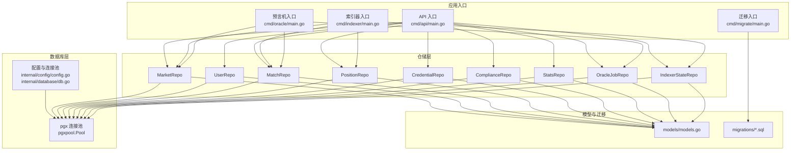
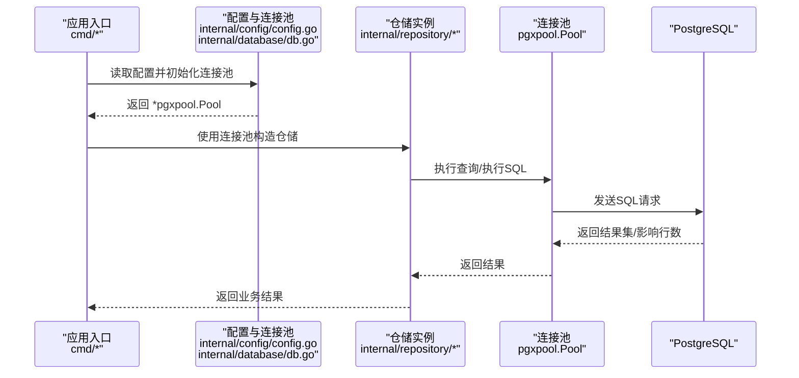
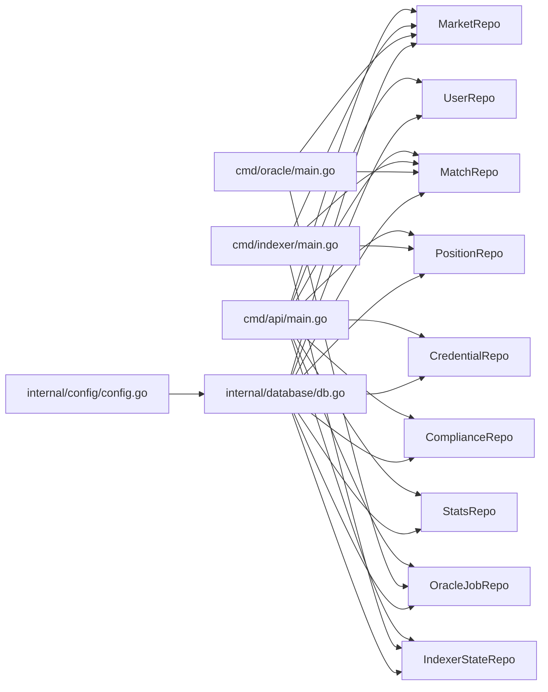

# 数据库层

<cite>
**本文引用的文件**
- [db.go](file://internal/database/db.go)
- [config.go](file://internal/config/config.go)
- [main.go](file://cmd/api/main.go)
- [main.go](file://cmd/indexer/main.go)
- [main.go](file://cmd/oracle/main.go)
- [main.go](file://cmd/migrate/main.go)
- [market.go](file://internal/repository/market.go)
- [user.go](file://internal/repository/user.go)
- [match.go](file://internal/repository/match.go)
- [position.go](file://internal/repository/position.go)
- [credential.go](file://internal/repository/credential.go)
- [compliance.go](file://internal/repository/compliance.go)
- [stats.go](file://internal/repository/stats.go)
- [oracle_job.go](file://internal/repository/oracle_job.go)
- [indexer_state.go](file://internal/repository/indexer_state.go)
- [models.go](file://internal/models/models.go)
- [000001_init.up.sql](file://migrations/000001_init.up.sql)
- [000002_phase1.up.sql](file://migrations/000002_phase1.up.sql)
- [000003_phase2.up.sql](file://migrations/000003_phase2.up.sql)
- [000004_phase3.up.sql](file://migrations/000004_phase3.up.sql)
</cite>

## 目录
1. [简介](#简介)
2. [项目结构](#项目结构)
3. [核心组件](#核心组件)
4. [架构总览](#架构总览)
5. [详细组件分析](#详细组件分析)
6. [依赖关系分析](#依赖关系分析)
7. [性能考量](#性能考量)
8. [故障排查指南](#故障排查指南)
9. [结论](#结论)
10. [附录](#附录)

## 简介
本文件系统性梳理 PredictionDIDSimple 项目的数据库层设计与实现，重点围绕 Repository 模式的落地、数据访问层的职责划分、CRUD 封装、数据库连接池管理、事务与批量优化策略、查询性能调优以及常见问题排查。文档覆盖以下仓储模块：MarketRepo、UserRepo、MatchRepo、PositionRepo、CredentialRepo、ComplianceRepo、StatsRepo、OracleJobRepo、IndexerStateRepo，并结合迁移脚本与配置文件说明数据库初始化与版本演进。

## 项目结构
数据库层由“配置与连接池”“仓储实现”“模型定义”“迁移脚本”四部分组成：
- 配置与连接池：在数据库包中集中初始化与管理连接池，供各业务模块复用。
- 仓储实现：每个仓储封装特定领域表的 CRUD 与聚合查询，统一通过 pgx/v5 的连接池执行 SQL。
- 模型定义：在 models 包中声明与数据库表结构对应的 Go 类型，便于仓储层映射。
- 迁移脚本：按版本维护数据库结构变更，确保开发、测试、生产环境一致。

图表来源
- [config.go](file://internal/config/config.go)
- [db.go](file://internal/database/db.go)
- [main.go](file://cmd/api/main.go)
- [main.go](file://cmd/indexer/main.go)
- [main.go](file://cmd/oracle/main.go)
- [main.go](file://cmd/migrate/main.go)
- [market.go](file://internal/repository/market.go)
- [user.go](file://internal/repository/user.go)
- [match.go](file://internal/repository/match.go)
- [position.go](file://internal/repository/position.go)
- [credential.go](file://internal/repository/credential.go)
- [compliance.go](file://internal/repository/compliance.go)
- [stats.go](file://internal/repository/stats.go)
- [oracle_job.go](file://internal/repository/oracle_job.go)
- [indexer_state.go](file://internal/repository/indexer_state.go)
- [models.go](file://internal/models/models.go)
- [000001_init.up.sql](file://migrations/000001_init.up.sql)
- [000002_phase1.up.sql](file://migrations/000002_phase1.up.sql)
- [000003_phase2.up.sql](file://migrations/000003_phase2.up.sql)
- [000004_phase3.up.sql](file://migrations/000004_phase3.up.sql)

章节来源
- [config.go](file://internal/config/config.go)
- [db.go](file://internal/database/db.go)
- [main.go](file://cmd/api/main.go)
- [main.go](file://cmd/indexer/main.go)
- [main.go](file://cmd/oracle/main.go)
- [main.go](file://cmd/migrate/main.go)

## 核心组件
- 配置与连接池
  - 在配置包中读取数据库连接参数，构建 pgxpool.Pool；在数据库包中集中初始化与导出该连接池，供各入口模块注入到仓储构造函数。
  - 连接池具备连接复用、空闲回收、最大连接数限制等能力，避免频繁建立/销毁连接带来的开销。
- 仓储接口与职责
  - 每个仓储负责单一领域表的 CRUD 与聚合查询，统一通过上下文控制超时与取消，保证并发安全。
  - 仓储不直接暴露 SQL，仅提供语义化的业务方法，降低上层对底层细节的耦合。
- 模型与迁移
  - 模型定义与数据库表结构一一对应，便于 ORM 映射与序列化。
  - 迁移脚本按版本维护数据库结构，确保多环境一致性。

章节来源
- [config.go](file://internal/config/config.go)
- [db.go](file://internal/database/db.go)
- [models.go](file://internal/models/models.go)

## 架构总览
下图展示了应用入口如何通过依赖注入将连接池传递给各仓储，再由仓储执行 SQL 操作。

图表来源
- [config.go](file://internal/config/config.go)
- [db.go](file://internal/database/db.go)
- [main.go](file://cmd/api/main.go)
- [main.go](file://cmd/indexer/main.go)
- [main.go](file://cmd/oracle/main.go)

## 详细组件分析

### MarketRepo（市场仓储）
- 职责
  - 提供市场相关数据的增删改查与聚合统计。
  - 支持按条件过滤、排序与分页。
- 关键方法
  - 列表查询：支持按状态过滤、升序排序、分页参数。
  - 新增/更新：封装插入与更新逻辑，返回受影响行数或新增 ID。
  - 删除：按主键删除，注意外键约束。
- 使用场景
  - API 层展示市场列表、详情页加载、后台管理。
- 性能建议
  - 对常用过滤字段建立索引；分页使用稳定的排序字段。
- 事务与批量
  - 单条市场更新建议在事务中执行；批量导入可通过批量插入优化。

章节来源
- [market.go](file://internal/repository/market.go)
- [main.go](file://cmd/api/main.go)
- [main.go](file://cmd/indexer/main.go)

### UserRepo（用户仓储）
- 职责
  - 用户注册/更新、DID 绑定、按地址查询。
- 关键方法
  - UpsertByAddress：按钱包地址 upsert，冲突时更新时间戳并返回用户信息。
  - BindDID：为用户绑定 DID。
  - GetByAddress：按地址查询用户。
- 使用场景
  - 登录后用户信息同步、DID 绑定流程。
- 性能建议
  - 地址字段建立唯一索引；大小写不敏感查询需考虑索引策略。
- 事务与批量
  - 批量导入用户可采用批量 upsert。

章节来源
- [user.go](file://internal/repository/user.go)
- [main.go](file://cmd/api/main.go)

### MatchRepo（比赛仓储）
- 职责
  - 比赛数据的增删改查与分页列表。
- 关键方法
  - List：动态拼接 WHERE 条件（如状态）、排序与分页。
- 使用场景
  - 前端比赛列表、筛选与分页。
- 性能建议
  - 对 kickoff_at、status 建立复合索引；分页 limit/offset 合理设置。
- 事务与批量
  - 批量同步比赛数据时使用事务包裹。

章节来源
- [match.go](file://internal/repository/match.go)
- [main.go](file://cmd/api/main.go)
- [main.go](file://cmd/indexer/main.go)

### PositionRepo（持仓仓储）
- 职责
  - 用户持仓与交易流水的增删改查。
- 关键方法
  - AddTrade：根据结果选项与金额更新或插入交易记录与持仓。
- 使用场景
  - 交易完成后更新用户持仓。
- 性能建议
  - 对用户地址、市场 ID 建立索引；热点数据可考虑分区。
- 事务与批量
  - 交易流程必须在事务中执行，保证一致性。

章节来源
- [position.go](file://internal/repository/position.go)
- [main.go](file://cmd/api/main.go)
- [main.go](file://cmd/indexer/main.go)

### CredentialRepo（可验证凭证仓储）
- 职责
  - 凭证的创建、查询与过期管理。
- 关键方法
  - Insert：插入凭证并返回自增 ID。
- 使用场景
  - KYC 流程中保存 VC 凭证。
- 性能建议
  - 对 user_address 建立索引；定期清理过期凭证。
- 事务与批量
  - 批量导入凭证时使用事务。

章节来源
- [credential.go](file://internal/repository/credential.go)
- [main.go](file://cmd/api/main.go)

### ComplianceRepo（合规仓储）
- 职责
  - 地理访问日志与 KYC 事件记录。
- 关键方法
  - LogGeo：记录 IP、国家、路径与是否允许。
  - LogKYC：记录外部 ID、用户地址、状态与原始回调 JSON。
- 使用场景
  - 合规审计与风控监控。
- 性能建议
  - 日志表独立维护，必要时异步落盘。
- 事务与批量
  - 日志写入建议异步化，不影响主流程。

章节来源
- [compliance.go](file://internal/repository/compliance.go)
- [main.go](file://cmd/api/main.go)

### StatsRepo（统计仓储）
- 职责
  - 平台级统计数据聚合（交易次数、交易额、手续费、活跃用户、开放市场、TVL 近似）。
- 关键方法
  - Platform：通过子查询聚合关键指标。
- 使用场景
  - 仪表盘与运营看板。
- 性能建议
  - 对高频聚合字段建立物化视图或缓存；拆分复杂聚合为多步查询。
- 事务与批量
  - 统计计算通常只读，无需事务。

章节来源
- [stats.go](file://internal/repository/stats.go)
- [main.go](file://cmd/api/main.go)

### OracleJobRepo（预言机任务仓储）
- 职责
  - 预言机任务的创建、状态更新与调度。
- 关键方法
  - 数据模型包含任务状态、比分、提议结果、执行时间、错误信息等。
- 使用场景
  - 预言机工作流与任务调度。
- 性能建议
  - 对状态与执行时间建立索引；分页查询最近任务。
- 事务与批量
  - 任务状态更新需原子性，批量更新使用批量 SQL。

章节来源
- [oracle_job.go](file://internal/repository/oracle_job.go)
- [main.go](file://cmd/oracle/main.go)

### IndexerStateRepo（索引器状态仓储）
- 职责
  - 记录索引器已处理的区块高度与工厂合约地址。
- 关键方法
  - GetLastBlock：获取上次处理的区块号。
  - SetLastBlock：更新区块号与工厂地址并刷新时间。
- 使用场景
  - 索引器断点续跑与状态恢复。
- 性能建议
  - 状态表极小，读写简单，无需额外索引。
- 事务与批量
  - 更新状态建议在事务中提交，保证原子性。

章节来源
- [indexer_state.go](file://internal/repository/indexer_state.go)
- [main.go](file://cmd/indexer/main.go)

## 依赖关系分析
- 入口模块依赖
  - API、索引器、预言机、迁移等入口均从配置包获取连接池，再注入到各自需要的仓储。
- 仓储依赖
  - 各仓储仅依赖 pgxpool.Pool 与 models 定义，保持低耦合。
- 迁移与模型
  - 迁移脚本定义表结构，模型定义与之对应，确保 ORM 映射正确。

图表来源
- [main.go](file://cmd/api/main.go)
- [main.go](file://cmd/indexer/main.go)
- [main.go](file://cmd/oracle/main.go)
- [config.go](file://internal/config/config.go)
- [db.go](file://internal/database/db.go)
- [market.go](file://internal/repository/market.go)
- [user.go](file://internal/repository/user.go)
- [match.go](file://internal/repository/match.go)
- [position.go](file://internal/repository/position.go)
- [credential.go](file://internal/repository/credential.go)
- [compliance.go](file://internal/repository/compliance.go)
- [stats.go](file://internal/repository/stats.go)
- [oracle_job.go](file://internal/repository/oracle_job.go)
- [indexer_state.go](file://internal/repository/indexer_state.go)

章节来源
- [main.go](file://cmd/api/main.go)
- [main.go](file://cmd/indexer/main.go)
- [main.go](file://cmd/oracle/main.go)
- [config.go](file://internal/config/config.go)
- [db.go](file://internal/database/db.go)

## 性能考量
- 连接池配置与管理
  - 连接池大小：根据并发请求数与数据库承载能力设定最大连接数与空闲连接数。
  - 超时设置：为每个请求设置合理的上下文超时，避免连接长时间占用。
  - 错误处理：对连接失败、查询超时、死锁等异常进行分类处理与重试策略。
- 事务处理
  - 将强一致性的操作（如交易、状态更新）放入单个事务，减少中间态。
  - 避免长事务，及时提交或回滚。
- 批量操作优化
  - 使用批量插入/更新减少往返次数；合理分批大小，避免单次过大。
  - 对批量写入使用 COPY 或批量 SQL。
- 查询性能调优
  - 为高频过滤与排序字段建立索引；避免 SELECT *，仅取所需列。
  - 分页查询使用基于游标或稳定排序字段的方案，减少 deep pagination。
  - 对复杂统计使用物化视图或缓存中间结果。
- 监控与观测
  - 记录慢查询与错误日志；观察连接池利用率与等待时间。
  - 对关键路径增加埋点，评估优化效果。

## 故障排查指南
- 连接池相关
  - 现象：连接耗尽、超时。
  - 排查：检查最大连接数、空闲连接、超时配置；确认是否存在长事务或泄漏的连接。
- 查询性能问题
  - 现象：响应慢、CPU 高。
  - 排查：查看执行计划、索引使用情况；定位慢查询并添加索引或重写 SQL。
- 事务冲突与死锁
  - 现象：更新失败、报错。
  - 排查：检查事务范围与锁竞争；调整更新顺序或拆分事务。
- 数据不一致
  - 现象：统计与明细不符。
  - 排查：核对统计逻辑与数据来源；必要时重建物化视图或缓存。
- 迁移失败
  - 现象：升级失败、结构不一致。
  - 排查：检查迁移脚本顺序与幂等性；回滚到上一版本后重试。

## 结论
本数据库层以 Repository 模式为核心，将数据访问抽象为清晰的领域仓储，配合集中式连接池与完善的迁移体系，实现了高内聚、低耦合的数据访问层。通过规范的事务与批量优化策略、查询性能调优与监控告警，能够支撑业务在高并发场景下的稳定运行。

## 附录

### 数据库配置选项与连接池管理
- 配置项（示例）
  - 数据库主机、端口、用户名、密码、数据库名、SSL 模式。
  - 连接池最大连接数、最小连接数、空闲超时、连接生命周期。
  - 查询/执行超时、重试策略。
- 连接池管理
  - 初始化：在应用启动时创建连接池并校验连通性。
  - 复用：各仓储共享同一连接池实例。
  - 关闭：应用优雅退出时关闭连接池，释放资源。

章节来源
- [config.go](file://internal/config/config.go)
- [db.go](file://internal/database/db.go)

### 迁移脚本与版本演进
- 版本化管理
  - 每个版本包含 up/down 脚本，确保可回滚与幂等。
  - 通过迁移入口统一执行，保证多环境一致性。
- 建议
  - 新增字段先加默认值，再补全历史数据。
  - 大表变更使用在线 DDL 或分批处理。

章节来源
- [000001_init.up.sql](file://migrations/000001_init.up.sql)
- [000002_phase1.up.sql](file://migrations/000002_phase1.up.sql)
- [000003_phase2.up.sql](file://migrations/000003_phase2.up.sql)
- [000004_phase3.up.sql](file://migrations/000004_phase3.up.sql)

### 仓储使用示例（步骤说明）
- 示例目标：展示如何使用仓储进行数据操作（查询、插入、更新、删除）。
- 示例步骤
  - 初始化连接池与仓储：在入口模块中读取配置并创建连接池，随后以连接池为参数构造仓储实例。
  - 查询：调用仓储提供的查询方法，传入上下文与参数，解析返回结果。
  - 插入/更新：调用仓储的插入或更新方法，传入业务参数，处理返回的错误。
  - 删除：调用删除方法，注意外键约束与级联行为。
  - 事务：将多个相关操作放入单个事务中执行，确保一致性。
- 注意事项
  - 所有操作均通过上下文控制超时与取消。
  - 对批量操作使用批量 SQL 或分批处理，避免单次过大。
  - 对只读统计类查询可考虑缓存或物化视图。

章节来源
- [main.go](file://cmd/api/main.go)
- [main.go](file://cmd/indexer/main.go)
- [main.go](file://cmd/oracle/main.go)
- [market.go](file://internal/repository/market.go)
- [user.go](file://internal/repository/user.go)
- [match.go](file://internal/repository/match.go)
- [position.go](file://internal/repository/position.go)
- [credential.go](file://internal/repository/credential.go)
- [compliance.go](file://internal/repository/compliance.go)
- [stats.go](file://internal/repository/stats.go)
- [oracle_job.go](file://internal/repository/oracle_job.go)
- [indexer_state.go](file://internal/repository/indexer_state.go)