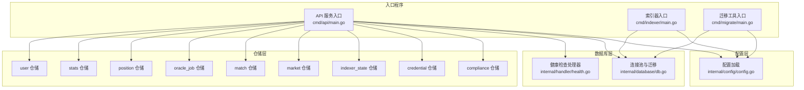
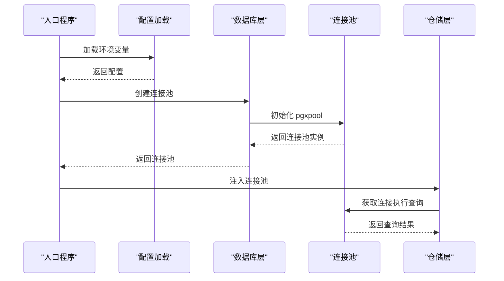
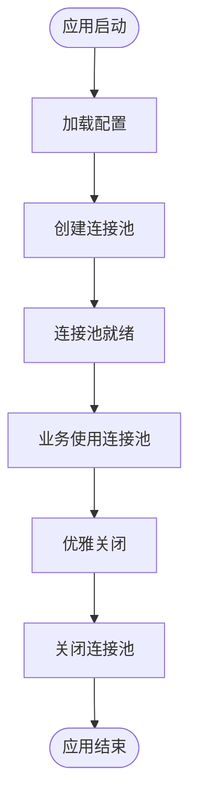
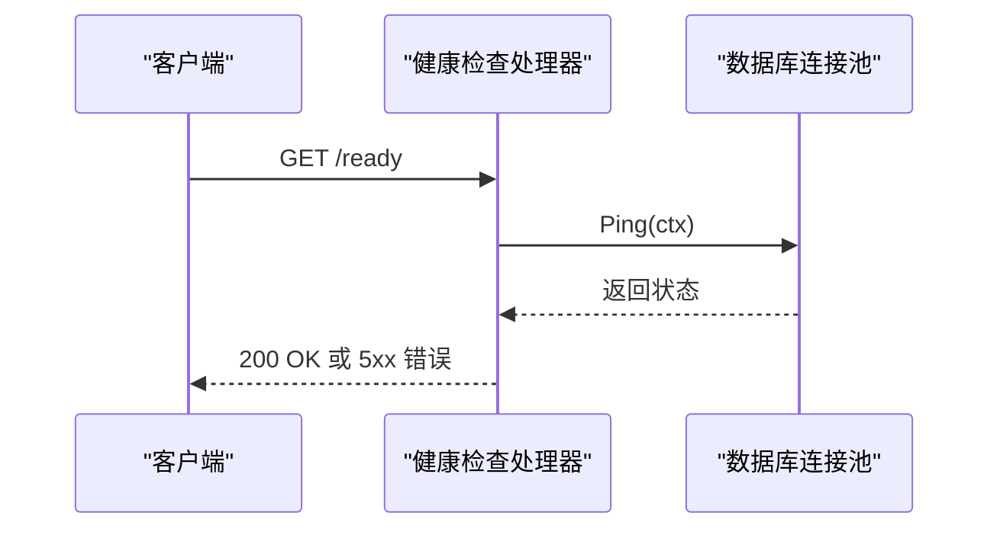
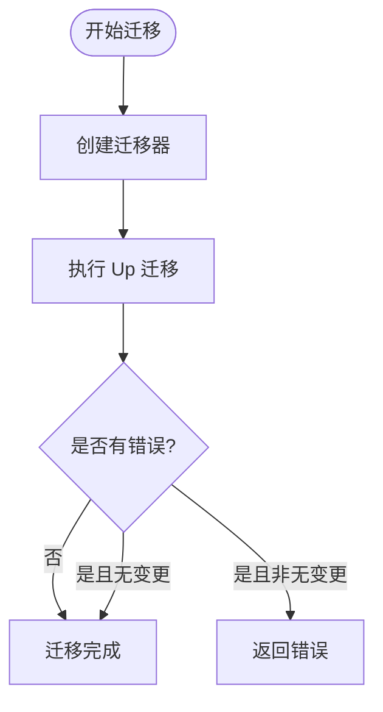
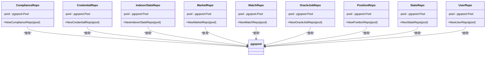
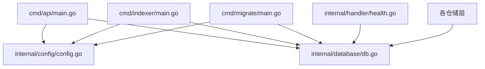

# 数据库连接管理

<cite>
**本文档引用的文件**
- [internal/database/db.go](file://internal/database/db.go)
- [internal/config/config.go](file://internal/config/config.go)
- [cmd/api/main.go](file://cmd/api/main.go)
- [cmd/indexer/main.go](file://cmd/indexer/main.go)
- [cmd/migrate/main.go](file://cmd/migrate/main.go)
- [internal/handler/health.go](file://internal/handler/health.go)
- [internal/repository/compliance.go](file://internal/repository/compliance.go)
- [internal/repository/credential.go](file://internal/repository/credential.go)
- [internal/repository/indexer_state.go](file://internal/repository/indexer_state.go)
- [internal/repository/market.go](file://internal/repository/market.go)
- [internal/repository/match.go](file://internal/repository/match.go)
- [internal/repository/oracle_job.go](file://internal/repository/oracle_job.go)
- [internal/repository/position.go](file://internal/repository/position.go)
- [internal/repository/stats.go](file://internal/repository/stats.go)
- [internal/repository/user.go](file://internal/repository/user.go)
</cite>

## 目录
1. [简介](#简介)
2. [项目结构](#项目结构)
3. [核心组件](#核心组件)
4. [架构概览](#架构概览)
5. [详细组件分析](#详细组件分析)
6. [依赖分析](#依赖分析)
7. [性能考虑](#性能考虑)
8. [故障排除指南](#故障排除指南)
9. [结论](#结论)

## 简介
本文档深入解析 PredictionDIDSimple 项目的数据库连接管理机制，重点覆盖 PostgreSQL 连接池的配置与管理、连接生命周期、监控与健康检查、错误处理与重连策略，以及生产与开发环境的最佳实践。

## 项目结构
数据库连接管理涉及以下关键模块：
- 配置加载：从环境变量读取数据库连接字符串和其他运行参数
- 连接池创建：基于 pgxpool 的连接池初始化
- 健康检查：数据库 Ping 探活与就绪检查
- 迁移执行：应用数据库结构迁移
- 仓储层集成：各业务仓储通过连接池进行数据库操作

**图表来源**
- [cmd/api/main.go:27-161](file://cmd/api/main.go#L27-L161)
- [cmd/indexer/main.go:18-52](file://cmd/indexer/main.go#L18-L52)
- [cmd/migrate/main.go:14-37](file://cmd/migrate/main.go#L14-L37)
- [internal/config/config.go:48-105](file://internal/config/config.go#L48-L105)
- [internal/database/db.go:16-50](file://internal/database/db.go#L16-L50)
- [internal/handler/health.go:12-71](file://internal/handler/health.go#L12-L71)

**章节来源**
- [cmd/api/main.go:27-161](file://cmd/api/main.go#L27-L161)
- [cmd/indexer/main.go:18-52](file://cmd/indexer/main.go#L18-L52)
- [cmd/migrate/main.go:14-37](file://cmd/migrate/main.go#L14-L37)
- [internal/config/config.go:48-105](file://internal/config/config.go#L48-L105)
- [internal/database/db.go:16-50](file://internal/database/db.go#L16-L50)
- [internal/handler/health.go:12-71](file://internal/handler/health.go#L12-L71)

## 核心组件
- 连接池创建：通过 NewPool 基于数据库 URL 初始化 pgxpool.Pool
- 健康检查：Ping 函数在 3 秒超时内验证连接可用性
- 迁移执行：RunMigrations 使用 golang-migrate 从文件系统应用迁移
- 配置管理：Config 结构体集中管理 DATABASE_URL、运行环境等关键参数

**章节来源**
- [internal/database/db.go:16-50](file://internal/database/db.go#L16-L50)
- [internal/config/config.go:12-46](file://internal/config/config.go#L12-L46)

## 架构概览
数据库连接管理采用分层设计：
- 入口程序负责加载配置、创建连接池、执行迁移、启动服务
- 数据库层提供连接池与迁移能力
- 仓储层通过连接池访问数据库
- 健康检查处理器结合数据库、Redis、RPC 进行综合状态检查

**图表来源**
- [cmd/api/main.go:29-61](file://cmd/api/main.go#L29-L61)
- [cmd/indexer/main.go:20-33](file://cmd/indexer/main.go#L20-L33)
- [internal/database/db.go:16-24](file://internal/database/db.go#L16-L24)

## 详细组件分析

### 连接池初始化与生命周期
- 初始化流程：入口程序加载配置后调用 NewPool 创建连接池，随后在程序退出时调用 Close 进行资源回收
- 生命周期管理：连接池在整个应用运行期间保持活跃，优雅关闭时统一释放
- 连接复用：pgxpool 自动管理连接复用，无需手动维护连接对象

**图表来源**
- [cmd/api/main.go:29-61](file://cmd/api/main.go#L29-L61)
- [cmd/indexer/main.go:20-33](file://cmd/indexer/main.go#L20-L33)

**章节来源**
- [cmd/api/main.go:29-61](file://cmd/api/main.go#L29-L61)
- [cmd/indexer/main.go:20-33](file://cmd/indexer/main.go#L20-L33)
- [internal/database/db.go:16-24](file://internal/database/db.go#L16-L24)

### 连接超时与健康检查
- 超时设置：Ping 函数使用 3 秒超时确保快速失败
- 健康检查：/ready 端点调用数据库 Ping 验证连接可用性
- 综合健康：/health 端点返回存活状态，/ready 端点包含数据库、Redis、RPC 的综合检查

**图表来源**
- [internal/handler/health.go:32-71](file://internal/handler/health.go#L32-L71)
- [internal/database/db.go:26-31](file://internal/database/db.go#L26-L31)

**章节来源**
- [internal/database/db.go:26-31](file://internal/database/db.go#L26-L31)
- [internal/handler/health.go:32-71](file://internal/handler/health.go#L32-L71)

### 数据库迁移管理
- 迁移工具：migrate 命令行工具负责应用迁移
- 迁移执行：RunMigrations 从文件系统加载迁移脚本并执行 Up 操作
- 错误处理：忽略无变更错误，其他错误均向上抛出

**图表来源**
- [internal/database/db.go:33-50](file://internal/database/db.go#L33-L50)
- [cmd/migrate/main.go:14-37](file://cmd/migrate/main.go#L14-L37)

**章节来源**
- [internal/database/db.go:33-50](file://internal/database/db.go#L33-L50)
- [cmd/migrate/main.go:14-37](file://cmd/migrate/main.go#L14-L37)

### 仓储层集成模式
各业务仓储均通过构造函数接收连接池实例，实现依赖注入：
- compliance 仓储
- credential 仓储  
- indexer_state 仓储
- market 仓储
- match 仓储
- oracle_job 仓储
- position 仓储
- stats 仓储
- user 仓储

**图表来源**
- [internal/repository/compliance.go:16](file://internal/repository/compliance.go#L16)
- [internal/repository/credential.go:29](file://internal/repository/credential.go#L29)
- [internal/repository/indexer_state.go:16](file://internal/repository/indexer_state.go#L16)
- [internal/repository/market.go](file://internal/repository/market.go)
- [internal/repository/match.go](file://internal/repository/match.go)
- [internal/repository/oracle_job.go](file://internal/repository/oracle_job.go)
- [internal/repository/position.go](file://internal/repository/position.go)
- [internal/repository/stats.go](file://internal/repository/stats.go)
- [internal/repository/user.go](file://internal/repository/user.go)

**章节来源**
- [internal/repository/compliance.go:16](file://internal/repository/compliance.go#L16)
- [internal/repository/credential.go:29](file://internal/repository/credential.go#L29)
- [internal/repository/indexer_state.go:16](file://internal/repository/indexer_state.go#L16)
- [internal/repository/market.go](file://internal/repository/market.go)
- [internal/repository/match.go](file://internal/repository/match.go)
- [internal/repository/oracle_job.go](file://internal/repository/oracle_job.go)
- [internal/repository/position.go](file://internal/repository/position.go)
- [internal/repository/stats.go](file://internal/repository/stats.go)
- [internal/repository/user.go](file://internal/repository/user.go)

### 配置驱动的连接管理
- 数据库 URL：通过 DATABASE_URL 环境变量提供连接信息
- 运行环境：APP_ENV 控制开发/生产环境行为
- 环境隔离：不同环境下的连接参数可通过环境变量灵活调整

**章节来源**
- [internal/config/config.go:48-105](file://internal/config/config.go#L48-L105)

## 依赖分析
数据库连接管理的关键依赖关系：
- 入口程序依赖配置加载与数据库层
- 数据库层依赖 pgxpool 与 golang-migrate
- 仓储层依赖数据库连接池
- 健康检查处理器依赖数据库连接池

**图表来源**
- [cmd/api/main.go:18-24](file://cmd/api/main.go#L18-L24)
- [cmd/indexer/main.go:11-15](file://cmd/indexer/main.go#L11-L15)
- [cmd/migrate/main.go:10-12](file://cmd/migrate/main.go#L10-L12)
- [internal/handler/health.go:12-24](file://internal/handler/health.go#L12-L24)

**章节来源**
- [cmd/api/main.go:18-24](file://cmd/api/main.go#L18-L24)
- [cmd/indexer/main.go:11-15](file://cmd/indexer/main.go#L11-L15)
- [cmd/migrate/main.go:10-12](file://cmd/migrate/main.go#L10-L12)
- [internal/handler/health.go:12-24](file://internal/handler/health.go#L12-L24)

## 性能考虑
- 连接池大小：pgxpool 默认配置适用于大多数场景，可根据并发需求调整
- 连接复用：pgxpool 自动管理连接复用，减少连接建立开销
- 超时控制：3 秒超时确保快速失败，避免长时间阻塞
- 迁移性能：迁移在应用启动时执行，建议在部署阶段离线执行以减少启动时间

## 故障排除指南
- 连接失败：检查 DATABASE_URL 环境变量是否正确配置
- 迁移失败：查看迁移脚本是否存在语法错误或版本冲突
- 健康检查失败：确认数据库服务可达，网络连接正常
- 超时问题：适当调整超时参数，确保满足业务需求

**章节来源**
- [internal/database/db.go:26-31](file://internal/database/db.go#L26-L31)
- [internal/handler/health.go:32-71](file://internal/handler/health.go#L32-L71)

## 结论
PredictionDIDSimple 的数据库连接管理采用简洁高效的架构：通过 pgxpool 实现高性能连接池，配合健康检查与迁移工具形成完整的生命周期管理。配置驱动的设计使得不同环境下的连接参数可以灵活调整，满足开发与生产的差异化需求。