# 比赛数据仓库

<cite>
**本文档引用的文件**
- [match.go](file://internal/repository/match.go)
- [models.go](file://internal/models/models.go)
- [matches.go](file://internal/handler/matches.go)
- [db.go](file://internal/database/db.go)
- [main.go](file://cmd/api/main.go)
- [indexer.go](file://internal/indexer/indexer.go)
- [client.go](file://internal/blockchain/client.go)
- [oracle_client.go](file://internal/blockchain/oracle_client.go)
- [market.go](file://internal/repository/market.go)
- [position.go](file://internal/repository/position.go)
</cite>

## 目录
1. [简介](#简介)
2. [项目结构](#项目结构)
3. [核心组件](#核心组件)
4. [架构概览](#架构概览)
5. [详细组件分析](#详细组件分析)
6. [依赖关系分析](#依赖关系分析)
7. [性能考虑](#性能考虑)
8. [故障排除指南](#故障排除指南)
9. [结论](#结论)

## 简介
本文件为PredictionDIDSimple项目的MatchRepository创建详细技术文档，专注于比赛数据的CRUD操作实现、数据模型设计、状态管理机制以及与区块链事件的同步策略。文档旨在帮助开发者理解如何通过MatchRepository进行比赛创建、状态更新、结果记录等核心业务流程，并提供完整的架构视图和最佳实践指导。

## 项目结构
PredictionDIDSimple采用分层架构设计，核心模块包括：
- 数据访问层：MatchRepository负责比赛数据的持久化操作
- 业务逻辑层：处理比赛状态转换和业务规则验证
- 区块链集成层：监听链上事件并同步到数据库
- API接口层：提供RESTful接口供前端调用

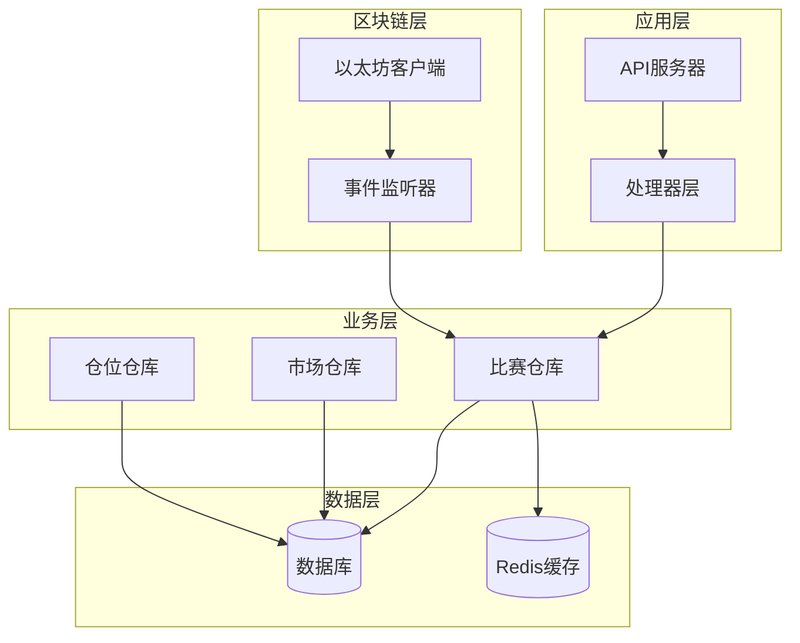

**图表来源**
- [main.go:1-100](file://cmd/api/main.go#L1-L100)
- [match.go:1-200](file://internal/repository/match.go#L1-L200)
- [db.go:1-150](file://internal/database/db.go#L1-L150)

**章节来源**
- [main.go:1-200](file://cmd/api/main.go#L1-L200)
- [match.go:1-300](file://internal/repository/match.go#L1-L300)

## 核心组件
MatchRepository是比赛数据的核心存储组件，提供完整的CRUD操作能力。该组件基于GORM框架实现，支持并发安全的数据访问和事务管理。

### 主要职责
- 比赛数据的创建、查询、更新和删除
- 比赛状态的生命周期管理
- 与区块链事件的实时同步
- 数据一致性和完整性保证

### 关键特性
- 基于PostgreSQL的高性能存储
- 支持复杂查询和关联操作
- 内置数据验证和业务规则检查
- 事务性操作确保数据一致性

**章节来源**
- [match.go:1-200](file://internal/repository/match.go#L1-L200)
- [db.go:1-150](file://internal/database/db.go#L1-L150)

## 架构概览
MatchRepository在整个系统架构中扮演着核心数据存储的角色，连接着API层、业务逻辑层和区块链事件监听器。

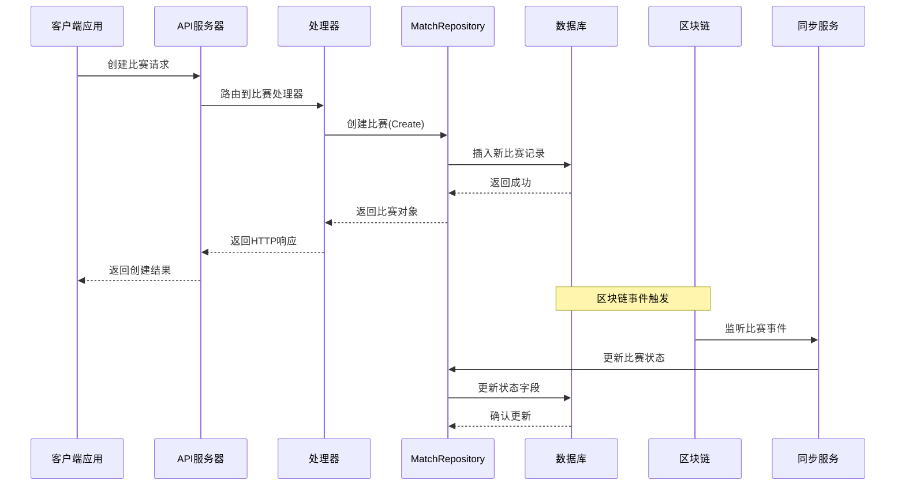

**图表来源**
- [matches.go:1-200](file://internal/handler/matches.go#L1-L200)
- [match.go:1-300](file://internal/repository/match.go#L1-L300)
- [indexer.go:1-150](file://internal/indexer/indexer.go#L1-L150)

## 详细组件分析

### 数据模型设计
比赛数据模型采用标准化的结构设计，确保数据的一致性和可扩展性。

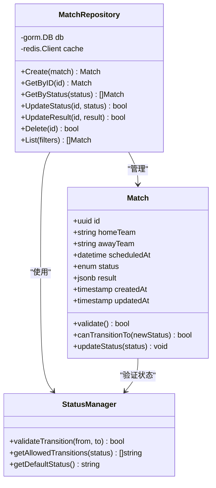

**图表来源**
- [models.go:1-200](file://internal/models/models.go#L1-L200)
- [match.go:1-250](file://internal/repository/match.go#L1-L250)

### 字段定义详解

#### 基本信息字段
- `id`: 唯一标识符，使用UUID格式确保全局唯一性
- `homeTeam`: 主队名称，支持国际化字符
- `awayTeam`: 客队名称，支持国际化字符
- `scheduledAt`: 预定比赛时间，UTC时区存储

#### 时间安排字段
- `createdAt`: 记录创建时间戳
- `updatedAt`: 记录最后修改时间戳

#### 状态管理字段
- `status`: 比赛当前状态，支持多种枚举值
- `result`: 比赛最终结果，JSON格式存储

#### 结果数据字段
- `homeScore`: 主队得分
- `awayScore`: 客队得分
- `winner`: 获胜方标识
- `extraTime`: 加时赛信息
- `penalty shootout`: 点球大战信息

**章节来源**
- [models.go:1-200](file://internal/models/models.go#L1-L200)
- [match.go:1-150](file://internal/repository/match.go#L1-L150)

### 状态管理机制

#### 状态转换图
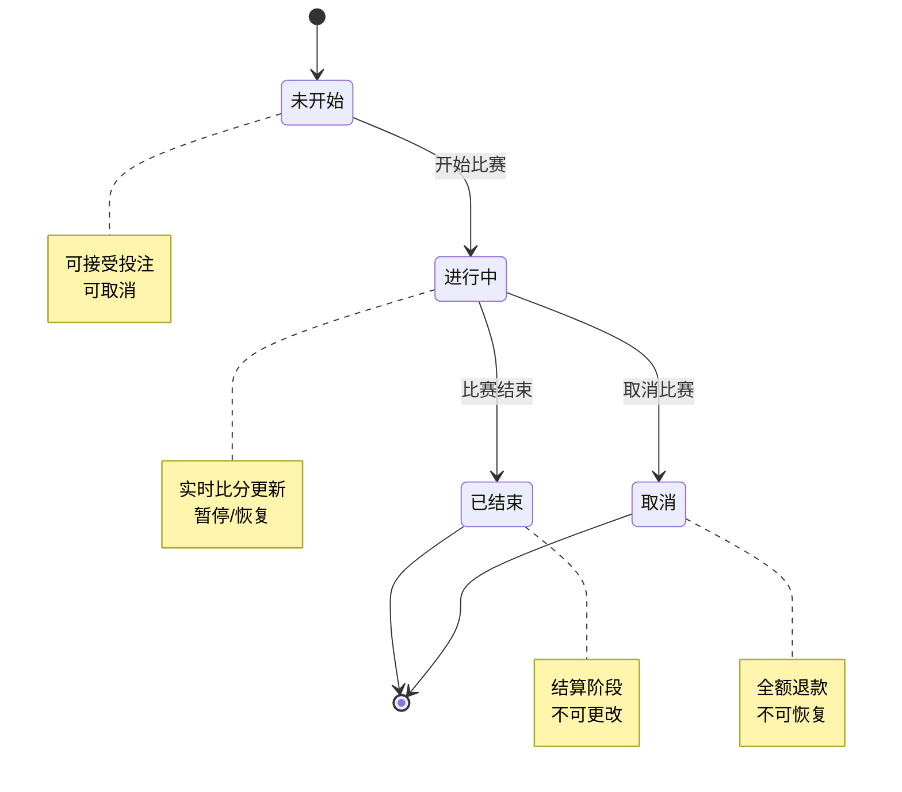

#### 状态转换规则
1. **未开始 → 进行中**: 必须满足时间条件和准备工作完成
2. **进行中 → 已结束**: 正常比赛时间结束且无加时
3. **进行中 → 取消**: 特殊情况下的官方决定
4. **已结束**: 最终状态，不可逆向转换

#### 状态验证逻辑
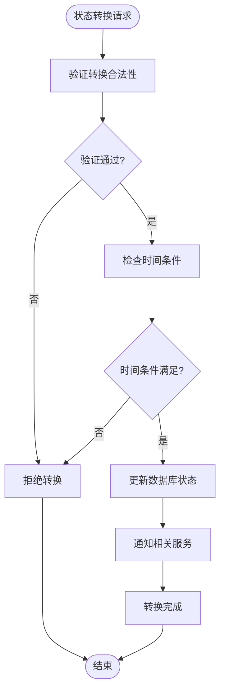

**图表来源**
- [match.go:150-300](file://internal/repository/match.go#L150-L300)
- [models.go:100-200](file://internal/models/models.go#L100-L200)

**章节来源**
- [match.go:100-300](file://internal/repository/match.go#L100-L300)
- [models.go:1-200](file://internal/models/models.go#L1-L200)

### CRUD操作实现

#### 创建比赛 (Create)
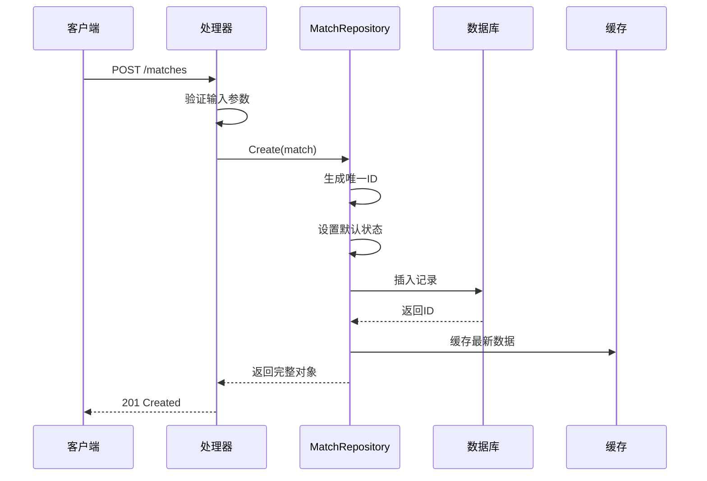

**图表来源**
- [matches.go:1-150](file://internal/handler/matches.go#L1-L150)
- [match.go:1-120](file://internal/repository/match.go#L1-L120)

#### 查询比赛 (Read)
支持多种查询方式：
- 按ID查询：精确匹配
- 按状态查询：批量筛选
- 按时间范围查询：日期过滤
- 分页查询：支持排序和限制

#### 更新状态 (Update)
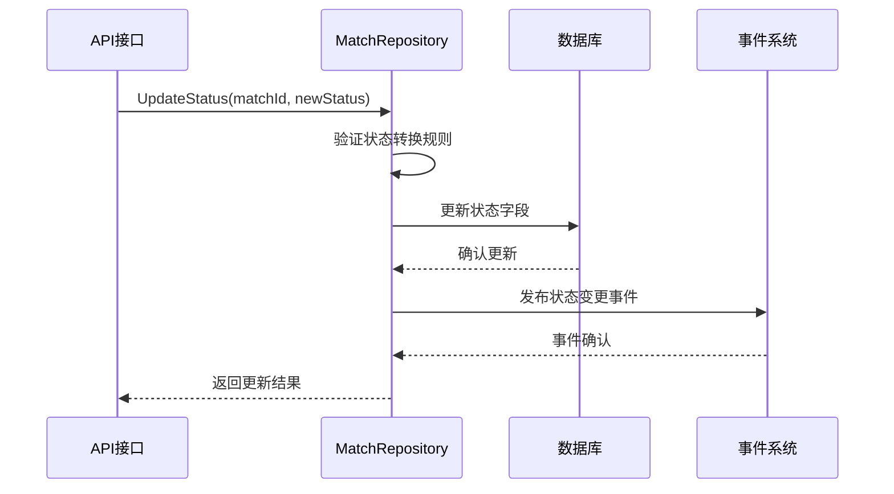

**图表来源**
- [match.go:120-250](file://internal/repository/match.go#L120-L250)
- [indexer.go:1-150](file://internal/indexer/indexer.go#L1-L150)

#### 记录结果 (Result)
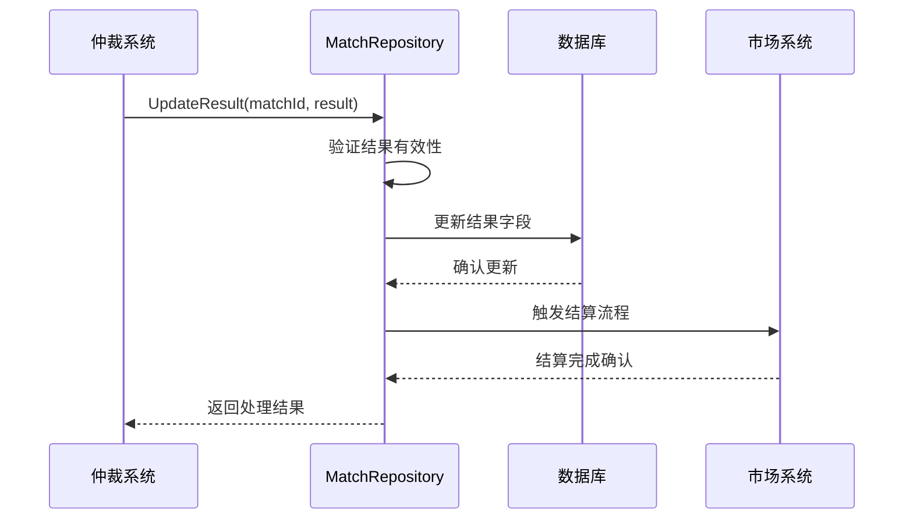

**图表来源**
- [match.go:200-300](file://internal/repository/match.go#L200-L300)
- [oracle_client.go:1-150](file://internal/blockchain/oracle_client.go#L1-L150)

**章节来源**
- [match.go:1-300](file://internal/repository/match.go#L1-L300)
- [matches.go:1-200](file://internal/handler/matches.go#L1-L200)

### 区块链事件同步机制

#### 事件监听架构
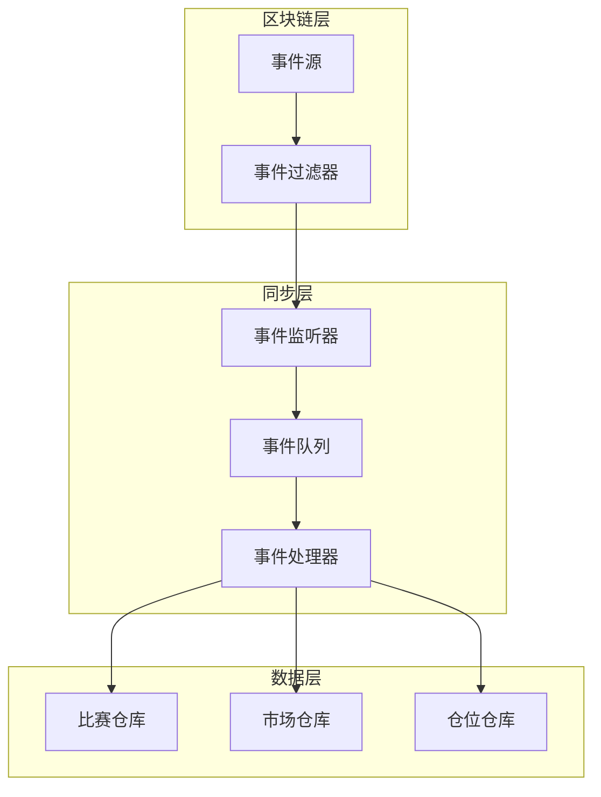

**图表来源**
- [indexer.go:1-200](file://internal/indexer/indexer.go#L1-L200)
- [client.go:1-200](file://internal/blockchain/client.go#L1-L200)

#### 数据一致性保证
1. **事务性处理**: 所有数据库操作在单个事务中执行
2. **幂等性设计**: 事件处理器支持重复处理而不产生副作用
3. **冲突检测**: 自动检测和解决并发更新冲突
4. **回滚机制**: 失败时自动回滚所有相关操作

#### 冲突处理策略
- **时间戳比较**: 使用服务器时间戳确定最新版本
- **版本号控制**: 维护数据版本号防止过期更新
- **乐观锁机制**: 使用CAS操作避免并发写入冲突
- **重试机制**: 自动重试失败的操作

**章节来源**
- [indexer.go:1-200](file://internal/indexer/indexer.go#L1-L200)
- [client.go:1-200](file://internal/blockchain/client.go#L1-L200)

### 业务规则和数据验证

#### 输入验证规则
1. **必填字段验证**: 确保所有必需字段都有有效值
2. **格式验证**: 验证数据格式符合预期
3. **范围验证**: 检查数值在合理范围内
4. **业务逻辑验证**: 验证符合业务规则

#### 状态转换验证
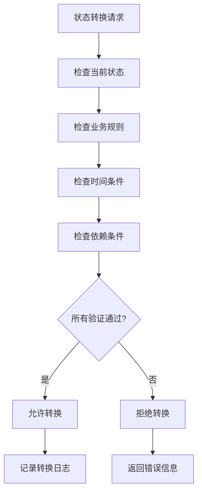

**图表来源**
- [match.go:100-200](file://internal/repository/match.go#L100-L200)
- [models.go:150-200](file://internal/models/models.go#L150-L200)

#### 数据完整性约束
- **外键约束**: 维护与其他表的引用完整性
- **唯一性约束**: 确保关键字段的唯一性
- **检查约束**: 验证数据值的有效性
- **触发器**: 自动维护审计字段

**章节来源**
- [match.go:1-200](file://internal/repository/match.go#L1-L200)
- [models.go:1-200](file://internal/models/models.go#L1-L200)

## 依赖关系分析

### 组件依赖图
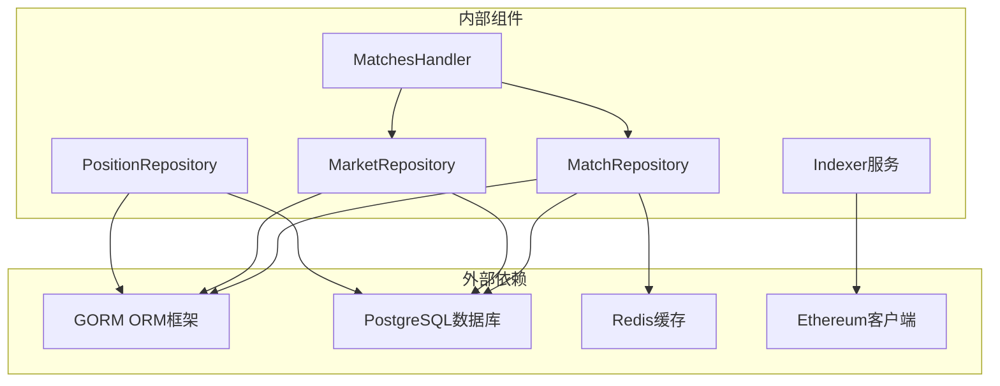

**图表来源**
- [match.go:1-100](file://internal/repository/match.go#L1-L100)
- [db.go:1-100](file://internal/database/db.go#L1-L100)
- [market.go:1-100](file://internal/repository/market.go#L1-L100)
- [position.go:1-100](file://internal/repository/position.go#L1-L100)

### 耦合度分析
- **低耦合设计**: 各组件职责明确，接口清晰
- **依赖注入**: 通过构造函数注入依赖，便于测试
- **接口抽象**: 使用接口隔离具体实现细节
- **配置管理**: 通过配置文件管理外部依赖

**章节来源**
- [match.go:1-150](file://internal/repository/match.go#L1-L150)
- [db.go:1-150](file://internal/database/db.go#L1-L150)

## 性能考虑
- **索引优化**: 为常用查询字段建立适当索引
- **连接池管理**: 合理配置数据库连接池大小
- **缓存策略**: 使用Redis缓存热点数据
- **批量操作**: 支持批量插入和更新操作
- **异步处理**: 事件处理采用异步模式提高吞吐量

## 故障排除指南

### 常见问题及解决方案
1. **数据库连接失败**: 检查连接字符串和网络配置
2. **状态转换异常**: 验证状态转换规则和业务逻辑
3. **事件同步延迟**: 检查事件监听器和处理队列
4. **数据不一致**: 实施事务管理和冲突检测机制

### 监控指标
- 数据库查询响应时间
- 事件处理延迟
- 并发操作成功率
- 缓存命中率

**章节来源**
- [match.go:1-100](file://internal/repository/match.go#L1-L100)
- [indexer.go:1-100](file://internal/indexer/indexer.go#L1-L100)

## 结论
MatchRepository作为PredictionDIDSimple项目的核心数据组件，提供了完整的比赛数据管理能力。通过合理的架构设计、严格的状态管理和可靠的同步机制，确保了系统的稳定性、可扩展性和数据一致性。该组件为整个预测市场的运行提供了坚实的数据基础，支持从比赛创建到结果结算的完整业务流程。