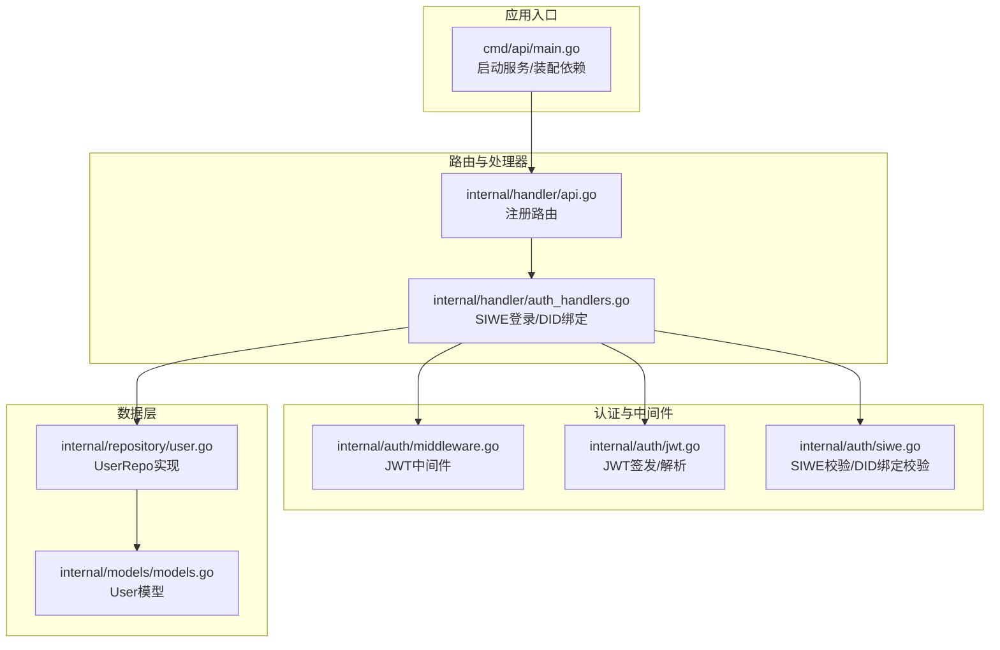
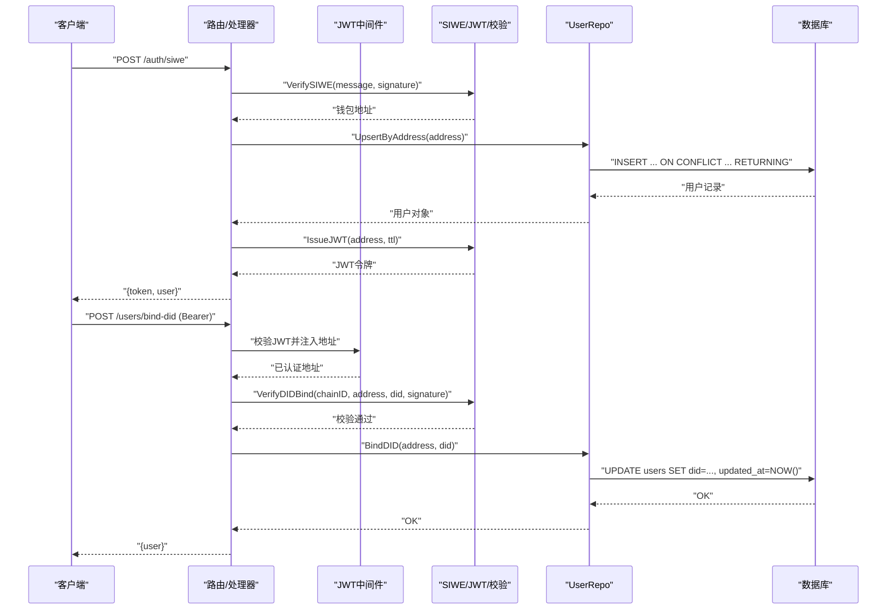
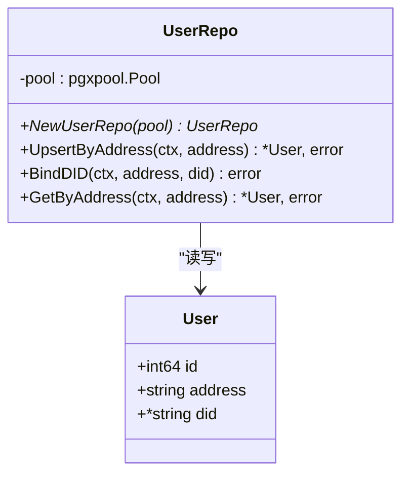
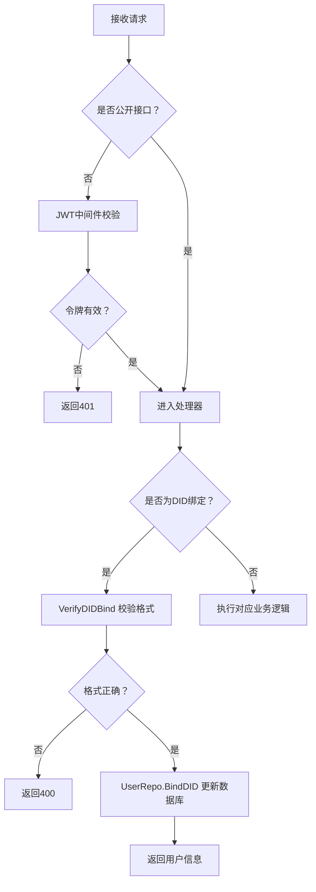
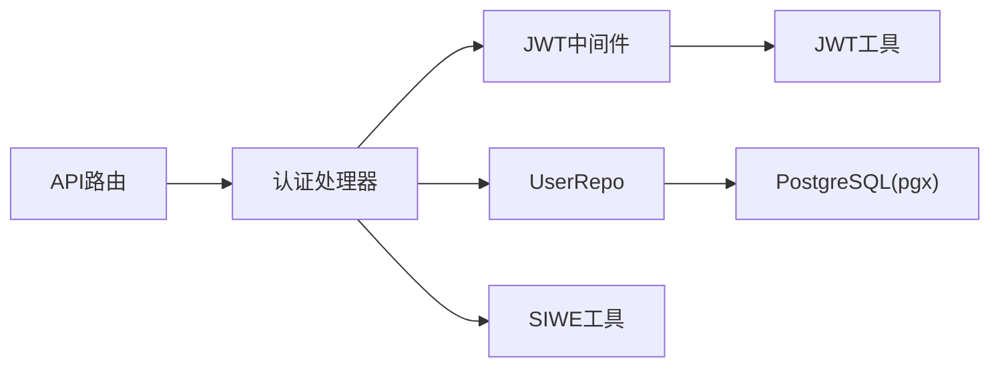

# 用户数据仓库

<cite>
**本文档引用的文件**
- [internal/repository/user.go](file://internal/repository/user.go)
- [internal/models/models.go](file://internal/models/models.go)
- [internal/handler/auth_handlers.go](file://internal/handler/auth_handlers.go)
- [internal/handler/api.go](file://internal/handler/api.go)
- [internal/auth/middleware.go](file://internal/auth/middleware.go)
- [internal/auth/jwt.go](file://internal/auth/jwt.go)
- [internal/auth/siwe.go](file://internal/auth/siwe.go)
- [cmd/api/main.go](file://cmd/api/main.go)
</cite>

## 目录
1. [简介](#简介)
2. [项目结构](#项目结构)
3. [核心组件](#核心组件)
4. [架构总览](#架构总览)
5. [详细组件分析](#详细组件分析)
6. [依赖分析](#依赖分析)
7. [性能考量](#性能考量)
8. [故障排查指南](#故障排查指南)
9. [结论](#结论)
10. [附录](#附录)

## 简介
本文件面向 PredictionDIDSimple 项目的 UserRepository，系统化阐述用户数据的 CRUD 实现与业务流程，覆盖用户注册、登录、信息查询、DID 绑定与验证、以及与认证中间件、路由层的集成方式。同时对用户数据模型字段、合规与安全注意事项进行说明，并给出基于现有代码的使用示例路径。

## 项目结构
围绕用户模块的关键文件组织如下：
- 数据模型：用户实体定义位于 models 层
- 仓储层：用户仓储封装数据库操作
- 认证与路由：处理器负责登录、DID 绑定等业务入口
- 中间件：JWT 校验与地址注入
- 服务入口：API 服务装配依赖并启动

图表来源
- [cmd/api/main.go:124-131](file://cmd/api/main.go#L124-L131)
- [internal/handler/api.go:33-69](file://internal/handler/api.go#L33-L69)
- [internal/handler/auth_handlers.go:19-84](file://internal/handler/auth_handlers.go#L19-L84)
- [internal/auth/middleware.go:17-43](file://internal/auth/middleware.go#L17-L43)
- [internal/auth/jwt.go:19-57](file://internal/auth/jwt.go#L19-L57)
- [internal/auth/siwe.go:20-74](file://internal/auth/siwe.go#L20-L74)
- [internal/models/models.go:57-62](file://internal/models/models.go#L57-L62)
- [internal/repository/user.go:13-71](file://internal/repository/user.go#L13-L71)

章节来源
- [cmd/api/main.go:124-131](file://cmd/api/main.go#L124-L131)
- [internal/handler/api.go:33-69](file://internal/handler/api.go#L33-L69)

## 核心组件
- 用户数据模型（User）
  - 字段：主键、钱包地址、DID（可空）
  - 用途：承载用户在系统中的身份与去中心化身份标识
- 用户仓储（UserRepo）
  - 方法：按地址创建或更新、按地址查询、绑定 DID
  - 数据库：PostgreSQL（pgx 连接池）

章节来源
- [internal/models/models.go:57-62](file://internal/models/models.go#L57-L62)
- [internal/repository/user.go:13-71](file://internal/repository/user.go#L13-L71)

## 架构总览
用户相关流程贯穿“路由 → 认证中间件 → 处理器 → 仓储 → 数据库”的链路。登录采用 SIWE，令牌采用 JWT；DID 绑定在 JWT 认证后进行，服务端主要做格式校验与落库。

图表来源
- [internal/handler/auth_handlers.go:19-84](file://internal/handler/auth_handlers.go#L19-L84)
- [internal/auth/middleware.go:17-43](file://internal/auth/middleware.go#L17-L43)
- [internal/auth/jwt.go:19-57](file://internal/auth/jwt.go#L19-L57)
- [internal/auth/siwe.go:20-74](file://internal/auth/siwe.go#L20-L74)
- [internal/repository/user.go:25-71](file://internal/repository/user.go#L25-L71)

## 详细组件分析

### 用户数据模型（User）
- 字段说明
  - id：主键
  - address：钱包地址（统一小写存储）
  - did：去中心化身份标识（可空）
- 设计要点
  - address 作为唯一键，支持大小写不敏感比较
  - did 支持为空，体现 DID 绑定的可选性

章节来源
- [internal/models/models.go:57-62](file://internal/models/models.go#L57-L62)

### 用户仓储（UserRepo）
- UpsertByAddress
  - 功能：按钱包地址创建或更新用户，若存在则刷新 updated_at
  - SQL 行为：INSERT … ON CONFLICT (address) DO UPDATE
  - 返回：用户对象（含 id、address、did）
- BindDID
  - 功能：为用户绑定 DID
  - SQL 行为：UPDATE users SET did=…, updated_at=NOW() WHERE LOWER(address)=LOWER(…)
- GetByAddress
  - 功能：按钱包地址查询用户
  - SQL 行为：SELECT id,address,did WHERE LOWER(address)=LOWER(…)
  - 返回：用户对象

图表来源
- [internal/repository/user.go:13-71](file://internal/repository/user.go#L13-L71)
- [internal/models/models.go:57-62](file://internal/models/models.go#L57-L62)

章节来源
- [internal/repository/user.go:13-71](file://internal/repository/user.go#L13-L71)

### 认证与路由集成
- 路由注册
  - 公开接口：/auth/siwe、/auth/verify-vc 等
  - 需 JWT 授权：/users/bind-did、/me/positions、/users/me/credentials
- JWT 中间件
  - 从 Authorization: Bearer 提取令牌并解析
  - 成功后将地址注入 context，供后续处理器使用
- SIWE 登录
  - 校验消息域、URI、过期时间与签名
  - 成功后创建/更新用户并签发 JWT
- DID 绑定
  - 依赖 JWT 认证的地址
  - 校验 did 格式是否为 did:pkh:eip155:{chain}:{address}
  - 绑定成功后更新数据库并返回最新用户

图表来源
- [internal/handler/api.go:33-69](file://internal/handler/api.go#L33-L69)
- [internal/auth/middleware.go:17-43](file://internal/auth/middleware.go#L17-L43)
- [internal/auth/siwe.go:20-74](file://internal/auth/siwe.go#L20-L74)
- [internal/handler/auth_handlers.go:19-84](file://internal/handler/auth_handlers.go#L19-L84)

章节来源
- [internal/handler/api.go:33-69](file://internal/handler/api.go#L33-L69)
- [internal/auth/middleware.go:17-43](file://internal/auth/middleware.go#L17-L43)
- [internal/auth/siwe.go:20-74](file://internal/auth/siwe.go#L20-L74)
- [internal/handler/auth_handlers.go:19-84](file://internal/handler/auth_handlers.go#L19-L84)

### 用户注册与登录流程
- 注册/登录
  - 客户端发送 SIWE 消息与签名
  - 服务端校验消息域、URI、过期时间与签名
  - 通过后调用 UpsertByAddress，若不存在则插入，否则更新时间戳
  - 颁发 JWT 返回给客户端
- 示例（代码路径）
  - SIWE 登录处理器：[internal/handler/auth_handlers.go:19-53](file://internal/handler/auth_handlers.go#L19-L53)
  - 路由注册：[internal/handler/api.go:48-58](file://internal/handler/api.go#L48-L58)
  - JWT 颁发：[internal/auth/jwt.go:19-34](file://internal/auth/jwt.go#L19-L34)
  - UpsertByAddress 实现：[internal/repository/user.go:25-43](file://internal/repository/user.go#L25-L43)

章节来源
- [internal/handler/auth_handlers.go:19-53](file://internal/handler/auth_handlers.go#L19-L53)
- [internal/auth/jwt.go:19-34](file://internal/auth/jwt.go#L19-L34)
- [internal/repository/user.go:25-43](file://internal/repository/user.go#L25-L43)

### 用户信息查询
- 按地址查询用户
  - 路由：GET /users/me（结合 JWT 中间件）
  - 处理器：从 context 取地址，调用 GetByAddress
  - 示例（代码路径）
    - 路由注册：[internal/handler/api.go:52-58](file://internal/handler/api.go#L52-L58)
    - 处理器：[internal/handler/auth_handlers.go:86-97](file://internal/handler/auth_handlers.go#L86-L97)
    - GetByAddress 实现：[internal/repository/user.go:57-70](file://internal/repository/user.go#L57-L70)

章节来源
- [internal/handler/api.go:52-58](file://internal/handler/api.go#L52-L58)
- [internal/handler/auth_handlers.go:86-97](file://internal/handler/auth_handlers.go#L86-L97)
- [internal/repository/user.go:57-70](file://internal/repository/user.go#L57-L70)

### DID 绑定与验证机制
- 绑定流程
  - 客户端发起绑定请求，携带 DID 与签名
  - 服务端校验：DID 格式必须为 did:pkh:eip155:{chain}:{address}（大小写不敏感）
  - 通过后调用 BindDID 更新数据库
- 示例（代码路径）
  - 绑定处理器：[internal/handler/auth_handlers.go:61-84](file://internal/handler/auth_handlers.go#L61-L84)
  - VerifyDIDBind 校验：[internal/auth/siwe.go:62-74](file://internal/auth/siwe.go#L62-L74)
  - BindDID 实现：[internal/repository/user.go:45-55](file://internal/repository/user.go#L45-L55)

章节来源
- [internal/handler/auth_handlers.go:61-84](file://internal/handler/auth_handlers.go#L61-L84)
- [internal/auth/siwe.go:62-74](file://internal/auth/siwe.go#L62-L74)
- [internal/repository/user.go:45-55](file://internal/repository/user.go#L45-L55)

### 用户状态管理与合规检查
- 用户状态
  - 用户实体未包含显式的“状态”字段；当前通过 DID 是否为空表达“是否完成 DID 绑定”
- 合规检查
  - 提供合规受限查询接口，依据请求头中的国家代码判断是否受限
  - 示例（代码路径）
    - 合规接口：[internal/handler/compliance.go:9-29](file://internal/handler/compliance.go#L9-L29)
  - 注意：本项目未提供针对用户级别的合规状态字段或自动拦截逻辑，合规策略由路由层与上游中间件共同决定

章节来源
- [internal/handler/compliance.go:9-29](file://internal/handler/compliance.go#L9-L29)

## 依赖分析
- 组件耦合
  - 处理器依赖认证工具与用户仓储
  - 用户仓储依赖数据库连接池
  - 路由层通过依赖注入装配处理器所需组件
- 外部依赖
  - JWT 库、SIWE 库、PostgreSQL 连接池

图表来源
- [internal/handler/api.go:18-31](file://internal/handler/api.go#L18-L31)
- [internal/handler/auth_handlers.go:19-84](file://internal/handler/auth_handlers.go#L19-L84)
- [internal/auth/middleware.go:17-43](file://internal/auth/middleware.go#L17-L43)
- [internal/auth/jwt.go:19-57](file://internal/auth/jwt.go#L19-L57)
- [internal/auth/siwe.go:20-74](file://internal/auth/siwe.go#L20-L74)
- [internal/repository/user.go:13-16](file://internal/repository/user.go#L13-L16)

章节来源
- [internal/handler/api.go:18-31](file://internal/handler/api.go#L18-L31)
- [internal/repository/user.go:13-16](file://internal/repository/user.go#L13-L16)

## 性能考量
- 连接池与并发
  - 使用 pgxpool 连接池，建议合理设置最大连接数与超时
- SQL 优化
  - address 字段建议建立唯一索引以支持 Upsert 与查询
  - 查询与更新均基于 address，建议保持大小写一致（小写）以避免重复数据
- JWT 与 SIWE
  - JWT 解析为 O(1)，SIWE 校验依赖外部库，注意超时与资源释放

## 故障排查指南
- 401 未授权
  - 检查 Authorization 头是否为 Bearer 令牌
  - 校验 JWT 密钥与签名算法
  - 参考：[internal/auth/middleware.go:17-43](file://internal/auth/middleware.go#L17-L43)、[internal/auth/jwt.go:36-57](file://internal/auth/jwt.go#L36-L57)
- SIWE 校验失败
  - 域名、URI、过期时间不匹配或签名无效
  - 参考：[internal/auth/siwe.go:20-60](file://internal/auth/siwe.go#L20-L60)
- DID 绑定失败
  - DID 格式不符合 did:pkh:eip155:{chain}:{address}
  - 参考：[internal/auth/siwe.go:62-74](file://internal/auth/siwe.go#L62-L74)
- 数据库错误
  - Upsert/Bind/Query 失败通常由约束冲突或连接异常引起
  - 参考：[internal/repository/user.go:25-71](file://internal/repository/user.go#L25-L71)

章节来源
- [internal/auth/middleware.go:17-43](file://internal/auth/middleware.go#L17-L43)
- [internal/auth/jwt.go:36-57](file://internal/auth/jwt.go#L36-L57)
- [internal/auth/siwe.go:20-74](file://internal/auth/siwe.go#L20-L74)
- [internal/repository/user.go:25-71](file://internal/repository/user.go#L25-L71)

## 结论
UserRepository 提供了最小而完备的用户数据持久化能力：按地址创建/更新、查询与绑定 DID。配合 SIWE 登录与 JWT 中间件，形成完整的用户身份认证与 DID 绑定闭环。当前模型未内置用户状态字段，合规策略由路由层与上游中间件共同实现。建议在生产环境中完善索引、错误日志与限流策略，并持续评估 DID 绑定的签名验证强度。

## 附录

### 使用示例（代码路径）
- SIWE 登录
  - 路由：POST /auth/siwe
  - 处理器：[internal/handler/auth_handlers.go:19-53](file://internal/handler/auth_handlers.go#L19-L53)
  - JWT 颁发：[internal/auth/jwt.go:19-34](file://internal/auth/jwt.go#L19-L34)
- 查询用户信息
  - 路由：GET /me/positions（示例，实际为受保护接口）
  - 处理器：[internal/handler/auth_handlers.go:86-97](file://internal/handler/auth_handlers.go#L86-L97)
  - 查询实现：[internal/repository/user.go:57-70](file://internal/repository/user.go#L57-L70)
- 绑定 DID
  - 路由：POST /users/bind-did（需 JWT）
  - 处理器：[internal/handler/auth_handlers.go:61-84](file://internal/handler/auth_handlers.go#L61-L84)
  - 校验与绑定：[internal/auth/siwe.go:62-74](file://internal/auth/siwe.go#L62-L74)、[internal/repository/user.go:45-55](file://internal/repository/user.go#L45-L55)

章节来源
- [internal/handler/auth_handlers.go:19-97](file://internal/handler/auth_handlers.go#L19-L97)
- [internal/auth/jwt.go:19-34](file://internal/auth/jwt.go#L19-L34)
- [internal/auth/siwe.go:62-74](file://internal/auth/siwe.go#L62-L74)
- [internal/repository/user.go:45-70](file://internal/repository/user.go#L45-L70)