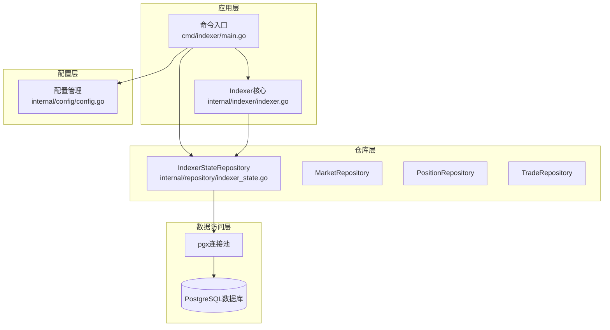
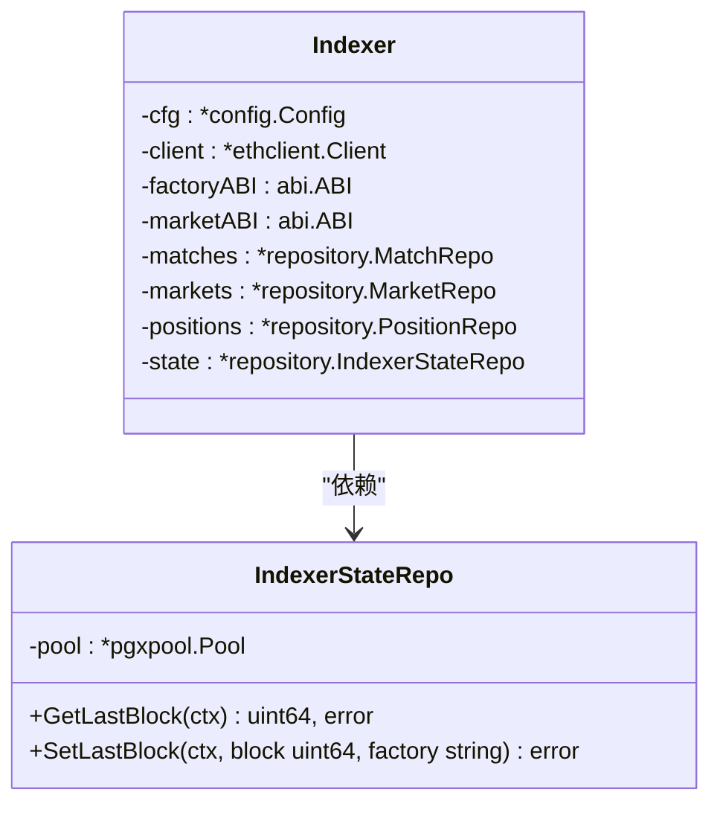
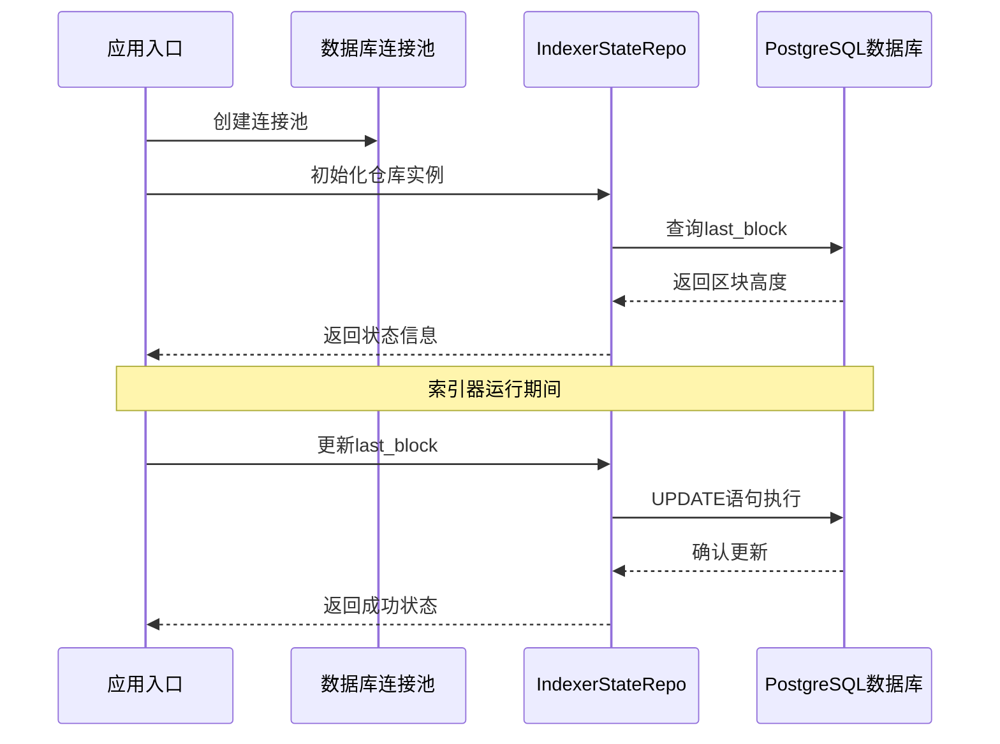
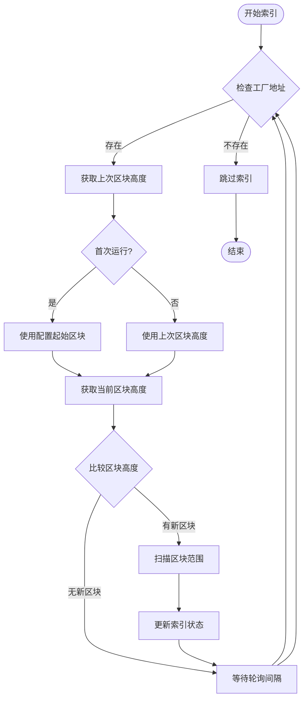
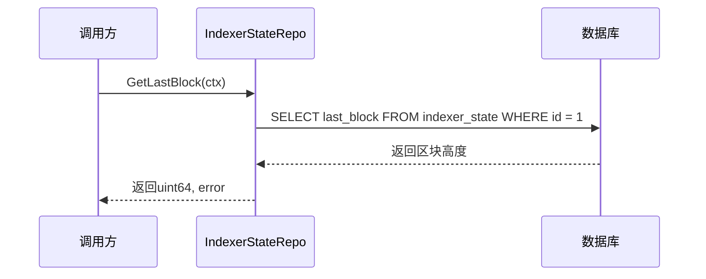
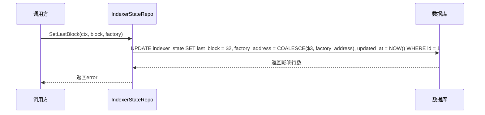
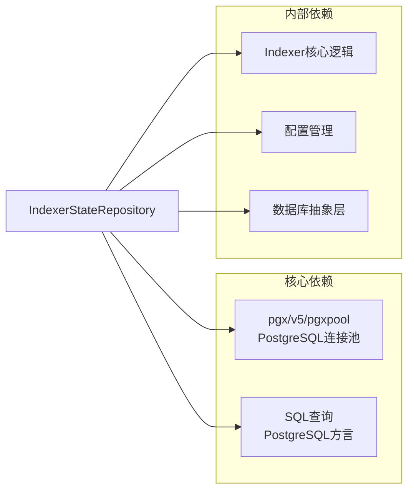
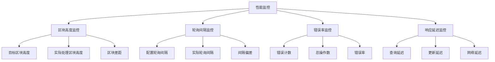
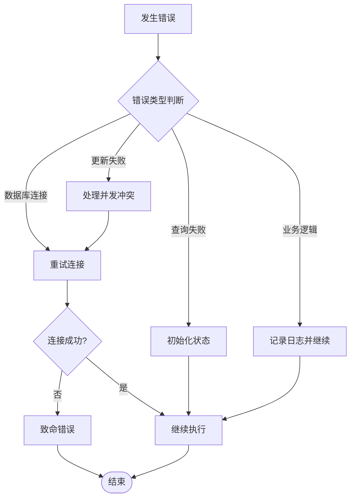

# 索引器状态仓库

<cite>
**本文档中引用的文件**
- [indexer_state.go](file://internal/repository/indexer_state.go)
- [indexer.go](file://internal/indexer/indexer.go)
- [main.go](file://cmd/indexer/main.go)
- [models.go](file://internal/models/models.go)
- [config.go](file://internal/config/config.go)
- [db.go](file://internal/database/db.go)
- [000002_phase1.up.sql](file://migrations/000002_phase1.up.sql)
</cite>

## 目录
1. [简介](#简介)
2. [项目结构](#项目结构)
3. [核心组件](#核心组件)
4. [架构概览](#架构概览)
5. [详细组件分析](#详细组件分析)
6. [依赖关系分析](#依赖关系分析)
7. [性能考虑](#性能考虑)
8. [故障排除指南](#故障排除指南)
9. [结论](#结论)

## 简介

IndexerStateRepository是PredictionDIDSimple项目中的关键组件，负责管理区块链索引器的状态持久化。该仓库实现了索引器状态的完整生命周期管理，包括区块高度跟踪、事件处理进度记录、索引状态维护等功能。通过将索引器的运行状态存储在PostgreSQL数据库中，确保了系统的可靠性和断点续传能力。

该组件采用单例模式设计，使用PostgreSQL的CHECK约束确保表中只存在一条记录，从而简化了状态管理逻辑。IndexerStateRepository与Indexer核心功能紧密集成，为整个区块链事件索引系统提供了稳定的状态基础。

## 项目结构

IndexerStateRepository位于内部仓库层，与索引器核心逻辑和数据库层形成清晰的分层架构：

**图表来源**
- [main.go:18-51](file://cmd/indexer/main.go#L18-L51)
- [indexer.go:38-65](file://internal/indexer/indexer.go#L38-L65)
- [indexer_state.go:11-19](file://internal/repository/indexer_state.go#L11-L19)

**章节来源**
- [indexer_state.go:1-36](file://internal/repository/indexer_state.go#L1-L36)
- [main.go:17-51](file://cmd/indexer/main.go#L17-L51)

## 核心组件

### IndexerStateRepo结构体

IndexerStateRepo是索引器状态管理的核心数据结构，采用简洁的设计模式：

**图表来源**
- [indexer_state.go:11-19](file://internal/repository/indexer_state.go#L11-L19)
- [indexer.go:26-36](file://internal/indexer/indexer.go#L26-L36)

### 数据模型定义

索引器状态数据模型基于PostgreSQL表结构设计，确保数据一致性和完整性：

| 字段名 | 类型 | 约束 | 描述 | 默认值 |
|--------|------|------|------|--------|
| id | INTEGER | PRIMARY KEY, CHECK(id=1) | 单例记录标识符 | 1 |
| last_block | BIGINT | NOT NULL | 最后处理的区块高度 | 0 |
| factory_address | TEXT | NULLABLE | 工厂合约地址 | NULL |
| updated_at | TIMESTAMPTZ | NOT NULL, DEFAULT NOW() | 最后更新时间 | NOW() |

**章节来源**
- [000002_phase1.up.sql:67-72](file://migrations/000002_phase1.up.sql#L67-L72)
- [indexer_state.go:21-35](file://internal/repository/indexer_state.go#L21-L35)

## 架构概览

IndexerStateRepository在整个系统架构中扮演着关键的协调角色，连接着索引器核心逻辑与持久化存储：

**图表来源**
- [main.go:28-42](file://cmd/indexer/main.go#L28-L42)
- [indexer_state.go:22-34](file://internal/repository/indexer_state.go#L22-L34)

### 状态管理流程

索引器状态管理遵循严格的事务性流程，确保数据一致性：

**图表来源**
- [indexer.go:122-160](file://internal/indexer/indexer.go#L122-L160)

**章节来源**
- [indexer.go:97-120](file://internal/indexer/indexer.go#L97-L120)
- [indexer.go:122-160](file://internal/indexer/indexer.go#L122-L160)

## 详细组件分析

### 状态获取机制

GetLastBlock方法实现了索引器状态的读取逻辑，采用单点查询确保状态的一致性：

**图表来源**
- [indexer_state.go:21-26](file://internal/repository/indexer_state.go#L21-L26)

### 状态更新机制

SetLastBlock方法提供了原子性的状态更新能力，支持工厂地址的动态更新：

**图表来源**
- [indexer_state.go:28-35](file://internal/repository/indexer_state.go#L28-L35)

### 错误处理策略

IndexerStateRepository采用了稳健的错误处理机制：

1. **数据库连接错误**：通过pgxpool的内置错误处理返回具体错误信息
2. **查询失败**：当状态记录不存在时返回相应错误
3. **事务回滚**：数据库层面的自动回滚保证数据一致性

**章节来源**
- [indexer_state.go:21-35](file://internal/repository/indexer_state.go#L21-L35)

### 性能优化特性

系统在设计上考虑了多种性能优化：

1. **连接池复用**：通过pgxpool实现连接复用，减少连接开销
2. **单点查询**：使用单一查询获取状态，避免多次往返
3. **原子更新**：单条UPDATE语句完成状态更新，减少锁竞争

## 依赖关系分析

### 外部依赖

IndexerStateRepository主要依赖以下外部组件：

**图表来源**
- [indexer_state.go:5-9](file://internal/repository/indexer_state.go#L5-L9)
- [db.go:16-24](file://internal/database/db.go#L16-L24)

### 内部耦合度

IndexerStateRepository与Indexer核心逻辑存在直接耦合：

| 组件 | 耦合类型 | 作用 |
|------|----------|------|
| Indexer | 强耦合 | 直接调用状态管理方法 |
| 配置管理 | 弱耦合 | 读取工厂地址信息 |
| 数据库层 | 弱耦合 | 通过连接池访问 |

**章节来源**
- [indexer.go:38-65](file://internal/indexer/indexer.go#L38-L65)
- [indexer_state.go:16-19](file://internal/repository/indexer_state.go#L16-L19)

## 性能考虑

### 数据库性能优化

1. **索引设计**：虽然状态表较小，但通过PRIMARY KEY和CHECK约束确保查询效率
2. **连接池优化**：使用pgxpool实现连接复用，减少连接建立开销
3. **查询优化**：单字段查询避免不必要的列读取

### 索引器性能监控

系统提供了多维度的性能监控能力：

**图表来源**
- [config.go:66](file://internal/config/config.go#L66)
- [indexer.go:106](file://internal/indexer/indexer.go#L106)

### 优化建议

1. **批量操作**：考虑实现批量状态更新以减少数据库交互
2. **缓存策略**：在高并发场景下考虑引入内存缓存
3. **监控指标**：增加更详细的性能指标收集

## 故障排除指南

### 常见问题及解决方案

| 问题类型 | 症状 | 可能原因 | 解决方案 |
|----------|------|----------|----------|
| 数据库连接失败 | 初始化时报错 | 连接字符串错误或数据库不可达 | 检查DATABASE_URL配置 |
| 状态查询失败 | GetLastBlock返回错误 | 表不存在或权限不足 | 执行数据库迁移 |
| 状态更新失败 | SetLastBlock返回错误 | 并发更新冲突 | 实现重试机制 |
| 区块高度异常 | 返回0或负值 | 初始状态未正确设置 | 检查初始化脚本 |

### 错误处理流程

**图表来源**
- [indexer.go:111](file://internal/indexer/indexer.go#L111)
- [indexer_state.go:22](file://internal/repository/indexer_state.go#L22)

### 调试技巧

1. **日志记录**：启用详细的日志输出以便追踪问题
2. **状态检查**：定期检查数据库中的状态记录
3. **性能监控**：监控数据库查询性能和连接池状态

**章节来源**
- [indexer.go:111-113](file://internal/indexer/indexer.go#L111-L113)
- [indexer_state.go:22-25](file://internal/repository/indexer_state.go#L22-L25)

## 结论

IndexerStateRepository作为PredictionDIDSimple项目的核心组件，成功实现了区块链索引器状态的可靠管理。通过简洁而强大的设计，该组件为整个系统的稳定性提供了坚实基础。

### 主要优势

1. **简单可靠**：单表单记录设计简化了状态管理逻辑
2. **性能优异**：连接池复用和原子操作确保高效运行
3. **易于维护**：清晰的接口设计便于后续扩展
4. **容错性强**：完善的错误处理机制保证系统稳定性

### 未来改进方向

1. **监控增强**：增加更详细的性能指标和告警机制
2. **扩展性提升**：支持多工厂地址的并行索引
3. **自动化运维**：实现状态自动恢复和健康检查
4. **测试覆盖**：增加单元测试和集成测试覆盖率

该组件为PredictionDIDSimple项目提供了可靠的索引器状态管理能力，是构建去中心化预测市场基础设施的重要基石。