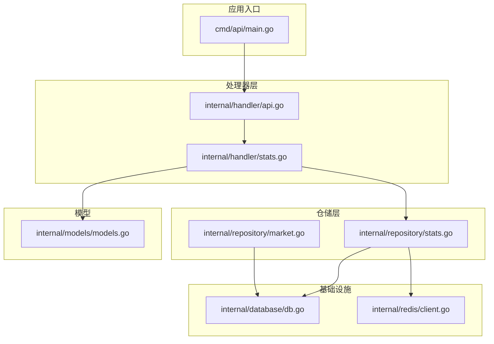
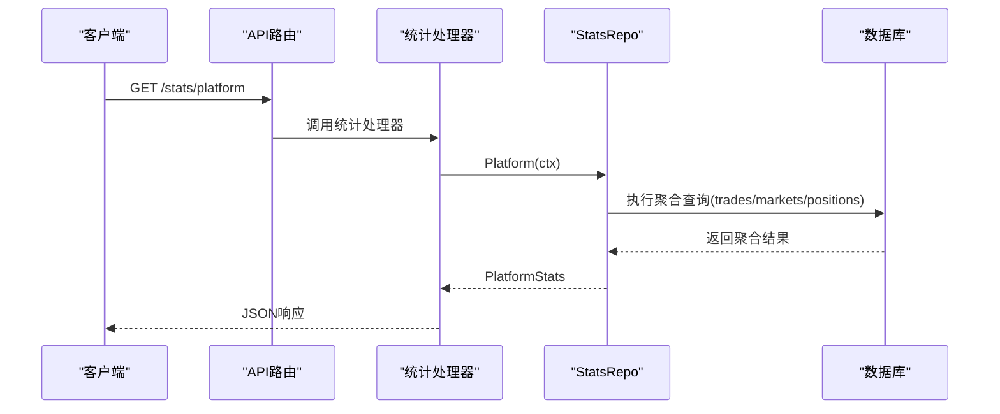
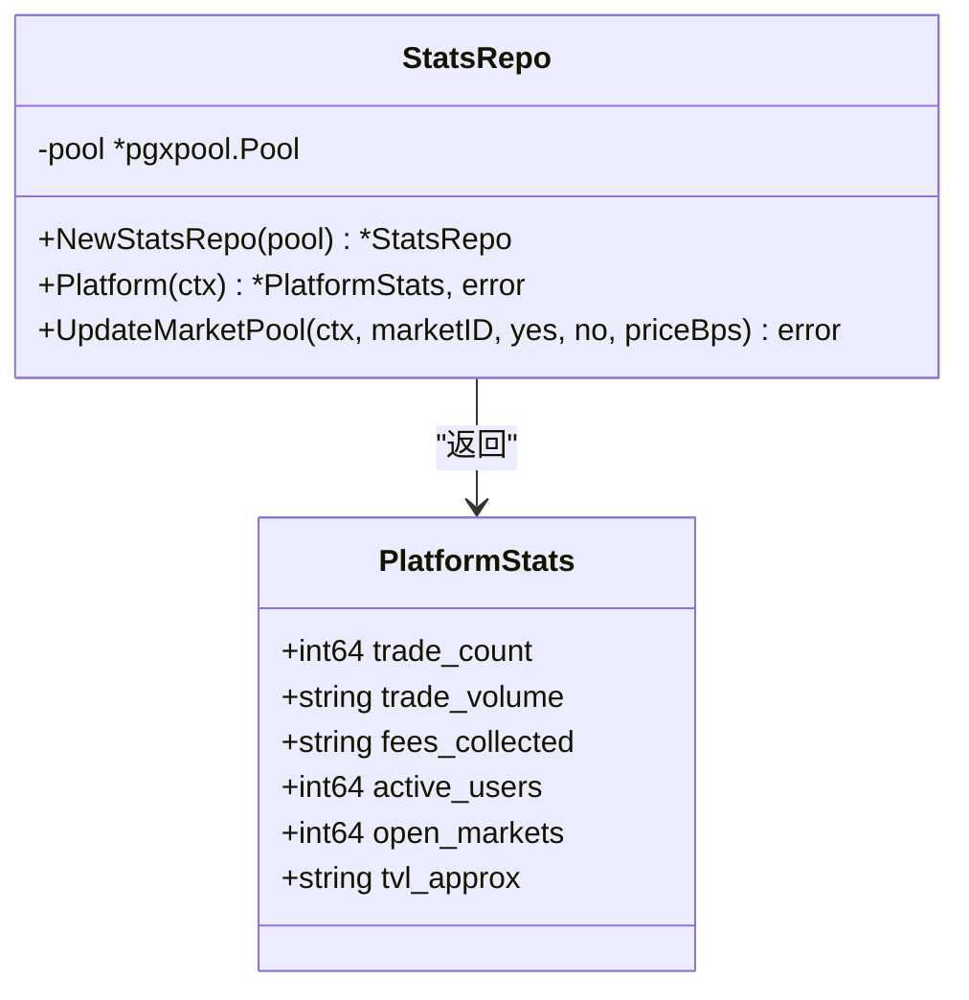
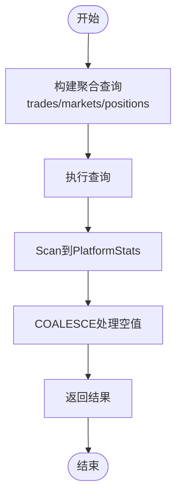
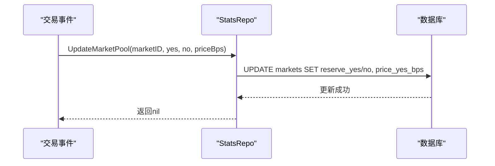
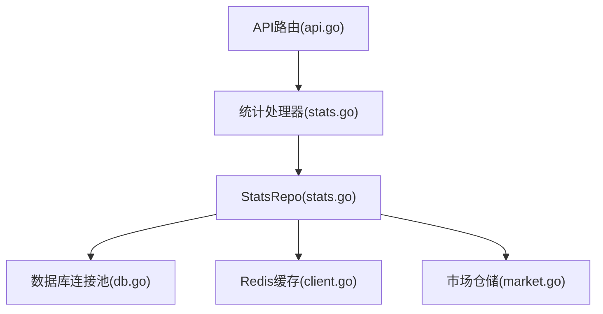

# 统计数据仓库

<cite>
**本文引用的文件**
- [stats.go](file://internal/repository/stats.go)
- [stats.go](file://internal/handler/stats.go)
- [api.go](file://internal/handler/api.go)
- [db.go](file://internal/database/db.go)
- [client.go](file://internal/redis/client.go)
- [market.go](file://internal/repository/market.go)
- [models.go](file://internal/models/models.go)
- [main.go](file://cmd/api/main.go)
</cite>

## 目录
1. [简介](#简介)
2. [项目结构](#项目结构)
3. [核心组件](#核心组件)
4. [架构概览](#架构概览)
5. [详细组件分析](#详细组件分析)
6. [依赖关系分析](#依赖关系分析)
7. [性能考虑](#性能考虑)
8. [故障排除指南](#故障排除指南)
9. [结论](#结论)
10. [附录](#附录)

## 简介
本文件面向PredictionDIDSimple项目的StatsRepository，系统性阐述平台统计数据的采集、计算与存储机制。内容覆盖用户统计、市场统计、交易统计等关键指标的生成流程；解释统计数据模型字段定义、统计计算逻辑（实时、定时、滚动窗口）；给出使用示例路径与最佳实践，并讨论缓存策略与性能优化，以及统计报表与数据导出的实现思路。

## 项目结构
与统计仓库直接相关的模块分布如下：
- 仓储层：internal/repository/stats.go 定义StatsRepo及平台统计模型
- 处理器层：internal/handler/stats.go 提供统计相关HTTP接口
- 路由层：internal/handler/api.go 注册统计相关路由
- 数据访问：internal/database/db.go 提供数据库连接池
- 缓存：internal/redis/client.go 提供Redis客户端
- 市场仓储：internal/repository/market.go 提供市场资金池更新能力
- 模型定义：internal/models/models.go 定义业务模型
- 应用入口：cmd/api/main.go 启动API服务

**图表来源**
- [stats.go:1-68](file://internal/repository/stats.go#L1-L68)
- [stats.go:1-200](file://internal/handler/stats.go#L1-L200)
- [api.go:1-120](file://internal/handler/api.go#L1-L120)
- [db.go:1-120](file://internal/database/db.go#L1-L120)
- [client.go:1-120](file://internal/redis/client.go#L1-L120)
- [market.go:1-220](file://internal/repository/market.go#L1-L220)
- [models.go:1-200](file://internal/models/models.go#L1-L200)
- [main.go:1-120](file://cmd/api/main.go#L1-L120)

**章节来源**
- [stats.go:1-68](file://internal/repository/stats.go#L1-L68)
- [stats.go:1-200](file://internal/handler/stats.go#L1-L200)
- [api.go:1-120](file://internal/handler/api.go#L1-L120)
- [db.go:1-120](file://internal/database/db.go#L1-L120)
- [client.go:1-120](file://internal/redis/client.go#L1-L120)
- [market.go:1-220](file://internal/repository/market.go#L1-L220)
- [models.go:1-200](file://internal/models/models.go#L1-L200)
- [main.go:1-120](file://cmd/api/main.go#L1-L120)

## 核心组件
- StatsRepo：封装平台统计的数据库操作，提供Platform查询与市场资金池更新能力
- PlatformStats：平台级统计数据模型，包含交易次数、交易额、手续费、活跃用户、开放市场、TVL等字段
- 统计处理器：在handler层暴露统计接口，协调仓储与响应格式化
- 资金池更新：通过UpdateMarketPool更新市场资金池与价格，支撑TVL与市场深度统计

关键职责与边界：
- 仓储层负责SQL聚合与数据持久化
- 处理器层负责HTTP协议与参数校验
- 基础设施层提供数据库与缓存支持

**章节来源**
- [stats.go:11-68](file://internal/repository/stats.go#L11-L68)
- [stats.go:1-200](file://internal/handler/stats.go#L1-L200)

## 架构概览
统计系统的典型调用链路如下：

**图表来源**
- [api.go:1-120](file://internal/handler/api.go#L1-L120)
- [stats.go:1-200](file://internal/handler/stats.go#L1-L200)
- [stats.go:34-53](file://internal/repository/stats.go#L34-L53)

## 详细组件分析

### StatsRepo与PlatformStats模型
- PlatformStats字段
  - trade_count：总交易次数（整数）
  - trade_volume：总交易额（字符串，避免浮点精度问题）
  - fees_collected：已收取手续费总额（字符串，按0.3%估算）
  - active_users：活跃用户数（基于positions表去重统计）
  - open_markets：当前状态为OPEN的市场数量
  - tvl_approx：总锁仓量（各市场yes_pool+no_pool之和）

- StatsRepo方法
  - Platform(ctx)：一次性聚合多指标，减少多次往返
  - UpdateMarketPool(ctx, marketID, yes, no, priceBps)：更新市场资金池与价格

**图表来源**
- [stats.go:11-68](file://internal/repository/stats.go#L11-L68)

**章节来源**
- [stats.go:11-68](file://internal/repository/stats.go#L11-L68)

### 统计计算逻辑
- 实时统计
  - 通过单次聚合查询一次性获取多指标，避免多次数据库往返
  - 使用COALESCE处理空值，确保返回稳定格式
  - 使用COUNT(DISTINCT user_address)从positions表统计活跃用户

- 定时统计
  - 可在定时任务中复用Platform方法，定期写入缓存或汇总表
  - 建议结合Redis设置TTL，实现高频读取的缓存加速

- 滚动窗口统计
  - 可扩展：在trades表增加时间戳列后，可在Platform查询中加入时间范围过滤
  - 对于资金池与价格，可记录历史快照表以支持回溯分析

**图表来源**
- [stats.go:34-53](file://internal/repository/stats.go#L34-L53)

**章节来源**
- [stats.go:34-53](file://internal/repository/stats.go#L34-L53)

### 市场资金池更新与TVL支撑
- UpdateMarketPool用于在交易发生后或结算时更新市场资金池与价格
- TVL来源于各市场的yes_pool与no_pool之和，通过Platform查询汇总
- 建议在交易事件处理流程中调用此方法，保证TVL与资金池一致性

**图表来源**
- [stats.go:55-68](file://internal/repository/stats.go#L55-L68)

**章节来源**
- [stats.go:55-68](file://internal/repository/stats.go#L55-L68)
- [market.go:180-220](file://internal/repository/market.go#L180-L220)

### 统计接口与使用示例
- 路由注册：在API路由中注册统计相关端点
- 处理器实现：在统计处理器中调用StatsRepo.Platform获取数据
- 典型调用路径
  - 获取平台统计：GET /stats/platform → StatsRepo.Platform → 返回PlatformStats
  - 更新市场资金池：PUT /markets/{id}/pool → StatsRepo.UpdateMarketPool

注意：以下为示例路径，不包含具体代码内容：
- [获取平台统计:1-200](file://internal/handler/stats.go#L1-L200)
- [注册统计路由:1-120](file://internal/handler/api.go#L1-L120)
- [StatsRepo实现:22-68](file://internal/repository/stats.go#L22-L68)

**章节来源**
- [stats.go:1-200](file://internal/handler/stats.go#L1-L200)
- [api.go:1-120](file://internal/handler/api.go#L1-L120)
- [stats.go:22-68](file://internal/repository/stats.go#L22-L68)

### 统计报表与数据导出
- 报表生成建议
  - 将Platform方法的结果写入Redis，键名如"stats:platform:last"，设置合理TTL
  - 在定时任务中导出历史数据至CSV/Excel，包含日期维度与指标序列
- 数据导出
  - 可扩展：在StatsRepo中新增按时间范围的查询方法，支持导出
  - 建议分页与流式输出，避免大列表内存压力

[本节为概念性指导，无需源码引用]

## 依赖关系分析
- StatsRepo依赖数据库连接池进行查询与更新
- 处理器依赖StatsRepo进行数据聚合
- 市场资金池更新与统计紧密耦合，确保TVL准确性
- Redis作为缓存层提升高频读取性能

**图表来源**
- [stats.go:1-200](file://internal/handler/stats.go#L1-L200)
- [stats.go:1-68](file://internal/repository/stats.go#L1-L68)
- [db.go:1-120](file://internal/database/db.go#L1-L120)
- [client.go:1-120](file://internal/redis/client.go#L1-L120)
- [market.go:1-220](file://internal/repository/market.go#L1-L220)
- [api.go:1-120](file://internal/handler/api.go#L1-L120)

**章节来源**
- [stats.go:1-200](file://internal/handler/stats.go#L1-L200)
- [stats.go:1-68](file://internal/repository/stats.go#L1-L68)
- [db.go:1-120](file://internal/database/db.go#L1-L120)
- [client.go:1-120](file://internal/redis/client.go#L1-L120)
- [market.go:1-220](file://internal/repository/market.go#L1-L220)
- [api.go:1-120](file://internal/handler/api.go#L1-L120)

## 性能考虑
- 高频读取优化
  - 使用Redis缓存Platform结果，键名带过期时间，避免热key雪崩
  - 对活跃用户、开放市场等热点指标设置短TTL，平衡新鲜度与性能
- 写入路径优化
  - UpdateMarketPool采用单条UPDATE，减少事务开销
  - 批量更新场景可考虑合并事务或异步队列
- 查询优化
  - 在trades、markets、positions表建立必要索引（如amount、status、user_address）
  - 聚合查询尽量使用WHERE条件缩小扫描范围
- 异步统计更新
  - 交易事件触发时异步更新资金池，主流程快速返回
  - 定时任务批量刷新缓存与历史报表

[本节为通用性能建议，无需源码引用]

## 故障排除指南
- 查询失败
  - 检查数据库连接池配置与可用性
  - 核对表名与字段是否存在，确认权限
- 数据不一致
  - 确认UpdateMarketPool是否在交易完成后被调用
  - 核对资金池更新逻辑与业务规则一致性
- 缓存命中率低
  - 检查TTL设置与键命名策略
  - 分析热点指标，适当提高缓存预热频率

**章节来源**
- [stats.go:34-68](file://internal/repository/stats.go#L34-L68)
- [db.go:1-120](file://internal/database/db.go#L1-L120)
- [client.go:1-120](file://internal/redis/client.go#L1-L120)

## 结论
StatsRepository提供了简洁高效的平台统计能力，通过一次聚合查询覆盖多指标，结合Redis缓存可满足高并发读取需求。配合市场资金池更新，能够准确反映TVL与市场深度。建议在此基础上扩展滚动窗口统计与报表导出能力，完善数据治理与审计。

## 附录
- 关键实现位置参考
  - [StatsRepo定义与方法:22-68](file://internal/repository/stats.go#L22-L68)
  - [平台统计查询:34-53](file://internal/repository/stats.go#L34-L53)
  - [资金池更新:55-68](file://internal/repository/stats.go#L55-L68)
  - [统计处理器:1-200](file://internal/handler/stats.go#L1-L200)
  - [API路由注册:1-120](file://internal/handler/api.go#L1-L120)
  - [数据库连接池:1-120](file://internal/database/db.go#L1-L120)
  - [Redis客户端:1-120](file://internal/redis/client.go#L1-L120)
  - [市场仓储:180-220](file://internal/repository/market.go#L180-L220)