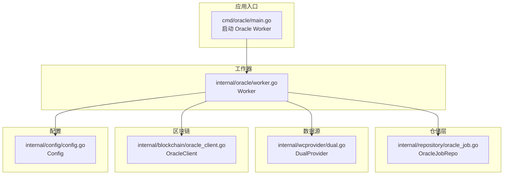
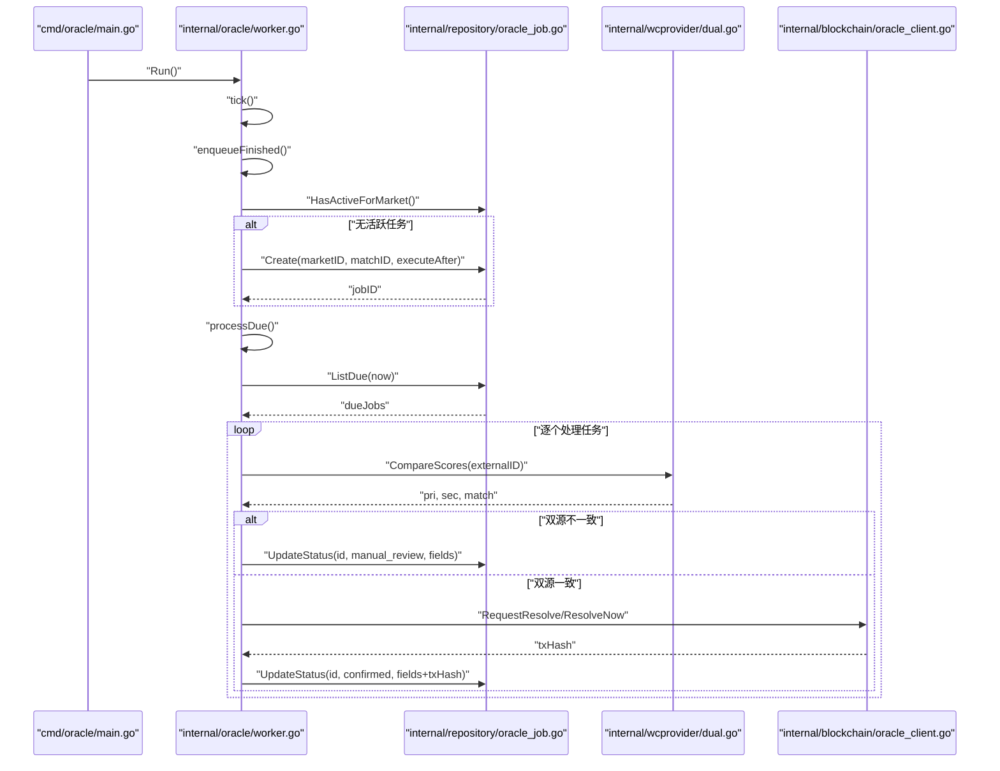
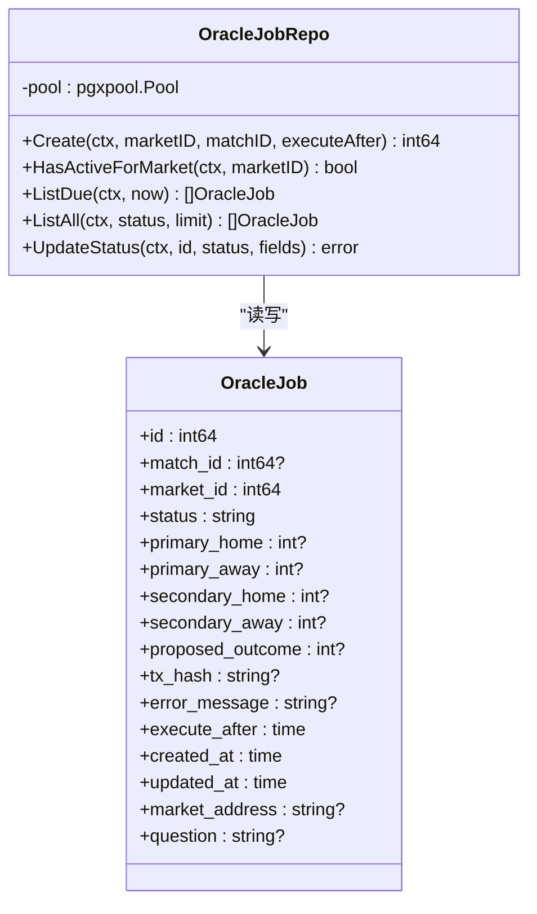
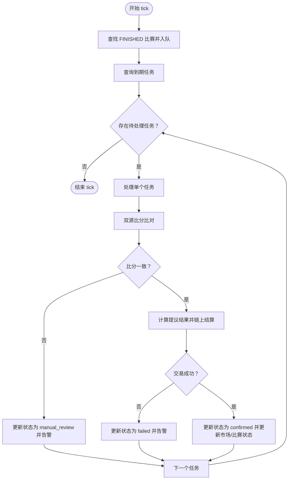
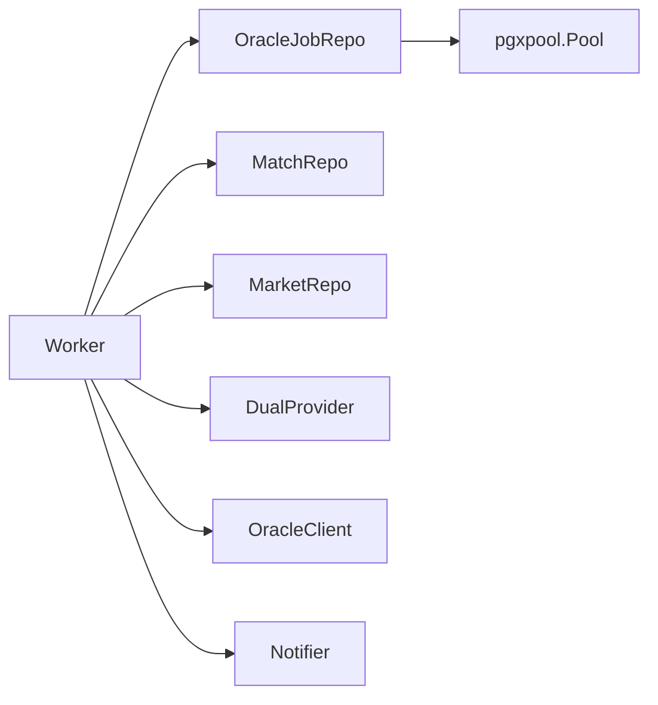

# 预言机任务仓库

<cite>
**本文档引用的文件**
- [internal/repository/oracle_job.go](file://internal/repository/oracle_job.go)
- [internal/oracle/worker.go](file://internal/oracle/worker.go)
- [cmd/oracle/main.go](file://cmd/oracle/main.go)
- [internal/wcprovider/dual.go](file://internal/wcprovider/dual.go)
- [internal/blockchain/oracle_client.go](file://internal/blockchain/oracle_client.go)
- [internal/config/config.go](file://internal/config/config.go)
- [internal/handler/metrics.go](file://internal/handler/metrics.go)
</cite>

## 目录
1. [简介](#简介)
2. [项目结构](#项目结构)
3. [核心组件](#核心组件)
4. [架构概览](#架构概览)
5. [详细组件分析](#详细组件分析)
6. [依赖分析](#依赖分析)
7. [性能考虑](#性能考虑)
8. [故障排查指南](#故障排查指南)
9. [结论](#结论)
10. [附录](#附录)

## 简介
本文件为 PredictionDIDSimple 项目中的 OracleJobRepository 提供系统化技术文档，聚焦于预言机任务的 CRUD 实现、数据模型、调度机制、质量控制与错误处理，以及与外部数据源的集成与优化策略。读者将获得从任务创建、执行、状态跟踪到结果记录的完整流程说明，并通过图示与路径引用理解各模块间的协作关系。

## 项目结构
与 OracleJobRepository 直接相关的模块分布如下：
- 仓储层：OracleJobRepository（负责任务的持久化与查询）
- 工作器：Oracle Worker（负责任务调度、数据源比对、链上结算）
- 数据源：WCProvider（双源比分数据与规则计算）
- 区块链：OracleClient（与 OracleAdapter 合约交互）
- 配置：Config（轮询间隔、冷却时间、时间锁等参数）
- 入口：cmd/oracle/main.go（启动 Oracle 工作者）

图表来源
- [cmd/oracle/main.go:21-66](file://cmd/oracle/main.go#L21-L66)
- [internal/oracle/worker.go:18-40](file://internal/oracle/worker.go#L18-L40)
- [internal/repository/oracle_job.go:32-40](file://internal/repository/oracle_job.go#L32-L40)
- [internal/wcprovider/dual.go:23-36](file://internal/wcprovider/dual.go#L23-L36)
- [internal/blockchain/oracle_client.go:25-32](file://internal/blockchain/oracle_client.go#L25-L32)
- [internal/config/config.go:12-46](file://internal/config/config.go#L12-L46)

章节来源
- [cmd/oracle/main.go:21-66](file://cmd/oracle/main.go#L21-L66)
- [internal/oracle/worker.go:18-40](file://internal/oracle/worker.go#L18-L40)
- [internal/repository/oracle_job.go:32-40](file://internal/repository/oracle_job.go#L32-L40)
- [internal/wcprovider/dual.go:23-36](file://internal/wcprovider/dual.go#L23-L36)
- [internal/blockchain/oracle_client.go:25-32](file://internal/blockchain/oracle_client.go#L25-L32)
- [internal/config/config.go:12-46](file://internal/config/config.go#L12-L46)

## 核心组件
- OracleJob 数据模型：描述单个预言机任务的全部字段，包括关联市场、状态、比分数据、提议结果、交易哈希、错误信息、执行时间与时间戳等。
- OracleJobRepo 仓储：提供任务的创建、活跃性检查、到期任务查询、全量查询与状态更新等能力。
- Worker 工作器：按配置周期轮询，将“已完成”的比赛入队，处理到期任务，调用数据源比对与链上结算。
- WCProvider 双源：提供主/备两套比分数据，用于交叉验证；并根据规则计算提议结果。
- OracleClient：与 OracleAdapter 合约交互，支持立即结算、请求结算与确认结算，具备上链等待与回执校验。
- Config：提供轮询间隔、冷却时间、时间锁、告警等运行参数。

章节来源
- [internal/repository/oracle_job.go:12-30](file://internal/repository/oracle_job.go#L12-L30)
- [internal/repository/oracle_job.go:32-40](file://internal/repository/oracle_job.go#L32-L40)
- [internal/oracle/worker.go:18-40](file://internal/oracle/worker.go#L18-L40)
- [internal/wcprovider/dual.go:14-28](file://internal/wcprovider/dual.go#L14-L28)
- [internal/blockchain/oracle_client.go:25-32](file://internal/blockchain/oracle_client.go#L25-L32)
- [internal/config/config.go:12-46](file://internal/config/config.go#L12-L46)

## 架构概览
以下序列图展示了从“已完成”比赛到链上结算的完整流程，涵盖任务创建、状态流转与结果记录：

图表来源
- [cmd/oracle/main.go:51-60](file://cmd/oracle/main.go#L51-L60)
- [internal/oracle/worker.go:60-121](file://internal/oracle/worker.go#L60-L121)
- [internal/repository/oracle_job.go:42-93](file://internal/repository/oracle_job.go#L42-L93)
- [internal/wcprovider/dual.go:67-89](file://internal/wcprovider/dual.go#L67-L89)
- [internal/blockchain/oracle_client.go:112-125](file://internal/blockchain/oracle_client.go#L112-L125)

## 详细组件分析

### OracleJob 数据模型与字段定义
- 字段说明（部分关键字段）：
  - id：任务主键
  - market_id：关联市场 ID
  - match_id：关联比赛 ID（可为空）
  - status：任务状态（pending/submitted/manual_review/confirmed/failed 等）
  - primary_* / secondary_*：主/备数据源的主客队比分
  - proposed_outcome：基于规则计算的提议结果
  - tx_hash：链上交易哈希
  - error_message：错误信息
  - execute_after：最早执行时间
  - created_at / updated_at：创建与更新时间
  - market_address / question：通过 JOIN 带出的市场信息（用于展示与链交互）

- 字段复杂度与索引建议（概念性说明）：
  - 常用于查询的字段：status、execute_after、market_id、match_id
  - 建议在上述字段建立合适索引以提升查询性能（概念性建议）

章节来源
- [internal/repository/oracle_job.go:12-30](file://internal/repository/oracle_job.go#L12-L30)

### OracleJobRepo 仓储实现
- Create：插入一条状态为 pending 的任务，返回自增 ID
- HasActiveForMarket：检查某市场是否存在 pending/submitted/manual_review 状态的活跃任务
- ListDue：查询已到期且状态为 pending 的任务，同时 JOIN 市场信息
- ListAll：列出所有任务（可按状态过滤），默认限制 50
- UpdateStatus：原子性更新状态与多个可选字段（比分、提议结果、交易哈希、错误信息），并刷新 updated_at

图表来源
- [internal/repository/oracle_job.go:32-40](file://internal/repository/oracle_job.go#L32-L40)
- [internal/repository/oracle_job.go:12-30](file://internal/repository/oracle_job.go#L12-L30)

章节来源
- [internal/repository/oracle_job.go:42-93](file://internal/repository/oracle_job.go#L42-L93)
- [internal/repository/oracle_job.go:95-129](file://internal/repository/oracle_job.go#L95-L129)
- [internal/repository/oracle_job.go:131-149](file://internal/repository/oracle_job.go#L131-L149)
- [internal/repository/oracle_job.go:151-166](file://internal/repository/oracle_job.go#L151-L166)

### Worker 调度与执行流程
- Run：按配置的轮询间隔启动主循环
- tick：单次调度，包含入队已完成比赛的任务与处理到期任务
- enqueueFinished：遍历 FINISHED 比赛，查找对应 OPEN 市场，若无活跃任务则创建任务并设置冷却时间
- processDue：获取到期任务并逐个处理
- processJob：双源比分比对，不一致则进入人工审核；一致则根据市场规则计算提议结果并发起链上结算，成功后更新状态为 confirmed

图表来源
- [internal/oracle/worker.go:42-68](file://internal/oracle/worker.go#L42-L68)
- [internal/oracle/worker.go:70-101](file://internal/oracle/worker.go#L70-L101)
- [internal/oracle/worker.go:103-121](file://internal/oracle/worker.go#L103-L121)
- [internal/oracle/worker.go:123-205](file://internal/oracle/worker.go#L123-L205)

章节来源
- [internal/oracle/worker.go:42-68](file://internal/oracle/worker.go#L42-L68)
- [internal/oracle/worker.go:70-101](file://internal/oracle/worker.go#L70-L101)
- [internal/oracle/worker.go:103-121](file://internal/oracle/worker.go#L103-L121)
- [internal/oracle/worker.go:123-205](file://internal/oracle/worker.go#L123-L205)

### 数据源与规则计算
- 双源比对：从主/备 JSON 文件加载比分，按 externalID 对齐，比较主客场比分是否一致
- 规则计算：根据市场 resolution_rule 或默认 HOME_WIN 计算提议结果（0=Yes，1=No）

章节来源
- [internal/wcprovider/dual.go:67-89](file://internal/wcprovider/dual.go#L67-L89)
- [internal/wcprovider/dual.go:99-119](file://internal/wcprovider/dual.go#L99-L119)

### 区块链交互与上链保障
- 请求结算：RequestResolve（提议结果）
- 立即结算：ResolveNow（管理员路径）
- 确认结算：ConfirmResolve（配合时间锁）
- 上链等待：WaitMined（轮询回执，检测 revert 与超时）

章节来源
- [internal/blockchain/oracle_client.go:112-125](file://internal/blockchain/oracle_client.go#L112-L125)
- [internal/blockchain/oracle_client.go:169-192](file://internal/blockchain/oracle_client.go#L169-L192)

### 配置与运行参数
- 轮询间隔：OraclePollSeconds
- 冷却时间：OracleCooldownMinutes
- 时间锁：OracleTimelockSeconds
- 告警 Webhook：AlertWebhookURL

章节来源
- [internal/config/config.go:34-36](file://internal/config/config.go#L34-L36)
- [internal/config/config.go:69-71](file://internal/config/config.go#L69-L71)
- [internal/config/config.go:74](file://internal/config/config.go#L74)

### API 指标导出（Prometheus）
- 暴露 oracle_jobs_* 指标，统计 pending、manual_review、confirmed、failed 状态的数量

章节来源
- [internal/handler/metrics.go:11-36](file://internal/handler/metrics.go#L11-L36)

## 依赖分析
- Worker 依赖 OracleJobRepo、MatchRepo、MarketRepo、DualProvider、OracleClient、Notifier
- OracleJobRepo 依赖数据库连接池（pgxpool.Pool）
- Worker 通过配置控制轮询、冷却与时间锁行为
- 数据质量由双源比对与规则计算保证，异常通过状态与告警反馈

图表来源
- [internal/oracle/worker.go:18-40](file://internal/oracle/worker.go#L18-L40)
- [internal/repository/oracle_job.go:32-40](file://internal/repository/oracle_job.go#L32-L40)

章节来源
- [internal/oracle/worker.go:18-40](file://internal/oracle/worker.go#L18-L40)
- [internal/repository/oracle_job.go:32-40](file://internal/repository/oracle_job.go#L32-L40)

## 性能考虑
- 查询优化：对 status、execute_after、market_id、match_id 建立索引，减少扫描范围
- 分页与限制：ListAll 默认限制 50，避免一次性返回过多数据
- 批处理：processDue 逐个处理任务，便于限流与可观测性
- 链上交互：估算 gas、设置 gasPrice、轮询等待，避免频繁重试造成拥堵
- 缓存与降级：在数据源侧可引入缓存与降级策略（概念性建议）

## 故障排查指南
- 任务状态异常
  - 检查是否正确调用 UpdateStatus 更新状态与字段
  - 使用 ListAll 按状态过滤查看任务分布
- 双源不一致
  - 查看 manual_review 状态的任务，核对主/备源数据
  - 检查 CompareScores 的 externalID 是否匹配
- 链上失败
  - 检查 tx_reverted 与超时情况
  - 确认 gasPrice、nonce 与合约权限
- 告警与监控
  - 通过 Prometheus 指标观察状态分布
  - 配置 AlertWebhookURL 接收失败告警

章节来源
- [internal/repository/oracle_job.go:131-149](file://internal/repository/oracle_job.go#L131-L149)
- [internal/oracle/worker.go:146-153](file://internal/oracle/worker.go#L146-L153)
- [internal/blockchain/oracle_client.go:169-192](file://internal/blockchain/oracle_client.go#L169-L192)
- [internal/handler/metrics.go:11-36](file://internal/handler/metrics.go#L11-L36)

## 结论
OracleJobRepository 作为预言机任务的核心数据层，提供了简洁而完备的 CRUD 能力。结合 Worker 的调度逻辑、WCProvider 的双源质量控制与 OracleClient 的链上交互，形成了从任务创建、数据验证、规则计算到链上结算的闭环。通过合理的索引、分页与告警机制，系统在可维护性与可扩展性方面具备良好基础。

## 附录

### 使用示例（步骤说明）
- 创建任务
  - 步骤：调用 Create(marketID, matchID, executeAfter)，返回任务 ID
  - 参考路径：[internal/repository/oracle_job.go:42-54](file://internal/repository/oracle_job.go#L42-L54)
- 查询到期任务
  - 步骤：调用 ListDue(now)，遍历处理
  - 参考路径：[internal/repository/oracle_job.go:68-93](file://internal/repository/oracle_job.go#L68-L93)
- 查询任务状态与结果
  - 步骤：调用 ListAll(status, limit) 或直接查询单条任务
  - 参考路径：[internal/repository/oracle_job.go:95-129](file://internal/repository/oracle_job.go#L95-L129)
- 更新任务状态与结果
  - 步骤：调用 UpdateStatus(id, status, fields)，fields 包含比分、提议结果、tx_hash、error_message
  - 参考路径：[internal/repository/oracle_job.go:131-149](file://internal/repository/oracle_job.go#L131-L149)

### 调度机制说明
- 定时任务：Worker 按配置轮询，周期性执行 tick
- 事件触发：FINISHED 比赛自动入队，冷却后执行
- 手动执行：通过管理接口或外部触发创建任务（概念性说明）

章节来源
- [internal/oracle/worker.go:42-68](file://internal/oracle/worker.go#L42-L68)
- [internal/oracle/worker.go:70-101](file://internal/oracle/worker.go#L70-L101)
- [internal/config/config.go:69-71](file://internal/config/config.go#L69-L71)