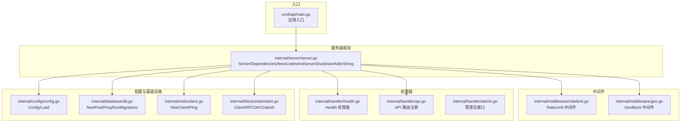
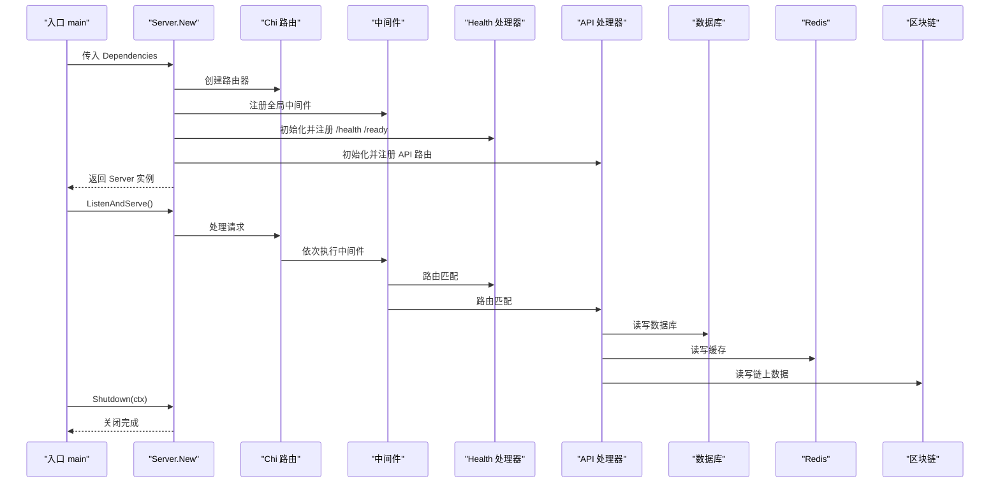
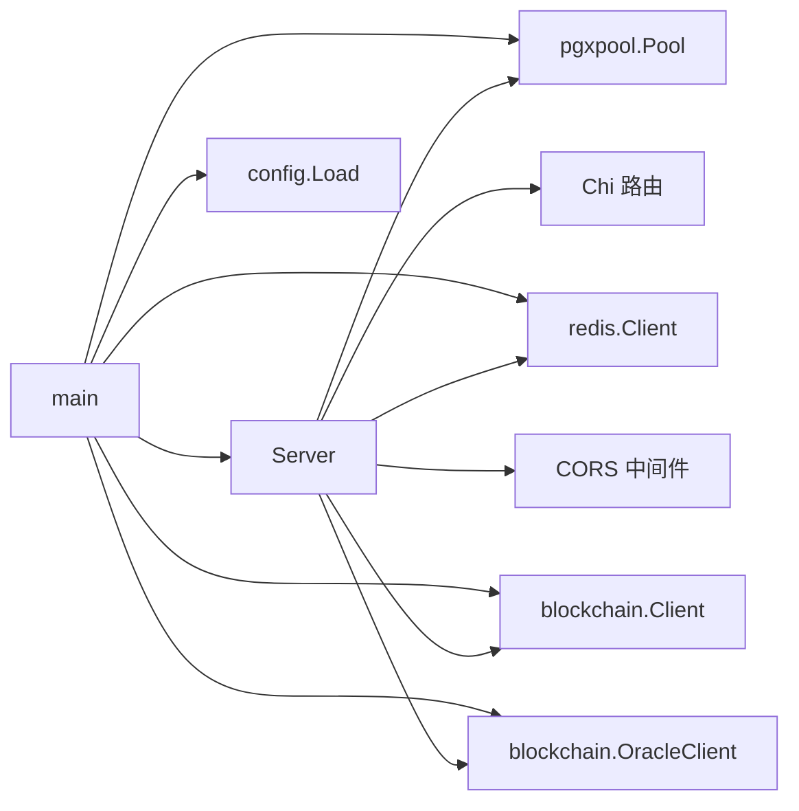

# 服务器框架

<cite>
**本文引用的文件**
- [server.go](file://internal/server/server.go)
- [main.go](file://cmd/api/main.go)
- [ratelimit.go](file://internal/middleware/ratelimit.go)
- [geo.go](file://internal/middleware/geo.go)
- [health.go](file://internal/handler/health.go)
- [config.go](file://internal/config/config.go)
- [api.go](file://internal/handler/api.go)
- [db.go](file://internal/database/db.go)
- [client.go](file://internal/redis/client.go)
- [client.go](file://internal/blockchain/client.go)
- [middleware.go](file://internal/auth/middleware.go)
- [admin.go](file://internal/handler/admin.go)
- [go.mod](file://go.mod)
</cite>

## 目录
1. [简介](#简介)
2. [项目结构](#项目结构)
3. [核心组件](#核心组件)
4. [架构总览](#架构总览)
5. [详细组件分析](#详细组件分析)
6. [依赖关系分析](#依赖关系分析)
7. [性能考虑](#性能考虑)
8. [故障排除指南](#故障排除指南)
9. [结论](#结论)
10. [附录](#附录)

## 简介
本文件面向 PredictionDIDSimple 项目的服务器框架模块，系统性阐述 Server 结构体的设计理念与实现细节，重点覆盖：
- 依赖注入机制与 Dependencies 结构体如何统一管理数据库、Redis、区块链等外部依赖
- 中间件系统配置：全局中间件（RequestID、RealIP、Logger、Recoverer、RateLimit、GeoBlock）
- CORS 跨域配置与健康检查处理器注册
- API 处理器初始化与路由注册流程
- 服务器启动、优雅关闭、监听地址获取
- ListenAndServe 与 Shutdown 的实现原理与使用场景
- 服务器配置选项、性能优化建议与故障排除

## 项目结构
服务器框架位于 internal/server，入口程序位于 cmd/api，配合内部中间件、处理器、配置、数据库、Redis、区块链等模块协同工作。

图表来源
- [server.go:1-129](file://internal/server/server.go#L1-L129)
- [main.go:1-161](file://cmd/api/main.go#L1-L161)
- [ratelimit.go:1-67](file://internal/middleware/ratelimit.go#L1-L67)
- [geo.go:1-65](file://internal/middleware/geo.go#L1-L65)
- [health.go:1-78](file://internal/handler/health.go#L1-L78)
- [api.go:1-100](file://internal/handler/api.go#L1-L100)
- [config.go:1-139](file://internal/config/config.go#L1-L139)
- [db.go:1-51](file://internal/database/db.go#L1-L51)
- [client.go:1-29](file://internal/redis/client.go#L1-L29)
- [client.go:1-94](file://internal/blockchain/client.go#L1-L94)

章节来源
- [server.go:1-129](file://internal/server/server.go#L1-L129)
- [main.go:1-161](file://cmd/api/main.go#L1-L161)

## 核心组件
- Server 结构体：封装底层 http.Server，提供 ListenAndServe、Shutdown、Addr、String 等方法，负责服务器生命周期管理。
- Dependencies 结构体：集中注入所有外部依赖，包括端口、配置、数据库连接池、Redis 客户端、通用区块链客户端与预言机区块链客户端。
- New 构造函数：完成路由初始化、全局中间件注册、CORS 配置、健康检查与 API 处理器注册、构建 http.Server 并返回 Server 实例。
- 入口 main：加载配置、执行数据库迁移、创建数据库连接池、Redis 客户端、区块链客户端、索引器（可选），然后创建并启动 Server，最后优雅关闭。

章节来源
- [server.go:24-129](file://internal/server/server.go#L24-L129)
- [main.go:27-161](file://cmd/api/main.go#L27-L161)

## 架构总览
服务器采用“依赖注入 + 中间件 + 路由”的分层设计：
- 依赖注入：在入口处组装 Dependencies，传入 New，确保 Server 仅依赖抽象接口而非具体实现。
- 中间件：全局中间件提供请求追踪、日志、异常恢复、速率限制、地理封锁、跨域等横切能力。
- 路由：健康检查与 API 路由分别由独立处理器注册；API 路由进一步细分为公开接口、JWT 认证接口、管理员接口三组。
- 基础设施：数据库、Redis、区块链客户端作为只读或读写依赖注入，支持降级与健康检查。

图表来源
- [server.go:44-102](file://internal/server/server.go#L44-L102)
- [health.go:20-77](file://internal/handler/health.go#L20-L77)
- [api.go:33-69](file://internal/handler/api.go#L33-L69)
- [main.go:123-160](file://cmd/api/main.go#L123-L160)

## 详细组件分析

### Server 结构体与生命周期
- 设计理念：将 http.Server 封装为 Server，提供统一的启动与优雅关闭接口，避免直接操作底层服务器对象。
- 关键方法：
  - ListenAndServe：启动监听并处理请求。
  - Shutdown：在给定上下文内优雅关闭，等待现有连接处理完毕。
  - Addr：返回监听地址。
  - String：返回本地主机 URL 表示形式。

章节来源
- [server.go:24-27](file://internal/server/server.go#L24-L27)
- [server.go:104-129](file://internal/server/server.go#L104-L129)

### 依赖注入：Dependencies 结构体
- 字段含义：
  - Port：监听端口
  - Cfg：全局配置
  - DB：PostgreSQL 连接池
  - Redis：Redis 客户端（可为空，支持降级）
  - Chain：通用区块链客户端（只读）
  - OracleChain：预言机区块链客户端（读写）
- 作用：集中管理所有外部依赖，保证 Server 与具体实现解耦，便于测试与替换。

章节来源
- [server.go:29-38](file://internal/server/server.go#L29-L38)

### New 函数：初始化流程与路由注册
- 路由器创建：使用 Chi 新建路由器。
- 全局中间件注册：
  - RequestID、RealIP、Logger、Recoverer：基础请求处理
  - RateLimit：基于 IP 的每分钟滑动窗口限流
  - GeoBlock：基于国家代码的地理封锁，支持审计日志回调
- CORS 配置：允许指定前端来源、方法与头部，支持凭据传递。
- 健康检查处理器注册：Health 注入 DB、Redis、Chain，注册 /health 与 /ready。
- API 处理器注册：API 注入配置、多个仓储、合规仓储、VC 颁发器、Oracle 链客户端，注册全部业务路由。
- 构建 http.Server：设置监听地址、处理器、读超时、写超时（SSE 需要长连接，写超时设为 0）。

章节来源
- [server.go:44-102](file://internal/server/server.go#L44-L102)

### 中间件系统
- 速率限制中间件（RateLimit）
  - 实现：基于 IP 的滑动窗口计数器，每分钟重置窗口。
  - 豁免：/health、/ready 等路径不受限流影响。
  - 并发安全：使用互斥锁保护计数表。
- 地理封锁中间件（GeoBlock）
  - 实现：根据请求头提取国家代码，判断是否在封禁列表中。
  - 豁免：健康检查、指标、合规受限名单、事件流等路径。
  - 审计：支持回调记录访问日志（IP、国家、路径、是否允许）。

章节来源
- [ratelimit.go:12-67](file://internal/middleware/ratelimit.go#L12-L67)
- [geo.go:12-65](file://internal/middleware/geo.go#L12-L65)

### CORS 跨域配置
- 允许来源：开发环境常用本地前端端口
- 允许方法：GET、POST、PUT、DELETE、OPTIONS
- 允许头部：常见鉴权与自定义头部（含 CF-IPCountry、X-Country-Code、X-KYC-Signature 等）
- 凭据：允许携带 Cookie 等凭据

章节来源
- [server.go:62-67](file://internal/server/server.go#L62-L67)

### 健康检查处理器
- /health：存活探针，返回状态 ok
- /ready：就绪探针，检测 DB、Redis、RPC 健康状态，DB 不可用时返回 503，Redis 可降级运行

章节来源
- [health.go:13-77](file://internal/handler/health.go#L13-L77)

### API 路由注册
- 公开接口：比赛、市场、统计、合规受限名单、KYC 回调、SSE 比分流、Prometheus 指标
- 登录接口：SIWE 钱包登录、验证 VC
- JWT 认证接口：用户持仓、绑定 DID、我的凭证
- 管理员接口：Oracle 任务列表、注册市场、作废市场、重试任务、颁发凭证

章节来源
- [api.go:18-69](file://internal/handler/api.go#L18-L69)

### 认证中间件
- JWT 校验：从 Authorization 头提取 Bearer Token，解析失败返回 401
- 地址注入：将钱包地址注入到请求上下文，供后续处理器使用

章节来源
- [middleware.go:17-50](file://internal/auth/middleware.go#L17-L50)

### 管理员接口示例
- voidMarket：作废市场，优先链上作废（若配置 Oracle 链客户端），再更新数据库状态并联动比赛状态
- registerMarket：管理员注册市场，写入数据库
- retryOracleJob：重试失败的 Oracle 任务，重置状态并清空错误消息

章节来源
- [admin.go:30-61](file://internal/handler/admin.go#L30-L61)
- [admin.go:73-93](file://internal/handler/admin.go#L73-L93)
- [admin.go:95-109](file://internal/handler/admin.go#L95-L109)

### 服务器启动与优雅关闭
- 启动：入口 main 加载配置、执行迁移、创建 DB/Redis/Chain 客户端，构造 Server 并在协程中启动监听
- 优雅关闭：监听系统信号（SIGINT/SIGTERM），创建带超时的关闭上下文，调用 Server.Shutdown

章节来源
- [main.go:123-160](file://cmd/api/main.go#L123-L160)

### 监听地址获取
- Server.Addr 返回监听地址（如 ":8080"）
- Server.String 返回本地主机 URL（如 "http://localhost:8080"）

章节来源
- [server.go:118-128](file://internal/server/server.go#L118-L128)

## 依赖关系分析
- 服务器依赖：Chi 路由、CORS、PGX 连接池、Redis 客户端、区块链客户端
- 配置来源：环境变量加载，支持地理封锁、速率限制、链 ID、索引器参数等
- 基础设施：数据库迁移、Redis Ping、区块链 RPC Ping（后台定时）

图表来源
- [server.go:11-22](file://internal/server/server.go#L11-L22)
- [main.go:28-131](file://cmd/api/main.go#L28-L131)
- [config.go:48-105](file://internal/config/config.go#L48-L105)

章节来源
- [go.mod:5-14](file://go.mod#L5-L14)
- [server.go:11-22](file://internal/server/server.go#L11-L22)
- [main.go:28-131](file://cmd/api/main.go#L28-L131)

## 性能考虑
- 读超时：15 秒，适合大多数请求
- 写超时：0（SSE 需要长连接），避免 SSE 被强制中断
- 速率限制：基于 IP 的滑动窗口，每分钟请求数可配置，默认 120
- 地理封锁：仅在启用时生效，且对健康检查等路径豁免
- Redis 降级：Redis 不可用时不影响核心功能，但会降级运行
- 数据库连接池：使用 PGX 连接池，减少连接开销
- 区块链 RPC：后台定时 Ping，保持健康状态缓存，避免频繁拨号

章节来源
- [server.go:98-101](file://internal/server/server.go#L98-L101)
- [config.go:75-76](file://internal/config/config.go#L75-L76)
- [health.go:52-60](file://internal/handler/health.go#L52-L60)
- [db.go:16-24](file://internal/database/db.go#L16-L24)
- [client.go:30-46](file://internal/blockchain/client.go#L30-L46)

## 故障排除指南
- 启动失败（配置缺失）
  - 现象：配置加载阶段直接致命错误
  - 排查：确认 DATABASE_URL 等必需环境变量
- 数据库迁移失败
  - 现象：迁移执行阶段致命错误
  - 排查：检查 migrations 目录路径与数据库 URL
- Redis 连接失败
  - 现象：仅打印警告，降级运行
  - 排查：检查 REDIS_URL，确认网络可达
- 区块链 RPC 不健康
  - 现象：后台日志警告，ready 探针返回异常
  - 排查：核对 ETH_RPC_URL、CHAIN_ID，确保节点可用
- 速率限制触发
  - 现象：返回 429 rate_limited
  - 排查：调整 RATE_LIMIT_PER_MINUTE 或优化客户端重试策略
- 地理封锁拒绝
  - 现象：返回 403 region_restricted
  - 排查：检查 BLOCKED_COUNTRIES 与请求头（CF-IPCountry、X-Country-Code）
- 优雅关闭失败
  - 现象：关闭阶段打印警告
  - 排查：检查是否有长时间阻塞的请求或未正确释放资源

章节来源
- [main.go:28-50](file://cmd/api/main.go#L28-L50)
- [main.go:63-81](file://cmd/api/main.go#L63-L81)
- [main.go:83-121](file://cmd/api/main.go#L83-L121)
- [ratelimit.go:42-66](file://internal/middleware/ratelimit.go#L42-L66)
- [geo.go:14-41](file://internal/middleware/geo.go#L14-L41)
- [health.go:33-77](file://internal/handler/health.go#L33-L77)
- [main.go:152-159](file://cmd/api/main.go#L152-L159)

## 结论
服务器框架通过清晰的依赖注入、完善的中间件体系与模块化的处理器注册，实现了高内聚、低耦合的服务架构。结合健康检查、速率限制、地理封锁与 CORS 等横切能力，既满足生产环境的安全与稳定性要求，又提供了良好的扩展性与可观测性。建议在生产环境中合理配置速率限制与地理封锁策略，并持续监控数据库、Redis 与区块链 RPC 的健康状态。

## 附录

### 服务器配置选项
- HTTP 端口：HTTP_PORT（默认 8080）
- 数据库：DATABASE_URL（必填）
- Redis：REDIS_URL（默认本地）
- 以太坊 RPC：ETH_RPC_URL（默认本地）、ETH_RPC_FALLBACK_URL（备用）
- 链 ID：CHAIN_ID（整数）
- JWT 密钥：JWT_SECRET（默认开发密钥）
- SIWE 域名与 URI：SIWE_DOMAIN、SIWE_URI
- 合约地址：MarketFactory、MarketFactoryV3、MockUSDC、OracleAdapter、OracleAdapterV2、DIDRegistry
- Oracle 参数：ORACLE_PRIVATE_KEY、ORACLE_COOLDOWN_MINUTES、ORACLE_TIMELOCK_SECONDS、ORACLE_POLL_SECONDS
- 索引器参数：INDEXER_START_BLOCK、INDEXER_POLL_SECONDS
- 管理员密钥：ADMIN_API_KEY
- VC 颁发密钥：VC_ISSUER_KEY
- 告警 Webhook：ALERT_WEBHOOK_URL
- 地理封锁：GEO_BLOCK_ENABLED（布尔）、BLOCKED_COUNTRIES（逗号分隔）
- 速率限制：RATE_LIMIT_PER_MINUTE（整数）
- KYC 回调密钥：KYC_WEBHOOK_SECRET
- 合规要求：COMPLIANCE_REQUIRED（布尔）
- 环境：APP_ENV（development/production）

章节来源
- [config.go:12-46](file://internal/config/config.go#L12-L46)
- [config.go:48-105](file://internal/config/config.go#L48-L105)

### 服务器启动与优雅关闭示例（步骤说明）
- 启动服务器
  - 加载配置
  - 执行数据库迁移
  - 创建数据库连接池
  - 创建 Redis 客户端（可选）
  - 创建区块链客户端（只读）
  - 可选：启动索引器
  - 创建 Server 并启动监听
- 优雅关闭
  - 监听系统信号
  - 创建带超时的关闭上下文
  - 调用 Server.Shutdown

章节来源
- [main.go:27-161](file://cmd/api/main.go#L27-L161)