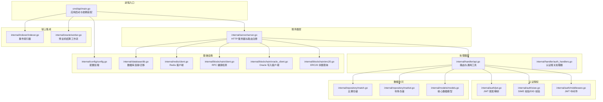
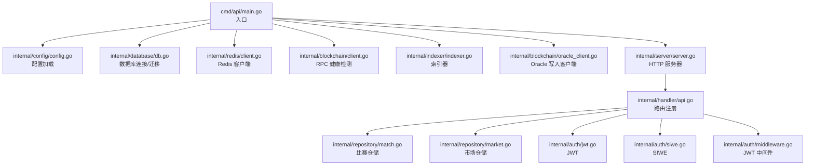
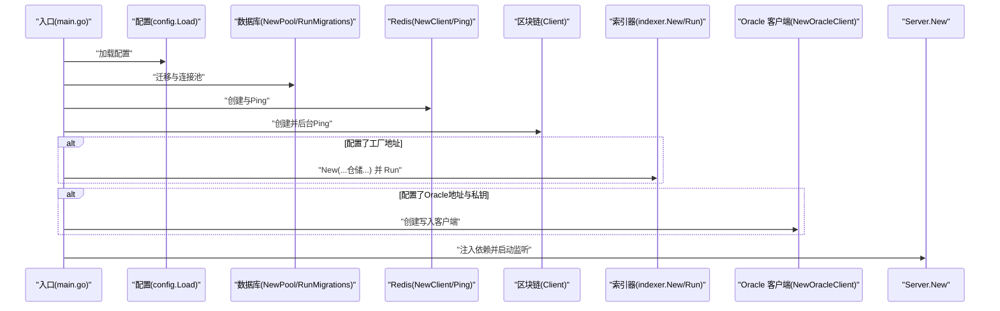
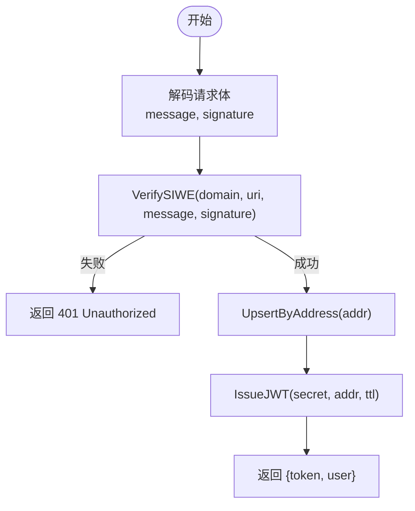
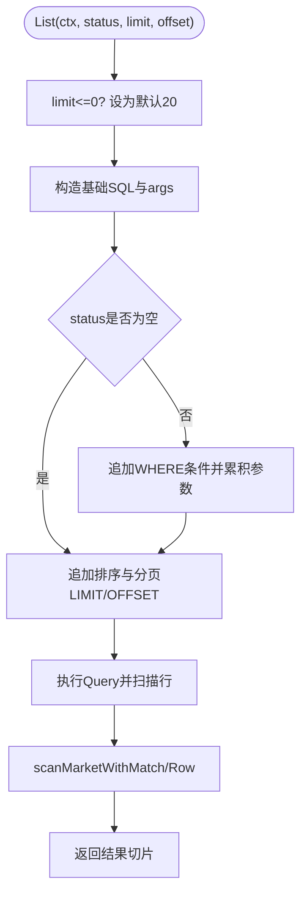
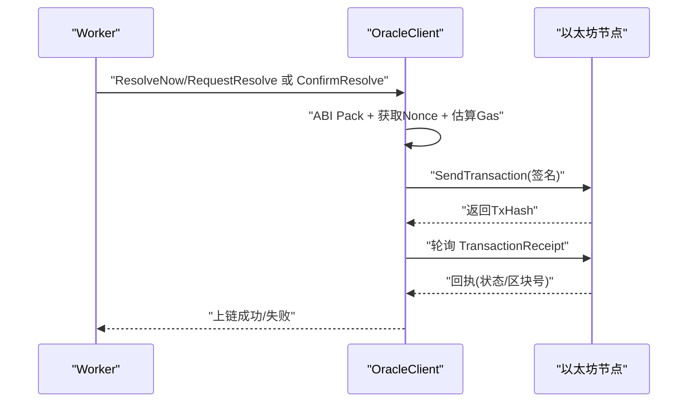
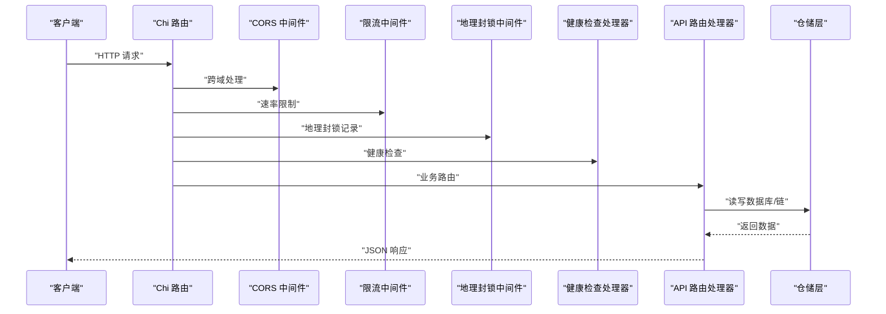
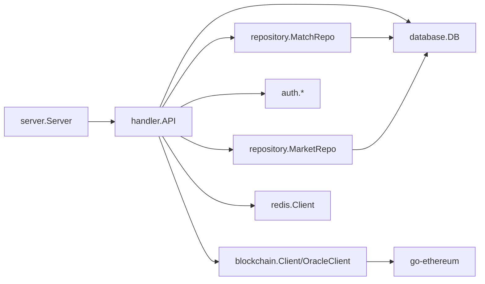

# 核心模块

<cite>
**本文档引用的文件**
- [main.go](file://cmd/api/main.go)
- [server.go](file://internal/server/server.go)
- [config.go](file://internal/config/config.go)
- [db.go](file://internal/database/db.go)
- [jwt.go](file://internal/auth/jwt.go)
- [siwe.go](file://internal/auth/siwe.go)
- [middleware.go](file://internal/auth/middleware.go)
- [client.go](file://internal/blockchain/client.go)
- [oracle_client.go](file://internal/blockchain/oracle_client.go)
- [erc20.go](file://internal/blockchain/erc20.go)
- [match.go](file://internal/repository/match.go)
- [market.go](file://internal/repository/market.go)
- [api.go](file://internal/handler/api.go)
- [auth_handlers.go](file://internal/handler/auth_handlers.go)
- [indexer.go](file://internal/indexer/indexer.go)
- [worker.go](file://internal/oracle/worker.go)
- [models.go](file://internal/models/models.go)
- [client.go](file://internal/redis/client.go)
</cite>

## 目录
1. [简介](#简介)
2. [项目结构](#项目结构)
3. [核心组件](#核心组件)
4. [架构总览](#架构总览)
5. [详细组件分析](#详细组件分析)
6. [依赖关系分析](#依赖关系分析)
7. [性能考量](#性能考量)
8. [故障排查指南](#故障排查指南)
9. [结论](#结论)
10. [附录](#附录)

## 简介
本文件面向 PredictionDIDSimple 后端核心模块，系统化梳理服务器框架、认证授权、数据库访问、区块链集成、API 处理器等关键子系统，明确其职责边界、接口规范、依赖注入方式与协作流程。文档既提供高层概览，也给出代码级图示与定位，帮助初学者快速上手，同时为资深开发者提供深入的技术细节与优化建议。

## 项目结构
后端采用“命令入口 → 服务器 → 处理器 → 仓储 → 数据库/区块链”的分层组织，配合独立的索引器与预言机工作流，形成闭环的数据与状态流转。

图表来源
- [main.go:1-161](file://cmd/api/main.go#L1-L161)
- [server.go:1-129](file://internal/server/server.go#L1-L129)
- [api.go:1-100](file://internal/handler/api.go#L1-L100)
- [auth_handlers.go:1-98](file://internal/handler/auth_handlers.go#L1-L98)
- [jwt.go:1-58](file://internal/auth/jwt.go#L1-L58)
- [siwe.go:1-75](file://internal/auth/siwe.go#L1-L75)
- [middleware.go:1-50](file://internal/auth/middleware.go#L1-L50)
- [match.go:1-118](file://internal/repository/match.go#L1-L118)
- [market.go:1-269](file://internal/repository/market.go#L1-L269)
- [models.go:1-63](file://internal/models/models.go#L1-L63)
- [config.go:1-139](file://internal/config/config.go#L1-L139)
- [db.go:1-51](file://internal/database/db.go#L1-L51)
- [client.go:1-29](file://internal/redis/client.go#L1-L29)
- [client.go:1-94](file://internal/blockchain/client.go#L1-L94)
- [oracle_client.go:1-193](file://internal/blockchain/oracle_client.go#L1-L193)
- [erc20.go:1-43](file://internal/blockchain/erc20.go#L1-L43)
- [indexer.go:1-329](file://internal/indexer/indexer.go#L1-L329)
- [worker.go:1-214](file://internal/oracle/worker.go#L1-L214)

章节来源
- [main.go:1-161](file://cmd/api/main.go#L1-L161)
- [server.go:1-129](file://internal/server/server.go#L1-L129)

## 核心组件
- 服务器框架模块：负责 HTTP 服务器初始化、中间件注册、路由装配与生命周期管理。
- 认证授权模块：提供 SIWE 登录、JWT 颁发与解析、JWT 中间件、管理员鉴权。
- 数据库访问模块：基于仓储模式，提供比赛、市场、用户、持仓、统计等数据访问能力。
- 区块链集成模块：封装只读 RPC 健康检测、ERC20 余额查询、Oracle 写入客户端。
- API 处理器模块：统一注册公开/登录/认证/管理员路由，封装通用响应与参数解析。
- 索引器与预言机：索引器轮询链上事件并入库，预言机工作流自动结算并上链。

章节来源
- [server.go:24-102](file://internal/server/server.go#L24-L102)
- [api.go:18-69](file://internal/handler/api.go#L18-L69)
- [match.go:15-118](file://internal/repository/match.go#L15-L118)
- [market.go:15-269](file://internal/repository/market.go#L15-L269)
- [client.go:14-94](file://internal/blockchain/client.go#L14-L94)
- [oracle_client.go:25-193](file://internal/blockchain/oracle_client.go#L25-L193)
- [indexer.go:26-120](file://internal/indexer/indexer.go#L26-L120)
- [worker.go:18-58](file://internal/oracle/worker.go#L18-L58)

## 架构总览
下图展示从进程入口到各子系统的依赖注入与调用关系，体现“配置 → 数据库/缓存/链 → 服务器 → 处理器 → 仓储 → 数据库/链”的主干流程。

图表来源
- [main.go:27-131](file://cmd/api/main.go#L27-L131)
- [server.go:44-102](file://internal/server/server.go#L44-L102)
- [api.go:18-91](file://internal/handler/api.go#L18-L91)

## 详细组件分析

### 服务器框架模块（Server 初始化与依赖注入）
- 职责
  - 构建 HTTP 路由与中间件栈（请求 ID、真实 IP、日志、恢复、速率限制、地理封锁）。
  - 注入数据库、Redis、区块链客户端、预言机链客户端、配置等依赖。
  - 注册健康检查、API 路由与管理员路由组。
  - 提供优雅关闭与监听服务。
- 关键点
  - 依赖注入结构体包含端口、配置、数据库连接池、Redis 客户端、通用链客户端、Oracle 写入客户端。
  - CORS 允许前端开发地址与特定头部（含管理员密钥、KYC 签名等）。
  - 读超时设置，写超时为 0 以支持 SSE。
- 典型调用序列（启动流程）

图表来源
- [main.go:27-131](file://cmd/api/main.go#L27-L131)
- [server.go:44-102](file://internal/server/server.go#L44-L102)

章节来源
- [server.go:24-129](file://internal/server/server.go#L24-L129)
- [main.go:27-161](file://cmd/api/main.go#L27-L161)

### 认证授权模块（JWT 与 SIWE 集成）
- 职责
  - SIWE 校验：解析消息、校验域名与 URI、过期时间、签名有效性，返回钱包地址。
  - JWT 颁发与解析：HS256 签名，包含钱包地址与标准声明。
  - JWT 中间件：从 Authorization Bearer 头提取并校验 JWT，将地址注入上下文。
  - DID 绑定校验：校验 did:pkh:eip155:<chain>:<address> 规范。
- 接口规范
  - SIWE 校验输入：配置（域名、URI）、消息文本、签名。
  - JWT 颁发输入：密钥、地址、有效期；解析输入：密钥、JWT 字符串。
  - 中间件输入：HTTP 请求；输出：上下文中注入的地址。
- 使用模式
  - 登录：POST /auth/siwe，请求体包含 message 与 signature，成功后返回 token 与用户。
  - 绑定 DID：受 JWT 保护的 POST /users/bind-did，请求体包含 did 与 signature。
  - 访问受保护资源：在 Authorization 头设置 Bearer <token>。
- 流程图（SIWE 登录）

图表来源
- [auth_handlers.go:19-53](file://internal/handler/auth_handlers.go#L19-L53)
- [siwe.go:20-60](file://internal/auth/siwe.go#L20-L60)
- [jwt.go:19-34](file://internal/auth/jwt.go#L19-L34)

章节来源
- [jwt.go:13-58](file://internal/auth/jwt.go#L13-L58)
- [siwe.go:14-75](file://internal/auth/siwe.go#L14-L75)
- [middleware.go:17-50](file://internal/auth/middleware.go#L17-L50)
- [auth_handlers.go:13-98](file://internal/handler/auth_handlers.go#L13-L98)

### 数据库访问模块（Repository 模式实现）
- 职责
  - 提供比赛、市场、用户、持仓、统计、合规等仓储操作。
  - 支持分页查询、动态 WHERE 条件、LEFT JOIN 填充关联对象。
  - 提供链上事件入库、状态更新、资金池更新等专用方法。
- 数据模型
  - Match、Market、Position、User 等核心实体。
- 性能与复杂度
  - 列表查询通过动态拼接 WHERE 与 LIMIT/OFFSET 控制，时间复杂度主要受数据库索引影响。
  - LEFT JOIN 查询在市场列表中一次性填充关联比赛，减少多次往返。
- 示例（市场列表查询）

图表来源
- [market.go:25-73](file://internal/repository/market.go#L25-L73)
- [market.go:211-252](file://internal/repository/market.go#L211-L252)
- [models.go:6-63](file://internal/models/models.go#L6-L63)

章节来源
- [match.go:15-118](file://internal/repository/match.go#L15-L118)
- [market.go:15-269](file://internal/repository/market.go#L15-L269)
- [models.go:1-63](file://internal/models/models.go#L1-L63)

### 区块链集成模块（智能合约交互）
- 职责
  - 只读客户端：定时健康检查、链 ID 校验、RPC 连通性监控。
  - Oracle 写入客户端：加载合约 ABI、构造交易、签名发送、等待上链、回执状态检查。
  - ERC20 余额查询：通过 eth_call 调用 balanceOf。
- 关键流程（Oracle 写入）
  - 无时间锁：ResolveNow → 等待上链 → 更新任务与市场状态。
  - 有时间锁：RequestResolve → 等待确认 → 等待时间锁 → ConfirmResolve → 等待上链 → 更新任务与市场状态。
- 交易流程图

图表来源
- [worker.go:123-205](file://internal/oracle/worker.go#L123-L205)
- [oracle_client.go:112-193](file://internal/blockchain/oracle_client.go#L112-L193)

章节来源
- [client.go:14-94](file://internal/blockchain/client.go#L14-L94)
- [oracle_client.go:25-193](file://internal/blockchain/oracle_client.go#L25-L193)
- [erc20.go:18-43](file://internal/blockchain/erc20.go#L18-L43)

### API 处理器模块（路由与业务逻辑）
- 路由分组
  - 公开接口：比赛/市场查询、平台统计、合规受限名单、KYC 回调、SSE 流、指标。
  - 登录接口：SIWE 登录、VC 校验。
  - JWT 保护接口：我的持仓、绑定 DID、我的凭证。
  - 管理员接口：Oracle 任务列表、注册/作废市场、重试任务、颁发凭证。
- 通用工具
  - writeJSON/writeError：统一 JSON 响应与错误格式。
  - queryInt/parseID：查询参数与路径参数解析。
- 依赖注入
  - API 聚合配置、仓储、VC 颁发器、Oracle 链客户端等。
- 路由注册顺序与中间件链路

图表来源
- [server.go:44-91](file://internal/server/server.go#L44-L91)
- [api.go:33-69](file://internal/handler/api.go#L33-L69)

章节来源
- [api.go:18-100](file://internal/handler/api.go#L18-L100)
- [server.go:44-102](file://internal/server/server.go#L44-L102)

## 依赖关系分析
- 组件耦合
  - 服务器通过依赖注入聚合处理器所需仓储与服务，降低处理器对具体实现的耦合。
  - 认证模块被中间件与处理器共同依赖，形成横切关注点。
  - 区块链客户端分为只读与写入两类，职责清晰分离。
- 外部依赖
  - 数据库：PostgreSQL（pgx 连接池）。
  - 缓存：Redis（go-redis）。
  - 区块链：go-ethereum（ethclient、ABI、交易构建）。
  - 迁移：golang-migrate。
- 循环依赖
  - 未见直接循环依赖；仓储与模型双向引用通过接口与扫描函数规避。

图表来源
- [server.go:44-91](file://internal/server/server.go#L44-L91)
- [api.go:18-91](file://internal/handler/api.go#L18-L91)
- [match.go:15-23](file://internal/repository/match.go#L15-L23)
- [market.go:15-23](file://internal/repository/market.go#L15-L23)

章节来源
- [server.go:29-38](file://internal/server/server.go#L29-L38)
- [api.go:18-31](file://internal/handler/api.go#L18-L31)

## 性能考量
- 数据库
  - 使用连接池与合理的 LIMIT/OFFSET，避免全表扫描；为高频查询字段建立索引。
  - LEFT JOIN 填充关联对象减少 N+1 查询，但注意投影字段与内存占用。
- 缓存
  - Redis 作为可选增强，建议用于热点读取与会话存储；降级运行不影响核心功能。
- 区块链
  - 索引器分批扫描（最大 2000 区块），避免 RPC 超时；Oracle 写入交易预估 Gas 并设置保守值。
  - 健康检测与链 ID 校验确保链上交互稳定性。
- 服务器
  - 读超时合理，写超时为 0 支持 SSE；速率限制与地理封锁中间件降低滥用风险。

## 故障排查指南
- 启动阶段
  - 配置缺失：DATABASE_URL 必填；CHAIN_ID、INDEXER_START_BLOCK 等需合法数值。
  - 数据库迁移失败：检查 migrations 路径与权限；确认数据库可达。
  - Redis 连接失败：检查 URL 与网络；若失败仅降级运行。
- 认证相关
  - SIWE 域名/URI 不匹配、过期、签名失败均导致 401；核对前端生成的消息与签名。
  - JWT 解析失败：密钥不一致或算法不符；确认 HS256 与密钥。
- 区块链交互
  - RPC 不可用或链 ID 不一致：查看后台 ping 日志；切换备用 RPC。
  - Oracle 写入失败：检查私钥、Gas 估算、交易回执状态；必要时增加 Gas 上限。
- 索引器与预言机
  - 未配置工厂地址则跳过索引器；检查轮询间隔与起始区块。
  - 预言机任务长时间处于 manual_review：检查双源比分一致性与规则配置。

章节来源
- [config.go:48-105](file://internal/config/config.go#L48-L105)
- [main.go:46-81](file://cmd/api/main.go#L46-L81)
- [siwe.go:20-60](file://internal/auth/siwe.go#L20-L60)
- [jwt.go:36-57](file://internal/auth/jwt.go#L36-L57)
- [client.go:30-83](file://internal/blockchain/client.go#L30-L83)
- [oracle_client.go:132-193](file://internal/blockchain/oracle_client.go#L132-L193)
- [indexer.go:97-120](file://internal/indexer/indexer.go#L97-L120)
- [worker.go:103-205](file://internal/oracle/worker.go#L103-L205)

## 结论
本项目通过清晰的分层与依赖注入，实现了从配置、数据库、缓存到区块链的全链路集成；认证授权、仓储抽象、索引器与预言机工作流共同构成稳定可靠的业务闭环。建议在生产环境中强化监控告警、完善异常重试与熔断策略，并持续优化数据库索引与链上交互的超时与重试机制。

## 附录
- 配置项概览（部分）
  - HTTP 端口、数据库 URL、Redis URL、以太坊 RPC 与备用 RPC、链 ID。
  - SIWE 域名与 URI、JWT 密钥、合约地址（工厂、Oracle、DID Registry、Collateral）。
  - 索引器轮询间隔、起始区块、Mock 比赛数据路径。
  - Oracle 冷却时间、时间锁、轮询间隔、管理员 API Key、VC 颁发密钥。
  - 地理封锁开关、封禁国家列表、速率限制、KYC Webhook 密钥、合规要求、运行环境。
- 关键返回值约定
  - JSON 响应：成功返回业务数据对象或数组；错误统一返回 { "error": "..." }。
  - HTTP 状态码：200 成功、400 参数错误、401 未授权、403 禁止、500 服务器内部错误。

章节来源
- [config.go:12-46](file://internal/config/config.go#L12-L46)
- [api.go:71-100](file://internal/handler/api.go#L71-L100)