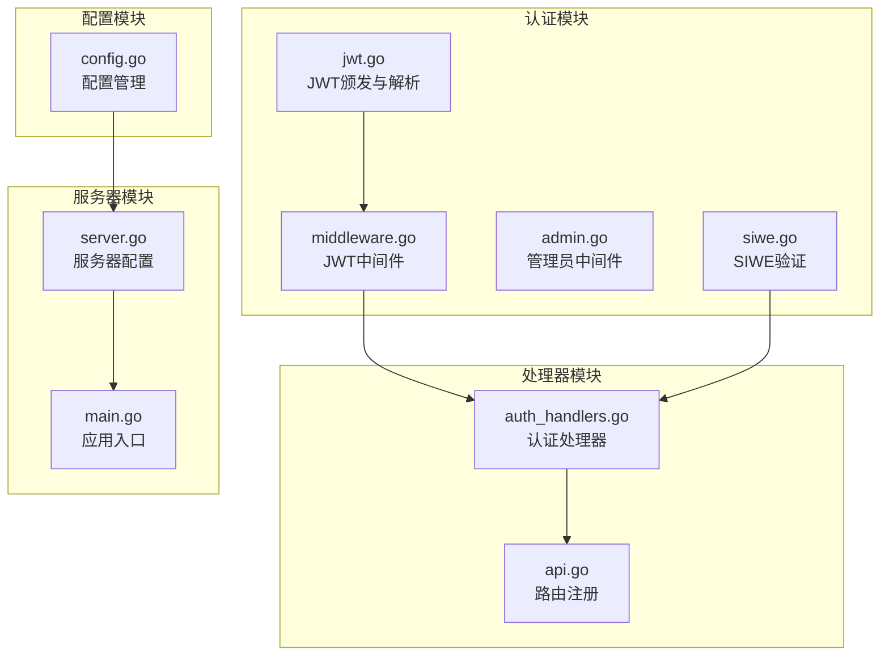
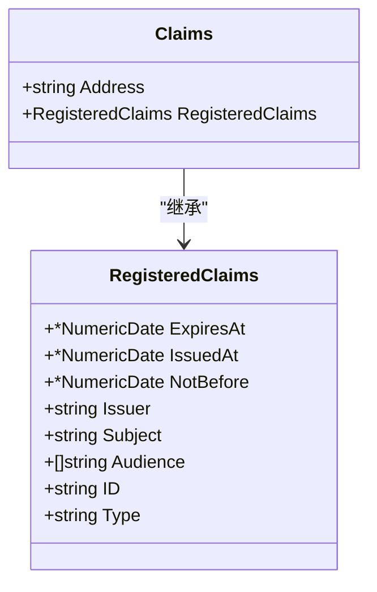
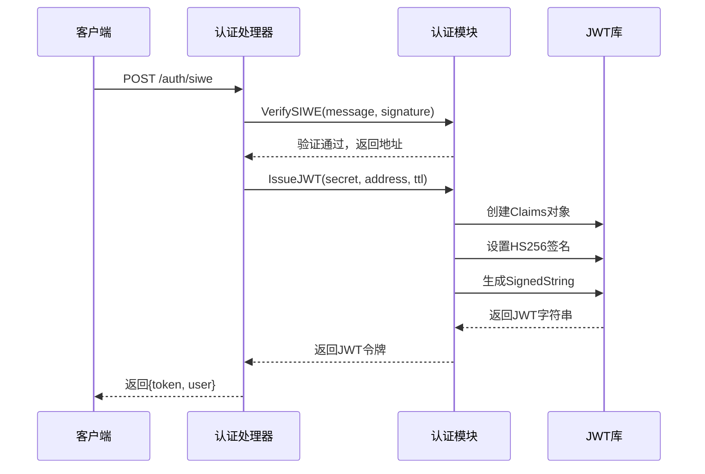
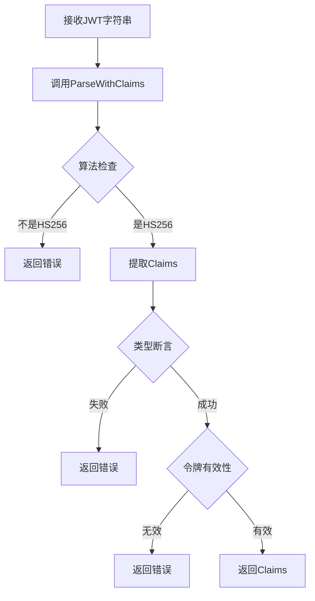
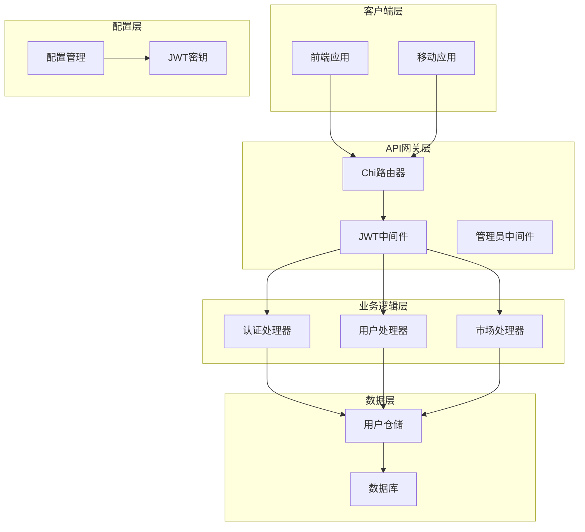
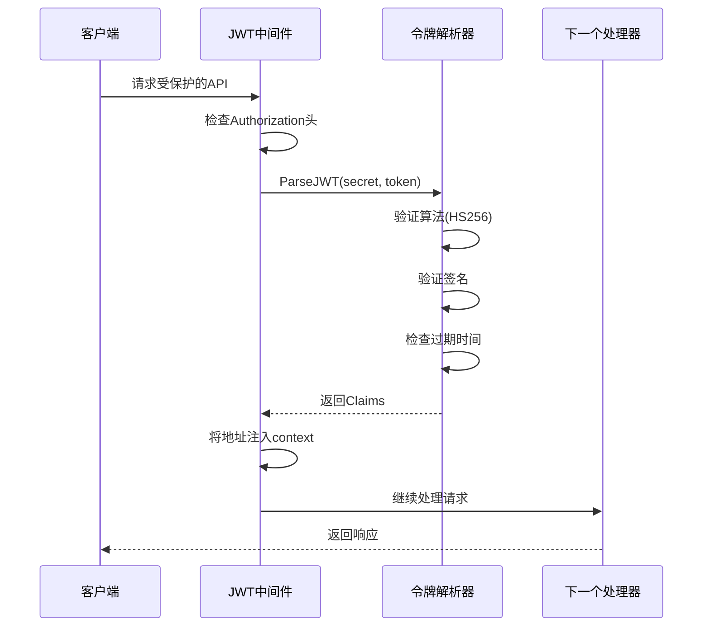
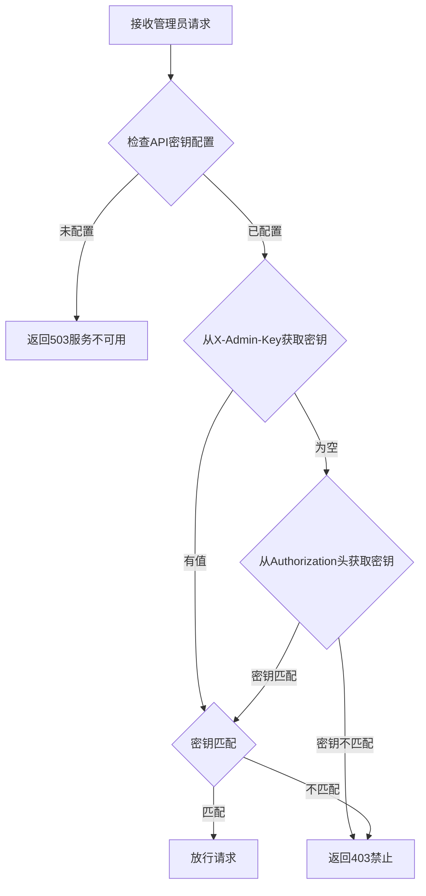
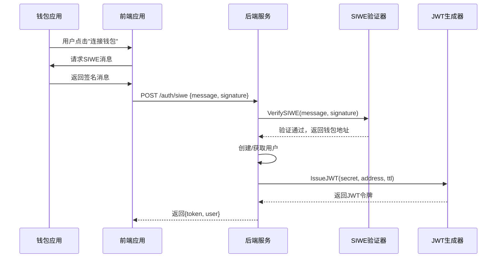
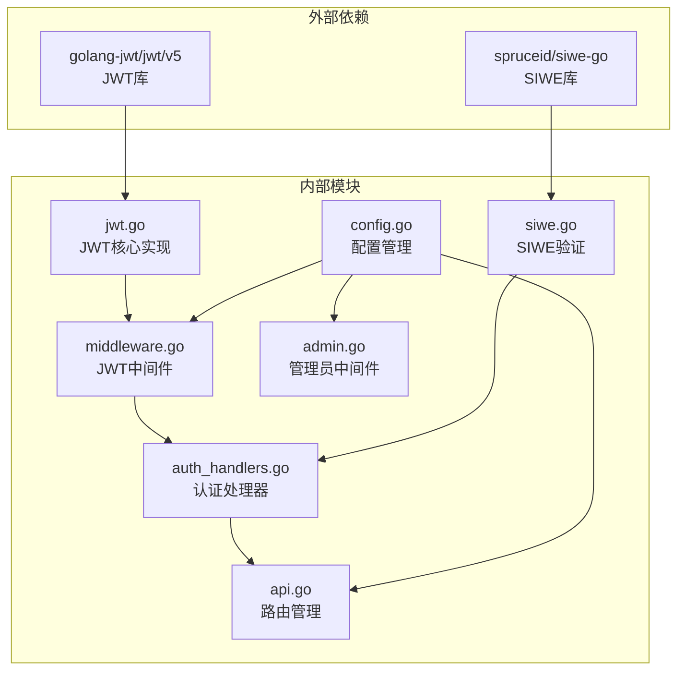
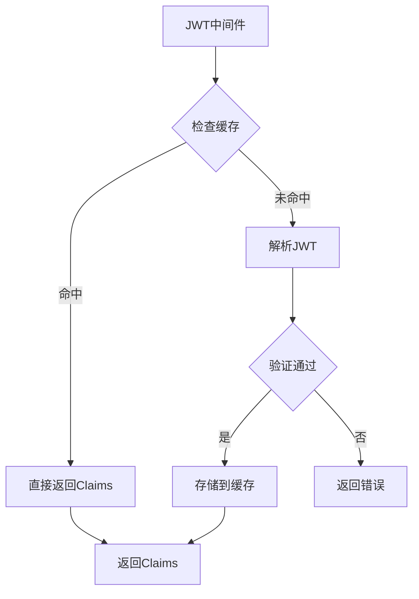

# JWT认证机制

<cite>
**本文档引用的文件**
- [jwt.go](file://internal/auth/jwt.go)
- [middleware.go](file://internal/auth/middleware.go)
- [admin.go](file://internal/auth/admin.go)
- [siwe.go](file://internal/auth/siwe.go)
- [auth_handlers.go](file://internal/handler/auth_handlers.go)
- [api.go](file://internal/handler/api.go)
- [config.go](file://internal/config/config.go)
- [server.go](file://internal/server/server.go)
- [main.go](file://cmd/api/main.go)
</cite>

## 目录
1. [简介](#简介)
2. [项目结构](#项目结构)
3. [核心组件](#核心组件)
4. [架构概览](#架构概览)
5. [详细组件分析](#详细组件分析)
6. [依赖关系分析](#依赖关系分析)
7. [性能考虑](#性能考虑)
8. [故障排除指南](#故障排除指南)
9. [结论](#结论)

## 简介

PredictionDIDSimple项目采用基于JWT（JSON Web Token）的认证机制，结合SIWE（Sign-In with Ethereum）协议实现去中心化身份认证。该认证系统提供了完整的用户身份验证、授权和会话管理功能，支持钱包地址作为用户标识符，并通过HS256算法进行令牌签名。

JWT认证机制在项目中扮演着核心角色，负责：
- 用户身份验证和授权
- 会话状态管理
- API访问控制
- 与SIWE协议的集成

## 项目结构

JWT认证机制主要分布在以下模块中：



**图表来源**
- [jwt.go:1-58](file://internal/auth/jwt.go#L1-L58)
- [middleware.go:1-50](file://internal/auth/middleware.go#L1-L50)
- [auth_handlers.go:1-98](file://internal/handler/auth_handlers.go#L1-L98)

**章节来源**
- [jwt.go:1-58](file://internal/auth/jwt.go#L1-L58)
- [middleware.go:1-50](file://internal/auth/middleware.go#L1-L50)
- [auth_handlers.go:1-98](file://internal/handler/auth_handlers.go#L1-L98)

## 核心组件

### JWT Claims结构设计

JWT认证系统的核心是自定义的Claims结构，它扩展了标准的注册声明：



**图表来源**
- [jwt.go:13-17](file://internal/auth/jwt.go#L13-L17)

关键特性：
- **Address字段**：存储标准化的钱包地址（小写形式）
- **RegisteredClaims**：包含标准JWT声明，如过期时间、签发时间等
- **标准化处理**：自动将钱包地址转换为小写，确保一致性

### IssueJWT函数实现

IssueJWT函数负责生成JWT令牌：



**图表来源**
- [auth_handlers.go:19-53](file://internal/handler/auth_handlers.go#L19-L53)
- [jwt.go:19-34](file://internal/auth/jwt.go#L19-L34)

**章节来源**
- [jwt.go:19-34](file://internal/auth/jwt.go#L19-L34)
- [auth_handlers.go:19-53](file://internal/handler/auth_handlers.go#L19-L53)

### ParseJWT函数工作原理

ParseJWT函数负责解析和验证JWT令牌：



**图表来源**
- [jwt.go:36-57](file://internal/auth/jwt.go#L36-L57)

**章节来源**
- [jwt.go:36-57](file://internal/auth/jwt.go#L36-L57)

## 架构概览

JWT认证机制在整个系统中的位置和交互关系：



**图表来源**
- [api.go:33-69](file://internal/handler/api.go#L33-L69)
- [server.go:44-102](file://internal/server/server.go#L44-L102)

**章节来源**
- [api.go:33-69](file://internal/handler/api.go#L33-L69)
- [server.go:44-102](file://internal/server/server.go#L44-L102)

## 详细组件分析

### JWT中间件实现

JWT中间件负责拦截受保护的API请求并验证JWT令牌：



**图表来源**
- [middleware.go:17-43](file://internal/auth/middleware.go#L17-L43)

**章节来源**
- [middleware.go:17-43](file://internal/auth/middleware.go#L17-L43)

### 管理员中间件实现

管理员中间件提供额外的访问控制层：



**图表来源**
- [admin.go:10-37](file://internal/auth/admin.go#L10-L37)

**章节来源**
- [admin.go:10-37](file://internal/auth/admin.go#L10-L37)

### SIWE集成机制

SIWE（Sign-In with Ethereum）协议与JWT的集成流程：



**图表来源**
- [auth_handlers.go:19-53](file://internal/handler/auth_handlers.go#L19-L53)
- [siwe.go:20-60](file://internal/auth/siwe.go#L20-L60)

**章节来源**
- [auth_handlers.go:19-53](file://internal/handler/auth_handlers.go#L19-L53)
- [siwe.go:20-60](file://internal/auth/siwe.go#L20-L60)

### API路由中的JWT应用

JWT中间件在API路由中的应用方式：

```mermaid
graph LR
subgraph "公开接口"
A[/matches<br/>/markets<br/>/stats]
end
subgraph "认证接口"
B[/auth/siwe<br/>/auth/verify-vc]
end
subgraph "JWT受保护接口"
C[/me/positions<br/>/users/bind-did<br/>/users/me/credentials]
end
subgraph "管理员接口"
D[/admin/oracle-jobs<br/>/admin/markets<br/>/credentials/issue]
end
A --> E[无需认证]
B --> F[SIWE认证]
F --> G[JWT中间件]
G --> C
D --> H[管理员中间件]
H --> I[JWT中间件]
```

**图表来源**
- [api.go:33-69](file://internal/handler/api.go#L33-L69)

**章节来源**
- [api.go:33-69](file://internal/handler/api.go#L33-L69)

## 依赖关系分析

JWT认证机制的依赖关系图：



**图表来源**
- [jwt.go:10](file://internal/auth/jwt.go#L10)
- [siwe.go:11](file://internal/auth/siwe.go#L11)

**章节来源**
- [jwt.go:10](file://internal/auth/jwt.go#L10)
- [siwe.go:11](file://internal/auth/siwe.go#L11)

## 性能考虑

### JWT令牌性能优化

1. **令牌大小优化**
   - Claims结构最小化，仅包含必要字段
   - 钱包地址标准化为小写，减少存储空间

2. **签名算法选择**
   - 使用HS256算法，性能优于RS256
   - 对称密钥签名，避免公私钥操作开销

3. **内存管理**
   - 令牌解析后立即释放，避免内存泄漏
   - 使用轻量级中间件，减少请求处理延迟

### 缓存策略



### 并发处理

- 中间件设计为并发安全
- JWT解析使用无状态操作
- 支持高并发请求处理

## 故障排除指南

### 常见JWT错误处理

| 错误类型 | 可能原因 | 解决方案 |
|---------|---------|---------|
| 未授权 | Authorization头缺失或格式错误 | 确保使用"Bearer <token>"格式 |
| 无效令牌 | 签名验证失败或算法不匹配 | 检查JWT密钥和算法设置 |
| 令牌过期 | ExpiresAt时间早于当前时间 | 重新登录获取新令牌 |
| 地址不匹配 | 钱包地址格式错误 | 确保使用有效的以太坊地址 |

### 调试技巧

1. **令牌验证**
   ```bash
   # 使用jwt.io验证令牌
   curl -H "Authorization: Bearer <your-token>" \
        http://localhost:8080/me/positions
   ```

2. **日志分析**
   - 检查服务器日志中的认证错误
   - 监控401和403状态码的出现频率

3. **配置验证**
   - 确认JWT_SECRET环境变量正确设置
   - 验证SIWE配置参数（DOMAIN和URI）

**章节来源**
- [middleware.go:24-35](file://internal/auth/middleware.go#L24-L35)
- [jwt.go:47-56](file://internal/auth/jwt.go#L47-L56)

## 结论

PredictionDIDSimple项目的JWT认证机制设计合理，实现了以下关键目标：

1. **安全性**：采用HS256对称签名算法，配合严格的令牌验证流程
2. **易用性**：与SIWE协议无缝集成，简化了去中心化身份认证
3. **可维护性**：模块化设计，职责分离清晰
4. **性能**：优化的令牌处理流程，支持高并发场景

### 最佳实践建议

1. **密钥管理**
   - 使用强随机密钥，定期轮换
   - 在生产环境中使用环境变量管理密钥
   - 实施密钥权限控制

2. **令牌配置**
   - 根据业务需求设置合适的TTL
   - 考虑实现刷新令牌机制
   - 监控令牌使用情况

3. **安全加固**
   - 实施CSRF防护
   - 使用HTTPS传输
   - 考虑添加令牌撤销机制

4. **监控与审计**
   - 记录认证日志
   - 监控异常访问模式
   - 定期安全评估

该JWT认证机制为PredictionDIDSimple项目提供了坚实的身份认证基础，支持去中心化身份验证和API访问控制，为后续功能扩展奠定了良好的技术基础。