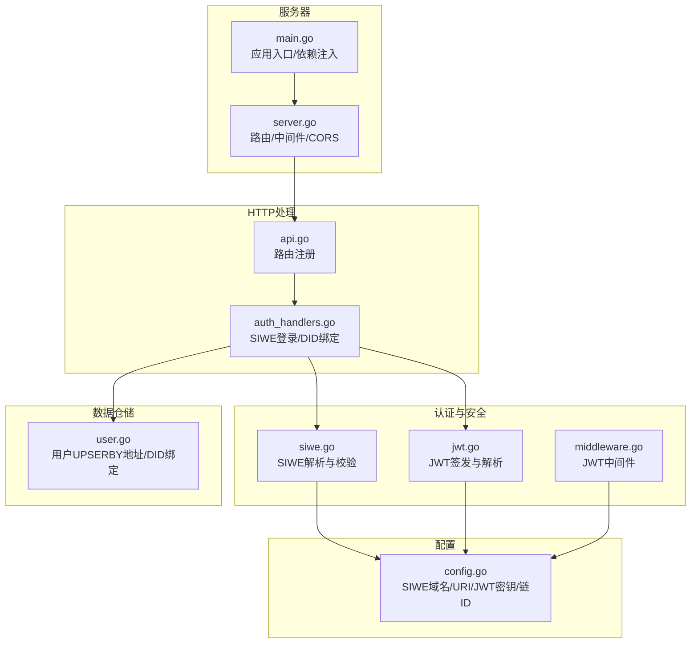
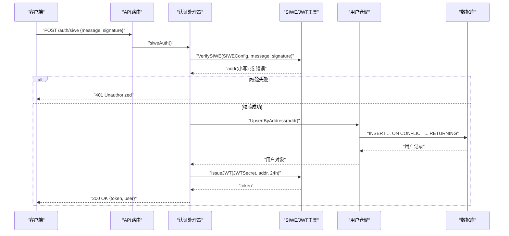
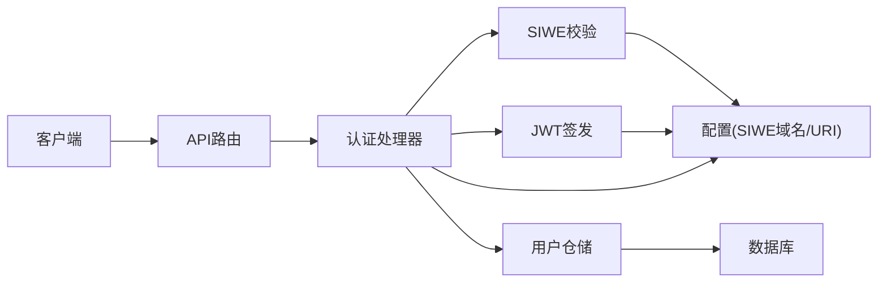
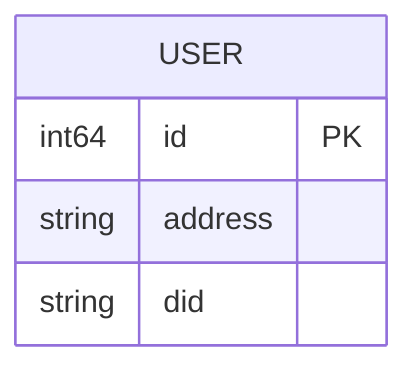

# SIWE集成

<cite>
**本文档引用的文件**
- [siwe.go](file://internal/auth/siwe.go)
- [jwt.go](file://internal/auth/jwt.go)
- [middleware.go](file://internal/auth/middleware.go)
- [auth_handlers.go](file://internal/handler/auth_handlers.go)
- [api.go](file://internal/handler/api.go)
- [config.go](file://internal/config/config.go)
- [user.go](file://internal/repository/user.go)
- [server.go](file://internal/server/server.go)
- [main.go](file://cmd/api/main.go)
</cite>

## 目录
1. [简介](#简介)
2. [项目结构](#项目结构)
3. [核心组件](#核心组件)
4. [架构总览](#架构总览)
5. [详细组件分析](#详细组件分析)
6. [依赖关系分析](#依赖关系分析)
7. [性能考虑](#性能考虑)
8. [故障排查指南](#故障排查指南)
9. [结论](#结论)
10. [附录](#附录)

## 简介
本文件面向PredictionDIDSimple后端的SIWE（Sign-In with Ethereum）集成，系统性阐述SIWE协议工作原理、消息格式与校验要点、域名与URI白名单、过期时间校验、nonce机制现状与建议、以及与DID绑定的实现细节。文档同时给出API使用示例、配置项说明、常见问题排查与最佳实践，帮助开发者快速正确地在生产环境中部署与维护SIWE认证。

## 项目结构
SIWE相关逻辑主要分布在以下模块：
- 认证与安全：SIWE解析与校验、JWT签发与解析、JWT中间件
- HTTP处理：SIWE登录与DID绑定接口
- 配置：SIWE域名与URI白名单、JWT密钥、链ID等
- 数据仓储：用户UPSERBY地址、DID绑定、按地址查询用户
- 服务器：路由注册、CORS、中间件装配

图表来源
- [siwe.go:1-75](file://internal/auth/siwe.go#L1-L75)
- [jwt.go:1-58](file://internal/auth/jwt.go#L1-L58)
- [middleware.go:1-50](file://internal/auth/middleware.go#L1-L50)
- [auth_handlers.go:1-98](file://internal/handler/auth_handlers.go#L1-L98)
- [api.go:1-83](file://internal/handler/api.go#L1-L83)
- [config.go:1-139](file://internal/config/config.go#L1-L139)
- [user.go:1-71](file://internal/repository/user.go#L1-L71)
- [server.go:1-129](file://internal/server/server.go#L1-L129)
- [main.go:1-161](file://cmd/api/main.go#L1-L161)

章节来源
- [siwe.go:1-75](file://internal/auth/siwe.go#L1-L75)
- [jwt.go:1-58](file://internal/auth/jwt.go#L1-L58)
- [middleware.go:1-50](file://internal/auth/middleware.go#L1-L50)
- [auth_handlers.go:1-98](file://internal/handler/auth_handlers.go#L1-L98)
- [api.go:1-83](file://internal/handler/api.go#L1-L83)
- [config.go:1-139](file://internal/config/config.go#L1-L139)
- [user.go:1-71](file://internal/repository/user.go#L1-L71)
- [server.go:1-129](file://internal/server/server.go#L1-L129)
- [main.go:1-161](file://cmd/api/main.go#L1-L161)

## 核心组件
- SIWE解析与校验：负责解析SIWE消息、校验域名与URI白名单、过期时间、调用库函数进行签名验证，并返回标准化的小写钱包地址。
- JWT签发与解析：基于HS256签发短期令牌，解析并校验令牌有效性与签名算法。
- JWT中间件：从Authorization头提取Bearer Token，解析并注入已认证地址到请求上下文。
- SIWE登录处理器：接收SIWE消息与签名，调用SIWE校验，创建/更新用户，签发JWT。
- DID绑定处理器：校验DID格式与链ID+地址匹配，写入数据库。
- 配置：提供SIWE域名与URI白名单、JWT密钥、链ID等运行时参数。
- 用户仓储：按地址UPSERBY、绑定DID、按地址查询用户。

章节来源
- [siwe.go:14-74](file://internal/auth/siwe.go#L14-L74)
- [jwt.go:13-57](file://internal/auth/jwt.go#L13-L57)
- [middleware.go:17-49](file://internal/auth/middleware.go#L17-L49)
- [auth_handlers.go:19-84](file://internal/handler/auth_handlers.go#L19-L84)
- [config.go:12-46](file://internal/config/config.go#L12-L46)
- [user.go:25-70](file://internal/repository/user.go#L25-L70)

## 架构总览
SIWE认证流程在后端的调用序列如下：

图表来源
- [auth_handlers.go:19-53](file://internal/handler/auth_handlers.go#L19-L53)
- [siwe.go:20-60](file://internal/auth/siwe.go#L20-L60)
- [jwt.go:19-34](file://internal/auth/jwt.go#L19-L34)
- [user.go:25-43](file://internal/repository/user.go#L25-L43)

章节来源
- [auth_handlers.go:19-53](file://internal/handler/auth_handlers.go#L19-L53)
- [siwe.go:20-60](file://internal/auth/siwe.go#L20-L60)
- [jwt.go:19-34](file://internal/auth/jwt.go#L19-L34)
- [user.go:25-43](file://internal/repository/user.go#L25-L43)

## 详细组件分析

### SIWE协议与消息校验
- 消息解析：使用siwe-go库解析传入的SIWE消息文本。
- 域名校验：要求消息中的域名与配置的SIWE域名一致。
- URI校验：要求消息中的URI与配置的SIWE URI一致（严格比较）。
- 过期时间校验：若消息包含过期时间，解析后与当前时间比较，过期则拒绝。
- 签名校验：调用库函数对签名进行验证，验证通过后提取钱包地址并转为小写返回。
- 注意：当前实现未显式校验nonce字段，但siwe-go库内部会处理nonce，因此无需额外实现。

章节来源
- [siwe.go:20-60](file://internal/auth/siwe.go#L20-L60)

### JWT签发与中间件
- JWT签发：使用HS256算法，Claims包含地址（小写）、签发时间与过期时间，默认24小时有效期。
- JWT解析：限制签名算法为HS256，解析并校验令牌有效性，失败返回错误。
- JWT中间件：从Authorization头提取Bearer Token，解析后将地址注入到请求上下文中，后续接口可通过工具函数读取。

章节来源
- [jwt.go:13-57](file://internal/auth/jwt.go#L13-L57)
- [middleware.go:17-49](file://internal/auth/middleware.go#L17-L49)

### SIWE登录API与DID绑定API
- SIWE登录接口：POST /auth/siwe，请求体包含message与signature。后端校验SIWE，创建/更新用户，签发JWT并返回token与用户信息。
- DID绑定接口：POST /users/bind-did，需要JWT认证。请求体包含did与signature。后端校验DID格式与链ID+地址匹配，写入数据库并返回最新用户信息。
- 路由注册：公开接口与需要JWT认证的接口分别注册，JWT中间件在组内生效。

章节来源
- [auth_handlers.go:19-84](file://internal/handler/auth_handlers.go#L19-L84)
- [api.go:33-69](file://internal/handler/api.go#L33-L69)

### 配置项与环境变量
- SIWE域名白名单：SIWEDomain
- SIWE URI白名单：SIWEURI
- JWT密钥：JWTSecret
- 链ID：ChainID（用于DID绑定校验）
- 其他：HTTP端口、数据库URL、Redis、以太坊RPC、合约地址等

章节来源
- [config.go:12-46](file://internal/config/config.go#L12-L46)
- [config.go:48-104](file://internal/config/config.go#L48-L104)

### 数据模型与仓储
- 用户模型：包含地址与可选DID。
- 用户仓储：按地址UPSERBY、绑定DID、按地址查询用户。
- DID绑定：存储用户DID，便于后续身份关联与凭证发放。

章节来源
- [models.go:57-62](file://internal/models/models.go#L57-L62)
- [user.go:25-70](file://internal/repository/user.go#L25-L70)

### 服务器与路由
- 服务器装配：注册全局中间件（日志、恢复、速率限制、地理封锁、CORS），初始化健康检查与API处理器。
- 路由注册：公开接口、SIWE登录、JWT认证组、管理员组。
- CORS：允许指定前端来源与凭证传递。

章节来源
- [server.go:40-102](file://internal/server/server.go#L40-L102)
- [api.go:33-69](file://internal/handler/api.go#L33-L69)

## 依赖关系分析
SIWE集成涉及的主要依赖关系如下：

图表来源
- [auth_handlers.go:19-53](file://internal/handler/auth_handlers.go#L19-L53)
- [siwe.go:20-60](file://internal/auth/siwe.go#L20-L60)
- [jwt.go:19-34](file://internal/auth/jwt.go#L19-L34)
- [user.go:25-43](file://internal/repository/user.go#L25-L43)
- [config.go:12-46](file://internal/config/config.go#L12-L46)

章节来源
- [auth_handlers.go:19-53](file://internal/handler/auth_handlers.go#L19-L53)
- [siwe.go:20-60](file://internal/auth/siwe.go#L20-L60)
- [jwt.go:19-34](file://internal/auth/jwt.go#L19-L34)
- [user.go:25-43](file://internal/repository/user.go#L25-L43)
- [config.go:12-46](file://internal/config/config.go#L12-L46)

## 性能考虑
- SIWE解析与签名验证：依赖siwe-go库，单次校验开销较小，适合高并发场景。
- JWT签发与解析：HS256算法轻量，解析复杂度低，适合高频认证。
- 数据库操作：UPSERBY与DID绑定均为简单写入，建议配合索引优化（address唯一索引）。
- 中间件：日志、恢复、速率限制、地理封锁等中间件对性能影响可控，建议根据业务调整阈值。

[本节为通用指导，不直接分析具体文件]

## 故障排查指南
- 域名不匹配
  - 现象：返回“domain mismatch”。
  - 排查：确认SIWE消息中的域名与配置的SIWEDomain一致。
  - 参考：[siwe.go:27-30](file://internal/auth/siwe.go#L27-L30)
- URI不匹配
  - 现象：返回“uri mismatch”。
  - 排查：确认SIWE消息中的URI与配置的SIWEURI完全一致（包含协议、主机、端口、路径）。
  - 参考：[siwe.go:31-41](file://internal/auth/siwe.go#L31-L41)
- 消息过期
  - 现象：返回“message expired”。
  - 排查：检查客户端时间同步，确认SIWE消息的过期时间在未来。
  - 参考：[siwe.go:42-49](file://internal/auth/siwe.go#L42-L49)
- 签名验证失败
  - 现象：返回“verify: ...”。
  - 排查：确认钱包签名与消息内容一致，签名算法与链上适配；检查siwe-go库版本兼容性。
  - 参考：[siwe.go:50-55](file://internal/auth/siwe.go#L50-L55)
- JWT解析失败
  - 现象：返回“invalid token”或“unexpected signing method”。
  - 排查：确认Authorization头格式为“Bearer <token>”，JWT密钥与签发时一致，算法为HS256。
  - 参考：[jwt.go:36-57](file://internal/auth/jwt.go#L36-L57)
- DID格式不匹配
  - 现象：返回“did must be did:pkh:eip155:<chain>:<address>”。
  - 排查：确认DID遵循did:pkh:eip155:chainId:lowercaseAddress格式，且与当前链ID一致。
  - 参考：[siwe.go:62-74](file://internal/auth/siwe.go#L62-L74)
- nonce机制
  - 现状：当前实现未显式校验nonce，siwe-go库内部处理nonce，建议在客户端生成唯一nonce并在消息中体现，服务端可扩展显式校验以增强安全性。
  - 参考：[siwe.go:20-60](file://internal/auth/siwe.go#L20-L60)

章节来源
- [siwe.go:20-74](file://internal/auth/siwe.go#L20-L74)
- [jwt.go:36-57](file://internal/auth/jwt.go#L36-L57)

## 结论
本项目采用成熟的siwe-go库完成SIWE消息解析与签名验证，结合HS256 JWT实现短期会话管理，并通过路由组与中间件实现统一的认证保护。DID绑定采用did:pkh:eip155规范，当前服务端对签名不做二次校验，依赖JWT信任链。整体方案简洁可靠，易于扩展与维护。建议在生产环境补充nonce显式校验与更严格的过期策略，以进一步提升安全性。

[本节为总结性内容，不直接分析具体文件]

## 附录

### API使用示例（路径指引）
- SIWE登录
  - 请求：POST /auth/siwe
  - 请求体字段：message（SIWE消息文本）、signature（钱包签名）
  - 成功响应：token（JWT）、user（用户信息）
  - 参考：[auth_handlers.go:19-53](file://internal/handler/auth_handlers.go#L19-L53)
- 绑定DID
  - 请求：POST /users/bind-did（需要JWT）
  - 请求体字段：did（DID标识符）、signature（签名）
  - 成功响应：user（更新后的用户信息）
  - 参考：[auth_handlers.go:61-84](file://internal/handler/auth_handlers.go#L61-L84)

### 配置项说明
- SIWEDomain：SIWE域名白名单
- SIWEURI：SIWE URI白名单
- JWTSecret：JWT签名密钥
- ChainID：链ID（用于DID绑定校验）
- 其他：HTTP端口、数据库URL、Redis、以太坊RPC、合约地址等
- 参考：[config.go:12-46](file://internal/config/config.go#L12-L46)

### 数据模型图

图表来源
- [models.go:57-62](file://internal/models/models.go#L57-L62)