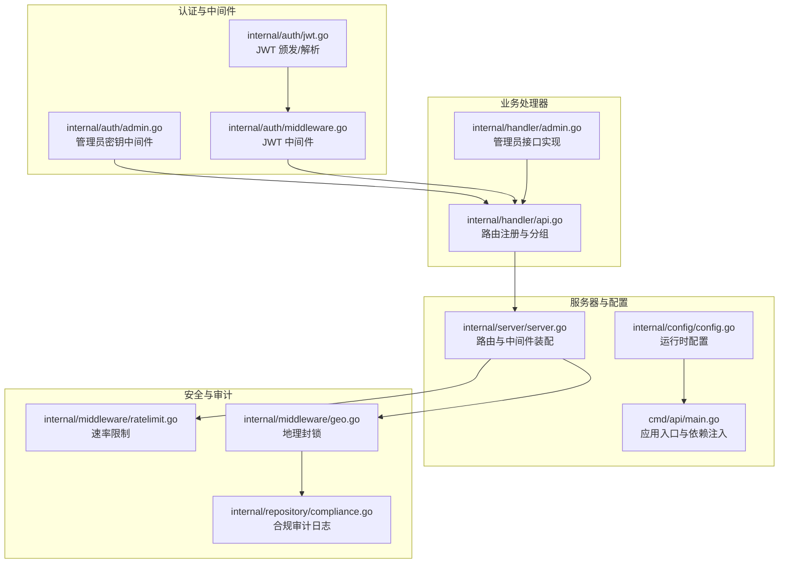
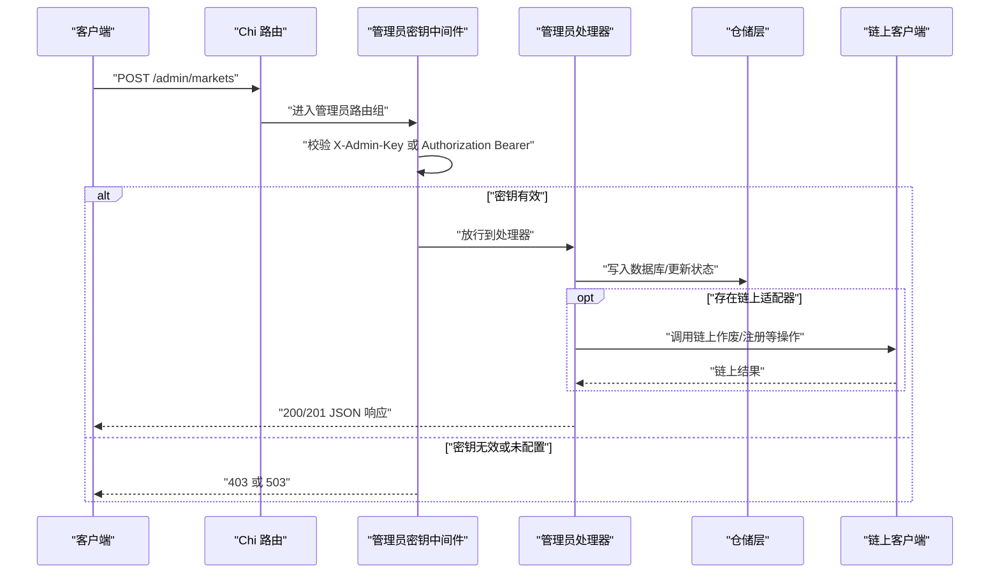
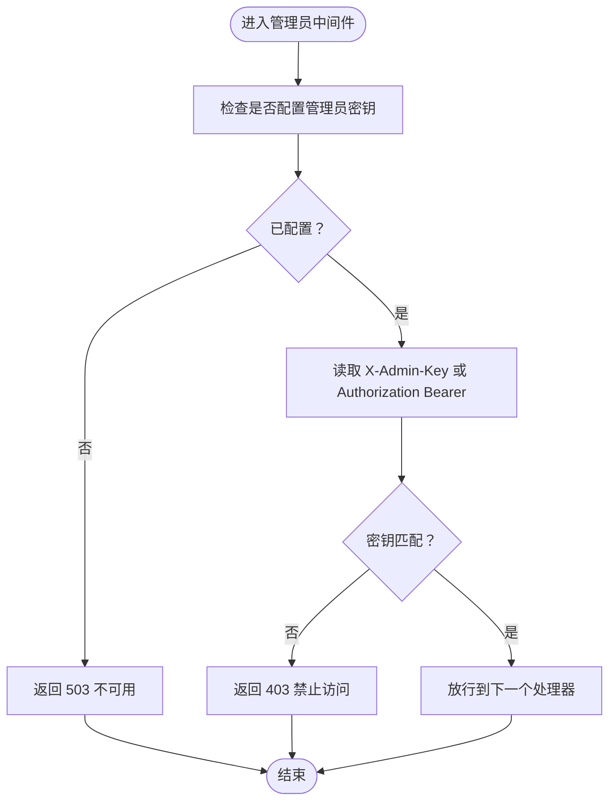
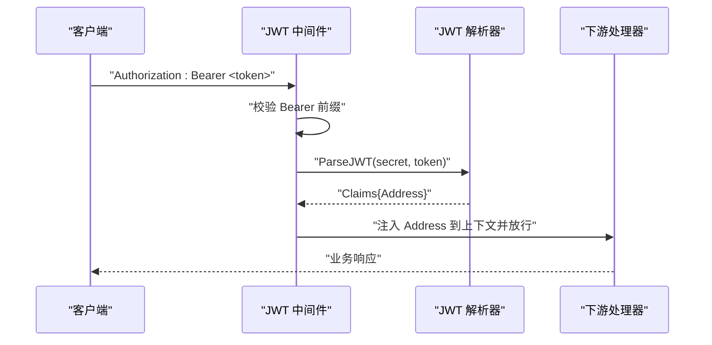
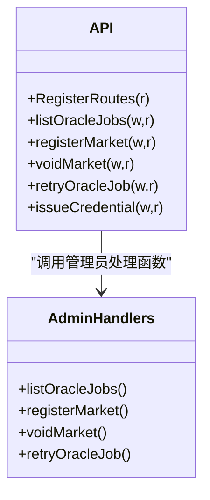
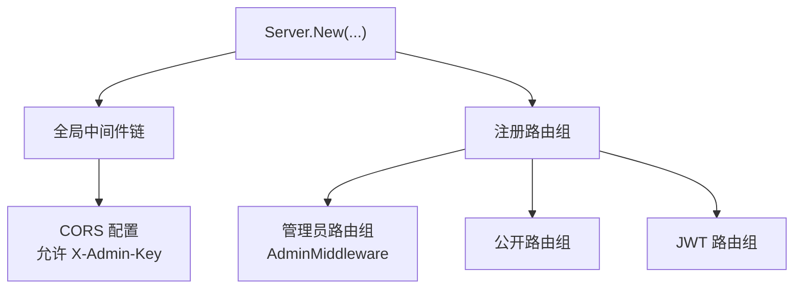
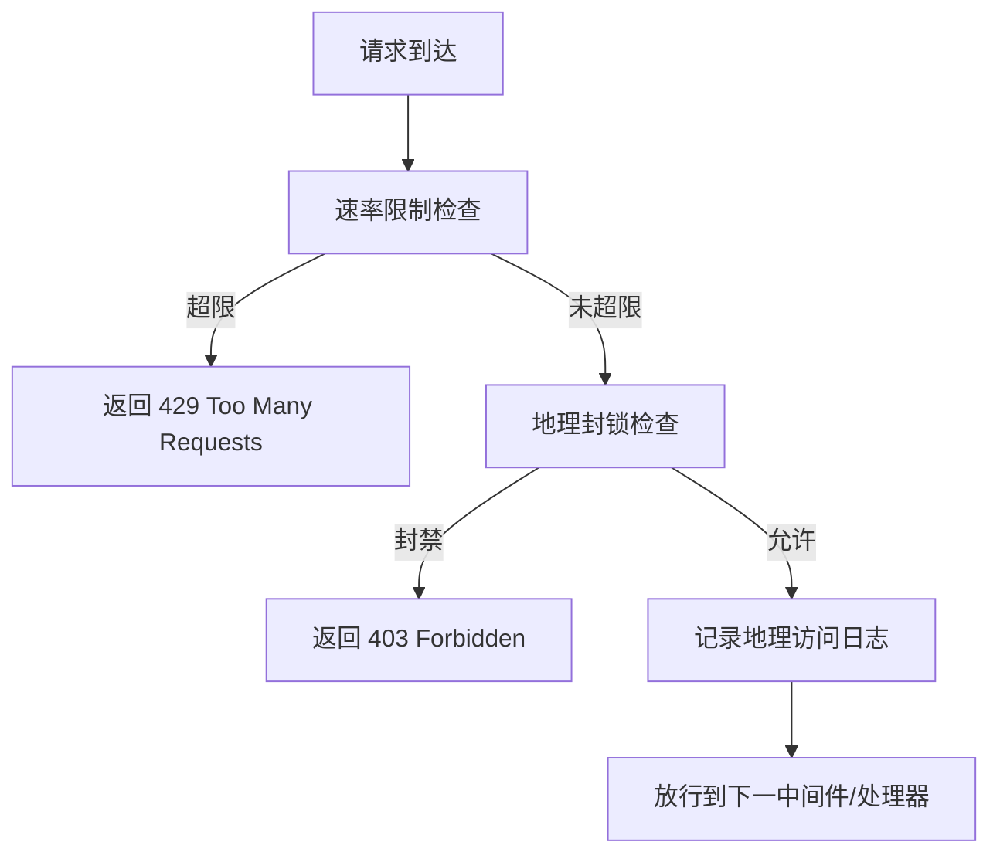
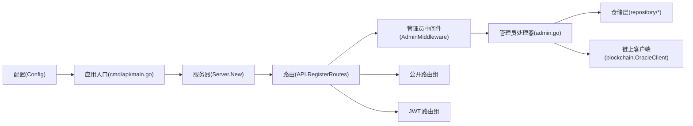

# 管理员权限管理

<cite>
**本文引用的文件**
- [internal/auth/admin.go](file://internal/auth/admin.go)
- [internal/auth/middleware.go](file://internal/auth/middleware.go)
- [internal/auth/jwt.go](file://internal/auth/jwt.go)
- [internal/handler/admin.go](file://internal/handler/admin.go)
- [internal/handler/api.go](file://internal/handler/api.go)
- [internal/server/server.go](file://internal/server/server.go)
- [internal/config/config.go](file://internal/config/config.go)
- [cmd/api/main.go](file://cmd/api/main.go)
- [internal/middleware/ratelimit.go](file://internal/middleware/ratelimit.go)
- [internal/middleware/geo.go](file://internal/middleware/geo.go)
- [internal/repository/compliance.go](file://internal/repository/compliance.go)
</cite>

## 目录
1. [简介](#简介)
2. [项目结构](#项目结构)
3. [核心组件](#核心组件)
4. [架构总览](#架构总览)
5. [详细组件分析](#详细组件分析)
6. [依赖关系分析](#依赖关系分析)
7. [性能考量](#性能考量)
8. [故障排查指南](#故障排查指南)
9. [结论](#结论)
10. [附录](#附录)

## 简介
本文件面向 PredictionDIDSimple 项目的管理员权限管理体系，系统性阐述管理员角色与权限设计、密钥管理机制、权限验证实现、安全措施与配置选项，并提供在 API 中集成管理员功能的具体实践与排障建议。该系统采用“管理员密钥”作为统一的管理员身份凭证，结合路由组与中间件实现细粒度的访问控制，同时辅以速率限制、地理封锁与审计日志等安全与合规措施。

## 项目结构
管理员权限相关的关键代码分布在以下模块：
- 认证与中间件：内部认证与 JWT、管理员密钥中间件
- 业务处理器：管理员专用接口（市场作废、注册、Oracle 任务重试、凭证颁发等）
- 服务器与路由：Chi 路由注册、CORS、全局中间件
- 配置：管理员密钥、速率限制、地理封锁等运行时参数
- 安全中间件：速率限制、地理封锁与合规审计

图表来源
- [internal/auth/admin.go:10-37](file://internal/auth/admin.go#L10-L37)
- [internal/auth/middleware.go:17-49](file://internal/auth/middleware.go#L17-L49)
- [internal/auth/jwt.go:19-57](file://internal/auth/jwt.go#L19-L57)
- [internal/handler/admin.go:12-108](file://internal/handler/admin.go#L12-L108)
- [internal/handler/api.go:33-68](file://internal/handler/api.go#L33-L68)
- [internal/server/server.go:44-102](file://internal/server/server.go#L44-L102)
- [internal/config/config.go:48-104](file://internal/config/config.go#L48-L104)
- [cmd/api/main.go:27-161](file://cmd/api/main.go#L27-L161)
- [internal/middleware/ratelimit.go:42-66](file://internal/middleware/ratelimit.go#L42-L66)
- [internal/middleware/geo.go:12-64](file://internal/middleware/geo.go#L12-L64)
- [internal/repository/compliance.go:21-35](file://internal/repository/compliance.go#L21-L35)

章节来源
- [internal/auth/admin.go:10-37](file://internal/auth/admin.go#L10-L37)
- [internal/handler/api.go:33-68](file://internal/handler/api.go#L33-L68)
- [internal/server/server.go:44-102](file://internal/server/server.go#L44-L102)
- [internal/config/config.go:48-104](file://internal/config/config.go#L48-L104)
- [cmd/api/main.go:27-161](file://cmd/api/main.go#L27-L161)

## 核心组件
- 管理员密钥中间件：负责校验管理员请求的身份凭证，支持两种头部传递方式，未配置时返回服务不可用。
- JWT 中间件与 JWT 工具：为普通用户会话提供基于 JWT 的认证与上下文注入。
- 管理员接口集合：包含 Oracle 任务列表、市场注册与作废、任务重试、凭证颁发等管理操作。
- 路由与服务器装配：通过 Chi 路由组将管理员接口与中间件绑定，统一暴露 REST API。
- 配置系统：集中管理管理员密钥、速率限制、地理封锁等运行时参数。
- 安全中间件：速率限制与地理封锁，以及合规审计日志记录。

章节来源
- [internal/auth/admin.go:10-37](file://internal/auth/admin.go#L10-L37)
- [internal/auth/middleware.go:17-49](file://internal/auth/middleware.go#L17-L49)
- [internal/auth/jwt.go:19-57](file://internal/auth/jwt.go#L19-L57)
- [internal/handler/admin.go:12-108](file://internal/handler/admin.go#L12-L108)
- [internal/handler/api.go:33-68](file://internal/handler/api.go#L33-L68)
- [internal/server/server.go:44-102](file://internal/server/server.go#L44-L102)
- [internal/config/config.go:48-104](file://internal/config/config.go#L48-L104)

## 架构总览
管理员权限体系围绕“密钥中间件 + 路由组”的模式构建，管理员接口被统一置于独立的路由组中，并在进入具体处理器前进行密钥校验。服务器在全局层面集成了速率限制与地理封锁中间件，确保管理员接口在高并发与合规场景下的稳定性与安全性。

图表来源
- [internal/handler/api.go:60-68](file://internal/handler/api.go#L60-L68)
- [internal/auth/admin.go:17-32](file://internal/auth/admin.go#L17-L32)
- [internal/handler/admin.go:74-93](file://internal/handler/admin.go#L74-L93)

## 详细组件分析

### 管理员密钥中间件
- 设计理念：管理员密钥中间件提供统一的身份校验入口，支持通过 X-Admin-Key 或 Authorization: Bearer <key> 两种头部传递方式，提升兼容性与易用性。
- 访问控制策略：
  - 未配置管理员密钥时，直接返回服务不可用，避免误用。
  - 优先从 X-Admin-Key 读取，若为空则回退到 Authorization Bearer。
  - 密钥不匹配时返回禁止访问。
  - 校验通过后放行至后续处理器。
- 安全要点：密钥应仅在受信网络内传输，建议配合 HTTPS 与严格的 CORS 策略。

图表来源
- [internal/auth/admin.go:17-32](file://internal/auth/admin.go#L17-L32)

章节来源
- [internal/auth/admin.go:10-37](file://internal/auth/admin.go#L10-L37)

### JWT 认证与上下文注入
- 设计理念：JWT 中间件用于普通用户会话认证，解析 Authorization: Bearer <token>，校验签名与有效期，并将钱包地址注入到请求上下文中，供后续处理器使用。
- 关键点：
  - 严格限制签名算法为 HS256。
  - 从上下文中提取地址时进行类型断言，失败返回空字符串。
- 与管理员权限的关系：JWT 与管理员密钥中间件分别服务于不同用户群体，互不干扰，共同构成多层级访问控制。

图表来源
- [internal/auth/middleware.go:17-41](file://internal/auth/middleware.go#L17-L41)
- [internal/auth/jwt.go:36-57](file://internal/auth/jwt.go#L36-L57)

章节来源
- [internal/auth/middleware.go:17-49](file://internal/auth/middleware.go#L17-L49)
- [internal/auth/jwt.go:19-57](file://internal/auth/jwt.go#L19-L57)

### 管理员接口与权限范围
- 接口清单（均位于管理员路由组）：
  - 列出 Oracle 任务（支持按状态过滤）
  - 注册市场（写入数据库）
  - 作废市场（链上作废 + 数据库状态更新 + 关联比赛状态变更）
  - 重试失败的 Oracle 任务（重置状态并清空错误消息）
  - 颁发凭证（结合 VC 颁发器）
- 权限级别：以上均为管理员专属操作，属于高权限动作，需严格密钥管控与审计。

图表来源
- [internal/handler/api.go:33-68](file://internal/handler/api.go#L33-L68)
- [internal/handler/admin.go:12-108](file://internal/handler/admin.go#L12-L108)

章节来源
- [internal/handler/admin.go:12-108](file://internal/handler/admin.go#L12-L108)
- [internal/handler/api.go:33-68](file://internal/handler/api.go#L33-L68)

### 路由与服务器装配
- 服务器在初始化时：
  - 注册全局中间件（请求 ID、真实 IP、日志、恢复、速率限制、地理封锁、CORS）。
  - 初始化健康检查与 API 处理器，并注册所有路由。
  - 管理员接口被包裹在独立的路由组中，统一应用管理员密钥中间件。
- CORS 允许的头部包含 X-Admin-Key，确保跨域场景下管理员密钥的传递。

图表来源
- [internal/server/server.go:44-102](file://internal/server/server.go#L44-L102)
- [internal/handler/api.go:60-68](file://internal/handler/api.go#L60-L68)

章节来源
- [internal/server/server.go:44-102](file://internal/server/server.go#L44-L102)
- [internal/handler/api.go:33-68](file://internal/handler/api.go#L33-L68)

### 配置与运行时参数
- 关键配置项：
  - ADMIN_API_KEY：管理员密钥，用于管理员中间件校验。
  - RATE_LIMIT_PER_MINUTE：每分钟速率限制阈值。
  - GEO_BLOCK_ENABLED：是否启用地理封锁。
  - BLOCKED_COUNTRIES：封禁国家列表（逗号分隔）。
  - JWT_SECRET：JWT 签名密钥，用于用户会话认证。
- 配置加载：从环境变量读取并进行类型转换与默认值处理，缺失关键项会报错。

章节来源
- [internal/config/config.go:48-104](file://internal/config/config.go#L48-L104)
- [cmd/api/main.go:27-161](file://cmd/api/main.go#L27-L161)

### 安全中间件与审计
- 速率限制中间件：基于 IP 的滑动窗口限流，默认每分钟允许一定数量请求，健康检查路径豁免。
- 地理封锁中间件：根据请求头检测国家代码，结合配置的封禁列表决定放行或拒绝，并记录审计日志。
- 合规审计：地理封锁中间件回调将访问日志异步写入数据库表，便于审计与合规追踪。

图表来源
- [internal/middleware/ratelimit.go:42-66](file://internal/middleware/ratelimit.go#L42-L66)
- [internal/middleware/geo.go:12-64](file://internal/middleware/geo.go#L12-L64)
- [internal/repository/compliance.go:21-35](file://internal/repository/compliance.go#L21-L35)

章节来源
- [internal/middleware/ratelimit.go:42-66](file://internal/middleware/ratelimit.go#L42-L66)
- [internal/middleware/geo.go:12-64](file://internal/middleware/geo.go#L12-L64)
- [internal/repository/compliance.go:21-35](file://internal/repository/compliance.go#L21-L35)

## 依赖关系分析
- 管理员接口依赖：
  - 路由组：通过 API.RegisterRoutes 将管理员接口注册到 Chi 路由。
  - 中间件：AdminMiddleware 对管理员接口进行统一鉴权。
  - 仓储层：管理员接口调用仓储层执行数据库操作。
  - 链上客户端：在存在 Oracle 适配器时，管理员接口可调用链上操作。
- 服务器装配：
  - Server.New 负责组装全局中间件与路由，确保管理员接口在正确的中间件链下运行。
- 配置注入：
  - cmd/api/main.go 加载配置并注入到 Server.New 与 API 构造函数，形成完整的依赖图。

图表来源
- [cmd/api/main.go:124-131](file://cmd/api/main.go#L124-L131)
- [internal/server/server.go:78-91](file://internal/server/server.go#L78-L91)
- [internal/handler/api.go:33-68](file://internal/handler/api.go#L33-L68)
- [internal/auth/admin.go:12-36](file://internal/auth/admin.go#L12-L36)
- [internal/handler/admin.go:12-108](file://internal/handler/admin.go#L12-L108)

章节来源
- [cmd/api/main.go:124-131](file://cmd/api/main.go#L124-L131)
- [internal/server/server.go:78-91](file://internal/server/server.go#L78-L91)
- [internal/handler/api.go:33-68](file://internal/handler/api.go#L33-L68)
- [internal/auth/admin.go:12-36](file://internal/auth/admin.go#L12-L36)
- [internal/handler/admin.go:12-108](file://internal/handler/admin.go#L12-L108)

## 性能考量
- 速率限制：基于内存的滑动窗口实现，适合中小规模流量；在高并发场景建议引入分布式缓存或更复杂的令牌桶/漏桶算法。
- 地理封锁：依赖请求头国家代码，准确性取决于上游代理提供的头字段；建议在生产环境部署可信的 GeoIP 服务或 CDN 提供的国家头。
- JWT 解析：HS256 签名校验开销较小，但需注意密钥长度与轮换策略，避免频繁重启导致的短期性能波动。
- 管理员接口：通常为低频高权限操作，性能瓶颈主要来自数据库与链上交互，建议对链上调用进行批量与幂等设计。

## 故障排查指南
- 权限不足（403 Forbidden）
  - 确认请求头是否正确传递管理员密钥（X-Admin-Key 或 Authorization Bearer）。
  - 检查服务端是否已配置 ADMIN_API_KEY。
  - 若密钥为空，中间件会返回服务不可用（503），需先配置密钥再测试。
- 密钥失效
  - 密钥轮换后需同步更新所有调用方。
  - 确保密钥在受信网络内传输，避免泄露。
- 权限冲突
  - 管理员接口与普通 JWT 接口互不干扰，确认请求路径与路由组归属。
  - 检查 CORS 配置是否允许 X-Admin-Key 头部。
- 速率限制触发（429 Too Many Requests）
  - 检查 RATE_LIMIT_PER_MINUTE 配置是否过低。
  - 确认健康检查路径未被计入限流。
- 地理封锁拒绝（403 Forbidden）
  - 检查 GEO_BLOCK_ENABLED 与 BLOCKED_COUNTRIES 配置。
  - 确认请求头 CF-IPCountry 或 X-Country-Code 是否正确传入。
- 链上操作失败
  - 确认 Oracle 适配器地址与私钥配置齐全。
  - 检查链上客户端初始化与网络连通性。

章节来源
- [internal/auth/admin.go:17-32](file://internal/auth/admin.go#L17-L32)
- [internal/middleware/ratelimit.go:42-66](file://internal/middleware/ratelimit.go#L42-L66)
- [internal/middleware/geo.go:12-64](file://internal/middleware/geo.go#L12-L64)
- [internal/config/config.go:72-79](file://internal/config/config.go#L72-L79)

## 结论
PredictionDIDSimple 的管理员权限体系以“管理员密钥中间件 + 路由组”为核心，实现了清晰的职责分离与细粒度的访问控制。配合速率限制、地理封锁与合规审计，系统在保证功能性的同时兼顾了安全性与合规性。建议在生产环境中强化密钥轮换与审计留痕，并根据实际流量与合规需求调整限流与地理封锁策略。

## 附录

### 管理员密钥管理机制
- 生成：在安全环境下生成强随机密钥，建议使用操作系统提供的密码学安全随机数生成器。
- 存储：通过环境变量注入，避免硬编码在源码或配置文件中。
- 轮换：采用“双密钥并行 + 渐进切换”的策略，先启用新密钥，逐步替换旧密钥，最后销毁旧密钥。
- 销毁：在密钥不再使用后，立即从所有环境与配置中移除，并撤销相关访问权限。

章节来源
- [internal/config/config.go:72-79](file://internal/config/config.go#L72-L79)
- [internal/auth/admin.go:17-32](file://internal/auth/admin.go#L17-L32)

### 权限验证实现与最佳实践
- 管理员 token 验证：使用管理员密钥中间件统一校验，避免在处理器中重复实现。
- 权限检查逻辑：管理员接口天然具备最高权限，无需二次检查；普通用户权限通过 JWT 中间件注入的地址进行业务级校验。
- 访问控制决策：在路由组层面集中决策，确保所有管理员接口遵循一致的访问策略。

章节来源
- [internal/handler/api.go:60-68](file://internal/handler/api.go#L60-L68)
- [internal/auth/middleware.go:17-41](file://internal/auth/middleware.go#L17-L41)

### 在 API 中实现管理员功能的示例路径
- 注册管理员路由组与中间件：[internal/handler/api.go:60-68](file://internal/handler/api.go#L60-L68)
- 管理员密钥中间件实现：[internal/auth/admin.go:12-36](file://internal/auth/admin.go#L12-L36)
- 管理员接口实现（示例：注册市场）：[internal/handler/admin.go:74-93](file://internal/handler/admin.go#L74-L93)
- 服务器装配与 CORS 配置：[internal/server/server.go:62-67](file://internal/server/server.go#L62-L67)

### 管理员操作的安全措施
- 双重验证：建议在管理员密钥之外增加二次确认流程（如二次弹窗确认、短信验证码等）。
- 操作审计：利用地理封锁中间件回调记录访问日志，结合数据库审计表进行追踪。
- 权限最小化：仅授予完成特定任务所需的最小权限，避免长期持有最高权限。

章节来源
- [internal/middleware/geo.go:12-64](file://internal/middleware/geo.go#L12-L64)
- [internal/repository/compliance.go:21-35](file://internal/repository/compliance.go#L21-L35)

### 管理员权限配置选项
- 管理员白名单：当前实现为单密钥校验，若需白名单可扩展为密钥与用户地址映射表并在中间件中校验。
- 权限继承关系：系统未实现角色继承，管理员接口为独立路由组，权限模型相对扁平。
- 临时权限授予：可通过动态配置或外部授权中心下发临时令牌并在中间件中校验。

章节来源
- [internal/config/config.go:48-104](file://internal/config/config.go#L48-L104)
- [internal/handler/api.go:60-68](file://internal/handler/api.go#L60-L68)