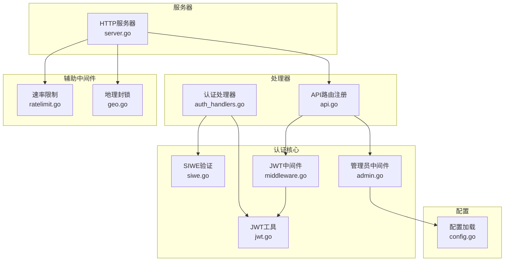
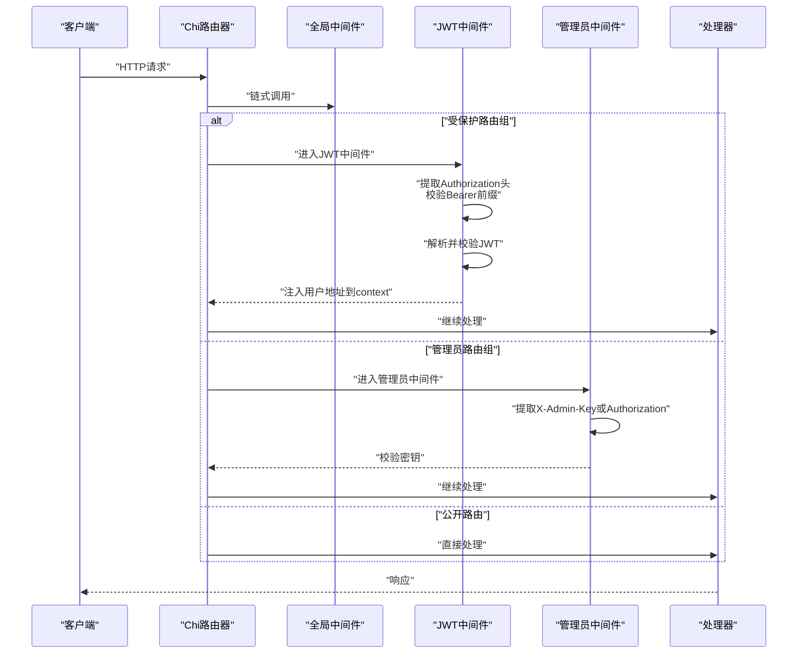
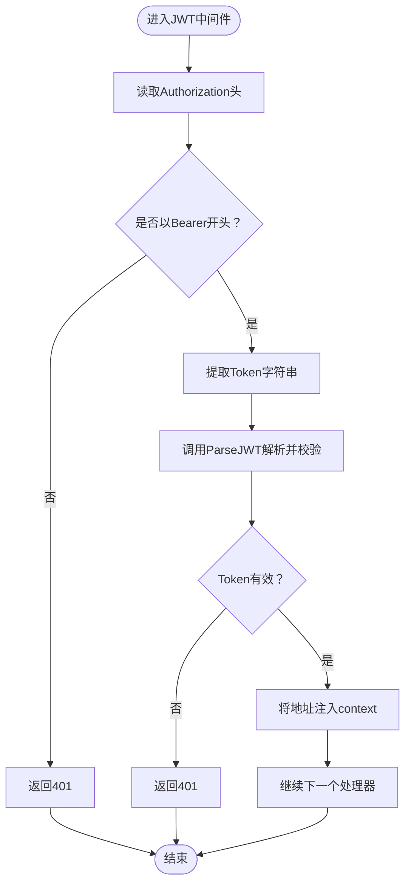
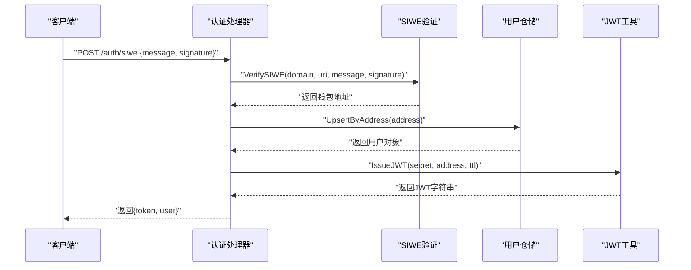
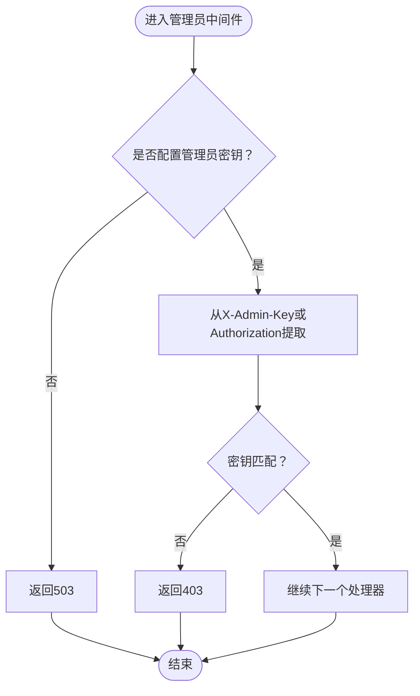
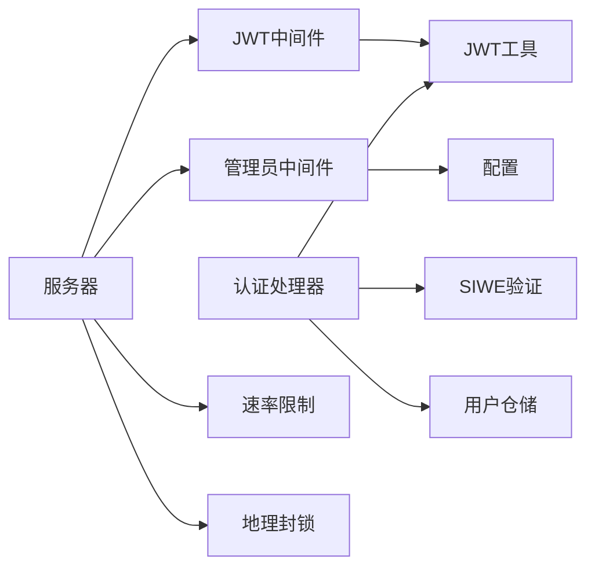

# 认证中间件

<cite>
**本文引用的文件**
- [internal/auth/middleware.go](file://internal/auth/middleware.go)
- [internal/auth/jwt.go](file://internal/auth/jwt.go)
- [internal/auth/siwe.go](file://internal/auth/siwe.go)
- [internal/auth/admin.go](file://internal/auth/admin.go)
- [internal/handler/api.go](file://internal/handler/api.go)
- [internal/handler/auth_handlers.go](file://internal/handler/auth_handlers.go)
- [internal/server/server.go](file://internal/server/server.go)
- [internal/config/config.go](file://internal/config/config.go)
- [internal/middleware/ratelimit.go](file://internal/middleware/ratelimit.go)
- [internal/middleware/geo.go](file://internal/middleware/geo.go)
</cite>

## 目录
1. [简介](#简介)
2. [项目结构](#项目结构)
3. [核心组件](#核心组件)
4. [架构总览](#架构总览)
5. [详细组件分析](#详细组件分析)
6. [依赖分析](#依赖分析)
7. [性能考虑](#性能考虑)
8. [故障排查指南](#故障排查指南)
9. [结论](#结论)
10. [附录](#附录)

## 简介
本文件面向PredictionDIDSimple项目的认证中间件系统，系统性阐述以下主题：
- 中间件链式调用与请求拦截、响应处理机制
- Token解析流程：Authorization头提取、Token格式验证、签名验证、过期检查
- 用户身份验证中间件：JWT解析、SIWE验证、用户信息获取、会话建立
- 权限检查中间件：管理员密钥校验、访问控制决策
- 在Chi路由器中的注册与使用方式：路由保护、权限控制的实际应用
- 中间件配置选项：白名单路由、跳过认证的特殊情况、错误处理策略
- 性能优化建议：缓存策略、异步处理、错误快速返回等最佳实践

## 项目结构
认证相关代码主要分布在以下模块：
- 认证核心：JWT颁发/解析、SIWE验证、管理员鉴权
- 处理器：公开接口、认证接口、受保护接口、管理员接口
- 服务器：Chi路由器初始化、中间件注册、路由注册
- 配置：JWT密钥、SIWE域名/URI、管理员API Key等
- 辅助中间件：速率限制、地理封锁

图表来源
- [internal/server/server.go:44-102](file://internal/server/server.go#L44-L102)
- [internal/handler/api.go:34-69](file://internal/handler/api.go#L34-L69)
- [internal/auth/middleware.go:18-43](file://internal/auth/middleware.go#L18-L43)
- [internal/auth/admin.go:12-37](file://internal/auth/admin.go#L12-L37)
- [internal/auth/jwt.go:19-57](file://internal/auth/jwt.go#L19-L57)
- [internal/auth/siwe.go:20-60](file://internal/auth/siwe.go#L20-L60)
- [internal/middleware/ratelimit.go:42-66](file://internal/middleware/ratelimit.go#L42-L66)
- [internal/middleware/geo.go:14-41](file://internal/middleware/geo.go#L14-L41)

章节来源
- [internal/server/server.go:44-102](file://internal/server/server.go#L44-L102)
- [internal/handler/api.go:34-69](file://internal/handler/api.go#L34-L69)

## 核心组件
- JWT工具：定义Claims结构、颁发JWT、解析并校验JWT（含算法限制、过期检查）
- SIWE验证：解析消息、校验域名/URI、过期时间、签名验证、返回钱包地址
- JWT中间件：从Authorization头提取Bearer Token、解析并校验、注入用户地址到context
- 管理员中间件：从X-Admin-Key或Authorization头提取密钥、对比校验
- 认证处理器：SIWE登录、DID绑定、受保护资源访问
- 服务器与路由：全局中间件注册、路由组与中间件组合使用

章节来源
- [internal/auth/jwt.go:13-57](file://internal/auth/jwt.go#L13-L57)
- [internal/auth/siwe.go:14-60](file://internal/auth/siwe.go#L14-L60)
- [internal/auth/middleware.go:17-49](file://internal/auth/middleware.go#L17-L49)
- [internal/auth/admin.go:10-37](file://internal/auth/admin.go#L10-L37)
- [internal/handler/auth_handlers.go:19-97](file://internal/handler/auth_handlers.go#L19-L97)

## 架构总览
认证中间件在Chi路由器中的工作流如下：
- 全局中间件：请求ID、真实IP、日志、异常恢复、速率限制、地理封锁
- 路由组中间件：
  - JWT中间件：对受保护路由组生效，校验JWT并注入用户地址
  - 管理员中间件：对管理员路由组生效，校验管理员密钥
- 处理器：
  - 公开接口：无需认证
  - 认证接口：SIWE登录，颁发JWT
  - 受保护接口：从context读取用户地址
  - 管理员接口：需要管理员密钥

图表来源
- [internal/server/server.go:47-67](file://internal/server/server.go#L47-L67)
- [internal/handler/api.go:52-68](file://internal/handler/api.go#L52-L68)
- [internal/auth/middleware.go:18-42](file://internal/auth/middleware.go#L18-L42)
- [internal/auth/admin.go:12-36](file://internal/auth/admin.go#L12-L36)

## 详细组件分析

### JWT中间件与Token解析流程
- 请求拦截：从Authorization头提取，要求以Bearer开头
- Token解析：调用ParseJWT进行HS256算法限制、签名验证、过期检查
- 上下文注入：将用户地址注入到context，后续处理器可读取
- 错误处理：非法头、格式错误、签名失败、过期均返回401

图表来源
- [internal/auth/middleware.go:20-41](file://internal/auth/middleware.go#L20-L41)
- [internal/auth/jwt.go:36-57](file://internal/auth/jwt.go#L36-L57)

章节来源
- [internal/auth/middleware.go:17-49](file://internal/auth/middleware.go#L17-L49)
- [internal/auth/jwt.go:19-57](file://internal/auth/jwt.go#L19-L57)

### SIWE验证与用户会话建立
- SIWE验证：解析消息、校验域名/URI、过期时间、签名验证，返回钱包地址
- 用户信息获取：根据地址创建或获取用户
- 会话建立：颁发JWT（含过期时间），返回token与用户信息
- DID绑定：校验DID规范与地址一致性，存储绑定信息

图表来源
- [internal/handler/auth_handlers.go:19-53](file://internal/handler/auth_handlers.go#L19-L53)
- [internal/auth/siwe.go:20-60](file://internal/auth/siwe.go#L20-L60)
- [internal/auth/jwt.go:19-34](file://internal/auth/jwt.go#L19-L34)

章节来源
- [internal/handler/auth_handlers.go:19-97](file://internal/handler/auth_handlers.go#L19-L97)
- [internal/auth/siwe.go:14-75](file://internal/auth/siwe.go#L14-L75)
- [internal/auth/jwt.go:13-58](file://internal/auth/jwt.go#L13-L58)

### 管理员中间件与权限检查
- 管理员密钥来源：优先从X-Admin-Key头，否则从Authorization: Bearer提取
- 校验逻辑：若未配置密钥返回503，密钥不匹配返回403
- 生效范围：通过路由组注册，仅对管理员接口生效

图表来源
- [internal/auth/admin.go:12-36](file://internal/auth/admin.go#L12-L36)

章节来源
- [internal/auth/admin.go:10-38](file://internal/auth/admin.go#L10-L38)

### 在Chi路由器中的注册与使用
- 全局中间件：RequestID、RealIP、Logger、Recoverer、速率限制、地理封锁
- 受保护路由组：使用auth.Middleware包裹，保护我的持仓、DID绑定、我的凭证等
- 管理员路由组：使用auth.AdminMiddleware包裹，保护预言机任务、市场操作、凭证颁发等
- 公开接口：无需认证，如比赛/市场查询、SSE流、指标等

章节来源
- [internal/server/server.go:47-67](file://internal/server/server.go#L47-L67)
- [internal/handler/api.go:34-69](file://internal/handler/api.go#L34-L69)

## 依赖分析
- 认证中间件依赖：
  - JWT工具：ParseJWT、IssueJWT
  - 配置：JWT密钥、管理员API Key
- 处理器依赖：
  - 用户仓储：创建/获取用户
  - SIWE库：消息解析与签名验证
  - JWT库：HS256签名与解析
- 服务器依赖：
  - Chi路由器：中间件链、路由组
  - 辅助中间件：速率限制、地理封锁

图表来源
- [internal/auth/middleware.go:18-43](file://internal/auth/middleware.go#L18-L43)
- [internal/auth/admin.go:12-37](file://internal/auth/admin.go#L12-L37)
- [internal/handler/auth_handlers.go:19-53](file://internal/handler/auth_handlers.go#L19-L53)
- [internal/server/server.go:47-67](file://internal/server/server.go#L47-L67)
- [internal/middleware/ratelimit.go:42-66](file://internal/middleware/ratelimit.go#L42-L66)
- [internal/middleware/geo.go:14-41](file://internal/middleware/geo.go#L14-L41)

章节来源
- [internal/auth/middleware.go:17-49](file://internal/auth/middleware.go#L17-L49)
- [internal/auth/admin.go:10-38](file://internal/auth/admin.go#L10-L38)
- [internal/handler/auth_handlers.go:19-97](file://internal/handler/auth_handlers.go#L19-L97)
- [internal/server/server.go:44-102](file://internal/server/server.go#L44-L102)

## 性能考虑
- 令牌解析缓存
  - 对频繁访问的受保护接口，可在处理器内缓存最近解析成功的JWT结果（按地址+时间戳），减少重复解析开销
- 异步处理
  - 地理封锁日志记录采用回调函数异步写入，避免阻塞主请求链路
  - 速率限制器使用轻量级滑动窗口，避免复杂状态存储
- 错误快速返回
  - JWT中间件在Authorization头格式错误、签名失败、过期时立即返回401，避免继续解析
  - 管理员中间件在密钥不匹配时立即返回403
- 路由白名单
  - 健康检查、指标、事件流等路径在速率限制与地理封锁中被豁免，降低误伤
- 依赖降级
  - Redis不可用时服务降级运行，不影响认证与业务主流程

章节来源
- [internal/middleware/geo.go:14-41](file://internal/middleware/geo.go#L14-L41)
- [internal/middleware/ratelimit.go:42-66](file://internal/middleware/ratelimit.go#L42-L66)
- [internal/auth/middleware.go:20-41](file://internal/auth/middleware.go#L20-L41)
- [internal/auth/admin.go:16-34](file://internal/auth/admin.go#L16-L34)

## 故障排查指南
- 401 未授权
  - 检查Authorization头是否以Bearer开头
  - 确认JWT密钥正确且未过期
  - 核对JWT中地址大小写与预期一致
- 403 禁止访问
  - 管理员接口需提供X-Admin-Key或Authorization: Bearer密钥
  - 确认配置文件中的管理员API Key已正确设置
- 400/422 请求错误
  - SIWE登录请求体格式错误或签名验证失败
  - DID绑定请求体格式错误或DID与地址不匹配
- 503 服务不可用
  - 管理员中间件未配置管理员API Key
- 地理封锁
  - 检查配置中的封禁国家列表与地理检测头
  - 确认路径是否在豁免列表中

章节来源
- [internal/auth/middleware.go:20-41](file://internal/auth/middleware.go#L20-L41)
- [internal/auth/admin.go:16-34](file://internal/auth/admin.go#L16-L34)
- [internal/handler/auth_handlers.go:20-97](file://internal/handler/auth_handlers.go#L20-L97)
- [internal/middleware/geo.go:14-41](file://internal/middleware/geo.go#L14-L41)

## 结论
该认证中间件系统以简洁清晰的方式实现了：
- 基于Bearer Token的JWT认证
- SIWE登录与DID绑定
- 管理员密钥的访问控制
- 与Chi路由器的无缝集成与路由组隔离
- 与速率限制、地理封锁等辅助中间件协同工作

通过合理的错误处理与性能优化策略，系统在保证安全性的同时具备良好的可维护性与扩展性。

## 附录

### 配置选项与默认值
- JWT密钥：JWT_SECRET（生产环境务必更换）
- SIWE域名/URI：SIWE_DOMAIN、SIWE_URI
- 管理员API Key：ADMIN_API_KEY
- 地理封锁：BLOCKED_COUNTRIES、GEO_BLOCK_ENABLED
- 速率限制：RATE_LIMIT_PER_MINUTE

章节来源
- [internal/config/config.go:12-105](file://internal/config/config.go#L12-L105)

### 路由保护与权限控制示例
- 公开接口：无需认证
- 认证接口：POST /auth/siwe、POST /auth/verify-vc
- 受保护接口：GET /me/positions、POST /users/bind-did、GET /users/me/credentials
- 管理员接口：GET /admin/oracle-jobs、POST /admin/markets、POST /admin/markets/{id}/void、POST /admin/oracle-jobs/{id}/retry、POST /credentials/issue

章节来源
- [internal/handler/api.go:34-69](file://internal/handler/api.go#L34-L69)