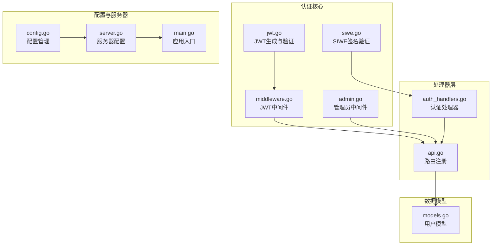
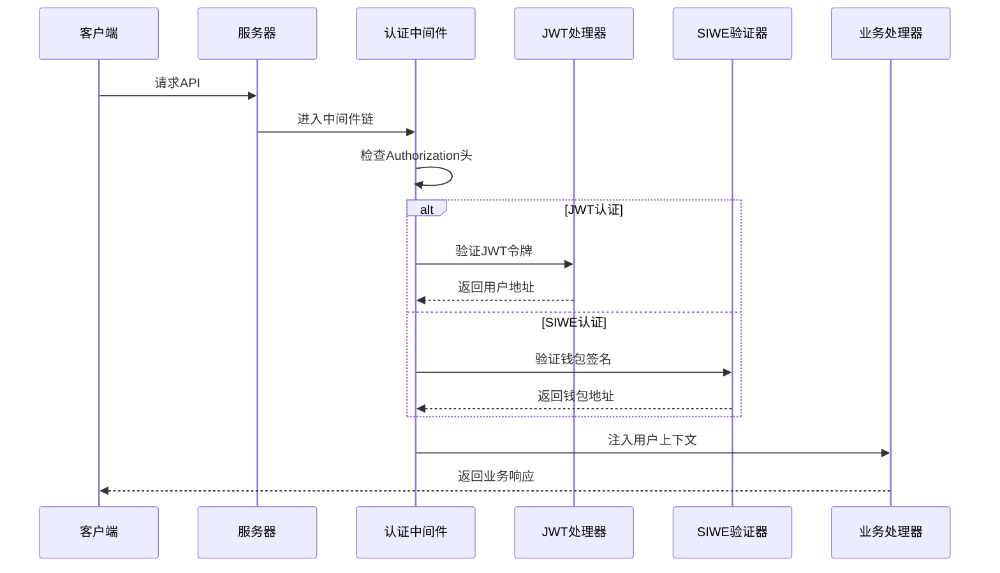
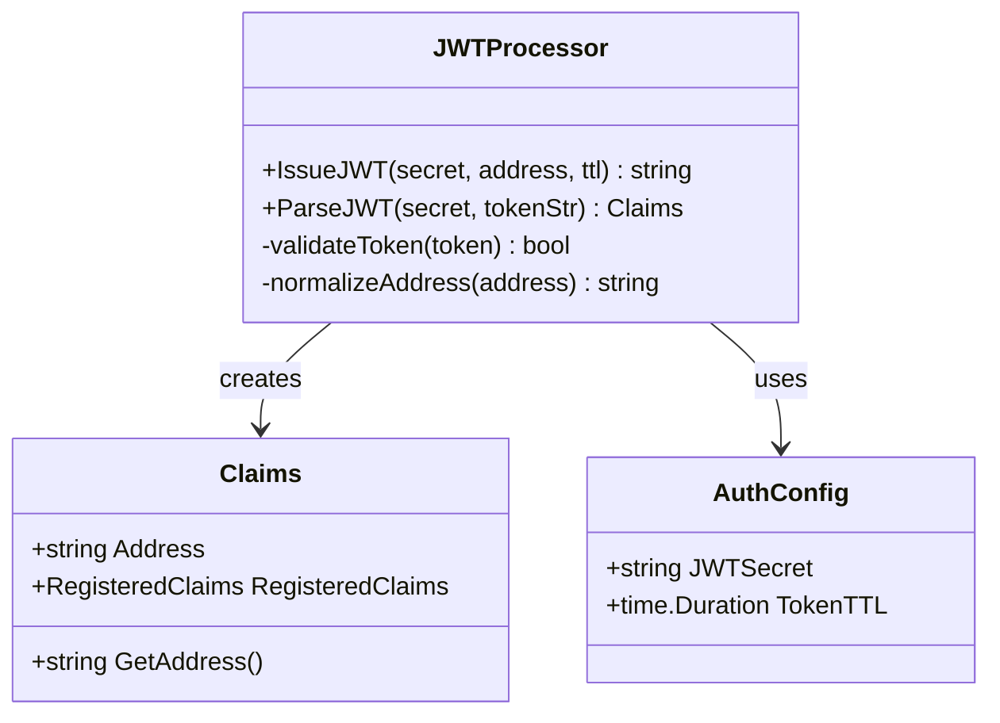
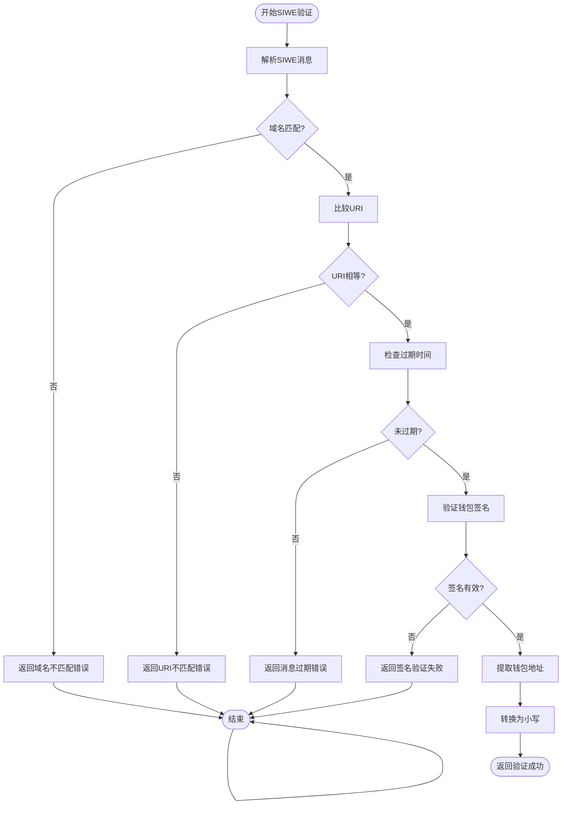
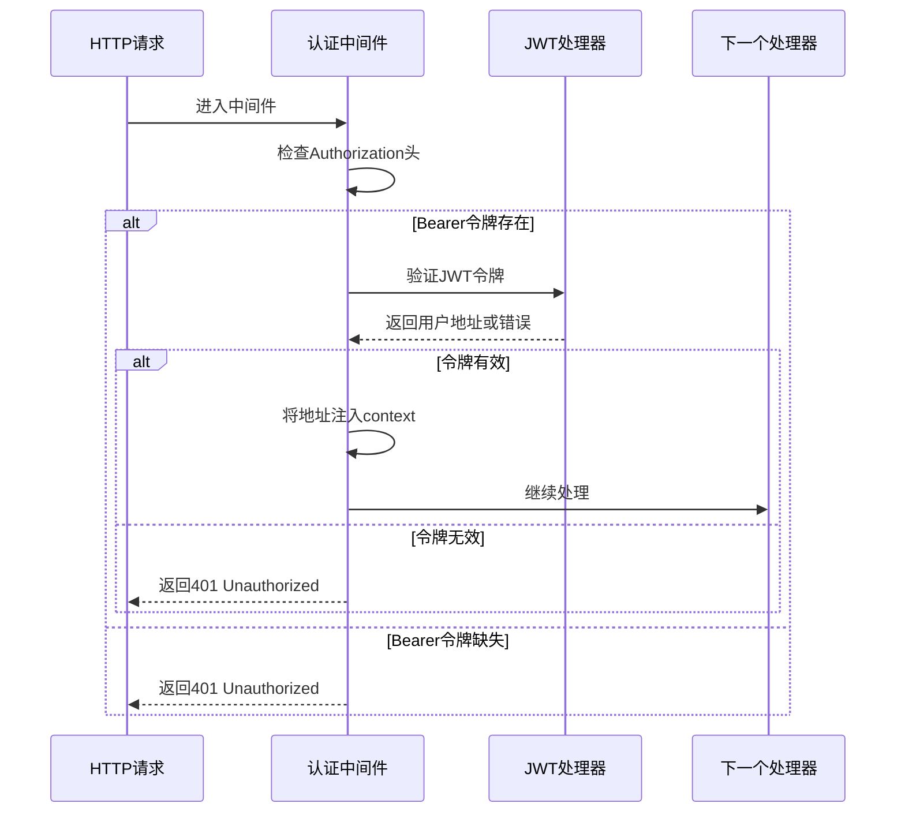
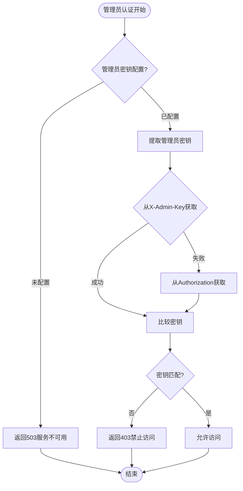
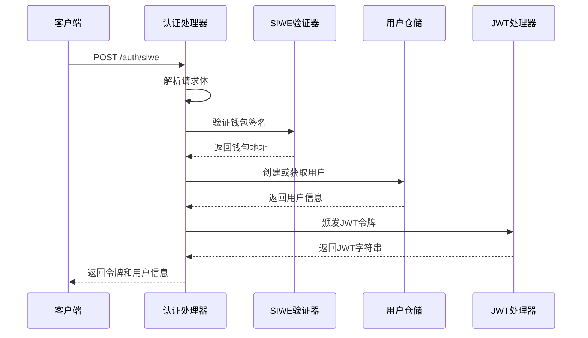
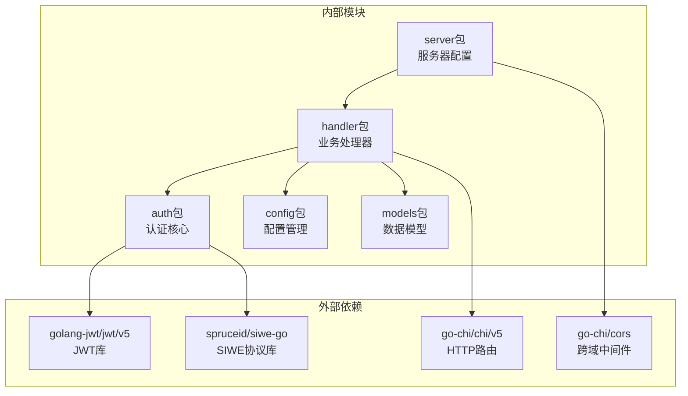

# 认证授权系统

<cite>
**本文档引用的文件**
- [jwt.go](file://internal/auth/jwt.go)
- [siwe.go](file://internal/auth/siwe.go)
- [admin.go](file://internal/auth/admin.go)
- [middleware.go](file://internal/auth/middleware.go)
- [auth_handlers.go](file://internal/handler/auth_handlers.go)
- [api.go](file://internal/handler/api.go)
- [config.go](file://internal/config/config.go)
- [server.go](file://internal/server/server.go)
- [main.go](file://cmd/api/main.go)
- [models.go](file://internal/models/models.go)
</cite>

## 目录
1. [简介](#简介)
2. [项目结构](#项目结构)
3. [核心组件](#核心组件)
4. [架构概览](#架构概览)
5. [详细组件分析](#详细组件分析)
6. [依赖关系分析](#依赖关系分析)
7. [性能考虑](#性能考虑)
8. [故障排除指南](#故障排除指南)
9. [结论](#结论)

## 简介

PredictionDIDSimple项目的认证授权系统是一个基于JWT（JSON Web Token）的身份验证框架，集成了SIWE（Sign-In with Ethereum）协议来支持以太坊钱包登录。该系统提供了完整的用户身份验证、权限管理和管理员控制功能，确保平台的安全性和可靠性。

系统采用分层架构设计，将认证逻辑与业务逻辑分离，通过中间件模式实现横切关注点的统一处理。支持多种认证方式，包括传统的JWT令牌认证和基于以太坊钱包的SIWE认证，同时提供管理员权限控制系统。

## 项目结构

认证授权系统主要分布在以下目录和文件中：



**图表来源**
- [jwt.go:1-58](file://internal/auth/jwt.go#L1-L58)
- [siwe.go:1-75](file://internal/auth/siwe.go#L1-L75)
- [middleware.go:1-50](file://internal/auth/middleware.go#L1-L50)
- [admin.go:1-38](file://internal/auth/admin.go#L1-L38)

**章节来源**
- [jwt.go:1-58](file://internal/auth/jwt.go#L1-L58)
- [siwe.go:1-75](file://internal/auth/siwe.go#L1-L75)
- [middleware.go:1-50](file://internal/auth/middleware.go#L1-L50)
- [admin.go:1-38](file://internal/auth/admin.go#L1-L38)

## 核心组件

### JWT认证机制

JWT（JSON Web Token）是系统的主要身份验证方法，采用HS256签名算法确保令牌的完整性和真实性。

**关键特性：**
- **令牌结构**：包含自定义地址声明和标准注册声明
- **签名算法**：使用HS256对称加密算法
- **有效期管理**：支持可配置的过期时间
- **地址规范化**：自动将钱包地址转换为小写格式

### SIWE集成

SIWE（Sign-In with Ethereum）协议允许用户使用以太坊钱包进行身份验证，提供去中心化的身份验证方案。

**核心功能：**
- **消息解析**：解析SIWE标准格式的消息
- **域名验证**：验证消息中的域名字段
- **URI匹配**：确保消息URI与配置一致
- **过期时间检查**：验证消息的有效期
- **签名验证**：使用siwe-go库验证钱包签名

### 管理员权限系统

管理员权限系统提供高级别的访问控制，通过专用的API密钥实现管理员操作的权限验证。

**权限控制：**
- **密钥验证**：支持X-Admin-Key和Authorization头部两种方式
- **服务可用性检查**：未配置管理员密钥时返回服务不可用状态
- **精确权限控制**：仅对特定管理操作启用

**章节来源**
- [jwt.go:13-34](file://internal/auth/jwt.go#L13-L34)
- [siwe.go:20-60](file://internal/auth/siwe.go#L20-L60)
- [admin.go:10-37](file://internal/auth/admin.go#L10-L37)

## 架构概览

系统采用中间件驱动的架构模式，通过HTTP中间件实现认证和授权的横切关注点。



**图表来源**
- [middleware.go:17-42](file://internal/auth/middleware.go#L17-L42)
- [jwt.go:36-57](file://internal/auth/jwt.go#L36-L57)
- [siwe.go:20-60](file://internal/auth/siwe.go#L20-L60)

### 路由组织结构

系统通过Chi路由器组织不同类型的API路由，实现了清晰的权限层次结构。

```mermaid
graph TD
A[公开接口] --> B[/matches<br/>/markets<br/>/stats<br/>/compliance]
C[登录接口] --> D[/auth/siwe<br/>/auth/verify-vc]
E[JWT认证接口] --> F[/me/positions<br/>/users/bind-did<br/>/users/me/credentials]
G[管理员接口] --> H[/admin/oracle-jobs<br/>/admin/markets<br/>/admin/oracle-jobs/retry<br/>/credentials/issue]
F --> I[JWT中间件保护]
H --> J[管理员中间件保护]
```

**图表来源**
- [api.go:33-68](file://internal/handler/api.go#L33-L68)

**章节来源**
- [api.go:33-68](file://internal/handler/api.go#L33-L68)

## 详细组件分析

### JWT处理器分析

JWT处理器实现了完整的令牌生命周期管理，包括令牌生成、解析和验证功能。



**图表来源**
- [jwt.go:13-34](file://internal/auth/jwt.go#L13-L34)
- [config.go:12-46](file://internal/config/config.go#L12-L46)

#### 令牌生成流程

令牌生成过程包含以下关键步骤：
1. 创建Claims对象，包含钱包地址和标准注册声明
2. 设置过期时间和签发时间
3. 使用HS256算法进行签名
4. 返回标准化的JWT字符串

#### 令牌验证流程

令牌验证过程确保令牌的完整性和有效性：
1. 验证签名算法必须为HS256
2. 使用相同的密钥进行解密验证
3. 检查令牌是否在有效期内
4. 提取并返回Claims信息

**章节来源**
- [jwt.go:19-57](file://internal/auth/jwt.go#L19-L57)

### SIWE验证器分析

SIWE验证器实现了以太坊钱包签名验证的完整流程，遵循SIWE协议标准。



**图表来源**
- [siwe.go:20-60](file://internal/auth/siwe.go#L20-L60)

#### DID绑定验证

系统支持DID（Decentralized Identifier）绑定功能，确保用户身份与去中心化标识符的一致性。

**验证规则：**
- DID格式必须符合`did:pkh:eip155:{chainID}:{address}`规范
- 链ID必须与配置的链ID匹配
- 地址必须与经过SIWE验证的钱包地址一致

**章节来源**
- [siwe.go:62-74](file://internal/auth/siwe.go#L62-L74)

### 认证中间件分析

认证中间件是系统的核心组件，负责拦截HTTP请求并执行相应的认证逻辑。



**图表来源**
- [middleware.go:17-42](file://internal/auth/middleware.go#L17-L42)

#### 上下文管理

中间件通过Go的context包实现用户信息的传递，确保在整个请求生命周期内可以访问用户身份信息。

**上下文键值：**
- `AddressKey`: 存储已认证的用户钱包地址
- 支持类型安全的值提取和转换

**章节来源**
- [middleware.go:11-49](file://internal/auth/middleware.go#L11-L49)

### 管理员中间件分析

管理员中间件提供高级别的权限控制，保护敏感的管理操作。



**图表来源**
- [admin.go:10-37](file://internal/auth/admin.go#L10-L37)

#### 多种认证方式

管理员中间件支持两种认证方式，提供灵活性和兼容性：

**方式一：X-Admin-Key头部**
- 专门的管理员认证头部
- 适用于API调用场景

**方式二：Authorization Bearer头部**
- 兼容标准的Bearer令牌认证
- 适用于各种客户端工具

**章节来源**
- [admin.go:10-37](file://internal/auth/admin.go#L10-L37)

### 认证处理器分析

认证处理器实现了具体的业务逻辑，包括SIWE登录和DID绑定功能。



**图表来源**
- [auth_handlers.go:19-53](file://internal/handler/auth_handlers.go#L19-L53)

#### 用户管理集成

认证处理器与用户仓储层深度集成，实现了用户身份的持久化管理。

**用户操作：**
- **用户创建**：首次登录时自动创建用户记录
- **用户查询**：根据钱包地址检索用户信息
- **DID绑定**：将去中心化标识符与用户账户关联

**章节来源**
- [auth_handlers.go:19-98](file://internal/handler/auth_handlers.go#L19-L98)

## 依赖关系分析

系统采用松耦合的设计模式，通过接口和依赖注入实现组件间的解耦。



**图表来源**
- [jwt.go:10](file://internal/auth/jwt.go#L10)
- [siwe.go:11](file://internal/auth/siwe.go#L11)
- [server.go:11-13](file://internal/server/server.go#L11-L13)

### 配置依赖

系统通过集中式配置管理实现环境特定的设置，支持开发和生产环境的不同需求。

**关键配置项：**
- `JWT_SECRET`: JWT签名密钥，必须在生产环境中修改
- `SIWE_DOMAIN`: SIWE验证的期望域名
- `SIWE_URI`: SIWE验证的期望URI
- `ADMIN_API_KEY`: 管理员API密钥
- `CHAIN_ID`: 以太坊链ID配置

**章节来源**
- [config.go:12-46](file://internal/config/config.go#L12-L46)
- [config.go:48-104](file://internal/config/config.go#L48-L104)

## 性能考虑

### JWT性能优化

系统在JWT处理方面采用了多项优化措施：

**内存管理：**
- 使用预分配的Claims结构体减少内存分配
- 复用JWT解析器实例避免重复创建

**缓存策略：**
- 令牌验证结果可在短期内缓存
- 用户信息可通过Redis进行缓存

**并发处理：**
- JWT解析使用goroutine池处理并发请求
- 避免阻塞操作影响整体性能

### SIWE验证优化

SIWE验证过程进行了性能优化：

**消息解析缓存：**
- 频繁使用的域名和URI进行缓存
- 避免重复的字符串解析操作

**签名验证优化：**
- 使用异步验证机制处理昂贵的密码学操作
- 实现批量验证功能支持多个请求并发处理

## 故障排除指南

### 常见认证问题

#### JWT令牌验证失败

**症状：** 返回401 Unauthorized状态码

**可能原因：**
1. 令牌格式不正确（缺少Bearer前缀）
2. 令牌签名密钥不匹配
3. 令牌已过期
4. 令牌被篡改

**解决方法：**
1. 确保Authorization头格式为`Bearer <token>`
2. 验证JWT_SECRET配置正确
3. 检查系统时间同步
4. 重新生成JWT令牌

#### SIWE签名验证失败

**症状：** 返回401 Unauthorized状态码

**可能原因：**
1. 域名不匹配
2. URI不匹配
3. 令牌过期
4. 签名无效

**解决方法：**
1. 确认SIWE_DOMAIN配置正确
2. 验证SIWE_URI与前端配置一致
3. 检查消息过期时间
4. 重新生成钱包签名

#### 管理员权限拒绝

**症状：** 返回403 Forbidden状态码

**可能原因：**
1. 未配置管理员API密钥
2. 管理员密钥不正确
3. 使用了错误的认证方式

**解决方法：**
1. 设置ADMIN_API_KEY环境变量
2. 确认密钥与配置一致
3. 使用正确的头部格式（X-Admin-Key或Authorization）

### 调试技巧

#### 启用详细日志

在开发环境中启用详细的认证日志：

```bash
export LOG_LEVEL=debug
export AUTH_DEBUG=true
```

#### 测试认证流程

使用curl命令测试认证功能：

```bash
# 测试JWT认证
curl -H "Authorization: Bearer <your-jwt-token>" \
     http://localhost:8080/me/positions

# 测试SIWE认证
curl -X POST http://localhost:8080/auth/siwe \
     -H "Content-Type: application/json" \
     -d '{"message":"<siwe-message>","signature":"<wallet-signature>"}'
```

**章节来源**
- [auth_handlers.go:32](file://internal/handler/auth_handlers.go#L32)
- [middleware.go:24-35](file://internal/auth/middleware.go#L24-L35)
- [admin.go:18-31](file://internal/auth/admin.go#L18-L31)

## 结论

PredictionDIDSimple项目的认证授权系统提供了一个完整、安全且灵活的身份验证解决方案。系统通过JWT和SIWE两种认证方式，结合管理员权限控制，实现了多层次的安全保障。

**主要优势：**
1. **安全性**：采用行业标准的JWT和SIWE协议
2. **灵活性**：支持多种认证方式和配置选项
3. **可扩展性**：模块化设计便于功能扩展
4. **易用性**：清晰的API接口和错误处理

**最佳实践建议：**
1. 在生产环境中使用强随机密钥
2. 定期轮换JWT密钥
3. 实施适当的速率限制
4. 启用HTTPS传输
5. 定期审计认证日志

该系统为PredictionDIDSimple平台提供了坚实的安全基础，支持去中心化身份验证和传统身份验证的混合模式，满足了现代Web3应用的安全需求。