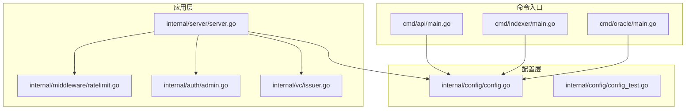
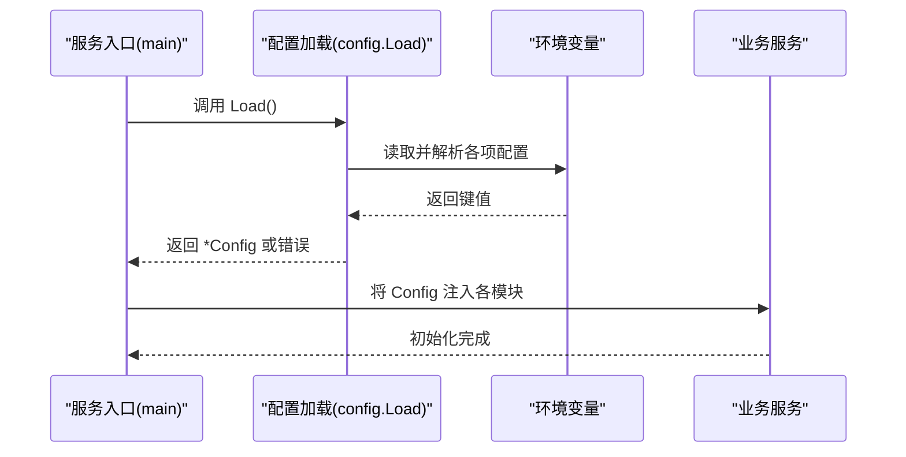
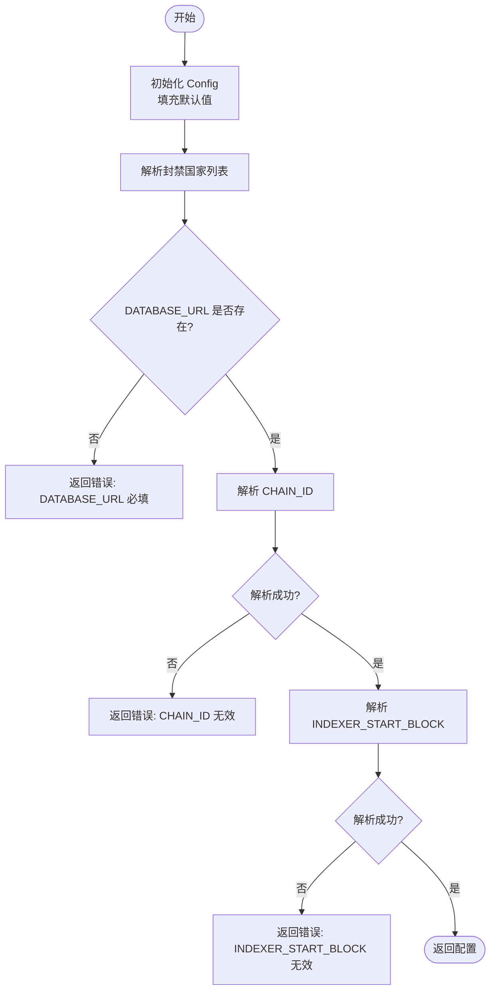
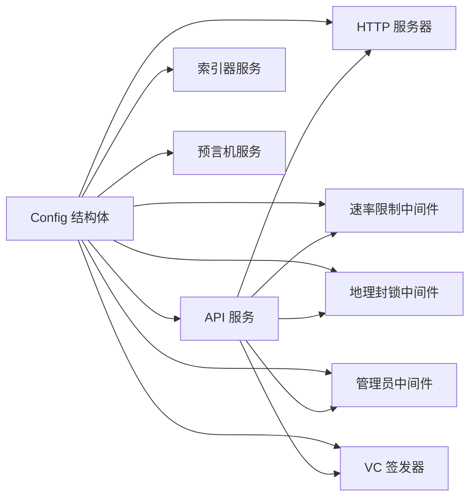

# 配置管理系统

<cite>
**本文引用的文件**
- [config.go](file://internal/config/config.go)
- [config_test.go](file://internal/config/config_test.go)
- [main.go](file://cmd/api/main.go)
- [main.go](file://cmd/indexer/main.go)
- [main.go](file://cmd/oracle/main.go)
- [server.go](file://internal/server/server.go)
- [ratelimit.go](file://internal/middleware/ratelimit.go)
- [admin.go](file://internal/auth/admin.go)
- [issuer.go](file://internal/vc/issuer.go)
</cite>

## 目录
1. [简介](#简介)
2. [项目结构](#项目结构)
3. [核心组件](#核心组件)
4. [架构总览](#架构总览)
5. [详细组件分析](#详细组件分析)
6. [依赖分析](#依赖分析)
7. [性能考量](#性能考量)
8. [故障排查指南](#故障排查指南)
9. [结论](#结论)
10. [附录](#附录)

## 简介
本文件系统性阐述 PredictionDIDSimple 项目的配置管理系统，重点围绕 Config 结构体的设计与实现，涵盖配置项定义、默认值设置、环境变量覆盖机制、配置加载流程、配置验证与运行时使用方式。文档同时提供各配置项的作用说明、配置方法、安全注意事项、最佳实践以及常见问题排查方案。

## 项目结构
配置系统位于 internal/config 包中，采用“环境变量驱动”的单点加载模式，所有服务入口（API、索引器、预言机）均通过统一的 Load() 函数获取运行时配置。配置项贯穿数据库连接、缓存、区块链节点、JWT、速率限制、VC 签发器、管理员密钥、合规与地理封锁等关键模块。

图表来源
- [config.go:1-139](file://internal/config/config.go#L1-L139)
- [config_test.go:1-55](file://internal/config/config_test.go#L1-L55)
- [main.go:27-33](file://cmd/api/main.go#L27-L33)
- [main.go:18-23](file://cmd/indexer/main.go#L18-L23)
- [main.go:21-26](file://cmd/oracle/main.go#L21-L26)
- [server.go:44-102](file://internal/server/server.go#L44-L102)
- [ratelimit.go:42-66](file://internal/middleware/ratelimit.go#L42-L66)
- [admin.go:10-37](file://internal/auth/admin.go#L10-L37)
- [issuer.go:15-26](file://internal/vc/issuer.go#L15-L26)

章节来源
- [config.go:1-139](file://internal/config/config.go#L1-L139)
- [config_test.go:1-55](file://internal/config/config_test.go#L1-L55)
- [main.go:27-33](file://cmd/api/main.go#L27-L33)
- [main.go:18-23](file://cmd/indexer/main.go#L18-L23)
- [main.go:21-26](file://cmd/oracle/main.go#L21-L26)

## 核心组件
- Config 结构体：集中定义所有运行时配置项，包含网络端口、数据库、Redis、以太坊 RPC、链 ID、JWT、SIWE、合约地址、索引器与预言机参数、管理员密钥、VC 签发器密钥、告警 Webhook、地理封锁、速率限制、KYC 密钥、合规开关、运行环境等。
- Load() 函数：从环境变量加载配置，设置默认值，执行必要的数值解析与验证，返回配置实例或错误。
- 辅助函数：
  - getEnv()/getEnvInt()：读取环境变量并提供默认值。
  - parseBlockedCountries()：解析封禁国家列表为映射。

章节来源
- [config.go:12-46](file://internal/config/config.go#L12-L46)
- [config.go:48-105](file://internal/config/config.go#L48-L105)
- [config.go:107-139](file://internal/config/config.go#L107-L139)

## 架构总览
配置系统遵循“单一真相源”原则：所有服务启动时调用 config.Load()，得到全局共享的 Config 实例；随后各模块按需读取配置，避免分散的硬编码与重复解析逻辑。

图表来源
- [main.go:27-33](file://cmd/api/main.go#L27-L33)
- [main.go:18-23](file://cmd/indexer/main.go#L18-L23)
- [main.go:21-26](file://cmd/oracle/main.go#L21-L26)
- [config.go:48-105](file://internal/config/config.go#L48-L105)

## 详细组件分析

### Config 结构体设计
- 设计要点
  - 单一职责：集中承载运行时配置，便于跨模块共享。
  - 明确边界：区分必填项（如 DATABASE_URL）与可选项（如 ETH_RPC_FALLBACK），并在加载阶段进行校验。
  - 类型安全：数值型配置通过解析函数转换，失败时回退默认值并记录日志（在服务侧体现）。
  - 可扩展性：新增配置项只需在结构体中增加字段、在 Load() 中赋值与解析。

- 关键字段说明（按类别）
  - 网络与服务
    - HTTPPort：HTTP 监听端口，默认 8080。
    - Environment：运行环境标识（development/production）。
  - 数据库
    - DatabaseURL：PostgreSQL 连接字符串（必填）。
  - 缓存
    - RedisURL：Redis 连接地址，默认本地实例。
  - 区块链与合约
    - EthRPCURL/EthRPCFallback：主/备用以太坊 RPC。
    - ChainID：链 ID，字符串解析为 int64。
    - FactoryAddress/FactoryV3Address/CollateralAddress/OracleAdapterAddress/OracleAdapterV2/DIDRegistryAddress：各类合约地址。
    - OraclePrivateKey：预言机签名私钥。
  - 索引器
    - IndexerStartBlock：索引器起始区块号（uint64）。
    - IndexerPollSeconds：索引轮询间隔（秒）。
  - 预言机
    - OracleCooldownMinutes/OracleTimelockSeconds/OraclePollSeconds：冷却、时间锁与轮询间隔。
  - 安全与认证
    - JWTSecret：JWT 签名密钥。
    - SIWEDomain/SIWEURI：SIWE 校验域名与 URI。
    - AdminAPIKey：管理员 API 密钥，用于受保护路由。
  - 可验证凭证（VC）
    - VCIssuerKey：VC 签发器 HMAC 密钥。
  - 告警与合规
    - AlertWebhookURL：告警 Webhook URL。
    - ComplianceRequired：是否启用合规要求。
    - BlockedCountries：封禁国家列表（逗号分隔）。
    - GeoBlockEnabled：是否启用地理封锁。
  - 速率限制
    - RateLimitPerMinute：每分钟请求上限。
  - 其他
    - MockMatchesPath/MockMatchesSecondary：mock 比赛数据路径（双源）。
    - KYCWebhookSecret：KYC 回调密钥。

章节来源
- [config.go:12-46](file://internal/config/config.go#L12-L46)
- [config.go:48-105](file://internal/config/config.go#L48-L105)

### 配置加载流程
- 步骤
  1) 初始化 Config 实例，使用 getEnv()/getEnvInt() 读取环境变量并设置默认值。
  2) 解析封禁国家列表 parseBlockedCountries()。
  3) 校验必填项 DATABASE_URL。
  4) 解析 ChainID（字符串到 int64）。
  5) 解析 IndexerStartBlock（字符串到 uint64）。
  6) 返回配置实例或错误。
- 错误处理
  - DATABASE_URL 为空时直接返回错误。
  - ChainID/IndexerStartBlock 解析失败时返回错误。

图表来源
- [config.go:48-105](file://internal/config/config.go#L48-L105)

章节来源
- [config.go:48-105](file://internal/config/config.go#L48-L105)

### 配置项详解与配置方法
- 数据库连接配置
  - 配置项：DatabaseURL（必填）
  - 作用：建立 PostgreSQL 连接池，供所有服务使用。
  - 配置方法：设置 DATABASE_URL 环境变量。
  - 使用位置：API、索引器、预言机入口均通过 config.DatabaseURL 初始化数据库连接池。
- Redis 配置
  - 配置项：RedisURL
  - 作用：提供缓存与会话存储能力。
  - 配置方法：设置 REDIS_URL 环境变量。
  - 使用位置：API 入口中可选初始化 Redis 客户端并进行连通性检测。
- 区块链节点配置
  - 配置项：EthRPCURL、EthRPCFallback、ChainID
  - 作用：提供以太坊 RPC 访问与链 ID 校验。
  - 配置方法：设置 ETH_RPC_URL、ETH_RPC_FALLBACK_URL、CHAIN_ID。
  - 使用位置：API 入口中创建只读链客户端；预言机入口中可选创建写入客户端。
- JWT 密钥配置
  - 配置项：JWTSecret
  - 作用：用于签发与验证 JWT。
  - 配置方法：设置 JWT_SECRET。
  - 使用位置：认证与授权相关模块（具体使用处见认证相关文件）。
- 速率限制配置
  - 配置项：RateLimitPerMinute
  - 作用：基于 IP 的每分钟请求数限制。
  - 配置方法：设置 RATE_LIMIT_PER_MINUTE。
  - 使用位置：HTTP 服务器中间件中注入并生效。
- VC 签发器配置
  - 配置项：VCIssuerKey
  - 作用：HMAC-SHA256 签名 VC 凭证。
  - 配置方法：设置 VC_ISSUER_KEY。
  - 使用位置：HTTP 服务器中初始化 VC Issuer。
- 管理员密钥配置
  - 配置项：AdminAPIKey
  - 作用：受保护路由的身份校验。
  - 配置方法：设置 ADMIN_API_KEY。
  - 使用位置：管理员中间件中进行鉴权。
- 合规与地理封锁
  - 配置项：ComplianceRequired、GeoBlockEnabled、BlockedCountries、KYCWebhookSecret
  - 作用：控制合规要求、地理封锁策略与 KYC 回调密钥。
  - 配置方法：设置 COMPLIANCE_REQUIRED、GEO_BLOCK_ENABLED、BLOCKED_COUNTRIES、KYC_WEBHOOK_SECRET。
  - 使用位置：HTTP 服务器中间件中记录地理访问日志并执行封锁策略。
- 预言机与索引器参数
  - 配置项：OracleAdapterAddress、OraclePrivateKey、OracleCooldownMinutes、OracleTimelockSeconds、OraclePollSeconds、IndexerStartBlock、IndexerPollSeconds、MockMatchesPath、MockMatchesSecondary
  - 作用：控制预言机工作流与索引器行为，以及 mock 数据源。
  - 配置方法：设置相应环境变量。
  - 使用位置：预言机入口创建 Oracle 客户端；索引器入口根据配置启动索引器；API 入口根据配置决定是否启动索引器。
- 告警 Webhook
  - 配置项：AlertWebhookURL
  - 作用：异常告警通知。
  - 配置方法：设置 ALERT_WEBHOOK_URL。
  - 使用位置：预言机工作器中使用告警通知器。

章节来源
- [config.go:12-46](file://internal/config/config.go#L12-L46)
- [config.go:48-105](file://internal/config/config.go#L48-L105)
- [main.go:54-61](file://cmd/api/main.go#L54-L61)
- [main.go:83-86](file://cmd/api/main.go#L83-L86)
- [main.go:114-121](file://cmd/api/main.go#L114-L121)
- [main.go:40-49](file://cmd/oracle/main.go#L40-L49)
- [server.go:52-59](file://internal/server/server.go#L52-L59)
- [server.go](file://internal/server/server.go#L88)
- [admin.go:10-37](file://internal/auth/admin.go#L10-L37)
- [issuer.go:15-26](file://internal/vc/issuer.go#L15-L26)

### 配置使用示例（代码片段路径）
- 在 API 服务中使用配置
  - 加载配置与初始化数据库连接池：[main.go:28-61](file://cmd/api/main.go#L28-L61)
  - 初始化 Redis 客户端并检测连通性：[main.go:63-81](file://cmd/api/main.go#L63-L81)
  - 创建只读链客户端并启动后台 ping：[main.go:83-86](file://cmd/api/main.go#L83-L86)
  - 条件启动索引器：[main.go:88-110](file://cmd/api/main.go#L88-L110)
  - 条件创建 Oracle 客户端：[main.go:114-121](file://cmd/api/main.go#L114-L121)
  - 初始化 HTTP 服务器并注入配置：[main.go:123-131](file://cmd/api/main.go#L123-L131)
- 在 HTTP 服务器中使用配置
  - 注入速率限制中间件：[server.go](file://internal/server/server.go#L52)
  - 注入地理封锁中间件并记录日志：[server.go:54-59](file://internal/server/server.go#L54-L59)
  - 初始化 VC 签发器：[server.go](file://internal/server/server.go#L88)
- 在管理员中间件中使用配置
  - 读取 AdminAPIKey 并鉴权：[admin.go:10-37](file://internal/auth/admin.go#L10-L37)
- 在 VC 签发器中使用配置
  - 通过 VCIssuerKey 初始化签发器：[issuer.go:24-26](file://internal/vc/issuer.go#L24-L26)

章节来源
- [main.go:28-131](file://cmd/api/main.go#L28-L131)
- [server.go:52-59](file://internal/server/server.go#L52-L59)
- [server.go](file://internal/server/server.go#L88)
- [admin.go:10-37](file://internal/auth/admin.go#L10-L37)
- [issuer.go:24-26](file://internal/vc/issuer.go#L24-L26)

### 如何添加新的配置选项
- 步骤
  1) 在 Config 结构体中新增字段，并添加注释说明用途。
  2) 在 Load() 中为新字段设置默认值与环境变量读取逻辑。
  3) 如涉及数值解析，使用 getEnvInt() 或自定义解析逻辑。
  4) 在需要使用的模块中读取 cfg.NewField 并传入依赖。
  5) 在测试中添加对应用例，确保默认值与解析行为正确。
- 示例参考
  - 新增字段与默认值设置：[config.go:12-46](file://internal/config/config.go#L12-L46)
  - 在 Load() 中赋值与解析：[config.go:48-105](file://internal/config/config.go#L48-L105)
  - 测试用例参考：[config_test.go:19-37](file://internal/config/config_test.go#L19-L37)

章节来源
- [config.go:12-46](file://internal/config/config.go#L12-L46)
- [config.go:48-105](file://internal/config/config.go#L48-L105)
- [config_test.go:19-37](file://internal/config/config_test.go#L19-L37)

### 配置安全性考虑
- 敏感信息保护
  - 管理员密钥（AdminAPIKey）、VC 签发密钥（VCIssuerKey）、JWT 密钥（JWTSecret）、Oracle 私钥（OraclePrivateKey）、数据库密码等应通过环境变量注入，避免硬编码与提交到版本控制。
  - 建议在部署环境中使用密钥管理服务（如云厂商 KMS 或专用密管系统）进行密钥轮换与访问审计。
- 最小权限原则
  - 数据库连接串仅授予必要权限；Redis 仅开放必要端口与命令；区块链 RPC 仅暴露查询接口（写操作通过专用 Oracle 客户端）。
- 配置加密
  - 对于静态配置文件（如未来引入的 YAML/JSON 配置），建议使用对称加密并在运行时解密，避免明文存储。
- 配置验证
  - 对数值型配置（如 CHAIN_ID、INDEXER_START_BLOCK、RateLimitPerMinute）进行严格解析与范围校验，失败时拒绝启动。
- 运行时最小暴露面
  - 仅在必要模块中读取敏感配置；对外 API 不暴露敏感配置项。

[本节为通用安全指导，无需特定文件引用]

### 配置最佳实践
- 环境隔离
  - development/production 环境使用不同配置集，通过 APP_ENV 区分。
- 默认值与必填项
  - 为所有可选配置提供合理默认值；对必填项（如 DATABASE_URL）在启动阶段强制校验。
- 数值解析健壮性
  - 对字符串到整数的转换进行异常捕获，失败时回退默认值或终止启动。
- 配置变更流程
  - 通过滚动重启或热更新（如支持）进行配置变更，避免长时间停机。
- 文档与示例
  - 保持 .env.example 与配置注释同步，提供清晰的配置说明与示例值。

[本节为通用实践指导，无需特定文件引用]

## 依赖分析
- 模块耦合
  - 所有服务入口依赖 config.Load() 获取全局配置，形成低耦合高内聚的配置中心。
  - HTTP 服务器依赖配置进行中间件注入与路由初始化。
  - 速率限制与地理封锁中间件直接依赖 Config 中的 RateLimitPerMinute 与地理封锁相关字段。
  - 管理员中间件依赖 AdminAPIKey；VC 签发器依赖 VCIssuerKey。
- 外部依赖
  - 环境变量系统（os.Getenv）作为唯一外部输入。
  - 第三方库（如 Redis、HTTP 服务器、区块链客户端）通过配置参数初始化。

图表来源
- [config.go:12-46](file://internal/config/config.go#L12-L46)
- [server.go:44-102](file://internal/server/server.go#L44-L102)
- [ratelimit.go:42-66](file://internal/middleware/ratelimit.go#L42-L66)
- [admin.go:10-37](file://internal/auth/admin.go#L10-L37)
- [issuer.go:15-26](file://internal/vc/issuer.go#L15-L26)

章节来源
- [config.go:12-46](file://internal/config/config.go#L12-L46)
- [server.go:44-102](file://internal/server/server.go#L44-L102)
- [ratelimit.go:42-66](file://internal/middleware/ratelimit.go#L42-L66)
- [admin.go:10-37](file://internal/auth/admin.go#L10-L37)
- [issuer.go:15-26](file://internal/vc/issuer.go#L15-L26)

## 性能考量
- 配置解析成本极低，仅在启动阶段执行一次，对运行时性能影响可忽略。
- 速率限制中间件基于内存计数，窗口重置开销小；可根据流量规模调整 RateLimitPerMinute。
- 地理封锁中间件仅在请求到达时进行简单判断与日志记录，性能开销可控。
- Redis 与数据库连接池在服务启动时初始化，后续复用连接减少握手开销。

[本节为通用性能指导，无需特定文件引用]

## 故障排查指南
- 启动时报错 DATABASE_URL 为空
  - 现象：启动即返回错误，提示 DATABASE_URL 必填。
  - 排查：确认环境变量是否正确设置，路径是否可读。
  - 参考：[config.go:84-87](file://internal/config/config.go#L84-L87)
- CHAIN_ID 配置无效
  - 现象：解析失败并返回错误。
  - 排查：确保 CHAIN_ID 为合法整数字符串；检查环境变量拼写。
  - 参考：[config.go:89-95](file://internal/config/config.go#L89-L95)
- INDEXER_START_BLOCK 配置无效
  - 现象：解析失败并返回错误。
  - 排查：确保为合法无符号整数字符串。
  - 参考：[config.go:97-102](file://internal/config/config.go#L97-L102)
- Redis 连接失败但服务仍启动
  - 现象：API 启动日志出现 Redis 相关警告，服务继续运行。
  - 排查：检查 REDIS_URL 格式与可达性；确认 Redis 服务状态。
  - 参考：[main.go:66-81](file://cmd/api/main.go#L66-L81)
- Oracle 客户端初始化失败
  - 现象：API/预言机启动日志出现 Oracle 客户端警告。
  - 排查：确认 ORACLE_ADAPTER_ADDRESS 与 ORACLE_PRIVATE_KEY 是否同时配置且有效。
  - 参考：[main.go:114-121](file://cmd/api/main.go#L114-L121)，[main.go:40-49](file://cmd/oracle/main.go#L40-L49)
- 速率限制不生效
  - 现象：请求未被限流。
  - 排查：确认 RATE_LIMIT_PER_MINUTE 设置合理；检查中间件是否正确注入。
  - 参考：[server.go](file://internal/server/server.go#L52)，[ratelimit.go:42-66](file://internal/middleware/ratelimit.go#L42-L66)
- 管理员接口 403
  - 现象：访问受保护路由返回 403。
  - 排查：确认 ADMIN_API_KEY 已配置且请求头 X-Admin-Key 或 Authorization: Bearer 与之匹配。
  - 参考：[admin.go:10-37](file://internal/auth/admin.go#L10-L37)

章节来源
- [config.go:84-102](file://internal/config/config.go#L84-L102)
- [main.go:66-81](file://cmd/api/main.go#L66-L81)
- [main.go:114-121](file://cmd/api/main.go#L114-L121)
- [main.go:40-49](file://cmd/oracle/main.go#L40-L49)
- [server.go](file://internal/server/server.go#L52)
- [ratelimit.go:42-66](file://internal/middleware/ratelimit.go#L42-L66)
- [admin.go:10-37](file://internal/auth/admin.go#L10-L37)

## 结论
配置管理系统以 Config 结构体为核心，通过环境变量驱动的方式实现了集中、可验证、可扩展的配置加载与使用。系统在启动阶段完成配置解析与校验，确保运行时的稳定性与安全性。结合速率限制、地理封锁、管理员鉴权与 VC 签发器等模块，配置系统为 PredictionDIDSimple 的多服务架构提供了统一的运行时支撑。

[本节为总结性内容，无需特定文件引用]

## 附录
- 配置项一览表（类别与用途）
  - 网络与服务：HTTPPort、Environment
  - 数据库：DatabaseURL（必填）
  - 缓存：RedisURL
  - 区块链与合约：EthRPCURL、EthRPCFallback、ChainID、FactoryAddress、FactoryV3Address、CollateralAddress、OracleAdapterAddress、OracleAdapterV2、DIDRegistryAddress、OraclePrivateKey
  - 索引器：IndexerStartBlock、IndexerPollSeconds
  - 预言机：OracleCooldownMinutes、OracleTimelockSeconds、OraclePollSeconds、MockMatchesPath、MockMatchesSecondary
  - 安全与认证：JWTSecret、SIWEDomain、SIWEURI、AdminAPIKey
  - VC：VCIssuerKey
  - 告警与合规：AlertWebhookURL、ComplianceRequired、BlockedCountries、GeoBlockEnabled、KYCWebhookSecret
  - 速率限制：RateLimitPerMinute

章节来源
- [config.go:12-46](file://internal/config/config.go#L12-L46)