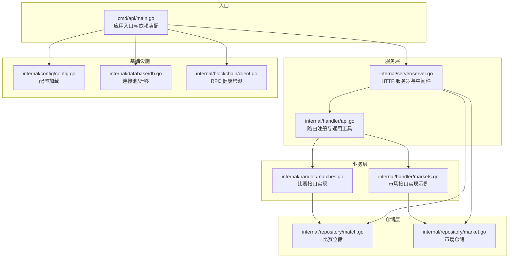
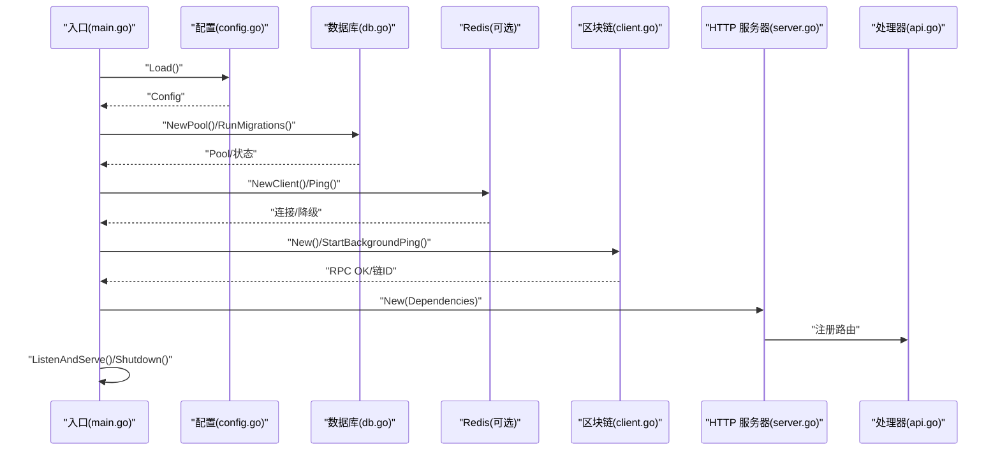
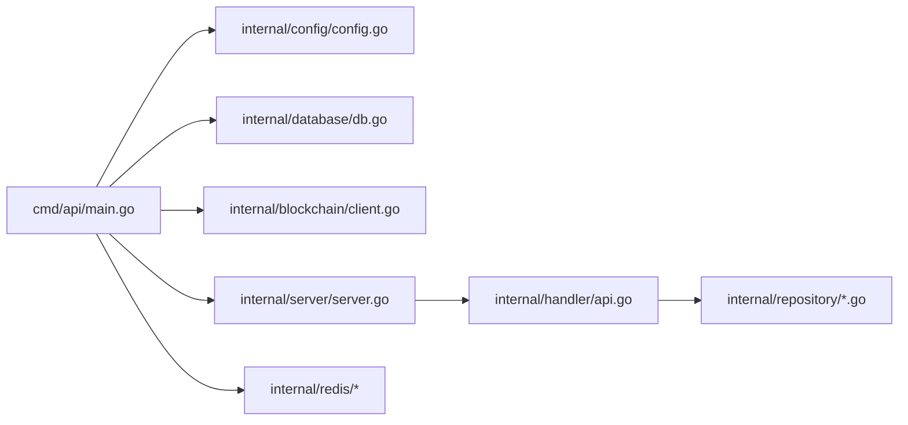

# 测试策略

<cite>
**本文引用的文件**
- [main.go](file://cmd/api/main.go)
- [config.go](file://internal/config/config.go)
- [config_test.go](file://internal/config/config_test.go)
- [server.go](file://internal/server/server.go)
- [api.go](file://internal/handler/api.go)
- [matches.go](file://internal/handler/matches.go)
- [health_test.go](file://internal/handler/health_test.go)
- [match.go](file://internal/repository/match.go)
- [market.go](file://internal/repository/market.go)
- [db.go](file://internal/database/db.go)
- [client.go](file://internal/blockchain/client.go)
- [go.mod](file://go.mod)
</cite>

## 目录
1. [简介](#简介)
2. [项目结构](#项目结构)
3. [核心组件](#核心组件)
4. [架构总览](#架构总览)
5. [详细组件分析](#详细组件分析)
6. [依赖分析](#依赖分析)
7. [性能考虑](#性能考虑)
8. [故障排查指南](#故障排查指南)
9. [结论](#结论)
10. [附录](#附录)

## 简介
本测试策略文档面向 PredictionDIDSimple 后端项目，目标是建立完善的单元测试与集成测试体系，覆盖配置加载、HTTP 服务、仓储层、区块链交互与数据库迁移等关键模块。文档同时给出测试数据准备、mock 设计、性能与基准测试方案、覆盖率要求以及持续集成配置建议，并提供各核心模块的测试示例与模板，帮助团队在开发过程中保持高质量与稳定性。

## 项目结构
后端采用分层架构：命令入口负责应用生命周期与依赖装配；服务层负责路由与中间件；处理器层封装业务接口；仓储层对接数据库；区块链层封装链上交互；配置与数据库提供基础设施能力。

图表来源
- [main.go:27-161](file://cmd/api/main.go#L27-L161)
- [server.go:44-102](file://internal/server/server.go#L44-L102)
- [api.go:34-69](file://internal/handler/api.go#L34-L69)
- [matches.go:8-44](file://internal/handler/matches.go#L8-L44)
- [match.go:15-118](file://internal/repository/match.go#L15-L118)
- [market.go:15-269](file://internal/repository/market.go#L15-L269)
- [config.go:48-104](file://internal/config/config.go#L48-L104)
- [db.go:16-50](file://internal/database/db.go#L16-L50)
- [client.go:14-94](file://internal/blockchain/client.go#L14-L94)

章节来源
- [main.go:27-161](file://cmd/api/main.go#L27-L161)
- [server.go:44-102](file://internal/server/server.go#L44-L102)
- [api.go:34-69](file://internal/handler/api.go#L34-L69)
- [matches.go:8-44](file://internal/handler/matches.go#L8-L44)
- [match.go:15-118](file://internal/repository/match.go#L15-L118)
- [market.go:15-269](file://internal/repository/market.go#L15-L269)
- [config.go:48-104](file://internal/config/config.go#L48-L104)
- [db.go:16-50](file://internal/database/db.go#L16-L50)
- [client.go:14-94](file://internal/blockchain/client.go#L14-L94)

## 核心组件
- 配置加载：从环境变量解析运行参数，包含数据库、Redis、以太坊 RPC、合约地址、索引器与预言机参数等。
- HTTP 服务器：基于 Chi 路由，注册健康检查、公开接口、认证接口与管理员接口，内置速率限制与地理封锁中间件。
- 仓储层：提供比赛与市场等实体的增删改查与聚合查询，封装 SQL 与数据库连接池。
- 区块链客户端：提供 RPC 连通性检测与链 ID 校验，保障链上交互的可靠性。
- 数据库：提供连接池创建、Ping 探活与迁移执行能力。

章节来源
- [config.go:12-104](file://internal/config/config.go#L12-L104)
- [server.go:24-102](file://internal/server/server.go#L24-L102)
- [match.go:15-118](file://internal/repository/match.go#L15-L118)
- [market.go:15-269](file://internal/repository/market.go#L15-L269)
- [client.go:14-94](file://internal/blockchain/client.go#L14-L94)
- [db.go:16-50](file://internal/database/db.go#L16-L50)

## 架构总览
以下序列图展示应用启动流程与依赖注入关系，体现测试可插拔性与隔离性设计。

图表来源
- [main.go:27-161](file://cmd/api/main.go#L27-L161)
- [config.go:48-104](file://internal/config/config.go#L48-L104)
- [db.go:16-50](file://internal/database/db.go#L16-L50)
- [client.go:30-83](file://internal/blockchain/client.go#L30-L83)
- [server.go:44-102](file://internal/server/server.go#L44-L102)
- [api.go:34-69](file://internal/handler/api.go#L34-L69)

## 详细组件分析

### 配置模块测试策略
- 单元测试要点
  - 必填项校验：DATABASE_URL 为空时应返回错误。
  - 默认值校验：未设置时使用合理默认值（端口、链 ID、轮询间隔等）。
  - 自定义端口：显式设置 HTTP_PORT 时应被正确读取。
  - 国家黑名单解析：逗号分隔字符串解析为映射。
- 测试数据与隔离
  - 使用 t.Setenv 临时设置环境变量，避免污染全局环境。
  - 对于链 ID 与起始区块等数值解析，提供边界值与非法输入用例。
- 示例参考
  - [TestLoad_requiresDatabaseURL:10-17](file://internal/config/config_test.go#L10-L17)
  - [TestLoad_defaults:19-37](file://internal/config/config_test.go#L19-L37)
  - [TestLoad_customPort:39-54](file://internal/config/config_test.go#L39-L54)

章节来源
- [config.go:48-139](file://internal/config/config.go#L48-L139)
- [config_test.go:10-54](file://internal/config/config_test.go#L10-L54)

### HTTP 服务与路由测试策略
- 单元测试要点
  - 健康检查：/health 返回 200 且状态为 ok；/ready 在 DB 为 nil 时仍返回 200。
  - 路由注册：确认公开接口、认证接口与管理员接口均能正确注册。
  - 中间件行为：速率限制、CORS、地理封锁中间件在请求中生效。
- 集成测试要点
  - 启动最小化服务（仅健康检查），验证跨域与限流策略。
  - 模拟 JWT 与管理员密钥，验证受保护接口的鉴权逻辑。
- 示例参考
  - [TestHealth_endpoint:12-32](file://internal/handler/health_test.go#L12-L32)
  - [TestReady_withoutDB:34-45](file://internal/handler/health_test.go#L34-L45)

章节来源
- [server.go:44-102](file://internal/server/server.go#L44-L102)
- [api.go:34-69](file://internal/handler/api.go#L34-L69)
- [health_test.go:12-45](file://internal/handler/health_test.go#L12-L45)

### 比赛仓储测试策略
- 单元测试要点
  - 列表查询：支持按状态过滤、分页参数默认值与偏移计算。
  - 条件查询：按 ID 与外部 ID 查询，异常场景返回错误。
  - 写入与更新：Upsert 按 external_id 去重更新；SetStatus 更新状态。
  - 时间解析：ParseKickoff 正确解析 RFC3339 时间字符串。
- 集成测试要点
  - 使用内存数据库或测试专用数据库，执行迁移后进行 CRUD 验证。
  - 验证 SQL 注入防护与参数绑定正确性。
- 示例参考
  - [List/GetByID/Upsert/SetStatus:25-99](file://internal/repository/match.go#L25-L99)
  - [ParseKickoff:114-118](file://internal/repository/match.go#L114-L118)

章节来源
- [match.go:25-118](file://internal/repository/match.go#L25-L118)

### 市场仓储测试策略
- 单元测试要点
  - 列表查询：支持状态过滤、联表查询匹配信息、排序与分页。
  - 单条查询：按 ID 与合约地址查询，异常场景返回错误。
  - 写入与更新：InsertFromChain 冲突更新；UpdateResolved、UpdatePools、SetVoid 等状态更新。
  - 管理员操作：RegisterAdmin 支持批量更新市场属性。
- 集成测试要点
  - 联表查询正确性与字段映射一致性。
  - 大列表分页与性能回归测试。
- 示例参考
  - [List/GetByID/GetByAddress:25-111](file://internal/repository/market.go#L25-L111)
  - [InsertFromChain/UpdateResolved/SetVoid:113-188](file://internal/repository/market.go#L113-L188)

章节来源
- [market.go:25-269](file://internal/repository/market.go#L25-L269)

### 区块链客户端测试策略
- 单元测试要点
  - RPC 连通性：拨号失败、链 ID 查询失败、链 ID 不一致时标记不健康。
  - 健康状态：RPCOK 与 ChainID 返回最新状态。
  - 背景心跳：StartBackgroundPing 定时任务在上下文取消后停止。
- 集成测试要点
  - 使用本地或模拟 RPC 节点，验证健康检测与链 ID 校验。
  - 背景任务并发安全与资源释放。
- 示例参考
  - [StartBackgroundPing/pingOnce/RPCOK/ChainID:30-94](file://internal/blockchain/client.go#L30-94)

章节来源
- [client.go:30-94](file://internal/blockchain/client.go#L30-L94)

### 数据库模块测试策略
- 单元测试要点
  - 连接池：NewPool 成功创建并 Ping 探活。
  - 迁移：RunMigrations 执行 Up，无变更不报错。
- 集成测试要点
  - 使用测试数据库实例，执行迁移脚本并验证表结构。
  - 连接池并发访问与超时控制。
- 示例参考
  - [NewPool/Ping/RunMigrations:16-50](file://internal/database/db.go#L16-50)

章节来源
- [db.go:16-50](file://internal/database/db.go#L16-L50)

### 入口与依赖装配测试策略
- 单元测试要点
  - 配置加载：Load 返回配置对象，缺失必填项时报错。
  - 依赖注入：main 中按顺序创建配置、数据库、Redis、区块链、索引器与 HTTP 服务器。
- 集成测试要点
  - 启动最小化服务，验证依赖装配顺序与错误降级（如 Redis 不可用时的服务降级）。
- 示例参考
  - [main 启动流程:27-161](file://cmd/api/main.go#L27-161)
  - [配置加载:48-104](file://internal/config/config.go#L48-104)

章节来源
- [main.go:27-161](file://cmd/api/main.go#L27-L161)
- [config.go:48-104](file://internal/config/config.go#L48-L104)

## 依赖分析
- 第三方依赖
  - 路由与中间件：Chi、CORS、Recoverer、Logger、RealIP、RequestID。
  - 数据库：pgx 连接池与 golang-migrate 迁移。
  - 区块链：go-ethereum ethclient。
  - 缓存：redis/go-redis。
  - JWT 与 SIWE：golang-jwt、spruceid/siwe-go。
- 依赖关系可视化

图表来源
- [main.go:27-161](file://cmd/api/main.go#L27-L161)
- [server.go:44-102](file://internal/server/server.go#L44-L102)
- [api.go:34-69](file://internal/handler/api.go#L34-L69)
- [match.go:15-118](file://internal/repository/match.go#L15-L118)
- [market.go:15-269](file://internal/repository/market.go#L15-L269)
- [config.go:48-104](file://internal/config/config.go#L48-L104)
- [db.go:16-50](file://internal/database/db.go#L16-L50)
- [client.go:14-94](file://internal/blockchain/client.go#L14-L94)

章节来源
- [go.mod:5-14](file://go.mod#L5-L14)

## 性能考虑
- 单元测试性能
  - 使用内存数据库或轻量级嵌入式数据库（如 SQLite）进行快速测试。
  - 对 IO 密集型逻辑（如数据库、Redis、RPC）使用 mock 或本地回环服务。
- 集成测试性能
  - 使用 Docker Compose 启动 Postgres、Redis、本地以太坊节点，复用容器减少冷启动成本。
  - 将大列表查询与联表查询拆分为多轮小规模用例，避免长时间运行。
- 基准测试建议
  - 对关键仓储查询（如市场列表、比赛列表）编写基准测试，关注分页与排序对性能的影响。
  - 对区块链健康检测与 RPC 调用进行基准测试，评估超时与重试策略。
- 性能监控
  - 在集成测试中启用 Prometheus 指标端点，收集关键指标（QPS、P95、错误率）。

## 故障排查指南
- 配置类问题
  - DATABASE_URL 缺失导致启动失败：确保测试环境设置必填项。
  - CHAIN_ID 与预期不符：检查期望链 ID 与实际节点链 ID 是否一致。
- 数据库类问题
  - 迁移失败：检查迁移脚本与数据库连接权限。
  - 连接池耗尽：检查并发测试用例与超时设置。
- 服务类问题
  - CORS 与限流：确认测试请求头与速率限制阈值。
  - 健康检查失败：检查 DB、Redis、RPC 连接状态。
- 区块链类问题
  - RPC 不可用：使用本地节点或模拟节点替代真实网络。
  - 背景心跳未触发：确认上下文传播与定时器生命周期。

## 结论
通过分层测试策略与严格的依赖隔离，PredictionDIDSimple 可在开发早期发现配置、路由、仓储与链上交互等问题，显著提升系统稳定性与交付质量。建议在 CI 中强制执行单元测试与集成测试，并结合覆盖率报告与性能基准，持续优化测试矩阵。

## 附录

### 测试框架与覆盖率
- 测试框架
  - Go 内置 testing 包，配合 httptest、net/http/httptest 进行 HTTP 测试。
- 覆盖率要求
  - 建议核心模块（配置、仓储、服务层）覆盖率不低于 80%，关键路径不低于 90%。
- 持续集成
  - 在 CI 中执行：go test ./... -race -coverprofile=coverage.txt -covermode=atomic。
  - 将覆盖率上传至平台（如 codecov），设置最低阈值拦截合并。

### 测试数据准备与隔离
- 环境变量隔离
  - 使用 t.Setenv 临时设置配置项，避免影响其他测试。
- 数据库隔离
  - 为每个测试用例或测试套件创建独立数据库实例或 Schema，测试结束后清理。
- 外部依赖隔离
  - Redis 与以太坊 RPC 使用本地或容器化服务，失败时降级运行并记录告警。
- Mock 数据
  - 使用 data/mock_matches.json 作为测试数据源，提供主备路径以增强鲁棒性。

### 测试用例模板
- 配置加载
  - 场景：DATABASE_URL 为空 → 返回错误
  - 场景：未设置 HTTP_PORT → 使用默认值
  - 场景：自定义端口 → 返回指定值
  - 参考：[config_test.go:10-54](file://internal/config/config_test.go#L10-L54)
- 健康检查
  - 场景：/health → 200 且状态为 ok
  - 场景：/ready 无 DB → 200
  - 参考：[health_test.go:12-45](file://internal/handler/health_test.go#L12-L45)
- 仓储查询
  - 场景：List(status, limit, offset) → 返回分页结果
  - 场景：GetByID(id) → 返回单条记录或 NotFound
  - 场景：Upsert(Upsert) → 去重更新
  - 参考：[match.go:25-99](file://internal/repository/match.go#L25-L99)
- 市场仓储
  - 场景：List/GetByAddress → 联表查询与字段映射
  - 场景：UpdateResolved/SetVoid → 状态更新
  - 参考：[market.go:25-188](file://internal/repository/market.go#L25-L188)
- 区块链健康检测
  - 场景：RPC 可达 → RPCOK=true
  - 场景：链 ID 不一致 → RPCOK=false
  - 场景：背景心跳 → 定时检测
  - 参考：[client.go:30-94](file://internal/blockchain/client.go#L30-94)