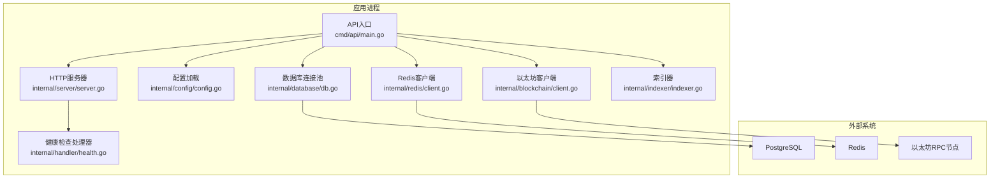
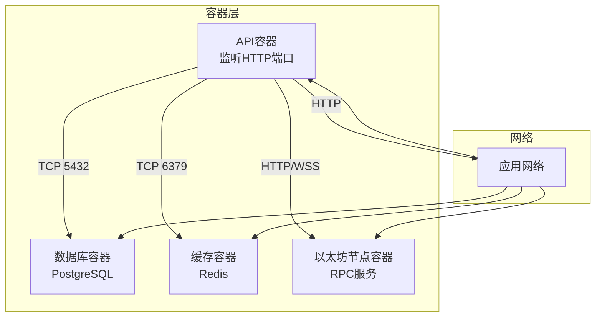
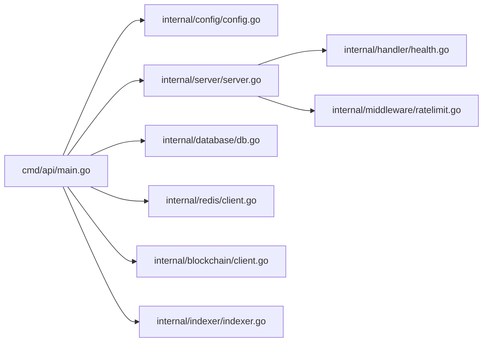

# 容器化部署

<cite>
**本文引用的文件**
- [cmd/api/main.go](file://cmd/api/main.go)
- [internal/config/config.go](file://internal/config/config.go)
- [internal/server/server.go](file://internal/server/server.go)
- [internal/database/db.go](file://internal/database/db.go)
- [internal/redis/client.go](file://internal/redis/client.go)
- [internal/blockchain/client.go](file://internal/blockchain/client.go)
- [internal/handler/health.go](file://internal/handler/health.go)
- [internal/middleware/ratelimit.go](file://internal/middleware/ratelimit.go)
- [internal/indexer/indexer.go](file://internal/indexer/indexer.go)
- [go.mod](file://go.mod)
- [migrations/000001_init.up.sql](file://migrations/000001_init.up.sql)
</cite>

## 目录
1. [简介](#简介)
2. [项目结构](#项目结构)
3. [核心组件](#核心组件)
4. [架构总览](#架构总览)
5. [详细组件分析](#详细组件分析)
6. [依赖关系分析](#依赖关系分析)
7. [性能考量](#性能考量)
8. [故障排查指南](#故障排查指南)
9. [结论](#结论)
10. [附录](#附录)

## 简介
本指南面向PredictionDIDSimple后端服务的容器化部署，覆盖以下主题：
- Docker镜像构建：多阶段构建与镜像体积优化
- Docker Compose编排：服务定义、网络与卷挂载
- 容器间通信：服务发现、网络隔离与端口映射
- 生产部署策略：负载均衡、健康检查、自动重启
- 监控与日志：容器内日志采集与外部聚合
- 滚动更新与回滚：基于副本数与就地升级策略
- Kubernetes部署：Deployment、Service与ConfigMap示例

## 项目结构
后端采用Go模块化分层设计，核心入口为API服务，依赖数据库（PostgreSQL）、Redis缓存、以太坊RPC以及可选的索引器与预言机客户端。

图表来源
- [cmd/api/main.go](file://cmd/api/main.go#L24-L118)
- [internal/server/server.go](file://internal/server/server.go#L35-L85)
- [internal/config/config.go](file://internal/config/config.go#L45-L97)
- [internal/database/db.go](file://internal/database/db.go#L14-L26)
- [internal/redis/client.go](file://internal/redis/client.go#L10-L22)
- [internal/blockchain/client.go](file://internal/blockchain/client.go#L19-L79)
- [internal/indexer/indexer.go](file://internal/indexer/indexer.go#L35-L58)
- [internal/handler/health.go](file://internal/handler/health.go#L17-L22)

章节来源
- [cmd/api/main.go](file://cmd/api/main.go#L24-L118)
- [internal/server/server.go](file://internal/server/server.go#L35-L85)
- [internal/config/config.go](file://internal/config/config.go#L45-L97)

## 核心组件
- 配置管理：从环境变量加载运行参数，支持HTTP端口、数据库URL、Redis URL、以太坊RPC、链ID、索引器轮询等。
- HTTP服务器：基于Chi路由，内置CORS、限流、Geo阻断、健康/就绪检查。
- 数据库：使用pgx连接池，启动时执行迁移脚本。
- 缓存：Redis客户端，支持可选降级模式。
- 区块链：以太坊客户端，后台定时心跳校验链ID与连通性。
- 索引器：按轮询周期扫描工厂合约事件，写入本地数据库。

章节来源
- [internal/config/config.go](file://internal/config/config.go#L10-L43)
- [internal/server/server.go](file://internal/server/server.go#L22-L85)
- [internal/database/db.go](file://internal/database/db.go#L14-L42)
- [internal/redis/client.go](file://internal/redis/client.go#L10-L22)
- [internal/blockchain/client.go](file://internal/blockchain/client.go#L12-L79)
- [internal/indexer/indexer.go](file://internal/indexer/indexer.go#L24-L104)

## 架构总览
下图展示容器化部署下的服务交互与数据流。

图表来源
- [internal/server/server.go](file://internal/server/server.go#L77-L84)
- [internal/config/config.go](file://internal/config/config.go#L47-L51)
- [internal/database/db.go](file://internal/database/db.go#L14-L26)
- [internal/redis/client.go](file://internal/redis/client.go#L10-L16)
- [internal/blockchain/client.go](file://internal/blockchain/client.go#L42-L79)

## 详细组件分析

### Docker镜像构建（多阶段与体积优化）
目标：最小化镜像体积、缩短构建时间、确保运行时安全与可审计性。

- 基础镜像选择
  - 构建阶段：使用官方Go镜像，启用模块缓存与构建优化。
  - 运行阶段：使用精简的基础镜像（如distroless或alpine），仅包含运行时所需二进制与证书。
- 多阶段构建要点
  - 第一阶段：下载依赖、编译静态二进制（CGO默认关闭，避免链接系统库）。
  - 第二阶段：复制编译产物到运行镜像，不携带源码与构建工具。
- 资源与体积控制
  - 使用只读根文件系统、最小权限用户运行。
  - 合理设置缓存层顺序，提升重复构建命中率。
  - 排除测试文件、开发工具与调试符号。
- 迁移脚本打包
  - 将migrations目录随应用镜像分发，启动时自动执行迁移。
- 参考实现路径
  - 构建入口与运行命令：[cmd/api/main.go](file://cmd/api/main.go#L24-L118)
  - 迁移执行逻辑：[internal/database/db.go](file://internal/database/db.go#L28-L42)
  - 迁移SQL样例：[migrations/000001_init.up.sql](file://migrations/000001_init.up.sql#L1-L10)

章节来源
- [cmd/api/main.go](file://cmd/api/main.go#L24-L118)
- [internal/database/db.go](file://internal/database/db.go#L28-L42)
- [migrations/000001_init.up.sql](file://migrations/000001_init.up.sql#L1-L10)

### Docker Compose编排（服务、网络与卷）
- 服务定义
  - API服务：暴露HTTP端口；挂载迁移脚本目录；注入环境变量（数据库URL、Redis URL、以太坊RPC、链ID等）。
  - 数据库：持久化卷；初始化脚本通过卷挂载或启动脚本执行。
  - 缓存：持久化卷；无状态服务。
  - 以太坊节点：可使用公共RPC或自建节点容器。
- 网络设置
  - 自定义桥接网络，隔离应用与外部网络；容器间通过服务名访问。
- 卷挂载
  - 迁移脚本：读取权限即可；避免写入。
  - 数据库：命名卷或绑定挂载持久化数据。
- 参考实现路径
  - 端口监听与路由注册：[internal/server/server.go](file://internal/server/server.go#L77-L84)
  - 配置加载与环境变量：[internal/config/config.go](file://internal/config/config.go#L45-L97)

章节来源
- [internal/server/server.go](file://internal/server/server.go#L77-L84)
- [internal/config/config.go](file://internal/config/config.go#L45-L97)

### 容器间通信（服务发现、隔离与端口映射）
- 服务发现
  - 使用容器网络中的服务名进行内部调用（例如通过REDIS_URL、DATABASE_URL指向对应服务名）。
- 网络隔离
  - 将API置于隔离网络；数据库与缓存分别置于独立网络或同一网络但限制出站。
- 端口映射
  - API对外暴露HTTP端口；数据库与缓存仅对内暴露；以太坊RPC根据部署策略决定是否外网可达。
- 参考实现路径
  - Redis与数据库连接建立：[internal/redis/client.go](file://internal/redis/client.go#L10-L16)、[internal/database/db.go](file://internal/database/db.go#L14-L20)
  - 以太坊客户端心跳与链ID校验：[internal/blockchain/client.go](file://internal/blockchain/client.go#L26-L79)

章节来源
- [internal/redis/client.go](file://internal/redis/client.go#L10-L16)
- [internal/database/db.go](file://internal/database/db.go#L14-L20)
- [internal/blockchain/client.go](file://internal/blockchain/client.go#L26-L79)

### 生产部署策略（负载均衡、健康检查、自动重启）
- 负载均衡
  - 在容器编排平台（Compose/Kubernetes）中使用副本集与反向代理/服务网格实现水平扩展。
- 健康检查
  - 使用/health与/ready端点进行探针检查；/ready会检查数据库、Redis与以太坊RPC状态。
- 自动重启
  - 设置重启策略（始终/失败重启），结合优雅停机信号处理。
- 参考实现路径
  - 健康检查处理器：[internal/handler/health.go](file://internal/handler/health.go#L17-L67)
  - 优雅停机与信号处理：[cmd/api/main.go](file://cmd/api/main.go#L107-L117)

章节来源
- [internal/handler/health.go](file://internal/handler/health.go#L17-L67)
- [cmd/api/main.go](file://cmd/api/main.go#L107-L117)

### 监控与日志（容器内与外部聚合）
- 日志输出
  - 应用标准输出/错误输出；建议统一格式化日志（JSON）便于解析。
- 指标暴露
  - 可在现有API中增加指标端点或集成第三方库；Prometheus抓取需在编排层开放端口。
- 外部聚合
  - 使用日志收集器（如Fluent Bit/Fluentd/OpenTelemetry）采集容器日志；集中存储于ELK/Cloud Logging。
- 参考实现路径
  - 指标端点注册位置（预留）：[internal/handler/api.go](file://internal/handler/api.go#L41-L41)

章节来源
- [internal/handler/api.go](file://internal/handler/api.go#L41-L41)

### 滚动更新与回滚（副本数与就地升级）
- 滚动更新
  - 增量替换副本，保持服务可用；结合就绪探针确保新实例完全就绪后再切流量。
- 回滚
  - 记录镜像版本标签；失败时回退至上一稳定版本。
- 参考实现路径
  - 优雅停机流程：[cmd/api/main.go](file://cmd/api/main.go#L112-L117)

章节来源
- [cmd/api/main.go](file://cmd/api/main.go#L112-L117)

### Kubernetes部署示例（Deployment、Service、ConfigMap）
- ConfigMap
  - 存放非敏感配置键值（如HTTP端口、速率限制、国家白名单开关等）。
- Secret
  - 存放敏感信息（DATABASE_URL、REDIS_URL、JWT密钥、以太坊私钥、管理员API Key等）。
- Deployment
  - 定义副本数、资源请求/限制、探针（liveness/readiness）、滚动更新策略。
- Service
  - ClusterIP/LoadBalancer暴露服务；Ingress用于外部访问。
- 参考实现路径
  - 配置字段与默认值：[internal/config/config.go](file://internal/config/config.go#L45-L97)
  - 健康/就绪端点：[internal/handler/health.go](file://internal/handler/health.go#L17-L22)
  - 端口监听地址：[internal/server/server.go](file://internal/server/server.go#L77-L84)

章节来源
- [internal/config/config.go](file://internal/config/config.go#L45-L97)
- [internal/handler/health.go](file://internal/handler/health.go#L17-L22)
- [internal/server/server.go](file://internal/server/server.go#L77-L84)

## 依赖关系分析
- 组件耦合
  - API入口依赖配置、数据库、Redis、以太坊客户端与索引器；服务器层负责路由与中间件；健康检查聚合各子系统状态。
- 外部依赖
  - PostgreSQL、Redis、以太坊RPC；迁移脚本通过文件系统提供。
- 循环依赖
  - 当前结构清晰，未见循环导入；若引入新模块需注意包边界。

图表来源
- [cmd/api/main.go](file://cmd/api/main.go#L24-L118)
- [internal/config/config.go](file://internal/config/config.go#L45-L97)
- [internal/server/server.go](file://internal/server/server.go#L35-L85)
- [internal/database/db.go](file://internal/database/db.go#L14-L42)
- [internal/redis/client.go](file://internal/redis/client.go#L10-L22)
- [internal/blockchain/client.go](file://internal/blockchain/client.go#L19-L79)
- [internal/indexer/indexer.go](file://internal/indexer/indexer.go#L35-L104)
- [internal/handler/health.go](file://internal/handler/health.go#L17-L67)
- [internal/middleware/ratelimit.go](file://internal/middleware/ratelimit.go#L36-L55)

章节来源
- [go.mod](file://go.mod#L5-L14)

## 性能考量
- 连接池与超时
  - 数据库使用连接池；合理设置读写超时与最大连接数。
- 缓存降级
  - Redis不可用时允许服务继续运行，但部分功能降级。
- 限流与地理阻断
  - 基于IP的分钟级限流与Geo阻断减少恶意请求。
- 索引器轮询
  - 控制轮询间隔与区块跨度，避免对RPC造成压力。
- 参考实现路径
  - 连接池与迁移：[internal/database/db.go](file://internal/database/db.go#L14-L42)
  - 限流中间件：[internal/middleware/ratelimit.go](file://internal/middleware/ratelimit.go#L36-L55)
  - 索引器轮询：[internal/indexer/indexer.go](file://internal/indexer/indexer.go#L91-L104)

章节来源
- [internal/database/db.go](file://internal/database/db.go#L14-L42)
- [internal/middleware/ratelimit.go](file://internal/middleware/ratelimit.go#L36-L55)
- [internal/indexer/indexer.go](file://internal/indexer/indexer.go#L91-L104)

## 故障排查指南
- 健康检查失败
  - 使用/ready端点查看数据库、Redis与RPC状态；确认连接URL与凭据正确。
- 数据库迁移失败
  - 检查迁移脚本路径与权限；确认数据库已初始化。
- Redis不可达
  - 检查网络连通性与认证；必要时降级为无缓存模式。
- 以太坊RPC异常
  - 校验链ID与URL；关注后台心跳日志。
- 参考实现路径
  - 健康检查逻辑：[internal/handler/health.go](file://internal/handler/health.go#L28-L67)
  - 迁移执行：[internal/database/db.go](file://internal/database/db.go#L28-L42)
  - RPC心跳：[internal/blockchain/client.go](file://internal/blockchain/client.go#L26-L79)

章节来源
- [internal/handler/health.go](file://internal/handler/health.go#L28-L67)
- [internal/database/db.go](file://internal/database/db.go#L28-L42)
- [internal/blockchain/client.go](file://internal/blockchain/client.go#L26-L79)

## 结论
通过多阶段构建与精简运行时镜像，结合Compose/Kubernetes编排，可实现PredictionDIDSimple的高效、可观测与可恢复的容器化部署。建议在生产环境中配合负载均衡、完善的健康检查与日志监控体系，并制定滚动更新与回滚预案。

## 附录
- 关键端点
  - /health：基础健康
  - /ready：就绪检查（数据库、Redis、RPC）
- 关键环境变量（示例）
  - DATABASE_URL、REDIS_URL、ETH_RPC_URL、CHAIN_ID、HTTP_PORT、JWT_SECRET、ADMIN_API_KEY、ORACLE_*（可选）
- 迁移脚本
  - 初始化脚本位于migrations目录，启动时自动执行