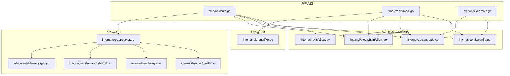
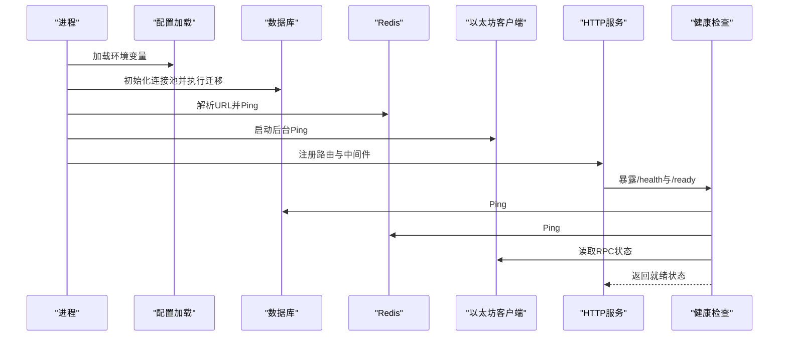
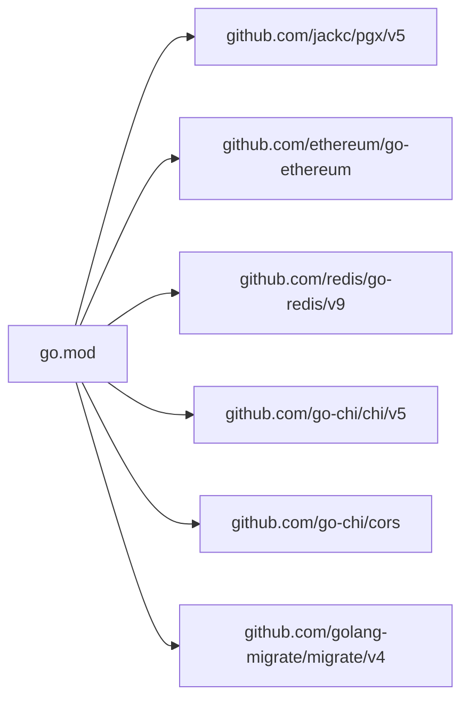

# 故障排除与运维

<cite>
**本文引用的文件**
- [cmd/api/main.go](file://cmd/api/main.go)
- [cmd/oracle/main.go](file://cmd/oracle/main.go)
- [cmd/indexer/main.go](file://cmd/indexer/main.go)
- [internal/config/config.go](file://internal/config/config.go)
- [internal/database/db.go](file://internal/database/db.go)
- [internal/redis/client.go](file://internal/redis/client.go)
- [internal/blockchain/client.go](file://internal/blockchain/client.go)
- [internal/server/server.go](file://internal/server/server.go)
- [internal/handler/health.go](file://internal/handler/health.go)
- [internal/alert/notifier.go](file://internal/alert/notifier.go)
- [internal/middleware/ratelimit.go](file://internal/middleware/ratelimit.go)
- [internal/middleware/geo.go](file://internal/middleware/geo.go)
- [internal/handler/api.go](file://internal/handler/api.go)
- [migrations/000001_init.up.sql](file://migrations/000001_init.up.sql)
- [go.mod](file://go.mod)
</cite>

## 目录
1. [简介](#简介)
2. [项目结构](#项目结构)
3. [核心组件](#核心组件)
4. [架构总览](#架构总览)
5. [详细组件分析](#详细组件分析)
6. [依赖关系分析](#依赖关系分析)
7. [性能考量](#性能考量)
8. [故障排除指南](#故障排除指南)
9. [备份与恢复](#备份与恢复)
10. [运维工具与脚本](#运维工具与脚本)
11. [版本升级与回滚](#版本升级与回滚)
12. [安全事件响应与应急处理](#安全事件响应与应急处理)
13. [运维检查清单与定期维护](#运维检查清单与定期维护)
14. [结论](#结论)

## 简介
本指南面向PredictionDIDSimple后端的运维与开发团队，提供系统性故障排除方法、性能瓶颈定位、常见问题处置、备份恢复流程、自动化运维工具、版本升级与回滚策略、安全应急响应以及定期维护任务清单。文档基于实际源码进行分析，确保可操作性和可追溯性。

## 项目结构
后端采用多命令入口（API、索引器、预言机、迁移等）与清晰的分层架构：配置加载、数据库连接池、Redis客户端、以太坊链客户端、HTTP服务器与路由、健康检查与中间件、告警通知等模块协同工作。

图表来源
- [cmd/api/main.go](file://cmd/api/main.go#L24-L117)
- [cmd/oracle/main.go](file://cmd/oracle/main.go#L18-L55)
- [cmd/indexer/main.go](file://cmd/indexer/main.go#L15-L43)
- [internal/config/config.go](file://internal/config/config.go#L45-L96)
- [internal/database/db.go](file://internal/database/db.go#L14-L42)
- [internal/redis/client.go](file://internal/redis/client.go#L10-L22)
- [internal/blockchain/client.go](file://internal/blockchain/client.go#L19-L78)
- [internal/server/server.go](file://internal/server/server.go#L35-L84)
- [internal/handler/health.go](file://internal/handler/health.go#L17-L67)
- [internal/middleware/ratelimit.go](file://internal/middleware/ratelimit.go#L36-L55)
- [internal/middleware/geo.go](file://internal/middleware/geo.go#L10-L31)
- [internal/alert/notifier.go](file://internal/alert/notifier.go#L16-L35)

章节来源
- [cmd/api/main.go](file://cmd/api/main.go#L1-L118)
- [internal/config/config.go](file://internal/config/config.go#L1-L128)

## 核心组件
- 配置加载：从环境变量读取运行参数，含数据库、Redis、以太坊RPC、链ID、索引器轮询、预言机冷却与时间锁、速率限制、合规开关、环境等。
- 数据库：使用连接池与迁移工具，启动时执行迁移，健康检查中进行Ping验证。
- Redis：解析URL并Ping探测，支持降级模式（非致命）。
- 区块链客户端：定时后台Ping校验RPC连通性与链ID一致性，暴露状态供健康检查。
- HTTP服务：注册健康/就绪检查、业务路由、CORS、限流与地理阻断中间件。
- 健康检查：聚合数据库、Redis、RPC状态，返回就绪状态。
- 预言机与索引器：独立进程，按配置拉取数据或监听事件，具备告警能力。

章节来源
- [internal/config/config.go](file://internal/config/config.go#L10-L96)
- [internal/database/db.go](file://internal/database/db.go#L14-L42)
- [internal/redis/client.go](file://internal/redis/client.go#L10-L22)
- [internal/blockchain/client.go](file://internal/blockchain/client.go#L26-L78)
- [internal/server/server.go](file://internal/server/server.go#L35-L84)
- [internal/handler/health.go](file://internal/handler/health.go#L17-L67)
- [cmd/oracle/main.go](file://cmd/oracle/main.go#L18-L55)
- [cmd/indexer/main.go](file://cmd/indexer/main.go#L15-L43)

## 架构总览
系统通过多个独立进程提供服务：API服务对外提供REST接口；索引器持续抓取链上事件并写入数据库；预言机周期性查询外部数据并提交结果；健康检查统一暴露就绪状态；配置集中管理，基础设施组件在启动阶段完成初始化与自检。

图表来源
- [cmd/api/main.go](file://cmd/api/main.go#L24-L117)
- [internal/handler/health.go](file://internal/handler/health.go#L24-L67)

## 详细组件分析

### 配置与环境变量
- 关键配置项包括数据库URL、Redis URL、以太坊RPC、链ID、索引器轮询间隔、预言机冷却与时间锁、速率限制、合规开关、国家封锁名单、管理员密钥、VC签发密钥、告警Webhook等。
- 启动前必须设置数据库URL；链ID与索引器起始区块为数值型，非法值会报错。

章节来源
- [internal/config/config.go](file://internal/config/config.go#L45-L96)

### 数据库与迁移
- 连接池初始化失败直接导致进程退出；健康检查中也会对连接池进行Ping验证。
- 迁移通过文件系统路径自动识别，支持相对与绝对路径两种部署形态。

章节来源
- [internal/database/db.go](file://internal/database/db.go#L14-L42)
- [cmd/api/main.go](file://cmd/api/main.go#L33-L40)

### Redis客户端
- 解析URL失败会记录警告；Ping超时短路，失败不阻塞主流程但标记为降级。
- 健康检查对Redis仅做可达性判断，不作为就绪判定的硬性条件。

章节来源
- [internal/redis/client.go](file://internal/redis/client.go#L10-L22)
- [cmd/api/main.go](file://cmd/api/main.go#L48-L59)
- [internal/handler/health.go](file://internal/handler/health.go#L45-L52)

### 区块链客户端与RPC健康
- 定时后台Ping，失败记录警告并更新RPC可用状态；链ID不匹配也会标记不可用。
- 健康检查读取RPC可用状态与链ID，用于就绪判断。

章节来源
- [internal/blockchain/client.go](file://internal/blockchain/client.go#L26-L78)
- [cmd/api/main.go](file://cmd/api/main.go#L61-L62)
- [internal/handler/health.go](file://internal/handler/health.go#L54-L59)

### HTTP服务与中间件
- 路由注册：健康检查、业务接口、认证与管理接口分组。
- 中间件：请求ID、真实IP、日志、恢复、限流、地理阻断。
- CORS允许指定前端地址与必要头部，支持凭据。

章节来源
- [internal/server/server.go](file://internal/server/server.go#L35-L84)
- [internal/middleware/ratelimit.go](file://internal/middleware/ratelimit.go#L36-L55)
- [internal/middleware/geo.go](file://internal/middleware/geo.go#L10-L31)

### 健康检查与就绪检查
- /health：简单返回服务可用。
- /ready：聚合数据库、Redis、RPC状态；任一不可用则返回非就绪。

章节来源
- [internal/handler/health.go](file://internal/handler/health.go#L17-L67)

### 预言机与索引器
- 预言机：根据配置构造OracleClient，启动工作循环，失败通过告警通知。
- 索引器：按配置构造索引器实例并运行，支持工厂合约地址为空时跳过。

章节来源
- [cmd/oracle/main.go](file://cmd/oracle/main.go#L18-L55)
- [cmd/indexer/main.go](file://cmd/indexer/main.go#L15-L43)

## 依赖关系分析
- 外部依赖集中在数据库驱动、以太坊客户端、Redis客户端、HTTP路由与CORS、迁移工具等。
- 组件耦合度低，通过配置与接口解耦，便于独立部署与故障隔离。

图表来源
- [go.mod](file://go.mod#L5-L14)

章节来源
- [go.mod](file://go.mod#L1-L56)

## 性能考量
- 数据库连接池：合理设置池大小与超时，避免并发高峰下的连接争用。
- Redis：在高并发场景下建议启用持久化与哨兵/集群，降低单点风险。
- 以太坊RPC：多节点配置与健康检测结合，避免单点故障影响。
- 限流与地理阻断：防止恶意请求与区域合规限制带来的资源消耗。
- 健康检查：短超时Ping避免阻塞主流程，就绪检查严格控制流量进入。

章节来源
- [internal/database/db.go](file://internal/database/db.go#L22-L26)
- [internal/redis/client.go](file://internal/redis/client.go#L18-L22)
- [internal/middleware/ratelimit.go](file://internal/middleware/ratelimit.go#L36-L55)
- [internal/middleware/geo.go](file://internal/middleware/geo.go#L10-L31)

## 故障排除指南

### 日志分析
- API进程：启动阶段打印迁移、数据库连接、Redis连接（降级）、RPC后台Ping、服务监听与优雅关闭信息。
- 健康检查：/ready返回详细子系统状态与错误信息，便于快速定位。
- 预言机/索引器：启动与运行过程中的错误会记录并尝试通过告警发送。

章节来源
- [cmd/api/main.go](file://cmd/api/main.go#L33-L117)
- [internal/handler/health.go](file://internal/handler/health.go#L28-L67)
- [cmd/oracle/main.go](file://cmd/oracle/main.go#L18-L55)

### 错误追踪
- 数据库：连接失败或Ping失败会在/ready中体现；迁移失败直接导致进程退出。
- Redis：解析失败与Ping失败均记录警告，不影响API主流程但标记降级。
- RPC：后台Ping失败或链ID不一致会标记不可用，影响就绪状态。
- 限流与地理阻断：对特定路径放行，其余请求被拒绝时返回明确错误体。

章节来源
- [internal/database/db.go](file://internal/database/db.go#L14-L26)
- [internal/redis/client.go](file://internal/redis/client.go#L10-L22)
- [internal/blockchain/client.go](file://internal/blockchain/client.go#L42-L78)
- [internal/middleware/ratelimit.go](file://internal/middleware/ratelimit.go#L36-L55)
- [internal/middleware/geo.go](file://internal/middleware/geo.go#L10-L31)

### 性能瓶颈定位
- CPU/内存：结合/ready输出与业务接口耗时，定位是否为数据库慢查询、Redis热点或RPC延迟。
- 网络：检查RPC节点可用性与链ID一致性，确认网络抖动与防火墙策略。
- 并发：调整限流阈值与连接池大小，观察/ready状态变化。

章节来源
- [internal/handler/health.go](file://internal/handler/health.go#L28-L67)
- [internal/middleware/ratelimit.go](file://internal/middleware/ratelimit.go#L36-L55)

### 常见问题与解决方案

- 数据库连接问题
  - 现象：/ready显示数据库不可用或迁移失败。
  - 排查：确认DATABASE_URL格式正确、网络可达、PostgreSQL服务正常。
  - 处理：修复连接串与网络，重新部署；如需回滚，保留旧镜像与迁移历史。
  
  章节来源
  - [internal/database/db.go](file://internal/database/db.go#L14-L42)
  - [cmd/api/main.go](file://cmd/api/main.go#L33-L40)

- Redis连接失败
  - 现象：/ready显示Redis降级或API启动阶段记录警告。
  - 排查：确认REDIS_URL格式、网络连通、密码与DB选择。
  - 处理：修复URL与网络；若为降级，业务仍可运行但缓存失效。
  
  章节来源
  - [internal/redis/client.go](file://internal/redis/client.go#L10-L22)
  - [cmd/api/main.go](file://cmd/api/main.go#L48-L59)

- 区块链节点通信异常
  - 现象：RPC后台Ping失败或链ID不一致，/ready显示RPC不可用。
  - 排查：检查ETH_RPC_URL、链ID配置、节点健康与防火墙。
  - 处理：切换到备用RPC、修正链ID、修复网络。
  
  章节来源
  - [internal/blockchain/client.go](file://internal/blockchain/client.go#L42-L78)
  - [cmd/api/main.go](file://cmd/api/main.go#L61-L62)

- API服务崩溃
  - 现象：进程退出或无法优雅关闭。
  - 排查：查看信号处理、优雅关闭超时、依赖初始化顺序。
  - 处理：优化依赖初始化顺序，增加日志与告警，缩短优雅关闭超时。
  
  章节来源
  - [cmd/api/main.go](file://cmd/api/main.go#L107-L117)

- 预言机/索引器异常
  - 现象：进程启动即退出或运行中报错。
  - 排查：确认Oracle相关地址与私钥、数据库连接、Mock数据路径。
  - 处理：补齐配置，修复数据路径，启用告警以便及时发现。
  
  章节来源
  - [cmd/oracle/main.go](file://cmd/oracle/main.go#L18-L55)
  - [cmd/indexer/main.go](file://cmd/indexer/main.go#L15-L43)

## 备份与恢复

### 数据库备份策略
- 使用PostgreSQL标准备份工具进行全量与增量备份，结合归档日志实现时间点恢复。
- 在迁移前后记录schema_meta版本，确保恢复后可执行对应迁移。

章节来源
- [migrations/000001_init.up.sql](file://migrations/000001_init.up.sql#L3-L9)
- [internal/database/db.go](file://internal/database/db.go#L28-L42)

### 配置备份
- 备份环境变量与配置文件（如存在），确保链ID、RPC、Redis、管理员密钥等关键参数完整。
- 变更配置需走变更流程，记录版本与生效范围。

章节来源
- [internal/config/config.go](file://internal/config/config.go#L45-L96)

### 灾难恢复演练
- 定期进行备份恢复演练，验证恢复时间目标（RTO）与恢复点目标（RPO）。
- 验证健康检查与就绪检查在恢复后的可用性。

章节来源
- [internal/handler/health.go](file://internal/handler/health.go#L17-L67)

## 运维工具与脚本
- 健康检查脚本：调用/ready与/health，解析返回状态，异常时触发告警。
- 监控脚本：采集数据库连接池指标、Redis连接数与延迟、RPC可用性与链ID。
- 维护命令：重启API/索引器/预言机进程，滚动更新时先停止旧进程再启动新进程。
- 告警集成：通过Webhook将异常事件上报至监控平台。

章节来源
- [internal/handler/health.go](file://internal/handler/health.go#L17-L67)
- [internal/alert/notifier.go](file://internal/alert/notifier.go#L16-L35)

## 版本升级与回滚

### 升级流程
- 准备：打包新二进制，准备迁移脚本，备份数据库与配置。
- 执行：停止旧进程，应用迁移，启动新进程，验证/ready与关键接口。
- 回收：清理旧镜像与无用迁移。

章节来源
- [cmd/api/main.go](file://cmd/api/main.go#L33-L40)

### 回滚策略
- 快速回滚：回退到上一版本二进制，必要时回退到上一迁移版本。
- 数据回滚：如涉及schema变更，依据迁移脚本执行down操作。
- 验证：回滚后运行/ready与关键接口测试，确保服务可用。

章节来源
- [internal/database/db.go](file://internal/database/db.go#L28-L42)

## 安全事件响应与应急处理

### 应急响应流程
- 发现异常：通过/ready与日志定位问题来源。
- 评估影响：判断是否影响用户访问与数据一致性。
- 隔离与修复：临时禁用受影响功能、修复配置或依赖、重启服务。
- 通知与复盘：通过告警Webhook通知团队，记录事件与改进措施。

章节来源
- [internal/handler/health.go](file://internal/handler/health.go#L28-L67)
- [internal/alert/notifier.go](file://internal/alert/notifier.go#L16-L35)

## 运维检查清单与定期维护

- 每日
  - 检查/ready状态，关注数据库、Redis、RPC可用性。
  - 查看进程日志，确认无致命错误。
  - 校验速率限制与地理阻断规则是否符合预期。
- 每周
  - 备份数据库与配置，验证备份完整性。
  - 更新依赖与补丁，执行安全扫描。
- 每月
  - 执行灾难恢复演练，验证RTO/RPO。
  - 评估性能指标，优化连接池与限流阈值。

章节来源
- [internal/handler/health.go](file://internal/handler/health.go#L17-L67)
- [internal/middleware/ratelimit.go](file://internal/middleware/ratelimit.go#L36-L55)
- [internal/middleware/geo.go](file://internal/middleware/geo.go#L10-L31)

## 结论
本指南提供了PredictionDIDSimple后端的系统化运维方案，涵盖故障诊断、性能优化、备份恢复、自动化工具、版本升级与回滚、安全应急响应及日常维护。建议结合实际部署环境细化脚本与告警策略，并定期演练以提升稳定性与可恢复性。