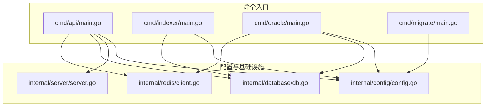
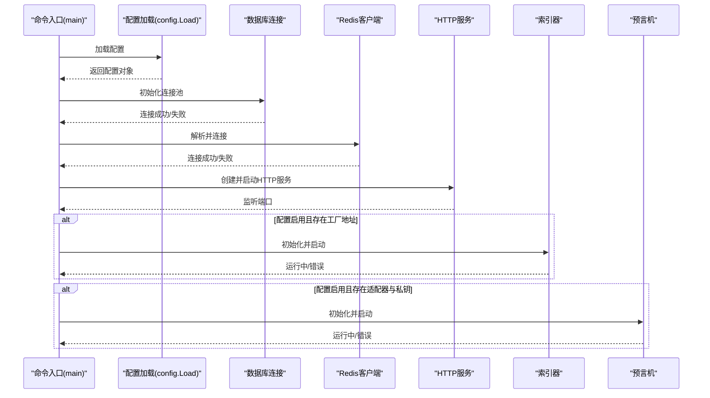
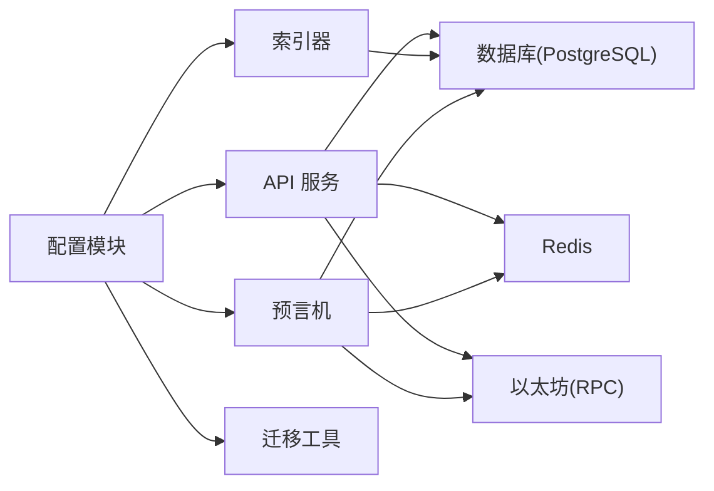

# 环境配置

<cite>
**本文引用的文件**
- [internal/config/config.go](file://internal/config/config.go)
- [cmd/api/main.go](file://cmd/api/main.go)
- [cmd/indexer/main.go](file://cmd/indexer/main.go)
- [cmd/oracle/main.go](file://cmd/oracle/main.go)
- [cmd/migrate/main.go](file://cmd/migrate/main.go)
- [internal/server/server.go](file://internal/server/server.go)
- [internal/database/db.go](file://internal/database/db.go)
- [internal/redis/client.go](file://internal/redis/client.go)
</cite>

## 目录
1. [简介](#简介)
2. [项目结构](#项目结构)
3. [核心组件](#核心组件)
4. [架构总览](#架构总览)
5. [详细组件分析](#详细组件分析)
6. [依赖关系分析](#依赖关系分析)
7. [性能考虑](#性能考虑)
8. [故障排查指南](#故障排查指南)
9. [结论](#结论)
10. [附录](#附录)

## 简介
本指南面向 PredictionDIDSimple 的运维与开发团队，提供从开发到生产的环境配置全谱系说明。内容覆盖环境变量定义、配置文件结构与默认值管理、各服务组件（API 服务、索引器、预言机、迁移工具）的配置参数、配置验证方法、常见错误排查、Docker 环境下的变量注入与配置挂载策略，以及安全配置要点（密钥管理、数据库连接安全、网络配置）。目标是帮助团队在不同环境中快速、一致地部署与运行系统。

## 项目结构
后端采用多命令入口的分层组织方式：每个可执行程序位于独立目录下，通过共享的内部模块加载统一配置并完成各自职责。核心配置由统一的配置模块集中加载与解析，确保所有组件使用一致的配置来源。

图表来源
- [cmd/api/main.go](file://cmd/api/main.go#L24-L98)
- [cmd/indexer/main.go](file://cmd/indexer/main.go#L15-L39)
- [cmd/oracle/main.go](file://cmd/oracle/main.go#L18-L50)
- [cmd/migrate/main.go](file://cmd/migrate/main.go#L12-L26)
- [internal/config/config.go](file://internal/config/config.go#L45-L96)
- [internal/server/server.go](file://internal/server/server.go#L35-L84)
- [internal/database/db.go](file://internal/database/db.go#L14-L42)
- [internal/redis/client.go](file://internal/redis/client.go#L10-L22)

章节来源
- [cmd/api/main.go](file://cmd/api/main.go#L24-L98)
- [cmd/indexer/main.go](file://cmd/indexer/main.go#L15-L39)
- [cmd/oracle/main.go](file://cmd/oracle/main.go#L18-L50)
- [cmd/migrate/main.go](file://cmd/migrate/main.go#L12-L26)
- [internal/config/config.go](file://internal/config/config.go#L45-L96)

## 核心组件
本节聚焦“配置”这一核心组件，说明其职责、字段含义、默认值来源与校验逻辑，并给出开发与生产环境的差异对比与最佳实践。

- 职责与范围
  - 统一加载与解析环境变量，生成结构化配置对象
  - 提供默认值与类型转换（字符串/整数/布尔）
  - 对关键必填项进行早期校验（例如数据库 URL）

- 关键字段与默认值
  - 基础运行
    - HTTP 端口：未设置时默认为开发端口
    - 应用环境：默认 development
  - 数据库
    - 连接串：必须提供；无默认值
    - 迁移路径：自动探测 migrations 或 backend/migrations
  - 缓存
    - Redis 地址：默认本地开发地址
  - 区块链
    - RPC 主节点与备用节点：默认本地开发节点
    - 链 ID：默认本地开发链 ID
    - 工厂合约地址、适配器地址、DID 注册表地址等：按需启用
    - 预言机私钥：按需启用
  - 安全与合规
    - JWT 密钥：默认开发密钥（生产必须替换）
    - SIWE 域名与 URI：默认开发域名与前端地址
    - Geo 阻断开关与国家列表：默认开启并阻断指定国家
    - KYC/Webhook 密钥：按需启用
    - 合规要求开关：默认开启
  - 预言机工作流
    - 冷却时间、时间锁、轮询间隔：默认开发参数
  - 索引器
    - 轮询间隔、起始区块：默认开发参数
  - 其他
    - 管理员 API Key、VC 发行者密钥、告警 Webhook：按需启用

- 校验与错误处理
  - 必填项缺失会直接报错
  - 数值型字段解析失败回退默认值
  - 国家列表解析为空即不阻断

章节来源
- [internal/config/config.go](file://internal/config/config.go#L10-L43)
- [internal/config/config.go](file://internal/config/config.go#L45-L96)
- [internal/config/config.go](file://internal/config/config.go#L99-L127)

## 架构总览
下图展示各命令入口如何通过统一配置模块启动服务、数据库与缓存，并在需要时启用索引器与预言机功能。

图表来源
- [cmd/api/main.go](file://cmd/api/main.go#L24-L98)
- [internal/config/config.go](file://internal/config/config.go#L45-L96)
- [internal/database/db.go](file://internal/database/db.go#L14-L26)
- [internal/redis/client.go](file://internal/redis/client.go#L10-L22)
- [internal/server/server.go](file://internal/server/server.go#L35-L84)

## 详细组件分析

### API 服务配置
- 启动流程
  - 加载配置
  - 执行数据库迁移
  - 初始化数据库连接池
  - 可选初始化 Redis 客户端并健康检查
  - 初始化以太坊客户端并后台心跳
  - 条件启动索引器（当工厂地址存在时）
  - 条件启动预言机管理员客户端（当适配器与私钥存在时）
  - 启动 HTTP 服务监听端口
- 关键配置项
  - HTTP 端口、数据库 URL、Redis URL、RPC 地址、链 ID
  - 工厂地址、适配器地址、DID 注册表地址
  - JWT 密钥、SIWE 域名与 URI
  - Geo 阻断、速率限制、合规开关
  - 管理员 API Key、VC 发行者密钥、告警 Webhook
- 安全与网络
  - CORS 允许本地开发前端与凭证传递头
  - 速率限制中间件与地理阻断中间件
  - 健康检查路由依赖数据库、Redis、链状态

章节来源
- [cmd/api/main.go](file://cmd/api/main.go#L24-L98)
- [internal/server/server.go](file://internal/server/server.go#L35-L84)

### 索引器配置
- 启动流程
  - 加载配置
  - 初始化数据库连接池
  - 构造索引器实例并运行
- 关键配置项
  - 数据库 URL、轮询间隔、起始区块
  - 工厂地址（决定是否启用）
- 使用场景
  - 在 API 服务中作为可选后台任务启动
  - 独立运行用于离线或批量同步

章节来源
- [cmd/indexer/main.go](file://cmd/indexer/main.go#L15-L39)
- [internal/config/config.go](file://internal/config/config.go#L62-L94)

### 预言机配置
- 启动流程
  - 加载配置
  - 初始化数据库连接池
  - 可选初始化以太坊预言机客户端
  - 构造工作器并运行
- 关键配置项
  - 数据库 URL、适配器地址、私钥、链 ID
  - 冷却时间、时间锁、轮询间隔
  - 模拟比赛数据路径（主/备）
  - 告警 Webhook
- 使用场景
  - 仅在具备适配器与私钥时启用
  - 支持模拟数据源以降低对真实链的依赖

章节来源
- [cmd/oracle/main.go](file://cmd/oracle/main.go#L18-L50)
- [internal/config/config.go](file://internal/config/config.go#L65-L67)
- [internal/config/config.go](file://internal/config/config.go#L63-L64)

### 迁移工具配置
- 启动流程
  - 加载配置
  - 自动探测迁移脚本目录
  - 执行数据库迁移
- 关键配置项
  - 数据库 URL、迁移脚本目录

章节来源
- [cmd/migrate/main.go](file://cmd/migrate/main.go#L12-L26)
- [internal/database/db.go](file://internal/database/db.go#L28-L42)

## 依赖关系分析
- 组件耦合
  - 所有命令入口均依赖配置模块加载统一配置
  - API 服务同时依赖数据库、Redis、以太坊客户端与可选的索引器/预言机
  - 索引器与预言机仅依赖数据库与可选的以太坊客户端
- 外部依赖
  - 数据库：PostgreSQL（通过连接池）
  - 缓存：Redis（可选）
  - 区块链：以太坊 RPC（主/备）
- 风险点
  - 缺失必填配置会导致启动失败
  - 配置类型错误（如链 ID 非数字）会被拒绝
  - 生产环境默认密钥未替换将带来严重风险

图表来源
- [internal/config/config.go](file://internal/config/config.go#L45-L96)
- [cmd/api/main.go](file://cmd/api/main.go#L42-L98)
- [cmd/indexer/main.go](file://cmd/indexer/main.go#L23-L39)
- [cmd/oracle/main.go](file://cmd/oracle/main.go#L26-L50)

章节来源
- [internal/config/config.go](file://internal/config/config.go#L45-L96)
- [cmd/api/main.go](file://cmd/api/main.go#L42-L98)
- [cmd/indexer/main.go](file://cmd/indexer/main.go#L23-L39)
- [cmd/oracle/main.go](file://cmd/oracle/main.go#L26-L50)

## 性能考虑
- 数据库连接池
  - 使用连接池减少连接开销，避免频繁建立/销毁连接
  - 建议在生产环境根据并发量调整池大小与超时参数
- Redis
  - 若启用，建议开启持久化与合理内存上限
  - 将热点数据放入 Redis，避免对数据库造成压力
- 索引器与预言机
  - 合理设置轮询间隔与冷却时间，避免对链与自身资源造成压力
  - 在高负载场景下拆分服务实例并使用队列/消息中间件
- 网络与安全
  - 生产环境使用 HTTPS 与强密码套件
  - 限制暴露端口与来源 IP，启用 WAF/CDN

## 故障排查指南
- 启动阶段
  - 数据库连接失败：检查连接串格式与可达性
  - Redis 连接失败：检查地址、认证与网络连通
  - 配置缺失：确认必填项已设置（如数据库 URL）
- 运行阶段
  - CORS 错误：确认前端地址与允许头已在配置中
  - 地理阻断导致访问异常：检查阻断国家列表与开关
  - 预言机无法提交：检查适配器地址与私钥是否正确配置
- 常见错误定位
  - 配置加载失败：查看配置模块的错误输出
  - 迁移失败：检查迁移脚本目录与数据库权限
  - 链连接异常：检查 RPC 地址与链 ID 是否匹配

章节来源
- [internal/config/config.go](file://internal/config/config.go#L79-L96)
- [internal/server/server.go](file://internal/server/server.go#L48-L53)
- [internal/database/db.go](file://internal/database/db.go#L28-L42)

## 结论
通过统一的配置模块与清晰的命令入口分工，PredictionDIDSimple 实现了跨组件的一致配置体验。生产环境应严格替换默认密钥与地址，完善监控与告警，并对数据库、缓存与链交互进行容量与安全评估。遵循本指南的配置模板与最佳实践，可显著降低部署与运维成本。

## 附录

### 开发环境与生产环境配置差异
- 开发环境
  - 默认端口、本地 Redis 与 RPC、开发密钥、默认链 ID
  - 默认阻断国家列表开启，速率限制较低
  - 默认启用模拟比赛数据路径
- 生产环境
  - 强制替换所有默认密钥与地址
  - 明确数据库 SSL 与只读副本策略
  - 严格的 CORS 与来源控制
  - 启用生产级速率限制与地理阻断
  - 配置备用 RPC 与链 ID 校验

### 环境变量清单与默认值
- 基础运行
  - HTTP_PORT：未设置时使用默认端口
  - APP_ENV：默认 development
- 数据库
  - DATABASE_URL：必须提供
- 缓存
  - REDIS_URL：默认本地 Redis
- 区块链
  - ETH_RPC_URL：默认本地 RPC
  - ETH_RPC_FALLBACK_URL：可选备用 RPC
  - CHAIN_ID：默认本地链 ID（需为有效整数）
  - INDEXER_START_BLOCK：默认 0（需为有效无符号整数）
  - INDEXER_POLL_SECONDS：默认 5 秒
- 安全与合规
  - JWT_SECRET：默认开发密钥（必须替换）
  - SIWE_DOMAIN：默认 localhost
  - SIWE_URI：默认本地前端地址
  - GEO_BLOCK_ENABLED：默认 true
  - BLOCKED_COUNTRIES：默认 US,KP,IR,SY
  - RATE_LIMIT_PER_MINUTE：默认 120
  - COMPLIANCE_REQUIRED：默认 true
  - KYC_WEBHOOK_SECRET：可选
- 合约与地址
  - MARKET_FACTORY_ADDRESS：可选（启用索引器）
  - MARKET_FACTORY_V3_ADDRESS：可选
  - MOCK_USDC_ADDRESS：可选
  - ORACLE_ADAPTER_ADDRESS：可选（启用预言机）
  - ORACLE_ADAPTER_V2_ADDRESS：可选
  - DID_REGISTRY_ADDRESS：可选
- 预言机工作流
  - ORACLE_COOLDOWN_MINUTES：默认 15 分钟
  - ORACLE_TIMELOCK_SECONDS：默认 120 秒
  - ORACLE_POLL_SECONDS：默认 10 秒
  - ORACLE_PRIVATE_KEY：可选（启用预言机）
- 其他
  - ADMIN_API_KEY：可选（管理员接口）
  - VC_ISSUER_KEY：默认开发密钥（必须替换）
  - ALERT_WEBHOOK_URL：可选（告警通知）

章节来源
- [internal/config/config.go](file://internal/config/config.go#L45-L96)

### 配置验证方法
- 启动前自检
  - 使用迁移工具单独执行数据库迁移，验证连接与脚本可用性
  - 通过 API 服务启动并访问健康检查端点，确认数据库、Redis、链状态
- 运行期验证
  - 观察日志中的连接与健康检查结果
  - 使用压测工具验证速率限制与地理阻断行为
- 配置变更验证
  - 逐步替换环境变量并重启对应服务
  - 记录每次变更的影响面与性能指标

章节来源
- [cmd/migrate/main.go](file://cmd/migrate/main.go#L12-L26)
- [cmd/api/main.go](file://cmd/api/main.go#L33-L40)
- [internal/server/server.go](file://internal/server/server.go#L55-L60)

### Docker 环境下的配置管理
- 环境变量注入
  - 使用容器编排平台的环境变量注入机制
  - 将敏感信息放入密钥管理服务（如云厂商密钥管理或 KMS），再映射为环境变量
- 配置文件挂载
  - 迁移脚本目录可通过卷挂载至容器内，确保路径与配置模块的自动探测一致
  - 模拟比赛数据文件可通过卷挂载，保证路径与配置项一致
- 网络与安全
  - 仅暴露必要端口，使用反向代理与 TLS
  - 限制容器网络访问，仅允许必要的上游下游服务

### 安全配置要点
- 密钥管理
  - 替换默认 JWT_SECRET、VC_ISSUER_KEY、ORACLE_PRIVATE_KEY
  - 使用硬件/软件密钥管理服务存储与轮换密钥
- 数据库连接安全
  - 使用 SSL 连接串与只读账号
  - 限制数据库访问来源与最大连接数
- 网络配置
  - 严格 CORS 与来源控制
  - 启用速率限制与地理阻断
  - 对外暴露端口仅限受信来源访问