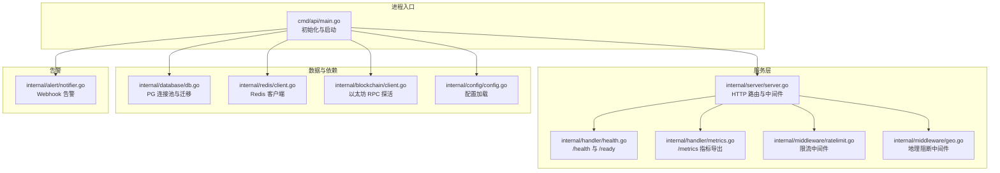
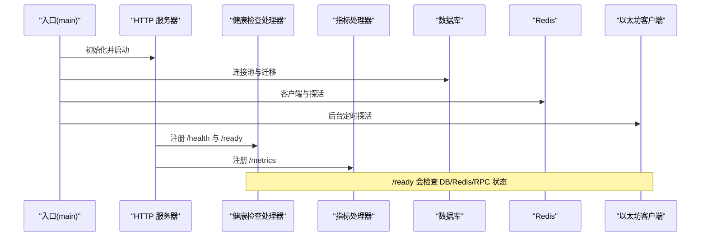
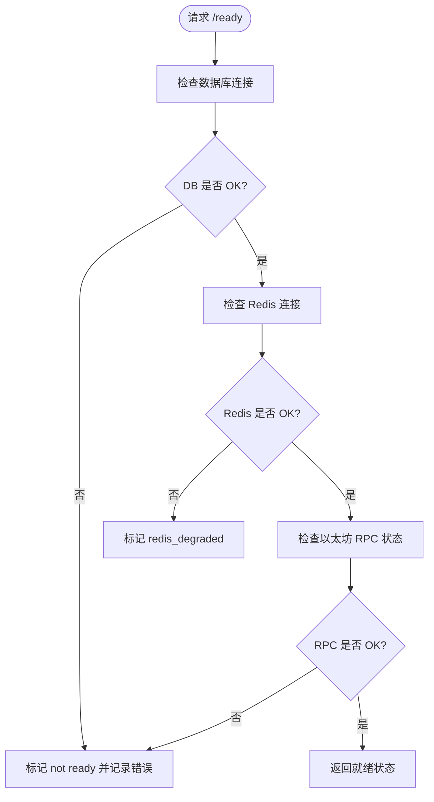
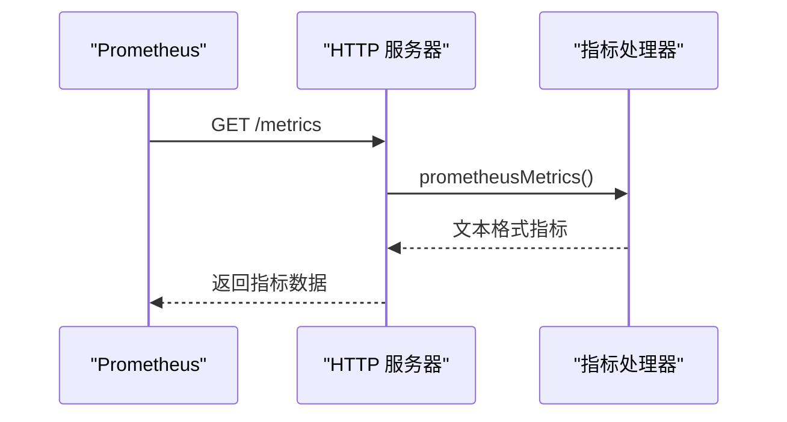
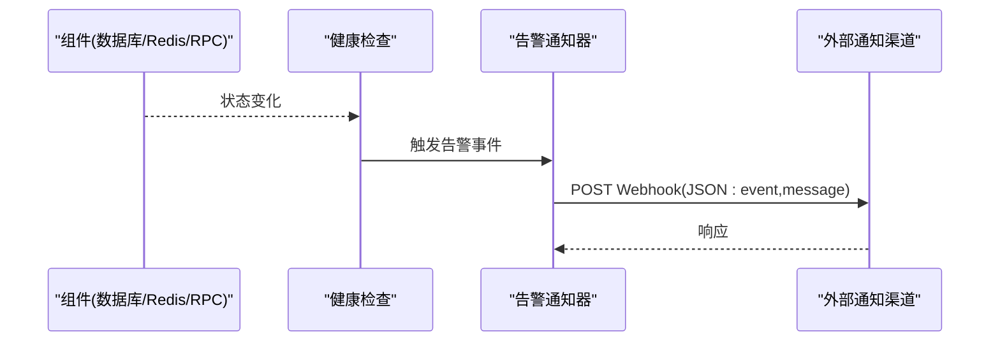
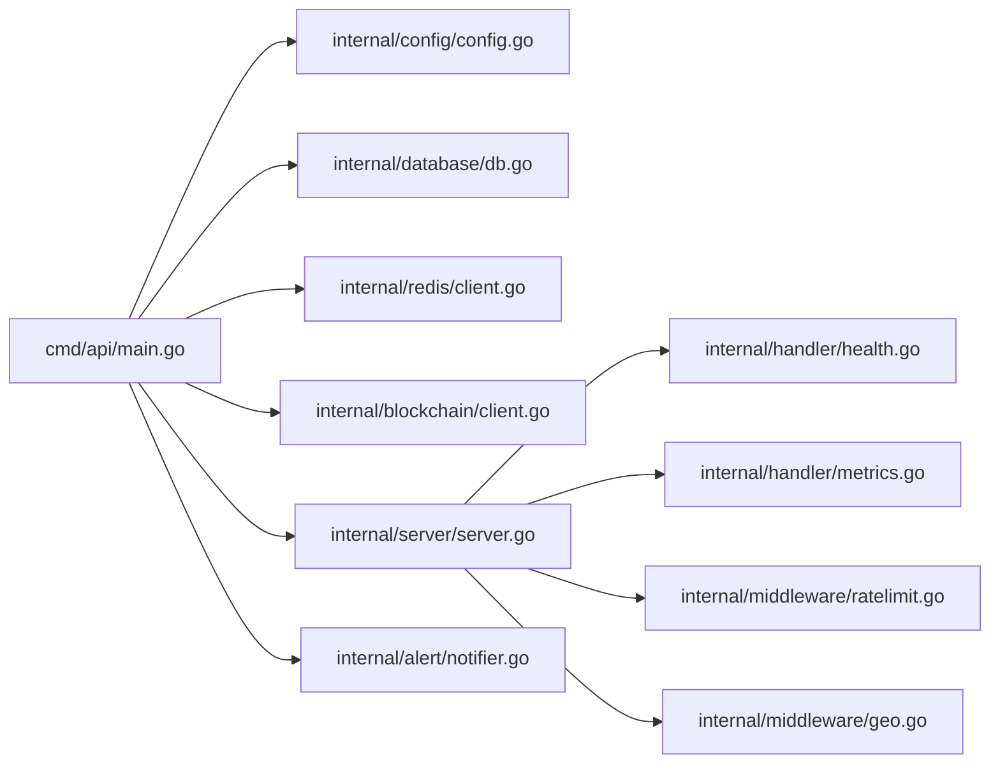

# 监控与告警

<cite>
**本文引用的文件**
- [cmd/api/main.go](file://cmd/api/main.go)
- [internal/server/server.go](file://internal/server/server.go)
- [internal/handler/health.go](file://internal/handler/health.go)
- [internal/handler/metrics.go](file://internal/handler/metrics.go)
- [internal/alert/notifier.go](file://internal/alert/notifier.go)
- [internal/config/config.go](file://internal/config/config.go)
- [internal/blockchain/client.go](file://internal/blockchain/client.go)
- [internal/redis/client.go](file://internal/redis/client.go)
- [internal/database/db.go](file://internal/database/db.go)
- [internal/middleware/ratelimit.go](file://internal/middleware/ratelimit.go)
- [internal/middleware/geo.go](file://internal/middleware/geo.go)
- [internal/repository/compliance.go](file://internal/repository/compliance.go)
- [go.mod](file://go.mod)
- [go.sum](file://go.sum)
</cite>

## 目录
1. [简介](#简介)
2. [项目结构](#项目结构)
3. [核心组件](#核心组件)
4. [架构总览](#架构总览)
5. [组件详解](#组件详解)
6. [依赖关系分析](#依赖关系分析)
7. [性能考量](#性能考量)
8. [故障排查指南](#故障排查指南)
9. [结论](#结论)
10. [附录](#附录)

## 简介
本指南面向 PredictionDIDSimple 后端服务，围绕“监控与告警”目标，系统性梳理健康检查机制（服务状态、依赖检查、自愈思路）、性能指标采集与展示、告警规则与通知渠道、Prometheus 集成与 Grafana 仪表板配置建议、日志聚合与分析策略、错误追踪与异常监控，以及最佳实践与性能调优建议。文档严格基于仓库现有实现进行分析与扩展建议。

## 项目结构
后端采用多模块分层设计：入口程序负责初始化配置、数据库迁移、连接 Redis 与区块链客户端，并启动 HTTP 服务器；服务器层注册路由与中间件；处理器层提供业务接口与健康/指标端点；告警模块通过 Webhook 发送通知；配置模块集中管理环境变量；中间件层提供限流与地理阻断；数据库与 Redis 客户端封装了连接与探活逻辑。

图表来源
- [cmd/api/main.go](file://cmd/api/main.go#L24-L117)
- [internal/server/server.go](file://internal/server/server.go#L35-L84)
- [internal/handler/health.go](file://internal/handler/health.go#L11-L67)
- [internal/handler/metrics.go](file://internal/handler/metrics.go#L8-L29)
- [internal/middleware/ratelimit.go](file://internal/middleware/ratelimit.go#L36-L54)
- [internal/middleware/geo.go](file://internal/middleware/geo.go#L10-L30)
- [internal/database/db.go](file://internal/database/db.go#L14-L26)
- [internal/redis/client.go](file://internal/redis/client.go#L10-L22)
- [internal/blockchain/client.go](file://internal/blockchain/client.go#L12-L78)
- [internal/config/config.go](file://internal/config/config.go#L45-L96)
- [internal/alert/notifier.go](file://internal/alert/notifier.go#L16-L35)

章节来源
- [cmd/api/main.go](file://cmd/api/main.go#L24-L117)
- [internal/server/server.go](file://internal/server/server.go#L35-L84)

## 核心组件
- 健康检查组件：提供 /health 与 /ready 两个端点，分别用于快速健康与就绪检查，/ready 对数据库、Redis、区块链 RPC 进行联动校验。
- 指标导出组件：提供 /metrics，导出 Oracle 任务按状态的计数指标，便于 Prometheus 抓取。
- 告警组件：通过 Webhook 将事件与消息发送到外部平台，支持可选的告警 URL。
- 配置组件：集中读取环境变量，包括数据库、Redis、以太坊 RPC、索引器与 Oracle 参数、告警 Webhook 等。
- 中间件：限流中间件对非健康端点进行速率限制；地理阻断中间件根据国家码拦截访问并记录日志。
- 数据与依赖：数据库连接池与迁移；Redis 客户端与探活；区块链客户端后台定时探活并维护链 ID。

章节来源
- [internal/handler/health.go](file://internal/handler/health.go#L11-L67)
- [internal/handler/metrics.go](file://internal/handler/metrics.go#L8-L29)
- [internal/alert/notifier.go](file://internal/alert/notifier.go#L16-L35)
- [internal/config/config.go](file://internal/config/config.go#L45-L96)
- [internal/middleware/ratelimit.go](file://internal/middleware/ratelimit.go#L36-L54)
- [internal/middleware/geo.go](file://internal/middleware/geo.go#L10-L30)
- [internal/database/db.go](file://internal/database/db.go#L14-L26)
- [internal/redis/client.go](file://internal/redis/client.go#L10-L22)
- [internal/blockchain/client.go](file://internal/blockchain/client.go#L26-L78)

## 架构总览
下图展示了从进程入口到各子系统的交互关系，以及健康检查与指标导出在整体中的位置。

图表来源
- [cmd/api/main.go](file://cmd/api/main.go#L42-L81)
- [internal/server/server.go](file://internal/server/server.go#L55-L75)
- [internal/handler/health.go](file://internal/handler/health.go#L17-L67)
- [internal/handler/metrics.go](file://internal/handler/metrics.go#L8-L29)
- [internal/database/db.go](file://internal/database/db.go#L14-L26)
- [internal/redis/client.go](file://internal/redis/client.go#L10-L22)
- [internal/blockchain/client.go](file://internal/blockchain/client.go#L26-L78)

## 组件详解

### 健康检查机制
- /health：返回服务基本健康状态，适合快速探测。
- /ready：对数据库、Redis、以太坊 RPC 进行联合检查，若任一依赖异常则返回非就绪状态，便于容器编排在依赖未就绪时避免流量进入。
- 区域性降级：当 Redis 不可用时标记为降级但不阻断整体就绪，体现渐进式降级策略。

图表来源
- [internal/handler/health.go](file://internal/handler/health.go#L28-L66)

章节来源
- [internal/handler/health.go](file://internal/handler/health.go#L17-L67)

### 性能指标采集与展示
- /metrics：导出 Oracle 任务按状态的计数指标，便于 Prometheus 抓取与告警。
- 指标类型：业务指标（Oracle 任务状态分布）。
- 展示建议：在 Grafana 中创建面板，使用折线图或堆叠柱状图展示 pending/manual/confimed/failed 的趋势。

图表来源
- [internal/server/server.go](file://internal/server/server.go#L74-L75)
- [internal/handler/metrics.go](file://internal/handler/metrics.go#L8-L29)

章节来源
- [internal/handler/metrics.go](file://internal/handler/metrics.go#L8-L29)
- [internal/server/server.go](file://internal/server/server.go#L74-L75)

### 告警系统配置
- 告警触发：当前代码通过 Webhook 发送事件与消息，可在关键路径（如数据库/Redis/RPC 失败、任务积压等）触发。
- 通知渠道：通过配置项提供 Webhook URL，实现 Slack、Teams、Webhook 等渠道对接。
- 规则建议：
  - /ready 返回非就绪时告警
  - /metrics 中 pending 或 failed 指标持续增长时告警
  - Redis 连接失败或超时次数超过阈值时告警
  - 以太坊 RPC 连续失败或链 ID 不匹配时告警

图表来源
- [internal/handler/health.go](file://internal/handler/health.go#L35-L66)
- [internal/alert/notifier.go](file://internal/alert/notifier.go#L23-L35)
- [internal/config/config.go](file://internal/config/config.go#L70-L70)

章节来源
- [internal/alert/notifier.go](file://internal/alert/notifier.go#L16-L35)
- [internal/config/config.go](file://internal/config/config.go#L70-L70)

### Prometheus 集成与 Grafana 仪表板配置
- 抓取端点：/metrics
- 建议指标：
  - oracle_jobs_pending
  - oracle_jobs_manual_review
  - oracle_jobs_confirmed
  - oracle_jobs_failed
- 告警规则示例（基于指标名称）：
  - 当 oracle_jobs_pending 在 5 分钟内持续大于阈值时告警
  - 当 oracle_jobs_failed 在 1 分钟内出现峰值时告警
- Grafana 面板建议：
  - 折线图：展示 pending/manual/confirmed/failed 的时间序列
  - 单值图：展示当前 pending 数量
  - 注释：结合告警事件与日志进行注释标注

章节来源
- [internal/handler/metrics.go](file://internal/handler/metrics.go#L8-L29)

### 日志聚合与分析策略
- 结构化日志：当前代码使用标准库日志输出，建议统一为结构化 JSON（例如使用 logrus 或 zap），并在中间件中注入请求 ID。
- 日志轮转：可引入 lumberjack 实现按大小轮转与保留策略。
- 查询优化：在数据库侧为日志表建立合适索引（如时间、级别、请求 ID），并使用分区表按时间切分。
- 采集与存储：使用 Fluent Bit/Fluentd 收集日志，写入 Elasticsearch 或 Loki；Prometheus 抓取指标；Grafana 统一可视化。

章节来源
- [go.sum](file://go.sum#L251-L251)

### 错误追踪与异常监控
- 全局恢复：服务器中间件启用 Recoverer，避免 panic 导致进程退出。
- 限流与阻断：限流中间件保护后端资源；地理阻断中间件拦截受限地区访问并记录日志。
- 访问日志：服务器中间件 Logger 输出请求日志，便于审计与问题定位。
- 建议增强：在关键业务函数中增加 span/trace 上下文，结合 OpenTelemetry 进行分布式追踪。

章节来源
- [internal/server/server.go](file://internal/server/server.go#L37-L41)
- [internal/middleware/ratelimit.go](file://internal/middleware/ratelimit.go#L36-L54)
- [internal/middleware/geo.go](file://internal/middleware/geo.go#L10-L30)
- [internal/repository/compliance.go](file://internal/repository/compliance.go#L17-L28)

## 依赖关系分析
- 进程入口依赖配置、数据库、Redis、区块链客户端与服务器；服务器依赖健康检查与指标处理器；告警依赖配置中的 Webhook URL。
- 关键外部依赖：PostgreSQL 连接池、Redis 客户端、以太坊客户端、JWT 库、CORS 中间件等。

图表来源
- [cmd/api/main.go](file://cmd/api/main.go#L24-L98)
- [internal/server/server.go](file://internal/server/server.go#L35-L84)
- [internal/handler/health.go](file://internal/handler/health.go#L17-L22)
- [internal/handler/metrics.go](file://internal/handler/metrics.go#L8-L29)
- [internal/middleware/ratelimit.go](file://internal/middleware/ratelimit.go#L36-L54)
- [internal/middleware/geo.go](file://internal/middleware/geo.go#L10-L30)
- [internal/alert/notifier.go](file://internal/alert/notifier.go#L16-L21)

章节来源
- [go.mod](file://go.mod#L5-L14)

## 性能考量
- 连接池与超时：数据库连接池与探活设置合理超时，避免阻塞；Redis 探活与连接解析失败时进行降级提示。
- RPC 探活：区块链客户端后台定时探活，减少请求阶段的失败概率；链 ID 校验确保网络一致性。
- 中间件开销：限流与地理阻断在非健康端点生效，降低对健康检查与指标端点的影响。
- 指标导出：/metrics 仅做简单聚合，避免高并发下的额外压力。

章节来源
- [internal/database/db.go](file://internal/database/db.go#L22-L26)
- [internal/redis/client.go](file://internal/redis/client.go#L18-L22)
- [internal/blockchain/client.go](file://internal/blockchain/client.go#L26-L78)
- [internal/middleware/ratelimit.go](file://internal/middleware/ratelimit.go#L36-L54)
- [internal/middleware/geo.go](file://internal/middleware/geo.go#L33-L40)

## 故障排查指南
- /ready 返回非就绪
  - 检查数据库连接与迁移是否成功
  - 检查 Redis 可用性与连接参数
  - 检查以太坊 RPC 地址与链 ID 是否匹配
- /metrics 无法抓取
  - 确认 /metrics 路由已注册且无中间件拦截
  - 检查数据库连接是否正常（指标导出依赖数据库）
- 告警未到达
  - 检查配置中的 Webhook URL 是否正确
  - 查看告警发送日志与外部渠道响应
- 访问被限流或地理阻断
  - 检查限流配置与白名单路径
  - 检查地理阻断开关与国家列表

章节来源
- [internal/handler/health.go](file://internal/handler/health.go#L35-L66)
- [internal/server/server.go](file://internal/server/server.go#L74-L75)
- [internal/alert/notifier.go](file://internal/alert/notifier.go#L23-L35)
- [internal/middleware/ratelimit.go](file://internal/middleware/ratelimit.go#L36-L54)
- [internal/middleware/geo.go](file://internal/middleware/geo.go#L10-L30)

## 结论
本项目已具备基础的健康检查、指标导出与告警通知能力。建议在此基础上完善结构化日志、分布式追踪、更丰富的业务指标与告警规则，并结合 Prometheus 与 Grafana 构建完整的可观测体系，以提升稳定性与运维效率。

## 附录

### 环境变量与配置要点
- 数据库：DATABASE_URL 必填
- 缓存：REDIS_URL
- 区块链：ETH_RPC_URL、ETH_RPC_FALLBACK、CHAIN_ID
- 索引器与 Oracle：INDEXER_POLL_SECONDS、ORACLE_* 系列参数
- 安全与合规：JWT_SECRET、SIWE_*、ADMIN_API_KEY、KYC_*、COMPLIANCE_REQUIRED、GEO_BLOCK_ENABLED、BLOCKED_COUNTRIES
- 告警：ALERT_WEBHOOK_URL

章节来源
- [internal/config/config.go](file://internal/config/config.go#L45-L96)