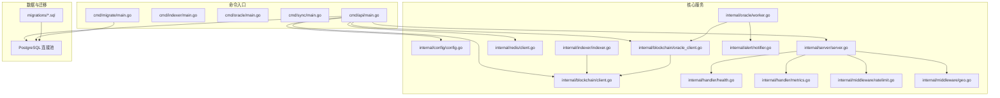
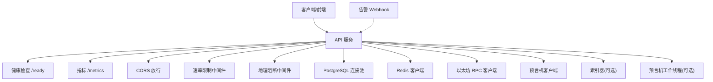
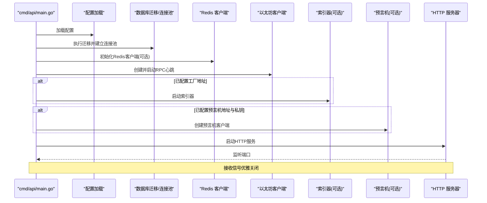
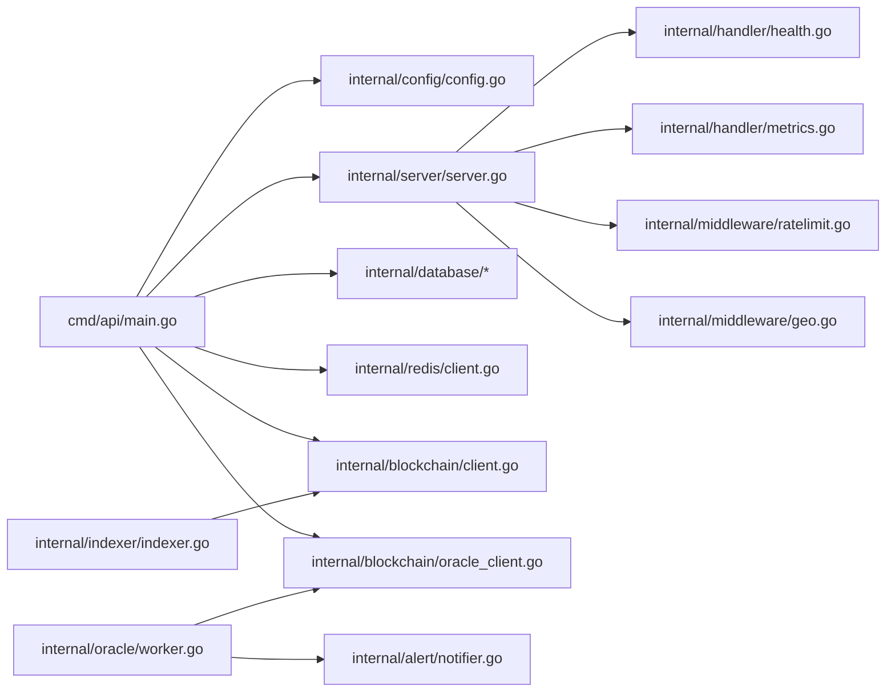

# 部署与运维

<cite>
**本文引用的文件**
- [cmd/api/main.go](file://cmd/api/main.go)
- [internal/config/config.go](file://internal/config/config.go)
- [internal/server/server.go](file://internal/server/server.go)
- [internal/redis/client.go](file://internal/redis/client.go)
- [internal/blockchain/client.go](file://internal/blockchain/client.go)
- [internal/blockchain/oracle_client.go](file://internal/blockchain/oracle_client.go)
- [internal/indexer/indexer.go](file://internal/indexer/indexer.go)
- [internal/oracle/worker.go](file://internal/oracle/worker.go)
- [internal/alert/notifier.go](file://internal/alert/notifier.go)
- [internal/handler/health.go](file://internal/handler/health.go)
- [internal/handler/metrics.go](file://internal/handler/metrics.go)
- [internal/middleware/ratelimit.go](file://internal/middleware/ratelimit.go)
- [internal/middleware/geo.go](file://internal/middleware/geo.go)
- [migrations/000001_init.up.sql](file://migrations/000001_init.up.sql)
- [go.mod](file://go.mod)
</cite>

## 目录
1. [简介](#简介)
2. [项目结构](#项目结构)
3. [核心组件](#核心组件)
4. [架构总览](#架构总览)
5. [详细组件分析](#详细组件分析)
6. [依赖关系分析](#依赖关系分析)
7. [性能考量](#性能考量)
8. [故障排除指南](#故障排除指南)
9. [结论](#结论)
10. [附录](#附录)

## 简介
本指南面向PredictionDIDSimple后端服务的部署与运维，覆盖环境配置（开发与生产）、Docker部署方案、监控与告警、故障排除、备份与恢复、性能调优、安全与密钥管理、版本升级以及扩展性与高可用建议。文档基于仓库中的实际源码进行分析，确保可操作性与准确性。

## 项目结构
后端采用多命令入口（cmd/*）组织不同子服务（API、索引器、预言机等），核心业务逻辑集中在internal目录下，数据库迁移脚本位于migrations目录。Go模块定义了外部依赖。

图表来源
- [cmd/api/main.go](file://cmd/api/main.go#L24-L117)
- [internal/server/server.go](file://internal/server/server.go#L35-L84)
- [internal/config/config.go](file://internal/config/config.go#L45-L96)
- [internal/indexer/indexer.go](file://internal/indexer/indexer.go#L35-L57)
- [internal/oracle/worker.go](file://internal/oracle/worker.go#L26-L36)
- [internal/alert/notifier.go](file://internal/alert/notifier.go#L16-L21)
- [internal/handler/health.go](file://internal/handler/health.go#L17-L22)
- [internal/handler/metrics.go](file://internal/handler/metrics.go#L8-L29)
- [internal/middleware/ratelimit.go](file://internal/middleware/ratelimit.go#L36-L55)
- [internal/middleware/geo.go](file://internal/middleware/geo.go#L10-L31)
- [migrations/000001_init.up.sql](file://migrations/000001_init.up.sql#L1-L10)

章节来源
- [cmd/api/main.go](file://cmd/api/main.go#L1-L118)
- [go.mod](file://go.mod#L1-L56)

## 核心组件
- 配置加载：集中于配置结构体与环境变量解析，支持开发/生产差异与默认值。
- HTTP服务：基于Chi路由，集成CORS、限流、地理阻断、健康检查与指标导出。
- 数据库：使用连接池，启动时执行迁移；健康检查包含数据库连通性。
- 缓存：Redis客户端初始化与健康探测，降级处理。
- 区块链：以太坊RPC客户端与预言机客户端，后台心跳检测。
- 索引器：监听工厂合约事件，扫描市场事件，写入数据库。
- 预言机：周期性扫描已完成比赛，生成或处理预言机任务，支持时间锁与确认流程。
- 告警：通过Webhook发送告警事件。
- 中间件：速率限制（按IP分钟级窗口）、地理阻断（基于请求头）。

章节来源
- [internal/config/config.go](file://internal/config/config.go#L10-L43)
- [internal/server/server.go](file://internal/server/server.go#L22-L84)
- [internal/handler/health.go](file://internal/handler/health.go#L11-L67)
- [internal/redis/client.go](file://internal/redis/client.go#L10-L22)
- [internal/indexer/indexer.go](file://internal/indexer/indexer.go#L24-L57)
- [internal/oracle/worker.go](file://internal/oracle/worker.go#L16-L36)
- [internal/alert/notifier.go](file://internal/alert/notifier.go#L11-L35)
- [internal/middleware/ratelimit.go](file://internal/middleware/ratelimit.go#L10-L55)
- [internal/middleware/geo.go](file://internal/middleware/geo.go#L10-L50)

## 架构总览
后端由API主进程统一启动，按需启用索引器与预言机工作线程。服务通过健康检查与就绪检查保障运行状态，指标接口便于Prometheus抓取。外部依赖包括PostgreSQL、Redis与以太坊节点。

图表来源
- [internal/server/server.go](file://internal/server/server.go#L35-L84)
- [internal/handler/health.go](file://internal/handler/health.go#L17-L22)
- [internal/handler/metrics.go](file://internal/handler/metrics.go#L8-L29)
- [internal/middleware/ratelimit.go](file://internal/middleware/ratelimit.go#L36-L55)
- [internal/middleware/geo.go](file://internal/middleware/geo.go#L10-L31)
- [internal/alert/notifier.go](file://internal/alert/notifier.go#L23-L35)

## 详细组件分析

### 配置与环境
- 开发环境默认值：本地Redis、本地以太坊RPC、开发JWT密钥、默认端口等。
- 生产环境要求：必须提供数据库连接串、链ID、工厂地址、预言机私钥等关键参数。
- 地理阻断与速率限制：可通过环境变量开启/关闭与调整阈值。
- 环境字段用于区分运行环境，便于日志与行为差异化。

章节来源
- [internal/config/config.go](file://internal/config/config.go#L45-L96)

### HTTP服务与中间件
- 路由与中间件顺序：请求ID、真实IP、日志、恢复、限流、地理阻断、CORS。
- 健康检查：/health返回服务基本状态；/ready检查数据库、Redis与RPC连通性。
- 指标导出：/metrics输出预言机作业状态计数，便于Prometheus采集。
- CORS：允许指定来源与凭证，适配前端开发与生产跨域需求。

章节来源
- [internal/server/server.go](file://internal/server/server.go#L35-L84)
- [internal/handler/health.go](file://internal/handler/health.go#L17-L67)
- [internal/handler/metrics.go](file://internal/handler/metrics.go#L8-L29)
- [internal/middleware/ratelimit.go](file://internal/middleware/ratelimit.go#L36-L55)
- [internal/middleware/geo.go](file://internal/middleware/geo.go#L10-L31)

### 数据库与迁移
- 启动时自动执行迁移脚本，确保表结构与元数据一致。
- 健康检查中对数据库进行Ping验证，失败时返回非就绪状态。
- 连接池由数据库层负责创建与关闭，避免资源泄漏。

章节来源
- [cmd/api/main.go](file://cmd/api/main.go#L33-L46)
- [migrations/000001_init.up.sql](file://migrations/000001_init.up.sql#L1-L10)
- [internal/handler/health.go](file://internal/handler/health.go#L35-L43)

### 缓存（Redis）
- 初始化与连接探测，失败时记录警告并进入降级模式。
- 用于会话、缓存与临时状态，提升响应速度与削峰。

章节来源
- [cmd/api/main.go](file://cmd/api/main.go#L48-L59)
- [internal/redis/client.go](file://internal/redis/client.go#L10-L22)
- [internal/handler/health.go](file://internal/handler/health.go#L45-L52)

### 区块链与预言机
- 以太坊RPC客户端：后台心跳检测，暴露链ID与连通性状态。
- 预言机客户端：支持立即解析或带时间锁的请求-确认流程，失败时告警并更新作业状态。

章节来源
- [cmd/api/main.go](file://cmd/api/main.go#L61-L89)
- [internal/blockchain/client.go](file://internal/blockchain/client.go)
- [internal/blockchain/oracle_client.go](file://internal/blockchain/oracle_client.go)
- [internal/handler/health.go](file://internal/handler/health.go#L54-L59)
- [internal/oracle/worker.go](file://internal/oracle/worker.go#L102-L164)

### 索引器
- 从工厂合约事件中发现新市场，扫描市场事件（购买、结算、认领）并入库。
- 分批扫描区块范围，避免单次查询过大导致超时。
- 记录最后区块高度，支持断点续跑。

章节来源
- [internal/indexer/indexer.go](file://internal/indexer/indexer.go#L85-L135)
- [internal/indexer/indexer.go](file://internal/indexer/indexer.go#L137-L154)
- [internal/indexer/indexer.go](file://internal/indexer/indexer.go#L212-L244)

### 告警系统
- 通过Webhook发送告警事件，包含事件类型与消息内容。
- 预言机失败与需要人工复核时触发告警。

章节来源
- [internal/alert/notifier.go](file://internal/alert/notifier.go#L16-L35)
- [internal/oracle/worker.go](file://internal/oracle/worker.go#L124-L153)

### API启动流程（序列图）

图表来源
- [cmd/api/main.go](file://cmd/api/main.go#L24-L117)

## 依赖关系分析
- 外部依赖：以太坊客户端、Chi路由、CORS、PostgreSQL驱动、Redis客户端、JWT与SIWE。
- 内部模块耦合：API主进程聚合配置、数据库、Redis、区块链与中间件；索引器与预言机作为独立协程运行；健康检查与指标导出为通用能力。

图表来源
- [go.mod](file://go.mod#L5-L14)
- [cmd/api/main.go](file://cmd/api/main.go#L15-L21)
- [internal/server/server.go](file://internal/server/server.go#L13-L19)

章节来源
- [go.mod](file://go.mod#L1-L56)

## 性能考量
- 数据库
  - 使用连接池与Ping健康检查，避免长事务与锁竞争。
  - 建议在高频查询列建立索引，结合查询计划分析热点。
- 缓存
  - Redis用于热点数据与会话存储，注意键空间淘汰策略与内存上限。
  - 对慢查询进行拆分与合并，减少跨网络往返。
- 网络与并发
  - 限流中间件按IP分钟级窗口控制QPS，保护下游。
  - CORS与中间件顺序影响延迟，建议仅在必要路径启用。
- 预言机与索引器
  - 适当增大轮询间隔与批量扫描步长，降低RPC压力。
  - 时间锁确认流程增加延迟，应结合业务SLA权衡。

[本节为通用性能建议，不直接分析具体文件]

## 故障排除指南
- 健康检查
  - /health：服务基本状态；/ready：数据库、Redis、RPC连通性与链ID。
- 常见问题
  - 数据库不可达：检查连接串与网络；查看/ready返回的错误详情。
  - Redis不可用：确认URL与网络；若不可用，服务仍可运行但部分功能降级。
  - RPC不可达：检查以太坊节点连通性与心跳状态。
  - 预言机失败：查看作业状态与错误信息，必要时人工复核。
- 日志
  - 启动阶段打印迁移结果、Redis连接状态、索引器与预言机初始化日志。
  - 告警通过Webhook输出，便于接入IM或告警平台。
- 系统恢复
  - 优雅关闭：接收信号后等待请求完成，超时强制退出。
  - 断点续跑：索引器持久化最后区块，重启后继续。

章节来源
- [internal/handler/health.go](file://internal/handler/health.go#L28-L67)
- [cmd/api/main.go](file://cmd/api/main.go#L112-L116)
- [internal/alert/notifier.go](file://internal/alert/notifier.go#L23-L35)

## 结论
本指南基于代码实现总结了PredictionDIDSimple后端的部署与运维要点。通过明确的环境配置、健康检查与告警机制、合理的性能与安全策略，可在开发与生产环境中稳定运行，并为后续扩展与高可用提供基础。

[本节为总结，不直接分析具体文件]

## 附录

### 环境配置与差异（开发 vs 生产）
- 开发环境
  - 默认端口、本地Redis与以太坊RPC、开发JWT密钥、默认速率限制。
- 生产环境
  - 必填项：DATABASE_URL、CHAIN_ID、MARKET_FACTORY_ADDRESS、ORACLE_ADAPTER_ADDRESS、ORACLE_PRIVATE_KEY等。
  - 建议：禁用开发默认密钥与本地RPC，启用地理阻断与更严格的速率限制。

章节来源
- [internal/config/config.go](file://internal/config/config.go#L45-L96)

### Docker部署方案（容器编排、服务配置与网络）
- 服务编排
  - API服务：暴露HTTP端口，挂载迁移脚本与合约ABI。
  - 数据库：使用官方PostgreSQL镜像，持久化卷。
  - 缓存：使用官方Redis镜像，持久化卷。
  - 以太坊节点：可使用公共测试网或自建节点镜像。
- 服务配置
  - 通过环境变量注入配置，避免硬编码。
  - 将密钥与证书放入只读挂载的安全位置。
- 网络
  - API与数据库、Redis在同一网络；对外仅开放HTTP端口。
  - 前端通过反向代理访问API，启用CORS与安全头。

[本节为概念性方案，未直接映射到具体源码文件]

### 监控与告警
- 健康检查：/health与/ready。
- 指标：/metrics导出预言机作业状态计数。
- 告警：Webhook推送，结合IM或告警平台实现通知。

章节来源
- [internal/handler/health.go](file://internal/handler/health.go#L17-L22)
- [internal/handler/metrics.go](file://internal/handler/metrics.go#L8-L29)
- [internal/alert/notifier.go](file://internal/alert/notifier.go#L23-L35)

### 备份与恢复策略
- 数据库备份
  - 使用数据库厂商提供的备份工具定期导出快照。
  - 验证恢复流程，确保可回滚到最近可用版本。
- 配置管理
  - 将敏感配置纳入密钥管理服务，变更走审批流程。
- 灾难恢复
  - 制定RTO/RPO目标，演练跨区容灾切换。

[本节为通用运维实践，不直接分析具体文件]

### 性能调优建议
- 数据库
  - 分析慢查询，优化索引与查询计划。
  - 控制连接池大小与超时，避免峰值拥塞。
- 缓存
  - 合理设置TTL与淘汰策略，避免雪崩。
- 负载均衡
  - 多实例部署，结合健康检查与会话粘性策略。

[本节为通用建议，不直接分析具体文件]

### 运维最佳实践
- 安全配置
  - 强密码与短有效期令牌；启用HTTPS与安全响应头。
- 密钥管理
  - 使用专用密钥服务，最小权限原则。
- 版本升级
  - 先迁移数据库，再滚动升级服务，保留回滚分支。

[本节为通用实践，不直接分析具体文件]

### 扩展性与高可用
- 水平扩展：无状态API可多副本部署，共享数据库与缓存。
- 高可用：数据库主从、Redis哨兵/集群、多可用区部署与健康检查。
- 异步处理：将重任务放入队列，避免阻塞请求线程。

[本节为通用建议，不直接分析具体文件]