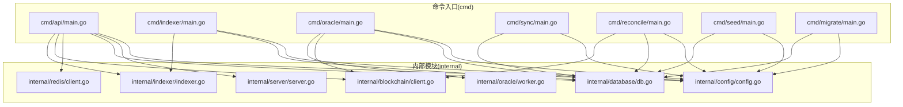
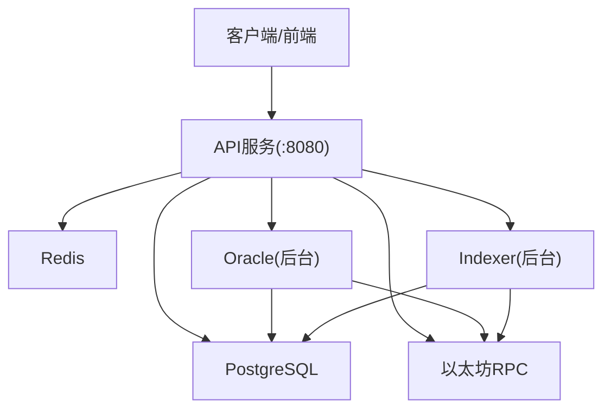
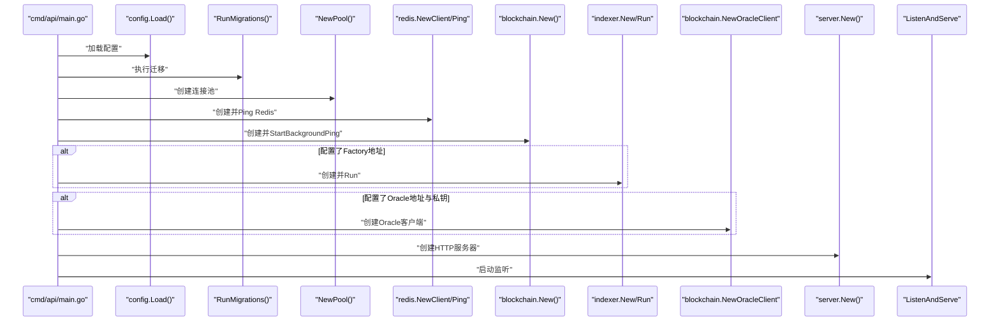
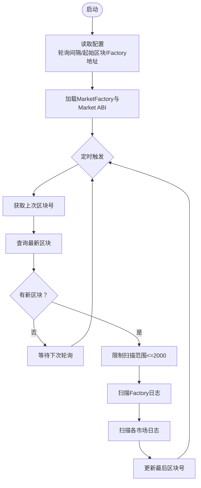
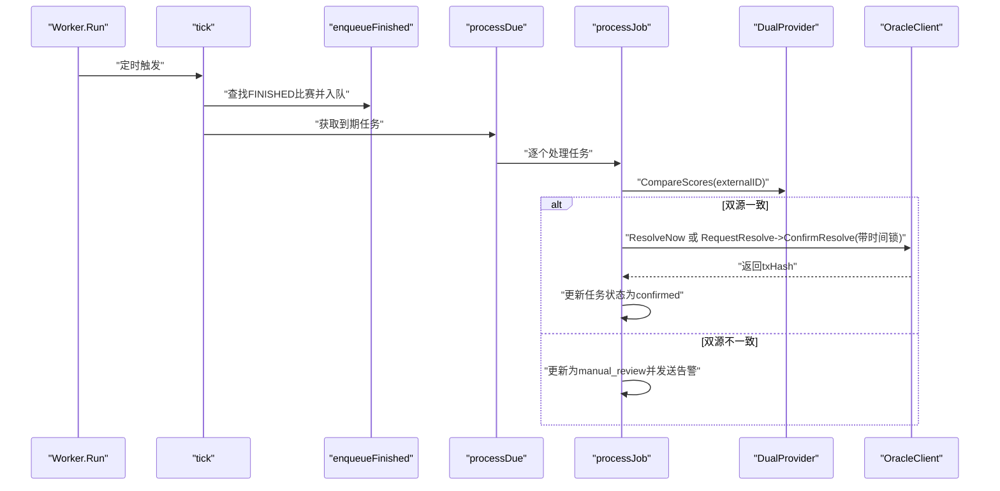
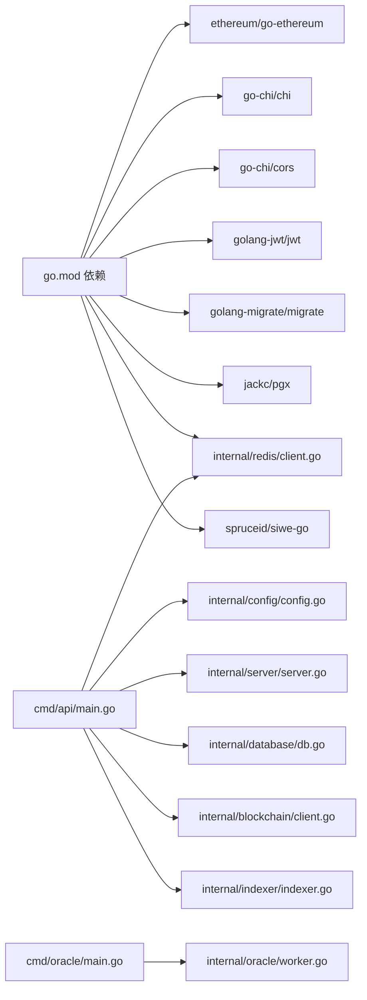

# 部署运维

<cite>
**本文档引用的文件**
- [go.mod](file://go.mod)
- [internal/config/config.go](file://internal/config/config.go)
- [cmd/api/main.go](file://cmd/api/main.go)
- [cmd/indexer/main.go](file://cmd/indexer/main.go)
- [cmd/oracle/main.go](file://cmd/oracle/main.go)
- [cmd/sync/main.go](file://cmd/sync/main.go)
- [cmd/reconcile/main.go](file://cmd/reconcile/main.go)
- [cmd/seed/main.go](file://cmd/seed/main.go)
- [cmd/migrate/main.go](file://cmd/migrate/main.go)
- [internal/server/server.go](file://internal/server/server.go)
- [internal/database/db.go](file://internal/database/db.go)
- [internal/blockchain/client.go](file://internal/blockchain/client.go)
- [internal/redis/client.go](file://internal/redis/client.go)
- [internal/oracle/worker.go](file://internal/oracle/worker.go)
- [internal/indexer/indexer.go](file://internal/indexer/indexer.go)
</cite>

## 目录
1. [简介](#简介)
2. [项目结构](#项目结构)
3. [核心组件](#核心组件)
4. [架构总览](#架构总览)
5. [详细组件分析](#详细组件分析)
6. [依赖关系分析](#依赖关系分析)
7. [性能考虑](#性能考虑)
8. [故障排除指南](#故障排除指南)
9. [结论](#结论)
10. [附录](#附录)

## 简介
本文件面向PredictionDIDSimple项目的部署与运维团队，提供从容器化到服务编排、从配置管理到监控告警的全栈指导。内容覆盖以下服务：
- API服务：对外提供REST接口，集成索引器、预言机、Redis、区块链节点等依赖
- Indexer：链上事件索引器，轮询区块日志并写入数据库
- Oracle：自动结算工作器，基于比分数据源与链上Oracle适配器进行结算
- Sync：主数据源同步工具，将比赛数据写入数据库
- Reconcile：对账工具，核对链上余额与数据库累计
- Seed：种子数据加载工具，用于本地测试
- Migrate：数据库迁移工具

同时给出环境配置最佳实践、监控与日志、性能优化、故障排除、备份与灾备、安全加固等运维要点。

## 项目结构
项目采用多模块命令入口组织，核心业务位于internal目录，各服务通过独立的cmd/*入口启动。Go模块定义了主要依赖，数据库迁移脚本位于migrations目录，合约ABI位于pkg/contracts目录，测试数据位于data目录。

图表来源
- [cmd/api/main.go:1-161](file://cmd/api/main.go#L1-L161)
- [cmd/indexer/main.go:1-52](file://cmd/indexer/main.go#L1-L52)
- [cmd/oracle/main.go:1-67](file://cmd/oracle/main.go#L1-L67)
- [cmd/sync/main.go:1-52](file://cmd/sync/main.go#L1-L52)
- [cmd/reconcile/main.go:1-97](file://cmd/reconcile/main.go#L1-L97)
- [cmd/seed/main.go:1-55](file://cmd/seed/main.go#L1-L55)
- [cmd/migrate/main.go:1-37](file://cmd/migrate/main.go#L1-L37)
- [internal/config/config.go:1-139](file://internal/config/config.go#L1-L139)
- [internal/server/server.go:1-129](file://internal/server/server.go#L1-L129)
- [internal/database/db.go:1-51](file://internal/database/db.go#L1-L51)
- [internal/blockchain/client.go:1-94](file://internal/blockchain/client.go#L1-L94)
- [internal/redis/client.go:1-29](file://internal/redis/client.go#L1-L29)
- [internal/oracle/worker.go:1-214](file://internal/oracle/worker.go#L1-L214)
- [internal/indexer/indexer.go:1-329](file://internal/indexer/indexer.go#L1-L329)

章节来源
- [go.mod:1-56](file://go.mod#L1-L56)

## 核心组件
- 配置管理：集中于Config结构体，支持环境变量与默认值，涵盖数据库、Redis、以太坊RPC、合约地址、JWT、SIWE、速率限制、合规与地理封锁、Oracle轮询与冷却、管理员密钥、VC颁发密钥、告警Webhook等。
- HTTP服务器：基于Chi路由，内置CORS、速率限制、地理封锁、健康检查、API路由注册。
- 数据库：PostgreSQL连接池与迁移执行，支持自动迁移。
- 区块链：通用客户端与Oracle客户端，支持后台ping检测、链ID校验、链上余额查询、结算交易发起。
- Redis：客户端封装与Ping探活，支持降级运行。
- Indexer：按轮询间隔扫描Factory与各市场事件，写入数据库。
- Oracle Worker：按配置轮询到期任务，比对双数据源比分，发起链上结算，支持时间锁与人工复核。
- 工具类：Migrate、Seed、Sync、Reconcile分别负责迁移、种子数据、主源同步、链上对账。

章节来源
- [internal/config/config.go:12-104](file://internal/config/config.go#L12-L104)
- [internal/server/server.go:24-102](file://internal/server/server.go#L24-L102)
- [internal/database/db.go:16-50](file://internal/database/db.go#L16-L50)
- [internal/blockchain/client.go:14-94](file://internal/blockchain/client.go#L14-L94)
- [internal/redis/client.go:12-29](file://internal/redis/client.go#L12-L29)
- [internal/indexer/indexer.go:26-120](file://internal/indexer/indexer.go#L26-L120)
- [internal/oracle/worker.go:18-121](file://internal/oracle/worker.go#L18-L121)

## 架构总览
下图展示生产环境典型拓扑：API服务作为统一入口，Indexer与Oracle在后台运行；数据库与Redis作为共享存储；以太坊节点提供链上数据；合约ABI与迁移脚本随应用分发。

图表来源
- [cmd/api/main.go:84-131](file://cmd/api/main.go#L84-L131)
- [internal/server/server.go:44-102](file://internal/server/server.go#L44-L102)
- [internal/indexer/indexer.go:38-65](file://internal/indexer/indexer.go#L38-L65)
- [internal/oracle/worker.go:29-40](file://internal/oracle/worker.go#L29-L40)

## 详细组件分析

### API服务
- 启动流程：加载配置、执行迁移、建立数据库连接池、可选Redis连接、创建区块链客户端并后台ping、条件性启动Indexer、可选Oracle客户端、创建HTTP服务器、优雅关闭。
- 依赖注入：端口、配置、数据库、Redis、只读链客户端、可写的Oracle链客户端。
- 中间件：请求ID、真实IP、日志、恢复、速率限制、地理封锁（异步记录合规日志）、CORS。
- 路由：健康检查、API路由注册。

图表来源
- [cmd/api/main.go:27-161](file://cmd/api/main.go#L27-L161)
- [internal/server/server.go:44-102](file://internal/server/server.go#L44-L102)
- [internal/database/db.go:16-24](file://internal/database/db.go#L16-L24)
- [internal/redis/client.go:12-29](file://internal/redis/client.go#L12-L29)
- [internal/blockchain/client.go:30-46](file://internal/blockchain/client.go#L30-L46)
- [internal/indexer/indexer.go:38-65](file://internal/indexer/indexer.go#L38-L65)

章节来源
- [cmd/api/main.go:27-161](file://cmd/api/main.go#L27-L161)
- [internal/server/server.go:44-102](file://internal/server/server.go#L44-L102)

### Indexer服务
- 功能：轮询区块范围，扫描Factory的MarketCreated事件与各市场的Bought/Resolved/Claimed事件，写入数据库。
- 配置：轮询间隔、起始区块、Factory地址、ABI加载。
- 流程：获取上次区块号，限制单次扫描范围，扫描Factory与各市场，更新最后区块号。

图表来源
- [internal/indexer/indexer.go:97-160](file://internal/indexer/indexer.go#L97-L160)
- [internal/indexer/indexer.go:162-228](file://internal/indexer/indexer.go#L162-L228)
- [internal/indexer/indexer.go:251-289](file://internal/indexer/indexer.go#L251-L289)

章节来源
- [cmd/indexer/main.go:17-52](file://cmd/indexer/main.go#L17-L52)
- [internal/indexer/indexer.go:26-120](file://internal/indexer/indexer.go#L26-L120)

### Oracle服务
- 功能：按轮询间隔处理到期结算任务，比对双数据源比分，发起链上结算（支持时间锁），失败与人工复核通知。
- 配置：轮询间隔、冷却时间、时间锁秒数、Oracle地址与私钥。
- 流程：enqueueFinished将FINISHED比赛入队，processDue处理到期任务，根据规则计算结果并调用链上Oracle适配器。

图表来源
- [internal/oracle/worker.go:42-121](file://internal/oracle/worker.go#L42-L121)
- [internal/oracle/worker.go:123-205](file://internal/oracle/worker.go#L123-L205)

章节来源
- [cmd/oracle/main.go:20-67](file://cmd/oracle/main.go#L20-L67)
- [internal/oracle/worker.go:18-40](file://internal/oracle/worker.go#L18-L40)

### Sync服务
- 功能：从主数据源同步比赛数据到数据库，兼容不同运行目录。
- 配置：主/备mock文件路径。
- 流程：解析路径，创建双源provider，同步主源。

章节来源
- [cmd/sync/main.go:17-52](file://cmd/sync/main.go#L17-L52)

### Reconcile服务
- 功能：对账工具，读取OPEN/RESOLVED市场数据库累计，对比链上ERC20余额，写入对账记录。
- 配置：抵押代币地址、主/备RPC。
- 流程：执行迁移->创建连接池->遍历市场->查询链上余额->写入对账记录。

章节来源
- [cmd/reconcile/main.go:18-97](file://cmd/reconcile/main.go#L18-L97)

### Seed服务
- 功能：加载种子数据（mock_matches.json）到数据库。
- 配置：mock文件路径。
- 流程：执行迁移->创建连接池->解析路径->同步数据。

章节来源
- [cmd/seed/main.go:17-55](file://cmd/seed/main.go#L17-L55)

### Migrate服务
- 功能：执行数据库迁移。
- 流程：加载配置->计算迁移目录->执行Up。

章节来源
- [cmd/migrate/main.go:14-37](file://cmd/migrate/main.go#L14-L37)

## 依赖关系分析
- 外部依赖：以太坊、Chi路由、CORS、JWT、migrate、pgx、Redis、SIWE等。
- 内部耦合：各服务均依赖config与database；API服务还依赖server、blockchain、redis、indexer；Oracle依赖blockchain与alert；Indexer依赖models与repository。

图表来源
- [go.mod:5-14](file://go.mod#L5-L14)
- [cmd/api/main.go:17-24](file://cmd/api/main.go#L17-L24)
- [internal/server/server.go:11-22](file://internal/server/server.go#L11-L22)
- [internal/database/db.go:10-14](file://internal/database/db.go#L10-L14)
- [internal/blockchain/client.go:11](file://internal/blockchain/client.go#L11)
- [internal/redis/client.go:9](file://internal/redis/client.go#L9)
- [internal/indexer/indexer.go:21](file://internal/indexer/indexer.go#L21)
- [internal/oracle/worker.go:11-16](file://internal/oracle/worker.go#L11-L16)

章节来源
- [go.mod:1-56](file://go.mod#L1-L56)

## 性能考虑
- 数据库连接池：使用pgxpool，合理设置连接数与超时；在高并发场景下评估最大连接数与查询复杂度。
- 索引器轮询：限制单次扫描区块范围（≤2000），避免RPC超时；根据链上TPS与延迟调整轮询间隔。
- Oracle轮询：根据业务需求设置轮询间隔与冷却时间，避免频繁链上交互。
- Redis降级：Redis不可用时API服务可继续运行，但需关注缓存命中率与热点数据一致性。
- 健康检查：后台RPC ping每30秒一次，结合告警快速发现节点异常。
- CORS与中间件：日志与恢复器会带来一定开销，生产环境建议按需启用。

[本节为通用性能建议，无需具体文件引用]

## 故障排除指南
- 配置缺失
  - DATABASE_URL为空会导致启动失败；请检查环境变量与配置文件。
  - 缺少必要的合约地址或私钥会影响Indexer或Oracle功能。
- 数据库
  - 迁移失败：检查migrations目录与数据库URL；确保权限正确。
  - 连接池异常：查看连接池创建与Ping结果。
- Redis
  - 解析或Ping失败：检查RedisURL格式；若不可用，服务将以降级模式运行。
- 区块链
  - RPC拨号失败或链ID不匹配：检查ETH_RPC_URL与CHAIN_ID；确认节点可达且版本兼容。
  - 结算失败：查看链上交易哈希与错误信息，必要时重试或人工复核。
- 索引器
  - 未配置Factory地址：索引器将跳过运行；请设置MARKET_FACTORY_ADDRESS。
  - ABI加载失败：确认pkg/contracts目录与JSON文件存在。
- Oracle
  - 双源比分不一致：任务进入人工复核；检查数据源与规则映射。
  - 时间锁：确认时间锁配置与链上确认流程。
- Sync/Seed/Reconcile
  - 文件路径：兼容backend/data与data两种路径；若文件不存在，请修正路径或放置文件。

章节来源
- [internal/config/config.go:84-104](file://internal/config/config.go#L84-L104)
- [internal/database/db.go:33-50](file://internal/database/db.go#L33-L50)
- [internal/redis/client.go:12-29](file://internal/redis/client.go#L12-L29)
- [internal/blockchain/client.go:30-83](file://internal/blockchain/client.go#L30-L83)
- [internal/indexer/indexer.go:97-120](file://internal/indexer/indexer.go#L97-L120)
- [internal/oracle/worker.go:147-153](file://internal/oracle/worker.go#L147-L153)

## 结论
本项目通过清晰的命令入口与内部模块划分，实现了API、索引器、预言机、工具类服务的解耦与独立部署。生产环境中应重点关注配置管理、数据库与Redis可用性、以太坊节点健康、以及对账与告警机制。通过合理的轮询间隔、连接池与中间件策略，可在保证稳定性的同时提升吞吐能力。

[本节为总结性内容，无需具体文件引用]

## 附录

### Docker容器化与编排建议
- 镜像构建
  - 基础镜像：使用官方golang镜像构建二进制，再复制至精简运行时镜像（如distroless或alpine）。
  - 多阶段构建：分离build与runtime阶段，减小镜像体积。
  - 产物：将各cmd/*编译为独立二进制，或打包为单一镜像内多入口。
- 容器编排
  - API服务：暴露HTTP端口，挂载配置文件或通过环境变量注入；依赖数据库与Redis服务。
  - Indexer/Oracle：作为独立容器或Sidecar运行，按需启停。
  - 数据卷：持久化migrations与合约ABI目录；种子数据与mock文件可挂载。
- 服务配置
  - 环境变量：DATABASE_URL、REDIS_URL、ETH_RPC_URL、CHAIN_ID、各合约地址与密钥等。
  - 健康检查：HTTP健康端点、数据库Ping、Redis Ping、RPC链ID校验。
  - 资源限制：CPU/内存配额与HPA策略，结合指标监控动态扩缩容。

[本节为概念性编排建议，无需具体文件引用]

### 环境配置管理最佳实践
- 配置文件管理
  - 使用环境变量优先，配合.env文件在开发环境；生产环境通过密钥管理服务注入。
  - 对于多环境（dev/staging/prod），采用命名空间或标签区分。
- 环境变量清单
  - 必填项：DATABASE_URL、CHAIN_ID、MARKET_FACTORY_ADDRESS等。
  - 可选项：ETH_RPC_FALLBACK_URL、ORACLE_ADAPTER_ADDRESS、ORACLE_PRIVATE_KEY、ORACLE_*、ALERT_WEBHOOK_URL等。
- 敏感信息保护
  - 私钥与密钥通过密钥管理服务（如Vault/KMS）注入；禁止提交到版本库。
  - 使用只读权限的数据库账号；最小权限原则。
- 配置热更新
  - 对于非敏感配置（如轮询间隔、速率限制），可通过配置中心动态下发并重启生效。

[本节为通用配置实践，无需具体文件引用]

### 监控与日志
- 指标收集
  - HTTP请求：QPS、响应时间、状态码分布、错误率。
  - 数据库：连接池使用率、慢查询、迁移耗时。
  - 区块链：RPC可用性、链ID一致性、结算交易确认时间。
  - Redis：连接数、命中率、延迟。
- 日志聚合
  - 标准输出采集，统一打标（服务名、实例ID、环境）。
  - 结构化日志，包含请求ID、时间戳、级别、模块、消息与上下文。
- 告警设置
  - 健康检查失败、数据库/Redis不可达、RPC异常、结算失败、对账不一致等阈值告警。
  - 与IM/邮件/Webhook集成，分级处理。

[本节为通用监控建议，无需具体文件引用]

### 生产环境性能优化
- 索引器
  - 根据链上活动度调整轮询间隔；批量写入数据库减少往返。
- Oracle
  - 合理设置冷却时间与时间锁，避免链上拥堵；双源数据源就近部署。
- API
  - 启用连接复用与压缩；合理设置读写超时；缓存热点数据。
- 数据库
  - 索引优化、查询计划分析、连接池参数调优；读写分离与只读副本。

[本节为通用优化建议，无需具体文件引用]

### 备份策略与灾难恢复
- 数据备份
  - 数据库：定期逻辑备份与增量备份；验证恢复流程。
  - 配置与合约：版本化管理，记录变更历史。
- 灾难恢复
  - 多区域部署与故障转移；RTO/RPO目标明确。
  - 服务降级策略：Redis不可用时的限流与降级；RPC异常时的熔断与重试。
- 安全加固
  - 最小权限与网络隔离；TLS传输加密；WAF与DDoS防护；定期漏洞扫描与补丁管理。

[本节为通用安全部署建议，无需具体文件引用]