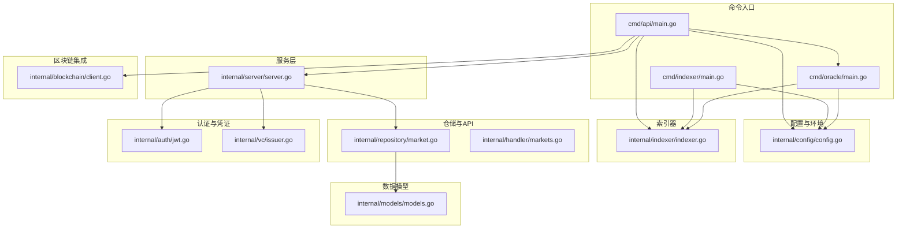
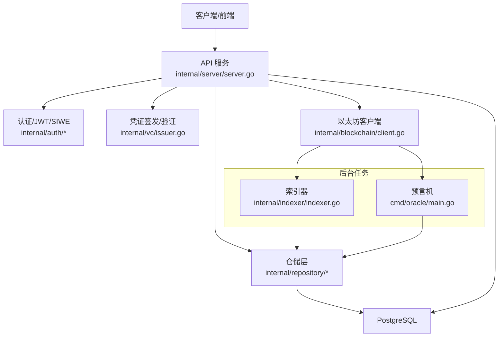
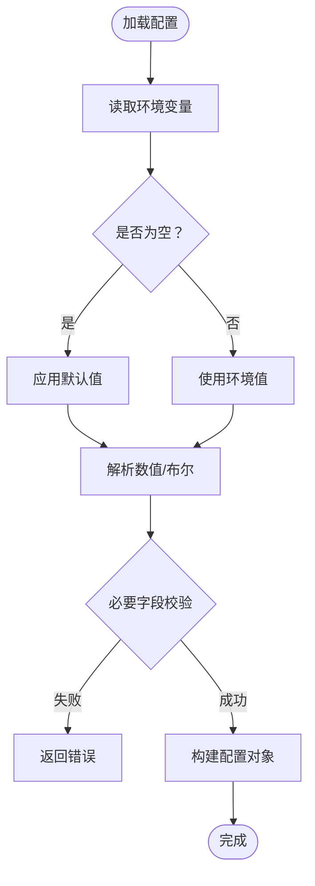
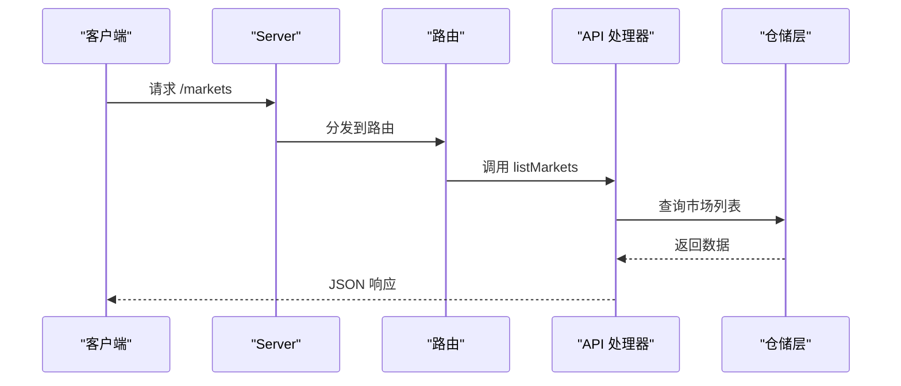
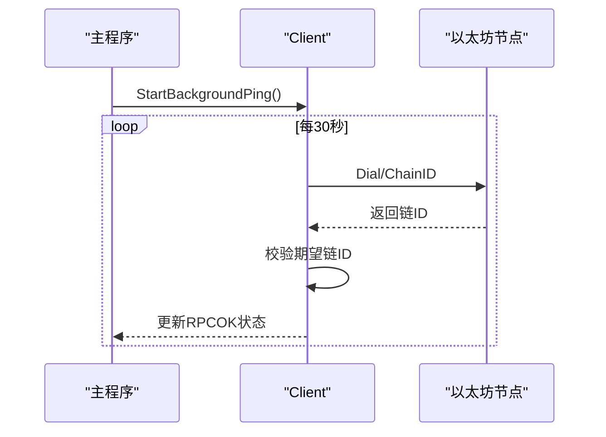
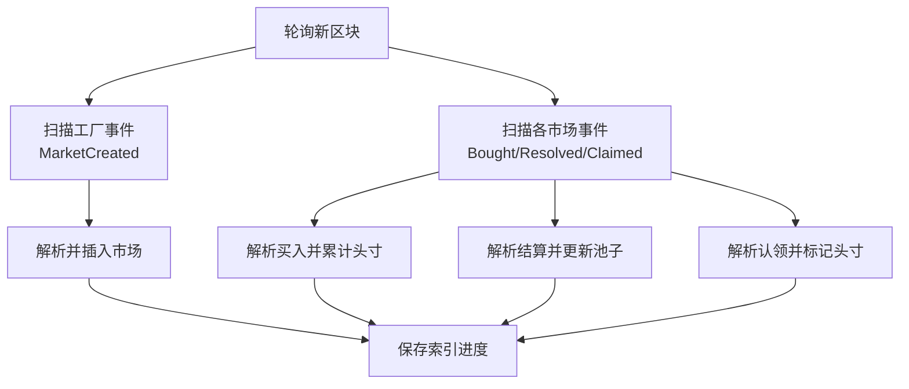
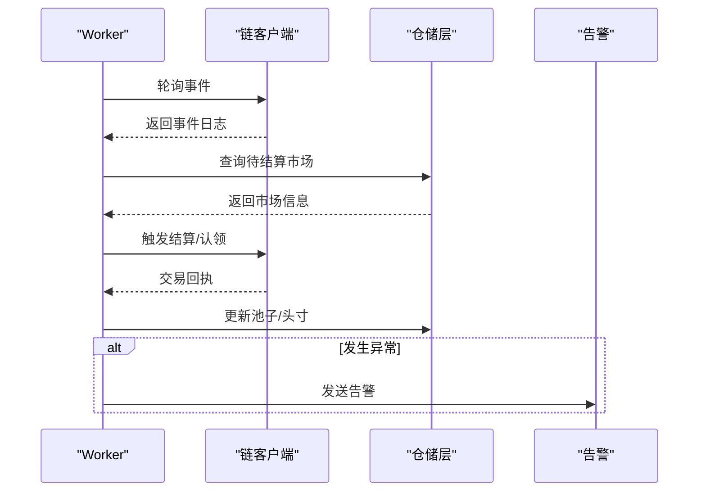
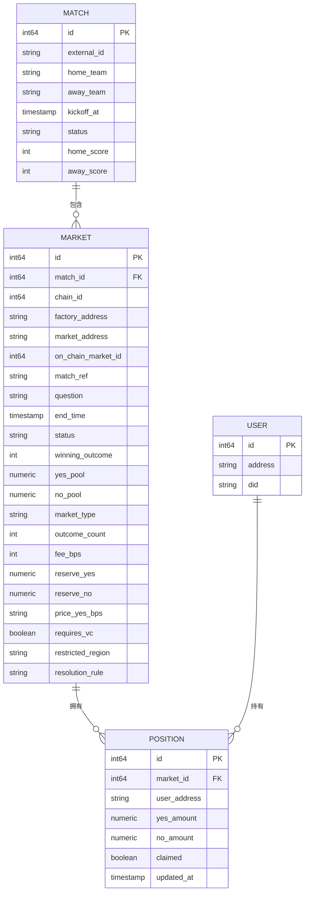
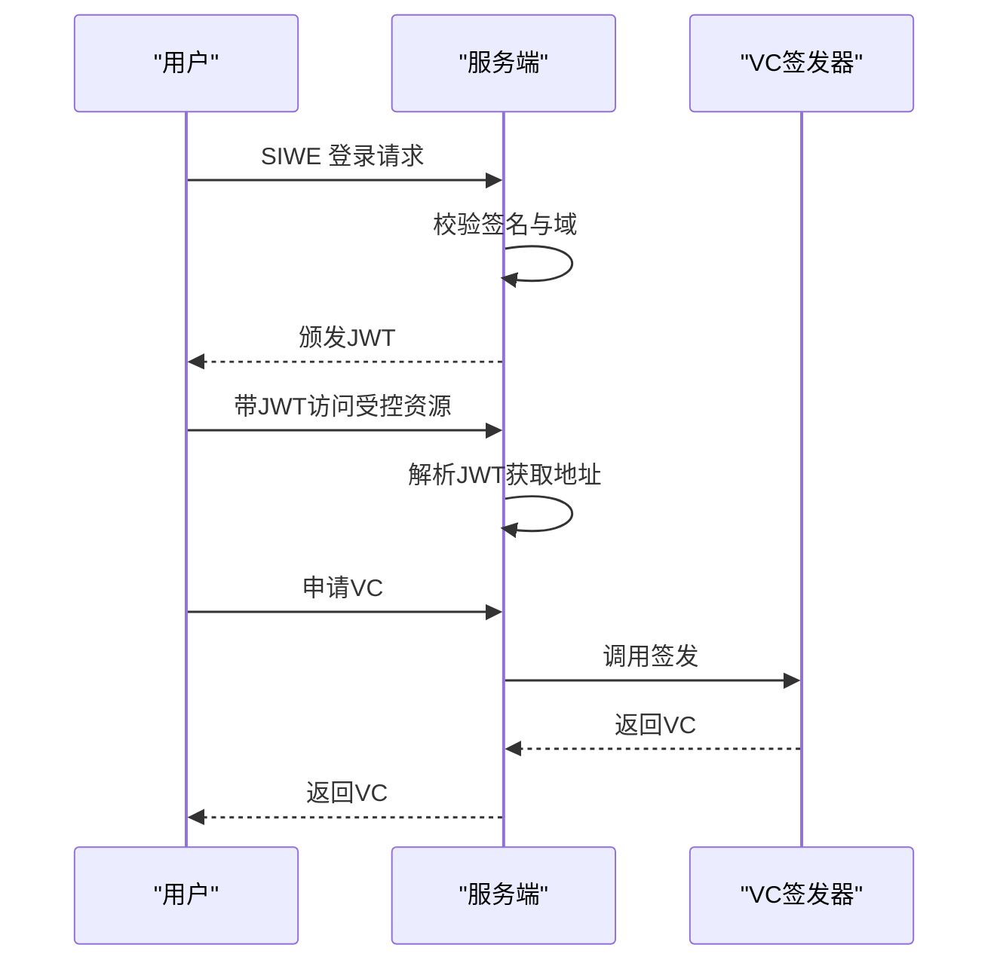
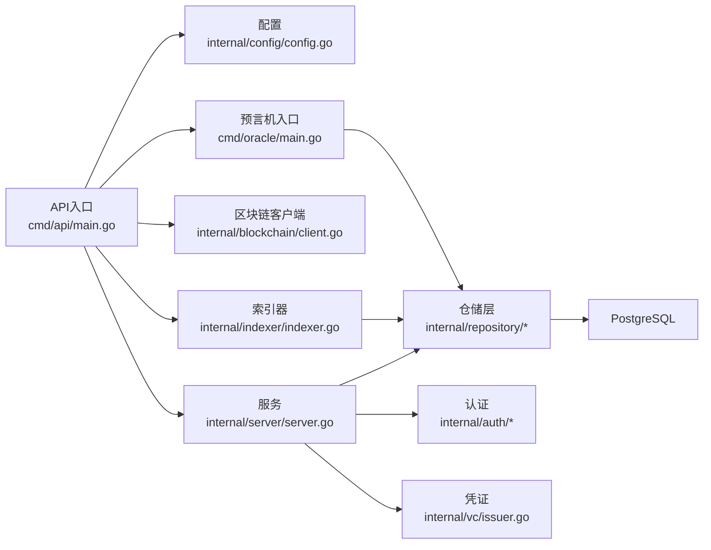

# 项目概述

<cite>
**本文引用的文件**
- [cmd/api/main.go](file://cmd/api/main.go)
- [cmd/indexer/main.go](file://cmd/indexer/main.go)
- [cmd/oracle/main.go](file://cmd/oracle/main.go)
- [internal/config/config.go](file://internal/config/config.go)
- [internal/server/server.go](file://internal/server/server.go)
- [internal/blockchain/client.go](file://internal/blockchain/client.go)
- [internal/indexer/indexer.go](file://internal/indexer/indexer.go)
- [internal/models/models.go](file://internal/models/models.go)
- [internal/handler/markets.go](file://internal/handler/markets.go)
- [internal/repository/market.go](file://internal/repository/market.go)
- [internal/auth/jwt.go](file://internal/auth/jwt.go)
- [internal/vc/issuer.go](file://internal/vc/issuer.go)
- [migrations/000001_init.up.sql](file://migrations/000001_init.up.sql)
- [go.mod](file://go.mod)
</cite>

## 目录
1. [简介](#简介)
2. [项目结构](#项目结构)
3. [核心组件](#核心组件)
4. [架构总览](#架构总览)
5. [详细组件分析](#详细组件分析)
6. [依赖分析](#依赖分析)
7. [性能考虑](#性能考虑)
8. [故障排查指南](#故障排查指南)
9. [结论](#结论)
10. [附录](#附录)

## 简介
PredictionDIDSimple 是一个基于以太坊的去中心化预测市场平台，旨在通过智能合约、DID 身份与自动化预言机实现透明、可信、可审计的预测交易。平台支持多结局市场、实时事件索引、合规门禁（如 VC 身份与地理限制）、以及链上/链下数据协同，为体育赛事、金融事件等提供去中心化的价格发现与风险管理工具。

- 价值主张
  - 无需中介的信任机制：所有交易与结算由智能合约执行，降低信任成本与操作风险。
  - 可验证身份与合规：结合 DID 与 VC，实现身份与准入控制，满足 KYC/AML 合规要求。
  - 自动化预言机：自动抓取链上事件并触发结算，减少人工干预与争议。
  - 开放 API 与实时数据：提供 GraphQL 风格的 REST 接口与实时流式响应，便于前端与第三方集成。

- 主要特性
  - 智能合约集成：工厂合约创建市场、市场合约记录买卖与结算。
  - DID 身份认证：SIWE 登录与 JWT 颁发，结合 VC 凭证进行访问控制。
  - 自动化预言机：监听链上事件，自动更新市场状态与池子余额。
  - 实时数据索引：扫描区块日志，增量同步市场、头寸与交易数据。
  - 数据持久化与缓存：PostgreSQL 存储结构化数据，Redis 提供缓存与会话支持。

- 技术栈选择理由
  - Go：高性能并发模型、标准库完善、生态成熟，适合构建高可用服务端。
  - 以太坊生态：使用 go-ethereum 访问节点，读写链上数据；通过 ABI 与事件解析实现与合约交互。
  - PostgreSQL：结构化数据存储、ACID 事务、SQL 查询与迁移管理。
  - Redis：键值缓存、速率限制、会话与告警推送。

- 应用场景
  - 体育赛事预测（如世界杯半决赛、决赛）。
  - 金融事件预测（如利率、政策结果）。
  - 公共事件投票与共识形成。

- 未来方向
  - 支持更多结局市场与自定义规则。
  - 引入跨链桥接与多链市场。
  - 增强合规与风控能力（如黑名单、限额、风控阈值）。
  - 扩展预言机来源（链上 + 链下）与多源聚合。

## 项目结构
后端采用命令入口分层（cmd/*）+ 内部模块（internal/*）的组织方式，清晰分离运行入口、业务逻辑、数据访问与基础设施。

图表来源
- [cmd/api/main.go](file://cmd/api/main.go#L24-L117)
- [cmd/indexer/main.go](file://cmd/indexer/main.go#L15-L43)
- [cmd/oracle/main.go](file://cmd/oracle/main.go#L18-L55)
- [internal/config/config.go](file://internal/config/config.go#L45-L96)
- [internal/server/server.go](file://internal/server/server.go#L35-L84)
- [internal/blockchain/client.go](file://internal/blockchain/client.go#L19-L78)
- [internal/indexer/indexer.go](file://internal/indexer/indexer.go#L35-L104)
- [internal/models/models.go](file://internal/models/models.go#L5-L57)
- [internal/repository/market.go](file://internal/repository/market.go#L13-L180)
- [internal/handler/markets.go](file://internal/handler/markets.go#L9-L50)
- [internal/auth/jwt.go](file://internal/auth/jwt.go#L16-L43)
- [internal/vc/issuer.go](file://internal/vc/issuer.go#L28-L100)

章节来源
- [cmd/api/main.go](file://cmd/api/main.go#L24-L117)
- [internal/config/config.go](file://internal/config/config.go#L45-L96)
- [internal/server/server.go](file://internal/server/server.go#L35-L84)

## 核心组件
- 配置加载：集中管理 HTTP 端口、数据库 URL、Redis URL、以太坊 RPC、链 ID、合约地址、轮询间隔、合规开关等。
- HTTP 服务：基于 Chi 路由，集成 CORS、限流、地理阻断与健康检查；注册市场、用户、合规、统计等 API。
- 区块链客户端：连接以太坊节点，后台心跳检测链 ID 与连通性。
- 索引器：按区块范围扫描工厂与市场合约事件，增量同步市场、头寸与交易。
- 预言机：监听链上事件，触发结算与池子更新，支持告警与错误处理。
- 数据模型：匹配、市场、头寸、用户等核心实体。
- 仓储层：封装 SQL 查询与更新，提供市场、匹配、头寸、指数等数据访问。
- 认证与凭证：JWT 颁发与校验、SIWE 登录、VC 签发与验证。

章节来源
- [internal/config/config.go](file://internal/config/config.go#L10-L43)
- [internal/server/server.go](file://internal/server/server.go#L26-L84)
- [internal/blockchain/client.go](file://internal/blockchain/client.go#L12-L78)
- [internal/indexer/indexer.go](file://internal/indexer/indexer.go#L24-L135)
- [internal/models/models.go](file://internal/models/models.go#L5-L57)
- [internal/repository/market.go](file://internal/repository/market.go#L13-L180)
- [internal/auth/jwt.go](file://internal/auth/jwt.go#L11-L43)
- [internal/vc/issuer.go](file://internal/vc/issuer.go#L13-L100)

## 架构总览
系统由“命令入口”驱动多个子系统协同工作：API 服务对外提供接口，索引器持续从链上拉取事件并落库，预言机在链上事件发生后自动结算，认证与凭证模块保障访问安全与合规。

图表来源
- [internal/server/server.go](file://internal/server/server.go#L35-L84)
- [internal/indexer/indexer.go](file://internal/indexer/indexer.go#L85-L135)
- [cmd/oracle/main.go](file://cmd/oracle/main.go#L18-L55)
- [internal/blockchain/client.go](file://internal/blockchain/client.go#L26-L78)
- [internal/repository/market.go](file://internal/repository/market.go#L103-L126)

## 详细组件分析

### 配置模块（Config）
- 职责：统一加载环境变量，构造运行所需参数，含网络、合约、合规、限流、地理封锁等。
- 关键点：链 ID 与起始区块校验、默认值回退、国家黑名单解析。

图表来源
- [internal/config/config.go](file://internal/config/config.go#L45-L96)

章节来源
- [internal/config/config.go](file://internal/config/config.go#L45-L96)

### HTTP 服务与路由（Server）
- 职责：初始化路由、中间件（CORS、限流、地理阻断、日志、恢复），注册健康检查与业务 API。
- 关键点：依赖注入（DB、Redis、Chain、OracleChain），SSE 场景下的写超时设置。

图表来源
- [internal/server/server.go](file://internal/server/server.go#L35-L84)
- [internal/handler/markets.go](file://internal/handler/markets.go#L9-L23)
- [internal/repository/market.go](file://internal/repository/market.go#L21-L64)

章节来源
- [internal/server/server.go](file://internal/server/server.go#L35-L84)
- [internal/handler/markets.go](file://internal/handler/markets.go#L9-L50)
- [internal/repository/market.go](file://internal/repository/market.go#L21-L101)

### 区块链客户端（Client）
- 职责：连接以太坊节点，后台定时心跳检测，校验链 ID 与连通性。
- 关键点：原子状态标记 RPC 连通性，失败时降级处理。

图表来源
- [internal/blockchain/client.go](file://internal/blockchain/client.go#L26-L78)

章节来源
- [internal/blockchain/client.go](file://internal/blockchain/client.go#L12-L78)

### 索引器（Indexer）
- 职责：按轮询周期扫描区块，解析工厂与市场事件，增量入库。
- 关键点：事件过滤（MarketCreated/Bought/Resolved/Claimed），外部比赛标识映射，批量区块跨度限制。

图表来源
- [internal/indexer/indexer.go](file://internal/indexer/indexer.go#L85-L135)
- [internal/indexer/indexer.go](file://internal/indexer/indexer.go#L137-L154)
- [internal/indexer/indexer.go](file://internal/indexer/indexer.go#L212-L244)
- [internal/indexer/indexer.go](file://internal/indexer/indexer.go#L247-L274)

章节来源
- [internal/indexer/indexer.go](file://internal/indexer/indexer.go#L85-L135)
- [internal/indexer/indexer.go](file://internal/indexer/indexer.go#L137-L154)
- [internal/indexer/indexer.go](file://internal/indexer/indexer.go#L212-L274)

### 预言机（Oracle Worker）
- 职责：监听链上事件，根据规则结算市场，更新池子与头寸，支持告警。
- 关键点：冷却时间与时间锁配置，Mock 数据源用于测试。

图表来源
- [cmd/oracle/main.go](file://cmd/oracle/main.go#L42-L50)
- [internal/indexer/indexer.go](file://internal/indexer/indexer.go#L262-L274)

章节来源
- [cmd/oracle/main.go](file://cmd/oracle/main.go#L18-L55)
- [internal/indexer/indexer.go](file://internal/indexer/indexer.go#L262-L274)

### 数据模型与仓储
- 模型：Match、Market、Position、User，支持关联查询与序列化。
- 仓储：提供列表、详情、插入、更新、结算等方法，SQL 层面处理聚合与默认值。

图表来源
- [internal/models/models.go](file://internal/models/models.go#L5-L57)
- [internal/repository/market.go](file://internal/repository/market.go#L21-L101)

章节来源
- [internal/models/models.go](file://internal/models/models.go#L5-L57)
- [internal/repository/market.go](file://internal/repository/market.go#L103-L180)

### 认证与凭证（JWT/SIWE/VC）
- JWT：颁发与解析，携带钱包地址与过期时间。
- SIWE：签名消息验证，用于登录态绑定钱包。
- VC：签发与验证，支持凭证有效期与 HMAC 校验。

图表来源
- [internal/auth/jwt.go](file://internal/auth/jwt.go#L16-L43)
- [internal/vc/issuer.go](file://internal/vc/issuer.go#L28-L100)

章节来源
- [internal/auth/jwt.go](file://internal/auth/jwt.go#L11-L43)
- [internal/vc/issuer.go](file://internal/vc/issuer.go#L13-L100)

## 依赖分析
- 外部依赖：以太坊节点、PostgreSQL、Redis、JWT、CORS、迁移工具。
- 组件耦合：API 服务依赖仓储与认证模块；索引器与预言机依赖区块链客户端；仓储依赖数据库连接池。

图表来源
- [go.mod](file://go.mod#L5-L14)
- [cmd/api/main.go](file://cmd/api/main.go#L61-L98)
- [internal/server/server.go](file://internal/server/server.go#L35-L84)
- [internal/indexer/indexer.go](file://internal/indexer/indexer.go#L35-L57)
- [cmd/oracle/main.go](file://cmd/oracle/main.go#L42-L50)

章节来源
- [go.mod](file://go.mod#L5-L14)
- [cmd/api/main.go](file://cmd/api/main.go#L61-L98)

## 性能考虑
- 并发与异步：API 服务与索引器/预言机均采用 goroutine 与上下文取消，避免阻塞。
- 数据库：使用连接池与批量查询，索引器按区块跨度扫描，避免一次性处理过多区块。
- 缓存：Redis 用于限流、会话与热点数据缓存，减轻数据库压力。
- 网络：区块链客户端后台心跳检测，失败快速降级，保证服务稳定性。
- 建议：对高频查询建立合适索引，合理设置轮询间隔与批处理大小，启用数据库连接池复用。

## 故障排查指南
- 配置问题
  - 必填项缺失：确认 DATABASE_URL、CHAIN_ID、MARKET_FACTORY_ADDRESS 等。
  - 环境不一致：核对 CHAIN_ID 与实际网络一致，避免链 ID 不匹配。
- 网络问题
  - ETH_RPC_URL 不可达：检查节点连通性与防火墙；查看后台心跳日志。
  - 轮询异常：调整 INDEXER_POLL_SECONDS 或 ORACLE_POLL_SECONDS。
- 数据库问题
  - 迁移失败：确认 migrations 目录存在且权限正确；查看迁移日志。
  - 查询异常：检查 SQL 语句与表结构，确保索引与类型匹配。
- 缓存问题
  - Redis 不可用：确认 REDIS_URL 正确；查看 Ping 日志；必要时降级禁用。
- 安全与合规
  - JWT 校验失败：确认 JWT_SECRET 一致且未过期。
  - VC 校验失败：检查凭证签名与过期时间。

章节来源
- [internal/config/config.go](file://internal/config/config.go#L79-L96)
- [internal/blockchain/client.go](file://internal/blockchain/client.go#L42-L78)
- [cmd/api/main.go](file://cmd/api/main.go#L33-L59)
- [internal/auth/jwt.go](file://internal/auth/jwt.go#L28-L43)
- [internal/vc/issuer.go](file://internal/vc/issuer.go#L74-L100)

## 结论
PredictionDIDSimple 通过清晰的模块划分与稳健的技术选型，构建了从链上事件到链下服务的完整闭环。其以 Go 为核心、以太坊为底座、PostgreSQL 与 Redis 为支撑，配合 DID/VC 的身份与合规体系，既适合初学者理解去中心化预测市场的基本概念，也为有经验的开发者提供了可扩展、可维护的工程实践范式。

## 附录
- 初始化迁移：创建 schema_meta 表并写入初始版本，确保数据库结构一致性。
- 命令入口：API、索引器、预言机分别作为独立进程运行，便于水平扩展与运维。

章节来源
- [migrations/000001_init.up.sql](file://migrations/000001_init.up.sql#L1-L10)
- [cmd/api/main.go](file://cmd/api/main.go#L24-L117)
- [cmd/indexer/main.go](file://cmd/indexer/main.go#L15-L43)
- [cmd/oracle/main.go](file://cmd/oracle/main.go#L18-L55)