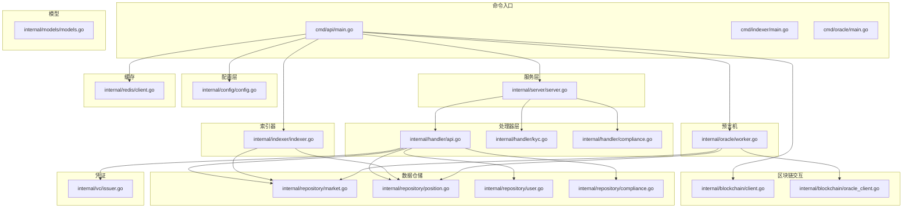
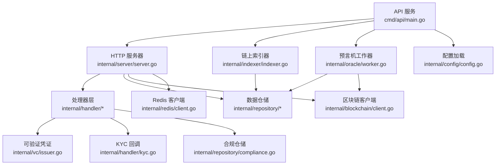
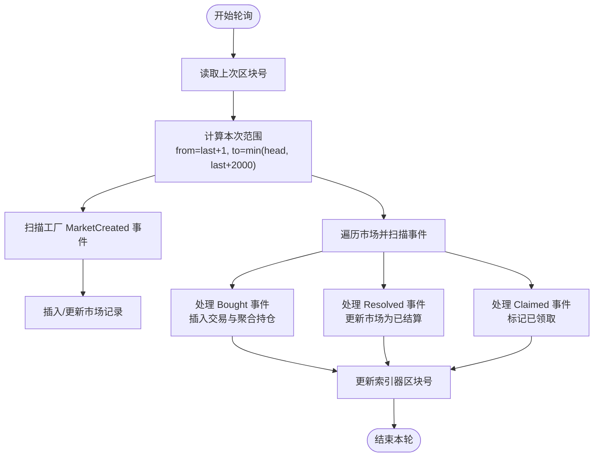
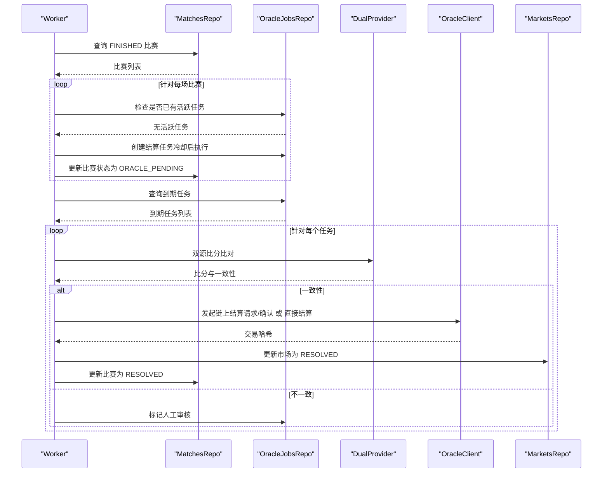
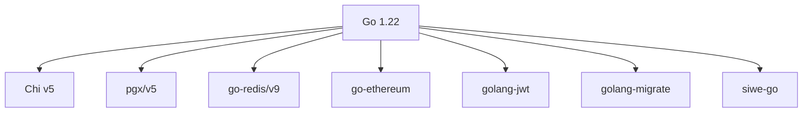

# 项目概述

<cite>
**本文档引用的文件**
- [main.go](file://cmd/api/main.go)
- [server.go](file://internal/server/server.go)
- [config.go](file://internal/config/config.go)
- [api.go](file://internal/handler/api.go)
- [client.go](file://internal/blockchain/client.go)
- [market.go](file://internal/repository/market.go)
- [models.go](file://internal/models/models.go)
- [indexer.go](file://internal/indexer/indexer.go)
- [worker.go](file://internal/oracle/worker.go)
- [issuer.go](file://internal/vc/issuer.go)
- [client.go](file://internal/redis/client.go)
- [kyc.go](file://internal/handler/kyc.go)
- [compliance.go](file://internal/repository/compliance.go)
- [siwe.go](file://internal/auth/siwe.go)
- [go.mod](file://go.mod)
- [000001_init.up.sql](file://migrations/000001_init.up.sql)
</cite>

## 目录
1. [简介](#简介)
2. [项目结构](#项目结构)
3. [核心组件](#核心组件)
4. [架构总览](#架构总览)
5. [详细组件分析](#详细组件分析)
6. [依赖分析](#依赖分析)
7. [性能考虑](#性能考虑)
8. [故障排查指南](#故障排查指南)
9. [结论](#结论)
10. [附录](#附录)

## 简介
PredictionDIDSimple 是一个基于区块链的去中心化预测市场平台，旨在为用户提供透明、可信、无需中介的预测与交易体验。平台通过智能合约承载市场规则与资金池，后端服务负责链上事件索引、合规管理、预言机结算、用户认证与凭证签发等能力，结合去中心化身份（DID）与可验证凭证（VC），实现身份绑定、权限控制与监管合规。

核心价值主张：
- 去中心化：市场创建、交易、结算完全由智能合约执行，降低信任成本
- 透明可审计：链上事件全量索引，数据持久化于数据库，支持实时查询与回溯
- 合规可控：内置地理封锁、KYC 回调、VC 颁发与校验机制，满足监管要求
- 可扩展：模块化设计，支持多合约版本、多市场类型与多数据源

## 项目结构
项目采用按职责分层的组织方式，主要分为命令入口、HTTP 服务、业务处理、数据访问与基础设施层：

- 命令入口（cmd/*）：各子服务入口，如 API 服务、索引器、预言机、迁移等
- 服务层（internal/server）：HTTP 服务器初始化、路由注册、中间件装配
- 处理器层（internal/handler）：API 路由与业务逻辑编排
- 配置层（internal/config）：统一加载与解析运行时配置
- 区块链交互（internal/blockchain）：以太坊客户端、Oracle 客户端封装
- 数据仓储（internal/repository/*）：数据库访问与领域模型映射
- 模型定义（internal/models）：核心领域模型（比赛、市场、持仓、用户）
- 索引器（internal/indexer）：链上事件轮询与入库
- 预言机（internal/oracle）：自动结算与链上提交
- 可验证凭证（internal/vc）：VC 签发与校验
- 缓存（internal/redis）：Redis 客户端封装
- 中间件（internal/middleware）：速率限制、地理封锁等
- 合约接口（pkg/contracts/*.json）：部署合约的 ABI 资源
- 数据库迁移（migrations/*）：Schema 初始化与演进

图表来源
- [main.go:27-161](file://cmd/api/main.go#L27-L161)
- [server.go:44-102](file://internal/server/server.go#L44-L102)
- [api.go:34-69](file://internal/handler/api.go#L34-L69)
- [config.go:49-104](file://internal/config/config.go#L49-L104)
- [client.go:22-94](file://internal/blockchain/client.go#L22-L94)
- [market.go:15-269](file://internal/repository/market.go#L15-L269)
- [models.go:6-63](file://internal/models/models.go#L6-L63)
- [indexer.go:26-160](file://internal/indexer/indexer.go#L26-L160)
- [worker.go:18-214](file://internal/oracle/worker.go#L18-L214)
- [issuer.go:15-142](file://internal/vc/issuer.go#L15-L142)
- [client.go:12-29](file://internal/redis/client.go#L12-L29)

章节来源
- [main.go:27-161](file://cmd/api/main.go#L27-L161)
- [server.go:44-102](file://internal/server/server.go#L44-L102)
- [config.go:49-104](file://internal/config/config.go#L49-L104)

## 核心组件
- 配置管理：集中加载环境变量，解析数据库、Redis、以太坊 RPC、合约地址、索引器与预言机参数等
- HTTP 服务器：基于 Chi 路由，装配 CORS、速率限制、地理封锁、健康检查与 API 路由
- 区块链客户端：封装以太坊节点连接、健康检查与链 ID 校验
- 数据仓储：围绕市场、持仓、用户、合规等模型提供 CRUD 与聚合查询
- 链上索引器：轮询工厂与市场合约事件，增量同步至数据库
- 预言机工作器：根据比赛状态与规则自动发起链上结算
- 可验证凭证：基于 HMAC-SHA256 的 VC 签发与校验
- 缓存客户端：Redis 连接封装与探活
- 认证与合规：SIWE 登录、DID 绑定、KYC 回调与地理封锁

章节来源
- [config.go:12-104](file://internal/config/config.go#L12-L104)
- [server.go:24-102](file://internal/server/server.go#L24-L102)
- [client.go:14-94](file://internal/blockchain/client.go#L14-L94)
- [market.go:15-269](file://internal/repository/market.go#L15-L269)
- [indexer.go:26-160](file://internal/indexer/indexer.go#L26-L160)
- [worker.go:18-214](file://internal/oracle/worker.go#L18-L214)
- [issuer.go:15-142](file://internal/vc/issuer.go#L15-L142)
- [client.go:12-29](file://internal/redis/client.go#L12-L29)
- [siwe.go:20-75](file://internal/auth/siwe.go#L20-L75)

## 架构总览
系统采用“服务进程 + 多子任务”的组合模式：
- API 服务：对外提供 REST 接口，聚合仓储与区块链客户端
- 索引器：后台轮询，将链上事件落库
- 预言机：后台轮询，自动结算并提交链上
- 配置驱动：通过环境变量控制合约地址、轮询间隔、冷却不同时长等

图表来源
- [main.go:88-131](file://cmd/api/main.go#L88-L131)
- [server.go:44-102](file://internal/server/server.go#L44-L102)
- [indexer.go:97-160](file://internal/indexer/indexer.go#L97-L160)
- [worker.go:42-121](file://internal/oracle/worker.go#L42-L121)

## 详细组件分析

### 配置管理（Config）
- 职责：从环境变量加载应用配置，解析数据库、Redis、以太坊 RPC、合约地址、索引器与预言机参数
- 关键点：必填项校验（如 DATABASE_URL）、链 ID 与起始区块解析、封禁国家列表解析、速率限制与合规开关
- 影响面：影响所有子系统的行为与连接参数

章节来源
- [config.go:12-104](file://internal/config/config.go#L12-L104)

### HTTP 服务器与路由（Server & API Handler）
- 服务器：初始化 Chi 路由、注册全局中间件（CORS、速率限制、地理封锁）、健康检查与 API 路由
- 路由注册：公开接口（比赛、市场、统计、事件流）、认证接口（SIWE、VC 验证）、JWT 受保护接口、管理员接口
- 依赖注入：DB、Redis、Chain、OracleChain、仓储与 VC 颁发器

章节来源
- [server.go:24-102](file://internal/server/server.go#L24-L102)
- [api.go:18-69](file://internal/handler/api.go#L18-L69)

### 区块链客户端（Ethereum Client）
- 职责：封装以太坊节点连接、后台健康检查（定时 ping）、链 ID 校验
- 设计：原子状态共享，避免竞态；失败时降级提示，不影响主流程

章节来源
- [client.go:14-94](file://internal/blockchain/client.go#L14-L94)

### 数据模型与仓储（Models & Market Repo）
- 模型：Match、Market、Position、User，涵盖预测市场核心实体
- 仓储：提供市场列表/详情、按地址查询、从链上插入、结算更新、资金池更新、管理员更新等操作
- 复杂度：SQL 查询与动态 where 条件，分页与排序，关联比赛信息扫描

章节来源
- [models.go:6-63](file://internal/models/models.go#L6-L63)
- [market.go:15-269](file://internal/repository/market.go#L15-L269)

### 链上索引器（Indexer）
- 职责：轮询工厂合约 MarketCreated 事件，扫描各市场 Bought/Resolved/Claimed 事件，增量同步到数据库
- 流程：加载 ABI → 计算区块范围 → 查询日志 → 分发处理 → 更新索引器状态
- 性能：限制单次扫描区块跨度，避免 RPC 超时；按市场批量查询日志

图表来源
- [indexer.go:122-160](file://internal/indexer/indexer.go#L122-L160)
- [indexer.go:251-290](file://internal/indexer/indexer.go#L251-L290)
- [indexer.go:292-329](file://internal/indexer/indexer.go#L292-L329)

章节来源
- [indexer.go:26-160](file://internal/indexer/indexer.go#L26-L160)
- [indexer.go:162-228](file://internal/indexer/indexer.go#L162-L228)
- [indexer.go:251-329](file://internal/indexer/indexer.go#L251-L329)

### 预言机工作器（Oracle Worker）
- 职责：将 FINISHED 比赛入队结算任务，到期后对比双数据源比分，按规则确定获胜结果，发起链上结算
- 流程：查询 FINISHED 比赛 → 为 OPEN 市场创建任务（带冷却）→ 处理到期任务 → 双源比对 → 链上请求/确认结算 → 更新状态与市场

图表来源
- [worker.go:70-101](file://internal/oracle/worker.go#L70-L101)
- [worker.go:103-205](file://internal/oracle/worker.go#L103-L205)

章节来源
- [worker.go:18-214](file://internal/oracle/worker.go#L18-L214)

### 可验证凭证（VC Issuer）
- 职责：基于 HMAC-SHA256 对 W3C Verifiable Credential 进行签发与校验，支持提取主体地区信息
- 适用场景：KYC 审核通过后颁发 VC，前端展示与服务端校验

章节来源
- [issuer.go:15-142](file://internal/vc/issuer.go#L15-L142)

### 缓存客户端（Redis）
- 职责：封装 Redis 客户端创建与探活，异常时降级运行但不影响核心功能

章节来源
- [client.go:12-29](file://internal/redis/client.go#L12-L29)

### 认证与合规（SIWE、DID 绑定、KYC 回调）
- SIWE 登录：解析消息、校验域名与 URI、过期时间与签名校验，返回钱包地址
- DID 绑定：校验 did:pkh:eip155:{chain}:{address} 规范
- KYC 回调：校验签名（HMAC-SHA256），记录事件并按状态颁发 VC

章节来源
- [siwe.go:20-75](file://internal/auth/siwe.go#L20-L75)
- [kyc.go:16-66](file://internal/handler/kyc.go#L16-L66)
- [compliance.go:21-35](file://internal/repository/compliance.go#L21-L35)

## 依赖分析
- 语言与运行时：Go 1.22
- Web 框架：Chi v5（路由与中间件）
- 数据库：PostgreSQL（pgx/v5 连接池）
- 缓存：Redis（go-redis/v9）
- 区块链：go-ethereum（以太坊客户端）
- JWT：golang-jwt
- 迁移：golang-migrate
- SIWE：spruceid/siwe-go

图表来源
- [go.mod:3-14](file://go.mod#L3-L14)

章节来源
- [go.mod:3-14](file://go.mod#L3-L14)

## 性能考虑
- 索引器区块跨度限制：单次最多扫描 2000 区块，避免 RPC 超时
- 轮询间隔：索引器与预言机均支持可配置轮询间隔，平衡实时性与资源消耗
- 数据库连接池：PostgreSQL 使用连接池，减少连接开销
- 缓存降级：Redis 探活失败时服务仍可运行，仅部分功能降级
- 速率限制：全局中间件限制每分钟请求数，防抖刷

## 故障排查指南
- 配置缺失：DATABASE_URL 必填，否则迁移与启动会失败
- RPC 不可用：查看链健康检查日志，确认链 ID 与期望一致
- 索引器无进展：检查工厂地址与 ABI 资源是否存在，确认轮询间隔与起始区块
- 预言机失败：检查 OracleAdapter 地址与私钥配置，关注人工审核任务
- KYC 回调失败：确认回调签名密钥与请求头 X-KYC-Signature，检查回调负载结构
- 缓存异常：Redis 探活失败会降级，不影响核心功能

章节来源
- [config.go:84-104](file://internal/config/config.go#L84-L104)
- [client.go:30-83](file://internal/blockchain/client.go#L30-L83)
- [indexer.go:97-160](file://internal/indexer/indexer.go#L97-L160)
- [worker.go:103-205](file://internal/oracle/worker.go#L103-L205)
- [kyc.go:16-66](file://internal/handler/kyc.go#L16-L66)
- [client.go:23-29](file://internal/redis/client.go#L23-L29)

## 结论
PredictionDIDSimple 通过 Go 语言与现代化依赖栈，构建了高内聚、低耦合的去中心化预测市场后端。其核心优势在于：
- 以智能合约为核心的可信执行层，配合链上索引与预言机，确保数据与状态的准确性
- 基于 Chi 的清晰路由与中间件体系，提供安全、可观测的服务边界
- 以 VC 与 DID 为基础的合规与身份绑定能力，满足监管与用户体验需求
- 模块化设计与配置驱动，便于在不同网络与场景下快速部署与演进

## 附录

### 数据库初始化
- 初始化迁移脚本创建 schema_meta 表，用于记录迁移版本

章节来源
- [000001_init.up.sql:1-10](file://migrations/000001_init.up.sql#L1-L10)

### 实际使用场景示例
- 用户登录与身份绑定
  - 使用 SIWE 进行钱包签名登录，服务端校验域名、URI 与过期时间
  - 绑定 DID 时校验 did:pkh:eip155:{chain}:{address} 规范
- 预测市场交易
  - 通过链上事件索引器同步市场与订单簿，用户在前端下单后由索引器更新持仓与资金池
- 合规与风控
  - 地理封锁：根据国家代码判断是否受限
  - KYC 回调：第三方审核通过后颁发 VC，后续可作为访问门控
- 自动结算
  - 比赛结束后由预言机工作器对比双源比分，按规则计算获胜结果并提交链上

章节来源
- [siwe.go:20-75](file://internal/auth/siwe.go#L20-L75)
- [indexer.go:251-329](file://internal/indexer/indexer.go#L251-L329)
- [compliance.go:21-35](file://internal/repository/compliance.go#L21-L35)
- [kyc.go:16-66](file://internal/handler/kyc.go#L16-L66)
- [worker.go:103-205](file://internal/oracle/worker.go#L103-L205)