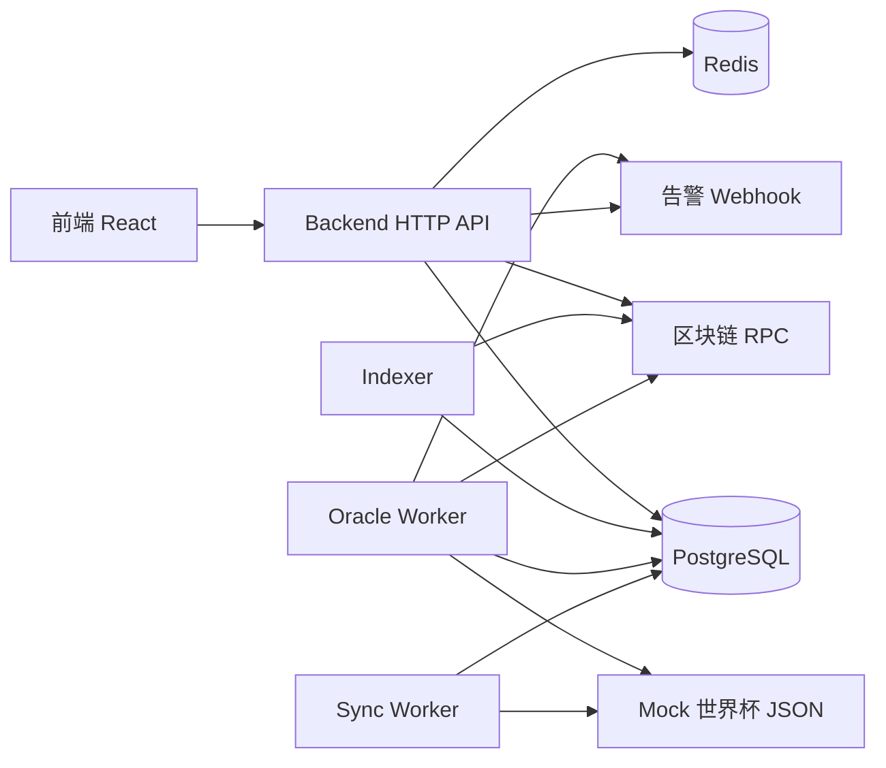
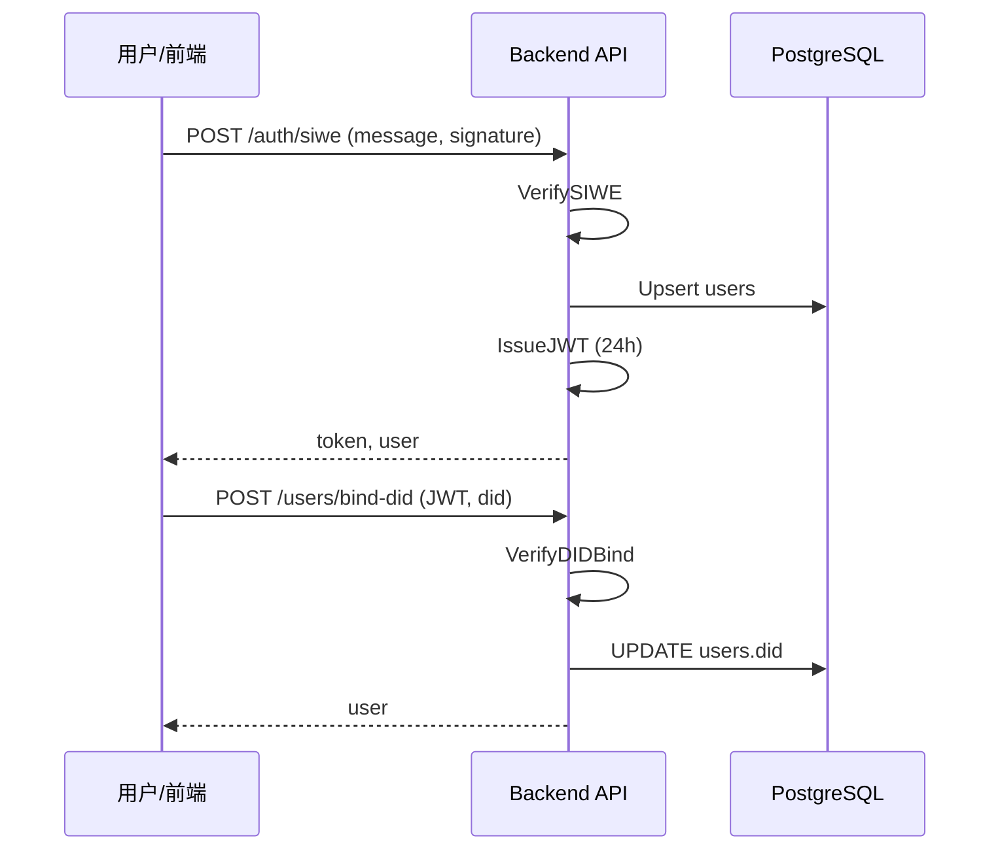
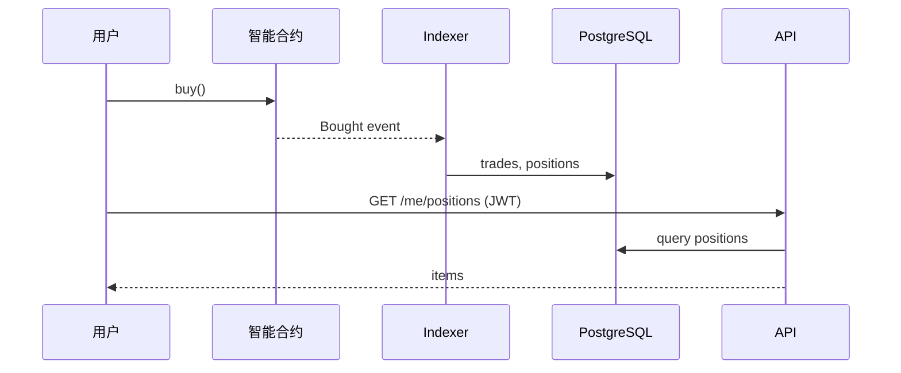
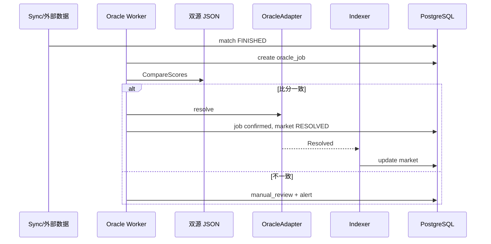

# Backend 需求规格说明书

| 文档属性 | 内容 |
|---------|------|
| 项目名称 | Prediction DID — 世界杯 Web3 预测市场（Backend） |
| 文档版本 | 1.0 |
| 适用代码 | `backend/` 目录（Go 1.22+） |
| 编写依据 | 源码、`migrations/`、`docs/ARCHITECTURE.md`、`docs/backend.md` |

---

## 1. 引言

### 1.1 编写目的

本文档从**已实现代码**反推并整理 Backend 子系统的软件需求规格，供产品、开发、测试与运维统一理解系统边界、功能范围、数据模型与接口约定。读者无需阅读源码即可把握 Backend 应「做什么」以及「做到什么程度」。

### 1.2 项目背景

Prediction DID 是一套面向世界杯赛事的去中心化预测市场应用。用户通过**数字钱包 + DID 身份**浏览赛程、参与链上下注；Backend 负责：

- 聚合赛程、市场、持仓等链下可读数据；
- 同步外部/Mock 世界杯比分；
- 索引链上事件写入数据库；
- 驱动预言机自动结算；
- 提供 SIWE 登录、可验证凭证（VC）与合规能力；
- 支撑运营管理后台。

链上资金与结算规则由 Solidity 合约保证；Backend **不托管用户私钥**，链上交易由用户钱包或配置的 Oracle 运维密钥发起。

### 1.3 术语与缩略语

| 术语 | 说明 |
|------|------|
| SIWE | Sign-In with Ethereum，以太坊签名登录 |
| DID | Decentralized Identifier，去中心化身份标识 |
| VC | Verifiable Credential，可验证凭证 |
| Indexer | 链上事件索引器，扫描区块日志写入 DB |
| Oracle Worker | 赛后自动比对数据源并调用链上 Oracle 结算的后台进程 |
| CPMM | 恒定乘积做市（Phase 3 市场） |
| JWT | JSON Web Token，用户会话令牌 |
| parimutuel | 彩池式预测，按池比例分配奖金 |

### 1.4 参考文献

- `docs/ARCHITECTURE.md` — 系统架构
- `docs/backend.md` — Backend 调用流程
- `docs/VC-MODEL.md` — VC 数据模型
- `backend/backend_func.md` — 函数与结构体说明
- 仓库根目录 `.env.example` — 环境变量模板

---

## 2. 项目概述

### 2.1 产品定位

Backend 是 Prediction DID 的**服务端层**，采用「多进程 + 分层架构」：

- **HTTP API 主服务**：对外 REST/SSE 接口，可选内嵌 Indexer；
- **后台 Worker**：独立 Indexer、Oracle、Sync、Reconcile、Migrate、Seed 等进程；
- **共享业务层**：`internal/` 包被各进程复用。

核心用户价值路径：

```
连接钱包 → SIWE 登录 →（可选）绑定 DID / 持有 VC
→ 浏览赛程与市场 → 前端链上下注
→ Indexer 同步持仓 → 比赛结束 → Oracle 自动结算
→ 用户链上 claim → Indexer 更新 claimed 状态
```

### 2.2 目标用户与角色

| 角色 | 描述 | 主要使用能力 |
|------|------|--------------|
| 终端用户 | 持有钱包的预测参与者 | 公开 API、SIWE 登录、持仓查询、DID 绑定、VC 查询 |
| 运营管理员 | 内部运营人员 | Admin API：市场登记、作废、Oracle 任务重试、VC 签发 |
| 运维人员 | 部署与监控 | 健康检查、Prometheus 指标、迁移/对账/种子脚本 |
| 外部系统 | KYC 服务商等 | KYC Webhook（可选 HMAC 验签） |

### 2.3 运行环境

| 类别 | 要求 |
|------|------|
| 语言与运行时 | Go 1.22 及以上 |
| 数据库 | PostgreSQL（连接串 `DATABASE_URL`） |
| 缓存 | Redis（可选，不可用时 API 降级运行） |
| 区块链 | 兼容 JSON-RPC 的 EVM 节点（如 Hardhat 本地链、测试网） |
| 操作系统 | 支持运行 Go 二进制及 Docker 部署依赖的常见 OS |
| 网络 | API 默认端口 8080；需访问 RPC、PostgreSQL、Redis |

---

## 3. 系统边界与总体架构

### 3.1 系统上下文



### 3.2 进程职责

| 进程入口 | 路径 | 职责 | 运行方式 |
|---------|------|------|----------|
| API 主服务 | `cmd/api` | HTTP 服务、可选内嵌 Indexer、Admin 链上操作客户端 | 常驻 |
| Indexer | `cmd/indexer` | 独立链上事件索引 | 常驻 |
| Oracle | `cmd/oracle` | 赛后双源比分比对与链上 resolve | 常驻 |
| Sync | `cmd/sync` | 一次性从主 Mock JSON 同步比赛 | 批处理 |
| Seed | `cmd/seed` | 迁移 + Mock 种子数据 | 批处理 |
| Migrate | `cmd/migrate` | 仅执行数据库迁移 | 批处理 |
| Reconcile | `cmd/reconcile` | 链上 ERC20 余额与 DB 池子对账 | 批处理 |

### 3.3 内部分层

| 层次 | 包路径 | 职责 |
|------|--------|------|
| 入口层 | `cmd/*` | 进程启动、依赖注入、信号优雅关闭 |
| 传输层 | `internal/server`、`internal/handler` | 路由、中间件、HTTP 处理 |
| 领域服务 | `internal/auth`、`internal/vc`、`internal/indexer`、`internal/oracle`、`internal/wcprovider` | 认证、凭证、索引、结算、数据源 |
| 基础设施 | `internal/blockchain`、`internal/database`、`internal/redis`、`internal/config`、`internal/middleware`、`internal/alert` | RPC、DB、配置、限流、告警 |
| 数据访问 | `internal/repository` | PostgreSQL CRUD |
| 模型 | `internal/models` | API 领域对象 |

### 3.4 系统外依赖

| 依赖 | 用途 | 不可用时的行为 |
|------|------|----------------|
| PostgreSQL | 持久化 | API/Worker 无法启动（fatal） |
| Redis | 就绪探针、未来扩展 | WARN 降级，ready 仍可用 |
| ETH RPC | 索引、Oracle、健康检查 | Indexer/Oracle 失败；ready 中 rpc_ok=false |
| Mock JSON | 开发环境赛程/双源比分 | Sync/Oracle 无法获取数据 |
| Oracle 私钥 | 自动结算、Admin void | Oracle Worker 跳过链上；Admin void 仅改 DB |

---

## 4. 功能需求

以下需求编号格式：**FR-{模块}-{序号}**。

### 4.1 配置与启动（config / cmd）

| 编号 | 需求描述 | 验收标准 |
|------|----------|----------|
| FR-CFG-01 | 系统应从环境变量加载配置 | `config.Load()` 成功返回 `*Config`；`DATABASE_URL` 缺失则失败 |
| FR-CFG-02 | 系统应支持链 ID、索引起始区块、封禁国家列表等可配置项 | 见第 9 章环境变量；非法 `CHAIN_ID`/`INDEXER_START_BLOCK` 解析失败 |
| FR-CFG-03 | API 启动时应自动执行数据库 Up 迁移 | 迁移路径 `migrations/` 或 `backend/migrations/`；`ErrNoChange` 视为成功 |
| FR-CFG-04 | API 应支持 SIGINT/SIGTERM 优雅关闭 | Shutdown 超时 10 秒 |

### 4.2 HTTP API — 健康与监控

| 编号 | 需求描述 | 验收标准 |
|------|----------|----------|
| FR-API-01 | 提供存活探针 `GET /health` | 始终返回 200 与 `{"status":"ok"}` |
| FR-API-02 | 提供就绪探针 `GET /ready` | 返回 `db_ok`、`redis_ok`、`rpc_ok`、`chain_id`；DB 不可用时 503 |
| FR-API-03 | 提供 Prometheus 文本指标 `GET /metrics` | 输出 oracle_jobs 各 status 计数 |
| FR-API-04 | 提供 SSE 比分流 `GET /events/scores` | 每 5 秒推送比赛列表 JSON；需 Flusher 支持 |

### 4.3 HTTP API — 比赛与市场（公开）

| 编号 | 需求描述 | 验收标准 |
|------|----------|----------|
| FR-MATCH-01 | 分页查询比赛 `GET /matches` | 支持 `status`、`limit`（默认 20）、`offset`；返回 `items` |
| FR-MATCH-02 | 查询单场比赛 `GET /matches/{id}` | 返回 `match` 及关联 `markets`；无效 id 400，不存在 404 |
| FR-MKT-01 | 分页查询市场 `GET /markets` | 返回 `items`、`collateral_address`、`chain_id` |
| FR-MKT-02 | 查询单个市场 `GET /markets/{id}` | 返回 `market`、`access`（VC 门禁）、抵押代币与链 ID |
| FR-MKT-03 | 查询市场池快照 `GET /markets/{id}/pool` | 返回 reserve、price_bps、fee_bps 等 |
| FR-MKT-04 | 查询合成盘口 `GET /markets/{id}/orderbook` | 返回 CPMM 合成 bids 与说明 note |
| FR-MKT-05 | 需 VC 的市场应返回访问门禁 | `requires_vc=true` 时检查用户 JWT 下是否持有有效 `VerifiedFan` 凭证，写入 `access.allowed` |

### 4.4 HTTP API — 身份与 DID

| 编号 | 需求描述 | 验收标准 |
|------|----------|----------|
| FR-AUTH-01 | SIWE 登录 `POST /auth/siwe` | 校验 message/signature、domain、uri、过期；Upsert 用户；签发 24h JWT；返回 `token` 与 `user` |
| FR-AUTH-02 | JWT 保护的用户接口 | `Authorization: Bearer <token>`；无效/缺失返回 401 |
| FR-AUTH-03 | 绑定 DID `POST /users/bind-did` | 需 JWT；DID 格式必须为 `did:pkh:eip155:{chainID}:{address}`；写入 users.did |
| FR-AUTH-04 | 查询当前用户持仓 `GET /me/positions` | 需 JWT；返回 Indexer 聚合的持仓列表 |
| FR-AUTH-05 | 查询当前用户凭证 `GET /users/me/credentials` | 需 JWT；返回未撤销且未过期的 credentials |

### 4.5 HTTP API — 可验证凭证（VC）

| 编号 | 需求描述 | 验收标准 |
|------|----------|----------|
| FR-VC-01 | 管理员签发 VC `POST /credentials/issue` | 需 `X-Admin-Key`；必填 address、credential_type；HMAC 签名 W3C VC JSON；持久化到 credentials 表 |
| FR-VC-02 | 校验 VC `POST /auth/verify-vc` | 校验 HMAC 签名与过期；可选 region 与 credentialSubject 比对；无效 401，region 不符 403 |
| FR-VC-03 | VC 默认 TTL | 未指定 `ttl_hours` 时使用 365 天 |

### 4.6 HTTP API — 合规与 KYC

| 编号 | 需求描述 | 验收标准 |
|------|----------|----------|
| FR-COMP-01 | 查询地理限制 `GET /compliance/restricted` | 根据 `CF-IPCountry` 或 `X-Country-Code` 返回 country、restricted、compliance_required、environment |
| FR-COMP-02 | 地理围栏中间件 | `GEO_BLOCK_ENABLED=true` 时拦截封禁国家请求（403）；健康/指标/合规/SSE 等路径豁免 |
| FR-COMP-03 | 记录地理访问日志 | GeoBlock 回调写入 `geo_access_log` |
| FR-KYC-01 | KYC Webhook `POST /kyc/webhook` | body ≤ 1MB；配置 secret 时校验 `X-KYC-Signature`；记录 kyc_events |
| FR-KYC-02 | KYC approved 时签发 VC | status=approved 且含 user_address 时调用 Issuer（当前实现**未**写入 credentials 表，仅内存签发） |

### 4.7 HTTP API — 平台统计

| 编号 | 需求描述 | 验收标准 |
|------|----------|----------|
| FR-STAT-01 | 平台统计 `GET /stats/platform` | 返回 trade_count、trade_volume、fees_collected、active_users、open_markets、tvl_approx |

### 4.8 HTTP API — 管理后台

| 编号 | 需求描述 | 验收标准 |
|------|----------|----------|
| FR-ADM-01 | 管理员鉴权 | `X-Admin-Key` 或 Bearer 与 `ADMIN_API_KEY` 一致；未配置 key 时 503 |
| FR-ADM-02 | 列出 Oracle 作业 `GET /admin/oracle-jobs` | 可选 status 过滤；最多 100 条 |
| FR-ADM-03 | 登记市场合规规则 `POST /admin/markets` | 更新 match 关联市场的 requires_vc、restricted_region、resolution_rule |
| FR-ADM-04 | 作废市场 `POST /admin/markets/{id}/void` | 可选链上 VoidMarket；DB 设 VOID；关联比赛 CANCELLED |
| FR-ADM-05 | 重试 Oracle 作业 `POST /admin/oracle-jobs/{id}/retry` | 状态改 pending，清空 error_message |

### 4.9 中间件与安全

| 编号 | 需求描述 | 验收标准 |
|------|----------|----------|
| FR-SEC-01 | 全局限流 | 每 IP 每分钟请求数可配置（默认 120）；`/health`、`/ready` 豁免；超限 429 |
| FR-SEC-02 | CORS | 允许 localhost:5173 来源及常用 Header |
| FR-SEC-03 | 请求日志与 Recovery | chi Logger、Recoverer、RequestID、RealIP |
| FR-SEC-04 | 统一 JSON 错误格式 | `{"error":"message"}` |

### 4.10 世界杯数据同步（wcprovider / sync）

| 编号 | 需求描述 | 验收标准 |
|------|----------|----------|
| FR-SYNC-01 | 从 Mock JSON 同步比赛 | `cmd/sync` 调用 DualProvider.SyncPrimary；按 external_id Upsert matches |
| FR-SYNC-02 | 支持主/次双数据源 | 路径由 `MOCK_MATCHES_PATH`、`MOCK_MATCHES_SECONDARY_PATH` 配置 |
| FR-SYNC-03 | 比赛字段 | external_id、主客队、kickoff_at（RFC3339）、status、比分（可选） |
| FR-SYNC-04 | 种子导入 | `cmd/seed` 执行迁移后导入 Mock 数据 |

### 4.11 链上索引（indexer）

| 编号 | 需求描述 | 验收标准 |
|------|----------|----------|
| FR-IDX-01 | 扫描 MarketFactory 的 MarketCreated | 写入 markets；matchRef 映射 external_id |
| FR-IDX-02 | 扫描各市场的 Bought/Resolved/Claimed | 更新 trades、positions、market 状态、claimed |
| FR-IDX-03 | 记录索引进度 | indexer_state.last_block 递增；每批最多 2000 块 |
| FR-IDX-04 | 可独立进程或 API 内嵌 | `MARKET_FACTORY_ADDRESS` 非空时 API 后台 goroutine 启动 |
| FR-IDX-05 | Factory 未配置时跳过 | 打日志不报错退出 |
| FR-IDX-06 | 幂等写入 | trades 以 (tx_hash, log_index) 唯一；positions Upsert 累加 |

### 4.12 预言机自动结算（oracle）

| 编号 | 需求描述 | 验收标准 |
|------|----------|----------|
| FR-ORC-01 | 为 FINISHED 比赛创建 Oracle 作业 | 对其 OPEN 市场 Create job；冷却期 execute_after；比赛→ORACLE_PENDING |
| FR-ORC-02 | 同一市场避免重复活跃作业 | pending/submitted/manual_review 存在则跳过 |
| FR-ORC-03 | 双源比分比对 | 主/次 JSON 比分一致才上链；否则 manual_review + Webhook 告警 |
| FR-ORC-04 | 按 resolution_rule 计算 outcome | 默认 HOME_WIN；支持 OVER_25 等 |
| FR-ORC-05 | 链上结算 | timelock≤0 用 ResolveNow；否则 RequestResolve → WaitMined → sleep → ConfirmResolve |
| FR-ORC-06 | 成功后更新 DB | job=confirmed；market=RESOLVED；match=RESOLVED |
| FR-ORC-07 | 链上失败处理 | job=failed；告警；可 Admin 重试 |
| FR-ORC-08 | Oracle 客户端缺失 | chain=nil 时 processDue 跳过（Worker 仍可入队） |

### 4.13 链上交互（blockchain）

| 编号 | 需求描述 | 验收标准 |
|------|----------|----------|
| FR-CHAIN-01 | RPC 健康检查 | 后台 Ping；记录 rpc_ok、chain_id；可与期望 CHAIN_ID 比对 |
| FR-CHAIN-02 | Oracle 交易客户端 | 加载 OracleAdapter ABI；支持 requestResolve/confirmResolve/resolveNow/voidMarket |
| FR-CHAIN-03 | 等待交易确认 | WaitMined 最多约 60s；revert 返回 error |
| FR-CHAIN-04 | ERC20 余额查询 | reconcile 用 balanceOf 对账 |

### 4.14 对账（reconcile）

| 编号 | 需求描述 | 验收标准 |
|------|----------|----------|
| FR-REC-01 | 对比 OPEN/RESOLVED 市场池子与链上抵押余额 | 需 MOCK_USDC_ADDRESS；写入 reconciliation_runs |
| FR-REC-02 | RPC 失败降级 | 尝试 ETH_RPC_FALLBACK_URL |

### 4.15 告警（alert）

| 编号 | 需求描述 | 验收标准 |
|------|----------|----------|
| FR-ALERT-01 | Oracle 异常告警 | manual_review、failed 等事件 POST Webhook（可选）；始终写本地日志 |

---

## 5. 非功能需求

### 5.1 性能

| 编号 | 需求描述 | 指标/说明 |
|------|----------|-----------|
| NFR-PERF-01 | API 读请求应 primarily 查 DB | 前端不直接扫链；Indexer 异步同步 |
| NFR-PERF-02 | Indexer 批处理区块 | 单次最多 2000 块，轮询间隔可配置（默认 5s） |
| NFR-PERF-03 | Oracle 轮询间隔可配置 | 默认 10s |
| NFR-PERF-04 | SSE 推送间隔 | 5s |
| NFR-PERF-05 | HTTP ReadTimeout | 15s；WriteTimeout=0 以支持 SSE |

### 5.2 可用性与可靠性

| 编号 | 需求描述 | 指标/说明 |
|------|----------|-----------|
| NFR-AVAIL-01 | Redis 不可用时不阻断 API | WARN 日志，ready 标记 redis_ok=false |
| NFR-AVAIL-02 | 优雅关闭 | SIGINT/SIGTERM 触发 Shutdown |
| NFR-AVAIL-03 | Oracle 单 job 失败不阻塞其他 job | 记录日志继续处理 |
| NFR-AVAIL-04 | Indexer 单事件失败 | handle 错误打日志，不中断整批扫描 |

### 5.3 安全

| 编号 | 需求描述 | 指标/说明 |
|------|----------|-----------|
| NFR-SEC-01 | 用户鉴权 | SIWE + JWT HS256；Admin 独立 API Key |
| NFR-SEC-02 | 限流防滥用 | 按 IP 滑动窗口 |
| NFR-SEC-03 | 地理合规 | 可配置封禁国家列表 |
| NFR-SEC-04 | KYC Webhook | 可选 HMAC-SHA256 验签 |
| NFR-SEC-05 | 密钥管理 | JWT_SECRET、ORACLE_PRIVATE_KEY、VC_ISSUER_KEY、ADMIN_API_KEY 不得提交版本库；生产应使用 KMS |
| NFR-SEC-06 | VC 完整性 | HMAC-SHA256 proof；校验过期 |

### 5.4 可维护性与可观测性

| 编号 | 需求描述 | 指标/说明 |
|------|----------|-----------|
| NFR-OPS-01 | 结构化日志 | chi Logger 记录请求 |
| NFR-OPS-02 | Prometheus 指标 | oracle_jobs 状态计数 |
| NFR-OPS-03 | 数据库版本化 | golang-migrate SQL 迁移，分 phase0–3 |
| NFR-OPS-04 | 对账工具 | reconcile 命令发现 Indexer 漏扫或资金不一致 |

### 5.5 兼容性

| 编号 | 需求描述 | 指标/说明 |
|------|----------|-----------|
| NFR-COMPAT-01 | 链 | EVM JSON-RPC；开发链 ID 31337（Hardhat） |
| NFR-COMPAT-02 | 合约阶段 | Phase 1/2 PredictionMarket + Phase 3 CPMM/多 outcome（Indexer 当前主扫 PredictionMarket 事件） |
| NFR-COMPAT-03 | CORS 前端 | localhost:5173 |

---

## 6. 数据需求

### 6.1 核心实体

| 实体 | 表名 | 说明 |
|------|------|------|
| 比赛 | matches | 世界杯赛程、比分、状态 |
| 用户 | users | 钱包地址、可选 DID |
| 市场 | markets | 链上市场镜像、池子、合规字段、CPMM 字段 |
| 交易 | trades | 链上 Bought 事件明细 |
| 持仓 | positions | 用户按市场聚合 Yes/No 持仓与 claimed |
| 索引状态 | indexer_state | 最后处理区块 |
| Oracle 作业 | oracle_jobs | 结算任务队列与双源比分 |
| 凭证 | credentials | 用户 VC 持久化 |
| 地理日志 | geo_access_log | 合规访问记录 |
| KYC 事件 | kyc_events | Webhook 原始记录 |
| 对账记录 | reconciliation_runs | 链上/DB 资金比对 |

### 6.2 比赛状态机

```
SCHEDULED → LIVE → FINISHED → ORACLE_PENDING → RESOLVED
                      ↓
                 CANCELLED / VOID
```

| 状态 | 含义 | 触发方 |
|------|------|--------|
| SCHEDULED | 未开赛 | Sync/Mock 数据 |
| LIVE | 进行中 | 外部数据更新 |
| FINISHED | 已结束待结算 | 外部数据更新 |
| ORACLE_PENDING | 已创建 Oracle 作业 | Oracle Worker enqueue |
| RESOLVED | 已链上结算 | Oracle 成功 + Indexer |
| CANCELLED | 比赛取消 | Admin void 等 |

### 6.3 市场状态

| 状态 | 含义 |
|------|------|
| OPEN | 可下注（链上） |
| RESOLVED | 已结算 |
| VOID | 已作废 |

### 6.4 Oracle 作业状态

| 状态 | 含义 |
|------|------|
| pending | 等待 execute_after |
| submitted | （预留） |
| manual_review | 双源不一致，需人工 |
| confirmed | 链上结算成功 |
| failed | 链上或处理失败 |

### 6.5 数据约束（摘要）

- `matches.external_id` 唯一
- `markets.market_address` 唯一
- `trades.(tx_hash, log_index)` 唯一
- `positions.(market_id, user_address)` 唯一
- 用户地址存储为小写
- 金额字段使用 NUMERIC(78,0) 存链上最小单位

---

## 7. 接口需求

### 7.1 REST API 一览

#### 7.1.1 公开接口（无需 JWT）

| 方法 | 路径 | 功能 |
|------|------|------|
| GET | `/health` | 存活探针 |
| GET | `/ready` | 就绪探针 |
| GET | `/matches` | 比赛列表 |
| GET | `/matches/{id}` | 比赛详情 |
| GET | `/markets` | 市场列表 |
| GET | `/markets/{id}` | 市场详情 |
| GET | `/markets/{id}/pool` | 池子快照 |
| GET | `/markets/{id}/orderbook` | 合成盘口 |
| GET | `/stats/platform` | 平台统计 |
| GET | `/compliance/restricted` | 合规状态 |
| POST | `/kyc/webhook` | KYC 回调 |
| GET | `/events/scores` | SSE 比分流 |
| GET | `/metrics` | Prometheus 指标 |
| POST | `/auth/siwe` | SIWE 登录 |
| POST | `/auth/verify-vc` | VC 校验 |

#### 7.1.2 用户接口（JWT）

| 方法 | 路径 | 功能 |
|------|------|------|
| GET | `/me/positions` | 我的持仓 |
| POST | `/users/bind-did` | 绑定 DID |
| GET | `/users/me/credentials` | 我的凭证 |

#### 7.1.3 管理接口（Admin Key）

| 方法 | 路径 | 功能 |
|------|------|------|
| GET | `/admin/oracle-jobs` | Oracle 作业列表 |
| POST | `/admin/markets` | 登记市场规则 |
| POST | `/admin/markets/{id}/void` | 作废市场 |
| POST | `/admin/oracle-jobs/{id}/retry` | 重试作业 |
| POST | `/credentials/issue` | 签发 VC |

### 7.2 外部接口

| 接口 | 协议 | 说明 |
|------|------|------|
| 区块链 JSON-RPC | HTTP/WebSocket | eth_blockNumber、eth_getLogs、eth_sendRawTransaction 等 |
| Mock 比赛 JSON | 本地文件 | 开发/演示用赛程与比分 |
| 告警 Webhook | HTTP POST | JSON `{event, message}` |
| KYC 服务商 | HTTP POST 至本系统 | `/kyc/webhook` |

### 7.3 链上事件（Indexer 订阅）

| 合约 | 事件 | Backend 处理 |
|------|------|--------------|
| MarketFactory | MarketCreated | 插入 markets |
| PredictionMarket | Bought | trades + positions |
| PredictionMarket | Resolved | 更新 market 状态与 outcome |
| PredictionMarket | Claimed | positions.claimed=true |

---

## 8. 业务流程需求

### 8.1 用户登录与 DID 绑定



### 8.2 下注与持仓同步



### 8.3 自动结算



---

## 9. 配置与环境需求

### 9.1 必填环境变量

| 变量 | 说明 |
|------|------|
| DATABASE_URL | PostgreSQL 连接串 |

### 9.2 常用环境变量（摘要）

| 变量 | 默认值/说明 |
|------|-------------|
| HTTP_PORT | 8080 |
| REDIS_URL | redis://localhost:6379/0 |
| ETH_RPC_URL | http://127.0.0.1:8545 |
| CHAIN_ID | 31337 |
| JWT_SECRET | 生产必须更换 |
| SIWE_DOMAIN / SIWE_URI | SIWE 域与前端 URI |
| MARKET_FACTORY_ADDRESS | 非空则启动 Indexer |
| MOCK_USDC_ADDRESS | 对账与 API 返回 collateral |
| ORACLE_ADAPTER_ADDRESS + ORACLE_PRIVATE_KEY | Oracle 链上客户端 |
| INDEXER_START_BLOCK / INDEXER_POLL_SECONDS | 索引配置 |
| ORACLE_COOLDOWN_MINUTES / ORACLE_TIMELOCK_SECONDS / ORACLE_POLL_SECONDS | Oracle Worker |
| MOCK_MATCHES_PATH / MOCK_MATCHES_SECONDARY_PATH | 双源 Mock |
| ADMIN_API_KEY | 管理接口 |
| VC_ISSUER_KEY | VC HMAC 密钥 |
| GEO_BLOCK_ENABLED / BLOCKED_COUNTRIES | 地理围栏 |
| RATE_LIMIT_PER_MINUTE | 限流 |
| ALERT_WEBHOOK_URL | 告警 |
| KYC_WEBHOOK_SECRET | KYC 验签 |

完整列表见仓库根目录 `.env.example`。

---

## 10. 约束与假设

### 10.1 约束

1. Backend **不替代**链上结算逻辑；最终资金分配以合约为准。
2. MVP 阶段 DID 绑定**不强制**验证链上签名（信任 JWT 已认证用户）。
3. KYC Webhook 签发的 VC **当前未持久化**至 credentials 表（与 Admin 签发路径不同）。
4. Indexer 主路径针对 **PredictionMarket** ABI；V3/多 outcome 市场需扩展索引逻辑。
5. 开发环境使用 **Mock JSON** 代替真实世界杯 API；生产需对接真实数据源并满足 SLA。

### 10.2 假设

1. 前端负责钱包连接、链上 approve/buy/claim 交易构造与广播。
2. 合约已部署且 ABI 已同步至 `backend/pkg/contracts/`。
3. PostgreSQL、Redis（可选）、RPC 网络可达。
4. Oracle 运维密钥安全存储，仅 Oracle Worker 与 Admin void 使用。
5. 运营人员通过安全渠道获取 Admin API Key。

---

## 11. 分期实现范围（与代码对应）

| 阶段 | Backend 能力 | 迁移文件 |
|------|--------------|----------|
| Phase 0 | 基础设施、迁移框架 | 000001_init |
| Phase 1 | 比赛/市场/用户/Indexer/持仓/SIWE | 000002_phase1 |
| Phase 2 | Oracle 作业、VC、合规字段、Admin | 000003_phase2 |
| Phase 3 | CPMM 字段、地理日志、KYC、对账、平台统计 | 000004_phase3 |

---

## 12. 验收与测试建议

| 类别 | 建议验收项 |
|------|------------|
| 冒烟 | `GET /health`、`GET /ready`、迁移成功、SIWE 登录闭环 |
| 功能 | 比赛/市场列表、JWT 持仓、Admin 登记与 void、VC 签发与校验 |
| 集成 | 本地链部署 → Indexer 写入 → 模拟 FINISHED → Oracle resolve |
| 安全 | 限流 429、GeoBlock 403、Admin 403/503、JWT 401 |
| 运维 | `/metrics` 有数据、reconcile 产出记录、告警 Webhook 可达 |

自动化测试现状：存在 `config_test.go`、`health_test.go`；完整 E2E 需结合合约与前端。

---

## 13. 附录

### 13.1 文档修订记录

| 版本 | 日期 | 说明 |
|------|------|------|
| 1.0 | 2026-07-17 | 初版，基于当前 backend 源码整理 |

### 13.2 相关文档索引

- 调用流程详解：`docs/backend.md`
- 函数级说明：`backend/backend_func.md`
- 架构总览：`docs/ARCHITECTURE.md`
- VC 模型：`docs/VC-MODEL.md`

---

**文档结束**
