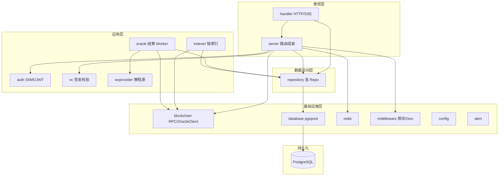
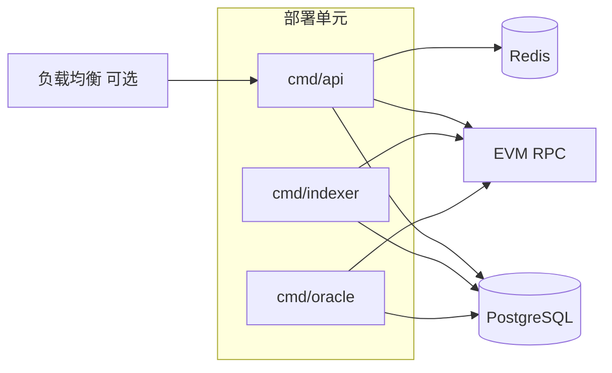
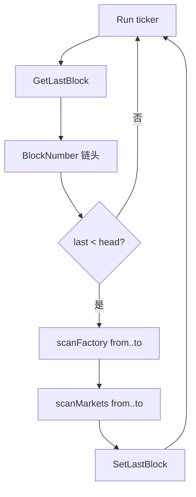
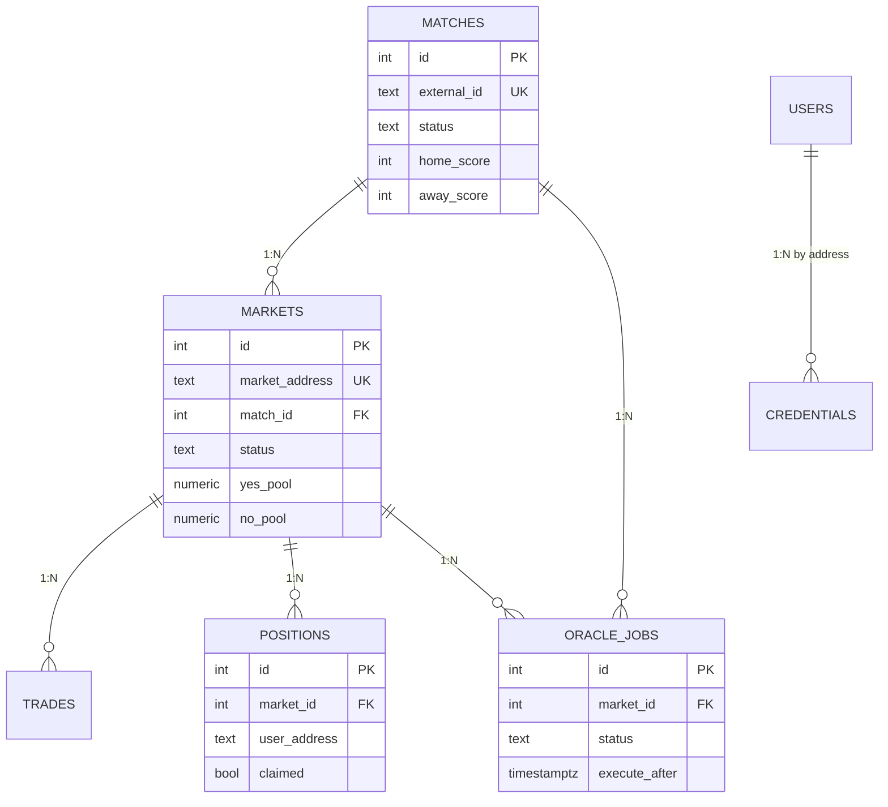
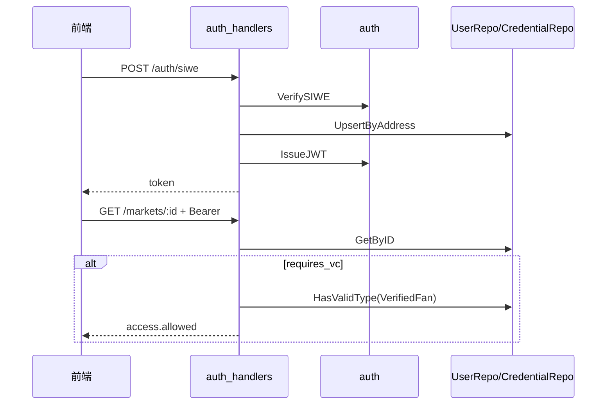
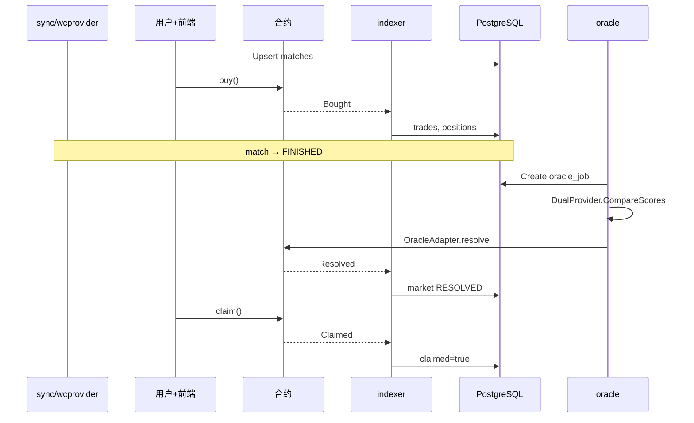

# Backend 概要设计说明书

| 文档属性 | 内容 |
|---------|------|
| 项目名称 | Prediction DID — 世界杯 Web3 预测市场（Backend） |
| 文档版本 | 1.0 |
| 前置文档 | `backend/01.需求规格说明书.md` |
| 适用代码 | `backend/` 目录（Go 1.22+，module `github.com/prediction-did/simple`） |
| 详细实现参考 | `backend/backend_func.md`、`docs/backend.md` |

---

## 1. 引言

### 1.1 编写目的

本文档描述 Backend 子系统的**概要设计**：在需求规格说明书（01 文档）所定义的功能与非功能需求基础上，给出系统架构、模块划分、数据设计、接口设计、关键流程与部署方案，作为详细设计与编码实现的统一蓝图。

### 1.2 设计目标

| 目标 | 设计对策 |
|------|----------|
| 链上链下职责清晰 | 资金与规则在合约；Backend 负责索引、聚合、自动化与合规 |
| 可独立演进 | 多进程 + 共享 `internal/` 包；API 与 Worker 可分开扩缩容 |
| 开发/生产一致 | 环境变量驱动配置；Mock JSON 可替换为真实世界杯 API |
| 安全与合规 | SIWE/JWT、Admin Key、限流、地理围栏、VC 门禁 |
| 可观测 | `/health`、`/ready`、`/metrics`、对账任务、Webhook 告警 |

### 1.3 设计原则

1. **分层依赖单向**：`cmd` → `server/handler` → `repository/领域服务` → `database/blockchain`，避免 handler 直接写 SQL。
2. **配置外置**：敏感项与部署差异全部走环境变量（见 `.env.example`）。
3. **幂等与可恢复**：Indexer 按 `(tx_hash, log_index)` 去重；Oracle Job 有状态机与 Admin 重试。
4. **优雅降级**：Redis、RPC、Oracle 客户端缺失时不拖垮整个 API 进程（WARN + 跳过相关能力）。
5. **最小权限**：用户 JWT 仅访问自身资源；链上写操作限定 Oracle 角色与 Admin 场景。

---

## 2. 系统总体设计

### 2.1 逻辑架构

Backend 在 Prediction DID 整体架构中处于**应用服务层**，向上对接 React 前端，向下对接 PostgreSQL、Redis、EVM RPC 及外部/Mock 数据源。



### 2.2 物理/部署架构

推荐生产部署为**多进程 + 共享数据库**（同一代码库，不同 `cmd` 入口）：



| 组件 | 建议部署 | 说明 |
|------|----------|------|
| `cmd/api` | 1+ 实例，可水平扩展 | 无状态 HTTP；SSE 长连接需 sticky 或单实例 |
| `cmd/indexer` | **单实例**（主） | 依赖 `indexer_state.last_block`，多实例需分片设计（当前未实现） |
| `cmd/oracle` | **单实例**（主） | 依赖 DB 作业锁语义（活跃 job 唯一索引） |
| `cmd/sync/seed/migrate/reconcile` | Cron / CI 一次性 | 运维脚本 |

开发环境常见组合：**单进程 `cmd/api`（内嵌 Indexer）+ 可选 `cmd/oracle`**。

### 2.3 技术选型

| 类别 | 选型 | 用途 |
|------|------|------|
| 语言 | Go 1.22+ | 全 Backend |
| HTTP 路由 | chi v5 | REST、中间件、路由分组 |
| CORS | go-chi/cors | 前端跨域 |
| 数据库驱动 | jackc/pgx/v5 | PostgreSQL 连接池 |
| 迁移 | golang-migrate | SQL 版本管理 |
| 缓存 | go-redis v9 | 就绪探针、可扩展 |
| 区块链 | go-ethereum | RPC、ABI、发交易 |
| 认证 | spruceid/siwe-go + golang-jwt | SIWE + JWT |
| VC 签名 | 标准库 crypto/hmac | HMAC-SHA256 proof |

---

## 3. 模块设计

### 3.1 模块总览

```
backend/
├── cmd/                    # 进程入口（7 个）
│   ├── api/                # HTTP 主服务
│   ├── indexer/            # 独立索引器
│   ├── oracle/             # Oracle Worker
│   ├── sync/               # 赛程同步
│   ├── seed/               # 种子数据
│   ├── migrate/            # 迁移
│   └── reconcile/          # 对账
├── internal/
│   ├── config/             # 配置加载
│   ├── server/             # HTTP Server 组装
│   ├── handler/            # HTTP 处理器
│   ├── auth/               # JWT / SIWE / 中间件
│   ├── middleware/         # 限流、地理围栏
│   ├── repository/         # 数据访问
│   ├── models/             # API 模型
│   ├── indexer/            # 链上索引逻辑
│   ├── oracle/             # 结算 Worker 逻辑
│   ├── wcprovider/         # Mock/双源赛程
│   ├── blockchain/         # RPC 与 Oracle 客户端
│   ├── vc/                 # VC 签发/校验
│   ├── database/           # 连接池与迁移
│   ├── redis/              # Redis 客户端
│   └── alert/              # Webhook 告警
├── migrations/             # SQL 迁移
├── pkg/contracts/          # 合约 ABI JSON（同步自 contracts）
└── data/                   # Mock 比赛 JSON
```

### 3.2 入口模块（cmd）

| 模块 | 依赖组装 | 生命周期 |
|------|----------|----------|
| **cmd/api** | config → migrate → pgxpool → redis(可选) → blockchain.Client → indexer goroutine(可选) → OracleClient(可选) → server.New | 常驻；SIGTERM Shutdown 10s |
| **cmd/indexer** | config → pool → indexer.New → Run | 常驻 |
| **cmd/oracle** | config → pool → DualProvider → OracleClient(可选) → Worker.Run | 常驻 |
| **cmd/sync** | config → pool → DualProvider.SyncPrimary | 退出 |
| **cmd/seed** | migrate → pool → MockProvider.Sync | 退出 |
| **cmd/migrate** | config → RunMigrations | 退出 |
| **cmd/reconcile** | config → migrate → pool → run() | 退出 |

**设计要点**：各 `cmd` 仅负责**依赖注入与进程生命周期**，业务逻辑全部在 `internal/`。

### 3.3 传输层（server + handler）

#### 3.3.1 server

- **职责**：创建 chi Router，按固定顺序挂载中间件，实例化 `handler.Health` 与 `handler.API`，注入全部 Repository 与 `VCIssuer`、`OracleChain`。
- **核心类型**：
  - `Server`：封装 `http.Server`
  - `Dependencies`：Port、Cfg、DB、Redis、Chain、OracleChain

**中间件链（顺序固定）**：

```
RequestID → RealIP → Logger → Recoverer
→ RateLimit(perMinute)
→ GeoBlock(cfg, LogGeo)
→ CORS
→ 路由 Handler
```

#### 3.3.2 handler

- **职责**：REST/SSE 请求解析、鉴权上下文、调用 Repository/领域服务、统一 JSON 响应。
- **核心类型**：`API`（聚合 Cfg + 8 个 Repo + VCIssuer + OracleChain）、`Health`。
- **路由分组**（见 `api.RegisterRoutes`）：
  - 公开路由
  - JWT 分组（`auth.Middleware`）
  - Admin 分组（`auth.AdminMiddleware`）

**设计要点**：Handler 不持有业务状态；错误统一 `writeError` → `{"error":"..."}`。

### 3.4 认证与合规（auth + middleware + vc）

| 包 | 职责 | 关键设计 |
|----|------|----------|
| **auth** | SIWE 验签、JWT 签发/解析、DID 格式校验、HTTP 中间件 | JWT Claims 仅含 `address`；地址统一 lower；Admin 支持 Header `X-Admin-Key` 或 Bearer |
| **middleware** | IP 限流、GeoBlock | 滑动窗口 1 分钟；豁免 health/ready/metrics/compliance/SSE |
| **vc** | W3C VC JSON + HMAC proof | Issuer 密钥来自 `VC_ISSUER_KEY`；Verify 校验 proof 与 expirationDate |

**DID 绑定设计**：期望格式 `did:pkh:eip155:{chainID}:{address}`；MVP 不验链上 bind 签名（信任 JWT 用户）。

### 3.5 数据访问层（repository + models）

#### 3.5.1 设计模式

- **Repository 模式**：每聚合根一个 Repo 结构体，持有 `*pgxpool.Pool`。
- **models 包**：面向 API 的 JSON 友好结构体（带 `json` tag）。
- **repository 内 DTO**：如 `Credential`、`OracleJob`、`AdminMarketUpdate` 与 DB 表一一对应。

#### 3.5.2 Repository 清单

| Repo | 表/领域 | 主要方法 |
|------|---------|----------|
| MatchRepo | matches | List, GetByID, Upsert, SetStatus, GetByExternalID |
| MarketRepo | markets | List, GetByID, GetByAddress, InsertFromChain, UpdateResolved, RegisterAdmin, SetVoid, UpdatePools |
| UserRepo | users | UpsertByAddress, BindDID, GetByAddress |
| PositionRepo | positions, trades | AddTrade, SetClaimed, ListByUser, InsertTrade |
| OracleJobRepo | oracle_jobs | Create, HasActiveForMarket, ListDue, ListAll, UpdateStatus |
| CredentialRepo | credentials | Insert, ListByUser, HasValidType |
| ComplianceRepo | geo_access_log, kyc_events | LogGeo, LogKYC |
| StatsRepo | 聚合 SQL | Platform, UpdateMarketPool |
| IndexerStateRepo | indexer_state | GetLastBlock, SetLastBlock |

### 3.6 链上索引（indexer）

**职责**：轮询 RPC，扫描 `MarketFactory.MarketCreated` 与各 `PredictionMarket` 的 `Bought`/`Resolved`/`Claimed`，写入 DB。

**核心类型**：`Indexer`（cfg, ethclient, factoryABI, marketABI, 4 个 Repo）

**索引流程**：



| 设计参数 | 值 | 说明 |
|----------|-----|------|
| 批大小 | max 2000 blocks | 防止 FilterLogs 超时 |
| 轮询间隔 | INDEXER_POLL_SECONDS（默认 5s） | 可配置 |
| 起始块 | INDEXER_START_BLOCK | last=0 时使用 |
| matchRef 映射 | keccak 已知 external_id | 未知则存 hex |

### 3.7 预言机 Worker（oracle + wcprovider + blockchain）

**职责**：比赛 FINISHED 后创建 Oracle Job → 冷却 → 双源比分比对 → 计算 outcome → 链上 resolve → 更新 DB。

**核心类型**：`oracle.Worker`（cfg, OracleJobRepo, MatchRepo, MarketRepo, DualProvider, OracleClient, Notifier）

**wcprovider 设计**：

| 类型 | 说明 |
|------|------|
| MockProvider | 单 JSON 文件 → MatchRepo.Upsert |
| DualProvider | primary + secondary JSON；CompareScores 双源一致才返回 match=true |
| OutcomeFromRule | HOME_WIN（默认）/ OVER_25 等规则 → outcome 0/1 |

**链上结算路径**：

```
OracleTimelockSeconds <= 0  → ResolveNow(market, outcome)
OracleTimelockSeconds > 0  → RequestResolve → WaitMined → sleep(timelock) → ConfirmResolve → WaitMined
```

失败 → job.status=failed + alert；双源不一致 → manual_review + alert。

### 3.8 区块链客户端（blockchain）

| 类型 | 职责 |
|------|------|
| **Client** | RPC 健康检查；atomic 存 rpcOK/chainID；30s 后台 Ping |
| **OracleClient** | 加载 OracleAdapter ABI；ECDSA 签名发 requestResolve/confirmResolve/resolveNow/voidMarket |
| **ERC20Balance** | reconcile 用 balanceOf |

ABI 路径：`pkg/contracts/{Contract}.json` 或 `backend/pkg/contracts/...`。

### 3.9 基础设施包

| 包 | 职责 |
|----|------|
| **config** | `Load()` 从 env 构造 Config；校验 DATABASE_URL |
| **database** | NewPool, Ping, RunMigrations（golang-migrate Up） |
| **redis** | NewClient, Ping（2s 超时） |
| **alert** | Notifier.Send → log + 可选 Webhook POST |

---

## 4. 数据设计

### 4.1 概念 ER 关系



### 4.2 表清单与 Phase

| 表名 | Phase | 说明 |
|------|-------|------|
| schema_meta | 0 |  schema 元信息 |
| matches | 1 | 比赛 |
| users | 1 | 用户 |
| markets | 1 | 市场 |
| trades | 1 | 链上交易明细 |
| positions | 1 | 用户持仓 |
| indexer_state | 1 | 索引进度（单行 id=1） |
| oracle_jobs | 2 | Oracle 作业队列 |
| credentials | 2 | VC 存储 |
| platform_stats_daily | 3 | 日统计（表已建，聚合主要在 StatsRepo 实时 SQL） |
| geo_access_log | 3 | 地理访问日志 |
| kyc_events | 3 | KYC Webhook |
| reconciliation_runs | 3 | 对账结果 |

markets 扩展字段（Phase 2/3）：`requires_vc`、`restricted_region`、`resolution_rule`、`market_type`、`fee_bps`、`reserve_yes/no`、`price_yes_bps`。

### 4.3 关键索引与约束

| 对象 | 类型 | 目的 |
|------|------|------|
| matches.external_id | UNIQUE | Upsert 同步 |
| markets.market_address | UNIQUE | Indexer 幂等 |
| trades (tx_hash, log_index) | UNIQUE | 防重复索引 |
| positions (market_id, user_address) | UNIQUE | 持仓聚合 |
| idx_oracle_jobs_market_pending | UNIQUE partial | 每市场仅一个 pending/submitted/manual_review job |
| credentials user lower(address) | INDEX | 按用户查凭证 |

### 4.4 状态机设计

**比赛（matches.status）**

```
SCHEDULED → LIVE → FINISHED → ORACLE_PENDING → RESOLVED
                      ↓
                 CANCELLED
```

**市场（markets.status）**：`OPEN` → `RESOLVED` | `VOID`

**Oracle 作业（oracle_jobs.status）**

```
pending → confirmed | failed | manual_review
         ↑ retry (Admin)
```

---

## 5. 接口设计

### 5.1 对外 HTTP API 架构

```
Client
  │  HTTPS/HTTP
  ▼
[Middleware 链]
  ▼
[Handler]
  ├─ 公开：matches, markets, stats, auth, compliance, SSE, metrics
  ├─ JWT：/me/*, /users/*
  └─ Admin：/admin/*, /credentials/issue
  ▼
[Repository / VCIssuer / OracleClient]
  ▼
[PostgreSQL / RPC]
```

完整路径列表见 `01.需求规格说明书.md` 第 7 章。

### 5.2 鉴权接口设计

| 层级 | 机制 | Header |
|------|------|--------|
| 用户会话 | JWT HS256，24h | `Authorization: Bearer <token>` |
| 管理员 | 静态 API Key | `X-Admin-Key` 或 Bearer |
| KYC Webhook | HMAC-SHA256（可选） | `X-KYC-Signature` |

Context 注入：JWT 中间件将 address 写入 `context.Context`（key=`AddressKey`），Handler 通过 `auth.AddressFromContext` 读取。

### 5.3 内部包接口（逻辑边界）

| 调用方 | 被调用方 | 契约 |
|--------|----------|------|
| handler | repository.* | context + 领域参数 → model/DTO + error |
| indexer | repository.* | 同上 |
| oracle.Worker | wcprovider.DualProvider | CompareScores(externalID) → primary, secondary, match, err |
| oracle.Worker | blockchain.OracleClient | ResolveNow / RequestResolve + ConfirmResolve |
| handler/admin | OracleClient | VoidMarket |
| handler | vc.Issuer | Issue / Verify |

**无跨包全局单例**；依赖均在 `cmd` 或 `server.New` 构造时注入。

### 5.4 链上事件接口（Indexer 订阅）

| 合约 | 事件 | Handler |
|------|------|---------|
| MarketFactory | MarketCreated | handleMarketCreated → InsertFromChain |
| PredictionMarket | Bought | handleBought → InsertTrade + AddTrade |
| PredictionMarket | Resolved | handleResolved → UpdateResolved |
| PredictionMarket | Claimed | handleClaimed → SetClaimed |

---

## 6. 关键流程设计

### 6.1 HTTP 请求处理流程

```
Request
 → RateLimit（/health /ready 跳过）
 → GeoBlock（豁免路径跳过）
 → CORS
 → 路由匹配
 → [可选 JWT / Admin 中间件]
 → Handler：parseID/queryInt → Repo → writeJSON
 → Response
```

### 6.2 SIWE 登录与 VC 门禁



### 6.3 端到端业务闭环



---

## 7. 安全设计

### 7.1 威胁与对策

| 威胁 | 对策 |
|------|------|
| 未授权访问用户数据 | JWT 中间件；地址从 token 解析 |
| 未授权管理操作 | AdminMiddleware；API Key 未配置则 503 |
| 暴力请求 | IP 限流 429 |
| 受限地区访问 | GeoBlock + BLOCKED_COUNTRIES |
| SIWE 重放/伪造 | domain/uri/expiration 校验 |
| VC 篡改 | HMAC proof 校验 |
| KYC Webhook 伪造 | 可选 HMAC 验签 |
| Oracle 私钥泄露 | 环境变量/KMS；不入库不入 Git |
| 重入（链上） | 合约 ReentrancyGuard；Backend 仅发交易 |

### 7.2  secrets 清单

| 变量 | 级别 |
|------|------|
| JWT_SECRET | 高 |
| ADMIN_API_KEY | 高 |
| ORACLE_PRIVATE_KEY | 极高 |
| VC_ISSUER_KEY | 高 |
| KYC_WEBHOOK_SECRET | 中 |
| DATABASE_URL | 高 |

---

## 8. 错误处理与日志设计

| 层级 | 策略 |
|------|------|
| Handler | 业务错误 → 4xx/5xx + JSON error；不泄露堆栈 |
| Repository | 返回原始 DB error，由 Handler 映射 500 |
| Indexer/Oracle | 单条失败 log.Printf，不中断主循环（除 tick 级 fatal） |
| cmd/api | 初始化失败 log.Fatalf；Redis WARN 继续 |
| alert.Notifier | 关键 Oracle 事件必 log；Webhook 失败仅 log |

**HTTP 状态码约定**：

| 码 | 场景 |
|----|------|
| 400 | 参数/JSON 无效 |
| 401 | JWT/SIWE/VC 无效 |
| 403 | Admin 禁止、region 限制、GeoBlock |
| 404 | 资源不存在 |
| 429 | 限流 |
| 503 | Admin 未配置、ready DB 不可用 |

---

## 9. 配置设计

配置集中由 `internal/config.Config` 承载，`Load()` 一次读取环境变量。

**配置分组**：

| 分组 | 代表变量 |
|------|----------|
| 服务 | HTTP_PORT, APP_ENV |
| 存储 | DATABASE_URL, REDIS_URL |
| 链 | ETH_RPC_URL, ETH_RPC_FALLBACK, CHAIN_ID, *_ADDRESS, ORACLE_PRIVATE_KEY |
| 索引 | INDEXER_START_BLOCK, INDEXER_POLL_SECONDS, MARKET_FACTORY_ADDRESS |
| Oracle | ORACLE_* , MOCK_MATCHES_* |
| 安全 | JWT_SECRET, ADMIN_API_KEY, VC_ISSUER_KEY, KYC_WEBHOOK_SECRET |
| 合规 | GEO_BLOCK_ENABLED, BLOCKED_COUNTRIES, COMPLIANCE_REQUIRED, RATE_LIMIT_PER_MINUTE |
| 告警 | ALERT_WEBHOOK_URL |

**设计决策**：不使用配置文件 YAML/JSON，便于容器 12-Factor 部署。

---

## 10. 可扩展性与演进

| 扩展点 | 当前实现 | 演进方向 |
|--------|----------|----------|
| 世界杯数据源 | Mock JSON 文件 | 接入 API-Football 等，抽象 `wcprovider.Provider` 接口 |
| Indexer 合约 | PredictionMarket ABI | 增加 V3/MultiOutcome 事件处理 |
| Oracle 多签 | OracleAdapter timelock | OracleAdapterV2 m-of-n |
| VC 签名 | HMAC | KMS + did:web 正式密钥轮换 |
| 限流 | 内存 ipLimiter | Redis 分布式限流 |
| KYC VC | 签发未入库 | 与 Admin 签发统一持久化 |
| Indexer 水平扩展 | 单 last_block | 按 factory 分片或 leader 选举 |

---

## 11. 与需求文档的追溯

| 需求章节（01 文档） | 概要设计章节 |
|-------------------|--------------|
| 4 功能需求 FR-* | 3 模块设计、6 关键流程 |
| 5 非功能需求 NFR-* | 2 总体设计、7 安全、8 错误处理 |
| 6 数据需求 | 4 数据设计 |
| 7 接口需求 | 5 接口设计 |
| 9 配置需求 | 9 配置设计 |

---

## 12. 附录

### 12.1 文档修订记录

| 版本 | 日期 | 说明 |
|------|------|------|
| 1.0 | 2026-07-17 | 初版，基于当前 backend 源码与 01 需求规格说明书 |

### 12.2 相关文档

| 文档 | 路径 |
|------|------|
| 需求规格说明书 | `backend/01.需求规格说明书.md` |
| 函数/结构体详细说明 | `backend/backend_func.md` |
| 调用流程 | `docs/backend.md` |
| 系统架构 | `docs/ARCHITECTURE.md` |
| VC 模型 | `docs/VC-MODEL.md` |

---

**文档结束**
