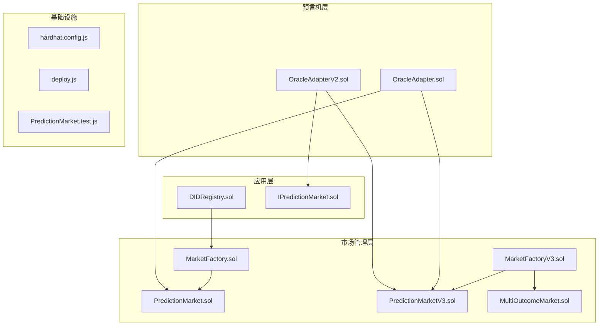
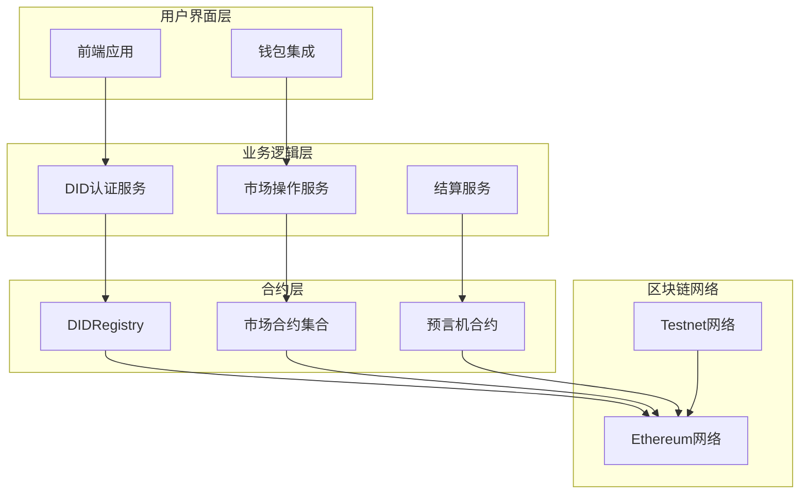
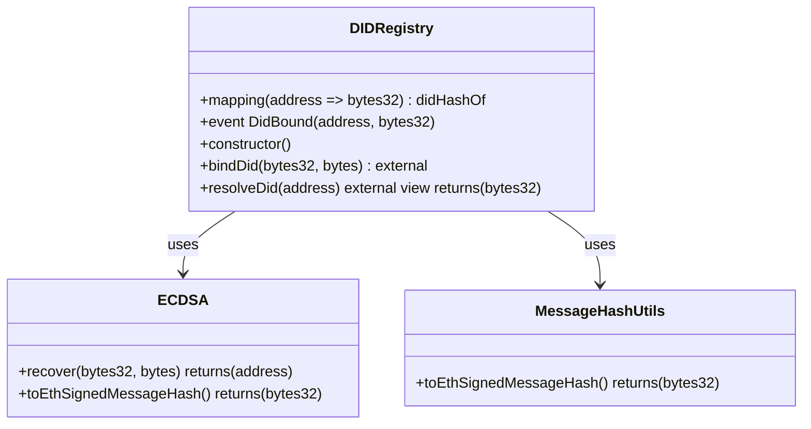
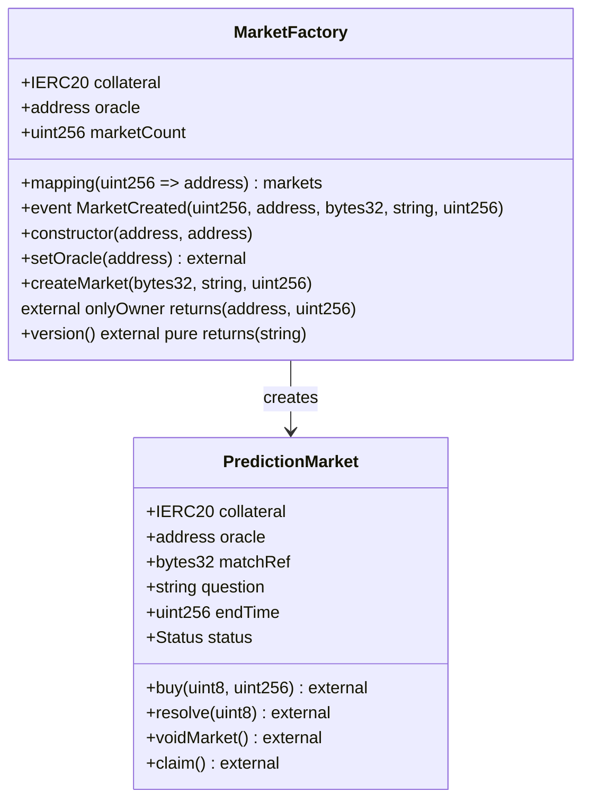
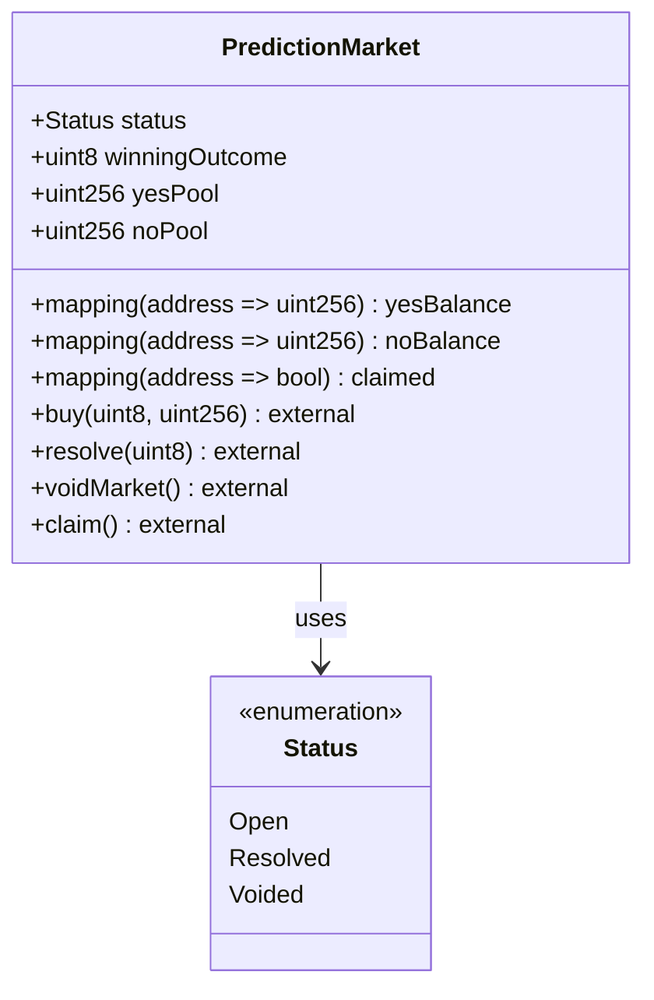
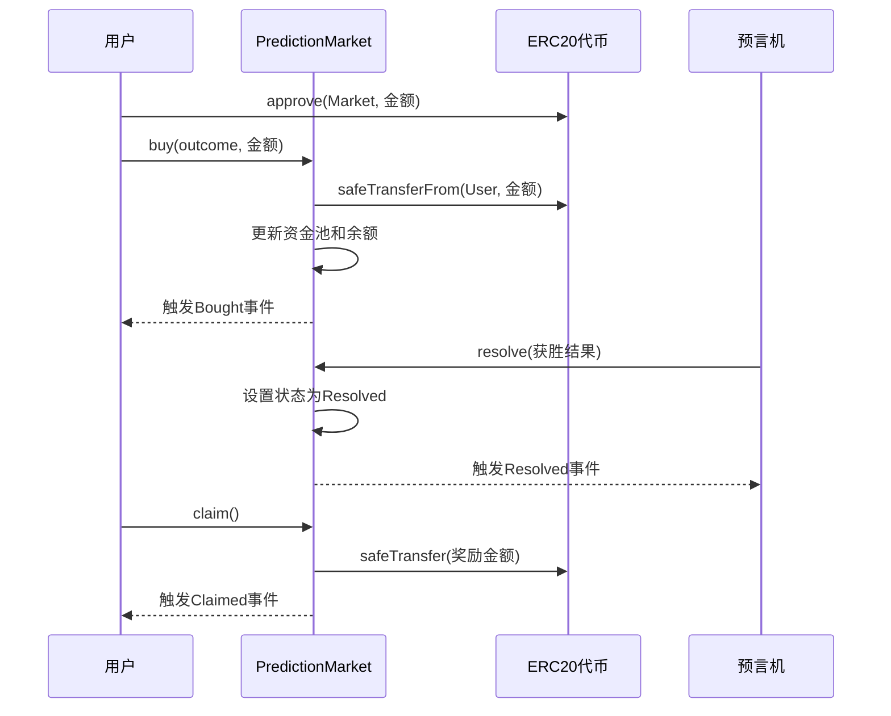
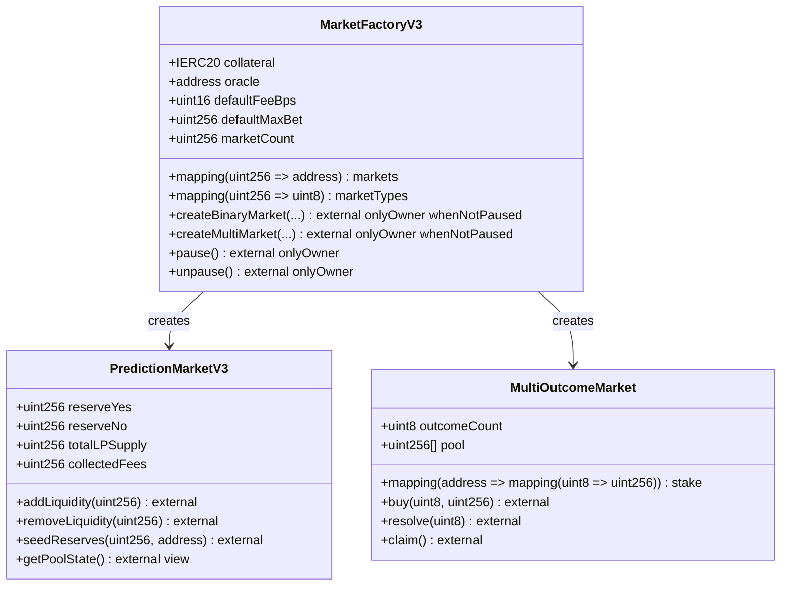
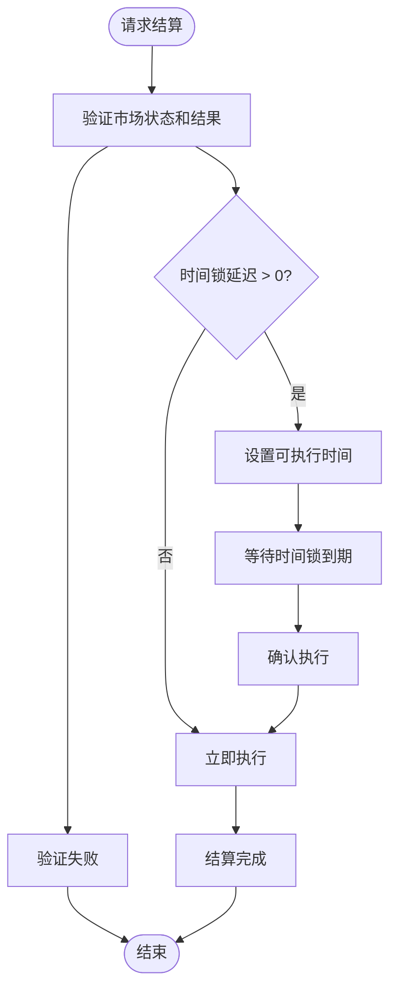
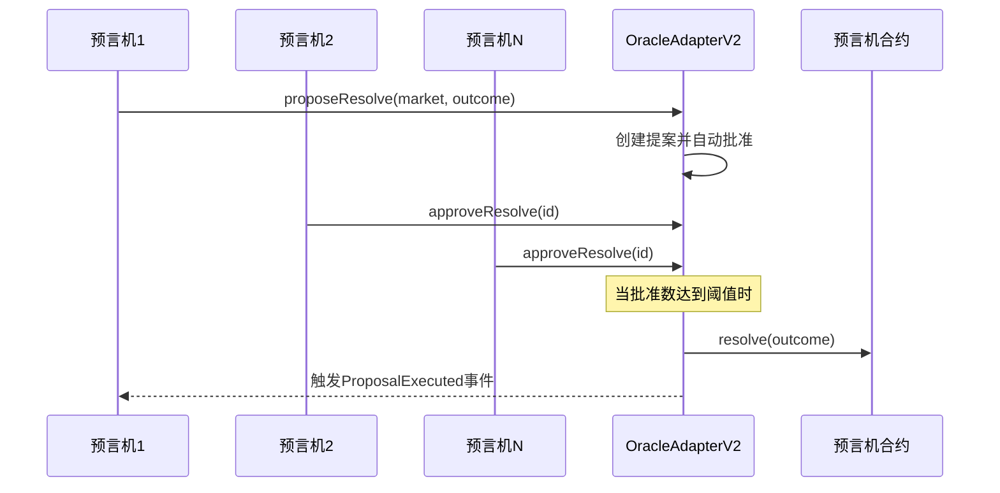

# API参考

<cite>
**本文档引用的文件**
- [DIDRegistry.sol](file://contracts/DIDRegistry.sol)
- [MarketFactory.sol](file://contracts/MarketFactory.sol)
- [PredictionMarket.sol](file://contracts/PredictionMarket.sol)
- [IPredictionMarket.sol](file://contracts/interfaces/IPredictionMarket.sol)
- [OracleAdapter.sol](file://contracts/OracleAdapter.sol)
- [MarketFactoryV3.sol](file://contracts/MarketFactoryV3.sol)
- [PredictionMarketV3.sol](file://contracts/PredictionMarketV3.sol)
- [MultiOutcomeMarket.sol](file://contracts/MultiOutcomeMarket.sol)
- [OracleAdapterV2.sol](file://contracts/OracleAdapterV2.sol)
- [PredictionMarket.test.js](file://test/PredictionMarket.test.js)
- [deploy.js](file://scripts/deploy.js)
- [hardhat.config.js](file://hardhat.config.js)
- [package.json](file://package.json)
</cite>

## 目录
1. [简介](#简介)
2. [项目结构](#项目结构)
3. [核心组件](#核心组件)
4. [架构概览](#架构概览)
5. [详细组件分析](#详细组件分析)
6. [依赖关系分析](#依赖关系分析)
7. [性能考虑](#性能考虑)
8. [故障排除指南](#故障排除指南)
9. [结论](#结论)
10. [附录](#附录)

## 简介
预测市场DID认证系统是一个基于以太坊的去中心化预测市场平台，集成了DID（去中心化身份）认证功能。该系统允许用户对各种事件进行预测投注，并通过智能合约确保交易的透明性和安全性。

系统采用多层架构设计，包括：
- **DID认证层**：提供去中心化身份绑定和验证功能
- **市场管理层**：负责预测市场的创建、管理和运营
- **预言机适配器层**：处理市场结算和作废流程
- **多版本兼容层**：支持不同版本的市场合约

## 项目结构
项目采用模块化设计，按功能层次组织代码：



**图表来源**
- [DIDRegistry.sol:1-39](file://contracts/DIDRegistry.sol#L1-L39)
- [MarketFactory.sol:1-68](file://contracts/MarketFactory.sol#L1-L68)
- [PredictionMarket.sol:1-145](file://contracts/PredictionMarket.sol#L1-L145)
- [OracleAdapter.sol:1-96](file://contracts/OracleAdapter.sol#L1-L96)

**章节来源**
- [hardhat.config.js:1-33](file://hardhat.config.js#L1-L33)
- [package.json:1-22](file://package.json#L1-L22)

## 核心组件
系统由以下核心组件构成：

### DID认证组件
- **DIDRegistry**：提供DID哈希绑定和解析功能
- 支持地址到DID的双向映射
- 基于ECDSA签名验证的身份认证

### 市场管理组件
- **MarketFactory**：二元预测市场的创建和管理
- **MarketFactoryV3**：支持CPMM模型和多结果市场的高级工厂
- **PredictionMarket**：基础二元预测市场
- **PredictionMarketV3**：CPMM模型的二元预测市场
- **MultiOutcomeMarket**：多结果预测市场

### 预言机适配器组件
- **OracleAdapter**：带时间锁的结算适配器
- **OracleAdapterV2**：多签授权的结算适配器

**章节来源**
- [DIDRegistry.sol:10-39](file://contracts/DIDRegistry.sol#L10-L39)
- [MarketFactory.sol:10-68](file://contracts/MarketFactory.sol#L10-L68)
- [PredictionMarketV3.sol:10-218](file://contracts/PredictionMarketV3.sol#L10-L218)

## 架构概览
系统采用分层架构，确保职责分离和模块化设计：



**图表来源**
- [DIDRegistry.sol:12-39](file://contracts/DIDRegistry.sol#L12-L39)
- [MarketFactoryV3.sol:14-104](file://contracts/MarketFactoryV3.sol#L14-L104)
- [OracleAdapterV2.sol:11-95](file://contracts/OracleAdapterV2.sol#L11-L95)

## 详细组件分析

### DIDRegistry 组件
DIDRegistry提供去中心化身份绑定功能，允许用户将DID哈希与以太坊地址关联。

#### 主要功能
- **bindDid**：绑定DID哈希到调用者地址
- **resolveDid**：解析地址对应的DID哈希
- **签名验证**：使用ECDSA验证用户身份

#### API规范


**图表来源**
- [DIDRegistry.sol:12-39](file://contracts/DIDRegistry.sol#L12-L39)

#### 使用示例
```javascript
// 绑定DID到地址
const didHash = ethers.utils.keccak256("did:example:123");
const signature = await signer.signMessage(
    `BindDID:${userAddress}:${didHash}`
);
await didRegistry.bindDid(didHash, signature);
```

**章节来源**
- [DIDRegistry.sol:22-37](file://contracts/DIDRegistry.sol#L22-L37)

### MarketFactory 组件
MarketFactory负责创建和管理二元预测市场。

#### 主要功能
- **createMarket**：部署新的预测市场合约
- **setOracle**：更新预言机地址
- **市场跟踪**：维护市场ID到地址的映射

#### API规范


**图表来源**
- [MarketFactory.sol:12-68](file://contracts/MarketFactory.sol#L12-L68)
- [PredictionMarket.sol:11-145](file://contracts/PredictionMarket.sol#L11-L145)

#### 错误处理
- **collateral地址验证**：确保抵押品地址不为零
- **oracle地址验证**：确保预言机地址不为零
- **时间戳验证**：确保截止时间在未来

**章节来源**
- [MarketFactory.sol:29-61](file://contracts/MarketFactory.sol#L29-L61)

### PredictionMarket 组件
基础二元预测市场合约，实现简单的互池式投注机制。

#### 核心数据结构


**图表来源**
- [PredictionMarket.sol:14-41](file://contracts/PredictionMarket.sol#L14-L41)

#### 投注流程


**图表来源**
- [PredictionMarket.sol:70-123](file://contracts/PredictionMarket.sol#L70-L123)

**章节来源**
- [PredictionMarket.sol:70-145](file://contracts/PredictionMarket.sol#L70-L145)

### MarketFactoryV3 组件
高级市场工厂，支持CPMM模型和多结果市场。

#### 新增功能
- **CPMM模型**：使用恒定乘积做市商模型
- **流动性池**：支持LP份额管理和收益分配
- **多结果市场**：支持2-8个结果的预测市场
- **暂停机制**：支持合约暂停和恢复

#### API规范


**图表来源**
- [MarketFactoryV3.sol:14-104](file://contracts/MarketFactoryV3.sol#L14-L104)
- [PredictionMarketV3.sol:12-218](file://contracts/PredictionMarketV3.sol#L12-L218)
- [MultiOutcomeMarket.sol:12-124](file://contracts/MultiOutcomeMarket.sol#L12-L124)

**章节来源**
- [MarketFactoryV3.sol:44-97](file://contracts/MarketFactoryV3.sol#L44-L97)

### OracleAdapter 组件
预言机适配器，提供市场结算和作废的授权机制。

#### 时间锁机制


**图表来源**
- [OracleAdapter.sol:57-87](file://contracts/OracleAdapter.sol#L57-L87)

#### 多签机制


**图表来源**
- [OracleAdapterV2.sol:51-86](file://contracts/OracleAdapterV2.sol#L51-L86)

**章节来源**
- [OracleAdapter.sol:57-94](file://contracts/OracleAdapter.sol#L57-L94)

## 依赖关系分析

### 合约依赖图

```mermaid
graph TB
subgraph "OpenZeppelin依赖"
Ownable["@openzeppelin/contracts/access/Ownable"]
AccessControl["@openzeppelin/contracts/access/AccessControl"]
SafeERC20["@openzeppelin/contracts/token/ERC20/utils/SafeERC20"]
ReentrancyGuard["@openzeppelin/contracts/utils/ReentrancyGuard"]
Pausable["@openzeppelin/contracts/utils/Pausable"]
end
subgraph "系统合约"
DIDRegistry[DIDRegistry.sol]
MarketFactory[MarketFactory.sol]
PredictionMarket[PredictionMarket.sol]
OracleAdapter[OracleAdapter.sol]
MarketFactoryV3[MarketFactoryV3.sol]
PredictionMarketV3[PredictionMarketV3.sol]
MultiOutcomeMarket[MultiOutcomeMarket.sol]
OracleAdapterV2[OracleAdapterV2.sol]
end
Ownable --> MarketFactory
Ownable --> MarketFactoryV3
Ownable --> DIDRegistry
AccessControl --> OracleAdapter
AccessControl --> OracleAdapterV2
SafeERC20 --> PredictionMarket
SafeERC20 --> PredictionMarketV3
SafeERC20 --> MultiOutcomeMarket
ReentrancyGuard --> PredictionMarketV3
ReentrancyGuard --> MultiOutcomeMarket
Pausable --> MarketFactoryV3
```


**图表来源**
- [MarketFactory.sol:6-8](file://contracts/MarketFactory.sol#L6-L8)
- [PredictionMarketV3.sol:6-8](file://contracts/PredictionMarketV3.sol#L6-L8)
- [OracleAdapterV2.sol:6-7](file://contracts/OracleAdapterV2.sol#L6-L7)

### 数据流分析
系统中的主要数据流包括：

1. **用户交互数据流**：用户操作 → 市场合约 → 预言机适配器 → 区块链
2. **结算数据流**：预言机 → 市场合约 → 用户奖励 → 代币转移
3. **DID认证数据流**：用户DID → 注册表验证 → 合约存储

**章节来源**
- [PredictionMarket.test.js:15-34](file://test/PredictionMarket.test.js#L15-L34)

## 性能考虑
系统在设计时充分考虑了性能优化：

### Gas优化策略
- **批量操作**：支持多个市场同时创建和管理
- **状态压缩**：使用紧凑的数据结构减少存储开销
- **循环优化**：避免不必要的循环和重复计算

### 安全考虑
- **重入攻击防护**：使用ReentrancyGuard保护关键函数
- **权限控制**：严格的onlyOwner和onlyOracle修饰符
- **输入验证**：全面的参数验证和边界检查

### 可扩展性
- **模块化设计**：独立的功能模块便于扩展
- **接口抽象**：通过IPredictionMarket接口实现多版本兼容
- **版本演进**：支持渐进式功能升级

## 故障排除指南

### 常见错误及解决方案

#### 预言机权限错误
**错误**：`"not oracle"`
**原因**：调用者没有预言机权限
**解决方案**：
```javascript
// 确保调用者具有预言机角色
await oracleAdapter.grantOracle(yourAddress);
```

#### 市场状态错误
**错误**：`"not open"` 或 `"ended"`
**原因**：市场不在可操作状态
**解决方案**：
```javascript
// 检查市场状态
const status = await market.status();
if (status === 0) {
    // 市场开放，可以进行操作
}
```

#### 金额验证错误
**错误**：`"zero amount"` 或 `"invalid outcome"`
**原因**：输入参数无效
**解决方案**：
```javascript
// 确保金额大于0且结果编号有效
if (amount > 0 && (outcome === 0 || outcome === 1)) {
    // 执行操作
}
```

#### DDoS攻击防护
**错误**：`"max bet"` 或 `"already claimed"`
**原因**：超出限制或重复操作
**解决方案**：
```javascript
// 检查用户限额和状态
const userBetTotal = await market.userBetTotal(userAddress);
if (userBetTotal < maxBetPerUser) {
    // 允许下注
}
```

**章节来源**
- [PredictionMarket.test.js:56-76](file://test/PredictionMarket.test.js#L56-L76)

### 调试工具
系统提供了多种调试和监控工具：

#### 部署脚本
```bash
# 本地部署
npm run deploy:local

# 运行测试
npm run test

# 生成覆盖率报告
npm run coverage
```

#### 配置选项
- **时间锁延迟**：通过环境变量`ORACLE_TIMELOCK_SECONDS`设置
- **优化器设置**：编译器优化运行次数为200次
- **EVM版本**：使用Cancun版本确保最新特性支持

**章节来源**
- [deploy.js:8-52](file://scripts/deploy.js#L8-L52)
- [hardhat.config.js:10-16](file://hardhat.config.js#L10-L16)

## 结论
预测市场DID认证系统提供了一个完整、安全、可扩展的去中心化预测市场解决方案。系统的主要优势包括：

1. **功能完整性**：涵盖DID认证、市场管理、预言机结算等核心功能
2. **安全性保障**：多重权限控制和攻击防护机制
3. **可扩展性**：支持多版本合约和渐进式功能升级
4. **开发友好**：完善的测试覆盖和部署工具

该系统为构建可信的预测市场生态奠定了坚实的技术基础，支持从简单二元预测到复杂多结果市场的多样化需求。

## 附录

### 版本兼容性
系统支持多版本合约并提供迁移路径：
- **v2.x**：基础版本，支持二元预测市场
- **v3.x**：高级版本，支持CPMM模型和多结果市场
- **DID集成**：提供去中心化身份认证功能

### 部署配置
```json
{
  "chainId": 31337,
  "mockUSDC": "0x...",
  "oracleAdapter": "0x...",
  "didRegistry": "0x...",
  "marketFactory": "0x...",
  "oracle": "0x...",
  "timelockSeconds": 120,
  "deployedAt": "2024-01-01T00:00:00Z"
}
```

### 开发资源
- **测试框架**：Mocha + Chai + Hardhat
- **覆盖率工具**：Solidity-coverage
- **部署工具**：Hardhat脚本和配置