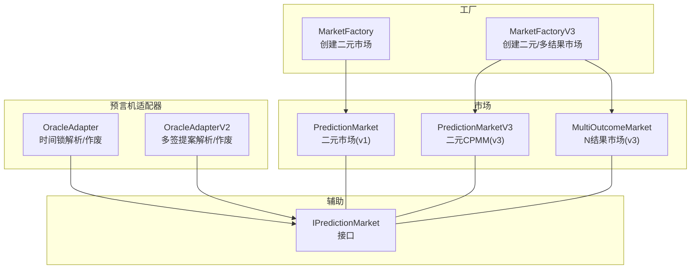
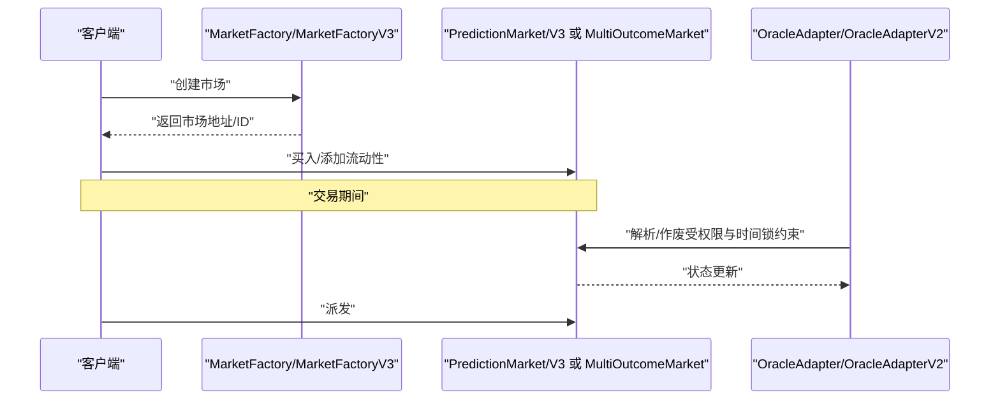
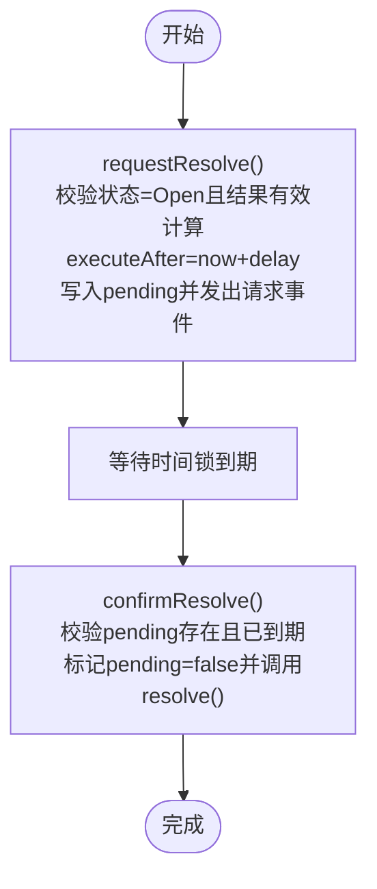
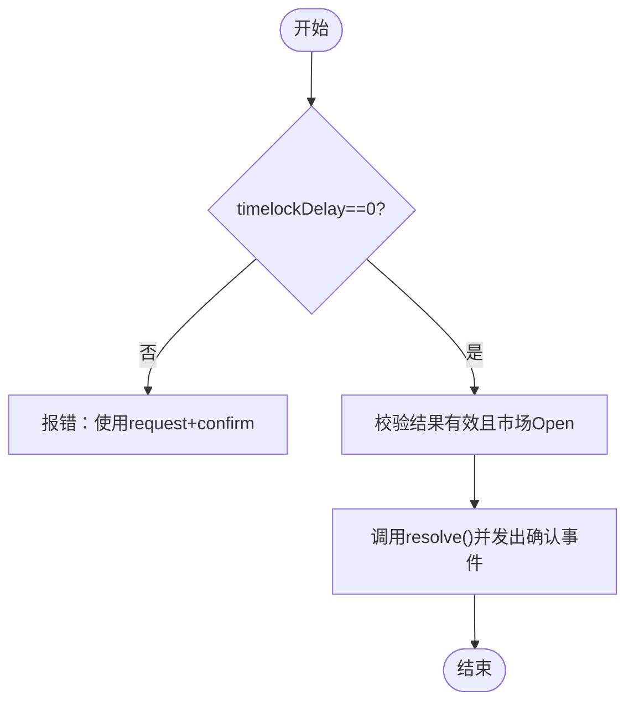
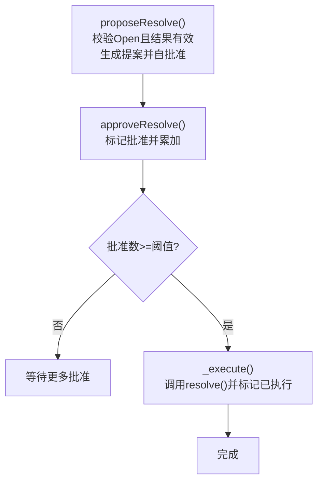
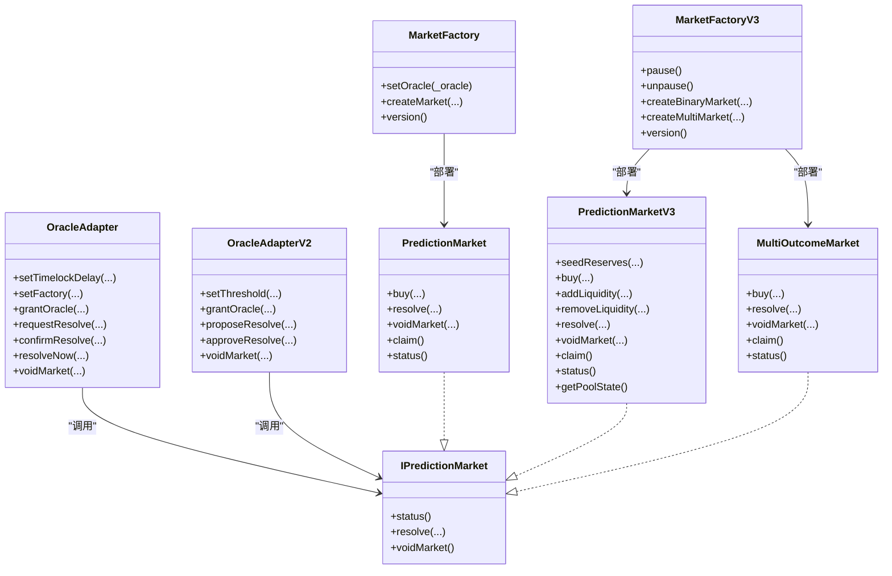

# API参考

<cite>
**本文引用的文件**
- [IPredictionMarket.sol](file://contracts/contracts/interfaces/IPredictionMarket.sol)
- [MarketFactory.sol](file://contracts/contracts/MarketFactory.sol)
- [MarketFactoryV3.sol](file://contracts/contracts/MarketFactoryV3.sol)
- [OracleAdapter.sol](file://contracts/contracts/OracleAdapter.sol)
- [OracleAdapterV2.sol](file://contracts/contracts/OracleAdapterV2.sol)
- [PredictionMarket.sol](file://contracts/contracts/PredictionMarket.sol)
- [PredictionMarketV3.sol](file://contracts/contracts/PredictionMarketV3.sol)
- [MultiOutcomeMarket.sol](file://contracts/contracts/MultiOutcomeMarket.sol)
- [MarketFactory.test.js](file://contracts/test/MarketFactory.test.js)
- [OracleAdapter.test.js](file://contracts/test/OracleAdapter.test.js)
- [deploy.js](file://contracts/scripts/deploy.js)
- [seed-markets.js](file://contracts/scripts/seed-markets.js)
- [resolve.js](file://contracts/scripts/resolve.js)
- [package.json](file://contracts/package.json)
- [hardhat.config.js](file://contracts/hardhat.config.js)
</cite>

## 目录
1. [简介](#简介)
2. [项目结构](#项目结构)
3. [核心组件](#核心组件)
4. [架构总览](#架构总览)
5. [详细组件分析](#详细组件分析)
6. [依赖关系分析](#依赖关系分析)
7. [性能与优化建议](#性能与优化建议)
8. [故障排查指南](#故障排查指南)
9. [结论](#结论)
10. [附录：API清单与示例](#附录api清单与示例)

## 简介
本文件为 PredictionDIDSimple 合约系统的完整 API 参考，覆盖以下内容：
- IPredictionMarket 接口的函数规范与状态语义
- MarketFactory 的市场创建 API（v2）与 MarketFactoryV3 的二元与多结果市场创建 API（v3）
- OracleAdapter 的预言机操作 API（含时间锁与即时执行）
- OracleAdapterV2 的多签提案式解析 API
- 每个 API 的参数、返回值、事件与错误条件
- 使用示例与最佳实践
- 版本兼容性与变更历史
- SDK 集成与客户端实现指导

## 项目结构
系统采用“工厂 + 市场 + 预言机适配器”的分层架构：
- 工厂负责部署与管理市场合约
- 市场合约负责交易、结算与派发
- 预言机适配器负责对市场的解析/作废进行权限控制与时间锁

图表来源
- [MarketFactory.sol](file://contracts/contracts/MarketFactory.sol#L8-L60)
- [MarketFactoryV3.sol](file://contracts/contracts/MarketFactoryV3.sol#L10-L94)
- [PredictionMarket.sol](file://contracts/contracts/PredictionMarket.sol#L7-L134)
- [PredictionMarketV3.sol](file://contracts/contracts/PredictionMarketV3.sol#L8-L200)
- [MultiOutcomeMarket.sol](file://contracts/contracts/MultiOutcomeMarket.sol#L8-L113)
- [OracleAdapter.sol](file://contracts/contracts/OracleAdapter.sol#L7-L83)
- [OracleAdapterV2.sol](file://contracts/contracts/OracleAdapterV2.sol#L7-L83)
- [IPredictionMarket.sol](file://contracts/contracts/interfaces/IPredictionMarket.sol#L4-L8)

章节来源
- [MarketFactory.sol](file://contracts/contracts/MarketFactory.sol#L8-L60)
- [MarketFactoryV3.sol](file://contracts/contracts/MarketFactoryV3.sol#L10-L94)
- [OracleAdapter.sol](file://contracts/contracts/OracleAdapter.sol#L7-L83)
- [OracleAdapterV2.sol](file://contracts/contracts/OracleAdapterV2.sol#L7-L83)
- [PredictionMarket.sol](file://contracts/contracts/PredictionMarket.sol#L7-L134)
- [PredictionMarketV3.sol](file://contracts/contracts/PredictionMarketV3.sol#L8-L200)
- [MultiOutcomeMarket.sol](file://contracts/contracts/MultiOutcomeMarket.sol#L8-L113)
- [IPredictionMarket.sol](file://contracts/contracts/interfaces/IPredictionMarket.sol#L4-L8)

## 核心组件
- IPredictionMarket 接口：定义市场状态查询、解析与作废三个外部函数，作为预言机适配器调用的目标接口。
- MarketFactory：仅所有者可调用，创建二元 Yes/No 市场，并记录市场映射与计数。
- MarketFactoryV3：支持暂停、默认费用、最大投注等配置；创建二元 CPMM 市场或 N 结果市场。
- OracleAdapter：基于角色控制的解析/作废；支持时间锁请求与确认，或直接即时解析（当时间锁为0）。
- OracleAdapterV2：多签提案式解析，达到阈值后自动执行；同样支持作废。
- PredictionMarket / V3 / MultiOutcomeMarket：实现具体的交易、结算、派发逻辑。

章节来源
- [IPredictionMarket.sol](file://contracts/contracts/interfaces/IPredictionMarket.sol#L4-L8)
- [MarketFactory.sol](file://contracts/contracts/MarketFactory.sol#L8-L60)
- [MarketFactoryV3.sol](file://contracts/contracts/MarketFactoryV3.sol#L10-L94)
- [OracleAdapter.sol](file://contracts/contracts/OracleAdapter.sol#L7-L83)
- [OracleAdapterV2.sol](file://contracts/contracts/OracleAdapterV2.sol#L7-L83)
- [PredictionMarket.sol](file://contracts/contracts/PredictionMarket.sol#L7-L134)
- [PredictionMarketV3.sol](file://contracts/contracts/PredictionMarketV3.sol#L8-L200)
- [MultiOutcomeMarket.sol](file://contracts/contracts/MultiOutcomeMarket.sol#L8-L113)

## 架构总览
下图展示从客户端到工厂、再到市场的典型调用链路，以及预言机通过适配器对市场进行解析/作废的流程。

图表来源
- [MarketFactory.sol](file://contracts/contracts/MarketFactory.sol#L37-L54)
- [MarketFactoryV3.sol](file://contracts/contracts/MarketFactoryV3.sol#L37-L88)
- [PredictionMarket.sol](file://contracts/contracts/PredictionMarket.sol#L64-L113)
- [PredictionMarketV3.sol](file://contracts/contracts/PredictionMarketV3.sol#L92-L165)
- [MultiOutcomeMarket.sol](file://contracts/contracts/MultiOutcomeMarket.sol#L65-L111)
- [OracleAdapter.sol](file://contracts/contracts/OracleAdapter.sol#L48-L81)
- [OracleAdapterV2.sol](file://contracts/contracts/OracleAdapterV2.sol#L44-L81)

## 详细组件分析

### IPredictionMarket 接口规范
- 函数
  - status(): 外部视图函数，返回当前市场状态（0=Open, 1=Resolved, 2=Voided）
  - resolve(winningOutcome: uint8): 外部函数，由预言机调用以设置获胜结果
  - voidMarket(): 外部函数，由预言机调用以作废市场
- 错误与前置条件
  - resolve/voidMarket 通常要求市场处于 Open 状态
  - resolve 的 winningOutcome 必须在有效范围内（二元为 0/1）

章节来源
- [IPredictionMarket.sol](file://contracts/contracts/interfaces/IPredictionMarket.sol#L4-L8)
- [PredictionMarket.sol](file://contracts/contracts/PredictionMarket.sol#L83-L95)
- [PredictionMarketV3.sol](file://contracts/contracts/PredictionMarketV3.sol#L137-L149)
- [MultiOutcomeMarket.sol](file://contracts/contracts/MultiOutcomeMarket.sol#L76-L87)

### MarketFactory（v2）——二元市场创建 API
- 关键字段
  - collateral: 保证金代币地址（不可变）
  - oracle: 预言机适配器地址
  - marketCount: 市场计数
  - markets[marketId]: 市场 ID 到地址映射
- 事件
  - MarketCreated(marketId, market, matchRef, question, endTime)
- 公共函数
  - setOracle(_oracle: address) -> 仅所有者
  - createMarket(matchRef: bytes32, question: string memory, endTime: uint256) -> (address, uint256)
  - version() -> 返回字符串版本号
- 参数说明
  - matchRef: 赛事/问题标识符（bytes32）
  - question: 市场问题文本
  - endTime: 市场结束时间戳（必须大于当前区块时间）
- 返回值
  - createMarket 返回新市场地址与自增 ID
- 错误条件
  - 初始化时 collateral/oracle 不能为零地址
  - endTime 必须晚于当前区块时间
  - setOracle 传入零地址会失败
- 使用示例（路径）
  - [测试用例：创建市场并断言事件与属性](file://contracts/test/MarketFactory.test.js#L6-L26)
  - [部署脚本：部署工厂并授予适配器权限](file://contracts/scripts/deploy.js#L25-L28)

章节来源
- [MarketFactory.sol](file://contracts/contracts/MarketFactory.sol#L8-L60)
- [MarketFactory.test.js](file://contracts/test/MarketFactory.test.js#L6-L26)
- [deploy.js](file://contracts/scripts/deploy.js#L25-L28)

### MarketFactoryV3（v3）——二元与多结果市场创建 API
- 关键字段
  - collateral: 保证金代币地址（不可变）
  - oracle: 预言机地址
  - defaultFeeBps: 默认手续费（基点）
  - defaultMaxBet: 默认单用户最大投注
  - marketCount: 市场计数
  - markets[marketId] → marketTypes[marketId]（0=二元v3, 1=多结果）
- 事件
  - BinaryMarketCreated(id, market, matchRef, question)
  - MultiMarketCreated(id, market, outcomeCount, question)
- 公共函数
  - pause()/unpause() -> 仅所有者，配合 Pausable
  - setOracle(_oracle: address) -> 仅所有者
  - setDefaultFeeBps(bps: uint16) -> 仅所有者
  - createBinaryMarket(matchRef, question, endTime, initialLiquidity) -> (address, uint256)
  - createMultiMarket(matchRef, question, endTime, outcomeCount: uint8) -> (address, uint256)
  - version() -> 返回字符串版本号
- 参数说明
  - initialLiquidity: 初始流动性（每边相等），用于种子化 CPMM
  - outcomeCount: 多结果市场结果数量（2-8）
- 返回值
  - 返回新市场地址与自增 ID，并登记市场类型
- 错误条件
  - 创建多结果市场时 outcomeCount 必须在 [2,8]
  - 暂停状态下无法创建新市场
- 使用示例（路径）
  - [播种脚本：批量创建市场](file://contracts/scripts/seed-markets.js#L15-L27)

章节来源
- [MarketFactoryV3.sol](file://contracts/contracts/MarketFactoryV3.sol#L10-L94)
- [seed-markets.js](file://contracts/scripts/seed-markets.js#L15-L27)

### OracleAdapter（v2）——时间锁解析与作废 API
- 角色与权限
  - DEFAULT_ADMIN_ROLE：可设置时间锁、工厂、授权 Oracle
  - ORACLE_ROLE：可发起解析请求、确认解析、立即解析、作废市场
- 关键状态
  - timelockDelay: 时间锁延迟（秒）
  - factory: 工厂地址
  - pending[market]: 待执行解析的计划（结果、执行时间、是否激活）
- 公共函数
  - setTimelockDelay(delay: uint256) -> 仅管理员
  - setFactory(_factory: address) -> 仅管理员
  - grantOracle(account: address) -> 仅管理员
  - requestResolve(market: address, outcome: uint8) -> 仅 Oracle
  - confirmResolve(market: address) -> 仅 Oracle（需到达执行时间）
  - resolveNow(market: address, outcome: uint8) -> 仅 Oracle（当 timelockDelay==0）
  - voidMarket(market: address) -> 仅 Oracle
- 行为流程（时间锁）

图表来源
- [OracleAdapter.sol](file://contracts/contracts/OracleAdapter.sol#L48-L67)

- 行为流程（即时解析）

图表来源
- [OracleAdapter.sol](file://contracts/contracts/OracleAdapter.sol#L69-L75)

- 使用示例（路径）
  - [测试用例：时间锁解析与作废退款](file://contracts/test/OracleAdapter.test.js#L6-L25)
  - [测试用例：作废后派发原投注金额](file://contracts/test/OracleAdapter.test.js#L27-L48)

章节来源
- [OracleAdapter.sol](file://contracts/contracts/OracleAdapter.sol#L7-L83)
- [OracleAdapter.test.js](file://contracts/test/OracleAdapter.test.js#L6-L25)
- [OracleAdapter.test.js](file://contracts/test/OracleAdapter.test.js#L27-L48)

### OracleAdapterV2（v2）——多签提案解析 API
- 角色与权限
  - DEFAULT_ADMIN_ROLE：可设置阈值、授权 Oracle
  - ORACLE_ROLE：可提交提案、批准提案、作废市场
- 关键状态
  - threshold: 解析所需批准数
  - proposalCount: 提案计数
  - proposals[id]：提案（市场、结果、批准数、是否已执行）
  - approved[id][account]：账户对提案的批准状态
- 公共函数
  - setThreshold(t: uint256) -> 仅管理员
  - grantOracle(account: address) -> 仅管理员
  - proposeResolve(market: address, outcome: uint8) -> 仅 Oracle（返回提案ID）
  - approveResolve(id: uint256) -> 仅 Oracle（达到阈值后自动执行）
  - voidMarket(market: address) -> 仅 Oracle
- 行为流程（多签）

图表来源
- [OracleAdapterV2.sol](file://contracts/contracts/OracleAdapterV2.sol#L44-L75)

- 使用示例（路径）
  - [部署脚本：部署适配器并授权 Oracle](file://contracts/scripts/deploy.js#L15-L17)
  - [测试用例：多签提案解析](file://contracts/test/OracleAdapter.test.js#L6-L25)

章节来源
- [OracleAdapterV2.sol](file://contracts/contracts/OracleAdapterV2.sol#L7-L83)
- [deploy.js](file://contracts/scripts/deploy.js#L15-L17)
- [OracleAdapter.test.js](file://contracts/test/OracleAdapter.test.js#L6-L25)

### PredictionMarket（v1）——二元市场 API
- 状态枚举：Open、Resolved、Voided
- 关键字段：collateral、oracle、factory、matchRef、question、endTime、status、winningOutcome、两池余额与用户余额映射
- 公共函数
  - buy(outcome: uint8, amount: uint256) -> 投注
  - resolve(_winningOutcome: uint8) -> 仅 Oracle
  - voidMarket() -> 仅 Oracle
  - claim() -> 派发（Resolved按池比例，Voided退回本金）
- 状态查询
  - status() -> 返回枚举对应的 uint8
- 使用示例（路径）
  - [测试用例：作废后派发](file://contracts/test/OracleAdapter.test.js#L27-L48)

章节来源
- [PredictionMarket.sol](file://contracts/contracts/PredictionMarket.sol#L7-L134)
- [OracleAdapter.test.js](file://contracts/test/OracleAdapter.test.js#L27-L48)

### PredictionMarketV3（v3）——二元 CPMM 市场 API
- 新增功能：手续费、最大投注、流动性池、LP 池份额、种子流动性
- 关键字段：feeBps、maxBetPerUser、reserveYes/reserveNo、totalLPSupply、lpBalance、userBetTotal
- 公共函数
  - seedReserves(perSide: uint256, lpRecipient: address) -> 仅工厂
  - buy(outcome: uint8, amountIn: uint256) -> 投注（扣除手续费，按恒定乘积公式换算份额）
  - addLiquidity(amount: uint256) -> 添加流动性（按 50/50 分配至两池）
  - removeLiquidity(lpAmount: uint256) -> 移除流动性
  - resolve/_winningOutcome: uint8 -> 仅 Oracle
  - voidMarket() -> 仅 Oracle
  - claim() -> 派发（Resolved按池比例，Voided退回本金）
  - status() -> 返回枚举对应的 uint8
  - getPoolState() -> 查询两池储备与胜率（千分之几）
- 使用示例（路径）
  - [部署脚本：创建带初始流动性二元市场](file://contracts/scripts/deploy.js#L43-L60)

章节来源
- [PredictionMarketV3.sol](file://contracts/contracts/PredictionMarketV3.sol#L8-L200)
- [deploy.js](file://contracts/scripts/deploy.js#L43-L60)

### MultiOutcomeMarket（v3）——N 结果市场 API
- 支持 2-8 个结果
- 关键字段：pool[]、stake[][]、winningOutcome
- 公共函数
  - buy(outcome: uint8, amount: uint256) -> 投注
  - resolve(_outcome: uint8) -> 仅 Oracle
  - voidMarket() -> 仅 Oracle
  - claim() -> 派发（Resolved按对应池比例，Voided退回本金）
  - status() -> 返回枚举对应的 uint8
- 使用示例（路径）
  - [播种脚本：创建多结果市场](file://contracts/scripts/seed-markets.js#L68-L88)

章节来源
- [MultiOutcomeMarket.sol](file://contracts/contracts/MultiOutcomeMarket.sol#L8-L113)
- [seed-markets.js](file://contracts/scripts/seed-markets.js#L68-L88)

## 依赖关系分析
- 继承与混入
  - MarketFactory/MarketFactoryV3 继承 Ownable
  - OracleAdapter/OracleAdapterV2 继承 AccessControl
  - PredictionMarketV3/MultiOutcomeMarket 继承 ReentrancyGuard
- 外部依赖
  - IERC20、SafeERC20、Pausable、ReentrancyGuard 来自 OpenZeppelin
- 内部依赖
  - OracleAdapter/OracleAdapterV2 通过 IPredictionMarket 调用市场合约
  - MarketFactoryV3 在创建市场后登记市场类型

图表来源
- [MarketFactory.sol](file://contracts/contracts/MarketFactory.sol#L8-L60)
- [MarketFactoryV3.sol](file://contracts/contracts/MarketFactoryV3.sol#L10-L94)
- [OracleAdapter.sol](file://contracts/contracts/OracleAdapter.sol#L7-L83)
- [OracleAdapterV2.sol](file://contracts/contracts/OracleAdapterV2.sol#L7-L83)
- [PredictionMarket.sol](file://contracts/contracts/PredictionMarket.sol#L7-L134)
- [PredictionMarketV3.sol](file://contracts/contracts/PredictionMarketV3.sol#L8-L200)
- [MultiOutcomeMarket.sol](file://contracts/contracts/MultiOutcomeMarket.sol#L8-L113)
- [IPredictionMarket.sol](file://contracts/contracts/interfaces/IPredictionMarket.sol#L4-L8)

章节来源
- [MarketFactory.sol](file://contracts/contracts/MarketFactory.sol#L8-L60)
- [MarketFactoryV3.sol](file://contracts/contracts/MarketFactoryV3.sol#L10-L94)
- [OracleAdapter.sol](file://contracts/contracts/OracleAdapter.sol#L7-L83)
- [OracleAdapterV2.sol](file://contracts/contracts/OracleAdapterV2.sol#L7-L83)
- [PredictionMarket.sol](file://contracts/contracts/PredictionMarket.sol#L7-L134)
- [PredictionMarketV3.sol](file://contracts/contracts/PredictionMarketV3.sol#L8-L200)
- [MultiOutcomeMarket.sol](file://contracts/contracts/MultiOutcomeMarket.sol#L8-L113)
- [IPredictionMarket.sol](file://contracts/contracts/interfaces/IPredictionMarket.sol#L4-L8)

## 性能与优化建议
- 交易路径
  - v3 CPMM 交易采用恒定乘积公式，gas 与 slippage 成正比；建议批量聚合小额订单
  - 流动性添加/移除按 50/50 分配，注意极端价格偏移导致的资产稀释
- 风险与安全
  - ReentrancyGuard 已启用，避免重入攻击
  - 手续费与最大投注限制有助于控制风险敞口
- 区块参数
  - EVM 版本为 Cancun，优化器 runs=200，适合生产部署

章节来源
- [hardhat.config.js](file://contracts/hardhat.config.js#L7-L13)
- [PredictionMarketV3.sol](file://contracts/contracts/PredictionMarketV3.sol#L92-L135)

## 故障排查指南
- 常见错误与定位
  - “not open”：市场状态非 Open（已结束/已解析/已作废）
  - “timelock”：未到时间锁到期时间
  - “invalid outcome”：结果值超出范围（二元为 0/1，多结果上限不同）
  - “zero addr/end in past”：初始化参数非法
  - “not claimable/nothing to claim”：市场尚未可派发或无可派发金额
- 定位方法
  - 通过 IPredictionMarket.status() 查询当前状态
  - 对照各合约 require 前置条件逐项检查
  - 使用测试脚本复现问题场景（如时间锁、作废退款）

章节来源
- [OracleAdapter.sol](file://contracts/contracts/OracleAdapter.sol#L48-L81)
- [OracleAdapterV2.sol](file://contracts/contracts/OracleAdapterV2.sol#L44-L81)
- [PredictionMarket.sol](file://contracts/contracts/PredictionMarket.sol#L64-L113)
- [PredictionMarketV3.sol](file://contracts/contracts/PredictionMarketV3.sol#L92-L165)
- [MultiOutcomeMarket.sol](file://contracts/contracts/MultiOutcomeMarket.sol#L65-L111)

## 结论
本系统通过清晰的分层与严格的权限控制，提供了从市场创建、交易、结算到作废的完整链上预测市场能力。v3 版本引入手续费、流动性与多结果支持，进一步提升可用性与扩展性。建议在生产中结合时间锁与多签机制，确保解析过程的安全可控。

## 附录：API清单与示例

### IPredictionMarket 接口
- status(): 返回 uint8（0=Open, 1=Resolved, 2=Voided）
- resolve(winningOutcome: uint8): 设置获胜结果
- voidMarket(): 将市场作废

章节来源
- [IPredictionMarket.sol](file://contracts/contracts/interfaces/IPredictionMarket.sol#L4-L8)

### MarketFactory（v2）
- setOracle(_oracle: address)
- createMarket(matchRef: bytes32, question: string memory, endTime: uint256): (address, uint256)
- version(): string

章节来源
- [MarketFactory.sol](file://contracts/contracts/MarketFactory.sol#L32-L58)

### MarketFactoryV3（v3）
- pause()/unpause()
- setOracle(_oracle: address)
- setDefaultFeeBps(bps: uint16)
- createBinaryMarket(matchRef: bytes32, question: string memory, endTime: uint256, initialLiquidity: uint256): (address, uint256)
- createMultiMarket(matchRef: bytes32, question: string memory, endTime: uint256, outcomeCount: uint8): (address, uint256)
- version(): string

章节来源
- [MarketFactoryV3.sol](file://contracts/contracts/MarketFactoryV3.sol#L31-L92)

### OracleAdapter（v2）
- setTimelockDelay(delay: uint256)
- setFactory(_factory: address)
- grantOracle(account: address)
- requestResolve(market: address, outcome: uint8)
- confirmResolve(market: address)
- resolveNow(market: address, outcome: uint8)
- voidMarket(market: address)

章节来源
- [OracleAdapter.sol](file://contracts/contracts/OracleAdapter.sol#L36-L81)

### OracleAdapterV2（v2）
- setThreshold(t: uint256)
- grantOracle(account: address)
- proposeResolve(market: address, outcome: uint8): uint256
- approveResolve(id: uint256)
- voidMarket(market: address)

章节来源
- [OracleAdapterV2.sol](file://contracts/contracts/OracleAdapterV2.sol#L35-L81)

### PredictionMarket（v1）
- buy(outcome: uint8, amount: uint256)
- resolve(_winningOutcome: uint8)
- voidMarket()
- claim()
- status(): uint8

章节来源
- [PredictionMarket.sol](file://contracts/contracts/PredictionMarket.sol#L64-L113)

### PredictionMarketV3（v3）
- seedReserves(perSide: uint256, lpRecipient: address)
- buy(outcome: uint8, amountIn: uint256)
- addLiquidity(amount: uint256)
- removeLiquidity(lpAmount: uint256)
- resolve(_winningOutcome: uint8)
- voidMarket()
- claim()
- status(): uint8
- getPoolState(): (yesR, noR, priceYesBps)

章节来源
- [PredictionMarketV3.sol](file://contracts/contracts/PredictionMarketV3.sol#L76-L176)

### MultiOutcomeMarket（v3）
- buy(outcome: uint8, amount: uint256)
- resolve(_outcome: uint8)
- voidMarket()
- claim()
- status(): uint8

章节来源
- [MultiOutcomeMarket.sol](file://contracts/contracts/MultiOutcomeMarket.sol#L65-L111)

### 使用示例与最佳实践
- 部署与初始化
  - 部署 MockUSDC、OracleAdapter、DIDRegistry、MarketFactory
  - 授权 Oracle 账户并设置工厂地址
  - 参考：[部署脚本](file://contracts/scripts/deploy.js#L15-L31)
- 创建市场
  - 二元市场：[MarketFactory.createMarket](file://contracts/contracts/MarketFactory.sol#L37-L54)
  - 二元 CPMM 市场：[MarketFactoryV3.createBinaryMarket](file://contracts/contracts/MarketFactoryV3.sol#L37-L66)
  - 多结果市场：[MarketFactoryV3.createMultiMarket](file://contracts/contracts/MarketFactoryV3.sol#L68-L88)
- 交易与结算
  - 二元市场买入：[PredictionMarket.buy](file://contracts/contracts/PredictionMarket.sol#L64-L81)
  - v3 市场买入/流动性：[PredictionMarketV3.buy/addLiquidity](file://contracts/contracts/PredictionMarketV3.sol#L92-L135)
  - 多结果市场买入：[MultiOutcomeMarket.buy](file://contracts/contracts/MultiOutcomeMarket.sol#L65-L74)
- 解析与作废
  - 时间锁解析：[OracleAdapter.requestResolve/confirmResolve](file://contracts/contracts/OracleAdapter.sol#L48-L67)
  - 即时解析：[OracleAdapter.resolveNow](file://contracts/contracts/OracleAdapter.sol#L69-L75)
  - 多签解析：[OracleAdapterV2.proposeResolve/approveResolve](file://contracts/contracts/OracleAdapterV2.sol#L44-L75)
  - 作废：[OracleAdapter.voidMarket / OracleAdapterV2.voidMarket](file://contracts/contracts/OracleAdapter.sol#L77-L81)
- 派发
  - [PredictionMarket.claim](file://contracts/contracts/PredictionMarket.sol#L97-L113)
  - [PredictionMarketV3.claim](file://contracts/contracts/PredictionMarketV3.sol#L151-L165)
  - [MultiOutcomeMarket.claim](file://contracts/contracts/MultiOutcomeMarket.sol#L89-L111)

章节来源
- [deploy.js](file://contracts/scripts/deploy.js#L15-L31)
- [seed-markets.js](file://contracts/scripts/seed-markets.js#L15-L27)
- [MarketFactory.sol](file://contracts/contracts/MarketFactory.sol#L37-L54)
- [MarketFactoryV3.sol](file://contracts/contracts/MarketFactoryV3.sol#L37-L88)
- [PredictionMarket.sol](file://contracts/contracts/PredictionMarket.sol#L64-L113)
- [PredictionMarketV3.sol](file://contracts/contracts/PredictionMarketV3.sol#L92-L165)
- [MultiOutcomeMarket.sol](file://contracts/contracts/MultiOutcomeMarket.sol#L65-L111)
- [OracleAdapter.sol](file://contracts/contracts/OracleAdapter.sol#L48-L81)
- [OracleAdapterV2.sol](file://contracts/contracts/OracleAdapterV2.sol#L44-L81)

### 版本兼容性与变更历史
- MarketFactory.version(): 返回 "2.0.0-phase2"
- MarketFactoryV3.version(): 返回 "3.0.0-phase3"
- 主要变更
  - v3 引入手续费、最大投注、流动性池与 CPMM 机制
  - 市场类型区分：二元 v3 与多结果市场
  - 预言机适配器演进：从时间锁到多签提案

章节来源
- [MarketFactory.sol](file://contracts/contracts/MarketFactory.sol#L56-L58)
- [MarketFactoryV3.sol](file://contracts/contracts/MarketFactoryV3.sol#L90-L92)

### SDK 集成与客户端实现指导
- 部署与配置
  - 读取部署输出（包含合约地址、链 ID、时间锁等）
  - 参考：[部署脚本输出](file://contracts/scripts/deploy.js#L36-L49)
- 市场生命周期
  - 创建 → 交易 → 解析/作废 → 派发
  - 参考：[播种脚本批量创建](file://contracts/scripts/seed-markets.js#L15-L27)
- 预言机操作
  - 时间锁：先 requestResolve，再 confirmResolve
  - 多签：proposeResolve，收集足够批准后自动执行
  - 参考：[OracleAdapter 测试](file://contracts/test/OracleAdapter.test.js#L6-L25)
- 解析脚本
  - 通过环境变量指定市场地址与结果
  - 参考：[解析脚本](file://contracts/scripts/resolve.js#L4-L11)

章节来源
- [deploy.js](file://contracts/scripts/deploy.js#L36-L49)
- [seed-markets.js](file://contracts/scripts/seed-markets.js#L15-L27)
- [OracleAdapter.test.js](file://contracts/test/OracleAdapter.test.js#L6-L25)
- [resolve.js](file://contracts/scripts/resolve.js#L4-L11)