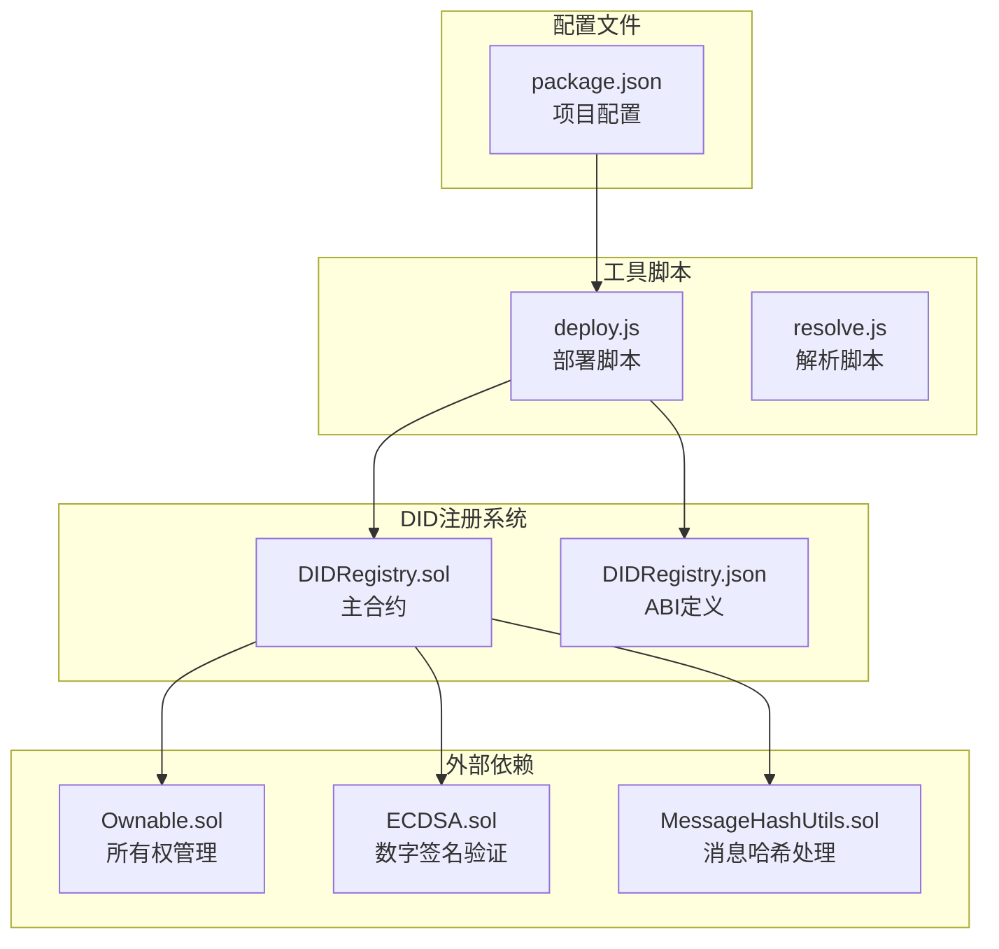
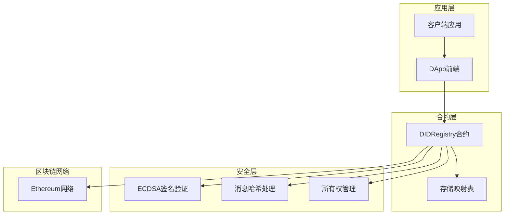
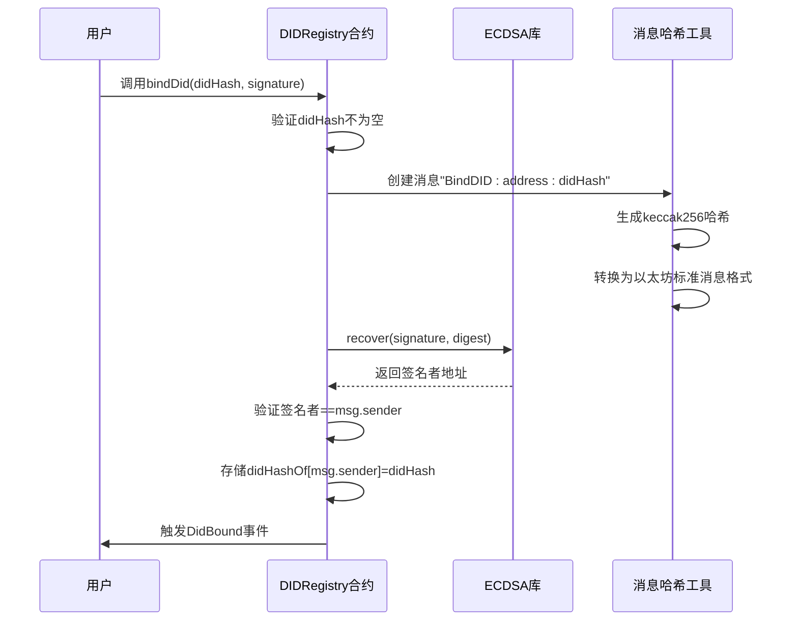
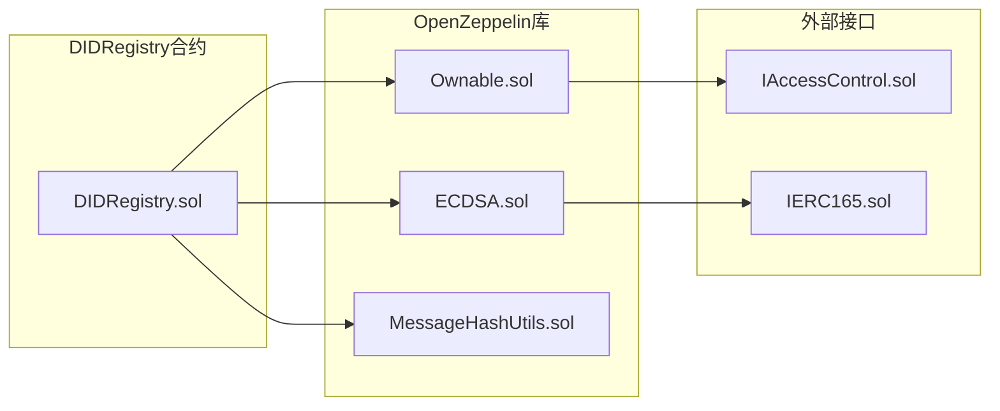

# DID注册API

<cite>
**本文档引用的文件**
- [DIDRegistry.sol](file://contracts/DIDRegistry.sol)
- [DIDRegistry.json](file://artifacts/contracts/DIDRegistry.sol/DIDRegistry.json)
- [deploy.js](file://scripts/deploy.js)
- [resolve.js](file://scripts/resolve.js)
- [package.json](file://package.json)
</cite>

## 目录
1. [简介](#简介)
2. [项目结构](#项目结构)
3. [核心组件](#核心组件)
4. [架构概览](#架构概览)
5. [详细组件分析](#详细组件分析)
6. [依赖关系分析](#依赖关系分析)
7. [性能考虑](#性能考虑)
8. [故障排除指南](#故障排除指南)
9. [结论](#结论)

## 简介

DID注册API是一个基于以太坊的去中心化身份（Decentralized Identity, DID）注册和验证系统。该系统允许用户将他们的去中心化身份与以太坊地址进行绑定，并提供身份解析和验证功能。系统采用OpenZeppelin的安全库实现，确保数字签名验证和访问控制。

该API的核心功能包括：
- DID创建和绑定：将用户的DID哈希值与以太坊地址绑定
- DID解析：查询特定地址绑定的DID哈希值
- 数字签名验证：使用ECDSA算法验证绑定请求的真实性
- 访问控制：通过所有权管理确保只有授权用户可以执行敏感操作

## 项目结构

DID注册API位于PredictionDIDSimple_cursor项目的contracts目录中，主要包含以下关键文件：



**图表来源**
- [DIDRegistry.sol](file://contracts/DIDRegistry.sol#L1-L34)
- [DIDRegistry.json](file://artifacts/contracts/DIDRegistry.sol/DIDRegistry.json#L1-L193)

**章节来源**
- [DIDRegistry.sol](file://contracts/DIDRegistry.sol#L1-L34)
- [DIDRegistry.json](file://artifacts/contracts/DIDRegistry.sol/DIDRegistry.json#L1-L193)

## 核心组件

### DIDRegistry合约

DIDRegistry是系统的核心合约，实现了所有DID相关的功能。它继承自OpenZeppelin的Ownable合约，提供了基本的所有权管理和访问控制。

**主要特性：**
- 使用ECDSA库进行数字签名验证
- 使用MessageHashUtils库处理以太坊标准消息哈希
- 维护地址到DID哈希的映射表
- 提供事件日志记录

**章节来源**
- [DIDRegistry.sol](file://contracts/DIDRegistry.sol#L8-L33)

### 数据结构

系统使用简单的映射表来存储DID绑定关系：

```mermaid
erDiagram
ADDRESS_TO_DID {
address account PK
bytes32 didHash
}
DID_REGISTRY {
mapping address -> bytes32 didHashOf
event DidBound
}
ADDRESS_TO_DID ||--|| DID_REGISTRY : "绑定关系"
```

**图表来源**
- [DIDRegistry.sol](file://contracts/DIDRegistry.sol#L13-L15)

**章节来源**
- [DIDRegistry.sol](file://contracts/DIDRegistry.sol#L13-L15)

## 架构概览

DID注册API采用模块化设计，结合了多个OpenZeppelin安全库来确保系统的安全性：



**图表来源**
- [DIDRegistry.sol](file://contracts/DIDRegistry.sol#L4-L11)

## 详细组件分析

### 数字签名验证机制

系统使用ECDSA算法验证用户的身份绑定请求。签名验证过程如下：



**图表来源**
- [DIDRegistry.sol](file://contracts/DIDRegistry.sol#L19-L28)

### 函数接口规范

#### bindDid函数

**功能描述：** 将DID哈希值与调用者的以太坊地址进行绑定

**函数签名：** `bindDid(bytes32 didHash, bytes signature)`

**参数：**
- `didHash`: bytes32类型的DID哈希值
- `signature`: bytes类型的数字签名

**返回值：** 无（非支付函数）

**状态变更：** 修改存储状态，触发事件

**错误处理：**
- 当didHash为零值时抛出"empty did"错误
- 当签名验证失败时抛出"invalid sig"错误

**章节来源**
- [DIDRegistry.sol](file://contracts/DIDRegistry.sol#L19-L28)
- [DIDRegistry.json](file://artifacts/contracts/DIDRegistry.sol/DIDRegistry.json#L99-L114)

#### resolveDid函数

**功能描述：** 解析指定地址绑定的DID哈希值

**函数签名：** `resolveDid(address account) view returns (bytes32)`

**参数：**
- `account`: address类型的要查询的账户地址

**返回值：** bytes32类型的DID哈希值

**状态变更：** 无（只读函数）

**章节来源**
- [DIDRegistry.sol](file://contracts/DIDRegistry.sol#L30-L32)
- [DIDRegistry.json](file://artifacts/contracts/DIDRegistry.sol/DIDRegistry.json#L155-L172)

### 事件定义

#### DidBound事件

**功能描述：** 当DID绑定成功时触发的事件

**事件签名：** `DidBound(address indexed account, bytes32 indexed didHash)`

**参数：**
- `account`: indexed address类型的绑定账户
- `didHash`: indexed bytes32类型的DID哈希值

**用途：** 用于跟踪DID绑定活动和审计

**章节来源**
- [DIDRegistry.sol](file://contracts/DIDRegistry.sol#L15-L15)
- [DIDRegistry.json](file://artifacts/contracts/DIDRegistry.sol/DIDRegistry.json#L61-L77)

### 安全机制

#### 访问控制

系统继承自Ownable合约，提供以下安全特性：
- 只有合约所有者可以执行某些敏感操作
- 提供所有权转移功能
- 内置权限检查错误处理

#### 数字签名验证

使用ECDSA库确保：
- 签名的真实性验证
- 防止重放攻击
- 确保绑定请求来自正确的账户

**章节来源**
- [DIDRegistry.sol](file://contracts/DIDRegistry.sol#L4-L11)

## 依赖关系分析

DID注册API依赖于多个OpenZeppelin安全库：



**图表来源**
- [DIDRegistry.sol](file://contracts/DIDRegistry.sol#L4-L6)

### 外部依赖分析

系统的主要外部依赖包括：

1. **@openzeppelin/contracts/access/Ownable.sol**
   - 提供所有权管理和访问控制
   - 实现合约所有者权限控制

2. **@openzeppelin/contracts/utils/cryptography/ECDSA.sol**
   - 提供ECDSA数字签名验证功能
   - 支持以太坊标准签名格式

3. **@openzeppelin/contracts/utils/cryptography/MessageHashUtils.sol**
   - 提供消息哈希处理工具
   - 支持以太坊标准消息格式转换

**章节来源**
- [DIDRegistry.sol](file://contracts/DIDRegistry.sol#L4-L6)

## 性能考虑

### Gas优化策略

1. **存储优化：**
   - 使用简单的映射表减少存储开销
   - bytes32类型的DID哈希值占用固定空间

2. **计算优化：**
   - 使用keccak256哈希函数进行快速验证
   - ECDSA恢复操作在合约内完成

3. **事件优化：**
   - 事件日志存储成本相对较低
   - 使用indexed字段优化事件查询

### 扩展性考虑

1. **当前限制：**
   - 单一DID绑定到单一地址
   - 不支持多DID绑定

2. **潜在改进：**
   - 支持多DID绑定到同一地址
   - 添加DID解绑功能
   - 实现DID更新机制

## 故障排除指南

### 常见错误及解决方案

#### "empty did" 错误
**原因：** 传入的didHash参数为零值
**解决方案：** 确保提供有效的DID哈希值

#### "invalid sig" 错误  
**原因：** 数字签名验证失败
**解决方案：**
- 确保使用正确的私钥签名
- 验证签名消息格式正确
- 检查签名是否过期

#### 权限错误
**原因：** 非合约所有者尝试执行受保护操作
**解决方案：** 确保调用者具有适当的权限

### 调试建议

1. **使用事件日志：**
   - 监听DidBound事件确认绑定成功
   - 检查事件参数验证数据完整性

2. **状态查询：**
   - 使用resolveDid函数验证绑定状态
   - 检查didHashOf映射表内容

3. **链上调试：**
   - 使用区块链浏览器查看交易详情
   - 分析合约状态变化

**章节来源**
- [DIDRegistry.sol](file://contracts/DIDRegistry.sol#L20-L25)

## 结论

DID注册API提供了一个简洁而强大的去中心化身份管理系统。通过集成OpenZeppelin的安全库，系统确保了数字签名验证和访问控制的安全性。

### 主要优势

1. **安全性：** 基于成熟的OpenZeppelin库构建
2. **简洁性：** 最小化的API设计，易于理解和使用
3. **可扩展性：** 模块化架构支持未来功能扩展
4. **透明性：** 完整的事件日志记录所有操作

### 应用场景

- 预测市场平台的身份验证
- 去中心化身份验证服务
- 数字身份管理系统
- 区块链身份识别解决方案

### 未来发展

建议的功能增强：
- 支持多DID绑定
- 实现DID生命周期管理
- 添加DID验证服务
- 集成更高级的访问控制机制