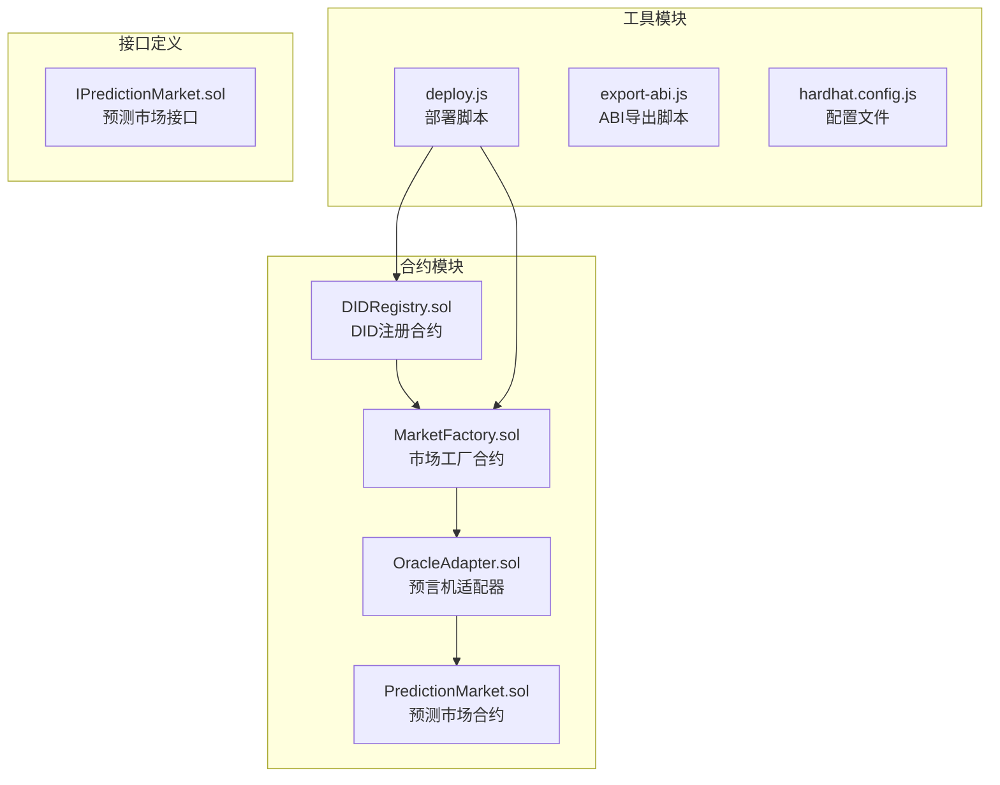
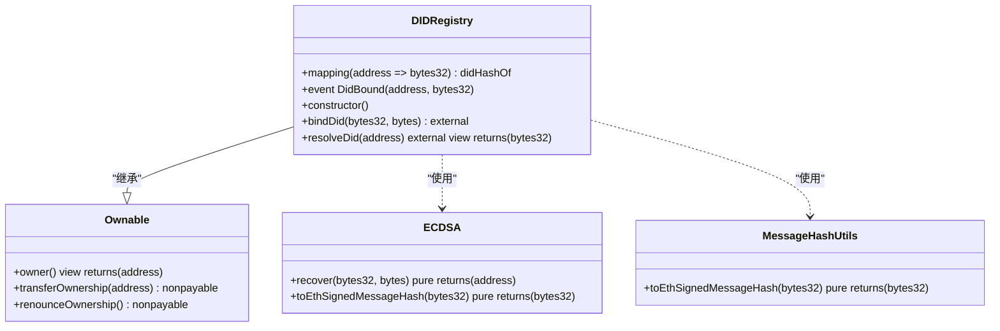
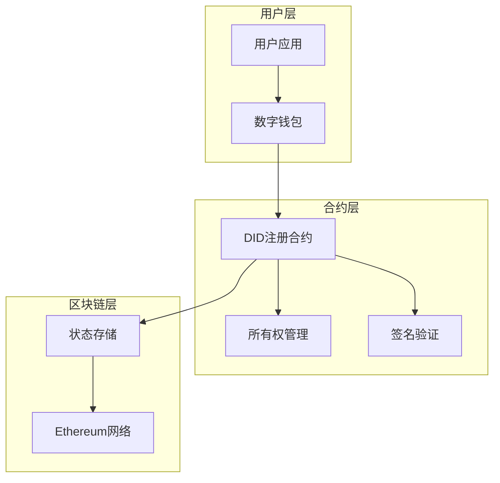
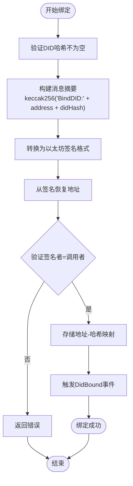
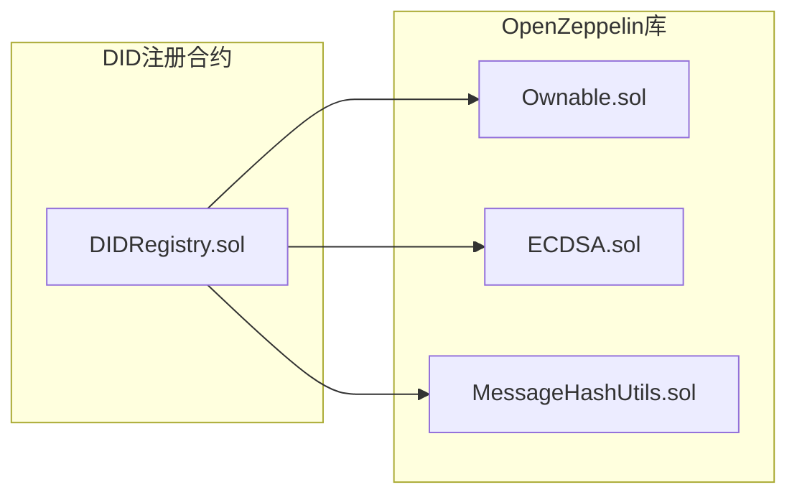
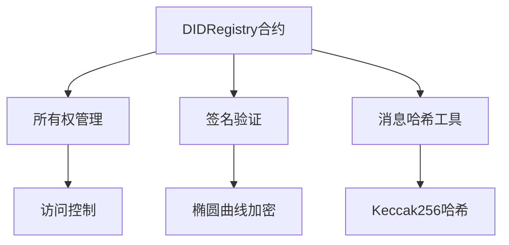
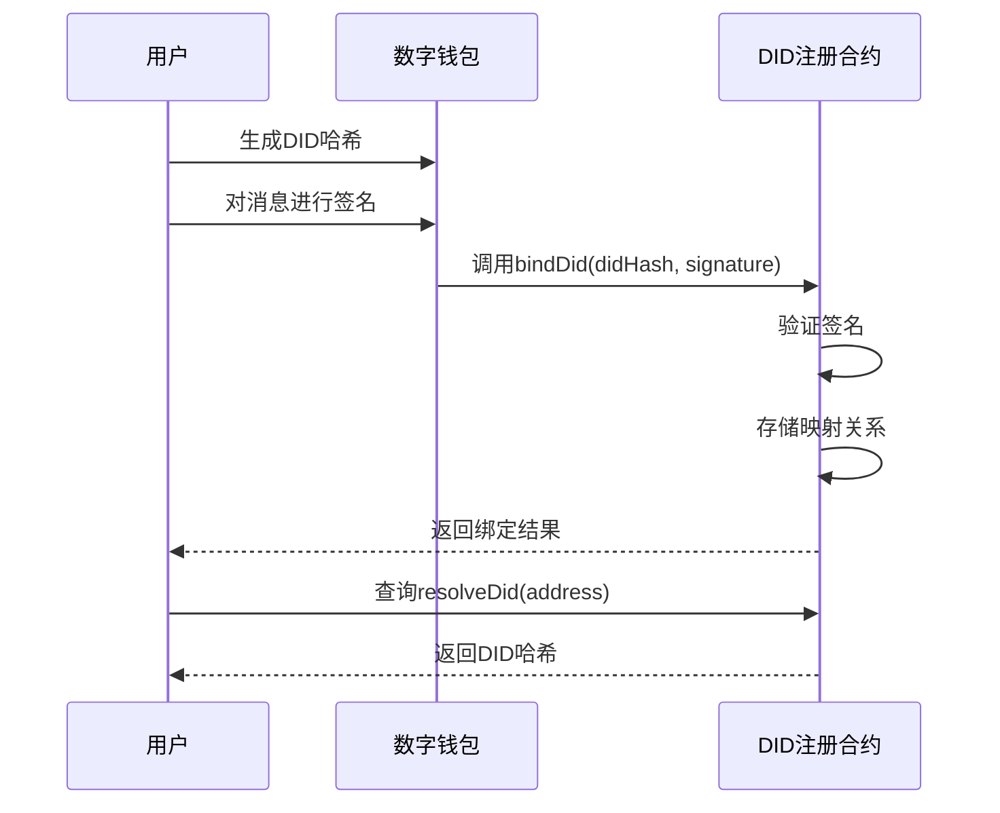

# DID注册API

<cite>
**本文档引用的文件**
- [DIDRegistry.sol](file://contracts/DIDRegistry.sol)
- [DIDRegistry.json](file://artifacts/contracts/DIDRegistry.sol/DIDRegistry.json)
- [deploy.js](file://scripts/deploy.js)
- [package.json](file://package.json)
- [hardhat.config.js](file://hardhat.config.js)
</cite>

## 目录
1. [简介](#简介)
2. [项目结构](#项目结构)
3. [核心组件](#核心组件)
4. [架构概览](#架构概览)
5. [详细组件分析](#详细组件分析)
6. [依赖关系分析](#依赖关系分析)
7. [性能考虑](#性能考虑)
8. [故障排除指南](#故障排除指南)
9. [结论](#结论)
10. [附录](#附录)

## 简介

DID注册合约是一个基于以太坊的去中心化身份管理系统，提供了可选的链上DID哈希绑定功能。该合约实现了完整的DID生命周期管理，包括身份绑定、解析和验证功能，为预测市场平台提供去中心化身份认证服务。

DID注册合约基于OpenZeppelin的安全库构建，采用ECDSA签名验证机制确保身份绑定的安全性，并通过事件日志提供透明的身份变更追踪。

## 项目结构

该项目采用模块化的智能合约架构，主要包含以下核心组件：



**图表来源**
- [DIDRegistry.sol:1-39](file://contracts/DIDRegistry.sol#L1-L39)
- [deploy.js:21-24](file://scripts/deploy.js#L21-L24)

**章节来源**
- [DIDRegistry.sol:1-39](file://contracts/DIDRegistry.sol#L1-L39)
- [package.json:1-21](file://package.json#L1-L21)

## 核心组件

### DID注册合约架构

DID注册合约采用简洁而高效的设计，主要包含以下核心功能：



**图表来源**
- [DIDRegistry.sol:12-38](file://contracts/DIDRegistry.sol#L12-L38)

### 数据存储结构

合约使用简单的映射表存储DID哈希与以太坊地址的对应关系：

| 存储位置 | 数据类型 | 描述 |
|---------|----------|------|
| `didHashOf` | `mapping(address => bytes32)` | 地址到DID哈希的映射关系 |
| `owner` | `address` | 合约所有者地址 |

**章节来源**
- [DIDRegistry.sol:16](file://contracts/DIDRegistry.sol#L16)
- [DIDRegistry.sol:12](file://contracts/DIDRegistry.sol#L12)

## 架构概览

DID注册系统采用分层架构设计，确保了安全性、可扩展性和易用性：



**图表来源**
- [DIDRegistry.sol:6-8](file://contracts/DIDRegistry.sol#L6-L8)
- [DIDRegistry.sol:12](file://contracts/DIDRegistry.sol#L12)

## 详细组件分析

### 绑定功能 (bindDid)

绑定功能是DID注册的核心操作，负责将用户的DID哈希与以太坊地址进行安全绑定。

#### 函数签名
```solidity
function bindDid(bytes32 didHash, bytes calldata signature) external
```

#### 参数说明

| 参数名 | 类型 | 必填 | 描述 |
|--------|------|------|------|
| `didHash` | `bytes32` | 是 | 用户的DID哈希值 |
| `signature` | `bytes` | 是 | 对"BindDID:address:didHash"消息的签名 |

#### 安全验证流程



**图表来源**
- [DIDRegistry.sol:23-32](file://contracts/DIDRegistry.sol#L23-L32)

#### 错误处理

| 错误类型 | 触发条件 | 错误信息 |
|----------|----------|----------|
| `empty did` | DID哈希为零值 | "empty did" |
| `invalid sig` | 签名验证失败 | "invalid sig" |
| `ECDSAInvalidSignature` | ECDSA签名无效 | OpenZeppelin标准错误 |
| `ECDSAInvalidSignatureLength` | 签名长度无效 | OpenZeppelin标准错误 |
| `ECDSAInvalidSignatureS` | 签名参数无效 | OpenZeppelin标准错误 |

**章节来源**
- [DIDRegistry.sol:23-32](file://contracts/DIDRegistry.sol#L23-L32)
- [DIDRegistry.json:11-37](file://artifacts/contracts/DIDRegistry.sol/DIDRegistry.json#L11-L37)

### 解析功能 (resolveDid)

解析功能允许查询指定地址绑定的DID哈希值。

#### 函数签名
```solidity
function resolveDid(address account) external view returns (bytes32)
```

#### 功能特性

- **只读访问**：不修改合约状态
- **公开查询**：任何人都可以查询
- **即时响应**：从存储映射中直接返回结果

**章节来源**
- [DIDRegistry.sol:35-37](file://contracts/DIDRegistry.sol#L35-L37)

### 事件系统

合约提供完整的事件追踪机制，用于记录重要的身份变更操作。

#### DidBound事件

| 字段名 | 类型 | 索引 | 描述 |
|--------|------|------|------|
| `account` | `address` | 是 | 绑定DID的账户地址 |
| `didHash` | `bytes32` | 是 | 绑定的DID哈希值 |

**章节来源**
- [DIDRegistry.sol:18](file://contracts/DIDRegistry.sol#L18)
- [DIDRegistry.json:61-77](file://artifacts/contracts/DIDRegistry.sol/DIDRegistry.json#L61-L77)

## 依赖关系分析

### 外部依赖

DID注册合约依赖于OpenZeppelin的安全库：



**图表来源**
- [DIDRegistry.sol:6-8](file://contracts/DIDRegistry.sol#L6-L8)

### 内部依赖关系



**图表来源**
- [DIDRegistry.sol:13-14](file://contracts/DIDRegistry.sol#L13-L14)

**章节来源**
- [DIDRegistry.sol:6-8](file://contracts/DIDRegistry.sol#L6-L8)

## 性能考虑

### Gas优化策略

1. **存储优化**
   - 使用简单的映射表减少存储开销
   - 单字段存储避免复杂的数据结构

2. **计算优化**
   - 仅在绑定时执行签名验证
   - 解析操作为纯读取操作，无计算成本

3. **内存管理**
   - 使用栈变量而非存储变量
   - 最小化临时数据的创建

### 成本分析

| 操作类型 | Gas消耗估算 | 说明 |
|----------|-------------|------|
| `bindDid` | ~60,000-80,000 | 包含签名验证和存储写入 |
| `resolveDid` | ~20,000-30,000 | 纯读取操作 |
| `DidBound事件` | ~15,000-25,000 | 事件日志开销 |

## 故障排除指南

### 常见问题及解决方案

#### 1. 签名验证失败

**问题症状**：
- 报错："invalid sig"
- 交易回滚

**可能原因**：
- 签名者不是调用者
- 消息格式不正确
- 签名已过期

**解决步骤**：
1. 验证签名是否由正确的私钥生成
2. 确认消息格式为"BindDID:address:didHash"
3. 检查签名的时间戳有效性

#### 2. DID哈希为空

**问题症状**：
- 报错："empty did"

**解决方法**：
- 确保传入有效的DID哈希值
- 验证DID格式符合预期

#### 3. 权限相关错误

**问题症状**：
- 报错：`OwnableUnauthorizedAccount`
- 报错：`OwnableInvalidOwner`

**解决方法**：
- 确认调用者具有适当的权限
- 检查合约所有权状态

### 调试工具

#### 部署脚本集成

```javascript
// 部署DID注册合约
const Registry = await hre.ethers.getContractFactory("DIDRegistry");
const registry = await Registry.deploy();
await registry.waitForDeployment();
const registryAddr = await registry.getAddress();
```

**章节来源**
- [deploy.js:21-24](file://scripts/deploy.js#L21-L24)

## 结论

DID注册合约提供了一个简洁、安全且高效的去中心化身份管理系统。其设计特点包括：

1. **安全性**：基于ECDSA签名验证，确保身份绑定的真实性
2. **透明性**：通过事件日志提供完整的操作追踪
3. **可扩展性**：模块化设计便于与其他合约集成
4. **成本效益**：优化的Gas消耗，适合生产环境使用

该合约为预测市场平台提供了可靠的去中心化身份基础设施，支持用户身份验证、权限管理和审计追踪等关键功能。

## 附录

### API参考

#### 绑定操作

| 属性 | 值 |
|------|-----|
| 函数名 | `bindDid` |
| 可见性 | `external` |
| 状态变更 | `nonpayable` |
| 返回值 | 无 |
| 事件 | `DidBound` |

#### 解析操作

| 属性 | 值 |
|------|-----|
| 函数名 | `resolveDid` |
| 可见性 | `external` |
| 状态变更 | `view` |
| 返回值 | `bytes32` |
| 事件 | 无 |

### 集成示例

#### 基本使用流程



**图表来源**
- [DIDRegistry.sol:23-37](file://contracts/DIDRegistry.sol#L23-L37)

### 安全最佳实践

1. **签名管理**
   - 使用安全的密钥管理系统
   - 定期轮换私钥
   - 实施多重签名机制

2. **合约升级**
   - 考虑代理模式实现升级
   - 实施治理机制
   - 进行充分的测试

3. **监控告警**
   - 监控大量绑定操作
   - 设置异常行为检测
   - 实施访问控制