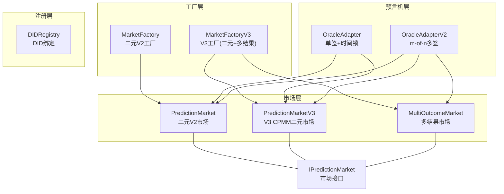
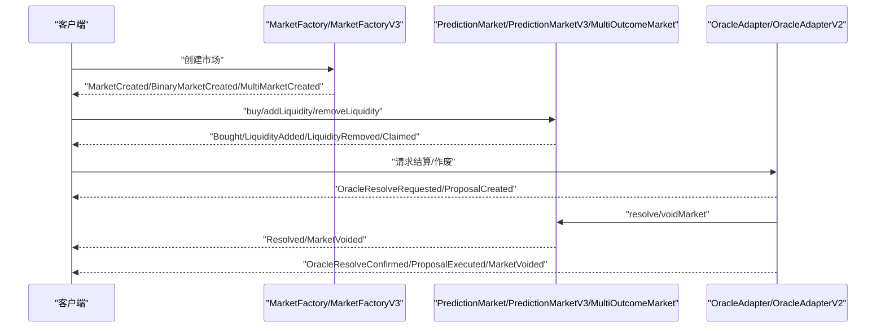
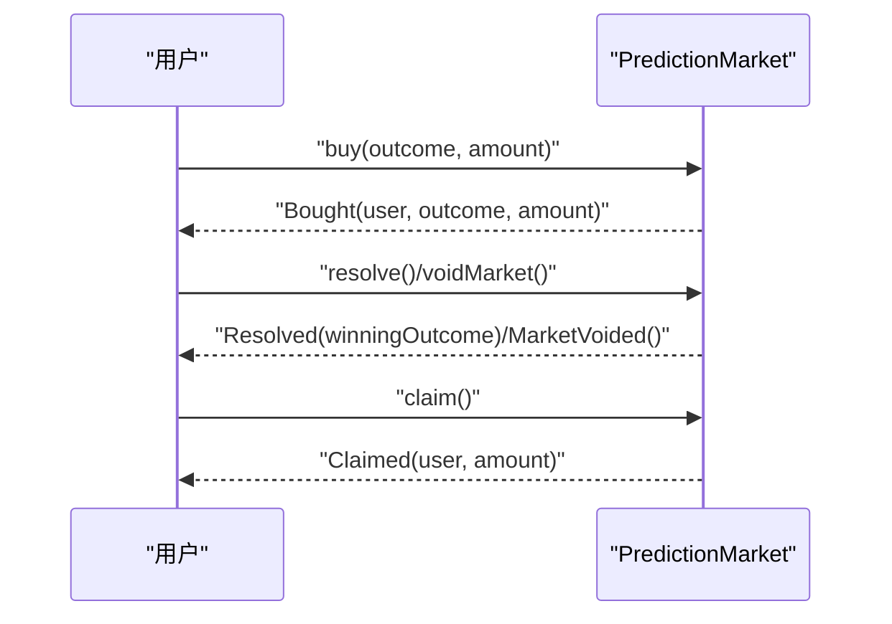
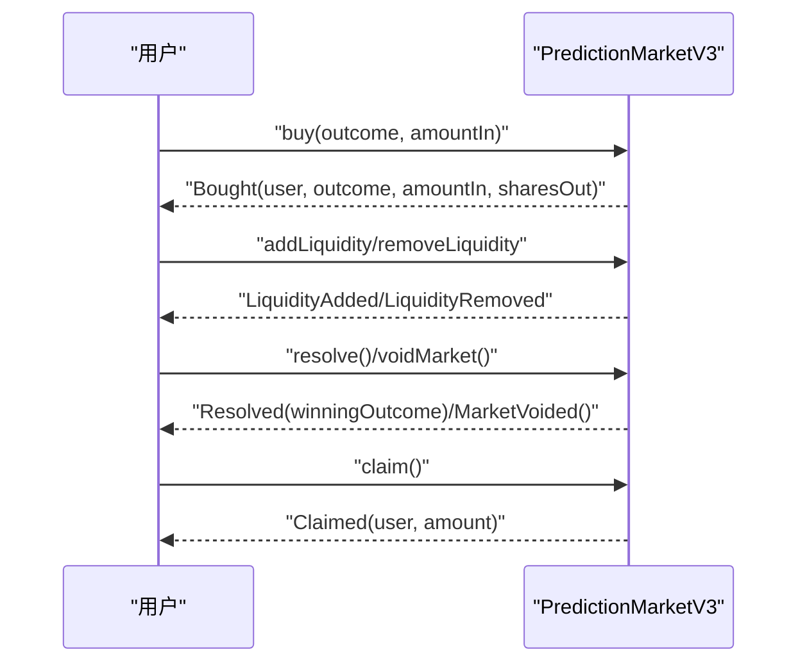
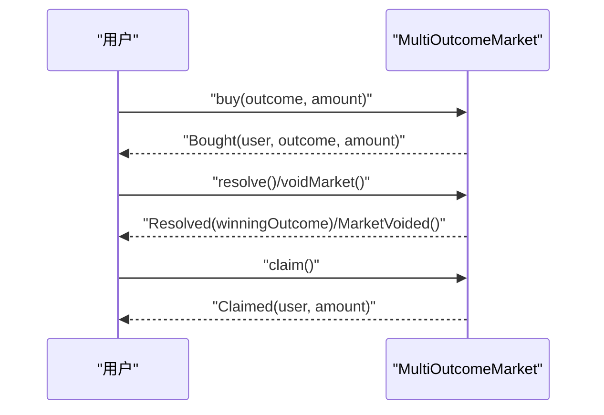
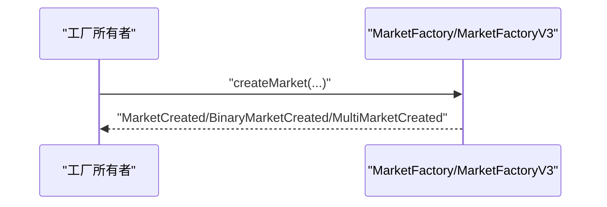
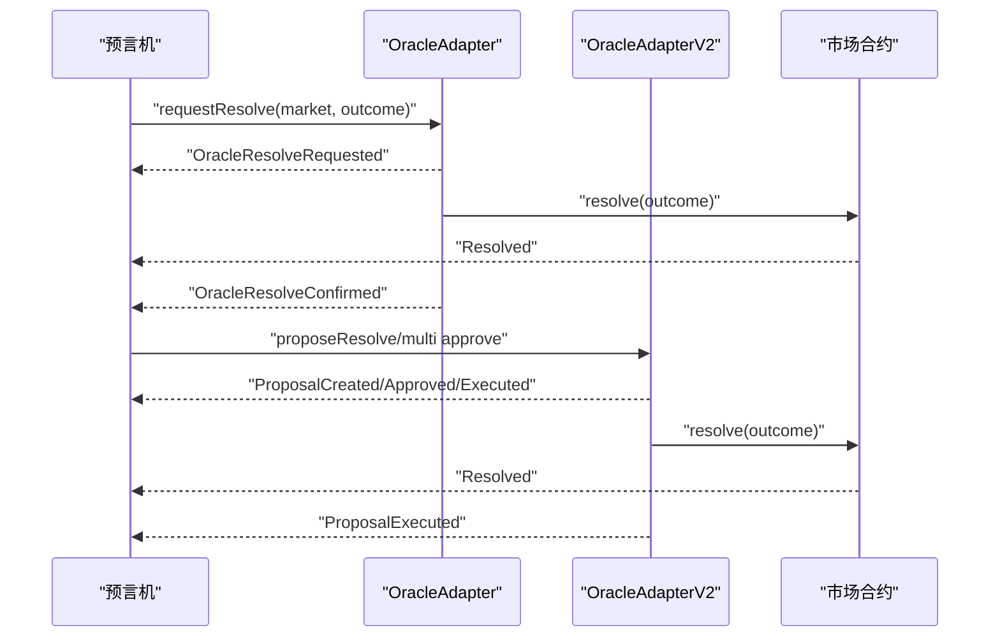
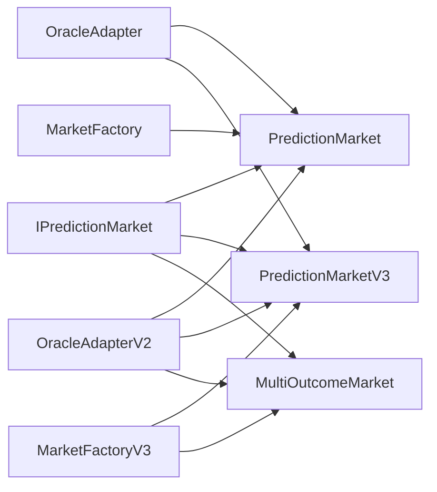

# 事件与日志

<cite>
**本文档引用的文件**
- [PredictionMarket.sol](file://contracts/PredictionMarket.sol)
- [PredictionMarketV3.sol](file://contracts/PredictionMarketV3.sol)
- [MultiOutcomeMarket.sol](file://contracts/MultiOutcomeMarket.sol)
- [MarketFactory.sol](file://contracts/MarketFactory.sol)
- [MarketFactoryV3.sol](file://contracts/MarketFactoryV3.sol)
- [OracleAdapter.sol](file://contracts/OracleAdapter.sol)
- [OracleAdapterV2.sol](file://contracts/OracleAdapterV2.sol)
- [DIDRegistry.sol](file://contracts/DIDRegistry.sol)
- [IPredictionMarket.sol](file://contracts/interfaces/IPredictionMarket.sol)
- [MarketFactory.test.js](file://test/MarketFactory.test.js)
- [OracleAdapter.test.js](file://test/OracleAdapter.test.js)
- [deploy.js](file://scripts/deploy.js)
- [resolve.js](file://scripts/resolve.js)
</cite>

## 目录
1. [简介](#简介)
2. [项目结构](#项目结构)
3. [核心组件](#核心组件)
4. [架构总览](#架构总览)
5. [详细组件分析](#详细组件分析)
6. [依赖分析](#依赖分析)
7. [性能考虑](#性能考虑)
8. [故障排查指南](#故障排查指南)
9. [结论](#结论)
10. [附录](#附录)

## 简介
本文件为 PredictionDIDSimple 合约系统的事件与日志参考文档，覆盖所有市场合约、工厂合约、预言机适配器及注册表合约发出的关键事件。内容包括事件参数、数据格式、监听方法、过滤与索引最佳实践，以及前端集成与实时监控方案建议。

## 项目结构
- 合约层按功能分层组织：
  - 市场层：二元市场、V3 CPMM 二元市场、多结果市场
  - 工厂层：二元 V2 工厂、V3 工厂（支持二元与多结果）
  - 预言机层：单签适配器（时间锁）、多签适配器（m-of-n）
  - 注册层：DID 哈希绑定
  - 接口层：统一市场接口
- 事件主要分布在各合约的外部函数执行路径中，用于记录状态变更、交易执行、权限与治理操作等。

图表来源
- [MarketFactory.sol:12-67](file://contracts/MarketFactory.sol#L12-L67)
- [MarketFactoryV3.sol:14-103](file://contracts/MarketFactoryV3.sol#L14-L103)
- [PredictionMarket.sol:11-144](file://contracts/PredictionMarket.sol#L11-L144)
- [PredictionMarketV3.sol:12-217](file://contracts/PredictionMarketV3.sol#L12-L217)
- [MultiOutcomeMarket.sol:12-123](file://contracts/MultiOutcomeMarket.sol#L12-L123)
- [OracleAdapter.sol:11-95](file://contracts/OracleAdapter.sol#L11-L95)
- [OracleAdapterV2.sol:11-94](file://contracts/OracleAdapterV2.sol#L11-L94)
- [IPredictionMarket.sol:7-14](file://contracts/interfaces/IPredictionMarket.sol#L7-L14)

章节来源
- [MarketFactory.sol:12-67](file://contracts/MarketFactory.sol#L12-L67)
- [MarketFactoryV3.sol:14-103](file://contracts/MarketFactoryV3.sol#L14-L103)
- [PredictionMarket.sol:11-144](file://contracts/PredictionMarket.sol#L11-L144)
- [PredictionMarketV3.sol:12-217](file://contracts/PredictionMarketV3.sol#L12-L217)
- [MultiOutcomeMarket.sol:12-123](file://contracts/MultiOutcomeMarket.sol#L12-L123)
- [OracleAdapter.sol:11-95](file://contracts/OracleAdapter.sol#L11-L95)
- [OracleAdapterV2.sol:11-94](file://contracts/OracleAdapterV2.sol#L11-L94)
- [IPredictionMarket.sol:7-14](file://contracts/interfaces/IPredictionMarket.sol#L7-L14)

## 核心组件
- 市场事件（二元/多结果）
  - 交易执行：买入、流动性增减（V3）
  - 状态变更：结算、作废
  - 奖励领取：结算后派息、作废退款
- 工厂事件（创建）
  - 二元V2工厂：创建二元市场
  - V3工厂：创建二元V3市场、创建多结果市场
- 预言机事件（适配器）
  - 单签+时间锁：请求结算、确认结算、作废
  - m-of-n多签：提案创建、批准、执行、作废
- 注册事件（DID）
  - DID 绑定

章节来源
- [PredictionMarket.sol:38-41](file://contracts/PredictionMarket.sol#L38-L41)
- [PredictionMarketV3.sol:41-46](file://contracts/PredictionMarketV3.sol#L41-L46)
- [MultiOutcomeMarket.sol:33-36](file://contracts/MultiOutcomeMarket.sol#L33-L36)
- [MarketFactory.sol:20-27](file://contracts/MarketFactory.sol#L20-L27)
- [MarketFactoryV3.sol:25-28](file://contracts/MarketFactoryV3.sol#L25-L28)
- [OracleAdapter.sol:26-33](file://contracts/OracleAdapter.sol#L26-L33)
- [OracleAdapterV2.sol:28-31](file://contracts/OracleAdapterV2.sol#L28-L31)
- [DIDRegistry.sol:18](file://contracts/DIDRegistry.sol#L18)

## 架构总览
以下序列图展示从工厂创建市场到预言机结算/作废的完整事件流，体现事件在系统中的传播与依赖关系。

图表来源
- [MarketFactory.sol:20-27](file://contracts/MarketFactory.sol#L20-L27)
- [MarketFactoryV3.sol:25-28](file://contracts/MarketFactoryV3.sol#L25-L28)
- [PredictionMarket.sol:38-41](file://contracts/PredictionMarket.sol#L38-L41)
- [PredictionMarketV3.sol:41-46](file://contracts/PredictionMarketV3.sol#L41-L46)
- [MultiOutcomeMarket.sol:33-36](file://contracts/MultiOutcomeMarket.sol#L33-L36)
- [OracleAdapter.sol:26-33](file://contracts/OracleAdapter.sol#L26-L33)
- [OracleAdapterV2.sol:28-31](file://contracts/OracleAdapterV2.sol#L28-L31)

## 详细组件分析

### 二元预测市场（V2）事件
- 事件清单
  - 购买：记录用户、押注方向、金额
  - 结算：记录获胜结果
  - 领取：记录用户、派息金额
  - 作废：标记市场作废
- 参数与数据格式
  - Bought：用户地址（indexed）、结果编号（0/1）、投入金额
  - Resolved：获胜结果编号（0/1）
  - Claimed：用户地址（indexed）、派息金额
  - MarketVoided：无参数
- 监听方法
  - 使用事件名过滤：Bought、Resolved、Claimed、MarketVoided
  - 使用 indexed 字段进行高效过滤：用户地址、结果编号
- 典型流程
  - 买入 -> 结算/作废 -> 领取
- 相关实现路径
  - [PredictionMarket.sol:38-41](file://contracts/PredictionMarket.sol#L38-L41)
  - [PredictionMarket.sol:70-88](file://contracts/PredictionMarket.sol#L70-L88)
  - [PredictionMarket.sol:90-104](file://contracts/PredictionMarket.sol#L90-L104)
  - [PredictionMarket.sol:106-123](file://contracts/PredictionMarket.sol#L106-L123)

图表来源
- [PredictionMarket.sol:38-41](file://contracts/PredictionMarket.sol#L38-L41)
- [PredictionMarket.sol:70-88](file://contracts/PredictionMarket.sol#L70-L88)
- [PredictionMarket.sol:90-104](file://contracts/PredictionMarket.sol#L90-L104)
- [PredictionMarket.sol:106-123](file://contracts/PredictionMarket.sol#L106-L123)

章节来源
- [PredictionMarket.sol:38-41](file://contracts/PredictionMarket.sol#L38-L41)
- [PredictionMarket.sol:70-88](file://contracts/PredictionMarket.sol#L70-L88)
- [PredictionMarket.sol:90-104](file://contracts/PredictionMarket.sol#L90-L104)
- [PredictionMarket.sol:106-123](file://contracts/PredictionMarket.sol#L106-L123)

### 二元预测市场（V3，CPMM）事件
- 事件清单
  - 购买：记录用户、结果方向、投入金额、获得份额
  - 流动性：添加/移除 LP 份额
  - 结算：获胜结果
  - 领取：派息金额
  - 作废：标记作废
- 参数与数据格式
  - Bought：用户地址（indexed）、结果编号、入金、获得份额
  - LiquidityAdded/Removed：用户地址（indexed）、份额变动
  - Resolved：获胜结果编号
  - Claimed：用户地址（indexed）、派息金额
  - MarketVoided：无参数
- 监听方法
  - 使用 Bought 的 indexed 用户与结果字段过滤
  - 使用 LiquidityAdded/Removed 过滤特定 LP 行为
- 相关实现路径
  - [PredictionMarketV3.sol:41-46](file://contracts/PredictionMarketV3.sol#L41-L46)
  - [PredictionMarketV3.sol:100-120](file://contracts/PredictionMarketV3.sol#L100-L120)
  - [PredictionMarketV3.sol:122-146](file://contracts/PredictionMarketV3.sol#L122-L146)
  - [PredictionMarketV3.sol:148-162](file://contracts/PredictionMarketV3.sol#L148-L162)
  - [PredictionMarketV3.sol:164-179](file://contracts/PredictionMarketV3.sol#L164-L179)

图表来源
- [PredictionMarketV3.sol:41-46](file://contracts/PredictionMarketV3.sol#L41-L46)
- [PredictionMarketV3.sol:100-120](file://contracts/PredictionMarketV3.sol#L100-L120)
- [PredictionMarketV3.sol:122-146](file://contracts/PredictionMarketV3.sol#L122-L146)
- [PredictionMarketV3.sol:148-162](file://contracts/PredictionMarketV3.sol#L148-L162)
- [PredictionMarketV3.sol:164-179](file://contracts/PredictionMarketV3.sol#L164-L179)

章节来源
- [PredictionMarketV3.sol:41-46](file://contracts/PredictionMarketV3.sol#L41-L46)
- [PredictionMarketV3.sol:100-120](file://contracts/PredictionMarketV3.sol#L100-L120)
- [PredictionMarketV3.sol:122-146](file://contracts/PredictionMarketV3.sol#L122-L146)
- [PredictionMarketV3.sol:148-162](file://contracts/PredictionMarketV3.sol#L148-L162)
- [PredictionMarketV3.sol:164-179](file://contracts/PredictionMarketV3.sol#L164-L179)

### 多结果市场事件
- 事件清单
  - 购买：记录用户、结果编号、投入金额
  - 结算：获胜结果编号
  - 领取：派息金额
  - 作废：标记作废
- 参数与数据格式
  - Bought：用户地址（indexed）、结果编号（0..N-1）、投入金额
  - Resolved：获胜结果编号
  - Claimed：用户地址（indexed）、派息金额
  - MarketVoided：无参数
- 监听方法
  - 使用 Bought 的 indexed 用户与结果编号过滤
- 相关实现路径
  - [MultiOutcomeMarket.sol:33-36](file://contracts/MultiOutcomeMarket.sol#L33-L36)
  - [MultiOutcomeMarket.sol:72-82](file://contracts/MultiOutcomeMarket.sol#L72-L82)
  - [MultiOutcomeMarket.sol:84-97](file://contracts/MultiOutcomeMarket.sol#L84-L97)
  - [MultiOutcomeMarket.sol:99-122](file://contracts/MultiOutcomeMarket.sol#L99-L122)

图表来源
- [MultiOutcomeMarket.sol:33-36](file://contracts/MultiOutcomeMarket.sol#L33-L36)
- [MultiOutcomeMarket.sol:72-82](file://contracts/MultiOutcomeMarket.sol#L72-L82)
- [MultiOutcomeMarket.sol:84-97](file://contracts/MultiOutcomeMarket.sol#L84-L97)
- [MultiOutcomeMarket.sol:99-122](file://contracts/MultiOutcomeMarket.sol#L99-L122)

章节来源
- [MultiOutcomeMarket.sol:33-36](file://contracts/MultiOutcomeMarket.sol#L33-L36)
- [MultiOutcomeMarket.sol:72-82](file://contracts/MultiOutcomeMarket.sol#L72-L82)
- [MultiOutcomeMarket.sol:84-97](file://contracts/MultiOutcomeMarket.sol#L84-L97)
- [MultiOutcomeMarket.sol:99-122](file://contracts/MultiOutcomeMarket.sol#L99-L122)

### 工厂事件（创建）
- 二元V2工厂
  - MarketCreated：市场ID（indexed）、市场合约地址（indexed）、比赛引用哈希（indexed）、问题、截止时间
- V3工厂
  - BinaryMarketCreated：ID（indexed）、市场地址、比赛引用哈希、问题
  - MultiMarketCreated：ID（indexed）、市场地址、结果数、问题
- 监听方法
  - 使用 indexed 字段过滤：ID、市场地址、比赛引用哈希
- 相关实现路径
  - [MarketFactory.sol:20-27](file://contracts/MarketFactory.sol#L20-L27)
  - [MarketFactoryV3.sol:25-28](file://contracts/MarketFactoryV3.sol#L25-L28)

图表来源
- [MarketFactory.sol:20-27](file://contracts/MarketFactory.sol#L20-L27)
- [MarketFactoryV3.sol:25-28](file://contracts/MarketFactoryV3.sol#L25-L28)

章节来源
- [MarketFactory.sol:20-27](file://contracts/MarketFactory.sol#L20-L27)
- [MarketFactoryV3.sol:25-28](file://contracts/MarketFactoryV3.sol#L25-L28)

### 预言机适配器事件
- 单签+时间锁（OracleAdapter）
  - OracleResolveRequested：市场地址（indexed）、结果编号、可执行时间
  - OracleResolveConfirmed：市场地址（indexed）、结果编号
  - MarketVoided：市场地址（indexed）
- m-of-n多签（OracleAdapterV2）
  - ProposalCreated：提案ID（indexed）、市场地址（indexed）、结果编号
  - ProposalApproved：提案ID（indexed）、预言机地址（indexed）
  - ProposalExecuted：提案ID（indexed）、结果编号
  - MarketVoided：市场地址（indexed）
- 监听方法
  - 使用 indexed 字段过滤：市场地址、提案ID、预言机地址
- 相关实现路径
  - [OracleAdapter.sol:26-33](file://contracts/OracleAdapter.sol#L26-L33)
  - [OracleAdapterV2.sol:28-31](file://contracts/OracleAdapterV2.sol#L28-L31)

图表来源
- [OracleAdapter.sol:26-33](file://contracts/OracleAdapter.sol#L26-L33)
- [OracleAdapterV2.sol:28-31](file://contracts/OracleAdapterV2.sol#L28-L31)

章节来源
- [OracleAdapter.sol:26-33](file://contracts/OracleAdapter.sol#L26-L33)
- [OracleAdapterV2.sol:28-31](file://contracts/OracleAdapterV2.sol#L28-L31)

### DID 注册表事件
- DidBound：账户地址（indexed）、DID 哈希（indexed）
- 监听方法
  - 使用 indexed 字段过滤账户或 DID 哈希
- 相关实现路径
  - [DIDRegistry.sol:18](file://contracts/DIDRegistry.sol#L18)

章节来源
- [DIDRegistry.sol:18](file://contracts/DIDRegistry.sol#L18)

## 依赖分析
- 市场合约依赖接口
  - IPredictionMarket：统一的市场状态查询与结算/作废入口
- 预言机适配器依赖
  - OracleAdapter/OracleAdapterV2 通过角色控制调用市场合约的 resolve/voidMarket
- 工厂依赖
  - MarketFactory/MarketFactoryV3 部署并管理市场生命周期

图表来源
- [IPredictionMarket.sol:7-14](file://contracts/interfaces/IPredictionMarket.sol#L7-L14)
- [OracleAdapter.sol:11-95](file://contracts/OracleAdapter.sol#L11-L95)
- [OracleAdapterV2.sol:11-94](file://contracts/OracleAdapterV2.sol#L11-L94)
- [MarketFactory.sol:12-67](file://contracts/MarketFactory.sol#L12-L67)
- [MarketFactoryV3.sol:14-103](file://contracts/MarketFactoryV3.sol#L14-L103)

章节来源
- [IPredictionMarket.sol:7-14](file://contracts/interfaces/IPredictionMarket.sol#L7-L14)
- [OracleAdapter.sol:11-95](file://contracts/OracleAdapter.sol#L11-L95)
- [OracleAdapterV2.sol:11-94](file://contracts/OracleAdapterV2.sol#L11-L94)
- [MarketFactory.sol:12-67](file://contracts/MarketFactory.sol#L12-L67)
- [MarketFactoryV3.sol:14-103](file://contracts/MarketFactoryV3.sol#L14-L103)

## 性能考虑
- 事件索引字段选择
  - 优先使用 indexed 地址与 ID 字段进行过滤，减少日志扫描成本
- 事件粒度
  - 将高频事件拆分为独立事件，便于按场景订阅
- 查询范围
  - 限制区块范围，避免全链扫描；结合快照与增量订阅策略
- 前端缓存
  - 对常用查询结果进行本地缓存，降低重复请求

## 故障排查指南
- 事件未触发
  - 检查调用函数是否执行成功（交易回执状态）
  - 确认事件是否在条件满足后才 emit
- 过滤不到事件
  - 确认过滤参数与 indexed 字段匹配
  - 检查区块范围与节点同步状态
- 预言机流程异常
  - 单签时间锁：确认时间是否到达可执行时间
  - 多签：确认批准数是否达到阈值
- 部署与集成
  - 参考部署脚本与测试用例，确保合约地址与角色配置正确

章节来源
- [OracleAdapter.test.js:7-27](file://test/OracleAdapter.test.js#L7-L27)
- [MarketFactory.test.js:8-22](file://test/MarketFactory.test.js#L8-L22)
- [deploy.js:16-32](file://scripts/deploy.js#L16-L32)
- [resolve.js:4-14](file://scripts/resolve.js#L4-L14)

## 结论
本事件与日志参考文档梳理了 PredictionDIDSimple 合约体系中的关键事件，明确了参数、数据格式与监听方法，并提供了过滤与索引的最佳实践及前端集成建议。通过合理利用 indexed 字段与事件拆分，可显著提升前端与链下服务的可观测性与性能。

## 附录
- 前端集成要点
  - 使用 Web3 或 Ethers.js 订阅事件，设置合理的区块范围
  - 对高频事件（如 Bought、LiquidityAdded）建立独立订阅通道
  - 对预言机事件（请求/确认/执行）建立状态机，跟踪时间锁与多签进度
- 实时监控方案
  - 链上：基于事件构建实时仪表盘，展示市场状态、交易量、流动性变化
  - 链下：使用队列/消息中间件异步处理事件，落库与告警联动
- 参考脚本与测试
  - 部署脚本：[deploy.js:1-60](file://scripts/deploy.js#L1-L60)
  - 手动结算脚本：[resolve.js:1-22](file://scripts/resolve.js#L1-L22)
  - 事件监听测试：[MarketFactory.test.js:1-31](file://test/MarketFactory.test.js#L1-L31)、[OracleAdapter.test.js:1-53](file://test/OracleAdapter.test.js#L1-L53)