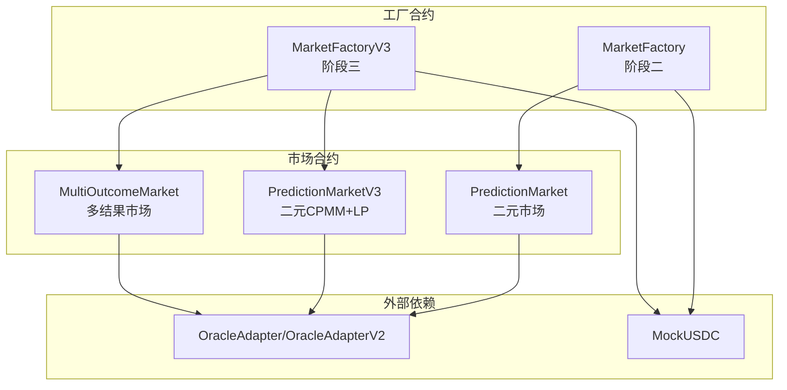
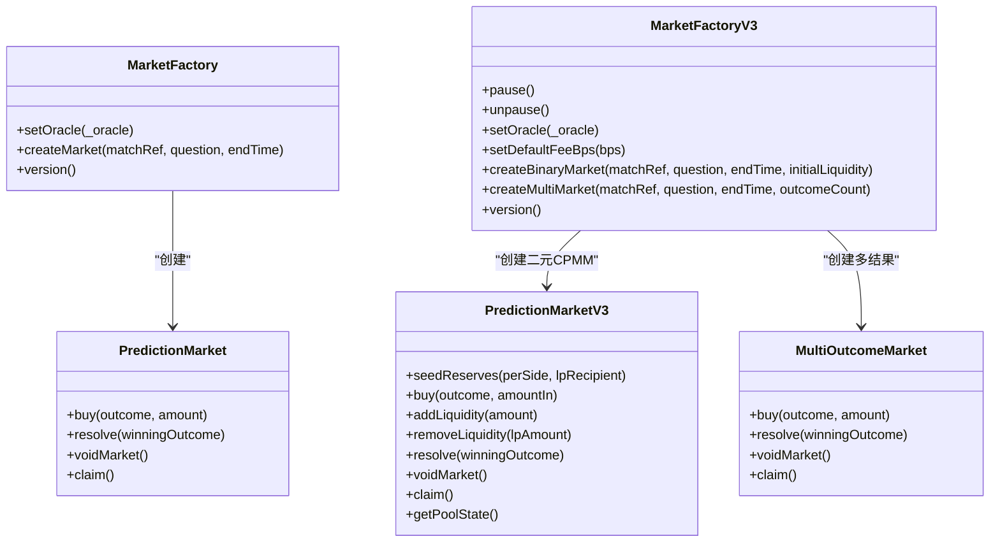
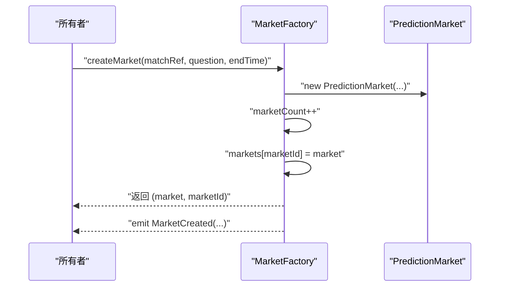
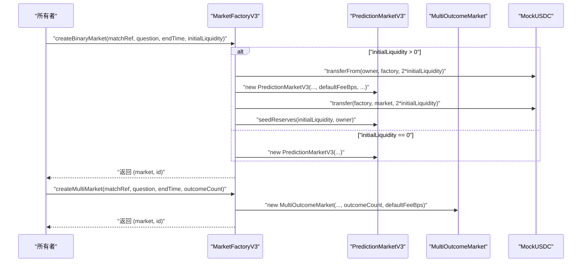
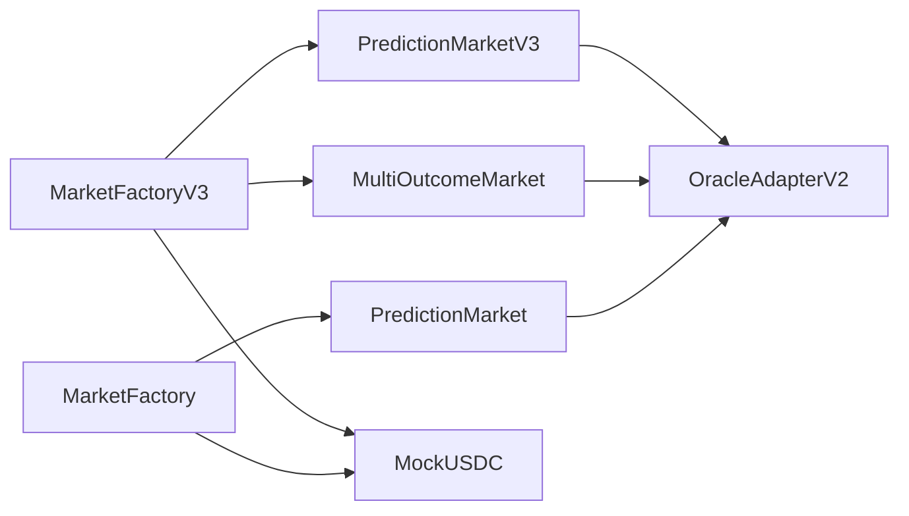

# 工厂API

<cite>
**本文引用的文件**
- [MarketFactory.sol](file://contracts/MarketFactory.sol)
- [MarketFactoryV3.sol](file://contracts/MarketFactoryV3.sol)
- [PredictionMarket.sol](file://contracts/PredictionMarket.sol)
- [PredictionMarketV3.sol](file://contracts/PredictionMarketV3.sol)
- [MultiOutcomeMarket.sol](file://contracts/MultiOutcomeMarket.sol)
- [IPredictionMarket.sol](file://contracts/interfaces/IPredictionMarket.sol)
- [MarketFactory.test.js](file://test/MarketFactory.test.js)
- [Phase3.test.js](file://test/Phase3.test.js)
- [deploy.js](file://scripts/deploy.js)
- [deploy-phase3.js](file://scripts/deploy-phase3.js)
- [hardhat.config.js](file://hardhat.config.js)
</cite>

## 目录
1. [简介](#简介)
2. [项目结构](#项目结构)
3. [核心组件](#核心组件)
4. [架构总览](#架构总览)
5. [详细组件分析](#详细组件分析)
6. [依赖关系分析](#依赖关系分析)
7. [性能考量](#性能考量)
8. [故障排查指南](#故障排查指南)
9. [结论](#结论)
10. [附录](#附录)

## 简介
本文件系统化梳理工厂API，重点覆盖 MarketFactory 与 MarketFactoryV3 的公共接口与行为，解释市场创建函数的参数要求（市场类型、结果数量、费用设置等）、工厂合约的初始化参数与配置选项、不同市场类型的创建流程与参数差异，并提供函数签名、参数验证规则、返回值说明、完整示例与错误处理建议。同时阐述工厂模式的设计理念与扩展性考虑，帮助开发者在不修改核心逻辑的前提下快速集成与扩展。

## 项目结构
- 合约层
  - 工厂合约：MarketFactory（阶段二）、MarketFactoryV3（阶段三）
  - 市场合约：PredictionMarket（二元市场，阶段二）、PredictionMarketV3（二元CPMM+LP，阶段三）、MultiOutcomeMarket（多结果市场，阶段三）
  - 接口：IPredictionMarket（统一状态查询与决议接口）
- 测试层
  - MarketFactory.test.js：验证 MarketFactory 的基本创建流程与事件
  - Phase3.test.js：验证 MarketFactoryV3 的二元与多结果市场创建、交易与结算
- 脚本层
  - deploy.js：部署 MarketFactory 及其依赖（适配器、注册表、代币）
  - deploy-phase3.js：部署 MarketFactoryV3 及其依赖（适配器V2、工厂）

图表来源
- [MarketFactory.sol](file://contracts/MarketFactory.sol#L1-L60)
- [MarketFactoryV3.sol](file://contracts/MarketFactoryV3.sol#L1-L94)
- [PredictionMarket.sol](file://contracts/PredictionMarket.sol#L1-L134)
- [PredictionMarketV3.sol](file://contracts/PredictionMarketV3.sol#L1-L200)
- [MultiOutcomeMarket.sol](file://contracts/MultiOutcomeMarket.sol#L1-L113)

章节来源
- [MarketFactory.sol](file://contracts/MarketFactory.sol#L1-L60)
- [MarketFactoryV3.sol](file://contracts/MarketFactoryV3.sol#L1-L94)
- [hardhat.config.js](file://hardhat.config.js#L1-L30)

## 核心组件
- MarketFactory（阶段二）
  - 角色：仅所有者可调用；负责创建二元预测市场（parimutuel）
  - 关键字段：collateral（保证金代币）、oracle（预言机地址）、marketCount、markets 映射
  - 公共函数：
    - setOracle(address)：仅所有者，更新预言机
    - createMarket(bytes32,string,uint256)：仅所有者，创建二元市场，返回市场地址与ID
    - version()：纯函数，返回版本字符串
- MarketFactoryV3（阶段三）
  - 角色：所有者+暂停器；负责创建二元CPMM+LP市场与多结果市场
  - 关键字段：collateral、oracle、defaultFeeBps、defaultMaxBet、marketCount、markets 映射、marketTypes 映射
  - 公共函数：
    - pause()/unpause()：仅所有者控制暂停
    - setOracle(address)/setDefaultFeeBps(uint16)：仅所有者
    - createBinaryMarket(bytes32,string,uint256,uint256)：仅所有者且未暂停，支持初始流动性注入
    - createMultiMarket(bytes32,string,uint256,uint8)：仅所有者且未暂停，指定结果数量
    - version()：纯函数，返回版本字符串

章节来源
- [MarketFactory.sol](file://contracts/MarketFactory.sol#L37-L58)
- [MarketFactoryV3.sol](file://contracts/MarketFactoryV3.sol#L31-L92)

## 架构总览
工厂模式通过“集中创建、统一管理”实现对多种市场类型的统一入口。MarketFactoryV3 在 MarketFactory 的基础上引入暂停机制、默认费用与最大投注限制、二元CPMM+LP与多结果市场两类市场类型，并通过映射记录市场类型以便后续查询。

图表来源
- [MarketFactory.sol](file://contracts/MarketFactory.sol#L37-L58)
- [MarketFactoryV3.sol](file://contracts/MarketFactoryV3.sol#L37-L92)
- [PredictionMarket.sol](file://contracts/PredictionMarket.sol#L64-L133)
- [PredictionMarketV3.sol](file://contracts/PredictionMarketV3.sol#L92-L198)
- [MultiOutcomeMarket.sol](file://contracts/MultiOutcomeMarket.sol#L65-L111)

## 详细组件分析

### MarketFactory（阶段二）
- 初始化参数
  - _collateral：非零地址，作为保证金代币
  - _oracle：非零地址，作为预言机
- 公共函数
  - setOracle(address)
    - 参数：_oracle（非零）
    - 权限：onlyOwner
    - 效果：更新 oracle 地址
  - createMarket(bytes32,string,uint256)
    - 参数：
      - matchRef：比赛/事件标识
      - question：问题描述
      - endTime：结束时间（必须大于当前区块时间）
    - 权限：onlyOwner
    - 返回：market（新市场地址）、marketId（自增ID）
    - 行为：构造 PredictionMarket 并登记到 markets 映射，发出 MarketCreated 事件
  - version()
    - 返回：固定版本字符串
- 参数验证与错误
  - 非零校验：collateral、oracle
  - 结束时间校验：endTime > block.timestamp
  - 事件：MarketCreated(marketId, market, matchRef, question, endTime)
- 创建流程时序

图表来源
- [MarketFactory.sol](file://contracts/MarketFactory.sol#L37-L58)
- [PredictionMarket.sol](file://contracts/PredictionMarket.sol#L44-L62)

章节来源
- [MarketFactory.sol](file://contracts/MarketFactory.sol#L25-L58)
- [PredictionMarket.sol](file://contracts/PredictionMarket.sol#L44-L62)

### MarketFactoryV3（阶段三）
- 初始化参数
  - _collateral：非零地址
  - _oracle：非零地址
  - _feeBps：默认费用（基点），用于二元与多结果市场
- 配置选项
  - defaultFeeBps：默认费用（基点）
  - defaultMaxBet：默认单用户最大投注额度（未设置为0表示无上限）
  - 暂停：pause()/unpause() 仅所有者
- 公共函数
  - pause()/unpause()
    - 权限：onlyOwner
    - 效果：切换暂停状态（whenNotPaused 修饰器生效）
  - setOracle(address)/setDefaultFeeBps(uint16)
    - 权限：onlyOwner
    - 效果：更新 oracle 或默认费用
  - createBinaryMarket(bytes32,string,uint256,uint256)
    - 参数：
      - matchRef、question、endTime：同上
      - initialLiquidity：初始流动性（单位与代币精度一致）
    - 权限：onlyOwner whenNotPaused
    - 行为：
      - 若 initialLiquidity > 0：从调用者转移双倍金额至工厂，再转入市场并调用 seedReserves 注入流动性
      - 构造 PredictionMarketV3，默认 feeBps、maxBetPerUser、factory 地址
      - 记录市场类型为二元（0）
      - 发出 BinaryMarketCreated 事件
    - 返回：market、id
  - createMultiMarket(bytes32,string,uint256,uint8)
    - 参数：
      - outcomeCount：结果数量（2-8）
    - 权限：onlyOwner whenNotPaused
    - 行为：构造 MultiOutcomeMarket，记录市场类型为多结果（1），发出 MultiMarketCreated 事件
    - 返回：market、id
  - version()
    - 返回：固定版本字符串
- 参数验证与错误
  - 非零校验：collateral、oracle
  - 结束时间校验：endTime > block.timestamp
  - 多结果市场：outcomeCount ∈ [2,8]
  - 初始流动性：seedReserves 仅工厂可调用且池未播种
  - 事件：BinaryMarketCreated、MultiMarketCreated
- 创建流程时序

图表来源
- [MarketFactoryV3.sol](file://contracts/MarketFactoryV3.sol#L37-L92)
- [PredictionMarketV3.sol](file://contracts/PredictionMarketV3.sol#L49-L90)
- [MultiOutcomeMarket.sol](file://contracts/MultiOutcomeMarket.sol#L39-L59)

章节来源
- [MarketFactoryV3.sol](file://contracts/MarketFactoryV3.sol#L24-L92)

### 市场类型对比与参数差异
- 二元市场（Parimutuel，阶段二）
  - 合约：PredictionMarket
  - 特点：Yes/No 投注，按池子比例派发
  - 关键字段：yesPool、noPool、yesBalance、noBalance
  - 适用场景：简单二元预测
- 二元CPMM+LP（阶段三）
  - 合约：PredictionMarketV3
  - 特点：恒定乘积做市模型，支持 LP、手续费、用户最大投注限制、池状态查询
  - 关键字段：reserveYes、reserveNo、totalLPSupply、collectedFees、lpBalance、userBetTotal
  - 适用场景：需要流动性与手续费收益的二元预测
- 多结果市场（阶段三）
  - 合约：MultiOutcomeMarket
  - 特点：2-8 结果，按池子比例派发
  - 关键字段：pool[]、stake[][]、outcomeCount
  - 适用场景：锦标赛、分组赛等多结果预测

章节来源
- [PredictionMarket.sol](file://contracts/PredictionMarket.sol#L11-L37)
- [PredictionMarketV3.sol](file://contracts/PredictionMarketV3.sol#L12-L42)
- [MultiOutcomeMarket.sol](file://contracts/MultiOutcomeMarket.sol#L12-L32)

### 函数签名、参数验证与返回值

- MarketFactory
  - setOracle(address)
    - 输入：_oracle（非零）
    - 返回：无
    - 错误：oracle 为零地址时拒绝
  - createMarket(bytes32,string,uint256)
    - 输入：matchRef、question、endTime（> 当前时间）
    - 返回：(address market, uint256 marketId)
    - 错误：collateral/ oracle 为零；endTime 过去；构造失败
- MarketFactoryV3
  - pause()/unpause()
    - 输入：无
    - 返回：无
    - 错误：无（仅所有者）
  - setOracle(address)/setDefaultFeeBps(uint16)
    - 输入：_oracle（非零）/_feeBps
    - 返回：无
    - 错误：oracle 为零
  - createBinaryMarket(bytes32,string,uint256,uint256)
    - 输入：matchRef、question、endTime、initialLiquidity
    - 返回：(address market, uint256 id)
    - 错误：暂停中；endTime 过去；seedReserves 非工厂或已播种；initialLiquidity > 0 但余额不足
  - createMultiMarket(bytes32,string,uint256,uint8)
    - 输入：matchRef、question、endTime、outcomeCount ∈ [2,8]
    - 返回：(address market, uint256 id)
    - 错误：暂停中；endTime 过去；outcomeCount 不在范围

章节来源
- [MarketFactory.sol](file://contracts/MarketFactory.sol#L32-L58)
- [MarketFactoryV3.sol](file://contracts/MarketFactoryV3.sol#L31-L92)
- [PredictionMarket.sol](file://contracts/PredictionMarket.sol#L44-L62)
- [PredictionMarketV3.sol](file://contracts/PredictionMarketV3.sol#L49-L90)
- [MultiOutcomeMarket.sol](file://contracts/MultiOutcomeMarket.sol#L39-L59)

### 完整示例与最佳实践
- 部署与初始化
  - 阶段二：部署 MockUSDC、OracleAdapter、DIDRegistry，然后部署 MarketFactory 并设置工厂到适配器
  - 阶段三：部署 MockUSDC、OracleAdapterV2、MarketFactoryV3，并设置默认费用与阈值
- 示例调用（步骤）
  - 阶段二：准备 endTime（未来时间），调用 createMarket，监听 MarketCreated 事件，读取 markets(1) 获取市场地址
  - 阶段三：二元市场
    - 部署后向工厂授权初始流动性（approve），调用 createBinaryMarket，随后向市场 approve 并 buy
  - 多结果市场
    - 调用 createMultiMarket，向市场 buy 不同结果，由 OracleAdapterV2 提案/批准后 resolve
- 错误处理建议
  - 所有创建函数均需检查暂停状态、结束时间、参数范围
  - 二元CPMM+LP 注意初始流动性与种子注入顺序
  - 多结果市场注意 outcomeCount 边界

章节来源
- [deploy.js](file://scripts/deploy.js#L25-L31)
- [deploy-phase3.js](file://scripts/deploy-phase3.js#L18-L22)
- [MarketFactory.test.js](file://test/MarketFactory.test.js#L13-L26)
- [Phase3.test.js](file://test/Phase3.test.js#L19-L26)
- [Phase3.test.js](file://test/Phase3.test.js#L39-L49)

## 依赖关系分析
- 继承与权限
  - MarketFactory 继承 Ownable，仅所有者可创建与变更配置
  - MarketFactoryV3 继承 Ownable + Pausable，增加暂停控制
- 外部依赖
  - IERC20：collateral 保证金代币
  - OracleAdapter/OracleAdapterV2：预言机适配器，负责提案与执行决议
  - MockUSDC：测试代币
- 内部依赖
  - MarketFactoryV3 依赖 PredictionMarketV3 与 MultiOutcomeMarket
  - 所有市场合约依赖 SafeERC20 与 ReentrancyGuard（部分）

图表来源
- [MarketFactoryV3.sol](file://contracts/MarketFactoryV3.sol#L4-L8)
- [MarketFactory.sol](file://contracts/MarketFactory.sol#L4-L6)
- [PredictionMarket.sol](file://contracts/PredictionMarket.sol#L4-L5)
- [PredictionMarketV3.sol](file://contracts/PredictionMarketV3.sol#L4-L6)
- [MultiOutcomeMarket.sol](file://contracts/MultiOutcomeMarket.sol#L4-L5)

章节来源
- [MarketFactoryV3.sol](file://contracts/MarketFactoryV3.sol#L4-L8)
- [MarketFactory.sol](file://contracts/MarketFactory.sol#L4-L6)

## 性能考量
- 优化建议
  - 使用 Optimizer runs 与 EVM 版本（已在 Hardhat 配置中启用）提升部署成本
  - 二元CPMM+LP 中的 swap 与 LP 操作为 O(1)，适合高频交易
  - 多结果市场池数组操作为 O(n)，n ≤ 8，适合小规模多结果
- Gas 优化
  - 批量交易与合并调用可减少链上交互次数
  - 初始流动性注入采用一次性转账与播种，避免重复授权

章节来源
- [hardhat.config.js](file://hardhat.config.js#L7-L13)
- [PredictionMarketV3.sol](file://contracts/PredictionMarketV3.sol#L178-L188)
- [MultiOutcomeMarket.sol](file://contracts/MultiOutcomeMarket.sol#L96-L98)

## 故障排查指南
- 常见错误与定位
  - “not open”/“ended”：市场状态或结束时间导致交易被拒绝
  - “invalid outcome”：二元市场传入 outcome > 1；多结果市场传入超出范围
  - “zero amount”/“invalid”：输入为零或非法
  - “not oracle”：调用方非授权预言机
  - “not claimable”：市场未结算或未中奖
  - “already claimed”：重复领取
  - “insufficient seed”：初始流动性不足
  - “max bet”：超过用户最大投注限制
- 调试步骤
  - 检查 endTime 是否在未来
  - 检查 oracle 授权与提案/批准流程
  - 检查 collateral 授权与余额
  - 对照测试用例逐步复现

章节来源
- [PredictionMarket.sol](file://contracts/PredictionMarket.sol#L64-L113)
- [PredictionMarketV3.sol](file://contracts/PredictionMarketV3.sol#L92-L165)
- [MultiOutcomeMarket.sol](file://contracts/MultiOutcomeMarket.sol#L65-L111)

## 结论
MarketFactory 与 MarketFactoryV3 通过工厂模式实现了对二元与多结果市场的统一创建入口，并在 V3 中引入了暂停、费用、最大投注、CPMM+LP 等高级能力。开发者可基于这些接口快速构建预测市场生态，同时通过测试与脚本了解部署与调用流程。建议在生产环境进一步完善权限与审计流程，并结合业务需求选择合适的市场类型与参数。

## 附录

### 工厂模式设计理念与扩展性
- 设计理念
  - 单一职责：工厂只负责创建与登记，市场内部逻辑独立演进
  - 权限隔离：所有者控制创建与配置，预言机控制决议
  - 可插拔：新增市场类型只需实现统一接口并接入工厂
- 扩展性考虑
  - 新增市场类型：实现 ReentrancyGuard 与 SafeERC20 使用规范，遵循 buy/resolve/claim 模式
  - 配置中心化：defaultFeeBps、defaultMaxBet、oracle 集中管理
  - 暂停机制：在重大升级或安全事件时可快速暂停

章节来源
- [MarketFactoryV3.sol](file://contracts/MarketFactoryV3.sol#L10-L29)
- [IPredictionMarket.sol](file://contracts/interfaces/IPredictionMarket.sol#L4-L8)