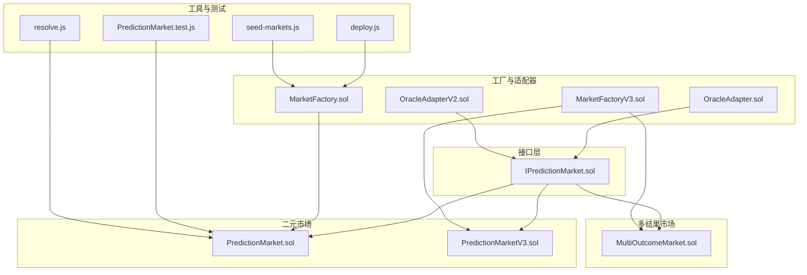
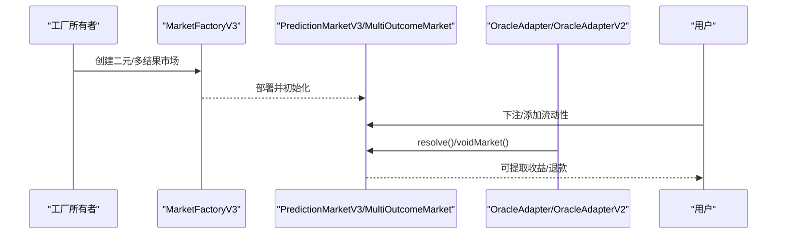
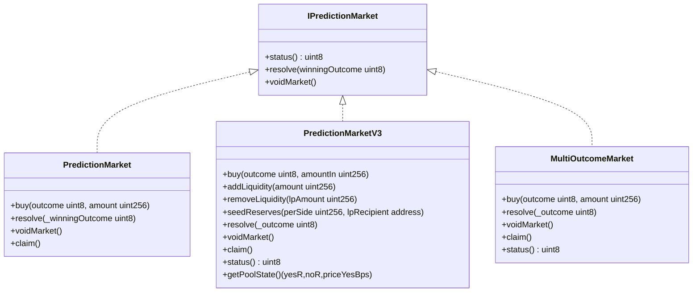

# 市场API

<cite>
**本文引用的文件**
- [IPredictionMarket.sol](file://contracts/interfaces/IPredictionMarket.sol)
- [PredictionMarket.sol](file://contracts/PredictionMarket.sol)
- [PredictionMarketV3.sol](file://contracts/PredictionMarketV3.sol)
- [MultiOutcomeMarket.sol](file://contracts/MultiOutcomeMarket.sol)
- [MarketFactory.sol](file://contracts/MarketFactory.sol)
- [MarketFactoryV3.sol](file://contracts/MarketFactoryV3.sol)
- [OracleAdapter.sol](file://contracts/OracleAdapter.sol)
- [OracleAdapterV2.sol](file://contracts/OracleAdapterV2.sol)
- [PredictionMarket.test.js](file://test/PredictionMarket.test.js)
- [deploy.js](file://scripts/deploy.js)
- [seed-markets.js](file://scripts/seed-markets.js)
- [resolve.js](file://scripts/resolve.js)
- [hardhat.config.js](file://hardhat.config.js)
- [package.json](file://package.json)
</cite>

## 目录
1. [简介](#简介)
2. [项目结构](#项目结构)
3. [核心组件](#核心组件)
4. [架构总览](#架构总览)
5. [详细组件分析](#详细组件分析)
6. [依赖关系分析](#依赖关系分析)
7. [性能与安全考量](#性能与安全考量)
8. [故障排查指南](#故障排查指南)
9. [结论](#结论)
10. [附录：调用示例与最佳实践](#附录调用示例与最佳实践)

## 简介
本文件面向开发者与运营人员，系统化梳理预测市场合约的API规范与实现细节，重点覆盖：
- IPredictionMarket接口的函数规范（status、resolve、voidMarket）
- PredictionMarket与PredictionMarketV3的实现差异与特性
- 多结果市场（MultiOutcomeMarket）的特殊API与参数约束
- 市场状态管理与生命周期操作
- 错误处理、访问控制与安全机制
- 实际调用示例与最佳实践

## 项目结构
该仓库采用按功能模块划分的组织方式，核心合约位于contracts目录，测试与脚本分别在test与scripts目录，便于本地部署与验证。

图表来源
- [IPredictionMarket.sol](file://contracts/interfaces/IPredictionMarket.sol#L4-L8)
- [PredictionMarket.sol](file://contracts/PredictionMarket.sol#L1-L134)
- [PredictionMarketV3.sol](file://contracts/PredictionMarketV3.sol#L1-L200)
- [MultiOutcomeMarket.sol](file://contracts/MultiOutcomeMarket.sol#L1-L113)
- [MarketFactory.sol](file://contracts/MarketFactory.sol#L1-L60)
- [MarketFactoryV3.sol](file://contracts/MarketFactoryV3.sol#L1-L94)
- [OracleAdapter.sol](file://contracts/OracleAdapter.sol#L1-L83)
- [OracleAdapterV2.sol](file://contracts/OracleAdapterV2.sol#L1-L83)
- [PredictionMarket.test.js](file://test/PredictionMarket.test.js#L1-L70)
- [deploy.js](file://scripts/deploy.js#L1-L57)
- [seed-markets.js](file://scripts/seed-markets.js#L1-L34)
- [resolve.js](file://scripts/resolve.js#L1-L20)

章节来源
- [hardhat.config.js](file://hardhat.config.js#L1-L30)
- [package.json](file://package.json#L1-L22)

## 核心组件
- 接口层：IPredictionMarket定义了三类市场共有的生命周期操作API，确保不同版本市场具备统一的外部契约。
- 二元市场实现：
  - PredictionMarket：经典parimutuel二元市场，支持Yes/No两种结果。
  - PredictionMarketV3：基于CPMM的二元市场，引入流动性池、手续费、用户最大投注限制等。
- 多结果市场实现：MultiOutcomeMarket支持2-8个结果，采用parimutuel分配。
- 工厂与适配器：
  - MarketFactory/MarketFactoryV3：负责创建二元或N结果市场。
  - OracleAdapter/OracleAdapterV2：为resolve/void提供权限控制与流程保障（如定时锁、多重签名阈值）。

章节来源
- [IPredictionMarket.sol](file://contracts/interfaces/IPredictionMarket.sol#L4-L8)
- [PredictionMarket.sol](file://contracts/PredictionMarket.sol#L1-L134)
- [PredictionMarketV3.sol](file://contracts/PredictionMarketV3.sol#L1-L200)
- [MultiOutcomeMarket.sol](file://contracts/MultiOutcomeMarket.sol#L1-L113)
- [MarketFactory.sol](file://contracts/MarketFactory.sol#L1-L60)
- [MarketFactoryV3.sol](file://contracts/MarketFactoryV3.sol#L1-L94)
- [OracleAdapter.sol](file://contracts/OracleAdapter.sol#L1-L83)
- [OracleAdapterV2.sol](file://contracts/OracleAdapterV2.sol#L1-L83)

## 架构总览
下图展示了从工厂到市场再到适配器的调用链路与职责分工。

图表来源
- [MarketFactoryV3.sol](file://contracts/MarketFactoryV3.sol#L37-L88)
- [PredictionMarketV3.sol](file://contracts/PredictionMarketV3.sol#L49-L73)
- [MultiOutcomeMarket.sol](file://contracts/MultiOutcomeMarket.sol#L39-L59)
- [OracleAdapter.sol](file://contracts/OracleAdapter.sol#L48-L81)
- [OracleAdapterV2.sol](file://contracts/OracleAdapterV2.sol#L44-L81)

## 详细组件分析

### IPredictionMarket接口规范
- 函数概览
  - status(): external view returns (uint8)
    - 返回值：市场当前状态（Open=0, Resolved=1, Voided=2）
    - 访问修饰：external view
    - 使用场景：查询市场是否可交易、是否已结算或作废
  - resolve(uint8 winningOutcome): external
    - 参数：winningOutcome（有效范围由具体实现决定）
    - 访问修饰：external
    - 使用场景：在Oracle授权后，将市场标记为已解决并指定获胜结果
  - voidMarket(): external
    - 参数：无
    - 访问修饰：external
    - 使用场景：在Oracle授权后，将市场标记为作废，允许用户回退本金

- 错误处理要点
  - 调用resolve/voidMarket时，若市场非Open状态，应触发“not open”类错误
  - 具体实现中可能对winningOutcome范围进行校验（例如二元市场限制0/1）

章节来源
- [IPredictionMarket.sol](file://contracts/interfaces/IPredictionMarket.sol#L4-L8)

### PredictionMarket（二元parimutuel）
- 关键字段与状态
  - 状态枚举：Open、Resolved、Voided
  - 池子：yesPool、noPool
  - 用户余额：yesBalance、noBalance
  - 结果：winningOutcome
  - 访问控制：onlyOracle修饰resolve/voidMarket

- API行为
  - buy(outcome, amount): external
    - 校验：Open且未结束；outcome为0或1；amount>0
    - 逻辑：转账入金，更新对应池与用户余额
  - resolve(uint8 _winningOutcome): external onlyOracle
    - 校验：Open且_winningOutcome合法
    - 逻辑：标记Resolved并记录获胜结果
  - voidMarket(): external onlyOracle
    - 校验：Open
    - 逻辑：标记Voided
  - claim(): external
    - 校验：未领取过；当前状态为Resolved或Voided
    - 逻辑：Resolved时按parimutuel公式计算回报；Voided时退还全部本金

- 支付与结算
  - 报告：Resolved时按总池与赢家池比例返还
  - 回退：Voided时退还yesBalance+noBalance

- 错误处理
  - 非Open状态禁止resolve/voidMarket
  - outcome越界、amount为0、重复claim等均会抛错

章节来源
- [PredictionMarket.sol](file://contracts/PredictionMarket.sol#L11-L134)

### PredictionMarketV3（二元CPMM）
- 关键字段与状态
  - 状态枚举：Open、Resolved、Voided
  - 流动性池：reserveYes、reserveNo、totalLPSupply
  - LP：lpBalance
  - 手续费：feeBps（基点）、collectedFees
  - 用户限制：maxBetPerUser
  - 访问控制：onlyOracle修饰resolve/voidMarket

- API行为
  - buy(outcome, amountIn): external nonReentrant
    - 校验：Open且未结束；outcome合法；amountIn>0；不超过maxBetPerUser
    - 逻辑：收取手续费，按CPMM公式换算份额，更新池与用户余额
  - addLiquidity(amount): external nonReentrant
    - 校验：Open且amount>0
    - 逻辑：按比例注入reserveYes/reserveNo，增发LP
  - removeLiquidity(lpAmount): external nonReentrant
    - 校验：lpAmount>0且余额足够
    - 逻辑：按比例赎回，销毁LP并转出资产
  - seedReserves(perSide, lpRecipient): external
    - 仅工厂调用，用于首次播种流动性
  - resolve(uint8 _outcome): external onlyOracle
    - 校验：Open且_outcome合法
    - 逻辑：标记Resolved并记录获胜结果
  - voidMarket(): external onlyOracle
    - 校验：Open
    - 逻辑：标记Voided
  - claim(): external nonReentrant
    - 校验：未领取过；当前状态为Resolved或Voided
    - 逻辑：Resolved时按CPMM公式计算回报；Voided时退还全部份额对应的资产
  - status(): external view
    - 返回：当前状态（uint8）
  - getPoolState(): external view
    - 返回：reserveYes、reserveNo、价格（以千分之几表示）

- 错误处理
  - 非Open状态禁止resolve/voidMarket
  - 交易重入保护（nonReentrant）
  - 种子池校验（balance充足）

章节来源
- [PredictionMarketV3.sol](file://contracts/PredictionMarketV3.sol#L9-L200)

### MultiOutcomeMarket（N结果parimutuel）
- 关键字段与状态
  - 状态枚举：Open、Resolved、Voided
  - 池子：pool数组（长度为outcomeCount）
  - 用户余额：stake映射（address -> uint8 -> uint256）
  - 结果：winningOutcome
  - 访问控制：onlyOracle修饰resolve/voidMarket

- API行为
  - buy(outcome, amount): external nonReentrant
    - 校验：Open且未结束；outcome < outcomeCount；amount>0
    - 逻辑：扣除手续费后入池，更新对应池与用户余额
  - resolve(uint8 _outcome): external onlyOracle
    - 校验：Open且_outcome < outcomeCount
    - 逻辑：标记Resolved并记录获胜结果
  - voidMarket(): external onlyOracle
    - 校验：Open
    - 逻辑：标记Voided
  - claim(): external nonReentrant
    - 校验：未领取过；当前状态为Resolved或Voided
    - 逻辑：Resolved时按赢家池比例计算回报；Voided时退还该用户所有投注

- 错误处理
  - outcomeCount必须在[2,8]范围内
  - 非Open状态禁止resolve/voidMarket

章节来源
- [MultiOutcomeMarket.sol](file://contracts/MultiOutcomeMarket.sol#L8-L113)

### 工厂与适配器
- MarketFactory/MarketFactoryV3
  - MarketFactory：创建二元市场，设置oracle与collateral
  - MarketFactoryV3：创建二元CPMM与多结果市场，支持暂停、默认费率与最大投注限制
- OracleAdapter/OracleAdapterV2
  - OracleAdapter：单Oracle角色，支持定时锁（timelockDelay）与快速路径resolveNow
  - OracleAdapterV2：多Oracle角色，m-of-n提案与批准机制，满足阈值后执行

章节来源
- [MarketFactory.sol](file://contracts/MarketFactory.sol#L1-L60)
- [MarketFactoryV3.sol](file://contracts/MarketFactoryV3.sol#L1-L94)
- [OracleAdapter.sol](file://contracts/OracleAdapter.sol#L1-L83)
- [OracleAdapterV2.sol](file://contracts/OracleAdapterV2.sol#L1-L83)

## 依赖关系分析
- 继承与混入
  - PredictionMarketV3继承ReentrancyGuard，增强交易安全性
  - MultiOutcomeMarket继承ReentrancyGuard
  - OracleAdapter/OracleAdapterV2使用AccessControl进行权限控制
- 接口契约
  - IPredictionMarket被PredictionMarket、PredictionMarketV3、MultiOutcomeMarket共同实现
- 外部依赖
  - OpenZeppelin ERC20、SafeERC20、ReentrancyGuard、AccessControl、Ownable、Pausable

图表来源
- [IPredictionMarket.sol](file://contracts/interfaces/IPredictionMarket.sol#L4-L8)
- [PredictionMarket.sol](file://contracts/PredictionMarket.sol#L64-L134)
- [PredictionMarketV3.sol](file://contracts/PredictionMarketV3.sol#L92-L200)
- [MultiOutcomeMarket.sol](file://contracts/MultiOutcomeMarket.sol#L65-L113)

## 性能与安全考量
- 重入保护
  - PredictionMarketV3与MultiOutcomeMarket使用nonReentrant修饰关键函数，防止跨调用取款攻击
- 最大投注限制
  - PredictionMarketV3提供maxBetPerUser，有助于控制风险与集中度
- 定时锁与多重签名
  - OracleAdapter通过timelockDelay延迟执行resolve，OracleAdapterV2通过m-of-n提案机制提升治理安全性
- 状态机一致性
  - 所有resolve/voidMarket均要求市场处于Open状态，避免竞态条件

章节来源
- [PredictionMarketV3.sol](file://contracts/PredictionMarketV3.sol#L92-L149)
- [MultiOutcomeMarket.sol](file://contracts/MultiOutcomeMarket.sol#L65-L87)
- [OracleAdapter.sol](file://contracts/OracleAdapter.sol#L48-L75)
- [OracleAdapterV2.sol](file://contracts/OracleAdapterV2.sol#L44-L75)

## 故障排查指南
- 常见错误与定位
  - “not open”：resolve/voidMarket仅可在Open状态下调用
  - “invalid outcome”：winningOutcome超出实现允许范围（二元市场0/1，多结果需小于outcomeCount）
  - “already claimed”：重复领取
  - “nothing to claim”：非可领取状态或无回报
  - “zero amount”/“invalid”：输入金额或结果非法
- 调试建议
  - 使用工厂与适配器脚本进行端到端验证
  - 在测试中复现购买、结算与领取流程
  - 检查状态查询与事件日志确认流程

章节来源
- [PredictionMarket.sol](file://contracts/PredictionMarket.sol#L64-L113)
- [PredictionMarketV3.sol](file://contracts/PredictionMarketV3.sol#L92-L165)
- [MultiOutcomeMarket.sol](file://contracts/MultiOutcomeMarket.sol#L65-L111)
- [PredictionMarket.test.js](file://test/PredictionMarket.test.js#L34-L68)

## 结论
该体系通过清晰的接口契约与多版本实现，覆盖了从简单parimutuel到复杂CPMM与多结果市场的全谱系需求。配合工厂与适配器的权限与治理机制，既保证了灵活性，也强化了安全性与可审计性。建议在生产部署前完成充分的参数校准（费率、最大投注、阈值等）与压力测试。

## 附录：调用示例与最佳实践

### 调用示例
- 部署与种子
  - 运行部署脚本生成合约地址与配置
  - 使用种子脚本批量创建市场
- 解决与作废
  - 通过OracleAdapter或OracleAdapterV2提交resolve/void请求
  - 对于二元市场，resolve参数为0或1
  - 对于多结果市场，resolve参数为0..(outcomeCount-1)

章节来源
- [deploy.js](file://scripts/deploy.js#L1-L57)
- [seed-markets.js](file://scripts/seed-markets.js#L1-L34)
- [resolve.js](file://scripts/resolve.js#L1-L20)
- [OracleAdapter.sol](file://contracts/OracleAdapter.sol#L48-L81)
- [OracleAdapterV2.sol](file://contracts/OracleAdapterV2.sol#L44-L81)

### 最佳实践
- 参数设计
  - 合理设置feeBps与maxBetPerUser，平衡流动性与风控
  - 多结果市场确保outcomeCount在[2,8]区间
- 权限治理
  - 使用OracleAdapterV2的m-of-n机制提升抗审查能力
  - 定期审查timelockDelay与阈值设置
- 测试与监控
  - 在本地网络运行完整流程测试
  - 监控事件日志与状态变化，及时发现异常