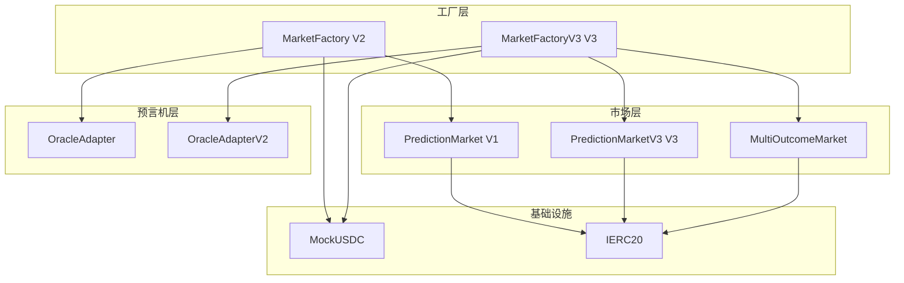
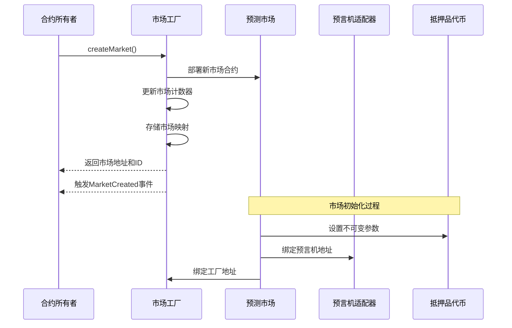
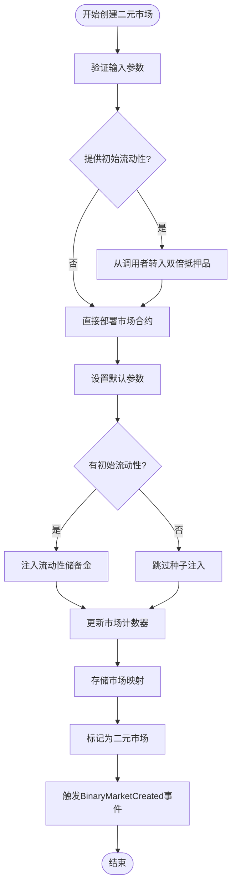
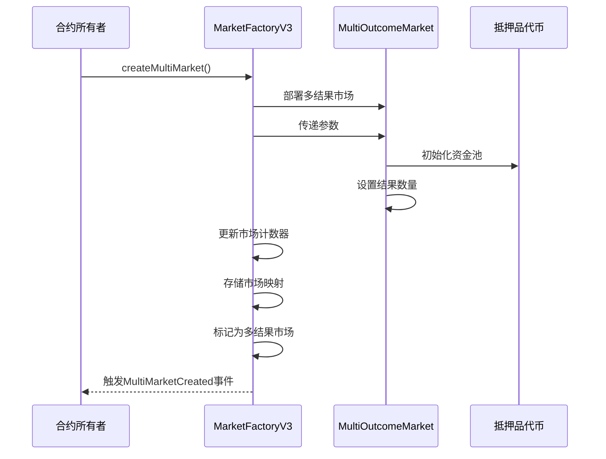
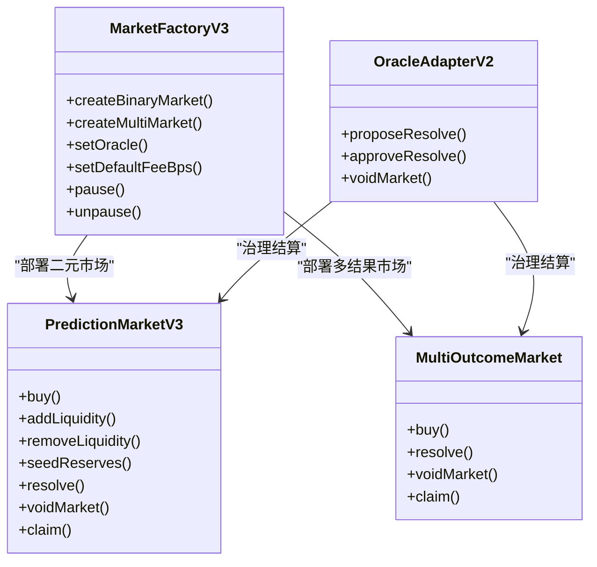
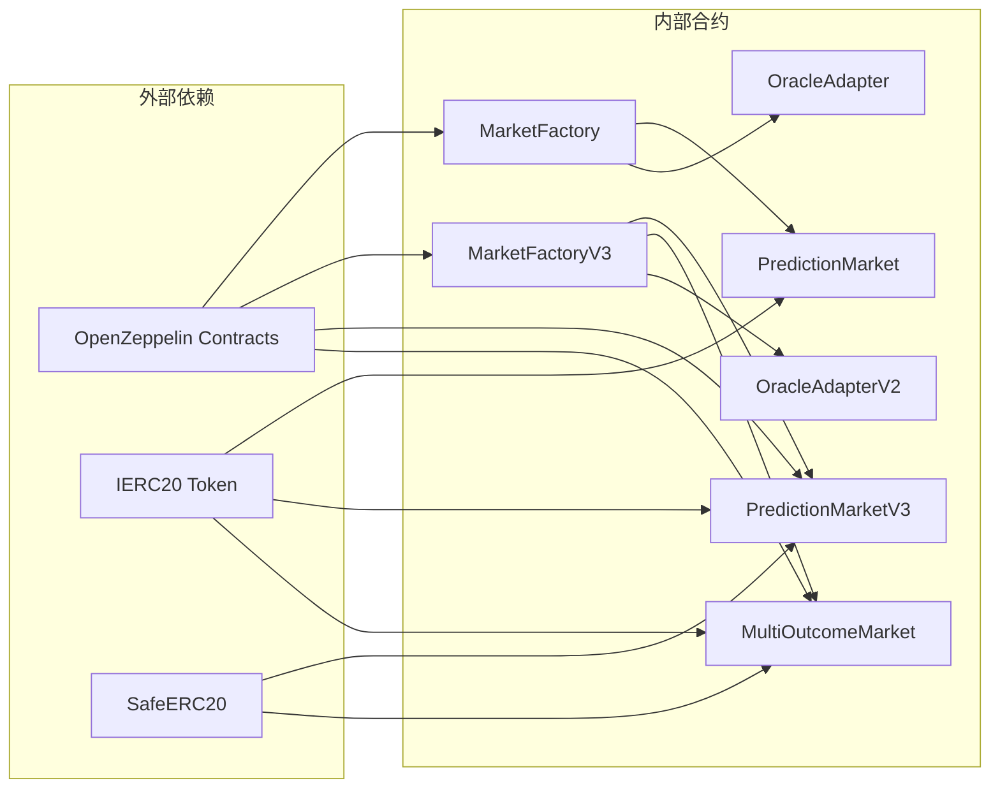

# 市场工厂API

<cite>
**本文档引用的文件**
- [MarketFactory.sol](file://contracts/MarketFactory.sol)
- [MarketFactoryV3.sol](file://contracts/MarketFactoryV3.sol)
- [PredictionMarket.sol](file://contracts/PredictionMarket.sol)
- [PredictionMarketV3.sol](file://contracts/PredictionMarketV3.sol)
- [MultiOutcomeMarket.sol](file://contracts/MultiOutcomeMarket.sol)
- [OracleAdapter.sol](file://contracts/OracleAdapter.sol)
- [OracleAdapterV2.sol](file://contracts/OracleAdapterV2.sol)
- [IPredictionMarket.sol](file://contracts/interfaces/IPredictionMarket.sol)
- [MarketFactory.test.js](file://test/MarketFactory.test.js)
- [deploy.js](file://scripts/deploy.js)
- [deploy-phase3.js](file://scripts/deploy-phase3.js)
</cite>

## 目录
1. [简介](#简介)
2. [项目结构](#项目结构)
3. [核心组件](#核心组件)
4. [架构概览](#架构概览)
5. [详细组件分析](#详细组件分析)
6. [依赖关系分析](#依赖关系分析)
7. [性能考虑](#性能考虑)
8. [故障排除指南](#故障排除指南)
9. [结论](#结论)
10. [附录](#附录)

## 简介

市场工厂合约是PredictionDID项目中的核心基础设施，负责创建和管理各种类型的预测市场。该系统采用工厂模式设计，支持两种主要的市场类型：传统的二元预测市场和基于常数乘积做市商(CPMM)模型的高级市场。

系统包含两个版本的工厂合约：
- **MarketFactory (V2)**：部署传统二元预测市场，使用互池式模型
- **MarketFactoryV3 (V3)**：部署高级预测市场，支持CPMM模型、多结果市场和流动性池

## 项目结构

**图表来源**
- [MarketFactory.sol:1-68](file://contracts/MarketFactory.sol#L1-L68)
- [MarketFactoryV3.sol:1-104](file://contracts/MarketFactoryV3.sol#L1-L104)
- [PredictionMarket.sol:1-145](file://contracts/PredictionMarket.sol#L1-L145)
- [PredictionMarketV3.sol:1-218](file://contracts/PredictionMarketV3.sol#L1-L218)
- [MultiOutcomeMarket.sol:1-124](file://contracts/MultiOutcomeMarket.sol#L1-L124)

**章节来源**
- [MarketFactory.sol:1-68](file://contracts/MarketFactory.sol#L1-L68)
- [MarketFactoryV3.sol:1-104](file://contracts/MarketFactoryV3.sol#L1-L104)

## 核心组件

### MarketFactory (V2) - 传统二元市场工厂

MarketFactory是第一个版本的市场工厂，专门用于部署传统二元预测市场。它继承自OpenZeppelin的Ownable合约，确保只有合约所有者可以创建新市场。

**主要特性：**
- 二元预测市场部署（是/否）
- 互池式资金池模型
- 预言机集成
- 市场计数和映射管理

**关键数据结构：**
- `collateral`: 抵押品代币合约地址（不可变）
- `oracle`: 预言机适配器地址
- `marketCount`: 已创建市场总数
- `markets`: 市场ID到地址的映射

**章节来源**
- [MarketFactory.sol:10-68](file://contracts/MarketFactory.sol#L10-L68)

### MarketFactoryV3 (V3) - 高级市场工厂

MarketFactoryV3是系统的第三个版本，引入了多项增强功能，支持更复杂的市场类型和高级功能。

**主要特性：**
- 支持二元市场和多结果市场
- CPMM（常数乘积做市商）模型
- 流动性池和LP份额管理
- 手续费收集和管理
- 合约暂停功能

**关键数据结构：**
- `defaultFeeBps`: 默认手续费基点数
- `defaultMaxBet`: 默认最大押注金额
- `marketTypes`: 市场类型映射（0=二元V3, 1=多结果）

**章节来源**
- [MarketFactoryV3.sol:12-104](file://contracts/MarketFactoryV3.sol#L12-L104)

## 架构概览

**图表来源**
- [MarketFactory.sol:44-61](file://contracts/MarketFactory.sol#L44-L61)
- [MarketFactoryV3.sol:44-74](file://contracts/MarketFactoryV3.sol#L44-L74)

## 详细组件分析

### MarketFactoryV3 - 二元市场创建流程

**图表来源**
- [MarketFactoryV3.sol:44-74](file://contracts/MarketFactoryV3.sol#L44-L74)

#### 公共函数详解

**createBinaryMarket()**
- **功能**：创建带初始流动性的二元预测市场
- **参数**：
  - `matchRef`: 比赛引用哈希
  - `question`: 预测问题
  - `endTime`: 截止时间
  - `initialLiquidity`: 初始流动性金额
- **返回**：市场地址和ID
- **权限**：仅合约所有者，合约未暂停时可调用

**setOracle()**
- **功能**：更新预言机地址
- **参数**：新预言机地址
- **权限**：仅合约所有者

**setDefaultFeeBps()**
- **功能**：设置默认手续费率
- **参数**：手续费基点数（1bps=0.01%）
- **权限**：仅合约所有者

**章节来源**
- [MarketFactoryV3.sol:44-97](file://contracts/MarketFactoryV3.sol#L44-L97)

### MarketFactoryV3 - 多结果市场创建流程

**图表来源**
- [MarketFactoryV3.sol:76-97](file://contracts/MarketFactoryV3.sol#L76-L97)

#### 多结果市场特性

**createMultiMarket()**
- **功能**：创建多结果预测市场
- **参数**：
  - `matchRef`: 比赛引用哈希
  - `question`: 预测问题
  - `endTime`: 截止时间
  - `outcomeCount`: 结果数量（2-8个）
- **返回**：市场地址和ID
- **权限**：仅合约所有者，合约未暂停时可调用

**章节来源**
- [MarketFactoryV3.sol:76-97](file://contracts/MarketFactoryV3.sol#L76-L97)

### 预言机适配器集成

系统提供两种预言机适配器以满足不同的治理需求：

**OracleAdapter (V1)**
- **时间锁机制**：防止即时结算
- **单签授权**：单一预言机即可执行
- **适用场景**：简单的时间锁需求

**OracleAdapterV2 (V2)**
- **多签机制**：需要m个预言机中的n个批准
- **提案系统**：完整的提案-批准-执行流程
- **适用场景**：去中心化治理和风险控制

**章节来源**
- [OracleAdapter.sol:11-96](file://contracts/OracleAdapter.sol#L11-L96)
- [OracleAdapterV2.sol:11-95](file://contracts/OracleAdapterV2.sol#L11-L95)

### 市场类型对比分析

**图表来源**
- [MarketFactoryV3.sol:14-104](file://contracts/MarketFactoryV3.sol#L14-L104)
- [PredictionMarketV3.sol:12-218](file://contracts/PredictionMarketV3.sol#L12-L218)
- [MultiOutcomeMarket.sol:12-124](file://contracts/MultiOutcomeMarket.sol#L12-L124)
- [OracleAdapterV2.sol:11-95](file://contracts/OracleAdapterV2.sol#L11-L95)

## 依赖关系分析

**图表来源**
- [MarketFactory.sol:6-8](file://contracts/MarketFactory.sol#L6-L8)
- [MarketFactoryV3.sol:6-10](file://contracts/MarketFactoryV3.sol#L6-L10)
- [PredictionMarketV3.sol:6-8](file://contracts/PredictionMarketV3.sol#L6-L8)
- [MultiOutcomeMarket.sol:6-8](file://contracts/MultiOutcomeMarket.sol#L6-L8)

**章节来源**
- [MarketFactory.sol:6-8](file://contracts/MarketFactory.sol#L6-L8)
- [MarketFactoryV3.sol:6-10](file://contracts/MarketFactoryV3.sol#L6-L10)

## 性能考虑

### Gas优化策略

1. **批量操作**：通过工厂合约批量部署市场，减少重复的合约创建开销
2. **状态压缩**：使用映射而非数组存储市场信息，提高查询效率
3. **条件检查**：在函数入口进行参数验证，避免不必要的状态修改
4. **重入保护**：使用ReentrancyGuard防止重入攻击，保护合约状态一致性

### 扩展性设计

- **工厂模式**：易于添加新的市场类型
- **接口抽象**：通过IPredictionMarket接口定义标准行为
- **模块化设计**：预言机适配器可独立升级
- **版本兼容**：V2和V3合约并存，支持渐进式升级

## 故障排除指南

### 常见问题及解决方案

**问题1：市场创建失败**
- **症状**：`createMarket()`或`createBinaryMarket()`抛出异常
- **可能原因**：
  - 抵押品地址为零地址
  - 预言机地址为零地址
  - 截止时间早于当前时间
- **解决方法**：检查输入参数的有效性

**问题2：流动性注入失败**
- **症状**：`seedReserves()`调用失败
- **可能原因**：
  - 合约余额不足
  - 已经初始化过流动性
  - 调用者不是工厂合约
- **解决方法**：确保正确的调用顺序和足够的抵押品余额

**问题3：预言机结算延迟**
- **症状**：`requestResolve()`后无法立即执行
- **可能原因**：时间锁机制生效
- **解决方法**：等待时间锁到期或使用`confirmResolve()`

**章节来源**
- [MarketFactory.sol:30-35](file://contracts/MarketFactory.sol#L30-L35)
- [MarketFactoryV3.sol:83-87](file://contracts/MarketFactoryV3.sol#L83-L87)
- [OracleAdapter.sol:58-78](file://contracts/OracleAdapter.sol#L58-L78)

## 结论

市场工厂合约系统展现了优秀的软件工程实践，通过工厂模式实现了高度模块化的市场创建和管理功能。V3版本相比V2版本，在以下方面有了显著提升：

1. **功能增强**：支持CPMM模型、多结果市场和流动性池
2. **治理改进**：提供多签机制和时间锁选项
3. **安全性提升**：内置重入保护和暂停功能
4. **扩展性设计**：清晰的接口抽象和模块化架构

该系统为预测市场的创建、管理和治理提供了完整的基础设施，适合在各种应用场景中部署和使用。

## 附录

### 部署和使用示例

**V2版本部署流程：**
1. 部署MockUSDC代币
2. 部署OracleAdapter并授予预言机角色
3. 部署MarketFactory并绑定参数
4. 为部署者铸造测试代币
5. 创建第一个预测市场

**V3版本部署流程：**
1. 部署MockUSDC代币
2. 部署OracleAdapterV2并设置多签阈值
3. 部署MarketFactoryV3并设置默认费用
4. 授予预言机角色
5. 创建二元或多元市场

**章节来源**
- [deploy.js:6-53](file://scripts/deploy.js#L6-L53)
- [deploy-phase3.js:5-39](file://scripts/deploy-phase3.js#L5-L39)

### 最佳实践建议

1. **参数验证**：始终验证输入参数的有效性
2. **权限管理**：严格控制合约所有权和角色分配
3. **测试覆盖**：充分测试各种边界情况和异常场景
4. **监控告警**：建立合约状态监控和异常告警机制
5. **升级策略**：制定平滑的合约升级和迁移计划