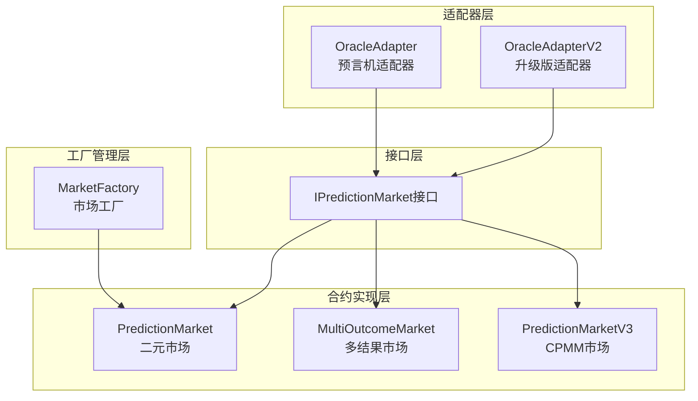
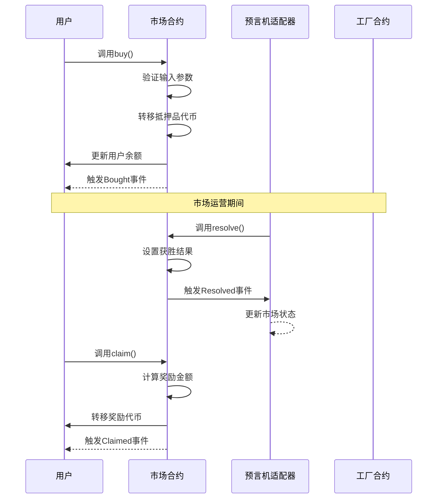
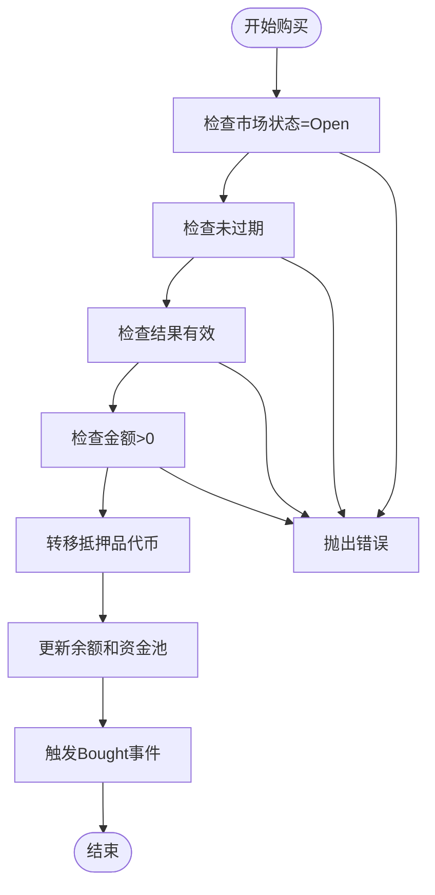
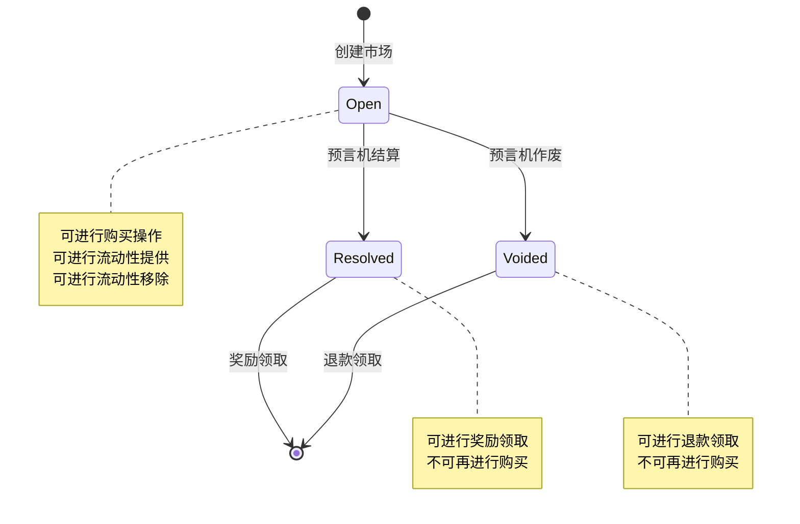
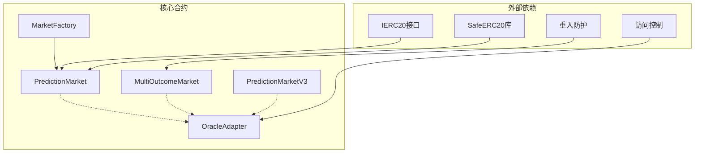

# 预测市场API

<cite>
**本文档引用的文件**
- [IPredictionMarket.sol](file://contracts/interfaces/IPredictionMarket.sol)
- [IPredictionMarket.json](file://artifacts/contracts/interfaces/IPredictionMarket.sol/IPredictionMarket.json)
- [PredictionMarket.sol](file://contracts/PredictionMarket.sol)
- [PredictionMarket.json](file://artifacts/contracts/PredictionMarket.sol/PredictionMarket.json)
- [MultiOutcomeMarket.sol](file://contracts/MultiOutcomeMarket.sol)
- [MultiOutcomeMarket.json](file://artifacts/contracts/MultiOutcomeMarket.sol/MultiOutcomeMarket.json)
- [PredictionMarketV3.sol](file://contracts/PredictionMarketV3.sol)
- [PredictionMarketV3.json](file://artifacts/contracts/PredictionMarketV3.sol/PredictionMarketV3.json)
- [OracleAdapter.sol](file://contracts/OracleAdapter.sol)
- [OracleAdapterV2.sol](file://contracts/OracleAdapterV2.sol)
- [MarketFactory.sol](file://contracts/MarketFactory.sol)
- [PredictionMarket.test.js](file://test/PredictionMarket.test.js)
- [deploy.js](file://scripts/deploy.js)
</cite>

## 目录
1. [简介](#简介)
2. [项目结构](#项目结构)
3. [核心组件](#核心组件)
4. [架构概览](#架构概览)
5. [详细组件分析](#详细组件分析)
6. [依赖关系分析](#依赖关系分析)
7. [性能考虑](#性能考虑)
8. [故障排除指南](#故障排除指南)
9. [结论](#结论)

## 简介
本文件为预测市场合约系统的详细API文档，涵盖IPredictionMarket接口定义、PredictionMarket二元市场、MultiOutcomeMarket多结果市场以及PredictionMarketV3 CPMM市场的完整功能规范。文档详细说明了所有函数签名、参数说明、返回值类型、错误处理策略，并提供了完整的调用示例和市场状态转换流程。

## 项目结构
预测市场系统采用分层架构设计，包含接口定义层、合约实现层、适配器层和工厂管理层：

**图表来源**
- [IPredictionMarket.sol:1-15](file://contracts/interfaces/IPredictionMarket.sol#L1-L15)
- [PredictionMarket.sol:1-145](file://contracts/PredictionMarket.sol#L1-L145)
- [MultiOutcomeMarket.sol:1-124](file://contracts/MultiOutcomeMarket.sol#L1-L124)
- [PredictionMarketV3.sol:1-218](file://contracts/PredictionMarketV3.sol#L1-L218)
- [OracleAdapter.sol:1-96](file://contracts/OracleAdapter.sol#L1-L96)
- [MarketFactory.sol:1-68](file://contracts/MarketFactory.sol#L1-L68)

**章节来源**
- [IPredictionMarket.sol:1-15](file://contracts/interfaces/IPredictionMarket.sol#L1-L15)
- [PredictionMarket.sol:1-145](file://contracts/PredictionMarket.sol#L1-L145)
- [MultiOutcomeMarket.sol:1-124](file://contracts/MultiOutcomeMarket.sol#L1-L124)
- [PredictionMarketV3.sol:1-218](file://contracts/PredictionMarketV3.sol#L1-L218)
- [OracleAdapter.sol:1-96](file://contracts/OracleAdapter.sol#L1-L96)
- [MarketFactory.sol:1-68](file://contracts/MarketFactory.sol#L1-L68)

## 核心组件

### IPredictionMarket接口
IPredictionMarket定义了预测市场合约必须实现的核心接口，确保所有市场实现具有一致的API规范。

**接口方法定义：**
- `status() external view returns (uint8)` - 获取市场当前状态
- `resolve(uint8 winningOutcome) external` - 结算市场，传入获胜结果编号
- `voidMarket() external` - 作废市场，允许用户取回押注

**状态编码规范：**
- 0 = Open（开放中）
- 1 = Resolved（已结算）
- 2 = Voided（已作废）

**章节来源**
- [IPredictionMarket.sol:7-14](file://contracts/interfaces/IPredictionMarket.sol#L7-L14)
- [IPredictionMarket.json:5-38](file://artifacts/contracts/interfaces/IPredictionMarket.sol/IPredictionMarket.json#L5-L38)

### PredictionMarket（二元市场）
PredictionMarket实现了经典的二元预测市场，支持Yes/No两种结果的互池式投注。

**核心特性：**
- 二元结果支持（0=Yes, 1=No）
- 互池式资金管理
- 预言机权限控制
- 安全的ERC20转账

**关键数据结构：**
- `yesPool/noPool`: 各结果资金池
- `yesBalance/noBalance`: 用户押注余额
- `collateral`: 抵押品代币合约
- `oracle`: 预言机地址

**章节来源**
- [PredictionMarket.sol:11-145](file://contracts/PredictionMarket.sol#L11-L145)
- [PredictionMarket.json:116-183](file://artifacts/contracts/PredictionMarket.sol/PredictionMarket.json#L116-L183)

### MultiOutcomeMarket（多结果市场）
MultiOutcomeMarket扩展支持2-8个结果的预测市场，引入手续费机制和更复杂的状态管理。

**核心特性：**
- 支持2-8个结果
- 手续费基点数（bps）机制
- 重入攻击防护
- 动态资金池管理

**关键数据结构：**
- `pool[]`: 各结果资金池数组
- `stake`: 用户多维度押注映射
- `feeBps`: 手续费率
- `outcomeCount`: 结果数量

**章节来源**
- [MultiOutcomeMarket.sol:12-124](file://contracts/MultiOutcomeMarket.sol#L12-L124)
- [MultiOutcomeMarket.json:118-185](file://artifacts/contracts/MultiOutcomeMarket.sol/MultiOutcomeMarket.json#L118-L185)

### PredictionMarketV3（CPMM市场）
PredictionMarketV3采用常数乘积市场做市商（CPMM）模型，支持流动性提供和复杂的资金管理。

**核心特性：**
- CPMM流动性池模型
- 流动性份额管理
- 最大押注限额
- 手续费收集和分配

**关键数据结构：**
- `reserveYes/reserveNo`: 流动性储备金
- `lpBalance`: LP份额余额
- `collectedFees`: 手续费总额
- `maxBetPerUser`: 用户最大押注

**章节来源**
- [PredictionMarketV3.sol:12-218](file://contracts/PredictionMarketV3.sol#L12-L218)
- [PredictionMarketV3.json:173-240](file://artifacts/contracts/PredictionMarketV3.sol/PredictionMarketV3.json#L173-L240)

## 架构概览

预测市场系统采用分层架构，通过预言机适配器统一管理市场结算流程：

**图表来源**
- [OracleAdapter.sol:58-87](file://contracts/OracleAdapter.sol#L58-L87)
- [PredictionMarket.sol:71-88](file://contracts/PredictionMarket.sol#L71-L88)
- [PredictionMarketV3.sol:101-120](file://contracts/PredictionMarketV3.sol#L101-L120)

**章节来源**
- [OracleAdapter.sol:1-96](file://contracts/OracleAdapter.sol#L1-L96)
- [MarketFactory.sol:43-61](file://contracts/MarketFactory.sol#L43-L61)

## 详细组件分析

### IPredictionMarket接口详解

#### 方法签名与参数
- `status()`: 无参数，返回uint8状态码
- `resolve(uint8 winningOutcome)`: 接收获胜结果编号（0或1）
- `voidMarket()`: 无参数，直接作废市场

#### 返回值说明
- `status()`: 返回0-2的数字编码
- `resolve()`: 无返回值（状态变更）
- `voidMarket()`: 无返回值（状态变更）

**章节来源**
- [IPredictionMarket.sol:8-13](file://contracts/interfaces/IPredictionMarket.sol#L8-L13)
- [IPredictionMarket.json:14-38](file://artifacts/contracts/interfaces/IPredictionMarket.sol/IPredictionMarket.json#L14-L38)

### PredictionMarket核心功能

#### 购买操作（buy）
**函数签名：** `buy(uint8 outcome, uint256 amount) external`

**参数说明：**
- `outcome`: 押注结果（0=Yes, 1=No）
- `amount`: 押注金额（必须>0）

**处理流程：**
1. 验证市场状态为Open且未过期
2. 验证结果编号有效性和金额大于0
3. 转移抵押品代币到合约地址
4. 更新对应资金池和用户余额
5. 触发Bought事件

**图表来源**
- [PredictionMarket.sol:71-88](file://contracts/PredictionMarket.sol#L71-L88)

#### 市场结算（resolve）
**函数签名：** `resolve(uint8 _winningOutcome) external onlyOracle`

**权限要求：** 仅预言机可调用

**处理逻辑：**
1. 验证市场状态为Open
2. 验证获胜结果有效
3. 设置市场状态为Resolved
4. 记录获胜结果
5. 触发Resolved事件

#### 市场作废（voidMarket）
**函数签名：** `voidMarket() external onlyOracle`

**处理逻辑：**
1. 验证市场状态为Open
2. 设置市场状态为Voided
3. 触发MarketVoided事件

#### 奖励领取（claim）
**函数签名：** `claim() external`

**处理流程：**
1. 验证用户未领取过奖励
2. 根据市场状态计算奖励：
   - Resolved: 按用户押注占比分配总池
   - Voided: 退还用户全部押注
3. 验证奖励金额>0
4. 标记用户已领取
5. 转移奖励代币
6. 触发Claimed事件

**章节来源**
- [PredictionMarket.sol:70-145](file://contracts/PredictionMarket.sol#L70-L145)

### MultiOutcomeMarket核心功能

#### 多结果购买（buy）
**函数签名：** `buy(uint8 outcome, uint256 amount) external nonReentrant`

**手续费机制：**
- 手续费 = 金额 × (feeBps/10000)
- 实际注入 = 金额 - 手续费
- 资金池增加实际注入金额

**数据结构：**
- `pool[outcome]`: 对应结果资金池
- `stake[msg.sender][outcome]`: 用户在该结果的押注

#### 多结果结算（resolve）
**函数签名：** `resolve(uint8 _outcome) external onlyOracle`

**奖励计算：**
- 总池 = 所有结果资金池之和
- 用户奖励 = 用户获胜结果押注 × (总池/获胜结果池)

**章节来源**
- [MultiOutcomeMarket.sol:72-124](file://contracts/MultiOutcomeMarket.sol#L72-L124)

### PredictionMarketV3核心功能

#### CPMM购买（buy）
**函数签名：** `buy(uint8 outcome, uint256 amountIn) external nonReentrant`

**CPMM恒定乘积公式：**
- k = reserveYes × reserveNo（常数）
- sharesOut = net × reserveX / (reserveY + net)
- 其中net = amountIn × (1 - feeBps/10000)

**流动性管理：**
- `reserveYes`: 是方储备金
- `reserveNo`: 否方储备金
- `totalLPSupply`: LP总供应量

#### 流动性提供（addLiquidity）
**函数签名：** `addLiquidity(uint256 amount) external nonReentrant`

**处理逻辑：**
1. 平均分配到两个方向的储备金
2. 增加LP份额和总供应量
3. 触发LiquidityAdded事件

#### 流动性移除（removeLiquidity）
**函数签名：** `removeLiquidity(uint256 lpAmount) external nonReentrant`

**计算公式：**
- 可取回金额 = lpAmount × (reserveYes/totalLPSupply) + lpAmount × (reserveNo/totalLPSupply)

**章节来源**
- [PredictionMarketV3.sol:100-146](file://contracts/PredictionMarketV3.sol#L100-L146)

### 市场状态转换

**图表来源**
- [PredictionMarket.sol:14-19](file://contracts/PredictionMarket.sol#L14-L19)
- [MultiOutcomeMarket.sol:15-17](file://contracts/MultiOutcomeMarket.sol#L15-L17)
- [PredictionMarketV3.sol:15-17](file://contracts/PredictionMarketV3.sol#L15-L17)

## 依赖关系分析

### 组件间依赖关系

**图表来源**
- [PredictionMarket.sol:6-8](file://contracts/PredictionMarket.sol#L6-L8)
- [MultiOutcomeMarket.sol:6-8](file://contracts/MultiOutcomeMarket.sol#L6-L8)
- [OracleAdapter.sol:6](file://contracts/OracleAdapter.sol#L6)
- [MarketFactory.sol:6-8](file://contracts/MarketFactory.sol#L6-L8)

### 错误处理策略

**通用错误类型：**
- `not open`: 市场状态不正确
- `ended`: 市场已过期
- `invalid outcome`: 结果编号无效
- `zero amount`: 押注金额为0
- `already claimed`: 重复领取奖励
- `not oracle`: 非预言机调用

**章节来源**
- [PredictionMarket.sol:71-123](file://contracts/PredictionMarket.sol#L71-L123)
- [MultiOutcomeMarket.sol:72-122](file://contracts/MultiOutcomeMarket.sol#L72-L122)
- [PredictionMarketV3.sol:100-179](file://contracts/PredictionMarketV3.sol#L100-L179)

## 性能考虑

### Gas优化策略
1. **批量操作支持**: MultiOutcomeMarket支持单次交易处理多个结果
2. **状态缓存**: PredictionMarketV3使用本地变量减少存储读取
3. **条件检查**: 早期返回避免不必要的计算
4. **数组优化**: MultiOutcomeMarket预分配固定大小数组

### 安全性考虑
1. **重入攻击防护**: MultiOutcomeMarket和PredictionMarketV3使用ReentrancyGuard
2. **权限控制**: OracleAdapter使用AccessControl管理角色
3. **输入验证**: 严格的参数验证防止恶意输入
4. **时间锁机制**: OracleAdapter支持可配置的时间锁延迟

## 故障排除指南

### 常见问题及解决方案

**问题1：购买失败**
- 检查市场状态是否为Open
- 确认截止时间是否已过
- 验证押注金额是否大于0
- 确认用户是否有足够的代币余额

**问题2：结算失败**
- 确认调用者具有预言机权限
- 检查市场状态必须为Open
- 验证获胜结果编号有效

**问题3：领取奖励失败**
- 确认市场已完成结算或作废
- 检查用户是否已领取过奖励
- 验证用户在相应结果上有押注

**章节来源**
- [PredictionMarket.test.js:36-76](file://test/PredictionMarket.test.js#L36-L76)

### 调试建议
1. 使用事件日志跟踪状态变化
2. 检查合约余额和用户余额
3. 验证时间戳和截止时间
4. 确认权限角色分配

## 结论

预测市场系统提供了完整的去中心化预测市场基础设施，支持多种市场模型以满足不同场景需求。通过标准化的IPredictionMarket接口，系统确保了合约间的兼容性和互操作性。关键特性包括：

1. **灵活的市场模型**: 从简单的二元市场到复杂的CPMM模型
2. **完善的安全机制**: 权限控制、重入防护、时间锁机制
3. **透明的治理**: 通过工厂合约和适配器实现集中管理
4. **可扩展性**: 支持多结果市场和流动性提供

该系统为构建去中心化预测市场应用提供了坚实的技术基础，适合用于体育赛事、政治事件、经济指标等各种预测场景。