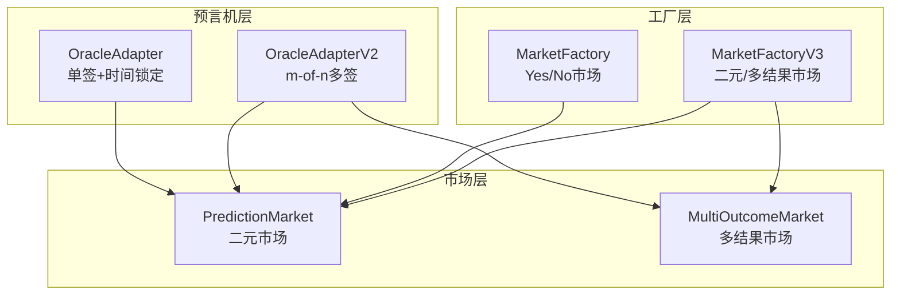
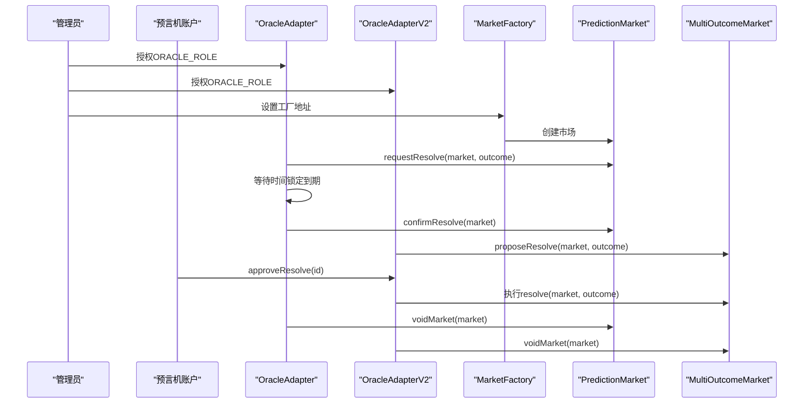
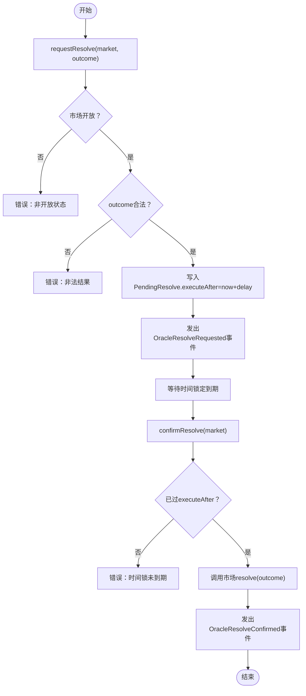
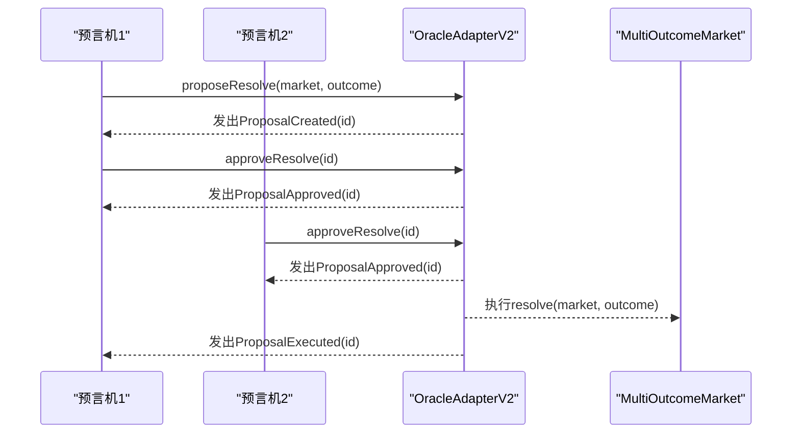
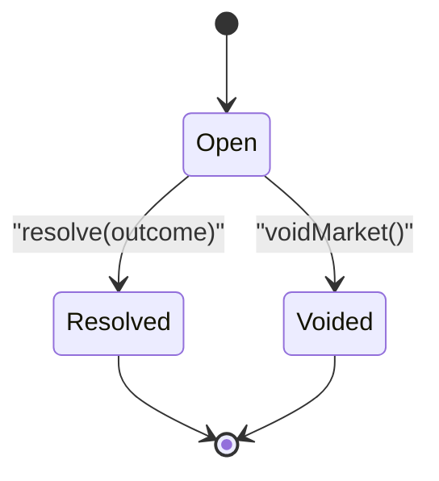
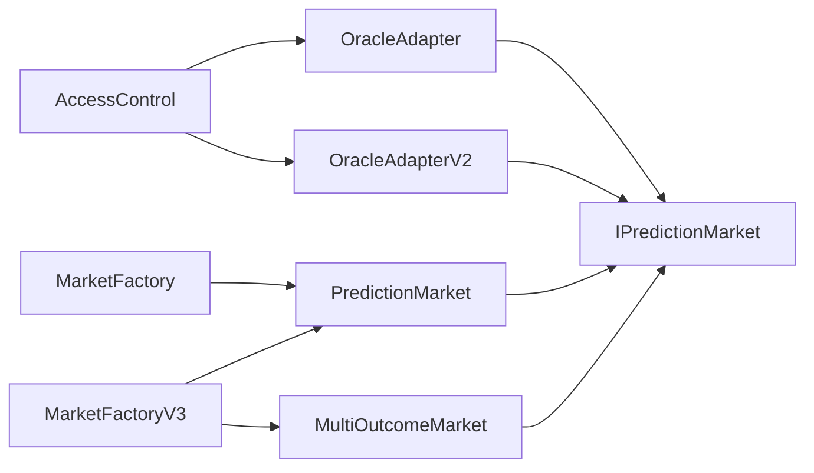

# 预言机API

<cite>
**本文引用的文件**
- [OracleAdapter.sol](file://contracts/OracleAdapter.sol)
- [OracleAdapterV2.sol](file://contracts/OracleAdapterV2.sol)
- [IPredictionMarket.sol](file://contracts/interfaces/IPredictionMarket.sol)
- [PredictionMarket.sol](file://contracts/PredictionMarket.sol)
- [MultiOutcomeMarket.sol](file://contracts/MultiOutcomeMarket.sol)
- [MarketFactory.sol](file://contracts/MarketFactory.sol)
- [MarketFactoryV3.sol](file://contracts/MarketFactoryV3.sol)
- [OracleAdapter.test.js](file://test/OracleAdapter.test.js)
- [Phase3.test.js](file://test/Phase3.test.js)
- [deploy.js](file://scripts/deploy.js)
- [deploy-phase3.js](file://scripts/deploy-phase3.js)
- [OracleAdapter.json](file://artifacts/contracts/OracleAdapter.sol/OracleAdapter.json)
- [OracleAdapterV2.json](file://artifacts/contracts/OracleAdapterV2.sol/OracleAdapterV2.json)
</cite>

## 目录
1. [简介](#简介)
2. [项目结构](#项目结构)
3. [核心组件](#核心组件)
4. [架构总览](#架构总览)
5. [详细组件分析](#详细组件分析)
6. [依赖关系分析](#依赖关系分析)
7. [性能与可扩展性](#性能与可扩展性)
8. [故障排查指南](#故障排查指南)
9. [结论](#结论)
10. [附录：API参考与示例](#附录api参考与示例)

## 简介
本文件系统化梳理预言机适配器（OracleAdapter 与 OracleAdapterV2）的API设计与使用方式，覆盖以下关键主题：
- 时间锁定机制的请求/确认流程与参数约束
- 多签名共识（m-of-n）的提案与审批流程
- 权限模型与角色管理（AccessControl）
- 市场“解决”与“作废”的完整状态转换
- 预言机注册、验证与执行的端到端接口
- 完整函数签名、参数说明与返回值定义
- 实际调用示例与安全注意事项
- 升级机制与向后兼容策略

## 项目结构
本项目围绕“市场工厂—市场合约—预言机适配器—预测市场接口”构建，OracleAdapter与OracleAdapterV2分别提供两种不同的预言机执行路径：
- OracleAdapter：单签+时间锁定（request/confirm/resolveNow）
- OracleAdapterV2：多签提案（propose/approve/execute）

图表来源
- [OracleAdapter.sol](file://contracts/OracleAdapter.sol#L1-L83)
- [OracleAdapterV2.sol](file://contracts/OracleAdapterV2.sol#L1-L83)
- [MarketFactory.sol](file://contracts/MarketFactory.sol#L1-L60)
- [MarketFactoryV3.sol](file://contracts/MarketFactoryV3.sol#L1-L94)
- [PredictionMarket.sol](file://contracts/PredictionMarket.sol#L1-L134)
- [MultiOutcomeMarket.sol](file://contracts/MultiOutcomeMarket.sol#L1-L113)

章节来源
- [OracleAdapter.sol](file://contracts/OracleAdapter.sol#L1-L83)
- [OracleAdapterV2.sol](file://contracts/OracleAdapterV2.sol#L1-L83)
- [MarketFactory.sol](file://contracts/MarketFactory.sol#L1-L60)
- [MarketFactoryV3.sol](file://contracts/MarketFactoryV3.sol#L1-L94)
- [PredictionMarket.sol](file://contracts/PredictionMarket.sol#L1-L134)
- [MultiOutcomeMarket.sol](file://contracts/MultiOutcomeMarket.sol#L1-L113)

## 核心组件
- OracleAdapter（单签+时间锁定）
  - 角色：DEFAULT_ADMIN_ROLE、ORACLE_ROLE
  - 关键状态：timelockDelay、pending[market]
  - 关键事件：OracleResolveRequested、OracleResolveConfirmed、MarketVoided
  - 关键函数：setTimelockDelay、setFactory、grantOracle、requestResolve、confirmResolve、resolveNow、voidMarket

- OracleAdapterV2（m-of-n多签）
  - 角色：DEFAULT_ADMIN_ROLE、ORACLE_ROLE
  - 关键状态：threshold、proposalCount、proposals[id]、approved[id][oracle]
  - 关键事件：ProposalCreated、ProposalApproved、ProposalExecuted、MarketVoided
  - 关键函数：setThreshold、grantOracle、proposeResolve、approveResolve、voidMarket

- 预言机接口与市场合约
  - IPredictionMarket：status()、resolve(outcome)、voidMarket()
  - PredictionMarket：onlyOracle修饰器、resolve/voidMarket/claim
  - MultiOutcomeMarket：支持2-8结果，resolve/voidMarket/claim

章节来源
- [OracleAdapter.sol](file://contracts/OracleAdapter.sol#L8-L83)
- [OracleAdapterV2.sol](file://contracts/OracleAdapterV2.sol#L8-L83)
- [IPredictionMarket.sol](file://contracts/interfaces/IPredictionMarket.sol#L4-L8)
- [PredictionMarket.sol](file://contracts/PredictionMarket.sol#L39-L95)
- [MultiOutcomeMarket.sol](file://contracts/MultiOutcomeMarket.sol#L34-L87)

## 架构总览
预言机适配器通过AccessControl进行权限控制，仅持有ORACLE_ROLE的账户可发起resolve或void操作；市场合约通过onlyOracle修饰器确保只有授权的预言机能改变状态。

图表来源
- [OracleAdapter.sol](file://contracts/OracleAdapter.sol#L48-L81)
- [OracleAdapterV2.sol](file://contracts/OracleAdapterV2.sol#L44-L81)
- [MarketFactory.sol](file://contracts/MarketFactory.sol#L37-L54)
- [PredictionMarket.sol](file://contracts/PredictionMarket.sol#L83-L95)
- [MultiOutcomeMarket.sol](file://contracts/MultiOutcomeMarket.sol#L76-L87)

## 详细组件分析

### OracleAdapter（单签+时间锁定）
- 角色与权限
  - DEFAULT_ADMIN_ROLE：可设置时间锁、工厂、授权ORACLE_ROLE
  - ORACLE_ROLE：可发起resolve/void
- 时间锁定流程
  - requestResolve(market, outcome)：校验市场开放且outcome合法，记录PendingResolve.executeAfter为当前时间+timelockDelay，并发出请求事件
  - confirmResolve(market)：校验存在未完成的pending且已过executeAfter，调用市场合约resolve并发出确认事件
  - resolveNow(market, outcome)：当timelockDelay==0时，直接resolve，用于快速路径
  - voidMarket(market)：在市场开放状态下直接void，触发退款逻辑
- 数据结构
  - PendingResolve：包含outcome、executeAfter、active
  - mapping(address => PendingResolve) pending

图表来源
- [OracleAdapter.sol](file://contracts/OracleAdapter.sol#L48-L67)

章节来源
- [OracleAdapter.sol](file://contracts/OracleAdapter.sol#L8-L83)
- [IPredictionMarket.sol](file://contracts/interfaces/IPredictionMarket.sol#L4-L8)
- [PredictionMarket.sol](file://contracts/PredictionMarket.sol#L83-L89)

### OracleAdapterV2（m-of-n多签）
- 角色与权限
  - DEFAULT_ADMIN_ROLE：可设置阈值、授权ORACLE_ROLE
  - ORACLE_ROLE：可发起提案与审批
- 多签流程
  - proposeResolve(market, outcome)：生成新提案id，自动批准自身，发出ProposalCreated事件
  - approveResolve(id)：对提案进行审批，若累计审批数达到threshold则执行resolve
  - _approve(id)/_execute(id)：内部实现审批与执行
  - voidMarket(market)：在市场开放状态下void
- 数据结构
  - Proposal：包含market、outcome、approvals、executed
  - mapping(uint256 => Proposal) proposals
  - mapping(uint256 => mapping(address => bool)) approved

图表来源
- [OracleAdapterV2.sol](file://contracts/OracleAdapterV2.sol#L44-L75)
- [MultiOutcomeMarket.sol](file://contracts/MultiOutcomeMarket.sol#L76-L81)

章节来源
- [OracleAdapterV2.sol](file://contracts/OracleAdapterV2.sol#L8-L83)
- [IPredictionMarket.sol](file://contracts/interfaces/IPredictionMarket.sol#L4-L8)
- [MultiOutcomeMarket.sol](file://contracts/MultiOutcomeMarket.sol#L34-L87)

### 市场状态与解决流程
- PredictionMarket状态机
  - Open → Resolved 或 Open → Voided
  - onlyOracle修饰器限制resolve/void
  - claim根据Resolved或Voided计算赔付
- MultiOutcomeMarket状态机
  - 支持2-8结果，Open → Resolved 或 Open → Voided
  - claim按获胜池与总池比例计算

图表来源
- [PredictionMarket.sol](file://contracts/PredictionMarket.sol#L11-L24)
- [MultiOutcomeMarket.sol](file://contracts/MultiOutcomeMarket.sol#L12-L27)

章节来源
- [PredictionMarket.sol](file://contracts/PredictionMarket.sol#L83-L113)
- [MultiOutcomeMarket.sol](file://contracts/MultiOutcomeMarket.sol#L76-L111)

## 依赖关系分析
- OracleAdapter/OracleAdapterV2依赖
  - AccessControl：角色管理
  - IPredictionMarket：resolve/void接口
- MarketFactory/MarketFactoryV3依赖
  - Ownable/AccessControl：所有权与权限
  - 预言机适配器：作为oracle地址注入市场
- 市场合约依赖
  - onlyOracle修饰器：限制resolve/void调用者
  - SafeERC20：代币转账安全封装

图表来源
- [OracleAdapter.sol](file://contracts/OracleAdapter.sol#L4-L5)
- [OracleAdapterV2.sol](file://contracts/OracleAdapterV2.sol#L4-L5)
- [MarketFactory.sol](file://contracts/MarketFactory.sol#L4-L6)
- [MarketFactoryV3.sol](file://contracts/MarketFactoryV3.sol#L4-L8)
- [IPredictionMarket.sol](file://contracts/interfaces/IPredictionMarket.sol#L4-L8)

章节来源
- [OracleAdapter.sol](file://contracts/OracleAdapter.sol#L4-L5)
- [OracleAdapterV2.sol](file://contracts/OracleAdapterV2.sol#L4-L5)
- [MarketFactory.sol](file://contracts/MarketFactory.sol#L4-L6)
- [MarketFactoryV3.sol](file://contracts/MarketFactoryV3.sol#L4-L8)
- [IPredictionMarket.sol](file://contracts/interfaces/IPredictionMarket.sol#L4-L8)

## 性能与可扩展性
- 时间锁定与多签的权衡
  - OracleAdapter：单签+时间锁，延迟确定性高，适合低频、高风险场景
  - OracleAdapterV2：多签共识，抗审查性强，适合高频、高共识场景
- 合约复杂度
  - OracleAdapterV2引入提案映射与审批映射，空间复杂度随oracle数量线性增长
- 费用与gas
  - 多签路径涉及多次存储写入（提案、审批），gas消耗高于单签路径

[本节为通用性能讨论，不直接分析具体文件]

## 故障排查指南
- 常见错误与定位
  - timelock：在时间锁未到期前调用confirmResolve会失败
  - not open：resolve/void仅能在市场处于Open状态时调用
  - invalid outcome：OracleAdapter仅支持0/1；OracleAdapterV2支持更高上限
  - threshold：多签提案需达到阈值才执行
- 测试用例参考
  - OracleAdapter时间锁流程与void退款
  - OracleAdapterV2多签阈值生效

章节来源
- [OracleAdapter.test.js](file://test/OracleAdapter.test.js#L6-L25)
- [Phase3.test.js](file://test/Phase3.test.js#L52-L72)

## 结论
- OracleAdapter提供简单可靠的时间锁定路径，适合快速解决与延迟确定性需求
- OracleAdapterV2提供强共识的多签路径，适合需要多方参与与抗审查的场景
- 两者均通过AccessControl严格限定权限，结合onlyOracle修饰器保证市场状态变更的安全性
- 建议根据业务风险与共识成本选择适配器版本，并在部署时明确阈值与时间锁参数

[本节为总结性内容，不直接分析具体文件]

## 附录：API参考与示例

### OracleAdapter（单签+时间锁定）
- 角色
  - DEFAULT_ADMIN_ROLE：管理员
  - ORACLE_ROLE：预言机
- 函数与事件
  - setTimelockDelay(delay)
  - setFactory(factory)
  - grantOracle(account)
  - requestResolve(market, outcome)
  - confirmResolve(market)
  - resolveNow(market, outcome)
  - voidMarket(market)
  - 事件：OracleResolveRequested、OracleResolveConfirmed、MarketVoided
- 参数与返回
  - delay：时间锁秒数（无时间锁时可设为0）
  - factory：工厂地址（用于工厂绑定）
  - account：授权账户
  - market：市场合约地址
  - outcome：0/1（二元市场）
- 调用示例（步骤说明）
  - 部署：使用部署脚本设置时间锁与工厂
  - 授权：管理员授予预言机ORACLE_ROLE
  - 请求：预言机调用requestResolve(market, outcome)
  - 等待：等待时间锁到期
  - 确认：预言机调用confirmResolve(market)
  - 作废：若市场异常，预言机调用voidMarket(market)

章节来源
- [OracleAdapter.sol](file://contracts/OracleAdapter.sol#L30-L81)
- [OracleAdapter.json](file://artifacts/contracts/OracleAdapter.sol/OracleAdapter.json#L1-L298)
- [deploy.js](file://scripts/deploy.js#L15-L31)
- [OracleAdapter.test.js](file://test/OracleAdapter.test.js#L6-L25)

### OracleAdapterV2（m-of-n多签）
- 角色
  - DEFAULT_ADMIN_ROLE：管理员
  - ORACLE_ROLE：预言机
- 函数与事件
  - setThreshold(t)
  - grantOracle(account)
  - proposeResolve(market, outcome) → 返回提案id
  - approveResolve(id)
  - voidMarket(market)
  - 事件：ProposalCreated、ProposalApproved、ProposalExecuted、MarketVoided
- 参数与返回
  - t：阈值（必须大于0）
  - account：授权账户
  - market：市场合约地址
  - outcome：0..7（多结果市场支持更高上限）
- 调用示例（步骤说明）
  - 部署：使用部署脚本设置阈值与工厂
  - 授权：管理员授予多个预言机ORACLE_ROLE
  - 提案：预言机调用proposeResolve(market, outcome)
  - 审批：每个预言机调用approveResolve(id)
  - 执行：当审批数达到阈值，自动执行resolve
  - 作废：若市场异常，预言机调用voidMarket(market)

章节来源
- [OracleAdapterV2.sol](file://contracts/OracleAdapterV2.sol#L29-L81)
- [OracleAdapterV2.json](file://artifacts/contracts/OracleAdapterV2.sol/OracleAdapterV2.json#L1-L298)
- [deploy-phase3.js](file://scripts/deploy-phase3.js#L14-L22)
- [Phase3.test.js](file://test/Phase3.test.js#L52-L72)

### 预言机接口与市场交互
- 接口
  - IPredictionMarket：status()、resolve(outcome)、voidMarket()
- 市场状态
  - PredictionMarket：Open → Resolved/Voided
  - MultiOutcomeMarket：Open → Resolved/Voided
- 调用顺序
  - 预言机调用resolve/void
  - 用户调用claim获取赔付

章节来源
- [IPredictionMarket.sol](file://contracts/interfaces/IPredictionMarket.sol#L4-L8)
- [PredictionMarket.sol](file://contracts/PredictionMarket.sol#L83-L113)
- [MultiOutcomeMarket.sol](file://contracts/MultiOutcomeMarket.sol#L76-L111)

### 安全考虑
- 权限最小化：仅授予必要账户ORACLE_ROLE
- 阈值设置：OracleAdapterV2的threshold应基于共识成本与安全性权衡
- 时间锁配置：OracleAdapter的timelockDelay应满足观察期与争议期需求
- 只有预言机可调用：市场合约通过onlyOracle保护resolve/void
- 多签路径避免单点故障：OracleAdapterV2提升抗审查能力
- 测试覆盖：参考测试用例验证时间锁与多签阈值行为

章节来源
- [OracleAdapter.sol](file://contracts/OracleAdapter.sol#L36-L46)
- [OracleAdapterV2.sol](file://contracts/OracleAdapterV2.sol#L35-L42)
- [OracleAdapter.test.js](file://test/OracleAdapter.test.js#L6-L25)
- [Phase3.test.js](file://test/Phase3.test.js#L52-L72)

### 升级机制与向后兼容
- 当前版本
  - OracleAdapter：单签+时间锁
  - OracleAdapterV2：多签提案
- 升级建议
  - 通过新的适配器版本替换旧版本，保持工厂与市场合约不变
  - 在部署脚本中切换oracle地址，确保平滑迁移
  - 对于多结果市场，优先采用OracleAdapterV2以获得更广的结果支持
- 兼容性
  - 市场合约接口保持一致（resolve/void/status），适配器升级不影响市场逻辑

章节来源
- [MarketFactory.sol](file://contracts/MarketFactory.sol#L32-L35)
- [MarketFactoryV3.sol](file://contracts/MarketFactoryV3.sol#L34-L36)
- [deploy.js](file://scripts/deploy.js#L25-L31)
- [deploy-phase3.js](file://scripts/deploy-phase3.js#L18-L22)